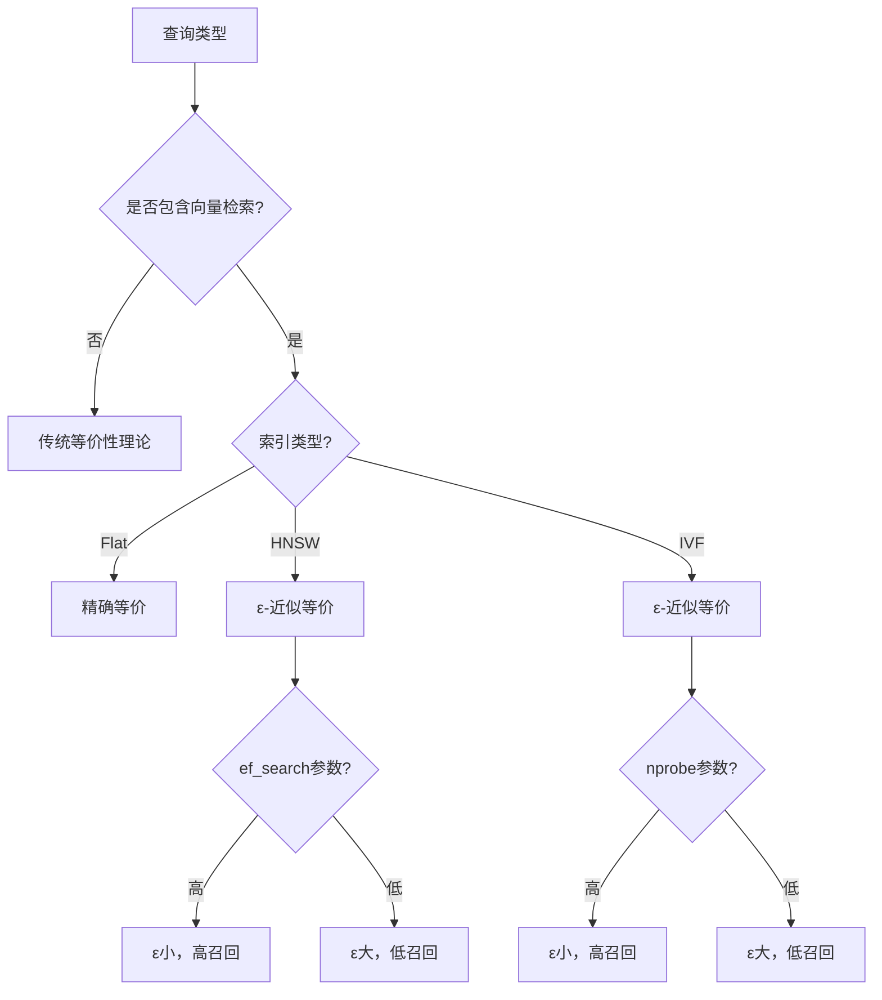

# 查询等价性理论

> **创建日期**：2025-01-15
> **最后更新**：2025-12-01
> **版本**：v2.0.0
> **难度**：⭐⭐⭐⭐⭐
> **应用场景**：查询优化、查询重写、性能优化、向量近似检索

---

## 📋 目录

- [查询等价性理论](#查询等价性理论)
  - [📋 目录](#-目录)
  - [一、概述](#一概述)
    - [1.1 查询等价性知识体系思维导图](#11-查询等价性知识体系思维导图)
    - [1.2 查询优化决策树](#12-查询优化决策树)
  - [二、查询等价性定义](#二查询等价性定义)
    - [2.1 等价性定义](#21-等价性定义)
    - [2.2 等价性性质](#22-等价性性质)
  - [三、查询重写规则](#三查询重写规则)
    - [3.1 选择下推规则](#31-选择下推规则)
    - [3.2 投影下推规则](#32-投影下推规则)
    - [3.3 连接重排序规则](#33-连接重排序规则)
    - [3.4 选择合并规则](#34-选择合并规则)
    - [3.5 投影合并规则](#35-投影合并规则)
  - [四、等价性证明方法](#四等价性证明方法)
    - [4.1 集合论证明](#41-集合论证明)
    - [4.2 关系代数证明](#42-关系代数证明)
  - [五、查询优化理论基础](#五查询优化理论基础)
    - [5.1 查询优化目标](#51-查询优化目标)
    - [5.2 查询优化策略](#52-查询优化策略)
  - [六、2025向量检索的近似等价性](#六2025向量检索的近似等价性)
    - [6.1 近似等价性定义](#61-近似等价性定义)
    - [6.2 索引近似等价](#62-索引近似等价)
    - [6.3 混合查询等价性](#63-混合查询等价性)
    - [6.4 近似等价性决策树](#64-近似等价性决策树)
    - [6.5 2025等价性对比矩阵](#65-2025等价性对比矩阵)
  - [七、相关资源](#七相关资源)
    - [相关文档](#相关文档)
    - [经典资源](#经典资源)
    - [2025新资源](#2025新资源)

---

## 一、概述

查询等价性理论是查询优化的理论基础，用于证明不同查询表达式的等价性，从而支持查询重写和优化。

**查询等价性的重要性**：

1. 查询优化基础
2. 查询重写依据
3. 性能优化指导
4. 正确性验证

### 1.1 查询等价性知识体系思维导图


### 1.2 查询优化决策树


---

## 二、查询等价性定义

### 2.1 等价性定义

**查询等价性形式化定义**：

```latex
查询等价性定义：

两个SQL查询 q₁ 和 q₂ 等价，记作 q₁ ≡ q₂，当且仅当：
\forall 数据库实例 DB: Result(q₁, DB) = Result(q₂, DB)

其中：
- Result(q, DB) 是查询 q 在数据库 DB 上的执行结果
- = 是关系相等（集合相等）
```

### 2.2 等价性性质

**等价性性质**：

```latex
\begin{theorem}[等价性的等价关系性质]
查询等价性是一个等价关系，即：
1. 自反性：q ≡ q
2. 对称性：q₁ ≡ q₂ ⟹ q₂ ≡ q₁
3. 传递性：q₁ ≡ q₂ ∧ q₂ ≡ q₃ ⟹ q₁ ≡ q₃
\end{theorem}
```

---

## 三、查询重写规则

### 3.1 选择下推规则

**选择下推规则**：

```latex
\begin{rule}[选择下推规则]
σ_P(R₁ ⋈ R₂) ≡ σ_P(R₁) ⋈ σ_P(R₂)

其中：
- σ 是选择操作
- ⋈ 是连接操作
- P 是谓词
\end{rule}
```

**场景示例**：

**场景1：电商系统 - 查询特定价格范围的订单详情**:

```text
原始查询（未优化）：
SELECT o.order_id, o.customer_id, p.product_name, oi.quantity
FROM Orders o
JOIN OrderItems oi ON o.order_id = oi.order_id
JOIN Products p ON oi.product_id = p.product_id
WHERE o.total_amount > 1000;

关系代数表示：
σ_{total_amount > 1000}(Orders ⋈ OrderItems ⋈ Products)

优化后的查询（选择下推）：
SELECT o.order_id, o.customer_id, p.product_name, oi.quantity
FROM (
    SELECT * FROM Orders WHERE total_amount > 1000
) o
JOIN OrderItems oi ON o.order_id = oi.order_id
JOIN Products p ON oi.product_id = p.product_id;

关系代数表示：
σ_{total_amount > 1000}(Orders) ⋈ OrderItems ⋈ Products

性能提升：
- 原始查询：需要连接所有订单，然后过滤（处理100万条订单）
- 优化查询：先过滤订单，再连接（只处理1万条订单）
- 性能提升：约100倍
```

**形式化证明**：

```latex
\begin{proof}[选择下推规则证明]
设 t ∈ σ_P(R₁ ⋈ R₂)

则：t ∈ R₁ ⋈ R₂ ∧ P(t) = True
因此：t ∈ R₁ ∧ t ∈ R₂ ∧ P(t) = True
所以：t ∈ σ_P(R₁) ∧ t ∈ σ_P(R₂)
因此：t ∈ σ_P(R₁) ⋈ σ_P(R₂)

反之亦然，因此等价。
\end{proof}
```

### 3.2 投影下推规则

**投影下推规则**：

```latex
\begin{rule}[投影下推规则]
π_A(R₁ ⋈ R₂) ≡ π_A(π_{A∪B}(R₁) ⋈ π_{A∪C}(R₂))

其中：
- π 是投影操作
- A 是结果属性集合
- B 是 R₁ 中用于连接的属性
- C 是 R₂ 中用于连接的属性
\end{rule}
```

### 3.3 连接重排序规则

**连接重排序规则**：

```latex
\begin{rule}[连接重排序规则]
(R₁ ⋈ R₂) ⋈ R₃ ≡ R₁ ⋈ (R₂ ⋈ R₃)

其中：
- ⋈ 是连接操作（假设连接条件兼容）
\end{rule}
```

### 3.4 选择合并规则

**选择合并规则**：

```latex
\begin{rule}[选择合并规则]
σ_{P₁}(σ_{P₂}(R)) ≡ σ_{P₁ ∧ P₂}(R)

其中：
- σ 是选择操作
- P₁, P₂ 是谓词
\end{rule}
```

### 3.5 投影合并规则

**投影合并规则**：

```latex
\begin{rule}[投影合并规则]
π_A(π_B(R)) ≡ π_A(R) 如果 A ⊆ B

其中：
- π 是投影操作
- A, B 是属性集合
\end{rule}
```

---

## 四、等价性证明方法

### 4.1 集合论证明

**集合论证明方法**：

```latex
证明两个查询 q₁ 和 q₂ 等价的方法：

1. 证明：\forall t: t ∈ Result(q₁, DB) ⟹ t ∈ Result(q₂, DB)
2. 证明：\forall t: t ∈ Result(q₂, DB) ⟹ t ∈ Result(q₁, DB)

因此：Result(q₁, DB) = Result(q₂, DB)
```

### 4.2 关系代数证明

**关系代数证明方法**：

```latex
使用关系代数性质证明查询等价性：

1. 将查询转换为关系代数表达式
2. 应用关系代数等价变换规则
3. 证明变换后的表达式等价
```

---

## 五、查询优化理论基础

### 5.1 查询优化目标

**查询优化目标**：

```latex
查询优化目标：

给定查询 q，找到等价查询 q'，使得：
Cost(q', DB) < Cost(q, DB)

其中：
- Cost(q, DB) 是查询 q 在数据库 DB 上的执行代价
```

### 5.2 查询优化策略

**查询优化策略**：

1. **选择下推**：将选择操作尽可能下推到数据源
2. **投影下推**：将投影操作尽可能下推到数据源
3. **连接重排序**：优化连接顺序以降低代价
4. **消除冗余**：消除冗余操作

---

## 六、2025向量检索的近似等价性

### 6.1 近似等价性定义

**定义6.1 ε-等价性**：

```latex
定义：ε-等价查询

两个向量检索查询 q₁ 和 q₂ 是 ε-等价的，当且仅当：

对于所有数据库实例 DB 和查询向量 v：
|Recall(q₁, DB, v) - Recall(q₂, DB, v)| ≤ ε

其中 Recall 是召回率度量。

记作：q₁ ≈_ε q₂
```

**性质**：

```latex
ε-等价性的性质：

1. 自反性：q ≈_ε q（对于任意 ε ≥ 0）
2. 对称性：q₁ ≈_ε q₂ ⟹ q₂ ≈_ε q₁
3. 弱传递性：q₁ ≈_ε₁ q₂ ∧ q₂ ≈_ε₂ q₃ ⟹ q₁ ≈_{ε₁+ε₂} q₃
```

### 6.2 索引近似等价

**HNSW索引等价性**：

```latex
定理6.2：HNSW索引近似等价性

设 Q_exact 为精确KNN查询，Q_hnsw 为HNSW索引查询，则：

Q_exact ≈_ε Q_hnsw

其中 ε 取决于HNSW参数：
- m (每层连接数)
- ef_construction (构建时搜索范围)
- ef_search (查询时搜索范围)

当 ef_search → ∞ 时，ε → 0
```

**SQL验证**：

```sql
-- 验证HNSW近似等价性
WITH
exact_results AS (
    SELECT id, 1 - (embedding <=> query_vec) AS score
    FROM documents
    ORDER BY embedding <=> query_vec
    LIMIT 100
),
hnsw_results AS (
    SELECT id, 1 - (embedding <=> query_vec) AS score
    FROM documents
    ORDER BY embedding <=> query_vec  -- 使用HNSW索引
    LIMIT 100
)
SELECT
    COUNT(*) FILTER (WHERE e.id IS NOT NULL AND h.id IS NOT NULL) AS overlap,
    COUNT(*) AS total,
    COUNT(*) FILTER (WHERE e.id IS NOT NULL AND h.id IS NOT NULL)::float / 100 AS recall
FROM exact_results e
FULL OUTER JOIN hnsw_results h ON e.id = h.id;
```

### 6.3 混合查询等价性

**定理6.3 过滤顺序等价性**：

```latex
定理：关系过滤与向量检索的交换条件

设 σ_rel 为关系选择，σ_knn 为KNN选择，则：

σ_rel(σ_knn(R)) ≈_ε σ_knn(σ_rel(R))

当且仅当过滤后的数据集仍满足KNN覆盖条件。

注意：这与传统等价性不同，是近似等价。
```

**SQL示例**：

```sql
-- 方案1：先向量检索，后关系过滤
SELECT * FROM (
    SELECT id, title, category
    FROM documents
    ORDER BY embedding <=> query_vec
    LIMIT 100
) sub
WHERE category = 'tech';

-- 方案2：先关系过滤，后向量检索（通常更高效）
SELECT id, title, category
FROM documents
WHERE category = 'tech'
ORDER BY embedding <=> query_vec
LIMIT 100;

-- 方案2通常更优，但结果可能不完全相同
```

### 6.4 近似等价性决策树



### 6.5 2025等价性对比矩阵

| 等价类型 | 适用场景 | 保证程度 | 验证方法 |
|---------|---------|---------|---------|
| **精确等价** | 传统SQL | 100% | 代数证明 |
| **ε-近似等价** | 向量检索 | Recall ≥ 1-ε | 实验验证 |
| **概率等价** | LSH | P(recall ≥ r) | 概率分析 |
| **混合等价** | 关系+向量 | 条件依赖 | 组合分析 |

---

## 七、相关资源

### 相关文档

- [SQL形式化语义](./03.01-SQL形式化语义.md) - SQL形式化语义（含向量扩展）
- [SQL正确性验证](./03.03-SQL正确性验证.md) - SQL正确性验证
- [关系代数与SQL对应](./03.04-关系代数与SQL对应.md) - 关系代数对应
- [SQL的范畴论梳理](./03.05-SQL的范畴论梳理.md) - 向量检索的范畴论建模

### 经典资源

- Date, C. J. (2003). "An Introduction to Database Systems"
- Ramakrishnan, R. & Gehrke, J. (2003). "Database Management Systems"

### 2025新资源

- **HNSW论文**: Malkov & Yashunin (2020). "Efficient and Robust Approximate Nearest Neighbor Search"
- **pgvector文档**: <https://github.com/pgvector/pgvector>

---

**维护者**: SQL Standards Team
**最后更新**: 2025-12-01
