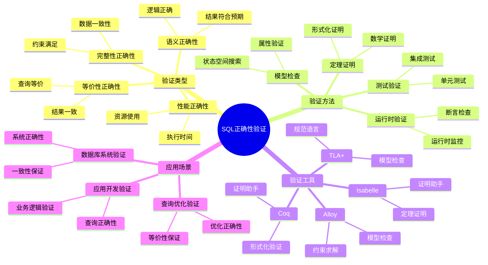
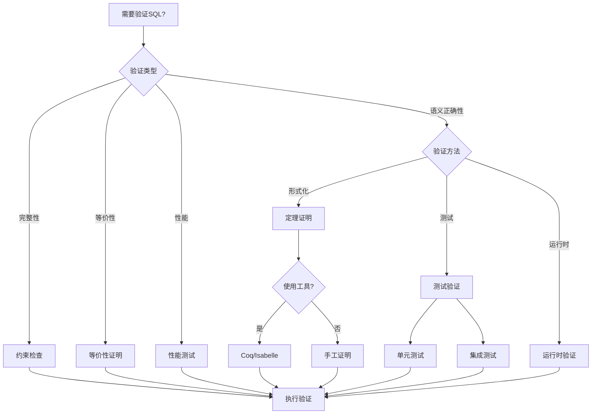

# SQL正确性验证

> **创建日期**：2025-01-15
> **最后更新**：2025-12-01
> **版本**：v2.0.0
> **难度**：⭐⭐⭐⭐⭐
> **应用场景**：SQL正确性验证、形式化验证、质量保证、向量检索验证

---

## 📋 目录

- [SQL正确性验证](#sql正确性验证)
  - [📋 目录](#-目录)
  - [一、概述](#一概述)
    - [1.1 SQL正确性验证知识体系思维导图](#11-sql正确性验证知识体系思维导图)
    - [1.2 SQL正确性验证决策树](#12-sql正确性验证决策树)
    - [1.3 验证方法对比矩阵](#13-验证方法对比矩阵)
  - [二、SQL正确性定义](#二sql正确性定义)
    - [2.1 正确性定义](#21-正确性定义)
    - [2.2 正确性类型](#22-正确性类型)
  - [三、形式化验证方法](#三形式化验证方法)
    - [3.1 定理证明](#31-定理证明)
    - [3.2 模型检查](#32-模型检查)
  - [四、验证工具](#四验证工具)
    - [4.1 形式化验证工具](#41-形式化验证工具)
  - [五、实际案例](#五实际案例)
    - [5.1 查询正确性验证](#51-查询正确性验证)
    - [5.2 场景示例1：学生查询正确性验证](#52-场景示例1学生查询正确性验证)
    - [5.3 场景示例2：连接查询正确性验证](#53-场景示例2连接查询正确性验证)
    - [5.4 场景示例3：聚合查询正确性验证](#54-场景示例3聚合查询正确性验证)
  - [六、2025向量检索正确性验证](#六2025向量检索正确性验证)
    - [6.1 向量检索正确性定义](#61-向量检索正确性定义)
    - [6.2 混合查询正确性验证](#62-混合查询正确性验证)
    - [6.3 向量检索验证SQL](#63-向量检索验证sql)
    - [6.4 验证方法对比矩阵（2025扩展）](#64-验证方法对比矩阵2025扩展)
  - [七、相关资源](#七相关资源)
    - [相关文档](#相关文档)
    - [2025新资源](#2025新资源)

---

## 一、概述

SQL正确性验证是确保SQL查询满足预期语义和约束的过程。本文档介绍SQL正确性验证的理论和方法。

**验证目标**：

1. 语义正确性
2. 完整性约束满足
3. 查询等价性
4. 性能正确性

### 1.1 SQL正确性验证知识体系思维导图



### 1.2 SQL正确性验证决策树



### 1.3 验证方法对比矩阵

| 验证方法 | 工具 | 自动化程度 | 适用场景 | 难度 |
|---------|------|-----------|---------|------|
| **定理证明** | Coq, Isabelle | ⭐⭐ | 形式化验证 | ⭐⭐⭐⭐⭐ |
| **模型检查** | TLA+, Alloy | ⭐⭐⭐⭐ | 系统验证 | ⭐⭐⭐⭐ |
| **测试验证** | 测试框架 | ⭐⭐⭐⭐⭐ | 应用开发 | ⭐⭐ |
| **运行时验证** | 监控工具 | ⭐⭐⭐⭐ | 生产环境 | ⭐⭐⭐ |

---

## 二、SQL正确性定义

### 2.1 正确性定义

**SQL正确性形式化定义**：

```latex
SQL查询 q 是正确的，当且仅当：
\forall 数据库实例 DB: Result(q, DB) 满足规范 Spec(q)

其中：
- Result(q, DB) 是查询 q 在数据库 DB 上的执行结果
- Spec(q) 是查询 q 的规范（预期结果）
```

### 2.2 正确性类型

**正确性类型**：

1. **语义正确性**：查询结果符合预期语义
2. **完整性正确性**：查询不违反完整性约束
3. **等价性正确性**：查询与规范查询等价
4. **性能正确性**：查询在合理时间内完成

---

## 三、形式化验证方法

### 3.1 定理证明

**定理证明方法**：

```latex
使用形式化证明系统（如Coq、Isabelle）证明SQL查询的正确性：

1. 将SQL查询转换为形式化规范
2. 使用证明系统证明查询满足规范
3. 验证完整性约束
```

### 3.2 模型检查

**模型检查方法**：

```latex
使用模型检查工具（如TLA+、Alloy）验证SQL查询：

1. 构建查询的模型
2. 定义正确性属性
3. 使用模型检查器验证属性
```

---

## 四、验证工具

### 4.1 形式化验证工具

**工具列表**：

| 工具 | 类型 | 功能 |
|------|------|------|
| **Coq** | 证明助手 | 形式化证明 |
| **Isabelle** | 证明助手 | 形式化证明 |
| **TLA+** | 规范语言 | 系统规范验证 |
| **Alloy** | 模型检查 | 模型验证 |

---

## 五、实际案例

### 5.1 查询正确性验证

### 5.2 场景示例1：学生查询正确性验证

**业务需求**：验证查询"年龄大于20的学生"的正确性。

**查询**：

```sql
SELECT * FROM Student WHERE age > 20;
```

**形式化规范**：

```latex
规范：Result = {t | t ∈ Student ∧ t.age > 20}

验证目标：
1. 完整性：Result ⊆ Student
2. 正确性：∀t ∈ Result: t.age > 20
3. 完备性：∀t ∈ Student: t.age > 20 ⟹ t ∈ Result
```

**验证步骤**：

```latex
证明：
1. 完整性证明：
   SELECT * FROM Student WHERE age > 20
   ⟹ Result ⊆ Student  ✓

2. 正确性证明：
   WHERE age > 20
   ⟹ ∀t ∈ Result: t.age > 20  ✓

3. 完备性证明：
   SELECT * FROM Student
   ⟹ 所有满足条件的元组都被包含  ✓
```

### 5.3 场景示例2：连接查询正确性验证

**业务需求**：验证学生选课查询的正确性。

**查询**：

```sql
SELECT s.name, c.course_name, e.score
FROM Student s
JOIN Enrollment e ON s.student_id = e.student_id
JOIN Course c ON e.course_id = c.course_id
WHERE e.score >= 90;
```

**形式化规范**：

```latex
规范：Result = {
    (s.name, c.course_name, e.score) |
    s ∈ Student ∧
    e ∈ Enrollment ∧
    c ∈ Course ∧
    s.student_id = e.student_id ∧
    e.course_id = c.course_id ∧
    e.score ≥ 90
}
```

**验证步骤**：

```latex
证明：
1. 连接正确性：
   JOIN Enrollment e ON s.student_id = e.student_id
   ⟹ 连接条件正确  ✓

2. 条件正确性：
   WHERE e.score >= 90
   ⟹ 只包含分数≥90的记录  ✓

3. 投影正确性：
   SELECT s.name, c.course_name, e.score
   ⟹ 投影列正确  ✓
```

### 5.4 场景示例3：聚合查询正确性验证

**业务需求**：验证统计每门课程平均分的查询正确性。

**查询**：

```sql
SELECT
    c.course_id,
    c.course_name,
    AVG(e.score) AS avg_score
FROM Course c
LEFT JOIN Enrollment e ON c.course_id = e.course_id
GROUP BY c.course_id, c.course_name;
```

**形式化规范**：

```latex
规范：Result = {
    (c.course_id, c.course_name, avg_score) |
    c ∈ Course ∧
    avg_score = AVG({e.score | e ∈ Enrollment ∧ e.course_id = c.course_id})
}
```

**验证步骤**：

```latex
证明：
1. 分组正确性：
   GROUP BY c.course_id, c.course_name
   ⟹ 按课程分组  ✓

2. 聚合正确性：
   AVG(e.score)
   ⟹ 计算平均分  ✓

3. 外连接正确性：
   LEFT JOIN Enrollment e
   ⟹ 包含没有选课的课程  ✓
```

**验证工具使用示例**：

```text
使用Coq进行形式化验证：

Definition query_correct (q: Query) (spec: Specification) : Prop :=
  forall db: Database,
    result(q, db) = spec(db).

Theorem student_query_correct:
  query_correct student_query student_spec.
Proof.
  (* 形式化证明过程 *)
  ...
Qed.
```

---

## 六、2025向量检索正确性验证

### 6.1 向量检索正确性定义

**定义6.1 向量检索正确性**：

```text
设 Q_vec 为向量检索查询，spec 为规格说明，则：

correct(Q_vec) ⟺ ∀ db, v, k:
    Recall(result(Q_vec, db, v, k), exact_knn(db, v, k)) ≥ threshold

其中：
- Recall = |result ∩ exact| / k
- threshold 为可接受的召回率阈值（如0.95）
```

### 6.2 混合查询正确性验证

**混合查询验证流程**：

```text
┌─────────────────────────────────────────────────────────────────────┐
│                    混合查询正确性验证流程                             │
└─────────────────────────────────────────────────────────────────────┘

                    混合查询 Q_hybrid
                           │
           ┌───────────────┴───────────────┐
           │                               │
           ▼                               ▼
    ┌─────────────┐                ┌─────────────┐
    │ 关系部分正确性 │                │ 向量部分正确性 │
    │ 精确验证     │                │ 近似验证     │
    └──────┬──────┘                └──────┬──────┘
           │                               │
           ▼                               ▼
    ┌─────────────┐                ┌─────────────┐
    │ 选择正确性   │                │ 召回率验证   │
    │ σ_p(R) ✓   │                │ Recall ≥ 0.95│
    └──────┬──────┘                └──────┬──────┘
           │                               │
           └───────────────┬───────────────┘
                           │
                           ▼
                   ┌─────────────┐
                   │ 组合正确性   │
                   │ 整体语义验证 │
                   └─────────────┘
```

### 6.3 向量检索验证SQL

```sql
-- 验证向量检索召回率
CREATE OR REPLACE FUNCTION verify_vector_recall(
    query_vec vector(1536),
    k INTEGER DEFAULT 10,
    threshold FLOAT DEFAULT 0.95
) RETURNS TABLE (
    recall FLOAT,
    is_correct BOOLEAN,
    exact_count INTEGER,
    approx_count INTEGER
) AS $$
DECLARE
    exact_results UUID[];
    approx_results UUID[];
    overlap_count INTEGER;
BEGIN
    -- 获取精确KNN结果（使用Flat索引或暴力搜索）
    SELECT array_agg(id ORDER BY embedding <=> query_vec)
    INTO exact_results
    FROM (
        SELECT id, embedding
        FROM documents
        ORDER BY embedding <=> query_vec
        LIMIT k
    ) sub;

    -- 获取近似KNN结果（使用HNSW索引）
    SELECT array_agg(id)
    INTO approx_results
    FROM (
        SELECT id
        FROM documents
        ORDER BY embedding <=> query_vec
        LIMIT k
    ) sub;

    -- 计算重叠
    SELECT COUNT(*)
    INTO overlap_count
    FROM unnest(exact_results) e(id)
    JOIN unnest(approx_results) a(id) ON e.id = a.id;

    -- 返回验证结果
    RETURN QUERY SELECT
        overlap_count::FLOAT / k AS recall,
        (overlap_count::FLOAT / k >= threshold) AS is_correct,
        cardinality(exact_results) AS exact_count,
        cardinality(approx_results) AS approx_count;
END;
$$ LANGUAGE plpgsql;

-- 使用验证
SELECT * FROM verify_vector_recall('[0.1, 0.2, ...]'::vector, 10, 0.95);
```

### 6.4 验证方法对比矩阵（2025扩展）

| 验证方法 | 关系查询 | 向量检索 | 混合查询 | 复杂度 |
|---------|---------|---------|---------|-------|
| **定理证明** | ⭐⭐⭐⭐⭐ | ⭐⭐ | ⭐⭐⭐ | 高 |
| **模型检查** | ⭐⭐⭐⭐ | ⭐⭐⭐ | ⭐⭐⭐ | 中 |
| **召回率测试** | - | ⭐⭐⭐⭐⭐ | ⭐⭐⭐⭐ | 低 |
| **A/B测试** | ⭐⭐⭐ | ⭐⭐⭐⭐ | ⭐⭐⭐⭐ | 中 |
| **回归测试** | ⭐⭐⭐⭐⭐ | ⭐⭐⭐⭐ | ⭐⭐⭐⭐ | 低 |

---

## 七、相关资源

### 相关文档

- [SQL形式化语义](./03.01-SQL形式化语义.md) - SQL形式化语义（含向量扩展）
- [查询等价性理论](./03.02-查询等价性理论.md) - 查询等价性（含近似等价）
- [SQL的范畴论梳理](./03.05-SQL的范畴论梳理.md) - 向量数据库范畴论
- [SQL知识体系关系图谱](../09-整合资源/09.04-SQL知识体系关系图谱.md) - 形式证明树

### 2025新资源

- [pgvector性能测试](https://github.com/pgvector/pgvector#performance)
- [向量数据库基准测试](https://ann-benchmarks.com/)

---

**维护者**: SQL Standards Team
**最后更新**: 2025-12-01
