# SQL正确性验证

> **创建日期**：2025-01-15
> **最后更新**：2025-01-15
> **版本**：v1.0.0
> **难度**：⭐⭐⭐⭐⭐
> **应用场景**：SQL正确性验证、形式化验证、质量保证

---

## 📋 目录

- [SQL正确性验证](#sql正确性验证)
  - [📋 目录](#-目录)
  - [一、概述](#一概述)
    - [1.1 SQL正确性验证知识体系思维导图](#11-sql正确性验证知识体系思维导图)
    - [1.2 SQL正确性验证决策树](#12-sql正确性验证决策树)
    - [1.3 验证方法对比矩阵](#13-验证方法对比矩阵)
  - [二、SQL正确性定义](#二sql正确性定义)
    - [2.1 正确性定义](#21-正确性定义)
    - [2.2 正确性类型](#22-正确性类型)
  - [三、形式化验证方法](#三形式化验证方法)
    - [3.1 定理证明](#31-定理证明)
    - [3.2 模型检查](#32-模型检查)
  - [四、验证工具](#四验证工具)
    - [4.1 形式化验证工具](#41-形式化验证工具)
  - [五、实际案例](#五实际案例)
    - [5.1 查询正确性验证](#51-查询正确性验证)
    - [5.2 场景示例1：学生查询正确性验证](#52-场景示例1学生查询正确性验证)
    - [5.3 场景示例2：连接查询正确性验证](#53-场景示例2连接查询正确性验证)
    - [5.4 场景示例3：聚合查询正确性验证](#54-场景示例3聚合查询正确性验证)
  - [六、相关资源](#六相关资源)
    - [相关文档](#相关文档)

---

## 一、概述

SQL正确性验证是确保SQL查询满足预期语义和约束的过程。本文档介绍SQL正确性验证的理论和方法。

**验证目标**：

1. 语义正确性
2. 完整性约束满足
3. 查询等价性
4. 性能正确性

### 1.1 SQL正确性验证知识体系思维导图

```mermaid
mindmap
  root((SQL正确性验证))
    验证类型
      语义正确性
        结果符合预期
        逻辑正确
      完整性正确性
        约束满足
        数据一致性
      等价性正确性
        查询等价
        结果一致
      性能正确性
        执行时间
        资源使用
    验证方法
      定理证明
        形式化证明
        数学证明
      模型检查
        状态空间搜索
        属性验证
      测试验证
        单元测试
        集成测试
      运行时验证
        断言检查
        运行时监控
    验证工具
      Coq
        证明助手
        形式化验证
      Isabelle
        证明助手
        定理证明
      TLA+
        规范语言
        模型检查
      Alloy
        模型检查
        约束求解
    应用场景
      查询优化验证
        优化正确性
        等价性保证
      数据库系统验证
        系统正确性
        一致性保证
      应用开发验证
        查询正确性
        业务逻辑验证
```



### 1.2 SQL正确性验证决策树

```mermaid
flowchart TD
    A[需要验证SQL?] --> B{验证类型}
    B -->|语义正确性| C{验证方法}
    B -->|完整性| D[约束检查]
    B -->|等价性| E[等价性证明]
    B -->|性能| F[性能测试]

    C -->|形式化| G[定理证明]
    C -->|测试| H[测试验证]
    C -->|运行时| I[运行时验证]

    G --> J{使用工具?}
    J -->|是| K[Coq/Isabelle]
    J -->|否| L[手工证明]

    H --> M[单元测试]
    H --> N[集成测试]

    D --> O[执行验证]
    E --> O
    F --> O
    K --> O
    L --> O
    M --> O
    N --> O
    I --> O
```



### 1.3 验证方法对比矩阵

| 验证方法 | 工具 | 自动化程度 | 适用场景 | 难度 |
|---------|------|-----------|---------|------|
| **定理证明** | Coq, Isabelle | ⭐⭐ | 形式化验证 | ⭐⭐⭐⭐⭐ |
| **模型检查** | TLA+, Alloy | ⭐⭐⭐⭐ | 系统验证 | ⭐⭐⭐⭐ |
| **测试验证** | 测试框架 | ⭐⭐⭐⭐⭐ | 应用开发 | ⭐⭐ |
| **运行时验证** | 监控工具 | ⭐⭐⭐⭐ | 生产环境 | ⭐⭐⭐ |

---

## 二、SQL正确性定义

### 2.1 正确性定义

**SQL正确性形式化定义**：

```latex
SQL查询 q 是正确的，当且仅当：
\forall 数据库实例 DB: Result(q, DB) 满足规范 Spec(q)

其中：
- Result(q, DB) 是查询 q 在数据库 DB 上的执行结果
- Spec(q) 是查询 q 的规范（预期结果）
```

### 2.2 正确性类型

**正确性类型**：

1. **语义正确性**：查询结果符合预期语义
2. **完整性正确性**：查询不违反完整性约束
3. **等价性正确性**：查询与规范查询等价
4. **性能正确性**：查询在合理时间内完成

---

## 三、形式化验证方法

### 3.1 定理证明

**定理证明方法**：

```latex
使用形式化证明系统（如Coq、Isabelle）证明SQL查询的正确性：

1. 将SQL查询转换为形式化规范
2. 使用证明系统证明查询满足规范
3. 验证完整性约束
```

### 3.2 模型检查

**模型检查方法**：

```latex
使用模型检查工具（如TLA+、Alloy）验证SQL查询：

1. 构建查询的模型
2. 定义正确性属性
3. 使用模型检查器验证属性
```

---

## 四、验证工具

### 4.1 形式化验证工具

**工具列表**：

| 工具 | 类型 | 功能 |
|------|------|------|
| **Coq** | 证明助手 | 形式化证明 |
| **Isabelle** | 证明助手 | 形式化证明 |
| **TLA+** | 规范语言 | 系统规范验证 |
| **Alloy** | 模型检查 | 模型验证 |

---

## 五、实际案例

### 5.1 查询正确性验证

### 5.2 场景示例1：学生查询正确性验证

**业务需求**：验证查询"年龄大于20的学生"的正确性。

**查询**：

```sql
SELECT * FROM Student WHERE age > 20;
```

**形式化规范**：

```latex
规范：Result = {t | t ∈ Student ∧ t.age > 20}

验证目标：
1. 完整性：Result ⊆ Student
2. 正确性：∀t ∈ Result: t.age > 20
3. 完备性：∀t ∈ Student: t.age > 20 ⟹ t ∈ Result
```

**验证步骤**：

```latex
证明：
1. 完整性证明：
   SELECT * FROM Student WHERE age > 20
   ⟹ Result ⊆ Student  ✓

2. 正确性证明：
   WHERE age > 20
   ⟹ ∀t ∈ Result: t.age > 20  ✓

3. 完备性证明：
   SELECT * FROM Student
   ⟹ 所有满足条件的元组都被包含  ✓
```

### 5.3 场景示例2：连接查询正确性验证

**业务需求**：验证学生选课查询的正确性。

**查询**：

```sql
SELECT s.name, c.course_name, e.score
FROM Student s
JOIN Enrollment e ON s.student_id = e.student_id
JOIN Course c ON e.course_id = c.course_id
WHERE e.score >= 90;
```

**形式化规范**：

```latex
规范：Result = {
    (s.name, c.course_name, e.score) |
    s ∈ Student ∧
    e ∈ Enrollment ∧
    c ∈ Course ∧
    s.student_id = e.student_id ∧
    e.course_id = c.course_id ∧
    e.score ≥ 90
}
```

**验证步骤**：

```latex
证明：
1. 连接正确性：
   JOIN Enrollment e ON s.student_id = e.student_id
   ⟹ 连接条件正确  ✓

2. 条件正确性：
   WHERE e.score >= 90
   ⟹ 只包含分数≥90的记录  ✓

3. 投影正确性：
   SELECT s.name, c.course_name, e.score
   ⟹ 投影列正确  ✓
```

### 5.4 场景示例3：聚合查询正确性验证

**业务需求**：验证统计每门课程平均分的查询正确性。

**查询**：

```sql
SELECT
    c.course_id,
    c.course_name,
    AVG(e.score) AS avg_score
FROM Course c
LEFT JOIN Enrollment e ON c.course_id = e.course_id
GROUP BY c.course_id, c.course_name;
```

**形式化规范**：

```latex
规范：Result = {
    (c.course_id, c.course_name, avg_score) |
    c ∈ Course ∧
    avg_score = AVG({e.score | e ∈ Enrollment ∧ e.course_id = c.course_id})
}
```

**验证步骤**：

```latex
证明：
1. 分组正确性：
   GROUP BY c.course_id, c.course_name
   ⟹ 按课程分组  ✓

2. 聚合正确性：
   AVG(e.score)
   ⟹ 计算平均分  ✓

3. 外连接正确性：
   LEFT JOIN Enrollment e
   ⟹ 包含没有选课的课程  ✓
```

**验证工具使用示例**：

```text
使用Coq进行形式化验证：

Definition query_correct (q: Query) (spec: Specification) : Prop :=
  forall db: Database,
    result(q, db) = spec(db).

Theorem student_query_correct:
  query_correct student_query student_spec.
Proof.
  (* 形式化证明过程 *)
  ...
Qed.
```

---

## 六、相关资源

### 相关文档

- [SQL形式化语义](./03.01-SQL形式化语义.md) - SQL形式化语义
- [查询等价性理论](./03.02-查询等价性理论.md) - 查询等价性

---

**维护者**: SQL Standards Team
**最后更新**: 2025-01-15
