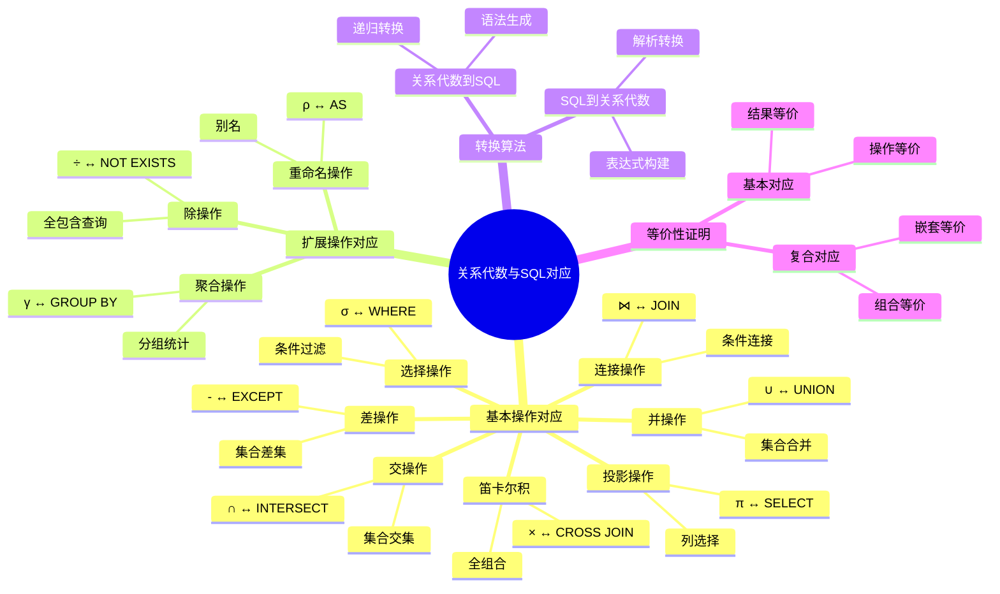

# 关系代数与SQL对应

> **创建日期**：2025-01-15
> **最后更新**：2025-01-15
> **版本**：v1.0.0
> **难度**：⭐⭐⭐⭐
> **应用场景**：SQL语义理解、查询优化、查询转换

---

## 📋 目录

- [关系代数与SQL对应](#关系代数与sql对应)
  - [📋 目录](#-目录)
  - [一、概述](#一概述)
    - [1.1 对应关系的定义](#11-对应关系的定义)
      - [1.0.2 对应关系的历史背景](#102-对应关系的历史背景)
    - [1.1 关系代数与SQL对应知识体系思维导图](#11-关系代数与sql对应知识体系思维导图)
    - [1.2 关系代数与SQL对应对比矩阵](#12-关系代数与sql对应对比矩阵)
  - [二、基本操作对应](#二基本操作对应)
    - [2.1 选择操作对应](#21-选择操作对应)
    - [2.2 投影操作对应](#22-投影操作对应)
    - [2.3 并操作对应](#23-并操作对应)
    - [2.4 交操作对应](#24-交操作对应)
    - [2.5 差操作对应](#25-差操作对应)
    - [2.6 笛卡尔积对应](#26-笛卡尔积对应)
    - [2.7 连接操作对应](#27-连接操作对应)
  - [三、扩展操作对应](#三扩展操作对应)
    - [3.1 除操作对应](#31-除操作对应)
    - [3.2 聚合操作对应](#32-聚合操作对应)
  - [四、转换算法](#四转换算法)
    - [4.1 关系代数到SQL转换](#41-关系代数到sql转换)
    - [4.2 SQL到关系代数转换](#42-sql到关系代数转换)
  - [五、等价性证明](#五等价性证明)
    - [5.1 基本对应等价性](#51-基本对应等价性)
    - [5.2 证明方法](#52-证明方法)
  - [六、实际应用](#六实际应用)
    - [6.1 查询优化](#61-查询优化)
    - [6.2 查询重写](#62-查询重写)
  - [七、相关资源](#七相关资源)
    - [相关文档](#相关文档)
    - [外部资源](#外部资源)

---

## 一、概述

关系代数与SQL对应关系是理解SQL语义和进行查询优化的基础。本文档详细说明关系代数操作与SQL语句的对应关系。

### 1.1 对应关系的定义

**关系代数与SQL对应关系（Relational Algebra to SQL Correspondence）**是指关系代数操作与SQL语句之间的语义等价关系。

**形式化定义**：

```latex
对应关系定义：

对于关系代数表达式 e 和 SQL 查询 q：
e 对应 q ⟺ Result(e) = Result(q)

其中：
- Result(e) 是关系代数表达式 e 的执行结果
- Result(q) 是 SQL 查询 q 的执行结果
```

#### 1.0.2 对应关系的历史背景

**历史背景**：

- **1970年**：Codd提出关系模型和关系代数
- **1974年**：IBM开发SEQUEL（SQL前身），设计时考虑了与关系代数的对应关系
- **1986年**：SQL-86标准正式定义了SQL与关系代数的对应关系
- **1992年**：SQL-92标准进一步明确了对应关系
- **至今**：对应关系是SQL标准定义的基础

**对应关系的重要性**：

1. **SQL语义理解**：通过对应关系理解SQL的语义
2. **查询优化基础**：查询优化器基于对应关系进行优化
3. **查询转换依据**：查询转换基于对应关系
4. **正确性验证**：通过对应关系验证SQL查询的正确性

### 1.1 关系代数与SQL对应知识体系思维导图



### 1.2 关系代数与SQL对应对比矩阵

| 关系代数操作 | SQL对应 | 复杂度 | 性能 | 使用频率 |
|------------|---------|--------|------|---------|
| **σ (选择)** | WHERE | ⭐ | ⭐⭐⭐⭐ | ⭐⭐⭐⭐⭐ |
| **π (投影)** | SELECT | ⭐ | ⭐⭐⭐⭐ | ⭐⭐⭐⭐⭐ |
| **∪ (并)** | UNION | ⭐⭐ | ⭐⭐⭐ | ⭐⭐⭐ |
| **∩ (交)** | INTERSECT | ⭐⭐ | ⭐⭐⭐ | ⭐⭐ |
| **- (差)** | EXCEPT | ⭐⭐ | ⭐⭐⭐ | ⭐⭐ |
| **× (笛卡尔积)** | CROSS JOIN | ⭐⭐ | ⭐ | ⭐ |
| **⋈ (连接)** | JOIN | ⭐⭐⭐ | ⭐⭐⭐ | ⭐⭐⭐⭐⭐ |
| **÷ (除)** | NOT EXISTS | ⭐⭐⭐⭐ | ⭐⭐ | ⭐ |
| **γ (聚合)** | GROUP BY | ⭐⭐⭐ | ⭐⭐⭐ | ⭐⭐⭐⭐ |

---

## 二、基本操作对应

### 2.1 选择操作对应

**关系代数选择**：

```latex
σ_{条件}(R)
```

**SQL对应**：

```sql
SELECT * FROM R WHERE 条件;
```

**示例**：

```text
关系代数：σ_{年龄>20}(Student)

SQL对应：
SELECT * FROM Student WHERE 年龄 > 20;
```

### 2.2 投影操作对应

**关系代数投影**：

```latex
π_{A₁, A₂, ..., Aₙ}(R)
```

**SQL对应**：

```sql
SELECT A₁, A₂, ..., Aₙ FROM R;
```

**示例**：

```text
关系代数：π_{学号, 姓名}(Student)

SQL对应：
SELECT 学号, 姓名 FROM Student;
```

### 2.3 并操作对应

**关系代数并**：

```latex
R₁ ∪ R₂
```

**SQL对应**：

```sql
SELECT * FROM R1
UNION
SELECT * FROM R2;
```

### 2.4 交操作对应

**关系代数交**：

```latex
R₁ ∩ R₂
```

**SQL对应**：

```sql
SELECT * FROM R1
INTERSECT
SELECT * FROM R2;
```

### 2.5 差操作对应

**关系代数差**：

```latex
R₁ - R₂
```

**SQL对应**：

```sql
SELECT * FROM R1
EXCEPT
SELECT * FROM R2;
```

### 2.6 笛卡尔积对应

**关系代数笛卡尔积**：

```latex
R₁ × R₂
```

**SQL对应**：

```sql
SELECT * FROM R1 CROSS JOIN R2;
```

### 2.7 连接操作对应

**关系代数连接**：

```latex
R₁ ⋈_{A=B} R₂
```

**SQL对应**：

```sql
SELECT * FROM R1
JOIN R2 ON R1.A = R2.B;
```

**自然连接**：

```latex
R₁ ⋈ R₂
```

**SQL对应**：

```sql
SELECT * FROM R1 NATURAL JOIN R2;
```

---

## 三、扩展操作对应

### 3.1 除操作对应

**关系代数除**：

```latex
R₁ ÷ R₂
```

**SQL对应**（使用NOT EXISTS）：

```sql
SELECT DISTINCT ...
FROM R1 r1
WHERE NOT EXISTS (
    SELECT * FROM R2 r2
    WHERE NOT EXISTS (
        SELECT * FROM R1 r1_inner
        WHERE r1_inner.公共属性 = r1.公共属性
        AND r1_inner.其他属性 = r2.属性
    )
);
```

### 3.2 聚合操作对应

**关系代数聚合**：

```latex
γ_{分组属性, 聚合函数}(R)
```

**SQL对应**：

```sql
SELECT 分组属性, 聚合函数(...)
FROM R
GROUP BY 分组属性;
```

**示例**：

```text
关系代数：γ_{专业, COUNT}(Student)

SQL对应：
SELECT 专业, COUNT(*)
FROM Student
GROUP BY 专业;
```

---

## 四、转换算法

### 4.1 关系代数到SQL转换

**转换算法**：

```latex
转换函数：toSQL: RelationalAlgebra → SQL

toSQL(σ_P(R)) = "SELECT * FROM " + R + " WHERE " + P
toSQL(π_A(R)) = "SELECT " + A + " FROM " + R
toSQL(R₁ ∪ R₂) = toSQL(R₁) + " UNION " + toSQL(R₂)
toSQL(R₁ ∩ R₂) = toSQL(R₁) + " INTERSECT " + toSQL(R₂)
toSQL(R₁ - R₂) = toSQL(R₁) + " EXCEPT " + toSQL(R₂)
toSQL(R₁ × R₂) = "SELECT * FROM " + R₁ + " CROSS JOIN " + R₂
toSQL(R₁ ⋈_P R₂) = "SELECT * FROM " + R₁ + " JOIN " + R₂ + " ON " + P
```

### 4.2 SQL到关系代数转换

**转换算法**：

```latex
转换函数：toRA: SQL → RelationalAlgebra

toRA("SELECT A FROM R WHERE P") = π_A(σ_P(R))
toRA("SELECT * FROM R1 UNION SELECT * FROM R2") = toRA(R1) ∪ toRA(R2)
toRA("SELECT * FROM R1 JOIN R2 ON P") = σ_P(toRA(R1) × toRA(R2))
```

---

## 五、等价性证明

### 5.1 基本对应等价性

**对应关系等价性定理**：

```latex
\begin{theorem}[关系代数与SQL对应等价性]
对于每个关系代数表达式 e，存在SQL查询 q，使得：
Result(e) = Result(q)

对于每个SQL查询 q，存在关系代数表达式 e，使得：
Result(q) = Result(e)
\end{theorem}
```

### 5.2 证明方法

**证明方法**：

1. 结构归纳法：对关系代数表达式结构进行归纳
2. 语义等价性：证明语义函数等价
3. 集合论证明：证明结果集合相等

---

## 六、实际应用

### 6.1 查询优化

**查询优化应用**：

```text
原始SQL：
SELECT * FROM Student WHERE 年龄 > 20;

转换为关系代数：
σ_{年龄>20}(Student)

优化后的关系代数：
σ_{年龄>20}(Student)  （已是最优）

转换回SQL：
SELECT * FROM Student WHERE 年龄 > 20;
```

### 6.2 查询重写

**查询重写应用**：

```text
原始SQL：
SELECT * FROM (SELECT * FROM Student WHERE 年龄 > 20) WHERE 专业 = 'CS';

转换为关系代数：
σ_{专业='CS'}(σ_{年龄>20}(Student))

应用选择合并规则：
σ_{专业='CS' ∧ 年龄>20}(Student)

转换回SQL：
SELECT * FROM Student WHERE 年龄 > 20 AND 专业 = 'CS';
```

---

## 七、相关资源

### 相关文档

- [关系代数理论](../01-理论基础/01.02-关系代数理论.md) - 关系代数理论
- [SQL完备性理论](../01-理论基础/01.04-SQL完备性理论.md) - SQL完备性
- [查询等价性理论](./03.02-查询等价性理论.md) - 查询等价性

### 外部资源

- Date, C. J. (2003). "An Introduction to Database Systems"

---

**维护者**: SQL Standards Team
**最后更新**: 2025-01-15
