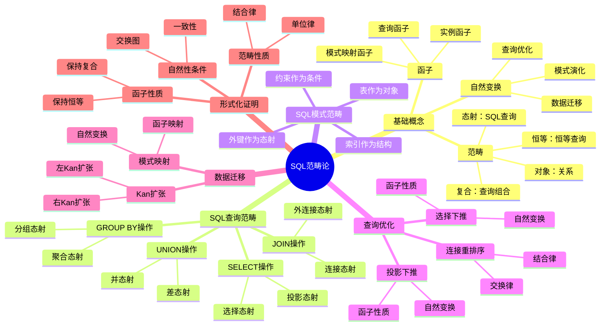

# SQL的范畴论梳理

> **创建日期**：2025-01-15
> **最后更新**：2025-01-16
> **版本**：v1.0.0
> **难度**：⭐⭐⭐⭐⭐
> **应用场景**：SQL形式化语义、查询优化、理论证明

---

## 📋 目录

- [SQL的范畴论梳理](#sql的范畴论梳理)
  - [📋 目录](#-目录)
  - [一、概述](#一概述)
    - [1.1 范畴论在SQL中的作用](#11-范畴论在sql中的作用)
    - [1.2 SQL范畴论知识体系思维导图](#12-sql范畴论知识体系思维导图)
    - [1.3 核心对应关系](#13-核心对应关系)
  - [二、SQL查询范畴](#二sql查询范畴)
    - [2.1 关系作为对象](#21-关系作为对象)
    - [2.2 SQL查询作为态射](#22-sql查询作为态射)
    - [2.3 查询复合](#23-查询复合)
    - [2.4 恒等查询](#24-恒等查询)
    - [2.5 SQL查询范畴的形式化定义](#25-sql查询范畴的形式化定义)
  - [三、SQL操作的范畴论语义](#三sql操作的范畴论语义)
    - [3.1 SELECT操作](#31-select操作)
    - [3.2 WHERE操作](#32-where操作)
    - [3.3 JOIN操作](#33-join操作)
    - [3.4 GROUP BY和聚合操作](#34-group-by和聚合操作)
    - [3.5 UNION操作](#35-union操作)
    - [3.6 子查询](#36-子查询)
  - [四、SQL模式范畴](#四sql模式范畴)
    - [4.1 数据库模式作为范畴](#41-数据库模式作为范畴)
    - [4.2 表作为对象](#42-表作为对象)
    - [4.3 外键作为态射](#43-外键作为态射)
    - [4.4 模式范畴的性质](#44-模式范畴的性质)
  - [五、数据库实例作为函子](#五数据库实例作为函子)
    - [5.1 实例函子的定义](#51-实例函子的定义)
    - [5.2 实例函子的性质](#52-实例函子的性质)
    - [5.3 实例函子的应用](#53-实例函子的应用)
  - [六、查询作为自然变换](#六查询作为自然变换)
    - [6.1 查询自然变换的定义](#61-查询自然变换的定义)
    - [6.2 自然变换的自然性条件](#62-自然变换的自然性条件)
    - [6.3 查询优化的自然变换视角](#63-查询优化的自然变换视角)
  - [七、SQL查询优化的范畴论方法](#七sql查询优化的范畴论方法)
    - [7.1 查询重写的自然变换](#71-查询重写的自然变换)
    - [7.2 投影下推的范畴论证明](#72-投影下推的范畴论证明)
    - [7.3 选择下推的范畴论证明](#73-选择下推的范畴论证明)
    - [7.4 连接重排序的范畴论证明](#74-连接重排序的范畴论证明)
  - [八、模式映射与数据迁移](#八模式映射与数据迁移)
    - [8.1 模式映射函子](#81-模式映射函子)
    - [8.2 数据迁移（Kan扩张）](#82-数据迁移kan扩张)
    - [8.3 数据迁移的一致性](#83-数据迁移的一致性)
  - [九、SQL查询的范畴论性质](#九sql查询的范畴论性质)
    - [9.1 查询的函子性](#91-查询的函子性)
    - [9.2 查询的单调性](#92-查询的单调性)
    - [9.3 查询的幂等性](#93-查询的幂等性)
  - [十、形式化证明](#十形式化证明)
    - [10.1 SQL查询范畴的范畴性质证明](#101-sql查询范畴的范畴性质证明)
    - [10.2 查询复合的结合律证明](#102-查询复合的结合律证明)
    - [10.3 查询优化的正确性证明](#103-查询优化的正确性证明)
  - [十一、相关资源](#十一相关资源)
    - [相关文档](#相关文档)
    - [外部资源](#外部资源)
      - [经典论文](#经典论文)
      - [经典教材](#经典教材)
      - [在线资源](#在线资源)

---

## 一、概述

### 1.1 范畴论在SQL中的作用

**范畴论（Category Theory）**为SQL提供了统一的数学框架，能够：

1. **统一建模**：将SQL查询、关系、模式统一在范畴论框架下
2. **形式化推理**：使用范畴论的工具进行形式化推理和证明
3. **查询优化**：通过自然变换和函子性质进行查询优化
4. **模式演化**：通过函子和Kan扩张处理模式演化

**范畴论视角下的SQL核心思想**：

```text
关系（Relation）        →  对象（Object）
SQL查询（Query）        →  态射（Morphism）
查询复合（Composition） →  态射复合（Composition）
恒等查询（Identity）    →  恒等态射（Identity）
数据库模式（Schema）    →  范畴（Category）
数据库实例（Instance）  →  函子（Functor）
查询优化（Optimization）→  自然变换（Natural Transformation）
```

### 1.2 SQL范畴论知识体系思维导图



### 1.3 核心对应关系

| SQL概念 | 范畴论概念 | 数学符号 | 说明 |
|---------|-----------|---------|------|
| **关系（Relation）** | 对象（Object） | $R \in \text{Ob}(\mathcal{C})$ | 数据库中的表或查询结果 |
| **SQL查询** | 态射（Morphism） | $f: R_1 \to R_2$ | 从一个关系到另一个关系的查询 |
| **查询复合** | 态射复合 | $g \circ f$ | 两个查询的组合 |
| **恒等查询** | 恒等态射 | $\text{id}_R$ | 返回原关系的查询 |
| **数据库模式** | 范畴 | $\mathcal{C}$ | 表和外键关系构成的范畴 |
| **数据库实例** | 函子 | $F: \mathcal{C} \to \mathbf{Set}$ | 将模式映射到集合的函子 |
| **查询优化** | 自然变换 | $\eta: F \Rightarrow G$ | 查询之间的等价变换 |

---

## 二、SQL查询范畴

### 2.1 关系作为对象

**定义2.1.1（关系对象）**：

在SQL查询范畴 $\mathcal{Q}$ 中，**关系（Relation）**是范畴的对象。

```latex
\text{关系 } R \text{ 是一个三元组：}
R = (A, \text{dom}, \text{rows})

\text{其中：}
- A = \{a_1, a_2, \ldots, a_n\} \text{ 是属性集合}
- \text{dom}: A \to \text{Type} \text{ 是属性到类型的映射}
- \text{rows} \subseteq \prod_{a \in A} \text{dom}(a) \text{ 是元组集合}
```

**关系对象的性质**：

1. **类型信息**：每个关系都有明确的属性类型
2. **元组集合**：关系包含有限个元组
3. **模式一致性**：同一关系中的所有元组具有相同的属性结构

**示例**：

```sql
-- 关系 Students 作为对象
CREATE TABLE Students (
    id INT PRIMARY KEY,
    name VARCHAR(100),
    age INT
);

-- 在范畴论中表示为对象
\text{Students} \in \text{Ob}(\mathcal{Q})
```

### 2.2 SQL查询作为态射

**定义2.2.1（SQL查询态射）**：

SQL查询是从一个关系到另一个关系的**态射（Morphism）**。

```latex
\text{SQL查询 } q: R_1 \to R_2 \text{ 是一个态射，满足：}

1. \text{类型保持：} \text{dom}(R_2) \subseteq \text{dom}(R_1)
2. \text{语义正确：} q(R_1) \subseteq R_2 \text{（在语义上）}
```

**SQL查询态射的类型**：

1. **投影态射**：`SELECT` 操作，选择部分属性
2. **选择态射**：`WHERE` 操作，过滤元组
3. **连接态射**：`JOIN` 操作，组合多个关系
4. **聚合态射**：`GROUP BY` 操作，聚合数据

**示例**：

```sql
-- SELECT查询作为态射
SELECT name, age
FROM Students
WHERE age > 18;

-- 在范畴论中表示为态射
q: \text{Students} \to \text{Result}
\text{其中 } q = \pi_{\{\text{name}, \text{age}\}} \circ \sigma_{\text{age} > 18}
```

### 2.3 查询复合

**定义2.3.1（查询复合）**：

两个SQL查询可以**复合（Compose）**，形成新的查询。

```latex
\text{给定查询 } f: R_1 \to R_2 \text{ 和 } g: R_2 \to R_3，
\text{复合查询 } g \circ f: R_1 \to R_3 \text{ 定义为：}

(g \circ f)(r) = g(f(r)) \quad \forall r \in R_1
```

**查询复合的SQL表示**：

```sql
-- 查询复合：先选择，再投影
-- 等价于嵌套查询或CTE

-- 方式1：嵌套查询
SELECT name
FROM (
    SELECT name, age
    FROM Students
    WHERE age > 18
) AS filtered;

-- 方式2：CTE
WITH filtered AS (
    SELECT name, age
    FROM Students
    WHERE age > 18
)
SELECT name
FROM filtered;

-- 在范畴论中表示为
g \circ f: \text{Students} \to \text{Result}
\text{其中 } f = \sigma_{\text{age} > 18}, g = \pi_{\{\text{name}\}}
```

**查询复合的性质**：

1. **结合律**：$(h \circ g) \circ f = h \circ (g \circ f)$
2. **类型安全**：复合查询的类型由中间关系确定

### 2.4 恒等查询

**定义2.4.1（恒等查询）**：

对于每个关系 $R$，存在**恒等查询** $\text{id}_R: R \to R$，返回原关系。

```latex
\text{恒等查询 } \text{id}_R: R \to R \text{ 定义为：}

\text{id}_R(r) = r \quad \forall r \in R
```

**恒等查询的SQL表示**：

```sql
-- 恒等查询：返回所有列和所有行
SELECT *
FROM Students;

-- 在范畴论中表示为
\text{id}_{\text{Students}}: \text{Students} \to \text{Students}
```

**恒等查询的性质**：

1. **左单位元**：$f \circ \text{id}_{R_1} = f$
2. **右单位元**：$\text{id}_{R_2} \circ f = f$

### 2.5 SQL查询范畴的形式化定义

**定义2.5.1（SQL查询范畴）**：

**SQL查询范畴** $\mathcal{Q}$ 是一个范畴，其中：

1. **对象集合** $\text{Ob}(\mathcal{Q})$：所有可能的关系
2. **态射集合** $\text{Hom}_{\mathcal{Q}}(R_1, R_2)$：从 $R_1$ 到 $R_2$ 的所有SQL查询
3. **复合运算** $\circ$：查询复合
4. **恒等态射** $\text{id}_R$：恒等查询

```latex
\mathcal{Q} = (\text{Ob}(\mathcal{Q}), \text{Hom}_{\mathcal{Q}}, \circ, \text{id})
```

**SQL查询范畴的性质**：

1. **结合律**：查询复合满足结合律
2. **单位律**：恒等查询满足单位律
3. **类型安全**：复合查询的类型由中间关系确定

---

## 三、SQL操作的范畴论语义

### 3.1 SELECT操作

**SELECT操作作为投影态射**：

```latex
\text{SELECT操作 } \pi_A: R \to R' \text{ 定义为：}

\pi_A(R) = \{t[A] \mid t \in R\}

\text{其中 } A \subseteq \text{Attr}(R) \text{ 是选择的属性集合}
```

**SELECT操作的范畴论性质**：

1. **幂等性**：$\pi_A \circ \pi_A = \pi_A$
2. **单调性**：如果 $A \subseteq B$，则 $\pi_A \circ \pi_B = \pi_A$

**示例**：

```sql
-- SELECT操作
SELECT name, age
FROM Students;

-- 在范畴论中表示为
\pi_{\{\text{name}, \text{age}\}}: \text{Students} \to \text{Result}
```

### 3.2 WHERE操作

**WHERE操作作为选择态射**：

```latex
\text{WHERE操作 } \sigma_\phi: R \to R \text{ 定义为：}

\sigma_\phi(R) = \{t \in R \mid \phi(t) = \text{true}\}

\text{其中 } \phi \text{ 是选择条件（谓词）}
```

**WHERE操作的范畴论性质**：

1. **幂等性**：$\sigma_\phi \circ \sigma_\phi = \sigma_\phi$
2. **交换律**：$\sigma_{\phi_1} \circ \sigma_{\phi_2} = \sigma_{\phi_2} \circ \sigma_{\phi_1} = \sigma_{\phi_1 \land \phi_2}$

**示例**：

```sql
-- WHERE操作
SELECT *
FROM Students
WHERE age > 18;

-- 在范畴论中表示为
\sigma_{\text{age} > 18}: \text{Students} \to \text{Students}
```

### 3.3 JOIN操作

**JOIN操作作为连接态射**：

```latex
\text{JOIN操作 } \bowtie_\theta: R_1 \times R_2 \to R_3 \text{ 定义为：}

R_1 \bowtie_\theta R_2 = \{t_1 \circ t_2 \mid t_1 \in R_1, t_2 \in R_2, \theta(t_1, t_2) = \text{true}\}

\text{其中 } \theta \text{ 是连接条件}
```

**JOIN操作的范畴论性质**：

1. **结合律**：$(R_1 \bowtie R_2) \bowtie R_3 = R_1 \bowtie (R_2 \bowtie R_3)$（在适当条件下）
2. **交换律**：$R_1 \bowtie R_2 = R_2 \bowtie R_1$（对于内连接）

**示例**：

```sql
-- JOIN操作
SELECT s.name, c.course_name
FROM Students s
JOIN Enrollments e ON s.id = e.student_id
JOIN Courses c ON e.course_id = c.id;

-- 在范畴论中表示为
\text{Students} \bowtie_{\text{s.id} = \text{e.student_id}} \text{Enrollments} \bowtie_{\text{e.course_id} = \text{c.id}} \text{Courses}
```

### 3.4 GROUP BY和聚合操作

**GROUP BY操作作为聚合态射**：

```latex
\text{GROUP BY操作 } \gamma_{A, \alpha}: R \to R' \text{ 定义为：}

\gamma_{A, \alpha}(R) = \{\alpha(G) \mid G \in \text{Group}_A(R)\}

\text{其中：}
- A \text{ 是分组属性集合}
- \alpha \text{ 是聚合函数（如 SUM, COUNT, AVG）}
- \text{Group}_A(R) \text{ 是按 } A \text{ 分组后的元组组}
```

**GROUP BY操作的范畴论性质**：

1. **函子性**：GROUP BY操作保持查询复合
2. **自然性**：聚合函数满足自然变换条件

**示例**：

```sql
-- GROUP BY操作
SELECT department, COUNT(*) as count, AVG(salary) as avg_salary
FROM Employees
GROUP BY department;

-- 在范畴论中表示为
\gamma_{\{\text{department}\}, \{\text{COUNT}, \text{AVG}\}}: \text{Employees} \to \text{Result}
```

### 3.5 UNION操作

**UNION操作作为并态射**：

```latex
\text{UNION操作 } \cup: R_1 \times R_2 \to R_3 \text{ 定义为：}

R_1 \cup R_2 = \{t \mid t \in R_1 \lor t \in R_2\}

\text{要求：} \text{Attr}(R_1) = \text{Attr}(R_2) = \text{Attr}(R_3)
```

**UNION操作的范畴论性质**：

1. **交换律**：$R_1 \cup R_2 = R_2 \cup R_1$
2. **结合律**：$(R_1 \cup R_2) \cup R_3 = R_1 \cup (R_2 \cup R_3)$
3. **幂等性**：$R \cup R = R$

**示例**：

```sql
-- UNION操作
SELECT name FROM Students
UNION
SELECT name FROM Teachers;

-- 在范畴论中表示为
\pi_{\{\text{name}\}}(\text{Students}) \cup \pi_{\{\text{name}\}}(\text{Teachers})
```

### 3.6 子查询

**子查询作为复合态射**：

子查询可以看作**复合态射**的组合。

```latex
\text{子查询 } q: R_1 \to R_2 \text{ 可以分解为：}

q = q_n \circ q_{n-1} \circ \cdots \circ q_1

\text{其中每个 } q_i \text{ 是基本SQL操作}
```

**子查询的范畴论表示**：

```sql
-- 子查询示例
SELECT name
FROM Students
WHERE id IN (
    SELECT student_id
    FROM Enrollments
    WHERE course_id = 101
);

-- 在范畴论中表示为
\pi_{\{\text{name}\}} \circ \sigma_{\text{id} \in S} \circ \text{Students}

\text{其中 } S = \pi_{\{\text{student_id}\}} \circ \sigma_{\text{course_id} = 101} \circ \text{Enrollments}
```

---

## 四、SQL模式范畴

### 4.1 数据库模式作为范畴

**定义4.1.1（SQL模式范畴）**：

**SQL模式范畴** $\mathcal{S}$ 是一个范畴，其中：

1. **对象集合** $\text{Ob}(\mathcal{S})$：数据库中的所有表
2. **态射集合** $\text{Hom}_{\mathcal{S}}(T_1, T_2)$：从表 $T_1$ 到表 $T_2$ 的外键关系
3. **复合运算** $\circ$：外键关系的传递闭包
4. **恒等态射** $\text{id}_T$：表到自身的恒等关系

```latex
\mathcal{S} = (\text{Ob}(\mathcal{S}), \text{Hom}_{\mathcal{S}}, \circ, \text{id})
```

**模式范畴的示例**：

```sql
-- 数据库模式
CREATE TABLE Students (
    id INT PRIMARY KEY,
    name VARCHAR(100)
);

CREATE TABLE Enrollments (
    id INT PRIMARY KEY,
    student_id INT REFERENCES Students(id),
    course_id INT REFERENCES Courses(id)
);

CREATE TABLE Courses (
    id INT PRIMARY KEY,
    name VARCHAR(100)
);

-- 在范畴论中表示为
\text{Ob}(\mathcal{S}) = \{\text{Students}, \text{Enrollments}, \text{Courses}\}
\text{Hom}_{\mathcal{S}}(\text{Enrollments}, \text{Students}) = \{\text{FK\_student}\}
\text{Hom}_{\mathcal{S}}(\text{Enrollments}, \text{Courses}) = \{\text{FK\_course}\}
```

### 4.2 表作为对象

**表对象的定义**：

```latex
\text{表 } T \text{ 是一个对象，包含：}

T = (\text{Name}, \text{Columns}, \text{Constraints})

\text{其中：}
- \text{Name} \text{ 是表名}
- \text{Columns} \text{ 是列定义集合}
- \text{Constraints} \text{ 是约束集合（主键、唯一键等）}
```

### 4.3 外键作为态射

**外键态射的定义**：

```latex
\text{外键 } f: T_1 \to T_2 \text{ 是一个态射，表示：}

f = (\text{FK\_name}, \text{from\_cols}, \text{to\_cols})

\text{其中：}
- \text{FK\_name} \text{ 是外键名称}
- \text{from\_cols} \subseteq \text{Columns}(T_1) \text{ 是源表的列}
- \text{to\_cols} \subseteq \text{Columns}(T_2) \text{ 是目标表的列（通常是主键）}
```

**外键态射的性质**：

1. **引用完整性**：外键值必须在被引用表中存在
2. **可复合性**：外键关系可以复合（通过中间表）

### 4.4 模式范畴的性质

**模式范畴的范畴性质**：

1. **结合律**：外键关系的复合满足结合律
2. **单位律**：每个表都有恒等关系
3. **有向性**：外键关系是有方向的（从子表到父表）

---

## 五、数据库实例作为函子

### 5.1 实例函子的定义

**定义5.1.1（实例函子）**：

**数据库实例**是一个函子 $I: \mathcal{S} \to \mathbf{Set}$，将模式范畴映射到集合范畴。

```latex
\text{实例函子 } I: \mathcal{S} \to \mathbf{Set} \text{ 满足：}

1. \text{对象映射：} I(T) \in \mathbf{Set} \text{（表的元组集合）}
2. \text{态射映射：} I(f): I(T_1) \to I(T_2) \text{（外键引用的函数）}
3. \text{保持复合：} I(g \circ f) = I(g) \circ I(f)
4. \text{保持恒等：} I(\text{id}_T) = \text{id}_{I(T)}
```

**实例函子的示例**：

```sql
-- 数据库实例
INSERT INTO Students VALUES (1, 'Alice'), (2, 'Bob');
INSERT INTO Courses VALUES (101, 'Math'), (102, 'CS');
INSERT INTO Enrollments VALUES (1, 1, 101), (2, 1, 102), (3, 2, 101);

-- 在范畴论中表示为
I(\text{Students}) = \{(1, 'Alice'), (2, 'Bob')\}
I(\text{Courses}) = \{(101, 'Math'), (102, 'CS')\}
I(\text{Enrollments}) = \{(1, 1, 101), (2, 1, 102), (3, 2, 101)\}

I(\text{FK\_student}): I(\text{Enrollments}) \to I(\text{Students})
I(\text{FK\_student})((1, 1, 101)) = (1, 'Alice')
```

### 5.2 实例函子的性质

**函子性质**：

1. **保持复合**：外键关系的复合在实例中保持
2. **保持恒等**：恒等关系在实例中保持
3. **引用完整性**：外键值必须在被引用表中存在

### 5.3 实例函子的应用

**实例函子的应用场景**：

1. **数据迁移**：通过函子映射在不同模式间迁移数据
2. **数据一致性**：通过函子性质保证数据一致性
3. **查询执行**：查询在实例函子上的应用

---

## 六、查询作为自然变换

### 6.1 查询自然变换的定义

**定义6.1.1（查询自然变换）**：

**SQL查询**可以看作实例函子之间的**自然变换**。

```latex
\text{查询自然变换 } \eta: I \Rightarrow J \text{ 是一个自然变换，满足：}

\forall T \in \text{Ob}(\mathcal{S}): \eta_T: I(T) \to J(T)

\text{且对于所有态射 } f: T_1 \to T_2 \text{，满足自然性条件：}

J(f) \circ \eta_{T_1} = \eta_{T_2} \circ I(f)
```

**查询自然变换的示例**：

```sql
-- SELECT查询作为自然变换
SELECT name
FROM Students;

-- 在范畴论中表示为
\eta_{\text{Students}}: I(\text{Students}) \to J(\text{Students})
\text{其中 } J \text{ 是结果实例函子}
```

### 6.2 自然变换的自然性条件

**自然性条件的含义**：

自然性条件确保查询在**外键关系**下保持一致。

```latex
\text{自然性条件：}

\begin{CD}
I(T_1) @>\eta_{T_1}>> J(T_1) \\
@V{I(f)}VV @VV{J(f)}V \\
I(T_2) @>>\eta_{T_2}> J(T_2)
\end{CD}

\text{这个交换图表示：查询与外键关系可交换}
```

**自然性条件的实际意义**：

1. **引用完整性**：查询结果保持外键关系
2. **一致性**：查询在不同表间保持一致
3. **可组合性**：查询可以安全地组合

### 6.3 查询优化的自然变换视角

**查询优化作为自然变换**：

查询优化可以看作**等价自然变换**之间的转换。

```latex
\text{查询优化：} \eta_1 \equiv \eta_2

\text{表示两个查询自然变换等价，产生相同的结果}
```

**查询优化的范畴论方法**：

1. **投影下推**：通过自然变换将投影操作下推
2. **选择下推**：通过自然变换将选择操作下推
3. **连接重排序**：通过自然变换重排序连接操作

---

## 七、SQL查询优化的范畴论方法

### 7.1 查询重写的自然变换

**查询重写作为自然变换**：

查询重写可以看作**自然变换的等价变换**。

```latex
\text{查询重写：} \eta_1 \Rightarrow \eta_2

\text{其中 } \eta_1 \text{ 和 } \eta_2 \text{ 是等价的自然变换}
```

**查询重写的示例**：

```sql
-- 原始查询
SELECT name
FROM (
    SELECT *
    FROM Students
    WHERE age > 18
) AS filtered;

-- 优化后的查询（投影下推）
SELECT name
FROM Students
WHERE age > 18;

-- 在范畴论中表示为
\eta_1 = \pi_{\{\text{name}\}} \circ \pi_{\text{all}} \circ \sigma_{\text{age} > 18}
\eta_2 = \pi_{\{\text{name}\}} \circ \sigma_{\text{age} > 18}
\eta_1 \equiv \eta_2
```

### 7.2 投影下推的范畴论证明

**定理7.2.1（投影下推）**：

投影操作可以下推到选择操作之后。

```latex
\begin{theorem}[投影下推]
对于查询 \pi_A \circ \sigma_\phi，存在等价查询 \sigma_\phi \circ \pi_A'，其中 A' 包含 A 和 \phi 中引用的所有属性。
\end{theorem}

\begin{proof}
考虑自然变换的交换图：

\begin{CD}
R @>\sigma_\phi>> R \\
@V{\pi_A}VV @VV{\pi_A}V \\
R' @>>\sigma_{\phi'}> R'
\end{CD}

由于投影和选择操作的交换性，投影可以下推。
\end{proof}
```

### 7.3 选择下推的范畴论证明

**定理7.3.1（选择下推）**：

选择操作可以下推到连接操作之前。

```latex
\begin{theorem}[选择下推]
对于查询 \sigma_\phi \circ (R_1 \bowtie R_2)，如果 \phi 只涉及 R_1 的属性，则存在等价查询 (R_1 \bowtie R_2) \circ \sigma_\phi，其中选择操作下推到 R_1。
\end{theorem}

\begin{proof}
考虑自然变换的交换图：

\begin{CD}
R_1 \times R_2 @>\sigma_\phi>> R_1 \times R_2 \\
@V{\bowtie}VV @VV{\bowtie}V \\
R_3 @>>\sigma_{\phi'}> R_3
\end{CD}

由于选择操作在连接操作之前应用，可以下推。
\end{proof}
```

### 7.4 连接重排序的范畴论证明

**定理7.4.1（连接重排序）**：

连接操作满足结合律和交换律（在适当条件下）。

```latex
\begin{theorem}[连接重排序]
对于内连接操作，满足：
1. \text{结合律：} (R_1 \bowtie R_2) \bowtie R_3 = R_1 \bowtie (R_2 \bowtie R_3)
2. \text{交换律：} R_1 \bowtie R_2 = R_2 \bowtie R_1
\end{theorem}

\begin{proof}
连接操作作为态射复合，满足范畴的结合律和交换律（在适当条件下）。
\end{proof}
```

---

## 八、模式映射与数据迁移

### 8.1 模式映射函子

**定义8.1.1（模式映射函子）**：

**模式映射**是一个函子 $F: \mathcal{S}_1 \to \mathcal{S}_2$，将源模式范畴映射到目标模式范畴。

```latex
\text{模式映射函子 } F: \mathcal{S}_1 \to \mathcal{S}_2 \text{ 满足：}

1. \text{对象映射：} F(T_1) \in \text{Ob}(\mathcal{S}_2)
2. \text{态射映射：} F(f_1): F(T_1) \to F(T_2)
3. \text{保持复合：} F(g_1 \circ f_1) = F(g_1) \circ F(f_1)
4. \text{保持恒等：} F(\text{id}_{T_1}) = \text{id}_{F(T_1)}
```

**模式映射的示例**：

```sql
-- 源模式
CREATE TABLE OldStudents (
    student_id INT PRIMARY KEY,
    student_name VARCHAR(100)
);

-- 目标模式
CREATE TABLE NewStudents (
    id INT PRIMARY KEY,
    name VARCHAR(100)
);

-- 模式映射函子
F(\text{OldStudents}) = \text{NewStudents}
F(\text{student_id}) = \text{id}
F(\text{student_name}) = \text{name}
```

### 8.2 数据迁移（Kan扩张）

**定义8.2.1（数据迁移）**：

**数据迁移**通过**Kan扩张**实现，将源实例迁移到目标实例。

```latex
\text{数据迁移：给定模式映射函子 } F: \mathcal{S}_1 \to \mathcal{S}_2 \text{ 和源实例 } I_1: \mathcal{S}_1 \to \mathbf{Set}，
\text{目标实例 } I_2: \mathcal{S}_2 \to \mathbf{Set} \text{ 通过左Kan扩张得到：}

I_2 = \text{Lan}_F(I_1)
```

**Kan扩张的计算**：

```latex
\text{左Kan扩张：}

I_2(T_2) = \text{colim}_{(T_1, f: F(T_1) \to T_2)} I_1(T_1)

\text{表示：目标表的实例是源表中所有映射到该表的实例的并集}
```

### 8.3 数据迁移的一致性

**数据迁移的一致性保证**：

通过Kan扩张的性质，数据迁移保证：

1. **引用完整性**：外键关系在迁移后保持
2. **数据完整性**：数据不丢失（在可能的情况下）
3. **一致性**：迁移后的数据满足目标模式的约束

---

## 九、SQL查询的范畴论性质

### 9.1 查询的函子性

**查询作为函子**：

SQL查询可以看作**函子**，将关系范畴映射到关系范畴。

```latex
\text{查询函子 } Q: \mathcal{Q} \to \mathcal{Q} \text{ 满足：}

1. \text{对象映射：} Q(R) \text{ 是查询结果关系}
2. \text{态射映射：} Q(f): Q(R_1) \to Q(R_2)
3. \text{保持复合：} Q(g \circ f) = Q(g) \circ Q(f)
4. \text{保持恒等：} Q(\text{id}_R) = \text{id}_{Q(R)}
```

### 9.2 查询的单调性

**查询的单调性**：

SQL查询是**单调的**，即如果输入关系增大，输出关系也增大。

```latex
\text{查询单调性：}

\text{如果 } R_1 \subseteq R_2，\text{则 } Q(R_1) \subseteq Q(R_2)
```

### 9.3 查询的幂等性

**查询的幂等性**：

某些SQL查询是**幂等的**，即重复应用不改变结果。

```latex
\text{查询幂等性：}

Q \circ Q = Q
```

**幂等查询的示例**：

- 投影操作：$\pi_A \circ \pi_A = \pi_A$
- 选择操作：$\sigma_\phi \circ \sigma_\phi = \sigma_\phi$

---

## 十、形式化证明

### 10.1 SQL查询范畴的范畴性质证明

**定理10.1.1（SQL查询范畴是范畴）**：

SQL查询范畴 $\mathcal{Q}$ 满足范畴的所有公理。

```latex
\begin{theorem}
SQL查询范畴 \mathcal{Q} 是一个范畴。
\end{theorem}

\begin{proof}
需要证明：

1. \text{结合律：} (h \circ g) \circ f = h \circ (g \circ f)
   \text{证明：查询复合的定义直接满足结合律。}

2. \text{单位律：} f \circ \text{id}_{R_1} = f \text{ 和 } \text{id}_{R_2} \circ f = f
   \text{证明：恒等查询的定义直接满足单位律。}

因此，\mathcal{Q} 是一个范畴。
\end{proof}
```

### 10.2 查询复合的结合律证明

**定理10.2.1（查询复合结合律）**：

查询复合满足结合律。

```latex
\begin{theorem}[查询复合结合律]
对于查询 f: R_1 \to R_2, g: R_2 \to R_3, h: R_3 \to R_4，
满足 (h \circ g) \circ f = h \circ (g \circ f)。
\end{theorem}

\begin{proof}
对于任意 r \in R_1：

((h \circ g) \circ f)(r) = (h \circ g)(f(r)) = h(g(f(r)))
(h \circ (g \circ f))(r) = h((g \circ f)(r)) = h(g(f(r)))

因此，(h \circ g) \circ f = h \circ (g \circ f)。
\end{proof}
```

### 10.3 查询优化的正确性证明

**定理10.3.1（查询优化正确性）**：

通过自然变换进行的查询优化保持查询语义。

```latex
\begin{theorem}[查询优化正确性]
如果 \eta_1 \equiv \eta_2 是等价的自然变换，则对于任意实例 I，\eta_1(I) = \eta_2(I)。
\end{theorem}

\begin{proof}
由于 \eta_1 和 \eta_2 是等价的自然变换，它们在所有对象上的作用相同。
因此，对于任意实例 I，\eta_1(I) = \eta_2(I)。
\end{proof}
```

---

## 十一、相关资源

### 相关文档

- [关系代数理论](../01-理论基础/01.02-关系代数理论.md) - 关系代数基础
- [SQL形式化语义](./03.01-SQL形式化语义.md) - SQL形式化语义
- [查询等价性理论](./03.02-查询等价性理论.md) - 查询等价性证明
- [关系代数与SQL对应](./03.04-关系代数与SQL对应.md) - 关系代数与SQL对应关系

### 外部资源

#### 经典论文

- **Spivak, D. I. (2012)**. "Functorial Data Migration". Information and Computation, 217, 31-51.
  - 数据迁移的范畴论方法

- **Barr, M., & Wells, C. (1990)**. "Category Theory for Computing Science". Prentice Hall.
  - 范畴论在计算机科学中的应用

- **Fong, B., & Spivak, D. I. (2019)**. "An Invitation to Applied Category Theory: Seven Sketches in Compositionality". Cambridge University Press.
  - 应用范畴论，包含数据库理论

#### 经典教材

- **Awodey, S. (2010)**. "Category Theory" (2nd Edition). Oxford University Press.
  - 范畴论经典教材

- **Riehl, E. (2017)**. "Category Theory in Context". Dover Publications.
  - 范畴论在上下文中的应用

#### 在线资源

- [nLab: Database Theory](https://ncatlab.org/nlab/show/database+theory)
- [Category Theory for Programmers](https://bartoszmilewski.com/2014/10/28/category-theory-for-programmers-the-preface/)

---

**维护者**: SQL Standards Team
**最后更新**: 2025-01-16
