# SQL的范畴论梳理

> **创建日期**：2025-01-15
> **最后更新**：2025-12-01
> **版本**：v2.0.0
> **难度**：⭐⭐⭐⭐⭐
> **应用场景**：SQL形式化语义、查询优化、理论证明、向量检索

---

## 📋 目录

- [SQL的范畴论梳理](#sql的范畴论梳理)
  - [📋 目录](#-目录)
  - [一、概述](#一概述)
    - [1.1 范畴论在SQL中的作用](#11-范畴论在sql中的作用)
    - [1.2 SQL范畴论知识体系思维导图](#12-sql范畴论知识体系思维导图)
    - [1.3 核心对应关系](#13-核心对应关系)
  - [二、SQL查询范畴](#二sql查询范畴)
    - [2.1 关系作为对象](#21-关系作为对象)
    - [2.2 SQL查询作为态射](#22-sql查询作为态射)
    - [2.3 查询复合](#23-查询复合)
    - [2.4 恒等查询](#24-恒等查询)
    - [2.5 SQL查询范畴的形式化定义](#25-sql查询范畴的形式化定义)
  - [三、SQL操作的范畴论语义](#三sql操作的范畴论语义)
    - [3.1 SELECT操作](#31-select操作)
    - [3.2 WHERE操作](#32-where操作)
    - [3.3 JOIN操作](#33-join操作)
    - [3.4 GROUP BY和聚合操作](#34-group-by和聚合操作)
    - [3.5 UNION操作](#35-union操作)
    - [3.6 子查询](#36-子查询)
  - [四、SQL模式范畴](#四sql模式范畴)
    - [4.1 数据库模式作为范畴](#41-数据库模式作为范畴)
    - [4.2 表作为对象](#42-表作为对象)
    - [4.3 外键作为态射](#43-外键作为态射)
    - [4.4 模式范畴的性质](#44-模式范畴的性质)
  - [五、数据库实例作为函子](#五数据库实例作为函子)
    - [5.1 实例函子的定义](#51-实例函子的定义)
    - [5.2 实例函子的性质](#52-实例函子的性质)
    - [5.3 实例函子的应用](#53-实例函子的应用)
  - [六、查询作为自然变换](#六查询作为自然变换)
    - [6.1 查询自然变换的定义](#61-查询自然变换的定义)
    - [6.2 自然变换的自然性条件](#62-自然变换的自然性条件)
    - [6.3 查询优化的自然变换视角](#63-查询优化的自然变换视角)
  - [七、SQL查询优化的范畴论方法](#七sql查询优化的范畴论方法)
    - [7.1 查询重写的自然变换](#71-查询重写的自然变换)
    - [7.2 投影下推的范畴论证明](#72-投影下推的范畴论证明)
    - [7.3 选择下推的范畴论证明](#73-选择下推的范畴论证明)
    - [7.4 连接重排序的范畴论证明](#74-连接重排序的范畴论证明)
  - [八、模式映射与数据迁移](#八模式映射与数据迁移)
    - [8.1 模式映射函子](#81-模式映射函子)
    - [8.2 数据迁移（Kan扩张）](#82-数据迁移kan扩张)
    - [8.3 数据迁移的一致性](#83-数据迁移的一致性)
  - [九、SQL查询的范畴论性质](#九sql查询的范畴论性质)
    - [9.1 查询的函子性](#91-查询的函子性)
    - [9.2 查询的单调性](#92-查询的单调性)
    - [9.3 查询的幂等性](#93-查询的幂等性)
  - [十、形式化证明](#十形式化证明)
    - [10.1 SQL查询范畴的范畴性质证明](#101-sql查询范畴的范畴性质证明)
    - [10.2 查询复合的结合律证明](#102-查询复合的结合律证明)
    - [10.3 查询优化的正确性证明](#103-查询优化的正确性证明)
  - [十一、2025向量数据库的范畴论建模](#十一2025向量数据库的范畴论建模)
    - [11.1 向量空间范畴](#111-向量空间范畴)
    - [11.2 向量检索作为函子](#112-向量检索作为函子)
    - [11.3 相似度检索作为自然变换](#113-相似度检索作为自然变换)
    - [11.4 混合查询的范畴论组合](#114-混合查询的范畴论组合)
    - [11.5 RAG系统的范畴论建模](#115-rag系统的范畴论建模)
    - [11.6 2025范畴论应用矩阵](#116-2025范畴论应用矩阵)
  - [十二、相关资源](#十二相关资源)
    - [相关文档](#相关文档)
    - [经典论文](#经典论文)
    - [2025新资源](#2025新资源)

---

## 一、概述

### 1.1 范畴论在SQL中的作用

**范畴论（Category Theory）**为SQL提供了统一的数学框架，能够：

1. **统一建模**：将SQL查询、关系、模式统一在范畴论框架下
2. **形式化推理**：使用范畴论的工具进行形式化推理和证明
3. **查询优化**：通过自然变换和函子性质进行查询优化
4. **模式演化**：通过函子和Kan扩张处理模式演化

**范畴论视角下的SQL核心思想**：

```text
关系（Relation）        →  对象（Object）
SQL查询（Query）        →  态射（Morphism）
查询复合（Composition） →  态射复合（Composition）
恒等查询（Identity）    →  恒等态射（Identity）
数据库模式（Schema）    →  范畴（Category）
数据库实例（Instance）  →  函子（Functor）
查询优化（Optimization）→  自然变换（Natural Transformation）
```

### 1.2 SQL范畴论知识体系思维导图

```mermaid
mindmap
  root((SQL范畴论))
    基础概念
      范畴
        对象：关系
        态射：SQL查询
        复合：查询组合
        恒等：恒等查询
      函子
        实例函子
        模式映射函子
        查询函子
      自然变换
        查询优化
        数据迁移
        模式演化
    SQL查询范畴
      SELECT操作
        投影态射
        选择态射
      JOIN操作
        连接态射
        外连接态射
      GROUP BY操作
        聚合态射
        分组态射
      UNION操作
        并态射
        差态射
    SQL模式范畴
      表作为对象
      外键作为态射
      约束作为条件
      索引作为结构
    查询优化
      投影下推
        自然变换
        函子性质
      选择下推
        自然变换
        函子性质
      连接重排序
        结合律
        交换律
    数据迁移
      Kan扩张
        左Kan扩张
        右Kan扩张
      模式映射
        函子映射
        自然变换
    形式化证明
      范畴性质
        结合律
        单位律
      函子性质
        保持复合
        保持恒等
      自然性条件
        交换图
        一致性
```



### 1.3 核心对应关系

| SQL概念 | 范畴论概念 | 数学符号 | 说明 |
|---------|-----------|---------|------|
| **关系（Relation）** | 对象（Object） | $R \in \text{Ob}(\mathcal{C})$ | 数据库中的表或查询结果 |
| **SQL查询** | 态射（Morphism） | $f: R_1 \to R_2$ | 从一个关系到另一个关系的查询 |
| **查询复合** | 态射复合 | $g \circ f$ | 两个查询的组合 |
| **恒等查询** | 恒等态射 | $\text{id}_R$ | 返回原关系的查询 |
| **数据库模式** | 范畴 | $\mathcal{C}$ | 表和外键关系构成的范畴 |
| **数据库实例** | 函子 | $F: \mathcal{C} \to \mathbf{Set}$ | 将模式映射到集合的函子 |
| **查询优化** | 自然变换 | $\eta: F \Rightarrow G$ | 查询之间的等价变换 |

---

## 二、SQL查询范畴

### 2.1 关系作为对象

**定义2.1.1（关系对象）**：

在SQL查询范畴 $\mathcal{Q}$ 中，**关系（Relation）**是范畴的对象。

```latex
\text{关系 } R \text{ 是一个三元组：}
R = (A, \text{dom}, \text{rows})

\text{其中：}
- A = \{a_1, a_2, \ldots, a_n\} \text{ 是属性集合}
- \text{dom}: A \to \text{Type} \text{ 是属性到类型的映射}
- \text{rows} \subseteq \prod_{a \in A} \text{dom}(a) \text{ 是元组集合}
```

**关系对象的性质**：

1. **类型信息**：每个关系都有明确的属性类型
2. **元组集合**：关系包含有限个元组
3. **模式一致性**：同一关系中的所有元组具有相同的属性结构

**示例**：

```sql
-- 关系 Students 作为对象
CREATE TABLE Students (
    id INT PRIMARY KEY,
    name VARCHAR(100),
    age INT
);

-- 在范畴论中表示为对象
\text{Students} \in \text{Ob}(\mathcal{Q})
```

### 2.2 SQL查询作为态射

**定义2.2.1（SQL查询态射）**：

SQL查询是从一个关系到另一个关系的**态射（Morphism）**。

```latex
\text{SQL查询 } q: R_1 \to R_2 \text{ 是一个态射，满足：}

1. \text{类型保持：} \text{dom}(R_2) \subseteq \text{dom}(R_1)
2. \text{语义正确：} q(R_1) \subseteq R_2 \text{（在语义上）}
```

**SQL查询态射的类型**：

1. **投影态射**：`SELECT` 操作，选择部分属性
2. **选择态射**：`WHERE` 操作，过滤元组
3. **连接态射**：`JOIN` 操作，组合多个关系
4. **聚合态射**：`GROUP BY` 操作，聚合数据

**示例**：

```sql
-- SELECT查询作为态射
SELECT name, age
FROM Students
WHERE age > 18;

-- 在范畴论中表示为态射
q: \text{Students} \to \text{Result}
\text{其中 } q = \pi_{\{\text{name}, \text{age}\}} \circ \sigma_{\text{age} > 18}
```

### 2.3 查询复合

**定义2.3.1（查询复合）**：

两个SQL查询可以**复合（Compose）**，形成新的查询。

```latex
\text{给定查询 } f: R_1 \to R_2 \text{ 和 } g: R_2 \to R_3，
\text{复合查询 } g \circ f: R_1 \to R_3 \text{ 定义为：}

(g \circ f)(r) = g(f(r)) \quad \forall r \in R_1
```

**查询复合的SQL表示**：

```sql
-- 查询复合：先选择，再投影
-- 等价于嵌套查询或CTE

-- 方式1：嵌套查询
SELECT name
FROM (
    SELECT name, age
    FROM Students
    WHERE age > 18
) AS filtered;

-- 方式2：CTE
WITH filtered AS (
    SELECT name, age
    FROM Students
    WHERE age > 18
)
SELECT name
FROM filtered;

-- 在范畴论中表示为
g \circ f: \text{Students} \to \text{Result}
\text{其中 } f = \sigma_{\text{age} > 18}, g = \pi_{\{\text{name}\}}
```

**查询复合的性质**：

1. **结合律**：$(h \circ g) \circ f = h \circ (g \circ f)$
2. **类型安全**：复合查询的类型由中间关系确定

### 2.4 恒等查询

**定义2.4.1（恒等查询）**：

对于每个关系 $R$，存在**恒等查询** $\text{id}_R: R \to R$，返回原关系。

```latex
\text{恒等查询 } \text{id}_R: R \to R \text{ 定义为：}

\text{id}_R(r) = r \quad \forall r \in R
```

**恒等查询的SQL表示**：

```sql
-- 恒等查询：返回所有列和所有行
SELECT *
FROM Students;

-- 在范畴论中表示为
\text{id}_{\text{Students}}: \text{Students} \to \text{Students}
```

**恒等查询的性质**：

1. **左单位元**：$f \circ \text{id}_{R_1} = f$
2. **右单位元**：$\text{id}_{R_2} \circ f = f$

### 2.5 SQL查询范畴的形式化定义

**定义2.5.1（SQL查询范畴）**：

**SQL查询范畴** $\mathcal{Q}$ 是一个范畴，其中：

1. **对象集合** $\text{Ob}(\mathcal{Q})$：所有可能的关系
2. **态射集合** $\text{Hom}_{\mathcal{Q}}(R_1, R_2)$：从 $R_1$ 到 $R_2$ 的所有SQL查询
3. **复合运算** $\circ$：查询复合
4. **恒等态射** $\text{id}_R$：恒等查询

```latex
\mathcal{Q} = (\text{Ob}(\mathcal{Q}), \text{Hom}_{\mathcal{Q}}, \circ, \text{id})
```

**SQL查询范畴的性质**：

1. **结合律**：查询复合满足结合律
2. **单位律**：恒等查询满足单位律
3. **类型安全**：复合查询的类型由中间关系确定

---

## 三、SQL操作的范畴论语义

### 3.1 SELECT操作

**SELECT操作作为投影态射**：

```latex
\text{SELECT操作 } \pi_A: R \to R' \text{ 定义为：}

\pi_A(R) = \{t[A] \mid t \in R\}

\text{其中 } A \subseteq \text{Attr}(R) \text{ 是选择的属性集合}
```

**SELECT操作的范畴论性质**：

1. **幂等性**：$\pi_A \circ \pi_A = \pi_A$
2. **单调性**：如果 $A \subseteq B$，则 $\pi_A \circ \pi_B = \pi_A$

**示例**：

```sql
-- SELECT操作
SELECT name, age
FROM Students;

-- 在范畴论中表示为
\pi_{\{\text{name}, \text{age}\}}: \text{Students} \to \text{Result}
```

### 3.2 WHERE操作

**WHERE操作作为选择态射**：

```latex
\text{WHERE操作 } \sigma_\phi: R \to R \text{ 定义为：}

\sigma_\phi(R) = \{t \in R \mid \phi(t) = \text{true}\}

\text{其中 } \phi \text{ 是选择条件（谓词）}
```

**WHERE操作的范畴论性质**：

1. **幂等性**：$\sigma_\phi \circ \sigma_\phi = \sigma_\phi$
2. **交换律**：$\sigma_{\phi_1} \circ \sigma_{\phi_2} = \sigma_{\phi_2} \circ \sigma_{\phi_1} = \sigma_{\phi_1 \land \phi_2}$

**示例**：

```sql
-- WHERE操作
SELECT *
FROM Students
WHERE age > 18;

-- 在范畴论中表示为
\sigma_{\text{age} > 18}: \text{Students} \to \text{Students}
```

### 3.3 JOIN操作

**JOIN操作作为连接态射**：

```latex
\text{JOIN操作 } \bowtie_\theta: R_1 \times R_2 \to R_3 \text{ 定义为：}

R_1 \bowtie_\theta R_2 = \{t_1 \circ t_2 \mid t_1 \in R_1, t_2 \in R_2, \theta(t_1, t_2) = \text{true}\}

\text{其中 } \theta \text{ 是连接条件}
```

**JOIN操作的范畴论性质**：

1. **结合律**：$(R_1 \bowtie R_2) \bowtie R_3 = R_1 \bowtie (R_2 \bowtie R_3)$（在适当条件下）
2. **交换律**：$R_1 \bowtie R_2 = R_2 \bowtie R_1$（对于内连接）

**示例**：

```sql
-- JOIN操作
SELECT s.name, c.course_name
FROM Students s
JOIN Enrollments e ON s.id = e.student_id
JOIN Courses c ON e.course_id = c.id;

-- 在范畴论中表示为
\text{Students} \bowtie_{\text{s.id} = \text{e.student_id}} \text{Enrollments} \bowtie_{\text{e.course_id} = \text{c.id}} \text{Courses}
```

### 3.4 GROUP BY和聚合操作

**GROUP BY操作作为聚合态射**：

```latex
\text{GROUP BY操作 } \gamma_{A, \alpha}: R \to R' \text{ 定义为：}

\gamma_{A, \alpha}(R) = \{\alpha(G) \mid G \in \text{Group}_A(R)\}

\text{其中：}
- A \text{ 是分组属性集合}
- \alpha \text{ 是聚合函数（如 SUM, COUNT, AVG）}
- \text{Group}_A(R) \text{ 是按 } A \text{ 分组后的元组组}
```

**GROUP BY操作的范畴论性质**：

1. **函子性**：GROUP BY操作保持查询复合
2. **自然性**：聚合函数满足自然变换条件

**示例**：

```sql
-- GROUP BY操作
SELECT department, COUNT(*) as count, AVG(salary) as avg_salary
FROM Employees
GROUP BY department;

-- 在范畴论中表示为
\gamma_{\{\text{department}\}, \{\text{COUNT}, \text{AVG}\}}: \text{Employees} \to \text{Result}
```

### 3.5 UNION操作

**UNION操作作为并态射**：

```latex
\text{UNION操作 } \cup: R_1 \times R_2 \to R_3 \text{ 定义为：}

R_1 \cup R_2 = \{t \mid t \in R_1 \lor t \in R_2\}

\text{要求：} \text{Attr}(R_1) = \text{Attr}(R_2) = \text{Attr}(R_3)
```

**UNION操作的范畴论性质**：

1. **交换律**：$R_1 \cup R_2 = R_2 \cup R_1$
2. **结合律**：$(R_1 \cup R_2) \cup R_3 = R_1 \cup (R_2 \cup R_3)$
3. **幂等性**：$R \cup R = R$

**示例**：

```sql
-- UNION操作
SELECT name FROM Students
UNION
SELECT name FROM Teachers;

-- 在范畴论中表示为
\pi_{\{\text{name}\}}(\text{Students}) \cup \pi_{\{\text{name}\}}(\text{Teachers})
```

### 3.6 子查询

**子查询作为复合态射**：

子查询可以看作**复合态射**的组合。

```latex
\text{子查询 } q: R_1 \to R_2 \text{ 可以分解为：}

q = q_n \circ q_{n-1} \circ \cdots \circ q_1

\text{其中每个 } q_i \text{ 是基本SQL操作}
```

**子查询的范畴论表示**：

```sql
-- 子查询示例
SELECT name
FROM Students
WHERE id IN (
    SELECT student_id
    FROM Enrollments
    WHERE course_id = 101
);

-- 在范畴论中表示为
\pi_{\{\text{name}\}} \circ \sigma_{\text{id} \in S} \circ \text{Students}

\text{其中 } S = \pi_{\{\text{student_id}\}} \circ \sigma_{\text{course_id} = 101} \circ \text{Enrollments}
```

---

## 四、SQL模式范畴

### 4.1 数据库模式作为范畴

**定义4.1.1（SQL模式范畴）**：

**SQL模式范畴** $\mathcal{S}$ 是一个范畴，其中：

1. **对象集合** $\text{Ob}(\mathcal{S})$：数据库中的所有表
2. **态射集合** $\text{Hom}_{\mathcal{S}}(T_1, T_2)$：从表 $T_1$ 到表 $T_2$ 的外键关系
3. **复合运算** $\circ$：外键关系的传递闭包
4. **恒等态射** $\text{id}_T$：表到自身的恒等关系

```latex
\mathcal{S} = (\text{Ob}(\mathcal{S}), \text{Hom}_{\mathcal{S}}, \circ, \text{id})
```

**模式范畴的示例**：

```sql
-- 数据库模式
CREATE TABLE Students (
    id INT PRIMARY KEY,
    name VARCHAR(100)
);

CREATE TABLE Enrollments (
    id INT PRIMARY KEY,
    student_id INT REFERENCES Students(id),
    course_id INT REFERENCES Courses(id)
);

CREATE TABLE Courses (
    id INT PRIMARY KEY,
    name VARCHAR(100)
);

-- 在范畴论中表示为
\text{Ob}(\mathcal{S}) = \{\text{Students}, \text{Enrollments}, \text{Courses}\}
\text{Hom}_{\mathcal{S}}(\text{Enrollments}, \text{Students}) = \{\text{FK\_student}\}
\text{Hom}_{\mathcal{S}}(\text{Enrollments}, \text{Courses}) = \{\text{FK\_course}\}
```

### 4.2 表作为对象

**表对象的定义**：

```latex
\text{表 } T \text{ 是一个对象，包含：}

T = (\text{Name}, \text{Columns}, \text{Constraints})

\text{其中：}
- \text{Name} \text{ 是表名}
- \text{Columns} \text{ 是列定义集合}
- \text{Constraints} \text{ 是约束集合（主键、唯一键等）}
```

### 4.3 外键作为态射

**外键态射的定义**：

```latex
\text{外键 } f: T_1 \to T_2 \text{ 是一个态射，表示：}

f = (\text{FK\_name}, \text{from\_cols}, \text{to\_cols})

\text{其中：}
- \text{FK\_name} \text{ 是外键名称}
- \text{from\_cols} \subseteq \text{Columns}(T_1) \text{ 是源表的列}
- \text{to\_cols} \subseteq \text{Columns}(T_2) \text{ 是目标表的列（通常是主键）}
```

**外键态射的性质**：

1. **引用完整性**：外键值必须在被引用表中存在
2. **可复合性**：外键关系可以复合（通过中间表）

### 4.4 模式范畴的性质

**模式范畴的范畴性质**：

1. **结合律**：外键关系的复合满足结合律
2. **单位律**：每个表都有恒等关系
3. **有向性**：外键关系是有方向的（从子表到父表）

---

## 五、数据库实例作为函子

### 5.1 实例函子的定义

**定义5.1.1（实例函子）**：

**数据库实例**是一个函子 $I: \mathcal{S} \to \mathbf{Set}$，将模式范畴映射到集合范畴。

```latex
\text{实例函子 } I: \mathcal{S} \to \mathbf{Set} \text{ 满足：}

1. \text{对象映射：} I(T) \in \mathbf{Set} \text{（表的元组集合）}
2. \text{态射映射：} I(f): I(T_1) \to I(T_2) \text{（外键引用的函数）}
3. \text{保持复合：} I(g \circ f) = I(g) \circ I(f)
4. \text{保持恒等：} I(\text{id}_T) = \text{id}_{I(T)}
```

**实例函子的示例**：

```sql
-- 数据库实例
INSERT INTO Students VALUES (1, 'Alice'), (2, 'Bob');
INSERT INTO Courses VALUES (101, 'Math'), (102, 'CS');
INSERT INTO Enrollments VALUES (1, 1, 101), (2, 1, 102), (3, 2, 101);

-- 在范畴论中表示为
I(\text{Students}) = \{(1, 'Alice'), (2, 'Bob')\}
I(\text{Courses}) = \{(101, 'Math'), (102, 'CS')\}
I(\text{Enrollments}) = \{(1, 1, 101), (2, 1, 102), (3, 2, 101)\}

I(\text{FK\_student}): I(\text{Enrollments}) \to I(\text{Students})
I(\text{FK\_student})((1, 1, 101)) = (1, 'Alice')
```

### 5.2 实例函子的性质

**函子性质**：

1. **保持复合**：外键关系的复合在实例中保持
2. **保持恒等**：恒等关系在实例中保持
3. **引用完整性**：外键值必须在被引用表中存在

### 5.3 实例函子的应用

**实例函子的应用场景**：

1. **数据迁移**：通过函子映射在不同模式间迁移数据
2. **数据一致性**：通过函子性质保证数据一致性
3. **查询执行**：查询在实例函子上的应用

---

## 六、查询作为自然变换

### 6.1 查询自然变换的定义

**定义6.1.1（查询自然变换）**：

**SQL查询**可以看作实例函子之间的**自然变换**。

```latex
\text{查询自然变换 } \eta: I \Rightarrow J \text{ 是一个自然变换，满足：}

\forall T \in \text{Ob}(\mathcal{S}): \eta_T: I(T) \to J(T)

\text{且对于所有态射 } f: T_1 \to T_2 \text{，满足自然性条件：}

J(f) \circ \eta_{T_1} = \eta_{T_2} \circ I(f)
```

**查询自然变换的示例**：

```sql
-- SELECT查询作为自然变换
SELECT name
FROM Students;

-- 在范畴论中表示为
\eta_{\text{Students}}: I(\text{Students}) \to J(\text{Students})
\text{其中 } J \text{ 是结果实例函子}
```

### 6.2 自然变换的自然性条件

**自然性条件的含义**：

自然性条件确保查询在**外键关系**下保持一致。

```latex
\text{自然性条件：}

\begin{CD}
I(T_1) @>\eta_{T_1}>> J(T_1) \\
@V{I(f)}VV @VV{J(f)}V \\
I(T_2) @>>\eta_{T_2}> J(T_2)
\end{CD}

\text{这个交换图表示：查询与外键关系可交换}
```

**自然性条件的实际意义**：

1. **引用完整性**：查询结果保持外键关系
2. **一致性**：查询在不同表间保持一致
3. **可组合性**：查询可以安全地组合

### 6.3 查询优化的自然变换视角

**查询优化作为自然变换**：

查询优化可以看作**等价自然变换**之间的转换。

```latex
\text{查询优化：} \eta_1 \equiv \eta_2

\text{表示两个查询自然变换等价，产生相同的结果}
```

**查询优化的范畴论方法**：

1. **投影下推**：通过自然变换将投影操作下推
2. **选择下推**：通过自然变换将选择操作下推
3. **连接重排序**：通过自然变换重排序连接操作

---

## 七、SQL查询优化的范畴论方法

### 7.1 查询重写的自然变换

**查询重写作为自然变换**：

查询重写可以看作**自然变换的等价变换**。

```latex
\text{查询重写：} \eta_1 \Rightarrow \eta_2

\text{其中 } \eta_1 \text{ 和 } \eta_2 \text{ 是等价的自然变换}
```

**查询重写的示例**：

```sql
-- 原始查询
SELECT name
FROM (
    SELECT *
    FROM Students
    WHERE age > 18
) AS filtered;

-- 优化后的查询（投影下推）
SELECT name
FROM Students
WHERE age > 18;

-- 在范畴论中表示为
\eta_1 = \pi_{\{\text{name}\}} \circ \pi_{\text{all}} \circ \sigma_{\text{age} > 18}
\eta_2 = \pi_{\{\text{name}\}} \circ \sigma_{\text{age} > 18}
\eta_1 \equiv \eta_2
```

### 7.2 投影下推的范畴论证明

**定理7.2.1（投影下推）**：

投影操作可以下推到选择操作之后。

```latex
\begin{theorem}[投影下推]
对于查询 \pi_A \circ \sigma_\phi，存在等价查询 \sigma_\phi \circ \pi_A'，其中 A' 包含 A 和 \phi 中引用的所有属性。
\end{theorem}

\begin{proof}
考虑自然变换的交换图：

\begin{CD}
R @>\sigma_\phi>> R \\
@V{\pi_A}VV @VV{\pi_A}V \\
R' @>>\sigma_{\phi'}> R'
\end{CD}

由于投影和选择操作的交换性，投影可以下推。
\end{proof}
```

### 7.3 选择下推的范畴论证明

**定理7.3.1（选择下推）**：

选择操作可以下推到连接操作之前。

```latex
\begin{theorem}[选择下推]
对于查询 \sigma_\phi \circ (R_1 \bowtie R_2)，如果 \phi 只涉及 R_1 的属性，则存在等价查询 (R_1 \bowtie R_2) \circ \sigma_\phi，其中选择操作下推到 R_1。
\end{theorem}

\begin{proof}
考虑自然变换的交换图：

\begin{CD}
R_1 \times R_2 @>\sigma_\phi>> R_1 \times R_2 \\
@V{\bowtie}VV @VV{\bowtie}V \\
R_3 @>>\sigma_{\phi'}> R_3
\end{CD}

由于选择操作在连接操作之前应用，可以下推。
\end{proof}
```

### 7.4 连接重排序的范畴论证明

**定理7.4.1（连接重排序）**：

连接操作满足结合律和交换律（在适当条件下）。

```latex
\begin{theorem}[连接重排序]
对于内连接操作，满足：
1. \text{结合律：} (R_1 \bowtie R_2) \bowtie R_3 = R_1 \bowtie (R_2 \bowtie R_3)
2. \text{交换律：} R_1 \bowtie R_2 = R_2 \bowtie R_1
\end{theorem}

\begin{proof}
连接操作作为态射复合，满足范畴的结合律和交换律（在适当条件下）。
\end{proof}
```

---

## 八、模式映射与数据迁移

### 8.1 模式映射函子

**定义8.1.1（模式映射函子）**：

**模式映射**是一个函子 $F: \mathcal{S}_1 \to \mathcal{S}_2$，将源模式范畴映射到目标模式范畴。

```latex
\text{模式映射函子 } F: \mathcal{S}_1 \to \mathcal{S}_2 \text{ 满足：}

1. \text{对象映射：} F(T_1) \in \text{Ob}(\mathcal{S}_2)
2. \text{态射映射：} F(f_1): F(T_1) \to F(T_2)
3. \text{保持复合：} F(g_1 \circ f_1) = F(g_1) \circ F(f_1)
4. \text{保持恒等：} F(\text{id}_{T_1}) = \text{id}_{F(T_1)}
```

**模式映射的示例**：

```sql
-- 源模式
CREATE TABLE OldStudents (
    student_id INT PRIMARY KEY,
    student_name VARCHAR(100)
);

-- 目标模式
CREATE TABLE NewStudents (
    id INT PRIMARY KEY,
    name VARCHAR(100)
);

-- 模式映射函子
F(\text{OldStudents}) = \text{NewStudents}
F(\text{student_id}) = \text{id}
F(\text{student_name}) = \text{name}
```

### 8.2 数据迁移（Kan扩张）

**定义8.2.1（数据迁移）**：

**数据迁移**通过**Kan扩张**实现，将源实例迁移到目标实例。

```latex
\text{数据迁移：给定模式映射函子 } F: \mathcal{S}_1 \to \mathcal{S}_2 \text{ 和源实例 } I_1: \mathcal{S}_1 \to \mathbf{Set}，
\text{目标实例 } I_2: \mathcal{S}_2 \to \mathbf{Set} \text{ 通过左Kan扩张得到：}

I_2 = \text{Lan}_F(I_1)
```

**Kan扩张的计算**：

```latex
\text{左Kan扩张：}

I_2(T_2) = \text{colim}_{(T_1, f: F(T_1) \to T_2)} I_1(T_1)

\text{表示：目标表的实例是源表中所有映射到该表的实例的并集}
```

### 8.3 数据迁移的一致性

**数据迁移的一致性保证**：

通过Kan扩张的性质，数据迁移保证：

1. **引用完整性**：外键关系在迁移后保持
2. **数据完整性**：数据不丢失（在可能的情况下）
3. **一致性**：迁移后的数据满足目标模式的约束

---

## 九、SQL查询的范畴论性质

### 9.1 查询的函子性

**查询作为函子**：

SQL查询可以看作**函子**，将关系范畴映射到关系范畴。

```latex
\text{查询函子 } Q: \mathcal{Q} \to \mathcal{Q} \text{ 满足：}

1. \text{对象映射：} Q(R) \text{ 是查询结果关系}
2. \text{态射映射：} Q(f): Q(R_1) \to Q(R_2)
3. \text{保持复合：} Q(g \circ f) = Q(g) \circ Q(f)
4. \text{保持恒等：} Q(\text{id}_R) = \text{id}_{Q(R)}
```

### 9.2 查询的单调性

**查询的单调性**：

SQL查询是**单调的**，即如果输入关系增大，输出关系也增大。

```latex
\text{查询单调性：}

\text{如果 } R_1 \subseteq R_2，\text{则 } Q(R_1) \subseteq Q(R_2)
```

### 9.3 查询的幂等性

**查询的幂等性**：

某些SQL查询是**幂等的**，即重复应用不改变结果。

```latex
\text{查询幂等性：}

Q \circ Q = Q
```

**幂等查询的示例**：

- 投影操作：$\pi_A \circ \pi_A = \pi_A$
- 选择操作：$\sigma_\phi \circ \sigma_\phi = \sigma_\phi$

---

## 十、形式化证明

### 10.1 SQL查询范畴的范畴性质证明

**定理10.1.1（SQL查询范畴是范畴）**：

SQL查询范畴 $\mathcal{Q}$ 满足范畴的所有公理。

```latex
\begin{theorem}
SQL查询范畴 \mathcal{Q} 是一个范畴。
\end{theorem}

\begin{proof}
需要证明：

1. \text{结合律：} (h \circ g) \circ f = h \circ (g \circ f)
   \text{证明：查询复合的定义直接满足结合律。}

2. \text{单位律：} f \circ \text{id}_{R_1} = f \text{ 和 } \text{id}_{R_2} \circ f = f
   \text{证明：恒等查询的定义直接满足单位律。}

因此，\mathcal{Q} 是一个范畴。
\end{proof}
```

### 10.2 查询复合的结合律证明

**定理10.2.1（查询复合结合律）**：

查询复合满足结合律。

```latex
\begin{theorem}[查询复合结合律]
对于查询 f: R_1 \to R_2, g: R_2 \to R_3, h: R_3 \to R_4，
满足 (h \circ g) \circ f = h \circ (g \circ f)。
\end{theorem}

\begin{proof}
对于任意 r \in R_1：

((h \circ g) \circ f)(r) = (h \circ g)(f(r)) = h(g(f(r)))
(h \circ (g \circ f))(r) = h((g \circ f)(r)) = h(g(f(r)))

因此，(h \circ g) \circ f = h \circ (g \circ f)。
\end{proof}
```

### 10.3 查询优化的正确性证明

**定理10.3.1（查询优化正确性）**：

通过自然变换进行的查询优化保持查询语义。

```latex
\begin{theorem}[查询优化正确性]
如果 \eta_1 \equiv \eta_2 是等价的自然变换，则对于任意实例 I，\eta_1(I) = \eta_2(I)。
\end{theorem}

\begin{proof}
由于 \eta_1 和 \eta_2 是等价的自然变换，它们在所有对象上的作用相同。
因此，对于任意实例 I，\eta_1(I) = \eta_2(I)。
\end{proof}
```

---

## 十一、2025向量数据库的范畴论建模

### 11.1 向量空间范畴

**定义11.1 向量空间范畴 Vect**：

```latex
范畴 Vect 定义如下：
- 对象：有限维向量空间 V = ℝⁿ
- 态射：线性映射 f: V → W
- 复合：函数复合
- 恒等：恒等映射

向量空间范畴是关系范畴的扩展：
Rel → Rel_Vec（向量增强关系范畴）
```

### 11.2 向量检索作为函子

**定义11.2 嵌入函子**：

```latex
嵌入函子 E: Set → Vect 定义为：
- 对象映射：E(S) = 文本集合 S 的嵌入向量空间
- 态射映射：E(f) = 嵌入变换的线性映射

示例：
- E("PostgreSQL文档") → ℝ^1536（OpenAI嵌入）
- E("数据库查询") → ℝ^1536
```

**SQL表示**：

```sql
-- 嵌入函子的SQL实现
CREATE OR REPLACE FUNCTION embed(text_input TEXT)
RETURNS vector(1536) AS $$
    -- 调用嵌入模型API
    SELECT openai_embed('text-embedding-3-small', text_input);
$$ LANGUAGE SQL;

-- 函子应用
SELECT embed(content) AS embedding
FROM documents;
```

### 11.3 相似度检索作为自然变换

**定义11.3 KNN自然变换**：

```latex
KNN自然变换 η: F ⟹ G 定义为：
- F: Rel_Vec → Set（向量关系到结果集）
- G: Rel_Vec → Set（精确匹配函子）
- η_R: F(R) → G(R)（KNN检索是精确匹配的近似）

自然性条件：
对于任意查询 q: R → S，下图交换：
    F(R) --η_R--> G(R)
      |            |
    F(q)         G(q)
      |            |
      v            v
    F(S) --η_S--> G(S)
```

### 11.4 混合查询的范畴论组合

**定义11.4 混合查询函子**：

```latex
混合查询函子 H = G ∘ F，其中：
- F: Rel → Rel（关系过滤函子）
- G: Rel_Vec → Set（向量检索函子）

H(R) = G(F(R))
     = 向量检索(关系过滤(R))
```

**SQL实现**：

```sql
-- 混合查询的函子组合
-- H = G ∘ F
SELECT *
FROM (
    -- F: 关系过滤函子
    SELECT id, title, embedding
    FROM documents
    WHERE category = 'tech'
      AND created_at > '2024-01-01'
) AS filtered
-- G: 向量检索函子
ORDER BY filtered.embedding <=> query_vec
LIMIT 10;
```

### 11.5 RAG系统的范畴论建模

```mermaid
flowchart TB
    subgraph Cat_Set["范畴 Set"]
        Q[查询文本]
        A[答案文本]
    end

    subgraph Cat_Vect["范畴 Vect"]
        QV[查询向量]
        DV[文档向量]
    end

    subgraph Cat_Rel["范畴 Rel"]
        R[关系表]
        RS[结果集]
    end

    subgraph Functors["函子"]
        E[嵌入函子 E]
        S[相似度函子 S]
        L[LLM函子 L]
    end

    Q -->|E| QV
    DV -->|S| RS
    QV -.->|距离计算| DV
    RS -->|L| A
```



### 11.6 2025范畴论应用矩阵

| 概念 | 关系数据库 | 向量数据库 | 范畴论表示 |
|------|-----------|-----------|-----------|
| **数据** | 关系/表 | 向量空间 | 对象 |
| **查询** | SQL | 向量检索 | 态射 |
| **变换** | 视图/函数 | 嵌入 | 函子 |
| **优化** | 查询重写 | 近似检索 | 自然变换 |
| **迁移** | ETL | 向量同步 | Kan扩张 |

---

## 十二、相关资源

### 相关文档

- [关系代数理论](../01-理论基础/01.02-关系代数理论.md) - 关系代数基础
- [SQL形式化语义](./03.01-SQL形式化语义.md) - SQL形式化语义（含向量扩展）
- [查询等价性理论](./03.02-查询等价性理论.md) - 查询等价性证明
- [关系代数与SQL对应](./03.04-关系代数与SQL对应.md) - 关系代数与SQL对应关系

### 经典论文

- **Spivak, D. I. (2012)**. "Functorial Data Migration". Information and Computation, 217, 31-51.
- **Barr, M., & Wells, C. (1990)**. "Category Theory for Computing Science". Prentice Hall.
- **Fong, B., & Spivak, D. I. (2019)**. "An Invitation to Applied Category Theory". Cambridge University Press.

### 2025新资源

- **Vector Databases and Category Theory** - 向量数据库的范畴论建模
- [nLab: Database Theory](https://ncatlab.org/nlab/show/database+theory)
- [Category Theory for Programmers](https://bartoszmilewski.com/2014/10/28/category-theory-for-programmers-the-preface/)

---

**维护者**: SQL Standards Team
**最后更新**: 2025-12-01
