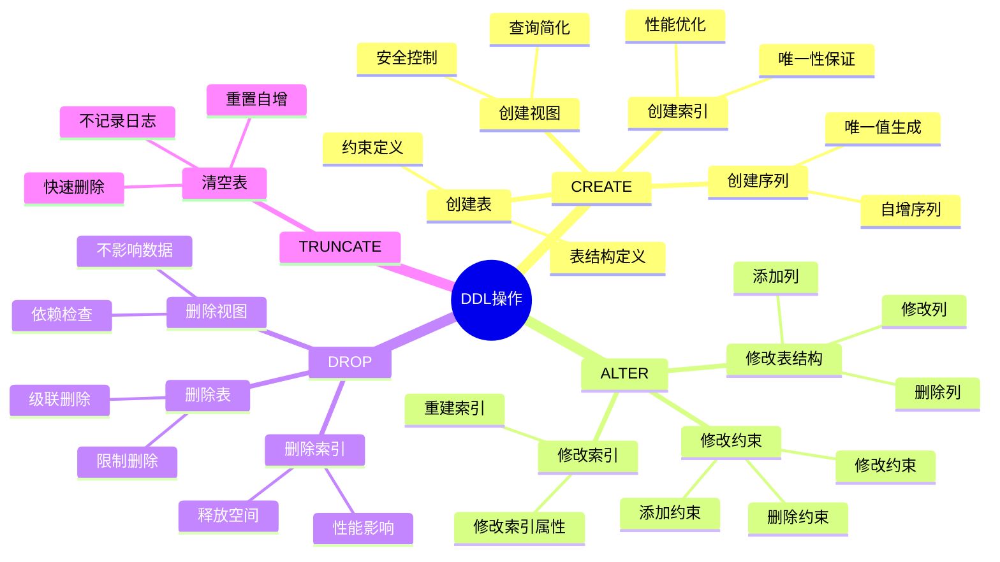
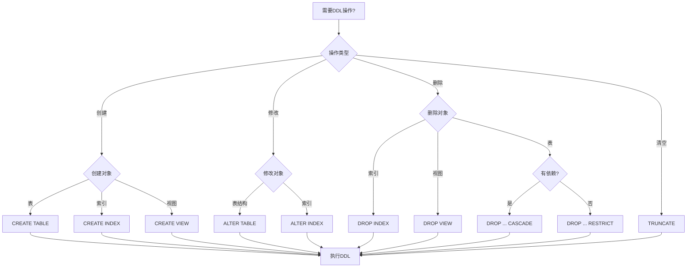
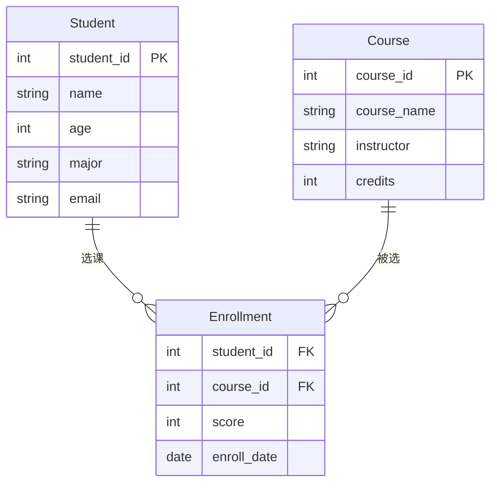
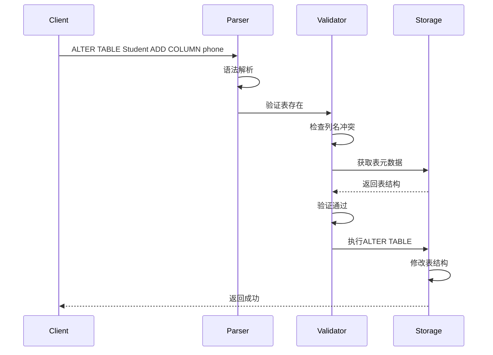

# 数据定义语言(DDL)

> **创建日期**：2025-01-15
> **最后更新**：2025-01-15
> **版本**：v1.0.0
> **难度**：⭐⭐⭐
> **应用场景**：数据库设计、表结构定义、模式管理

---

## 📋 目录

- [数据定义语言(DDL)](#数据定义语言ddl)
  - [📋 目录](#-目录)
  - [一、概述](#一概述)
    - [1.1 DDL操作思维导图](#11-ddl操作思维导图)
    - [1.2 DDL操作决策树](#12-ddl操作决策树)
    - [1.3 DDL操作对比矩阵](#13-ddl操作对比矩阵)
  - [二、CREATE TABLE](#二create-table)
    - [2.1 基本语法](#21-基本语法)
    - [2.2 场景示例：学生管理系统表结构设计](#22-场景示例学生管理系统表结构设计)
  - [三、ALTER TABLE](#三alter-table)
    - [3.1 基本语法](#31-基本语法)
    - [3.2 场景示例：表结构修改](#32-场景示例表结构修改)
  - [四、DROP TABLE](#四drop-table)
    - [4.1 基本语法](#41-基本语法)
  - [五、TRUNCATE TABLE](#五truncate-table)
    - [5.1 基本语法](#51-基本语法)
  - [六、索引操作](#六索引操作)
    - [6.1 CREATE INDEX](#61-create-index)
    - [6.2 DROP INDEX](#62-drop-index)
  - [七、视图操作](#七视图操作)
    - [7.1 CREATE VIEW](#71-create-view)
    - [7.2 DROP VIEW](#72-drop-view)
  - [八、相关资源](#八相关资源)
    - [相关文档](#相关文档)

---

## 一、概述

**数据定义语言（DDL, Data Definition Language）**用于定义和管理数据库结构，包括表、索引、视图等对象。

**DDL主要语句**：

- CREATE：创建数据库对象
- ALTER：修改数据库对象
- DROP：删除数据库对象
- TRUNCATE：清空表数据

### 1.1 DDL操作思维导图



### 1.2 DDL操作决策树



### 1.3 DDL操作对比矩阵

| 操作 | 语句 | 可回滚 | 性能 | 影响范围 | 使用场景 |
|------|------|--------|------|---------|---------|
| **CREATE TABLE** | CREATE TABLE | ✅ | 中 | 新对象 | 创建新表 |
| **ALTER TABLE** | ALTER TABLE | ⚠️ | 中-高 | 现有表 | 修改表结构 |
| **DROP TABLE** | DROP TABLE | ❌ | 高 | 表及数据 | 删除表 |
| **TRUNCATE** | TRUNCATE | ❌ | 很高 | 表数据 | 快速清空 |
| **CREATE INDEX** | CREATE INDEX | ✅ | 中-高 | 新索引 | 创建索引 |
| **DROP INDEX** | DROP INDEX | ✅ | 中 | 索引 | 删除索引 |

---

## 二、CREATE TABLE

### 2.1 基本语法

**CREATE TABLE语法**：

```sql
CREATE TABLE table_name (
    column_name data_type [constraint],
    ...
    [table_constraint]
);
```

### 2.2 场景示例：学生管理系统表结构设计

**业务需求**：设计一个学生管理系统，需要存储学生信息、课程信息和选课记录。

**数据模型ER图**：



**DDL实现**：

```sql
-- 创建学生表
CREATE TABLE Student (
    student_id INTEGER PRIMARY KEY,
    name VARCHAR(50) NOT NULL,
    age INTEGER CHECK (age >= 0 AND age <= 150),
    major VARCHAR(50),
    email VARCHAR(100) UNIQUE
);

-- 创建课程表
CREATE TABLE Course (
    course_id INTEGER PRIMARY KEY,
    course_name VARCHAR(100) NOT NULL,
    instructor VARCHAR(50),
    credits INTEGER CHECK (credits > 0)
);

-- 创建选课表
CREATE TABLE Enrollment (
    student_id INTEGER,
    course_id INTEGER,
    score INTEGER CHECK (score >= 0 AND score <= 100),
    enroll_date DATE,
    PRIMARY KEY (student_id, course_id),
    FOREIGN KEY (student_id) REFERENCES Student(student_id),
    FOREIGN KEY (course_id) REFERENCES Course(course_id)
);

-- 创建索引优化查询
CREATE INDEX idx_student_major ON Student(major);
CREATE INDEX idx_enrollment_student ON Enrollment(student_id);
CREATE INDEX idx_enrollment_course ON Enrollment(course_id);
CREATE INDEX idx_enrollment_score ON Enrollment(score);
```

**约束说明**：

- **PRIMARY KEY**：定义主键，保证唯一性和非空
- **FOREIGN KEY**：定义外键，保证参照完整性
- **NOT NULL**：保证非空约束
- **UNIQUE**：保证唯一性约束
- **CHECK**：保证域完整性约束

---

## 三、ALTER TABLE

### 3.1 基本语法

**ALTER TABLE语法**：

```sql
ALTER TABLE table_name
    ADD column_name data_type [constraint]
    | DROP COLUMN column_name
    | ALTER COLUMN column_name SET data_type
    | ADD CONSTRAINT constraint_name constraint_definition
    | DROP CONSTRAINT constraint_name;
```

### 3.2 场景示例：表结构修改

**业务需求**：在学生管理系统中，需要添加学生电话号码字段，并修改邮箱字段长度。

**ALTER TABLE实现**：

```sql
-- 添加新列
ALTER TABLE Student
ADD COLUMN phone VARCHAR(20);

-- 修改列类型
ALTER TABLE Student
ALTER COLUMN email SET DATA TYPE VARCHAR(200);

-- 添加约束
ALTER TABLE Student
ADD CONSTRAINT chk_phone_format
CHECK (phone ~ '^[0-9]{10,11}$');

-- 删除约束
ALTER TABLE Student
DROP CONSTRAINT chk_phone_format;
```

**表结构修改执行流程时序图**：



---

## 四、DROP TABLE

### 4.1 基本语法

**DROP TABLE语法**：

```sql
DROP TABLE table_name [CASCADE | RESTRICT];
```

---

## 五、TRUNCATE TABLE

### 5.1 基本语法

**TRUNCATE TABLE语法**：

```sql
TRUNCATE TABLE table_name;
```

---

## 六、索引操作

### 6.1 CREATE INDEX

**CREATE INDEX语法**：

```sql
CREATE INDEX index_name ON table_name (column_list);
```

### 6.2 DROP INDEX

**DROP INDEX语法**：

```sql
DROP INDEX index_name;
```

---

## 七、视图操作

### 7.1 CREATE VIEW

**CREATE VIEW语法**：

```sql
CREATE VIEW view_name AS
SELECT ...;
```

### 7.2 DROP VIEW

**DROP VIEW语法**：

```sql
DROP VIEW view_name;
```

---

## 八、相关资源

### 相关文档

- [数据操作语言(DML)](./04.02-数据操作语言(DML).md) - DML语法
- [数据查询语言(DQL)](./04.03-数据查询语言(DQL).md) - DQL语法

---

**维护者**: SQL Standards Team
**最后更新**: 2025-01-15
