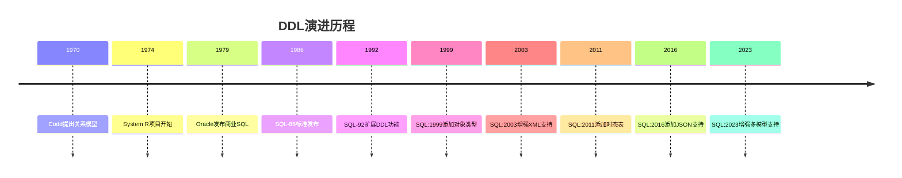
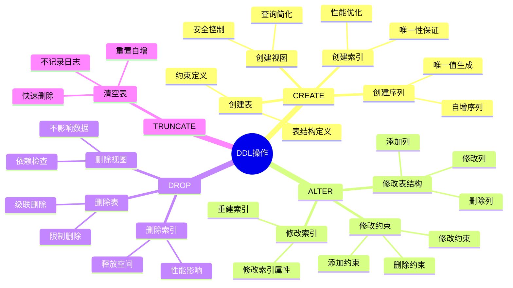
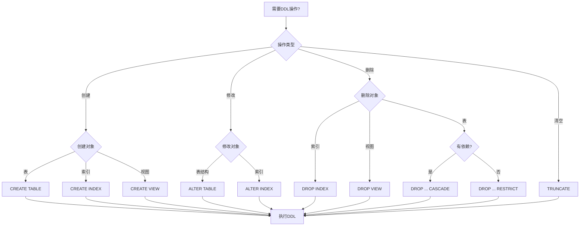
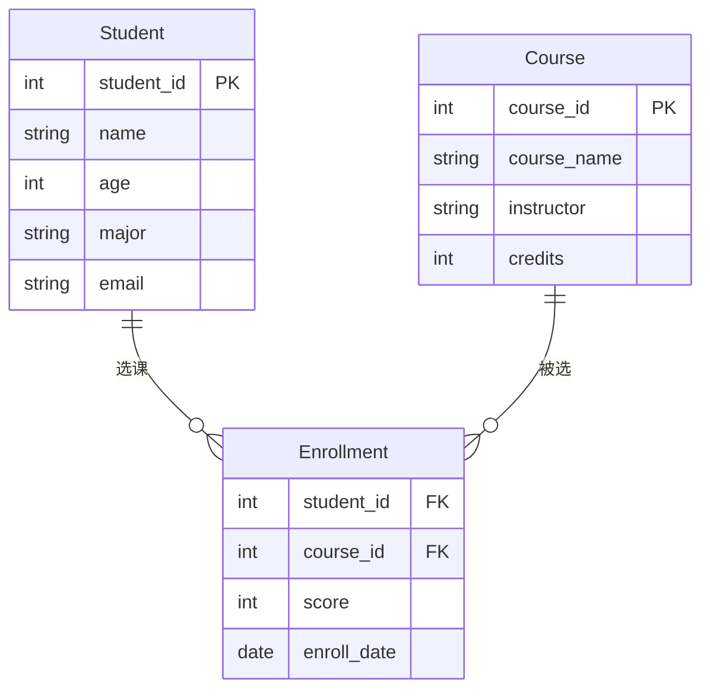
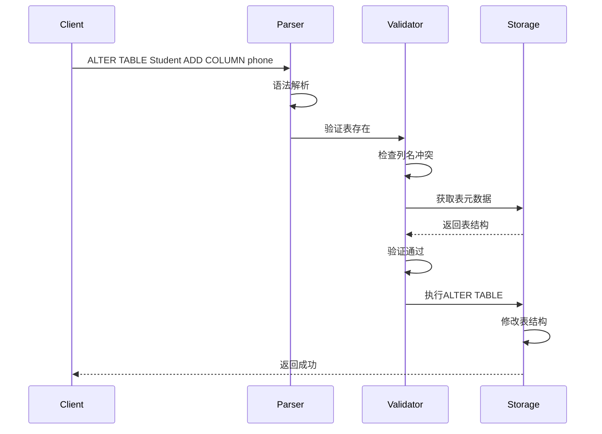

# 数据定义语言(DDL)

> **创建日期**：2025-01-15
> **最后更新**：2025-01-16
> **版本**：v1.0.0
> **难度**：⭐⭐⭐
> **应用场景**：数据库设计、表结构定义、模式管理

---

## 📋 目录

- [数据定义语言(DDL)](#数据定义语言ddl)
  - [📋 目录](#-目录)
  - [一、概述](#一概述)
    - [1.0 DDL的历史背景](#10-ddl的历史背景)
      - [1.0.1 DDL的起源](#101-ddl的起源)
      - [1.0.2 DDL在SQL标准中的位置](#102-ddl在sql标准中的位置)
      - [1.0.3 DDL的形式化定义](#103-ddl的形式化定义)
      - [1.0.4 DDL与关系模型的对应关系](#104-ddl与关系模型的对应关系)
    - [1.1 DDL操作思维导图](#11-ddl操作思维导图)
    - [1.2 DDL操作决策树](#12-ddl操作决策树)
    - [1.3 DDL操作对比矩阵](#13-ddl操作对比矩阵)
  - [二、CREATE TABLE](#二create-table)
    - [2.1 CREATE TABLE的历史背景](#21-create-table的历史背景)
      - [2.1.1 CREATE TABLE的演进](#211-create-table的演进)
      - [2.1.2 CREATE TABLE的BNF语法定义](#212-create-table的bnf语法定义)
      - [2.1.3 CREATE TABLE的形式化语义](#213-create-table的形式化语义)
    - [2.2 基本语法](#22-基本语法)
    - [2.3 数据类型详解](#23-数据类型详解)
      - [2.3.1 SQL标准数据类型](#231-sql标准数据类型)
      - [2.3.2 数据类型的数学定义](#232-数据类型的数学定义)
    - [2.4 约束详解](#24-约束详解)
      - [2.4.1 主键约束（PRIMARY KEY）](#241-主键约束primary-key)
      - [2.4.2 外键约束（FOREIGN KEY）](#242-外键约束foreign-key)
      - [2.4.3 唯一性约束（UNIQUE）](#243-唯一性约束unique)
      - [2.4.4 检查约束（CHECK）](#244-检查约束check)
      - [2.4.5 非空约束（NOT NULL）](#245-非空约束not-null)
    - [2.5 CREATE TABLE的标准演进](#25-create-table的标准演进)
      - [2.5.1 SQL-86到SQL-92的演进](#251-sql-86到sql-92的演进)
      - [2.5.2 SQL:1999到SQL:2023的演进](#252-sql1999到sql2023的演进)
    - [2.2 场景示例：学生管理系统表结构设计](#22-场景示例学生管理系统表结构设计)
  - [三、ALTER TABLE](#三alter-table)
    - [3.1 ALTER TABLE的历史背景](#31-alter-table的历史背景)
      - [3.1.1 ALTER TABLE的演进](#311-alter-table的演进)
      - [3.1.2 ALTER TABLE的BNF语法定义](#312-alter-table的bnf语法定义)
      - [3.1.3 ALTER TABLE的形式化语义](#313-alter-table的形式化语义)
    - [3.2 基本语法](#32-基本语法)
    - [3.3 ALTER TABLE操作详解](#33-alter-table操作详解)
      - [3.3.1 添加列（ADD COLUMN）](#331-添加列add-column)
      - [3.3.2 删除列（DROP COLUMN）](#332-删除列drop-column)
      - [3.3.3 修改列（ALTER COLUMN）](#333-修改列alter-column)
      - [3.3.4 添加约束（ADD CONSTRAINT）](#334-添加约束add-constraint)
      - [3.3.5 删除约束（DROP CONSTRAINT）](#335-删除约束drop-constraint)
    - [3.4 ALTER TABLE的性能考虑](#34-alter-table的性能考虑)
    - [3.2 场景示例：表结构修改](#32-场景示例表结构修改)
  - [四、DROP TABLE](#四drop-table)
    - [4.1 DROP TABLE的历史背景](#41-drop-table的历史背景)
      - [4.1.1 DROP TABLE的演进](#411-drop-table的演进)
      - [4.1.2 DROP TABLE的BNF语法定义](#412-drop-table的bnf语法定义)
      - [4.1.3 DROP TABLE的形式化语义](#413-drop-table的形式化语义)
    - [4.2 基本语法](#42-基本语法)
    - [4.3 DROP TABLE操作详解](#43-drop-table操作详解)
      - [4.3.1 RESTRICT选项](#431-restrict选项)
      - [4.3.2 CASCADE选项](#432-cascade选项)
    - [4.4 DROP TABLE的安全考虑](#44-drop-table的安全考虑)
  - [五、TRUNCATE TABLE](#五truncate-table)
    - [5.1 TRUNCATE TABLE的历史背景](#51-truncate-table的历史背景)
      - [5.1.1 TRUNCATE TABLE的演进](#511-truncate-table的演进)
      - [5.1.2 TRUNCATE TABLE的BNF语法定义](#512-truncate-table的bnf语法定义)
      - [5.1.3 TRUNCATE TABLE的形式化语义](#513-truncate-table的形式化语义)
    - [5.2 基本语法](#52-基本语法)
    - [5.3 TRUNCATE TABLE操作详解](#53-truncate-table操作详解)
      - [5.3.1 TRUNCATE TABLE的语义](#531-truncate-table的语义)
      - [5.3.2 TRUNCATE TABLE vs DELETE](#532-truncate-table-vs-delete)
    - [5.4 TRUNCATE TABLE的使用场景](#54-truncate-table的使用场景)
  - [六、索引操作](#六索引操作)
    - [6.1 索引的历史背景](#61-索引的历史背景)
      - [6.1.1 索引的演进](#611-索引的演进)
      - [6.1.2 索引的形式化定义](#612-索引的形式化定义)
    - [6.2 CREATE INDEX](#62-create-index)
      - [6.2.1 CREATE INDEX的BNF语法](#621-create-index的bnf语法)
      - [6.2.2 CREATE INDEX的基本语法](#622-create-index的基本语法)
      - [6.2.3 索引类型](#623-索引类型)
    - [6.3 DROP INDEX](#63-drop-index)
      - [6.3.1 DROP INDEX的BNF语法](#631-drop-index的bnf语法)
      - [6.3.2 DROP INDEX的基本语法](#632-drop-index的基本语法)
    - [6.4 索引的最佳实践](#64-索引的最佳实践)
  - [七、视图操作](#七视图操作)
    - [7.1 视图的历史背景](#71-视图的历史背景)
      - [7.1.1 视图的演进](#711-视图的演进)
      - [7.1.2 视图的形式化定义](#712-视图的形式化定义)
    - [7.2 CREATE VIEW](#72-create-view)
      - [7.2.1 CREATE VIEW的BNF语法](#721-create-view的bnf语法)
      - [7.2.2 CREATE VIEW的基本语法](#722-create-view的基本语法)
      - [7.2.3 视图类型](#723-视图类型)
    - [7.3 DROP VIEW](#73-drop-view)
      - [7.3.1 DROP VIEW的BNF语法](#731-drop-view的bnf语法)
      - [7.3.2 DROP VIEW的基本语法](#732-drop-view的基本语法)
    - [7.4 视图的最佳实践](#74-视图的最佳实践)
  - [八、PostgreSQL 18 DDL新特性 🆕](#八postgresql-18-ddl新特性-)
    - [8.1 虚拟生成列](#81-虚拟生成列)
    - [8.2 分区表增强](#82-分区表增强)
  - [九、SQLite 3.45+ DDL特性 🆕](#九sqlite-345-ddl特性-)
    - [9.1 STRICT表](#91-strict表)
    - [9.2 生成列](#92-生成列)
    - [9.3 ALTER TABLE限制与解决方案](#93-alter-table限制与解决方案)
  - [十、相关资源](#十相关资源)
    - [相关文档](#相关文档)
    - [外部资源](#外部资源)

---

## 一、概述

**数据定义语言（DDL, Data Definition Language）**用于定义和管理数据库结构，包括表、索引、视图等对象。

**DDL主要语句**：

- CREATE：创建数据库对象
- ALTER：修改数据库对象
- DROP：删除数据库对象
- TRUNCATE：清空表数据

### 1.0 DDL的历史背景

#### 1.0.1 DDL的起源

**历史背景**：

DDL的概念最早出现在1970年代，随着关系数据库模型的发展而诞生：

- **1970年**：Codd提出关系模型，奠定了DDL的理论基础
- **1974年**：IBM的System R项目开始开发，首次实现了SQL的DDL功能
- **1979年**：Oracle发布第一个商业SQL数据库，包含完整的DDL支持
- **1986年**：SQL-86标准正式发布，DDL成为SQL标准的核心组成部分

**DDL的演进历程**：



#### 1.0.2 DDL在SQL标准中的位置

**DDL在SQL标准中的定义**：

根据ISO/IEC 9075标准，SQL语言分为以下几个部分：

1. **Framework (SQL/Framework)**：SQL框架
2. **Foundation (SQL/Foundation)**：SQL基础，包含DDL、DML、DQL
3. **Call-Level Interface (SQL/CLI)**：调用级接口
4. **Persistent Stored Modules (SQL/PSM)**：持久存储模块
5. **Management of External Data (SQL/MED)**：外部数据管理
6. **Object Language Bindings (SQL/OLB)**：对象语言绑定
7. **Information and Definition Schemas (SQL/Schemata)**：信息和定义模式
8. **JAVA Routines and Types (SQL/JRT)**：JAVA例程和类型
9. **XML-Related Specifications (SQL/XML)**：XML相关规范

**DDL属于SQL/Foundation部分**，是SQL标准的核心组成部分。

#### 1.0.3 DDL的形式化定义

**DDL的数学定义**：

```latex
\text{DDL（数据定义语言）是一个四元组：}
\text{DDL} = (\text{Objects}, \text{Operations}, \text{Constraints}, \text{Semantics})

\text{其中：}
- \text{Objects} = \{\text{Table}, \text{Index}, \text{View}, \text{Sequence}, \ldots\} \text{ 是数据库对象集合}
- \text{Operations} = \{\text{CREATE}, \text{ALTER}, \text{DROP}, \text{TRUNCATE}\} \text{ 是DDL操作集合}
- \text{Constraints} = \{\text{PRIMARY KEY}, \text{FOREIGN KEY}, \text{UNIQUE}, \text{CHECK}, \text{NOT NULL}\} \text{ 是约束集合}
- \text{Semantics} \text{ 是DDL操作的语义函数}
```

**DDL操作的语义函数**：

```latex
\text{CREATE操作的语义：}
\text{Semantics}(\text{CREATE TABLE } T(\text{cols})) =
  \text{Schema} \cup \{T: (\text{cols}, \text{constraints})\}

\text{ALTER操作的语义：}
\text{Semantics}(\text{ALTER TABLE } T \text{ ADD COLUMN } c) =
  \text{Schema}[T] \cup \{c\}

\text{DROP操作的语义：}
\text{Semantics}(\text{DROP TABLE } T) =
  \text{Schema} \setminus \{T\}
```

#### 1.0.4 DDL与关系模型的对应关系

**DDL操作与关系模型概念的对应**：

| DDL操作 | 关系模型概念 | 数学表示 | 说明 |
|---------|------------|---------|------|
| **CREATE TABLE** | 关系模式定义 | $R(A_1, A_2, \ldots, A_n)$ | 定义关系的结构 |
| **PRIMARY KEY** | 主键约束 | $\text{PK} \subseteq A$ | 定义关系的主键 |
| **FOREIGN KEY** | 外键约束 | $R_1[FK] \subseteq R_2[PK]$ | 定义参照完整性 |
| **UNIQUE** | 唯一性约束 | $\forall t_1, t_2: t_1[U] \neq t_2[U]$ | 定义唯一性 |
| **CHECK** | 域完整性约束 | $\forall t: \phi(t) = \text{true}$ | 定义域约束 |
| **NOT NULL** | 非空约束 | $\forall t: t[A] \neq \text{NULL}$ | 定义非空约束 |

**DDL在关系模型中的形式化表示**：

```latex
\text{关系模式 } R \text{ 的DDL定义：}
R = (A, \text{dom}, \text{constraints})

\text{其中：}
- A = \{A_1, A_2, \ldots, A_n\} \text{ 是属性集合}
- \text{dom}: A \to \text{Type} \text{ 是属性到类型的映射}
- \text{constraints} = \{\text{PK}, \text{FK}, \text{UNIQUE}, \text{CHECK}, \text{NOT NULL}\} \text{ 是约束集合}
```

### 1.1 DDL操作思维导图



### 1.2 DDL操作决策树



### 1.3 DDL操作对比矩阵

| 操作 | 语句 | 可回滚 | 性能 | 影响范围 | 使用场景 |
|------|------|--------|------|---------|---------|
| **CREATE TABLE** | CREATE TABLE | ✅ | 中 | 新对象 | 创建新表 |
| **ALTER TABLE** | ALTER TABLE | ⚠️ | 中-高 | 现有表 | 修改表结构 |
| **DROP TABLE** | DROP TABLE | ❌ | 高 | 表及数据 | 删除表 |
| **TRUNCATE** | TRUNCATE | ❌ | 很高 | 表数据 | 快速清空 |
| **CREATE INDEX** | CREATE INDEX | ✅ | 中-高 | 新索引 | 创建索引 |
| **DROP INDEX** | DROP INDEX | ✅ | 中 | 索引 | 删除索引 |

---

## 二、CREATE TABLE

### 2.1 CREATE TABLE的历史背景

#### 2.1.1 CREATE TABLE的演进

**历史演进**：

- **SQL-86**：首次标准化CREATE TABLE语法
- **SQL-92**：扩展了约束定义，支持命名约束
- **SQL:1999**：添加了对象类型和用户定义类型支持
- **SQL:2003**：增强了XML类型支持
- **SQL:2011**：添加了时态表（Temporal Tables）支持
- **SQL:2016**：增强了JSON类型支持
- **SQL:2023**：添加了多模型数据库支持

#### 2.1.2 CREATE TABLE的BNF语法定义

**CREATE TABLE的BNF语法**：

```bnf
<create_table_statement> ::=
    CREATE [GLOBAL TEMPORARY | LOCAL TEMPORARY] TABLE <table_name>
    <table_element_list>
    [ON COMMIT {DELETE | PRESERVE} ROWS]

<table_element_list> ::=
    <left_paren> <table_element> [ { <comma> <table_element> }... ] <right_paren>

<table_element> ::=
    <column_definition>
    | <table_constraint_definition>
    | <like_clause>

<column_definition> ::=
    <column_name> <data_type> [ <default_clause> ]
    [ <column_constraint_definition>... ]
    [ <collate_clause> ]

<column_constraint_definition> ::=
    [ <constraint_name_definition> ] <column_constraint> [ <constraint_characteristics> ]

<column_constraint> ::=
    NOT NULL
    | <unique_specification>
    | <references_specification>
    | <check_constraint_definition>

<table_constraint_definition> ::=
    [ <constraint_name_definition> ] <table_constraint> [ <constraint_characteristics> ]

<table_constraint> ::=
    <unique_constraint_definition>
    | <referential_constraint_definition>
    | <check_constraint_definition>
```

#### 2.1.3 CREATE TABLE的形式化语义

**CREATE TABLE的语义函数**：

```latex
\text{CREATE TABLE的语义函数：}
\text{Semantics}(\text{CREATE TABLE } T(\text{cols}, \text{constraints})) =
  \text{Schema}' = \text{Schema} \cup \{T: (\text{cols}, \text{constraints})\}

\text{其中：}
- \text{Schema} \text{ 是当前数据库模式}
- T \text{ 是新创建的表名}
- \text{cols} = \{(c_1, \text{type}_1), (c_2, \text{type}_2), \ldots\} \text{ 是列定义集合}
- \text{constraints} = \{\text{PK}, \text{FK}, \text{UNIQUE}, \text{CHECK}, \text{NOT NULL}\} \text{ 是约束集合}
- \text{Schema}' \text{ 是更新后的数据库模式}
```

**CREATE TABLE的前置条件和后置条件**：

```latex
\text{前置条件（Precondition）：}
1. T \notin \text{Schema} \text{（表名不存在）}
2. \forall c \in \text{cols}: c.\text{name} \text{ 唯一}
3. \forall \text{constraint} \in \text{constraints}: \text{constraint} \text{ 语法正确}

\text{后置条件（Postcondition）：}
1. T \in \text{Schema}' \text{（表已创建）}
2. \text{Schema}'[T] = (\text{cols}, \text{constraints}) \text{（表结构正确）}
3. \text{Schema}' \text{ 满足所有完整性约束}
```

### 2.2 基本语法

**CREATE TABLE语法**：

```sql
CREATE TABLE table_name (
    column_name data_type [constraint],
    ...
    [table_constraint]
);
```

**完整语法（SQL:2023）**：

```sql
CREATE [GLOBAL TEMPORARY | LOCAL TEMPORARY] TABLE table_name
(
    { <column_definition> | <table_constraint> } [ , ... ]
)
[ON COMMIT {DELETE | PRESERVE} ROWS]
[PARTITION BY {RANGE | LIST | HASH} (column_name)]
[WITH (storage_parameter = value [, ...])];
```

### 2.3 数据类型详解

#### 2.3.1 SQL标准数据类型

**SQL标准数据类型分类**：

| 数据类型类别 | SQL标准类型 | 说明 | 标准版本 |
|------------|------------|------|---------|
| **数值类型** | INTEGER, SMALLINT, BIGINT | 整数类型 | SQL-86 |
| | DECIMAL(p,s), NUMERIC(p,s) | 精确数值 | SQL-86 |
| | REAL, DOUBLE PRECISION | 浮点数 | SQL-86 |
| | FLOAT(p) | 浮点数 | SQL-92 |
| **字符类型** | CHARACTER(n), CHAR(n) | 定长字符串 | SQL-86 |
| | CHARACTER VARYING(n), VARCHAR(n) | 变长字符串 | SQL-86 |
| | CHARACTER LARGE OBJECT, CLOB | 大文本 | SQL:1999 |
| **二进制类型** | BINARY(n) | 定长二进制 | SQL:1999 |
| | BINARY VARYING(n), VARBINARY(n) | 变长二进制 | SQL:1999 |
| | BINARY LARGE OBJECT, BLOB | 大二进制 | SQL:1999 |
| **日期时间类型** | DATE | 日期 | SQL-92 |
| | TIME(p) | 时间 | SQL-92 |
| | TIMESTAMP(p) | 时间戳 | SQL-92 |
| | INTERVAL | 时间间隔 | SQL-92 |
| **布尔类型** | BOOLEAN | 布尔值 | SQL:1999 |
| **XML类型** | XML | XML数据 | SQL:2003 |
| **JSON类型** | JSON, JSONB | JSON数据 | SQL:2016 |

#### 2.3.2 数据类型的数学定义

**数据类型的域（Domain）定义**：

```latex
\text{数据类型 } T \text{ 的域定义为：}
\text{dom}(T) = \{v \mid v \text{ 是类型 } T \text{ 的有效值}\}

\text{例如：}
- \text{dom}(\text{INTEGER}) = \{n \in \mathbb{Z} \mid -2^{31} \leq n \leq 2^{31}-1\}
- \text{dom}(\text{VARCHAR}(n)) = \{s \in \Sigma^* \mid |s| \leq n\}
- \text{dom}(\text{BOOLEAN}) = \{\text{TRUE}, \text{FALSE}, \text{NULL}\}
```

### 2.4 约束详解

#### 2.4.1 主键约束（PRIMARY KEY）

**主键约束的形式化定义**：

```latex
\text{主键约束 } \text{PK}(A) \text{ 定义为：}
\forall t_1, t_2 \in R: (t_1 \neq t_2) \Rightarrow (t_1[A] \neq t_2[A]) \land (\forall a \in A: t_1[a] \neq \text{NULL})

\text{其中 } A \subseteq \text{Attr}(R) \text{ 是主键属性集合}
```

**主键约束的性质**：

1. **唯一性**：主键值在表中唯一
2. **非空性**：主键属性不能为NULL
3. **最小性**：主键是候选键，且不能包含冗余属性
4. **稳定性**：主键值通常不随时间变化

#### 2.4.2 外键约束（FOREIGN KEY）

**外键约束的形式化定义**：

```latex
\text{外键约束 } \text{FK}(R_1[FK], R_2[PK]) \text{ 定义为：}
\forall t_1 \in R_1: (t_1[FK] \neq \text{NULL}) \Rightarrow (\exists t_2 \in R_2: t_1[FK] = t_2[PK])

\text{其中：}
- R_1 \text{ 是引用表（子表）}
- R_2 \text{ 是被引用表（父表）}
- FK \subseteq \text{Attr}(R_1) \text{ 是外键属性集合}
- PK \subseteq \text{Attr}(R_2) \text{ 是被引用的主键属性集合}
```

**外键约束的级联操作**：

```latex
\text{外键级联操作：}
- \text{ON DELETE CASCADE}: \text{删除父表记录时，自动删除子表相关记录}
- \text{ON DELETE SET NULL}: \text{删除父表记录时，将子表外键设为NULL}
- \text{ON DELETE RESTRICT}: \text{如果存在子表引用，禁止删除父表记录}
- \text{ON UPDATE CASCADE}: \text{更新父表主键时，自动更新子表外键}
```

#### 2.4.3 唯一性约束（UNIQUE）

**唯一性约束的形式化定义**：

```latex
\text{唯一性约束 } \text{UNIQUE}(A) \text{ 定义为：}
\forall t_1, t_2 \in R: (t_1 \neq t_2) \land (t_1[A] \neq \text{NULL}) \land (t_2[A] \neq \text{NULL}) \Rightarrow (t_1[A] \neq t_2[A])

\text{其中 } A \subseteq \text{Attr}(R) \text{ 是唯一性属性集合}
```

**唯一性约束与主键的区别**：

| 特性 | PRIMARY KEY | UNIQUE |
|------|------------|--------|
| **唯一性** | ✅ | ✅ |
| **非空性** | ✅（所有属性） | ❌（允许NULL） |
| **数量限制** | 每表一个 | 每表多个 |
| **索引** | 自动创建 | 自动创建 |
| **用途** | 标识记录 | 保证唯一性 |

#### 2.4.4 检查约束（CHECK）

**检查约束的形式化定义**：

```latex
\text{检查约束 } \text{CHECK}(\phi) \text{ 定义为：}
\forall t \in R: \phi(t) = \text{true}

\text{其中 } \phi \text{ 是一个谓词（布尔表达式）}
```

**检查约束的示例**：

```sql
-- 年龄检查约束
CHECK (age >= 0 AND age <= 150)

-- 邮箱格式检查约束
CHECK (email LIKE '%@%.%')

-- 日期范围检查约束
CHECK (start_date < end_date)
```

#### 2.4.5 非空约束（NOT NULL）

**非空约束的形式化定义**：

```latex
\text{非空约束 } \text{NOT NULL}(A) \text{ 定义为：}
\forall t \in R: t[A] \neq \text{NULL}

\text{其中 } A \in \text{Attr}(R) \text{ 是属性}
```

### 2.5 CREATE TABLE的标准演进

#### 2.5.1 SQL-86到SQL-92的演进

**SQL-86**：

- 基本的CREATE TABLE语法
- 支持基本数据类型
- 支持PRIMARY KEY、FOREIGN KEY、UNIQUE、CHECK约束

**SQL-92**：

- 支持命名约束（CONSTRAINT constraint_name）
- 增强了CHECK约束的表达能力
- 支持临时表（TEMPORARY TABLE）
- 支持ON DELETE和ON UPDATE级联操作

#### 2.5.2 SQL:1999到SQL:2023的演进

**SQL:1999**：

- 添加了用户定义类型（UDT）
- 支持对象类型和继承
- 增强了临时表功能

**SQL:2003**：

- 添加了XML类型支持
- 增强了数据类型系统

**SQL:2011**：

- 添加了时态表（Temporal Tables）支持
- 支持系统版本表和应用版本表

**SQL:2016**：

- 添加了JSON类型支持
- 增强了分区表功能

**SQL:2023**：

- 增强了多模型数据库支持
- 改进了分区表语法
- 增强了存储参数支持

### 2.2 场景示例：学生管理系统表结构设计

**业务需求**：设计一个学生管理系统，需要存储学生信息、课程信息和选课记录。

**数据模型ER图**：



**DDL实现**：

```sql
-- 创建学生表
CREATE TABLE Student (
    student_id INTEGER PRIMARY KEY,
    name VARCHAR(50) NOT NULL,
    age INTEGER CHECK (age >= 0 AND age <= 150),
    major VARCHAR(50),
    email VARCHAR(100) UNIQUE
);

-- 创建课程表
CREATE TABLE Course (
    course_id INTEGER PRIMARY KEY,
    course_name VARCHAR(100) NOT NULL,
    instructor VARCHAR(50),
    credits INTEGER CHECK (credits > 0)
);

-- 创建选课表
CREATE TABLE Enrollment (
    student_id INTEGER,
    course_id INTEGER,
    score INTEGER CHECK (score >= 0 AND score <= 100),
    enroll_date DATE,
    PRIMARY KEY (student_id, course_id),
    FOREIGN KEY (student_id) REFERENCES Student(student_id),
    FOREIGN KEY (course_id) REFERENCES Course(course_id)
);

-- 创建索引优化查询
CREATE INDEX idx_student_major ON Student(major);
CREATE INDEX idx_enrollment_student ON Enrollment(student_id);
CREATE INDEX idx_enrollment_course ON Enrollment(course_id);
CREATE INDEX idx_enrollment_score ON Enrollment(score);
```

**约束说明**：

- **PRIMARY KEY**：定义主键，保证唯一性和非空
- **FOREIGN KEY**：定义外键，保证参照完整性
- **NOT NULL**：保证非空约束
- **UNIQUE**：保证唯一性约束
- **CHECK**：保证域完整性约束

---

## 三、ALTER TABLE

### 3.1 ALTER TABLE的历史背景

#### 3.1.1 ALTER TABLE的演进

**历史演进**：

- **SQL-86**：不支持ALTER TABLE
- **SQL-92**：首次标准化ALTER TABLE语法，支持添加列、删除列、修改列
- **SQL:1999**：增强了ALTER TABLE功能，支持添加约束、删除约束
- **SQL:2003**：支持ALTER TABLE的更多操作
- **SQL:2011**：支持时态表的ALTER操作
- **SQL:2016**：增强了分区表的ALTER操作

#### 3.1.2 ALTER TABLE的BNF语法定义

**ALTER TABLE的BNF语法**：

```bnf
<alter_table_statement> ::=
    ALTER TABLE <table_name> <alter_table_action>

<alter_table_action> ::=
    <add_column_definition>
    | <alter_column_definition>
    | <drop_column_definition>
    | <add_table_constraint_definition>
    | <drop_table_constraint_definition>
    | <rename_column_definition>
    | <rename_table_definition>

<add_column_definition> ::=
    ADD [COLUMN] <column_definition>

<alter_column_definition> ::=
    ALTER [COLUMN] <column_name> <alter_column_action>

<alter_column_action> ::=
    <set_column_default_clause>
    | <drop_column_default_clause>
    | <alter_column_data_type>
    | <set_column_not_null_clause>
    | <drop_column_not_null_clause>

<drop_column_definition> ::=
    DROP [COLUMN] <column_name> [RESTRICT | CASCADE]

<add_table_constraint_definition> ::=
    ADD <table_constraint_definition>

<drop_table_constraint_definition> ::=
    DROP CONSTRAINT <constraint_name> [RESTRICT | CASCADE]
```

#### 3.1.3 ALTER TABLE的形式化语义

**ALTER TABLE的语义函数**：

```latex
\text{ALTER TABLE的语义函数：}

\text{添加列：}
\text{Semantics}(\text{ALTER TABLE } T \text{ ADD COLUMN } c) =
  \text{Schema}'[T] = \text{Schema}[T] \cup \{c\}

\text{删除列：}
\text{Semantics}(\text{ALTER TABLE } T \text{ DROP COLUMN } c) =
  \text{Schema}'[T] = \text{Schema}[T] \setminus \{c\}

\text{修改列类型：}
\text{Semantics}(\text{ALTER TABLE } T \text{ ALTER COLUMN } c \text{ SET TYPE } t') =
  \text{Schema}'[T][c] = t' \text{（需要数据转换）}
```

**ALTER TABLE的前置条件和后置条件**：

```latex
\text{添加列的前置条件：}
1. T \in \text{Schema} \text{（表存在）}
2. c.\text{name} \notin \text{Schema}[T] \text{（列名不存在）}

\text{删除列的前置条件：}
1. T \in \text{Schema} \text{（表存在）}
2. c \in \text{Schema}[T] \text{（列存在）}
3. \text{没有约束依赖列 } c \text{（除非使用CASCADE）}

\text{后置条件：}
1. \text{Schema}'[T] \text{ 满足所有完整性约束}
2. \text{数据一致性得到保持}
```

### 3.2 基本语法

**ALTER TABLE语法**：

```sql
ALTER TABLE table_name
    ADD column_name data_type [constraint]
    | DROP COLUMN column_name
    | ALTER COLUMN column_name SET data_type
    | ADD CONSTRAINT constraint_name constraint_definition
    | DROP CONSTRAINT constraint_name;
```

**完整语法（SQL:2023）**：

```sql
ALTER TABLE table_name
{
    ADD [COLUMN] <column_definition>
    | ALTER [COLUMN] column_name <alter_column_action>
    | DROP [COLUMN] column_name [RESTRICT | CASCADE]
    | ADD <table_constraint_definition>
    | DROP CONSTRAINT constraint_name [RESTRICT | CASCADE]
    | RENAME COLUMN old_name TO new_name
    | RENAME TO new_table_name
};
```

### 3.3 ALTER TABLE操作详解

#### 3.3.1 添加列（ADD COLUMN）

**添加列的语法**：

```sql
ALTER TABLE table_name
ADD [COLUMN] column_name data_type [DEFAULT default_value] [constraints];
```

**添加列的语义**：

```latex
\text{添加列的语义：}
\text{对于表 } T \text{ 和列 } c: \text{type} = t，
\text{添加列后的表结构：}
\text{Schema}'[T] = \text{Schema}[T] \cup \{(c, t, \text{default}, \text{constraints})\}

\text{对于现有数据：}
\forall t \in T: t'[c] = \text{default} \text{（如果指定了默认值）}
\text{或 } t'[c] = \text{NULL} \text{（如果没有默认值且允许NULL）}
```

**添加列的示例**：

```sql
-- 添加新列（带默认值）
ALTER TABLE Student
ADD COLUMN phone VARCHAR(20) DEFAULT 'N/A';

-- 添加新列（带约束）
ALTER TABLE Student
ADD COLUMN registration_date DATE NOT NULL DEFAULT CURRENT_DATE;

-- 添加新列（带检查约束）
ALTER TABLE Student
ADD COLUMN age INTEGER CHECK (age >= 0 AND age <= 150);
```

#### 3.3.2 删除列（DROP COLUMN）

**删除列的语法**：

```sql
ALTER TABLE table_name
DROP [COLUMN] column_name [RESTRICT | CASCADE];
```

**删除列的语义**：

```latex
\text{删除列的语义：}
\text{对于表 } T \text{ 和列 } c，
\text{删除列后的表结构：}
\text{Schema}'[T] = \text{Schema}[T] \setminus \{c\}

\text{对于现有数据：}
\forall t \in T: t' = t \setminus \{c\} \text{（移除列 } c \text{ 的值）}
```

**删除列的选项**：

- **RESTRICT**：如果列被约束或其他对象引用，则禁止删除
- **CASCADE**：自动删除依赖该列的所有约束和对象

**删除列的示例**：

```sql
-- 删除列（RESTRICT，默认）
ALTER TABLE Student
DROP COLUMN phone;

-- 删除列（CASCADE，级联删除依赖）
ALTER TABLE Student
DROP COLUMN phone CASCADE;
```

#### 3.3.3 修改列（ALTER COLUMN）

**修改列的语法**：

```sql
ALTER TABLE table_name
ALTER [COLUMN] column_name <alter_column_action>;
```

**修改列的操作类型**：

1. **修改数据类型**：`ALTER COLUMN column_name SET DATA TYPE new_type`
2. **设置默认值**：`ALTER COLUMN column_name SET DEFAULT value`
3. **删除默认值**：`ALTER COLUMN column_name DROP DEFAULT`
4. **设置NOT NULL**：`ALTER COLUMN column_name SET NOT NULL`
5. **删除NOT NULL**：`ALTER COLUMN column_name DROP NOT NULL`

**修改列的示例**：

```sql
-- 修改列类型
ALTER TABLE Student
ALTER COLUMN email SET DATA TYPE VARCHAR(200);

-- 设置默认值
ALTER TABLE Student
ALTER COLUMN registration_date SET DEFAULT CURRENT_DATE;

-- 删除默认值
ALTER TABLE Student
ALTER COLUMN registration_date DROP DEFAULT;

-- 设置NOT NULL
ALTER TABLE Student
ALTER COLUMN name SET NOT NULL;

-- 删除NOT NULL
ALTER TABLE Student
ALTER COLUMN name DROP NOT NULL;
```

#### 3.3.4 添加约束（ADD CONSTRAINT）

**添加约束的语法**：

```sql
ALTER TABLE table_name
ADD CONSTRAINT constraint_name constraint_definition;
```

**添加约束的示例**：

```sql
-- 添加主键约束
ALTER TABLE Student
ADD CONSTRAINT pk_student PRIMARY KEY (student_id);

-- 添加外键约束
ALTER TABLE Enrollment
ADD CONSTRAINT fk_enrollment_student
FOREIGN KEY (student_id) REFERENCES Student(student_id);

-- 添加唯一性约束
ALTER TABLE Student
ADD CONSTRAINT uk_student_email UNIQUE (email);

-- 添加检查约束
ALTER TABLE Student
ADD CONSTRAINT chk_student_age CHECK (age >= 0 AND age <= 150);
```

#### 3.3.5 删除约束（DROP CONSTRAINT）

**删除约束的语法**：

```sql
ALTER TABLE table_name
DROP CONSTRAINT constraint_name [RESTRICT | CASCADE];
```

**删除约束的示例**：

```sql
-- 删除约束
ALTER TABLE Student
DROP CONSTRAINT chk_student_age;

-- 删除约束（CASCADE）
ALTER TABLE Student
DROP CONSTRAINT pk_student CASCADE;
```

### 3.4 ALTER TABLE的性能考虑

**ALTER TABLE的性能影响**：

1. **添加列**：通常很快，除非表很大且需要设置NOT NULL约束
2. **删除列**：可能需要重建表，性能较慢
3. **修改列类型**：需要数据转换，可能很慢
4. **添加约束**：需要验证现有数据，可能很慢
5. **删除约束**：通常很快

**ALTER TABLE的最佳实践**：

1. **在低峰期执行**：ALTER TABLE操作可能锁定表
2. **使用事务**：确保操作的原子性
3. **备份数据**：在执行ALTER TABLE前备份数据
4. **测试环境验证**：先在测试环境验证ALTER TABLE操作
5. **分批执行**：对于大表，考虑分批执行操作

### 3.2 场景示例：表结构修改

**业务需求**：在学生管理系统中，需要添加学生电话号码字段，并修改邮箱字段长度。

**ALTER TABLE实现**：

```sql
-- 添加新列
ALTER TABLE Student
ADD COLUMN phone VARCHAR(20);

-- 修改列类型
ALTER TABLE Student
ALTER COLUMN email SET DATA TYPE VARCHAR(200);

-- 添加约束
ALTER TABLE Student
ADD CONSTRAINT chk_phone_format
CHECK (phone ~ '^[0-9]{10,11}$');

-- 删除约束
ALTER TABLE Student
DROP CONSTRAINT chk_phone_format;
```

**表结构修改执行流程时序图**：



---

## 四、DROP TABLE

### 4.1 DROP TABLE的历史背景

#### 4.1.1 DROP TABLE的演进

**历史演进**：

- **SQL-86**：首次标准化DROP TABLE语法
- **SQL-92**：添加了CASCADE和RESTRICT选项
- **SQL:1999**：增强了依赖检查功能
- **SQL:2003**：支持临时表的DROP操作
- **SQL:2011**：支持时态表的DROP操作

#### 4.1.2 DROP TABLE的BNF语法定义

**DROP TABLE的BNF语法**：

```bnf
<drop_table_statement> ::=
    DROP TABLE <table_name> [RESTRICT | CASCADE]
```

#### 4.1.3 DROP TABLE的形式化语义

**DROP TABLE的语义函数**：

```latex
\text{DROP TABLE的语义函数：}
\text{Semantics}(\text{DROP TABLE } T \text{ [CASCADE | RESTRICT]}) =
  \text{Schema}' = \text{Schema} \setminus \{T\}

\text{前置条件：}
1. T \in \text{Schema} \text{（表存在）}
2. \text{如果使用RESTRICT：没有对象依赖表 } T
3. \text{如果使用CASCADE：允许级联删除依赖对象}

\text{后置条件：}
1. T \notin \text{Schema}' \text{（表已删除）}
2. \text{所有依赖对象也被删除（如果使用CASCADE）}
```

### 4.2 基本语法

**DROP TABLE语法**：

```sql
DROP TABLE table_name [CASCADE | RESTRICT];
```

**DROP TABLE的选项**：

- **RESTRICT**（默认）：如果表被其他对象引用，则禁止删除
- **CASCADE**：自动删除依赖该表的所有对象（视图、约束、索引等）

### 4.3 DROP TABLE操作详解

#### 4.3.1 RESTRICT选项

**RESTRICT选项的语义**：

```latex
\text{DROP TABLE ... RESTRICT的语义：}
\text{如果存在依赖对象 } D \text{ 依赖于表 } T，
\text{则操作失败，表 } T \text{ 不被删除}

\text{依赖对象包括：}
- \text{视图（VIEW）}
- \text{外键约束（FOREIGN KEY）}
- \text{触发器（TRIGGER）}
- \text{存储过程（STORED PROCEDURE）}
- \text{其他表的引用}
```

**RESTRICT选项的示例**：

```sql
-- 删除表（RESTRICT，默认）
DROP TABLE Student;

-- 如果Student表被Enrollment表的外键引用，操作失败
-- 错误：cannot drop table Student because other objects depend on it
```

#### 4.3.2 CASCADE选项

**CASCADE选项的语义**：

```latex
\text{DROP TABLE ... CASCADE的语义：}
\text{删除表 } T \text{ 及其所有依赖对象}

\text{级联删除的对象包括：}
- \text{视图（VIEW）}
- \text{外键约束（FOREIGN KEY）}
- \text{触发器（TRIGGER）}
- \text{索引（INDEX）}
- \text{其他依赖对象}
```

**CASCADE选项的示例**：

```sql
-- 删除表（CASCADE，级联删除依赖）
DROP TABLE Student CASCADE;

-- 自动删除：
-- 1. Enrollment表的外键约束
-- 2. 依赖Student表的视图
-- 3. 依赖Student表的触发器
-- 4. 其他依赖对象
```

### 4.4 DROP TABLE的安全考虑

**DROP TABLE的安全注意事项**：

1. **数据丢失**：DROP TABLE会永久删除表及其所有数据
2. **不可恢复**：DROP TABLE操作通常不可回滚（取决于数据库实现）
3. **依赖影响**：CASCADE选项会删除所有依赖对象
4. **权限要求**：需要DROP权限才能执行DROP TABLE

**DROP TABLE的最佳实践**：

1. **备份数据**：在执行DROP TABLE前备份数据
2. **检查依赖**：使用RESTRICT选项检查依赖关系
3. **使用事务**：如果数据库支持，在事务中执行DROP TABLE
4. **权限控制**：限制DROP TABLE权限，避免误操作
5. **审计日志**：记录所有DROP TABLE操作

---

## 五、TRUNCATE TABLE

### 5.1 TRUNCATE TABLE的历史背景

#### 5.1.1 TRUNCATE TABLE的演进

**历史演进**：

- **SQL-86**：不支持TRUNCATE TABLE
- **SQL-92**：首次标准化TRUNCATE TABLE语法
- **SQL:1999**：增强了TRUNCATE TABLE功能
- **SQL:2003**：支持TRUNCATE TABLE的更多选项

#### 5.1.2 TRUNCATE TABLE的BNF语法定义

**TRUNCATE TABLE的BNF语法**：

```bnf
<truncate_table_statement> ::=
    TRUNCATE TABLE <table_name> [RESTART IDENTITY | CONTINUE IDENTITY] [CASCADE | RESTRICT]
```

#### 5.1.3 TRUNCATE TABLE的形式化语义

**TRUNCATE TABLE的语义函数**：

```latex
\text{TRUNCATE TABLE的语义函数：}
\text{Semantics}(\text{TRUNCATE TABLE } T) =
  T' = \emptyset \text{（表变为空表）}

\text{前置条件：}
1. T \in \text{Schema} \text{（表存在）}
2. \text{没有外键约束引用表 } T \text{（除非使用CASCADE）}

\text{后置条件：}
1. |T'| = 0 \text{（表为空）}
2. \text{表结构保持不变}
3. \text{自增序列重置（如果使用RESTART IDENTITY）}
```

### 5.2 基本语法

**TRUNCATE TABLE语法**：

```sql
TRUNCATE TABLE table_name;
```

**完整语法（SQL:2023）**：

```sql
TRUNCATE TABLE table_name
[RESTART IDENTITY | CONTINUE IDENTITY]
[CASCADE | RESTRICT];
```

### 5.3 TRUNCATE TABLE操作详解

#### 5.3.1 TRUNCATE TABLE的语义

**TRUNCATE TABLE的特点**：

1. **快速删除**：比DELETE快得多，因为不记录日志
2. **不可回滚**：TRUNCATE TABLE通常不可回滚（取决于数据库实现）
3. **重置自增**：可以选择重置自增序列
4. **保持结构**：只删除数据，不删除表结构

#### 5.3.2 TRUNCATE TABLE vs DELETE

**TRUNCATE TABLE与DELETE的对比**：

| 特性 | TRUNCATE TABLE | DELETE |
|------|---------------|--------|
| **速度** | 很快 | 较慢 |
| **日志记录** | 不记录（或最小记录） | 完整记录 |
| **可回滚** | 通常不可回滚 | 可回滚 |
| **WHERE子句** | 不支持 | 支持 |
| **触发器** | 不触发 | 触发 |
| **自增序列** | 可重置 | 不重置 |
| **外键约束** | 可能受限 | 不受限 |

**TRUNCATE TABLE的示例**：

```sql
-- 清空表
TRUNCATE TABLE Student;

-- 清空表并重置自增序列
TRUNCATE TABLE Student RESTART IDENTITY;

-- 清空表并保持自增序列
TRUNCATE TABLE Student CONTINUE IDENTITY;

-- 清空表（CASCADE，级联清空依赖表）
TRUNCATE TABLE Student CASCADE;
```

### 5.4 TRUNCATE TABLE的使用场景

**TRUNCATE TABLE的适用场景**：

1. **快速清空表**：需要快速清空大表的所有数据
2. **测试数据清理**：在测试环境中清理测试数据
3. **数据重置**：需要重置表数据但保留表结构
4. **批量数据处理**：在ETL过程中清空临时表

**TRUNCATE TABLE的不适用场景**：

1. **部分删除**：需要删除部分数据（应使用DELETE）
2. **需要回滚**：需要事务回滚（应使用DELETE）
3. **需要触发器**：需要触发删除触发器（应使用DELETE）
4. **有外键约束**：表被其他表外键引用（可能受限）

---

## 六、索引操作

### 6.1 索引的历史背景

#### 6.1.1 索引的演进

**历史演进**：

- **SQL-86**：支持基本索引创建
- **SQL-92**：增强了索引功能
- **SQL:1999**：支持函数索引和表达式索引
- **SQL:2003**：增强了索引类型支持
- **SQL:2016**：支持JSON索引和全文索引

#### 6.1.2 索引的形式化定义

**索引的数学定义**：

```latex
\text{索引 } I \text{ 是一个三元组：}
I = (T, A, \text{type})

\text{其中：}
- T \text{ 是表名}
- A \subseteq \text{Attr}(T) \text{ 是索引属性集合}
- \text{type} \in \{\text{B-tree}, \text{Hash}, \text{Bitmap}, \text{GIN}, \text{GiST}\} \text{ 是索引类型}
```

**索引的语义函数**：

```latex
\text{索引的语义函数：}
\text{Semantics}(\text{CREATE INDEX } I \text{ ON } T(A)) =
  \text{Indexes}' = \text{Indexes} \cup \{I: (T, A, \text{type})\}

\text{索引的作用：}
\text{加速查询：} \text{Query}(T, \text{condition}(A)) \text{ 使用索引 } I \text{ 加速}
```

### 6.2 CREATE INDEX

#### 6.2.1 CREATE INDEX的BNF语法

**CREATE INDEX的BNF语法**：

```bnf
<create_index_statement> ::=
    CREATE [UNIQUE] INDEX <index_name>
    ON <table_name> <index_column_list>
    [USING <index_method>]
    [WITH (storage_parameter = value [, ...])]

<index_column_list> ::=
    <left_paren> <index_column> [ { <comma> <index_column> }... ] <right_paren>

<index_column> ::=
    <column_name> [ASC | DESC]
    | <expression>
```

#### 6.2.2 CREATE INDEX的基本语法

**CREATE INDEX语法**：

```sql
CREATE INDEX index_name ON table_name (column_list);
```

**完整语法（SQL:2023）**：

```sql
CREATE [UNIQUE] INDEX index_name
ON table_name (column_name [ASC | DESC] [, ...])
[USING index_method]
[WITH (storage_parameter = value [, ...])]
[WHERE predicate];
```

#### 6.2.3 索引类型

**索引类型对比**：

| 索引类型 | 适用场景 | 优点 | 缺点 | 标准支持 |
|---------|---------|------|------|---------|
| **B-tree** | 等值查询、范围查询 | 通用性强，支持排序 | 占用空间较大 | SQL-86 |
| **Hash** | 等值查询 | 查询速度快 | 不支持范围查询 | SQL:1999 |
| **Bitmap** | 低基数列 | 压缩率高 | 更新代价高 | 扩展 |
| **GIN** | 全文搜索、数组查询 | 支持复杂查询 | 更新代价高 | 扩展 |
| **GiST** | 空间数据、自定义类型 | 可扩展性强 | 性能可能较低 | 扩展 |

**索引创建示例**：

```sql
-- 创建B-tree索引
CREATE INDEX idx_student_name ON Student(name);

-- 创建唯一索引
CREATE UNIQUE INDEX idx_student_email ON Student(email);

-- 创建复合索引
CREATE INDEX idx_enrollment_student_course ON Enrollment(student_id, course_id);

-- 创建函数索引
CREATE INDEX idx_student_name_lower ON Student(LOWER(name));

-- 创建部分索引（WHERE子句）
CREATE INDEX idx_student_active ON Student(name) WHERE status = 'active';

-- 创建降序索引
CREATE INDEX idx_student_age_desc ON Student(age DESC);
```

### 6.3 DROP INDEX

#### 6.3.1 DROP INDEX的BNF语法

**DROP INDEX的BNF语法**：

```bnf
<drop_index_statement> ::=
    DROP INDEX <index_name> [RESTRICT | CASCADE]
```

#### 6.3.2 DROP INDEX的基本语法

**DROP INDEX语法**：

```sql
DROP INDEX index_name;
```

**完整语法（SQL:2023）**：

```sql
DROP INDEX [IF EXISTS] index_name [RESTRICT | CASCADE];
```

**DROP INDEX的示例**：

```sql
-- 删除索引
DROP INDEX idx_student_name;

-- 删除索引（如果存在）
DROP INDEX IF EXISTS idx_student_name;

-- 删除索引（CASCADE）
DROP INDEX idx_student_name CASCADE;
```

### 6.4 索引的最佳实践

**索引设计原则**：

1. **选择性高的列**：为选择性高的列创建索引
2. **查询频繁的列**：为经常用于WHERE子句的列创建索引
3. **连接列**：为JOIN操作的列创建索引
4. **排序列**：为ORDER BY子句的列创建索引
5. **避免过多索引**：索引过多会影响INSERT/UPDATE性能

**索引维护**：

1. **定期重建索引**：对于频繁更新的表，定期重建索引
2. **监控索引使用**：监控索引的使用情况，删除未使用的索引
3. **索引碎片整理**：定期整理索引碎片，提高查询性能

---

## 七、视图操作

### 7.1 视图的历史背景

#### 7.1.1 视图的演进

**历史演进**：

- **SQL-86**：首次标准化视图功能
- **SQL-92**：增强了视图功能，支持可更新视图
- **SQL:1999**：支持物化视图（Materialized View）
- **SQL:2003**：增强了视图的查询能力
- **SQL:2016**：支持JSON视图和递归视图

#### 7.1.2 视图的形式化定义

**视图的数学定义**：

```latex
\text{视图 } V \text{ 是一个三元组：}
V = (\text{name}, Q, \text{type})

\text{其中：}
- \text{name} \text{ 是视图名称}
- Q: R_1 \times R_2 \times \ldots \times R_n \to R' \text{ 是查询函数}
- \text{type} \in \{\text{VIEW}, \text{MATERIALIZED VIEW}\} \text{ 是视图类型}
```

**视图的语义函数**：

```latex
\text{视图的语义函数：}
\text{Semantics}(\text{CREATE VIEW } V \text{ AS } Q) =
  V: \text{Schema} \to R' \text{，其中 } V(\text{Schema}) = Q(\text{Schema})

\text{对于物化视图：}
\text{Semantics}(\text{CREATE MATERIALIZED VIEW } V \text{ AS } Q) =
  V' = Q(\text{Schema}) \text{（存储查询结果）}
```

### 7.2 CREATE VIEW

#### 7.2.1 CREATE VIEW的BNF语法

**CREATE VIEW的BNF语法**：

```bnf
<create_view_statement> ::=
    CREATE [OR REPLACE] VIEW <view_name> [<view_column_list>]
    AS <query_expression>
    [WITH [CASCADED | LOCAL] CHECK OPTION]

<view_column_list> ::=
    <left_paren> <column_name> [ { <comma> <column_name> }... ] <right_paren>
```

#### 7.2.2 CREATE VIEW的基本语法

**CREATE VIEW语法**：

```sql
CREATE VIEW view_name AS
SELECT ...;
```

**完整语法（SQL:2023）**：

```sql
CREATE [OR REPLACE] VIEW view_name [(column_list)]
AS query_expression
[WITH [CASCADED | LOCAL] CHECK OPTION];
```

#### 7.2.3 视图类型

**视图类型对比**：

| 视图类型 | 存储方式 | 更新方式 | 性能 | 使用场景 |
|---------|---------|---------|------|---------|
| **普通视图** | 不存储数据 | 实时计算 | 较慢 | 查询简化 |
| **物化视图** | 存储数据 | 定期刷新 | 较快 | 性能优化 |

**视图创建示例**：

```sql
-- 创建简单视图
CREATE VIEW student_summary AS
SELECT student_id, name, major, COUNT(*) as course_count
FROM Student s
LEFT JOIN Enrollment e ON s.student_id = e.student_id
GROUP BY s.student_id, s.name, s.major;

-- 创建可更新视图（WITH CHECK OPTION）
CREATE VIEW active_students AS
SELECT * FROM Student
WHERE status = 'active'
WITH CHECK OPTION;

-- 创建物化视图
CREATE MATERIALIZED VIEW student_statistics AS
SELECT major, COUNT(*) as student_count, AVG(age) as avg_age
FROM Student
GROUP BY major;

-- 刷新物化视图
REFRESH MATERIALIZED VIEW student_statistics;
```

### 7.3 DROP VIEW

#### 7.3.1 DROP VIEW的BNF语法

**DROP VIEW的BNF语法**：

```bnf
<drop_view_statement> ::=
    DROP VIEW <view_name> [RESTRICT | CASCADE]
```

#### 7.3.2 DROP VIEW的基本语法

**DROP VIEW语法**：

```sql
DROP VIEW view_name;
```

**完整语法（SQL:2023）**：

```sql
DROP VIEW [IF EXISTS] view_name [RESTRICT | CASCADE];
```

**DROP VIEW的示例**：

```sql
-- 删除视图
DROP VIEW student_summary;

-- 删除视图（如果存在）
DROP VIEW IF EXISTS student_summary;

-- 删除视图（CASCADE）
DROP VIEW student_summary CASCADE;
```

### 7.4 视图的最佳实践

**视图设计原则**：

1. **查询简化**：使用视图简化复杂查询
2. **安全控制**：使用视图隐藏敏感数据
3. **数据抽象**：使用视图提供数据抽象层
4. **性能优化**：使用物化视图优化查询性能

**视图维护**：

1. **定期刷新物化视图**：对于物化视图，定期刷新数据
2. **监控视图使用**：监控视图的使用情况
3. **视图依赖管理**：管理视图之间的依赖关系

---

## 八、PostgreSQL 18 DDL新特性 🆕

### 8.1 虚拟生成列

```sql
-- PostgreSQL 18: 虚拟生成列（VIRTUAL）
CREATE TABLE orders (
    order_id SERIAL PRIMARY KEY,
    quantity INTEGER NOT NULL,
    unit_price DECIMAL(10,2) NOT NULL,
    -- 虚拟生成列：不存储，查询时计算
    total_price DECIMAL(12,2) GENERATED ALWAYS AS (quantity * unit_price) VIRTUAL,
    -- 存储生成列：物理存储
    discount_price DECIMAL(12,2) GENERATED ALWAYS AS (quantity * unit_price * 0.9) STORED
);

-- 带JSON路径的生成列
CREATE TABLE products (
    id SERIAL PRIMARY KEY,
    data JSONB NOT NULL,
    -- 从JSON提取并索引
    category TEXT GENERATED ALWAYS AS (data->>'category') STORED,
    price NUMERIC GENERATED ALWAYS AS ((data->>'price')::NUMERIC) STORED
);
CREATE INDEX idx_products_category ON products(category);
```

### 8.2 分区表增强

```sql
-- PostgreSQL 18: 分区表
CREATE TABLE sales (
    sale_id BIGSERIAL,
    sale_date DATE NOT NULL,
    amount DECIMAL(12,2),
    region TEXT
) PARTITION BY RANGE (sale_date);

-- 自动创建分区
CREATE TABLE sales_2025_q1 PARTITION OF sales
    FOR VALUES FROM ('2025-01-01') TO ('2025-04-01');

-- 列表分区
CREATE TABLE sales_by_region (
    sale_id BIGSERIAL,
    region TEXT NOT NULL,
    amount DECIMAL(12,2)
) PARTITION BY LIST (region);

CREATE TABLE sales_asia PARTITION OF sales_by_region FOR VALUES IN ('CN', 'JP', 'KR');
CREATE TABLE sales_eu PARTITION OF sales_by_region FOR VALUES IN ('DE', 'FR', 'UK');
```

---

## 九、SQLite 3.45+ DDL特性 🆕

### 9.1 STRICT表

```sql
-- SQLite 3.45+: STRICT表（强类型）
CREATE TABLE users (
    id INTEGER PRIMARY KEY,
    name TEXT NOT NULL,
    email TEXT UNIQUE,
    age INTEGER,
    balance REAL,
    data BLOB,
    is_active INTEGER  -- SQLite没有BOOLEAN，使用INTEGER
) STRICT;

-- STRICT表不允许类型不匹配
-- INSERT INTO users (id, age) VALUES (1, '25'); -- 错误！

-- WITHOUT ROWID表（优化特定场景）
CREATE TABLE sessions (
    session_id TEXT PRIMARY KEY,
    user_id INTEGER,
    expires_at TEXT
) WITHOUT ROWID;
```

### 9.2 生成列

```sql
-- SQLite 3.45+: 生成列
CREATE TABLE orders (
    id INTEGER PRIMARY KEY,
    quantity INTEGER NOT NULL,
    unit_price REAL NOT NULL,
    -- 存储生成列
    total REAL GENERATED ALWAYS AS (quantity * unit_price) STORED,
    -- 虚拟生成列
    formatted_total TEXT GENERATED ALWAYS AS ('$' || printf('%.2f', quantity * unit_price)) VIRTUAL
);

-- 生成列索引
CREATE INDEX idx_orders_total ON orders(total);
```

### 9.3 ALTER TABLE限制与解决方案

```sql
-- SQLite ALTER TABLE限制较多，常见解决方案：
-- 1. 创建新表
CREATE TABLE users_new (
    id INTEGER PRIMARY KEY,
    name TEXT NOT NULL,
    email TEXT UNIQUE,
    phone TEXT  -- 新增列
);

-- 2. 复制数据
INSERT INTO users_new (id, name, email) SELECT id, name, email FROM users;

-- 3. 删除旧表，重命名新表
DROP TABLE users;
ALTER TABLE users_new RENAME TO users;
```

---

## 十、相关资源

### 相关文档

- [数据操作语言(DML)](./04.02-数据操作语言(DML).md)
- [数据查询语言(DQL)](./04.03-数据查询语言(DQL).md)
- [事务理论](../01-理论基础/01.05-事务理论.md)

### 外部资源

- [PostgreSQL 18 CREATE TABLE](https://www.postgresql.org/docs/current/sql-createtable.html)
- [SQLite CREATE TABLE](https://www.sqlite.org/lang_createtable.html)

---

**维护者**: SQL Standards Team
**最后更新**: 2025-12-01
