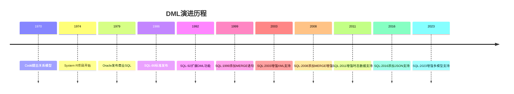
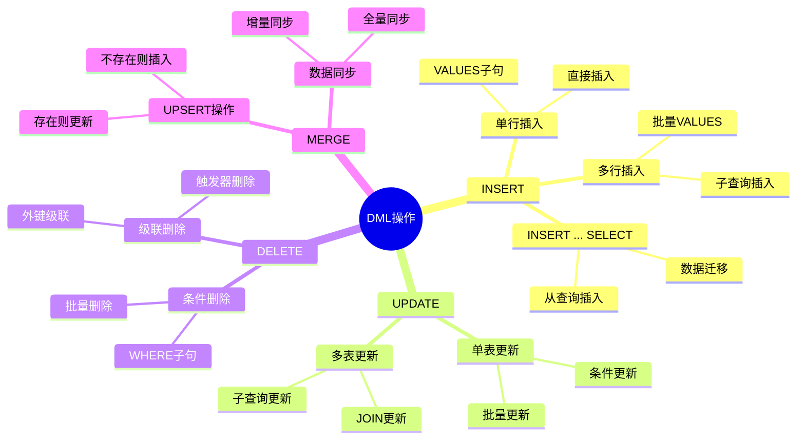
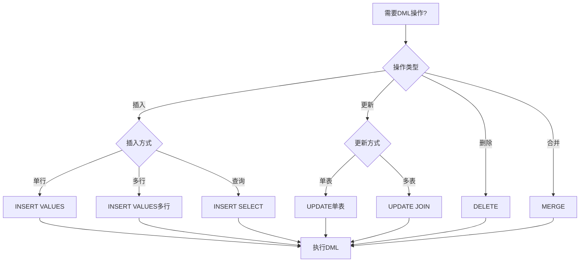
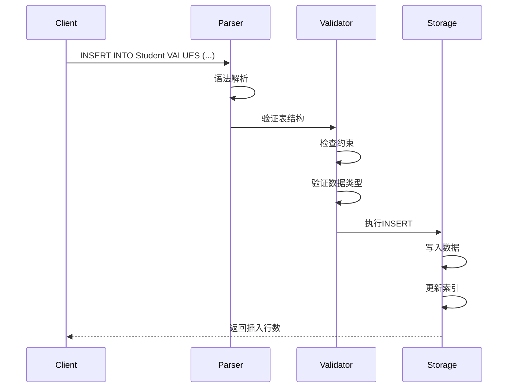
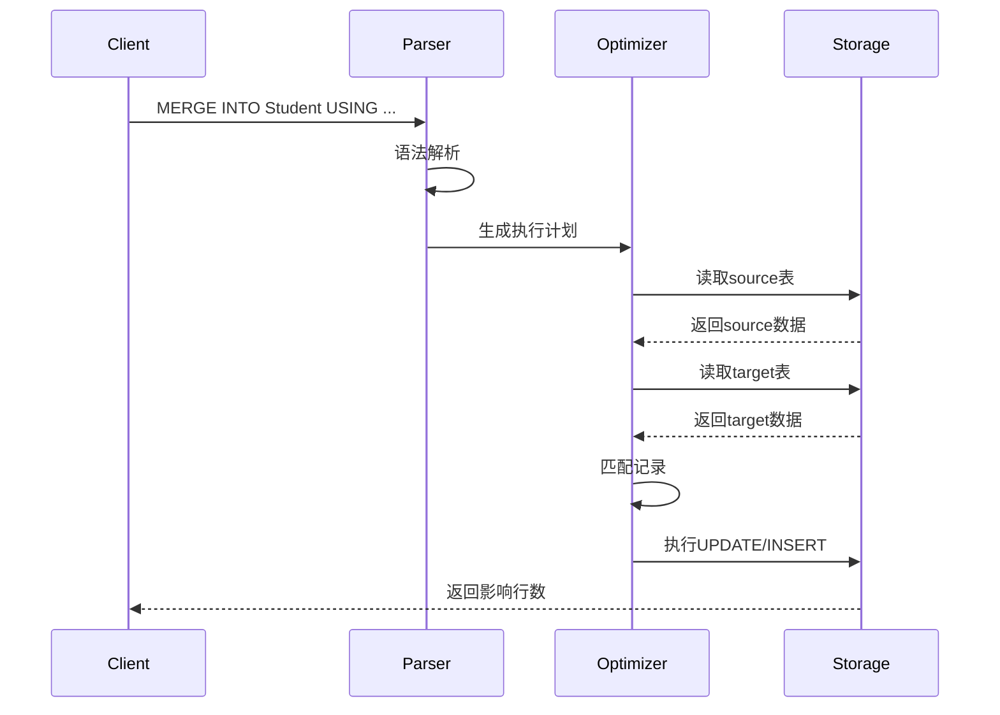

# 数据操作语言(DML)

> **创建日期**：2025-01-15
> **最后更新**：2025-01-16
> **版本**：v1.0.0
> **难度**：⭐⭐⭐
> **应用场景**：数据插入、更新、删除操作

---

## 📋 目录

- [数据操作语言(DML)](#数据操作语言dml)
  - [📋 目录](#-目录)
  - [一、概述](#一概述)
    - [1.0 DML的历史背景](#10-dml的历史背景)
      - [1.0.1 DML的起源](#101-dml的起源)
      - [1.0.2 DML在SQL标准中的位置](#102-dml在sql标准中的位置)
      - [1.0.3 DML的形式化定义](#103-dml的形式化定义)
      - [1.0.4 DML与关系模型的对应关系](#104-dml与关系模型的对应关系)
    - [1.1 DML操作思维导图](#11-dml操作思维导图)
    - [1.2 DML操作决策树](#12-dml操作决策树)
    - [1.3 DML操作对比矩阵](#13-dml操作对比矩阵)
  - [二、INSERT](#二insert)
    - [2.1 INSERT的历史背景](#21-insert的历史背景)
      - [2.1.1 INSERT的演进](#211-insert的演进)
      - [2.1.2 INSERT的BNF语法定义](#212-insert的bnf语法定义)
      - [2.1.3 INSERT的形式化语义](#213-insert的形式化语义)
    - [2.2 基本语法](#22-基本语法)
    - [2.2 场景示例：学生数据录入](#22-场景示例学生数据录入)
  - [三、UPDATE](#三update)
    - [3.1 UPDATE的历史背景](#31-update的历史背景)
      - [3.1.1 UPDATE的演进](#311-update的演进)
      - [3.1.2 UPDATE的BNF语法定义](#312-update的bnf语法定义)
      - [3.1.3 UPDATE的形式化语义](#313-update的形式化语义)
    - [3.2 基本语法](#32-基本语法)
    - [3.2 场景示例：学生信息更新](#32-场景示例学生信息更新)
  - [四、DELETE](#四delete)
    - [4.1 DELETE的历史背景](#41-delete的历史背景)
      - [4.1.1 DELETE的演进](#411-delete的演进)
      - [4.1.2 DELETE的BNF语法定义](#412-delete的bnf语法定义)
      - [4.1.3 DELETE的形式化语义](#413-delete的形式化语义)
    - [4.2 基本语法](#42-基本语法)
    - [4.2 场景示例：学生数据删除](#42-场景示例学生数据删除)
  - [五、MERGE](#五merge)
    - [5.1 MERGE的历史背景](#51-merge的历史背景)
      - [5.1.1 MERGE的演进](#511-merge的演进)
      - [5.1.2 MERGE的BNF语法定义](#512-merge的bnf语法定义)
      - [5.1.3 MERGE的形式化语义](#513-merge的形式化语义)
    - [5.2 基本语法](#52-基本语法)
    - [5.2 场景示例：学生数据同步](#52-场景示例学生数据同步)
  - [六、DML最佳实践](#六dml最佳实践)
    - [6.1 INSERT最佳实践](#61-insert最佳实践)
    - [6.2 UPDATE最佳实践](#62-update最佳实践)
    - [6.3 DELETE最佳实践](#63-delete最佳实践)
    - [6.4 MERGE最佳实践](#64-merge最佳实践)
  - [七、DML与关系模型的对应关系](#七dml与关系模型的对应关系)
    - [7.1 DML操作与关系模型概念的对应](#71-dml操作与关系模型概念的对应)
    - [7.2 DML操作的范畴论视角](#72-dml操作的范畴论视角)
  - [八、DML标准演进历史](#八dml标准演进历史)
    - [8.1 SQL-86到SQL-92的演进](#81-sql-86到sql-92的演进)
    - [8.2 SQL:1999到SQL:2023的演进](#82-sql1999到sql2023的演进)
  - [九、相关资源](#九相关资源)
    - [相关文档](#相关文档)
    - [外部资源](#外部资源)
      - [经典教材](#经典教材)
      - [标准文档](#标准文档)
      - [在线资源](#在线资源)
  - [九、PostgreSQL 18 DML新特性 🆕](#九postgresql-18-dml新特性-)
    - [9.1 RETURNING子句增强](#91-returning子句增强)
    - [9.2 UPSERT (INSERT ON CONFLICT)](#92-upsert-insert-on-conflict)
  - [十、SQLite 3.45+ DML新特性 🆕](#十sqlite-345-dml新特性-)
    - [10.1 RETURNING子句](#101-returning子句)
    - [10.2 UPSERT (ON CONFLICT)](#102-upsert-on-conflict)
    - [10.3 批量操作优化](#103-批量操作优化)

---

## 一、概述

**数据操作语言（DML, Data Manipulation Language）**用于对数据库中的数据进行操作，包括插入、更新、删除等。

**DML主要语句**：

- INSERT：插入数据
- UPDATE：更新数据
- DELETE：删除数据
- MERGE：合并数据

### 1.0 DML的历史背景

#### 1.0.1 DML的起源

**历史背景**：

DML的概念最早出现在1970年代，随着关系数据库模型的发展而诞生：

- **1970年**：Codd提出关系模型，奠定了DML的理论基础
- **1974年**：IBM的System R项目开始开发，首次实现了SQL的DML功能
- **1979年**：Oracle发布第一个商业SQL数据库，包含完整的DML支持
- **1986年**：SQL-86标准正式发布，DML成为SQL标准的核心组成部分

**DML的演进历程**：



#### 1.0.2 DML在SQL标准中的位置

**DML在SQL标准中的定义**：

根据ISO/IEC 9075标准，DML属于SQL/Foundation部分，是SQL标准的核心组成部分。

**DML操作分类**：

1. **数据插入**：INSERT语句
2. **数据更新**：UPDATE语句
3. **数据删除**：DELETE语句
4. **数据合并**：MERGE语句（SQL:1999引入）

#### 1.0.3 DML的形式化定义

**DML的数学定义**：

```latex
\text{DML（数据操作语言）是一个四元组：}
\text{DML} = (\text{Operations}, \text{Targets}, \text{Values}, \text{Semantics})

\text{其中：}
- \text{Operations} = \{\text{INSERT}, \text{UPDATE}, \text{DELETE}, \text{MERGE}\} \text{ 是DML操作集合}
- \text{Targets} = \{\text{Table}, \text{View}\} \text{ 是操作目标集合}
- \text{Values} \text{ 是数据值集合}
- \text{Semantics} \text{ 是DML操作的语义函数}
```

**DML操作的语义函数**：

```latex
\text{INSERT操作的语义：}
\text{Semantics}(\text{INSERT INTO } T \text{ VALUES } v) =
  T' = T \cup \{v\}

\text{UPDATE操作的语义：}
\text{Semantics}(\text{UPDATE } T \text{ SET } A = v \text{ WHERE } \phi) =
  T' = \{t' \mid (t \in T \land \phi(t)) \Rightarrow t' = t[A := v], \text{否则 } t' = t\}

\text{DELETE操作的语义：}
\text{Semantics}(\text{DELETE FROM } T \text{ WHERE } \phi) =
  T' = \{t \in T \mid \neg \phi(t)\}
```

#### 1.0.4 DML与关系模型的对应关系

**DML操作与关系模型概念的对应**：

| DML操作 | 关系模型概念 | 数学表示 | 说明 |
|---------|------------|---------|------|
| **INSERT** | 关系扩展 | $R' = R \cup \{t\}$ | 向关系添加元组 |
| **UPDATE** | 关系修改 | $R' = \{t' \mid t' = \text{update}(t) \text{ if } \phi(t), \text{else } t\}$ | 修改关系中的元组 |
| **DELETE** | 关系缩减 | $R' = \{t \in R \mid \neg \phi(t)\}$ | 从关系中删除元组 |
| **MERGE** | 关系合并 | $R' = \text{merge}(R_1, R_2)$ | 合并两个关系 |

### 1.1 DML操作思维导图



### 1.2 DML操作决策树



### 1.3 DML操作对比矩阵

| 操作 | 语句 | 可回滚 | 性能 | 影响行数 | 使用场景 |
|------|------|--------|------|---------|---------|
| **INSERT** | INSERT INTO ... VALUES | ✅ | 中 | 单行/多行 | 新增数据 |
| **INSERT SELECT** | INSERT INTO ... SELECT | ✅ | 中-高 | 多行 | 数据迁移 |
| **UPDATE** | UPDATE ... SET ... WHERE | ✅ | 中-高 | 单行/多行 | 修改数据 |
| **DELETE** | DELETE FROM ... WHERE | ✅ | 中-高 | 单行/多行 | 删除数据 |
| **MERGE** | MERGE INTO ... | ✅ | 高 | 多行 | 数据同步 |

---

## 二、INSERT

### 2.1 INSERT的历史背景

#### 2.1.1 INSERT的演进

**历史演进**：

- **SQL-86**：首次标准化INSERT语法
- **SQL-92**：增强了INSERT功能，支持多行插入
- **SQL:1999**：支持INSERT ... SELECT和INSERT ... DEFAULT VALUES
- **SQL:2003**：增强了INSERT的表达式支持
- **SQL:2008**：添加了INSERT ... ON CONFLICT支持（部分数据库）

#### 2.1.2 INSERT的BNF语法定义

**INSERT的BNF语法**：

```bnf
<insert_statement> ::=
    INSERT INTO <table_name> [<insert_column_list>]
    <insert_source>

<insert_column_list> ::=
    <left_paren> <column_name> [ { <comma> <column_name> }... ] <right_paren>

<insert_source> ::=
    <values_clause>
    | <query_expression>
    | <default_values>

<values_clause> ::=
    VALUES <row_value_expression_list>

<row_value_expression_list> ::=
    <row_value_expression> [ { <comma> <row_value_expression> }... ]

<default_values> ::=
    DEFAULT VALUES
```

#### 2.1.3 INSERT的形式化语义

**INSERT的语义函数**：

```latex
\text{INSERT的语义函数：}
\text{Semantics}(\text{INSERT INTO } T(A_1, \ldots, A_n) \text{ VALUES } (v_1, \ldots, v_n)) =
  T' = T \cup \{t\}

\text{其中：}
- t = \{(A_1, v_1), (A_2, v_2), \ldots, (A_n, v_n)\} \text{ 是新元组}
- T' \text{ 是更新后的关系}
```

**INSERT的前置条件和后置条件**：

```latex
\text{前置条件（Precondition）：}
1. T \in \text{Schema} \text{（表存在）}
2. \forall i: A_i \in \text{Attr}(T) \text{（列存在）}
3. \forall i: v_i \in \text{dom}(A_i) \text{（值类型正确）}
4. \text{新元组满足所有约束}

\text{后置条件（Postcondition）：}
1. |T'| = |T| + 1 \text{（元组数量增加1）}
2. t \in T' \text{（新元组在关系中）}
3. T' \text{ 满足所有完整性约束}
```

### 2.2 基本语法

**INSERT语法**：

```sql
INSERT INTO table_name [(column_list)]
VALUES (value_list);
```

**完整语法（SQL:2023）**：

```sql
INSERT INTO table_name [(column_list)]
{
    VALUES (value_list) [, (value_list), ...]
    | query_expression
    | DEFAULT VALUES
}
[ON CONFLICT conflict_target conflict_action];
```

### 2.2 场景示例：学生数据录入

**业务需求**：向学生管理系统录入学生、课程和选课数据。

**DML实现**：

```sql
-- 插入学生数据（单行）
INSERT INTO Student (student_id, name, age, major, email)
VALUES (1, 'Alice', 20, 'Computer Science', 'alice@example.com');

-- 插入学生数据（多行）
INSERT INTO Student (student_id, name, age, major, email)
VALUES
    (2, 'Bob', 21, 'Mathematics', 'bob@example.com'),
    (3, 'Charlie', 19, 'Physics', 'charlie@example.com');

-- 从查询插入（数据迁移）
INSERT INTO Student (student_id, name, age, major, email)
SELECT
    old_id,
    old_name,
    old_age,
    old_major,
    old_email
FROM OldStudentTable
WHERE old_status = 'active';
```

**数据插入执行流程时序图**：



---

## 三、UPDATE

### 3.1 UPDATE的历史背景

#### 3.1.1 UPDATE的演进

**历史演进**：

- **SQL-86**：首次标准化UPDATE语法
- **SQL-92**：增强了UPDATE功能，支持多列更新
- **SQL:1999**：支持UPDATE ... FROM和UPDATE ... JOIN
- **SQL:2003**：增强了UPDATE的表达式支持
- **SQL:2008**：添加了UPDATE的更多功能

#### 3.1.2 UPDATE的BNF语法定义

**UPDATE的BNF语法**：

```bnf
<update_statement> ::=
    UPDATE <table_name>
    SET <set_clause_list>
    [WHERE <search_condition>]

<set_clause_list> ::=
    <set_clause> [ { <comma> <set_clause> }... ]

<set_clause> ::=
    <object_column> <equals_operator> <update_source>

<update_source> ::=
    <value_expression>
    | <null_specification>
    | DEFAULT

<object_column> ::=
    <column_name>
```

#### 3.1.3 UPDATE的形式化语义

**UPDATE的语义函数**：

```latex
\text{UPDATE的语义函数：}
\text{Semantics}(\text{UPDATE } T \text{ SET } A = v \text{ WHERE } \phi) =
  T' = \{t' \mid t \in T \land (\phi(t) \Rightarrow t' = t[A := v]) \land (\neg \phi(t) \Rightarrow t' = t)\}

\text{其中：}
- t[A := v] \text{ 表示将元组 } t \text{ 的属性 } A \text{ 的值更新为 } v
- \phi \text{ 是更新条件（谓词）}
```

**UPDATE的前置条件和后置条件**：

```latex
\text{前置条件（Precondition）：}
1. T \in \text{Schema} \text{（表存在）}
2. A \in \text{Attr}(T) \text{（列存在）}
3. v \in \text{dom}(A) \text{（值类型正确）}
4. \text{更新后的元组满足所有约束}

\text{后置条件（Postcondition）：}
1. |T'| = |T| \text{（元组数量不变）}
2. \forall t \in T: (\phi(t) \Rightarrow t'[A] = v) \land (\neg \phi(t) \Rightarrow t'[A] = t[A])
3. T' \text{ 满足所有完整性约束}
```

### 3.2 基本语法

**UPDATE语法**：

```sql
UPDATE table_name
SET column_name = value [, column_name = value ...]
WHERE condition;
```

**完整语法（SQL:2023）**：

```sql
UPDATE table_name [AS alias]
SET set_clause_list
[FROM from_list]
[WHERE search_condition]
[RETURNING output_expression_list];
```

### 3.2 场景示例：学生信息更新

**业务需求**：更新学生信息，包括年龄、专业和邮箱。

**UPDATE实现**：

```sql
-- 单行更新
UPDATE Student
SET age = 21, major = 'Data Science'
WHERE student_id = 1;

-- 批量更新
UPDATE Student
SET age = age + 1
WHERE major = 'Computer Science';

-- 使用子查询更新
UPDATE Enrollment
SET score = score + 5
WHERE course_id IN (
    SELECT course_id
    FROM Course
    WHERE instructor = 'Dr. Smith'
);
```

---

## 四、DELETE

### 4.1 DELETE的历史背景

#### 4.1.1 DELETE的演进

**历史演进**：

- **SQL-86**：首次标准化DELETE语法
- **SQL-92**：增强了DELETE功能
- **SQL:1999**：支持DELETE ... FROM和DELETE ... USING
- **SQL:2003**：增强了DELETE的表达式支持
- **SQL:2008**：添加了DELETE的更多功能

#### 4.1.2 DELETE的BNF语法定义

**DELETE的BNF语法**：

```bnf
<delete_statement> ::=
    DELETE FROM <table_name>
    [WHERE <search_condition>]
```

#### 4.1.3 DELETE的形式化语义

**DELETE的语义函数**：

```latex
\text{DELETE的语义函数：}
\text{Semantics}(\text{DELETE FROM } T \text{ WHERE } \phi) =
  T' = \{t \in T \mid \neg \phi(t)\}

\text{其中：}
- \phi \text{ 是删除条件（谓词）}
- T' \text{ 是更新后的关系（删除满足条件的元组）}
```

**DELETE的前置条件和后置条件**：

```latex
\text{前置条件（Precondition）：}
1. T \in \text{Schema} \text{（表存在）}
2. \text{删除操作不违反外键约束（除非使用CASCADE）}

\text{后置条件（Postcondition）：}
1. |T'| \leq |T| \text{（元组数量减少或不变）}
2. \forall t \in T': \neg \phi(t) \text{（所有满足条件的元组都被删除）}
3. T' \text{ 满足所有完整性约束}
```

### 4.2 基本语法

**DELETE语法**：

```sql
DELETE FROM table_name
WHERE condition;
```

**完整语法（SQL:2023）**：

```sql
DELETE FROM table_name [AS alias]
[USING from_list]
[WHERE search_condition]
[RETURNING output_expression_list];
```

### 4.2 场景示例：学生数据删除

**业务需求**：删除已毕业学生的选课记录，保留学生基本信息。

**DELETE实现**：

```sql
-- 条件删除
DELETE FROM Enrollment
WHERE student_id IN (
    SELECT student_id
    FROM Student
    WHERE graduation_date < '2023-01-01'
);

-- 级联删除（如果外键设置了CASCADE）
DELETE FROM Student
WHERE student_id = 1;
-- 自动删除相关的Enrollment记录
```

---

## 五、MERGE

### 5.1 MERGE的历史背景

#### 5.1.1 MERGE的演进

**历史演进**：

- **SQL-86**：不支持MERGE
- **SQL-92**：不支持MERGE
- **SQL:1999**：首次引入MERGE语句（UPSERT操作）
- **SQL:2003**：增强了MERGE功能
- **SQL:2008**：添加了MERGE的更多选项
- **SQL:2011**：增强了MERGE的时态数据支持

#### 5.1.2 MERGE的BNF语法定义

**MERGE的BNF语法**：

```bnf
<merge_statement> ::=
    MERGE INTO <target_table> [AS <target_alias>]
    USING <table_reference> [AS <source_alias>]
    ON <search_condition>
    <merge_when_clause_list>

<merge_when_clause_list> ::=
    <merge_when_clause> [<merge_when_clause>]

<merge_when_clause> ::=
    <merge_when_matched_clause>
    | <merge_when_not_matched_clause>

<merge_when_matched_clause> ::=
    WHEN MATCHED [AND <search_condition>] THEN <merge_update_specification>

<merge_when_not_matched_clause> ::=
    WHEN NOT MATCHED [AND <search_condition>] THEN <merge_insert_specification>

<merge_update_specification> ::=
    UPDATE SET <set_clause_list>

<merge_insert_specification> ::=
    INSERT [<insert_column_list>] VALUES <row_value_expression_list>
```

#### 5.1.3 MERGE的形式化语义

**MERGE的语义函数**：

```latex
\text{MERGE的语义函数：}
\text{Semantics}(\text{MERGE INTO } T_1 \text{ USING } T_2 \text{ ON } \theta) =
  T_1' = \text{merge}(T_1, T_2, \theta)

\text{其中：}
\text{merge}(T_1, T_2, \theta) =
  \{t' \mid (t_1 \in T_1, t_2 \in T_2, \theta(t_1, t_2)) \Rightarrow t' = \text{update}(t_1, t_2)\} \cup
  \{t_2 \mid t_2 \in T_2, \neg \exists t_1 \in T_1: \theta(t_1, t_2)\}

\text{即：}
- \text{如果匹配，则更新 } T_1 \text{ 中的元组}
- \text{如果不匹配，则插入 } T_2 \text{ 中的元组到 } T_1
```

### 5.2 基本语法

**MERGE语法**：

```sql
MERGE INTO target_table AS target
USING source_table AS source
ON target.key = source.key
WHEN MATCHED THEN
    UPDATE SET ...
WHEN NOT MATCHED THEN
    INSERT ...;
```

**完整语法（SQL:2023）**：

```sql
MERGE INTO target_table [AS target_alias]
USING table_reference [AS source_alias]
ON search_condition
[WHEN MATCHED [AND search_condition] THEN merge_update_specification]
[WHEN NOT MATCHED [AND search_condition] THEN merge_insert_specification]
[WHEN NOT MATCHED BY SOURCE [AND search_condition] THEN merge_delete_specification];
```

### 5.2 场景示例：学生数据同步

**业务需求**：从外部系统同步学生数据，如果学生已存在则更新，不存在则插入。

**MERGE实现**：

```sql
MERGE INTO Student AS target
USING ExternalStudent AS source
ON target.student_id = source.student_id
WHEN MATCHED THEN
    UPDATE SET
        name = source.name,
        age = source.age,
        major = source.major,
        email = source.email
WHEN NOT MATCHED THEN
    INSERT (student_id, name, age, major, email)
    VALUES (source.student_id, source.name, source.age, source.major, source.email);
```

**MERGE执行流程时序图**：



---

## 六、DML最佳实践

### 6.1 INSERT最佳实践

**INSERT操作最佳实践**：

1. **批量插入**：使用多行VALUES或INSERT ... SELECT进行批量插入
2. **指定列名**：明确指定列名，避免列顺序错误
3. **使用事务**：在事务中执行INSERT操作，确保原子性
4. **错误处理**：处理INSERT操作可能出现的错误（如唯一性冲突）

**INSERT性能优化**：

1. **批量插入**：一次插入多行比多次插入单行效率高
2. **禁用索引**：对于大批量插入，考虑临时禁用索引
3. **使用COPY**：对于大量数据，使用COPY命令（PostgreSQL）或LOAD DATA（MySQL）

### 6.2 UPDATE最佳实践

**UPDATE操作最佳实践**：

1. **使用WHERE子句**：始终使用WHERE子句，避免误更新所有行
2. **测试WHERE条件**：在执行UPDATE前，先用SELECT测试WHERE条件
3. **使用事务**：在事务中执行UPDATE操作，确保可以回滚
4. **备份数据**：在执行UPDATE前备份数据

**UPDATE性能优化**：

1. **索引优化**：为WHERE子句中的列创建索引
2. **批量更新**：对于大量更新，考虑分批执行
3. **避免全表扫描**：确保WHERE子句能够使用索引

### 6.3 DELETE最佳实践

**DELETE操作最佳实践**：

1. **使用WHERE子句**：始终使用WHERE子句，避免误删除所有行
2. **测试WHERE条件**：在执行DELETE前，先用SELECT测试WHERE条件
3. **使用事务**：在事务中执行DELETE操作，确保可以回滚
4. **备份数据**：在执行DELETE前备份数据
5. **考虑级联删除**：了解外键约束的级联删除行为

**DELETE性能优化**：

1. **索引优化**：为WHERE子句中的列创建索引
2. **批量删除**：对于大量删除，考虑分批执行
3. **使用TRUNCATE**：如果需要删除所有数据，考虑使用TRUNCATE TABLE

### 6.4 MERGE最佳实践

**MERGE操作最佳实践**：

1. **明确匹配条件**：确保ON子句的匹配条件正确
2. **处理所有情况**：考虑WHEN MATCHED和WHEN NOT MATCHED两种情况
3. **使用事务**：在事务中执行MERGE操作
4. **测试数据**：在测试环境验证MERGE操作

**MERGE性能优化**：

1. **索引优化**：为ON子句中的列创建索引
2. **批量处理**：对于大量数据，考虑分批执行MERGE

## 七、DML与关系模型的对应关系

### 7.1 DML操作与关系模型概念的对应

**DML操作与关系模型概念的对应表**：

| DML操作 | 关系模型概念 | 数学表示 | 说明 |
|---------|------------|---------|------|
| **INSERT** | 关系扩展 | $R' = R \cup \{t\}$ | 向关系添加元组 |
| **UPDATE** | 关系修改 | $R' = \{t' \mid t' = \text{update}(t) \text{ if } \phi(t), \text{else } t\}$ | 修改关系中的元组 |
| **DELETE** | 关系缩减 | $R' = \{t \in R \mid \neg \phi(t)\}$ | 从关系中删除元组 |
| **MERGE** | 关系合并 | $R' = \text{merge}(R_1, R_2)$ | 合并两个关系 |

### 7.2 DML操作的范畴论视角

**DML操作作为关系范畴的态射**：

在关系范畴中，DML操作可以看作关系之间的态射：

```latex
\text{INSERT: } R \to R' \text{，其中 } R' = R \cup \{t\}
\text{UPDATE: } R \to R' \text{，其中 } R' = \text{update}(R)
\text{DELETE: } R \to R' \text{，其中 } R' = R \setminus \{t \mid \phi(t)\}
\text{MERGE: } R_1 \times R_2 \to R_1' \text{，其中 } R_1' = \text{merge}(R_1, R_2)
```

## 八、DML标准演进历史

### 8.1 SQL-86到SQL-92的演进

**SQL-86**：

- 基本的INSERT、UPDATE、DELETE语法
- 支持单行操作

**SQL-92**：

- 支持多行INSERT
- 增强了UPDATE和DELETE功能

### 8.2 SQL:1999到SQL:2023的演进

**SQL:1999**：

- 引入MERGE语句（UPSERT操作）
- 支持INSERT ... DEFAULT VALUES

**SQL:2003**：

- 增强了DML的表达式支持

**SQL:2008**：

- 添加了MERGE的更多选项
- 支持INSERT ... ON CONFLICT（部分数据库）

**SQL:2011**：

- 增强了时态数据的DML支持

**SQL:2016**：

- 增强了JSON数据的DML支持

**SQL:2023**：

- 增强了多模型数据库的DML支持

## 九、相关资源

### 相关文档

- [数据定义语言(DDL)](./04.01-数据定义语言(DDL).md) - DDL语法
- [数据查询语言(DQL)](./04.03-数据查询语言(DQL).md) - DQL语法
- [事务控制语言(TCL)](./04.05-事务控制语言(TCL).md) - TCL语法
- [关系模型理论](../01-理论基础/01.01-关系模型理论.md) - 关系模型基础
- [SQL形式化语义](../03-形式化模型/03.01-SQL形式化语义.md) - SQL形式化语义

### 外部资源

#### 经典教材

- **Date, C. J. (2003)**. "An Introduction to Database Systems" (8th Edition). Addison-Wesley.
  - 详细讲解DML操作

- **Silberschatz, A., Korth, H. F., & Sudarshan, S. (2019)**. "Database System Concepts" (7th Edition). McGraw-Hill.
  - 深入讲解DML操作和事务处理

#### 标准文档

- **ISO/IEC 9075:2023** - SQL:2023标准文档
  - DML的完整标准定义

#### 在线资源

- [Wikipedia: Data Manipulation Language](https://en.wikipedia.org/wiki/Data_manipulation_language)
- [PostgreSQL DML Documentation](https://www.postgresql.org/docs/current/dml.html)

---

## 九、PostgreSQL 18 DML新特性 🆕

### 9.1 RETURNING子句增强

```sql
-- PostgreSQL 18: RETURNING返回更新前后的值
INSERT INTO products (name, price)
VALUES ('Widget', 29.99)
RETURNING id, name, price, created_at;

-- UPDATE RETURNING
UPDATE products
SET price = price * 1.1
WHERE category = 'electronics'
RETURNING id, name, price AS new_price;

-- DELETE RETURNING
DELETE FROM orders
WHERE created_at < NOW() - INTERVAL '1 year'
RETURNING order_id, customer_id, total_amount;

-- 配合CTE使用
WITH updated AS (
    UPDATE inventory SET stock = stock - 1
    WHERE product_id = 101 AND stock > 0
    RETURNING product_id, stock
)
INSERT INTO inventory_logs (product_id, new_stock, operation)
SELECT product_id, stock, 'sale' FROM updated;
```

### 9.2 UPSERT (INSERT ON CONFLICT)

```sql
-- PostgreSQL 18: UPSERT
INSERT INTO user_stats (user_id, login_count, last_login)
VALUES (1, 1, NOW())
ON CONFLICT (user_id)
DO UPDATE SET
    login_count = user_stats.login_count + 1,
    last_login = EXCLUDED.last_login;

-- 条件UPSERT
INSERT INTO products (sku, name, price)
VALUES ('SKU001', 'Widget', 29.99)
ON CONFLICT (sku)
DO UPDATE SET price = EXCLUDED.price
WHERE products.price < EXCLUDED.price;  -- 只更新价格上涨的
```

---

## 十、SQLite 3.45+ DML新特性 🆕

### 10.1 RETURNING子句

```sql
-- SQLite 3.45+: RETURNING
INSERT INTO users (name, email)
VALUES ('Alice', 'alice@example.com')
RETURNING id, name, created_at;

-- UPDATE RETURNING
UPDATE products SET stock = stock - 1
WHERE id = 101 AND stock > 0
RETURNING id, stock AS remaining_stock;

-- DELETE RETURNING
DELETE FROM sessions WHERE expires_at < datetime('now')
RETURNING session_id, user_id;
```

### 10.2 UPSERT (ON CONFLICT)

```sql
-- SQLite 3.45+: UPSERT
INSERT INTO kv_store (key, value, updated_at)
VALUES ('config', '{"debug": true}', datetime('now'))
ON CONFLICT(key) DO UPDATE SET
    value = excluded.value,
    updated_at = datetime('now');

-- 忽略冲突
INSERT OR IGNORE INTO users (email, name) VALUES ('alice@example.com', 'Alice');

-- 替换
INSERT OR REPLACE INTO settings (key, value) VALUES ('theme', 'dark');
```

### 10.3 批量操作优化

```sql
-- SQLite 3.45+: 高效批量插入
BEGIN TRANSACTION;
INSERT INTO logs (timestamp, level, message) VALUES
    (datetime('now'), 'INFO', 'Message 1'),
    (datetime('now'), 'INFO', 'Message 2'),
    (datetime('now'), 'WARN', 'Message 3');
COMMIT;

-- 使用UNION ALL批量插入（兼容旧版本）
INSERT INTO logs (timestamp, level, message)
SELECT datetime('now'), 'INFO', 'Msg1'
UNION ALL SELECT datetime('now'), 'INFO', 'Msg2'
UNION ALL SELECT datetime('now'), 'WARN', 'Msg3';
```

---

**维护者**: SQL Standards Team
**最后更新**: 2025-12-01
