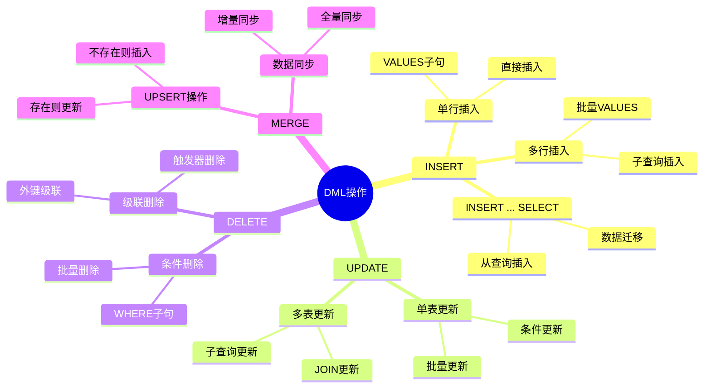
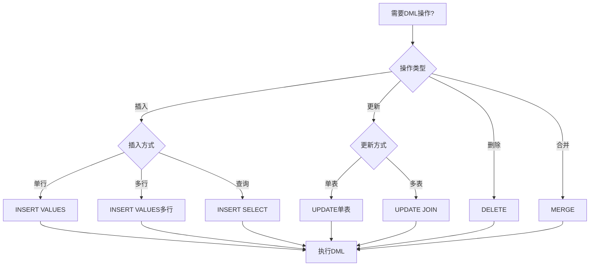
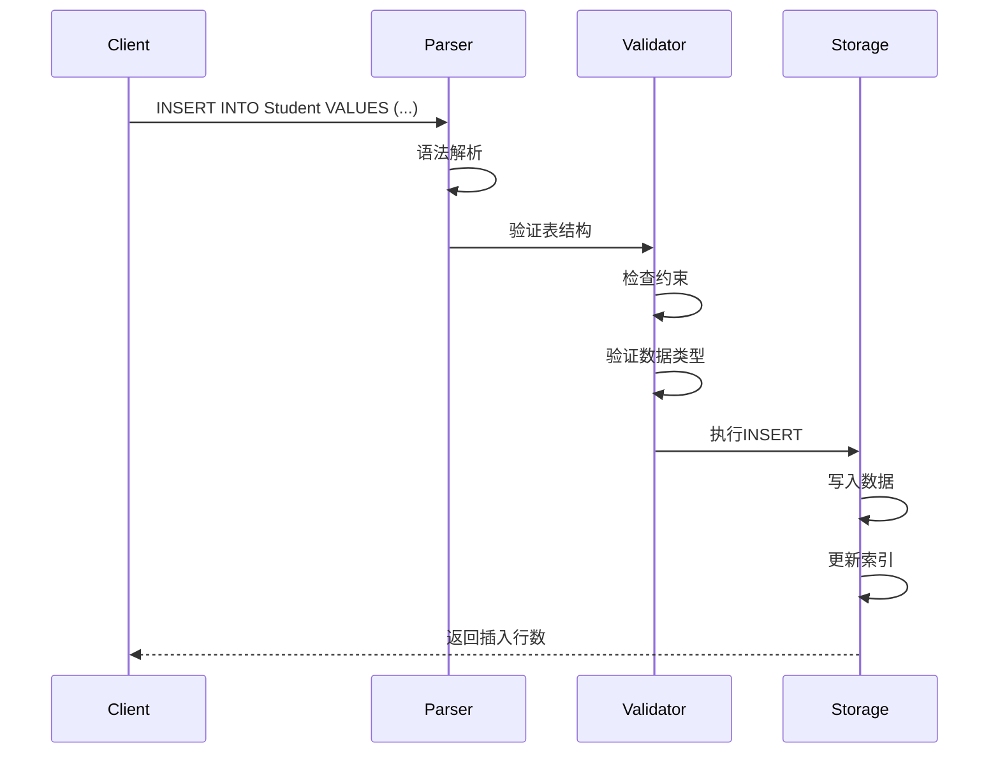
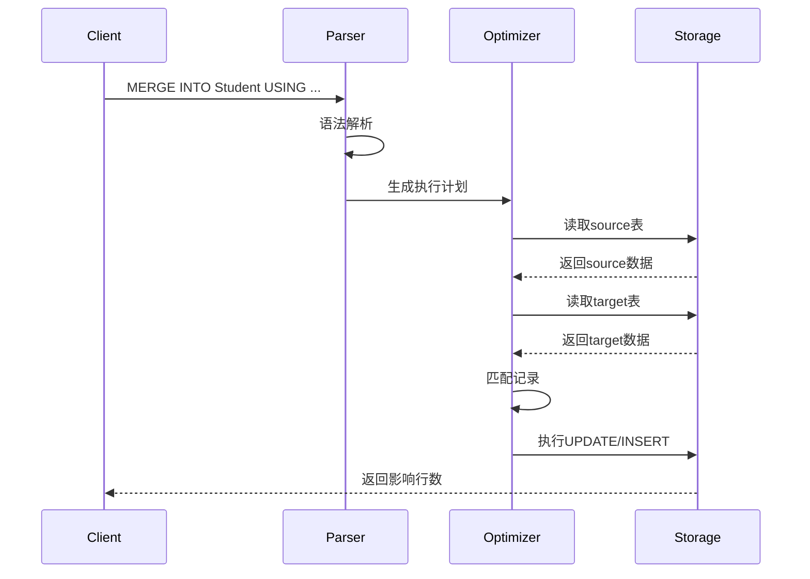

# 数据操作语言(DML)

> **创建日期**：2025-01-15
> **最后更新**：2025-01-15
> **版本**：v1.0.0
> **难度**：⭐⭐⭐
> **应用场景**：数据插入、更新、删除操作

---

## 📋 目录

- [数据操作语言(DML)](#数据操作语言dml)
  - [📋 目录](#-目录)
  - [一、概述](#一概述)
    - [1.1 DML操作思维导图](#11-dml操作思维导图)
    - [1.2 DML操作决策树](#12-dml操作决策树)
    - [1.3 DML操作对比矩阵](#13-dml操作对比矩阵)
  - [二、INSERT](#二insert)
    - [2.1 基本语法](#21-基本语法)
    - [2.2 场景示例：学生数据录入](#22-场景示例学生数据录入)
  - [三、UPDATE](#三update)
    - [3.1 基本语法](#31-基本语法)
    - [3.2 场景示例：学生信息更新](#32-场景示例学生信息更新)
  - [四、DELETE](#四delete)
    - [4.1 基本语法](#41-基本语法)
    - [4.2 场景示例：学生数据删除](#42-场景示例学生数据删除)
  - [五、MERGE](#五merge)
    - [5.1 基本语法](#51-基本语法)
    - [5.2 场景示例：学生数据同步](#52-场景示例学生数据同步)
  - [六、相关资源](#六相关资源)
    - [相关文档](#相关文档)

---

## 一、概述

**数据操作语言（DML, Data Manipulation Language）**用于对数据库中的数据进行操作，包括插入、更新、删除等。

**DML主要语句**：

- INSERT：插入数据
- UPDATE：更新数据
- DELETE：删除数据
- MERGE：合并数据

### 1.1 DML操作思维导图



### 1.2 DML操作决策树



### 1.3 DML操作对比矩阵

| 操作 | 语句 | 可回滚 | 性能 | 影响行数 | 使用场景 |
|------|------|--------|------|---------|---------|
| **INSERT** | INSERT INTO ... VALUES | ✅ | 中 | 单行/多行 | 新增数据 |
| **INSERT SELECT** | INSERT INTO ... SELECT | ✅ | 中-高 | 多行 | 数据迁移 |
| **UPDATE** | UPDATE ... SET ... WHERE | ✅ | 中-高 | 单行/多行 | 修改数据 |
| **DELETE** | DELETE FROM ... WHERE | ✅ | 中-高 | 单行/多行 | 删除数据 |
| **MERGE** | MERGE INTO ... | ✅ | 高 | 多行 | 数据同步 |

---

## 二、INSERT

### 2.1 基本语法

**INSERT语法**：

```sql
INSERT INTO table_name [(column_list)]
VALUES (value_list);
```

### 2.2 场景示例：学生数据录入

**业务需求**：向学生管理系统录入学生、课程和选课数据。

**DML实现**：

```sql
-- 插入学生数据（单行）
INSERT INTO Student (student_id, name, age, major, email)
VALUES (1, 'Alice', 20, 'Computer Science', 'alice@example.com');

-- 插入学生数据（多行）
INSERT INTO Student (student_id, name, age, major, email)
VALUES
    (2, 'Bob', 21, 'Mathematics', 'bob@example.com'),
    (3, 'Charlie', 19, 'Physics', 'charlie@example.com');

-- 从查询插入（数据迁移）
INSERT INTO Student (student_id, name, age, major, email)
SELECT
    old_id,
    old_name,
    old_age,
    old_major,
    old_email
FROM OldStudentTable
WHERE old_status = 'active';
```

**数据插入执行流程时序图**：



---

## 三、UPDATE

### 3.1 基本语法

**UPDATE语法**：

```sql
UPDATE table_name
SET column_name = value [, column_name = value ...]
WHERE condition;
```

### 3.2 场景示例：学生信息更新

**业务需求**：更新学生信息，包括年龄、专业和邮箱。

**UPDATE实现**：

```sql
-- 单行更新
UPDATE Student
SET age = 21, major = 'Data Science'
WHERE student_id = 1;

-- 批量更新
UPDATE Student
SET age = age + 1
WHERE major = 'Computer Science';

-- 使用子查询更新
UPDATE Enrollment
SET score = score + 5
WHERE course_id IN (
    SELECT course_id
    FROM Course
    WHERE instructor = 'Dr. Smith'
);
```

---

## 四、DELETE

### 4.1 基本语法

**DELETE语法**：

```sql
DELETE FROM table_name
WHERE condition;
```

### 4.2 场景示例：学生数据删除

**业务需求**：删除已毕业学生的选课记录，保留学生基本信息。

**DELETE实现**：

```sql
-- 条件删除
DELETE FROM Enrollment
WHERE student_id IN (
    SELECT student_id
    FROM Student
    WHERE graduation_date < '2023-01-01'
);

-- 级联删除（如果外键设置了CASCADE）
DELETE FROM Student
WHERE student_id = 1;
-- 自动删除相关的Enrollment记录
```

---

## 五、MERGE

### 5.1 基本语法

**MERGE语法**：

```sql
MERGE INTO target_table AS target
USING source_table AS source
ON target.key = source.key
WHEN MATCHED THEN
    UPDATE SET ...
WHEN NOT MATCHED THEN
    INSERT ...;
```

### 5.2 场景示例：学生数据同步

**业务需求**：从外部系统同步学生数据，如果学生已存在则更新，不存在则插入。

**MERGE实现**：

```sql
MERGE INTO Student AS target
USING ExternalStudent AS source
ON target.student_id = source.student_id
WHEN MATCHED THEN
    UPDATE SET
        name = source.name,
        age = source.age,
        major = source.major,
        email = source.email
WHEN NOT MATCHED THEN
    INSERT (student_id, name, age, major, email)
    VALUES (source.student_id, source.name, source.age, source.major, source.email);
```

**MERGE执行流程时序图**：



---

## 六、相关资源

### 相关文档

- [数据定义语言(DDL)](./04.01-数据定义语言(DDL).md) - DDL语法
- [数据查询语言(DQL)](./04.03-数据查询语言(DQL).md) - DQL语法

---

**维护者**: SQL Standards Team
**最后更新**: 2025-01-15
