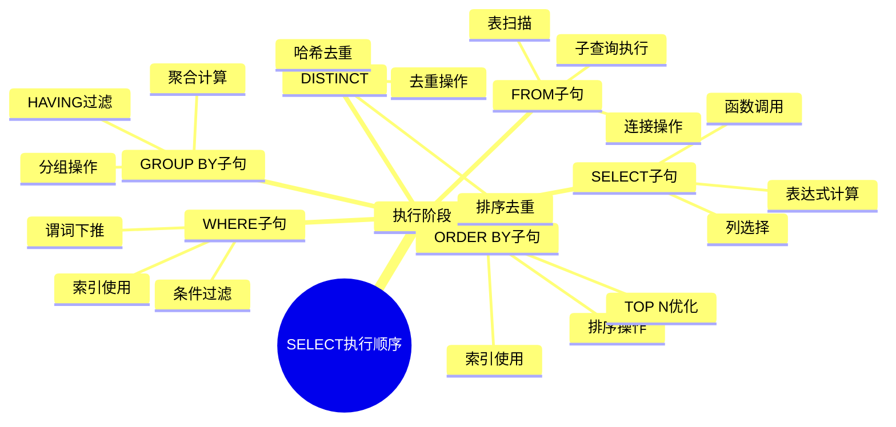
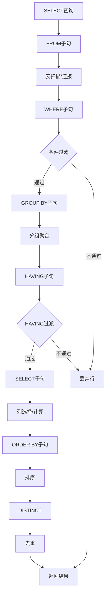
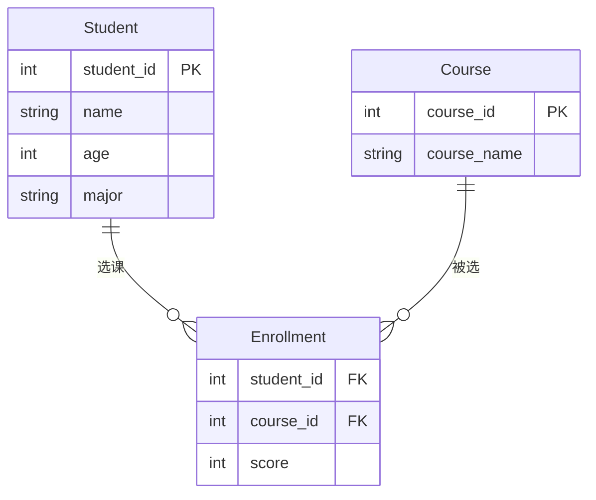
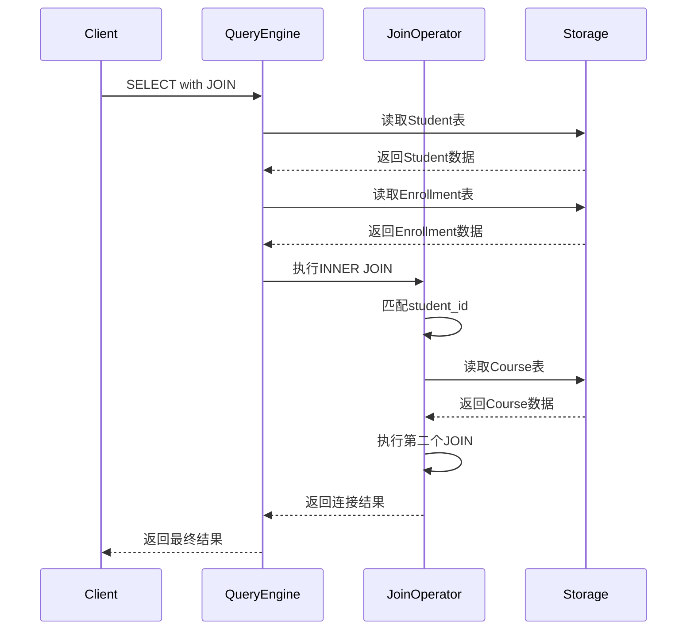

# 数据查询语言(DQL)

> **创建日期**：2025-01-15
> **最后更新**：2025-01-15
> **版本**：v1.0.0
> **难度**：⭐⭐⭐
> **应用场景**：数据查询、数据分析、报表生成

---

## 📋 目录

- [数据查询语言(DQL)](#数据查询语言dql)
  - [📋 目录](#-目录)
  - [一、概述](#一概述)
    - [1.1 SELECT语句执行顺序思维导图](#11-select语句执行顺序思维导图)
    - [1.2 SELECT语句执行流程图](#12-select语句执行流程图)
    - [1.3 DQL操作对比矩阵](#13-dql操作对比矩阵)
  - [二、SELECT基本语法](#二select基本语法)
    - [2.1 基本查询](#21-基本查询)
    - [2.2 场景示例：学生信息查询](#22-场景示例学生信息查询)
  - [三、WHERE子句](#三where子句)
    - [3.1 条件过滤](#31-条件过滤)
  - [四、JOIN操作](#四join操作)
    - [4.1 JOIN类型](#41-join类型)
    - [4.1.1 场景示例：学生选课信息查询](#411-场景示例学生选课信息查询)
  - [五、GROUP BY和HAVING](#五group-by和having)
    - [5.1 分组查询](#51-分组查询)
  - [六、ORDER BY](#六order-by)
    - [6.1 排序](#61-排序)
  - [七、子查询](#七子查询)
    - [7.1 子查询类型](#71-子查询类型)
  - [八、相关资源](#八相关资源)
    - [相关文档](#相关文档)

---

## 一、概述

**数据查询语言（DQL, Data Query Language）**用于从数据库中查询数据，SELECT是唯一的DQL语句。

**SELECT语句结构**：

```sql
SELECT [DISTINCT] select_list
FROM table_list
[WHERE condition]
[GROUP BY group_list]
[HAVING condition]
[ORDER BY order_list];
```

### 1.1 SELECT语句执行顺序思维导图



### 1.2 SELECT语句执行流程图



### 1.3 DQL操作对比矩阵

| 操作类型 | SQL语句 | 复杂度 | 性能影响 | 优化策略 |
|---------|---------|--------|---------|---------|
| **简单查询** | SELECT * FROM table | ⭐ | 低 | 索引优化 |
| **条件查询** | SELECT ... WHERE ... | ⭐⭐ | 中 | 索引、谓词下推 |
| **连接查询** | SELECT ... JOIN ... | ⭐⭐⭐ | 高 | 连接顺序、索引 |
| **分组查询** | SELECT ... GROUP BY ... | ⭐⭐⭐ | 中-高 | 索引、物化 |
| **子查询** | SELECT ... (SELECT ...) | ⭐⭐⭐⭐ | 高 | 子查询优化 |
| **窗口函数** | SELECT ... OVER ... | ⭐⭐⭐⭐ | 中-高 | 分区优化 |

---

## 二、SELECT基本语法

### 2.1 基本查询

**基本SELECT**：

```sql
SELECT * FROM Student;
SELECT student_id, name FROM Student;
```

### 2.2 场景示例：学生信息查询

**业务需求**：查询学生管理系统中的学生信息。

**数据模型**：



**基本查询示例**：

```sql
-- 查询所有学生
SELECT * FROM Student;

-- 查询学生ID和姓名
SELECT student_id, name FROM Student;

-- 查询特定专业的学生
SELECT student_id, name, age
FROM Student
WHERE major = 'Computer Science';
```

---

## 三、WHERE子句

### 3.1 条件过滤

**WHERE子句**：

```sql
SELECT * FROM Student WHERE age > 20;
SELECT * FROM Student WHERE major = 'CS' AND age > 18;
```

---

## 四、JOIN操作

### 4.1 JOIN类型

### 4.1.1 场景示例：学生选课信息查询

**业务需求**：查询学生及其选课信息，包括课程名称和成绩。

**JOIN查询实现**：

```sql
-- INNER JOIN：只查询有选课记录的学生
SELECT
    s.student_id,
    s.name,
    c.course_name,
    e.score
FROM Student s
INNER JOIN Enrollment e ON s.student_id = e.student_id
INNER JOIN Course c ON e.course_id = c.course_id
ORDER BY s.name, e.score DESC;

-- LEFT JOIN：查询所有学生，包括没有选课的学生
SELECT
    s.student_id,
    s.name,
    c.course_name,
    e.score
FROM Student s
LEFT JOIN Enrollment e ON s.student_id = e.student_id
LEFT JOIN Course c ON e.course_id = c.course_id
ORDER BY s.name;

-- RIGHT JOIN：查询所有课程，包括没有被选的课程
SELECT
    c.course_name,
    s.name,
    e.score
FROM Enrollment e
RIGHT JOIN Course c ON e.course_id = c.course_id
LEFT JOIN Student s ON e.student_id = s.student_id
ORDER BY c.course_name;
```

**JOIN执行流程时序图**：



---

## 五、GROUP BY和HAVING

### 5.1 分组查询

**GROUP BY**：

```sql
SELECT major, COUNT(*) as count
FROM Student
GROUP BY major
HAVING COUNT(*) > 10;
```

---

## 六、ORDER BY

### 6.1 排序

**ORDER BY**：

```sql
SELECT * FROM Student
ORDER BY age DESC, name ASC;
```

---

## 七、子查询

### 7.1 子查询类型

**子查询**：

```sql
-- 标量子查询
SELECT name, (SELECT COUNT(*) FROM Enrollment WHERE student_id = s.student_id) as course_count
FROM Student s;

-- 相关子查询
SELECT * FROM Student s
WHERE EXISTS (SELECT 1 FROM Enrollment e WHERE e.student_id = s.student_id);
```

---

## 八、相关资源

### 相关文档

- [数据定义语言(DDL)](./04.01-数据定义语言(DDL).md) - DDL语法
- [数据操作语言(DML)](./04.02-数据操作语言(DML).md) - DML语法
- [窗口函数详解](../05-高级特性/05.01-窗口函数详解.md) - 窗口函数

---

**维护者**: SQL Standards Team
**最后更新**: 2025-01-15
