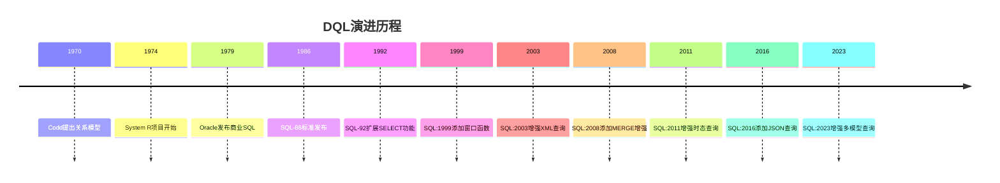
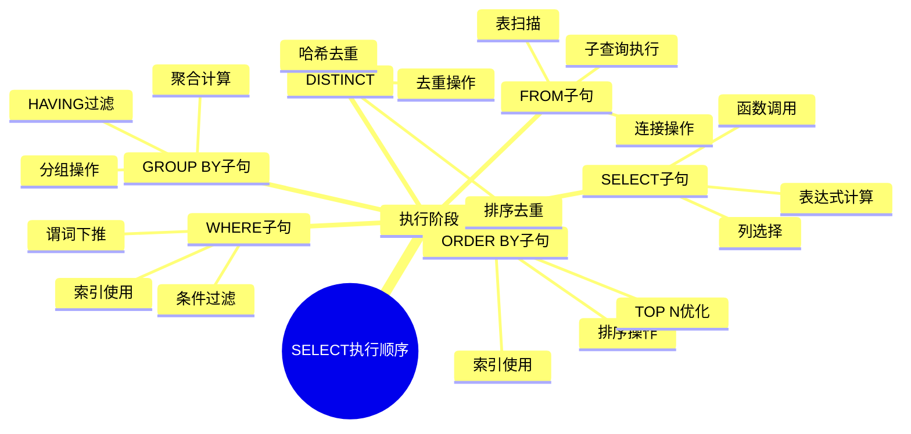
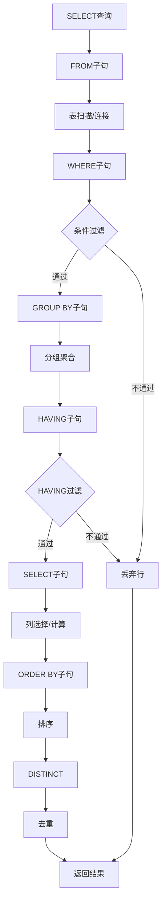
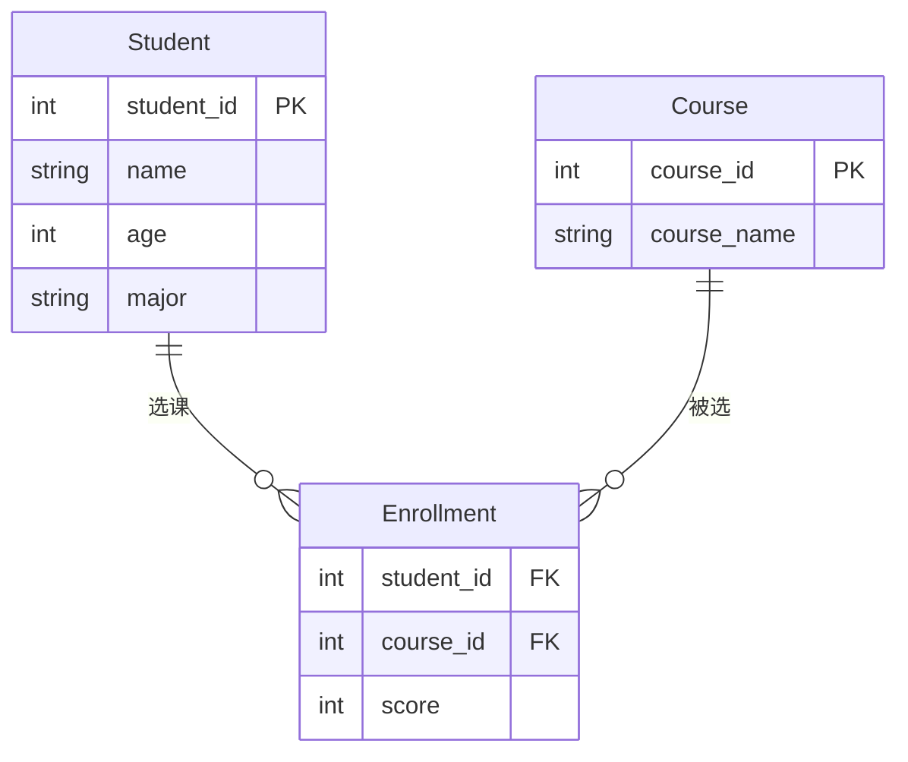
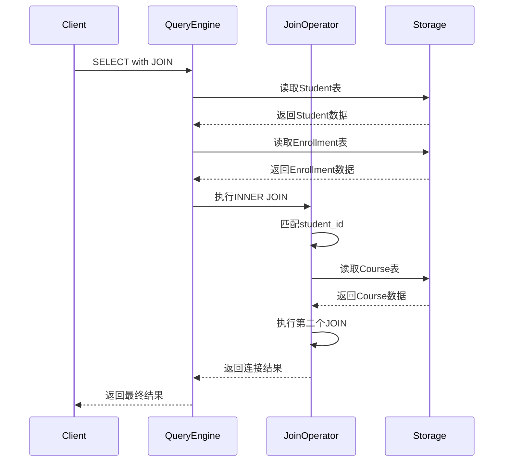

# 数据查询语言(DQL)

> **创建日期**：2025-01-15
> **最后更新**：2025-01-16
> **版本**：v1.0.0
> **难度**：⭐⭐⭐
> **应用场景**：数据查询、数据分析、报表生成

---

## 📋 目录

- [数据查询语言(DQL)](#数据查询语言dql)
  - [📋 目录](#-目录)
  - [一、概述](#一概述)
    - [1.0 DQL的历史背景](#10-dql的历史背景)
      - [1.0.1 DQL的起源](#101-dql的起源)
      - [1.0.2 DQL在SQL标准中的位置](#102-dql在sql标准中的位置)
      - [1.0.3 DQL的形式化定义](#103-dql的形式化定义)
      - [1.0.4 DQL与关系代数的对应关系](#104-dql与关系代数的对应关系)
    - [1.1 SELECT语句执行顺序思维导图](#11-select语句执行顺序思维导图)
    - [1.2 SELECT语句执行流程图](#12-select语句执行流程图)
    - [1.3 DQL操作对比矩阵](#13-dql操作对比矩阵)
  - [二、SELECT基本语法](#二select基本语法)
    - [2.1 SELECT的历史背景](#21-select的历史背景)
      - [2.1.1 SELECT的演进](#211-select的演进)
      - [2.1.2 SELECT的BNF语法定义](#212-select的bnf语法定义)
      - [2.1.3 SELECT的形式化语义](#213-select的形式化语义)
    - [2.2 基本查询](#22-基本查询)
    - [2.2 场景示例：学生信息查询](#22-场景示例学生信息查询)
  - [三、WHERE子句](#三where子句)
    - [3.1 条件过滤](#31-条件过滤)
  - [四、JOIN操作](#四join操作)
    - [4.1 JOIN类型](#41-join类型)
    - [4.1.1 场景示例：学生选课信息查询](#411-场景示例学生选课信息查询)
  - [五、GROUP BY和HAVING](#五group-by和having)
    - [5.1 分组查询](#51-分组查询)
  - [六、ORDER BY](#六order-by)
    - [6.1 排序](#61-排序)
  - [七、子查询](#七子查询)
    - [7.1 子查询类型](#71-子查询类型)
  - [八、DQL最佳实践](#八dql最佳实践)
    - [8.1 SELECT最佳实践](#81-select最佳实践)
    - [8.2 JOIN最佳实践](#82-join最佳实践)
    - [8.3 子查询最佳实践](#83-子查询最佳实践)
  - [九、DQL与关系代数的对应关系](#九dql与关系代数的对应关系)
    - [9.1 SELECT语句与关系代数操作的对应](#91-select语句与关系代数操作的对应)
    - [9.2 SELECT语句的范畴论视角](#92-select语句的范畴论视角)
  - [十、DQL标准演进历史](#十dql标准演进历史)
    - [10.1 SQL-86到SQL-92的演进](#101-sql-86到sql-92的演进)
    - [10.2 SQL:1999到SQL:2023的演进](#102-sql1999到sql2023的演进)
  - [十一、相关资源](#十一相关资源)
    - [相关文档](#相关文档)
    - [外部资源](#外部资源)
      - [经典教材](#经典教材)
      - [标准文档](#标准文档)
      - [在线资源](#在线资源)

---

## 一、概述

**数据查询语言（DQL, Data Query Language）**用于从数据库中查询数据，SELECT是唯一的DQL语句。

**SELECT语句结构**：

```sql
SELECT [DISTINCT] select_list
FROM table_list
[WHERE condition]
[GROUP BY group_list]
[HAVING condition]
[ORDER BY order_list];
```

### 1.0 DQL的历史背景

#### 1.0.1 DQL的起源

**历史背景**：

DQL（SELECT语句）是SQL语言的核心，其概念最早出现在1970年代：

- **1970年**：Codd提出关系模型，奠定了DQL的理论基础
- **1974年**：IBM的System R项目开始开发，首次实现了SELECT查询
- **1979年**：Oracle发布第一个商业SQL数据库，包含完整的SELECT支持
- **1986年**：SQL-86标准正式发布，SELECT成为SQL标准的核心

**DQL的演进历程**：



#### 1.0.2 DQL在SQL标准中的位置

**DQL在SQL标准中的定义**：

根据ISO/IEC 9075标准，DQL（SELECT语句）属于SQL/Foundation部分，是SQL标准的核心组成部分。

**SELECT语句的重要性**：

SELECT语句是SQL语言中最重要的语句，几乎所有数据访问都通过SELECT语句实现。

#### 1.0.3 DQL的形式化定义

**DQL的数学定义**：

```latex
\text{DQL（数据查询语言）是一个三元组：}
\text{DQL} = (\text{SELECT}, \text{Relations}, \text{Semantics})

\text{其中：}
- \text{SELECT} \text{ 是SELECT语句}
- \text{Relations} = \{R_1, R_2, \ldots, R_n\} \text{ 是关系集合}
- \text{Semantics} \text{ 是SELECT语句的语义函数}
```

**SELECT语句的语义函数**：

```latex
\text{SELECT语句的语义函数：}
\text{Semantics}(\text{SELECT } A \text{ FROM } R \text{ WHERE } \phi) =
  \pi_A(\sigma_\phi(R))

\text{其中：}
- \pi_A \text{ 是投影操作}
- \sigma_\phi \text{ 是选择操作}
- R \text{ 是关系}
```

#### 1.0.4 DQL与关系代数的对应关系

**SELECT语句与关系代数操作的对应**：

| SELECT子句 | 关系代数操作 | 数学表示 | 说明 |
|-----------|------------|---------|------|
| **SELECT** | 投影（Projection） | $\pi_A(R)$ | 选择列 |
| **FROM** | 关系（Relation） | $R$ | 指定关系 |
| **WHERE** | 选择（Selection） | $\sigma_\phi(R)$ | 过滤行 |
| **JOIN** | 连接（Join） | $R_1 \bowtie_\theta R_2$ | 连接关系 |
| **GROUP BY** | 分组（Grouping） | $\gamma_{A, \alpha}(R)$ | 分组聚合 |
| **HAVING** | 选择（Selection） | $\sigma_\phi(\gamma_{A, \alpha}(R))$ | 过滤分组 |
| **ORDER BY** | 排序（Sorting） | $\tau_A(R)$ | 排序结果 |
| **UNION** | 并（Union） | $R_1 \cup R_2$ | 合并结果 |

### 1.1 SELECT语句执行顺序思维导图



### 1.2 SELECT语句执行流程图



### 1.3 DQL操作对比矩阵

| 操作类型 | SQL语句 | 复杂度 | 性能影响 | 优化策略 |
|---------|---------|--------|---------|---------|
| **简单查询** | SELECT * FROM table | ⭐ | 低 | 索引优化 |
| **条件查询** | SELECT ... WHERE ... | ⭐⭐ | 中 | 索引、谓词下推 |
| **连接查询** | SELECT ... JOIN ... | ⭐⭐⭐ | 高 | 连接顺序、索引 |
| **分组查询** | SELECT ... GROUP BY ... | ⭐⭐⭐ | 中-高 | 索引、物化 |
| **子查询** | SELECT ... (SELECT ...) | ⭐⭐⭐⭐ | 高 | 子查询优化 |
| **窗口函数** | SELECT ... OVER ... | ⭐⭐⭐⭐ | 中-高 | 分区优化 |

---

## 二、SELECT基本语法

### 2.1 SELECT的历史背景

#### 2.1.1 SELECT的演进

**历史演进**：

- **SQL-86**：基本的SELECT语法
- **SQL-92**：扩展了SELECT功能，支持子查询、JOIN、UNION等
- **SQL:1999**：添加了窗口函数、CTE、递归查询
- **SQL:2003**：增强了XML查询支持
- **SQL:2011**：增强了时态查询支持
- **SQL:2016**：添加了JSON查询支持
- **SQL:2023**：增强了多模型查询支持

#### 2.1.2 SELECT的BNF语法定义

**SELECT的BNF语法**：

```bnf
<query_expression> ::=
    <query_term>
    | <query_expression> UNION [ALL | DISTINCT] <query_term>
    | <query_expression> EXCEPT [ALL | DISTINCT] <query_term>

<query_term> ::=
    <query_primary>
    | <query_term> INTERSECT [ALL | DISTINCT] <query_primary>

<query_primary> ::=
    <simple_table>
    | <left_paren> <query_expression> <right_paren>

<simple_table> ::=
    <query_specification>
    | <table_value_constructor>
    | <explicit_table>

<query_specification> ::=
    SELECT [ALL | DISTINCT] <select_list>
    <table_expression>

<table_expression> ::=
    <from_clause>
    [<where_clause>]
    [<group_by_clause>]
    [<having_clause>]
    [<window_clause>]

<select_list> ::=
    <asterisk>
    | <select_sublist> [ { <comma> <select_sublist> }... ]

<select_sublist> ::=
    <derived_column>
    | <qualified_asterisk>

<derived_column> ::=
    <value_expression> [<as_clause>]

<from_clause> ::=
    FROM <table_reference_list>

<table_reference_list> ::=
    <table_reference> [ { <comma> <table_reference> }... ]
```

#### 2.1.3 SELECT的形式化语义

**SELECT语句的语义函数**：

```latex
\text{SELECT语句的语义函数：}
\text{Semantics}(\text{SELECT } A \text{ FROM } R \text{ WHERE } \phi \text{ GROUP BY } G \text{ HAVING } \psi \text{ ORDER BY } O) =
  \tau_O(\sigma_\psi(\gamma_{G, \alpha}(\sigma_\phi(\pi_A(R)))))

\text{其中：}
- \pi_A \text{ 是投影操作}
- \sigma_\phi \text{ 是WHERE选择操作}
- \gamma_{G, \alpha} \text{ 是GROUP BY分组聚合操作}
- \sigma_\psi \text{ 是HAVING选择操作}
- \tau_O \text{ 是ORDER BY排序操作}
```

### 2.2 基本查询

**基本SELECT**：

```sql
SELECT * FROM Student;
SELECT student_id, name FROM Student;
```

**SELECT语句的执行顺序**：

```latex
\text{SELECT语句的执行顺序（逻辑顺序）：}
1. \text{FROM：确定数据源}
2. \text{WHERE：过滤行}
3. \text{GROUP BY：分组}
4. \text{HAVING：过滤分组}
5. \text{SELECT：选择列}
6. \text{ORDER BY：排序}
7. \text{LIMIT/OFFSET：限制结果}
```

### 2.2 场景示例：学生信息查询

**业务需求**：查询学生管理系统中的学生信息。

**数据模型**：



**基本查询示例**：

```sql
-- 查询所有学生
SELECT * FROM Student;

-- 查询学生ID和姓名
SELECT student_id, name FROM Student;

-- 查询特定专业的学生
SELECT student_id, name, age
FROM Student
WHERE major = 'Computer Science';
```

---

## 三、WHERE子句

### 3.1 条件过滤

**WHERE子句**：

```sql
SELECT * FROM Student WHERE age > 20;
SELECT * FROM Student WHERE major = 'CS' AND age > 18;
```

---

## 四、JOIN操作

### 4.1 JOIN类型

### 4.1.1 场景示例：学生选课信息查询

**业务需求**：查询学生及其选课信息，包括课程名称和成绩。

**JOIN查询实现**：

```sql
-- INNER JOIN：只查询有选课记录的学生
SELECT
    s.student_id,
    s.name,
    c.course_name,
    e.score
FROM Student s
INNER JOIN Enrollment e ON s.student_id = e.student_id
INNER JOIN Course c ON e.course_id = c.course_id
ORDER BY s.name, e.score DESC;

-- LEFT JOIN：查询所有学生，包括没有选课的学生
SELECT
    s.student_id,
    s.name,
    c.course_name,
    e.score
FROM Student s
LEFT JOIN Enrollment e ON s.student_id = e.student_id
LEFT JOIN Course c ON e.course_id = c.course_id
ORDER BY s.name;

-- RIGHT JOIN：查询所有课程，包括没有被选的课程
SELECT
    c.course_name,
    s.name,
    e.score
FROM Enrollment e
RIGHT JOIN Course c ON e.course_id = c.course_id
LEFT JOIN Student s ON e.student_id = s.student_id
ORDER BY c.course_name;
```

**JOIN执行流程时序图**：



---

## 五、GROUP BY和HAVING

### 5.1 分组查询

**GROUP BY**：

```sql
SELECT major, COUNT(*) as count
FROM Student
GROUP BY major
HAVING COUNT(*) > 10;
```

---

## 六、ORDER BY

### 6.1 排序

**ORDER BY**：

```sql
SELECT * FROM Student
ORDER BY age DESC, name ASC;
```

---

## 七、子查询

### 7.1 子查询类型

**子查询**：

```sql
-- 标量子查询
SELECT name, (SELECT COUNT(*) FROM Enrollment WHERE student_id = s.student_id) as course_count
FROM Student s;

-- 相关子查询
SELECT * FROM Student s
WHERE EXISTS (SELECT 1 FROM Enrollment e WHERE e.student_id = s.student_id);
```

---

## 八、DQL最佳实践

### 8.1 SELECT最佳实践

**SELECT操作最佳实践**：

1. **明确指定列名**：避免使用SELECT *，明确指定需要的列
2. **使用别名**：为表和列使用有意义的别名
3. **优化WHERE子句**：在WHERE子句中使用索引列
4. **避免函数调用**：在WHERE子句中避免对列使用函数
5. **使用LIMIT**：对于大结果集，使用LIMIT限制返回行数

**SELECT性能优化**：

1. **索引优化**：为WHERE子句和JOIN条件中的列创建索引
2. **避免全表扫描**：确保WHERE子句能够使用索引
3. **优化JOIN顺序**：优化JOIN的顺序，先过滤小表
4. **使用EXPLAIN**：使用EXPLAIN分析查询执行计划

### 8.2 JOIN最佳实践

**JOIN操作最佳实践**：

1. **使用适当的JOIN类型**：根据业务需求选择INNER JOIN、LEFT JOIN等
2. **JOIN条件优化**：确保JOIN条件使用索引
3. **避免笛卡尔积**：确保JOIN条件正确，避免意外的笛卡尔积
4. **JOIN顺序优化**：优化JOIN的顺序，先连接小表

### 8.3 子查询最佳实践

**子查询最佳实践**：

1. **使用EXISTS代替IN**：对于大结果集，使用EXISTS代替IN
2. **避免相关子查询**：如果可能，将相关子查询转换为JOIN
3. **使用CTE**：对于复杂子查询，使用CTE提高可读性

## 九、DQL与关系代数的对应关系

### 9.1 SELECT语句与关系代数操作的对应

**SELECT语句与关系代数操作的对应表**：

| SELECT子句 | 关系代数操作 | 数学表示 | 说明 |
|-----------|------------|---------|------|
| **SELECT** | 投影（Projection） | $\pi_A(R)$ | 选择列 |
| **FROM** | 关系（Relation） | $R$ | 指定关系 |
| **WHERE** | 选择（Selection） | $\sigma_\phi(R)$ | 过滤行 |
| **JOIN** | 连接（Join） | $R_1 \bowtie_\theta R_2$ | 连接关系 |
| **GROUP BY** | 分组（Grouping） | $\gamma_{A, \alpha}(R)$ | 分组聚合 |
| **HAVING** | 选择（Selection） | $\sigma_\phi(\gamma_{A, \alpha}(R))$ | 过滤分组 |
| **ORDER BY** | 排序（Sorting） | $\tau_A(R)$ | 排序结果 |
| **UNION** | 并（Union） | $R_1 \cup R_2$ | 合并结果 |

### 9.2 SELECT语句的范畴论视角

**SELECT语句作为查询范畴的态射**：

在SQL查询范畴 $\mathcal{Q}$ 中，SELECT语句可以看作态射：

```latex
\text{SELECT语句作为态射：}
\text{SELECT } A \text{ FROM } R \text{ WHERE } \phi: R \to R'

\text{其中 } R' = \pi_A(\sigma_\phi(R))
```

## 十、DQL标准演进历史

### 10.1 SQL-86到SQL-92的演进

**SQL-86**：

- 基本的SELECT语法
- 支持WHERE、GROUP BY、ORDER BY

**SQL-92**：

- 扩展了SELECT功能
- 支持子查询、JOIN、UNION等

### 10.2 SQL:1999到SQL:2023的演进

**SQL:1999**：

- 添加了窗口函数
- 支持CTE和递归查询

**SQL:2003**：

- 增强了XML查询支持

**SQL:2011**：

- 增强了时态查询支持

**SQL:2016**：

- 添加了JSON查询支持

**SQL:2023**：

- 增强了多模型查询支持

## 十一、相关资源

### 相关文档

- [数据定义语言(DDL)](./04.01-数据定义语言(DDL).md) - DDL语法
- [数据操作语言(DML)](./04.02-数据操作语言(DML).md) - DML语法
- [关系代数理论](../01-理论基础/01.02-关系代数理论.md) - 关系代数基础
- [SQL形式化语义](../03-形式化模型/03.01-SQL形式化语义.md) - SQL形式化语义
- [关系代数与SQL对应](../03-形式化模型/03.04-关系代数与SQL对应.md) - 关系代数与SQL对应关系
- [窗口函数详解](../05-高级特性/05.01-窗口函数详解.md) - 窗口函数

### 外部资源

#### 经典教材

- **Date, C. J. (2003)**. "An Introduction to Database Systems" (8th Edition). Addison-Wesley.
  - 详细讲解SELECT查询

- **Silberschatz, A., Korth, H. F., & Sudarshan, S. (2019)**. "Database System Concepts" (7th Edition). McGraw-Hill.
  - 深入讲解查询处理和优化

#### 标准文档

- **ISO/IEC 9075:2023** - SQL:2023标准文档
  - SELECT的完整标准定义

#### 在线资源

- [Wikipedia: SELECT (SQL)](https://en.wikipedia.org/wiki/Select_(SQL))
- [PostgreSQL SELECT Documentation](https://www.postgresql.org/docs/current/sql-select.html)
- [MySQL SELECT Documentation](https://dev.mysql.com/doc/refman/8.0/en/select.html)

---

**维护者**: SQL Standards Team
**最后更新**: 2025-01-16
