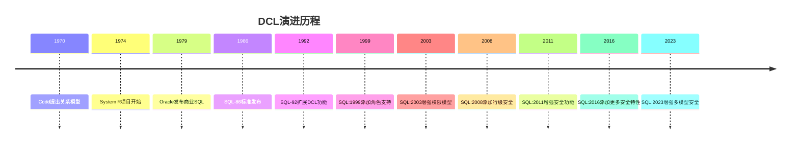
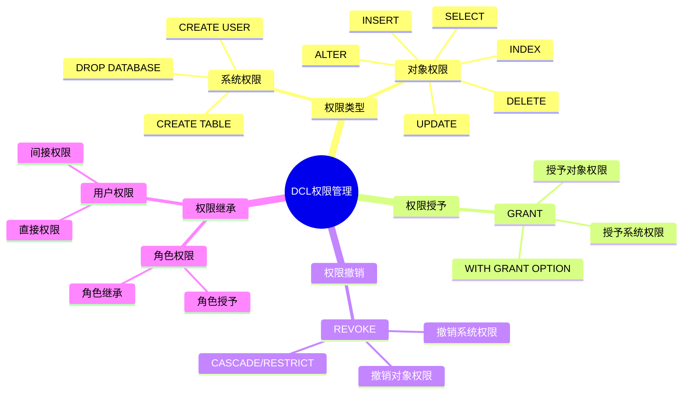
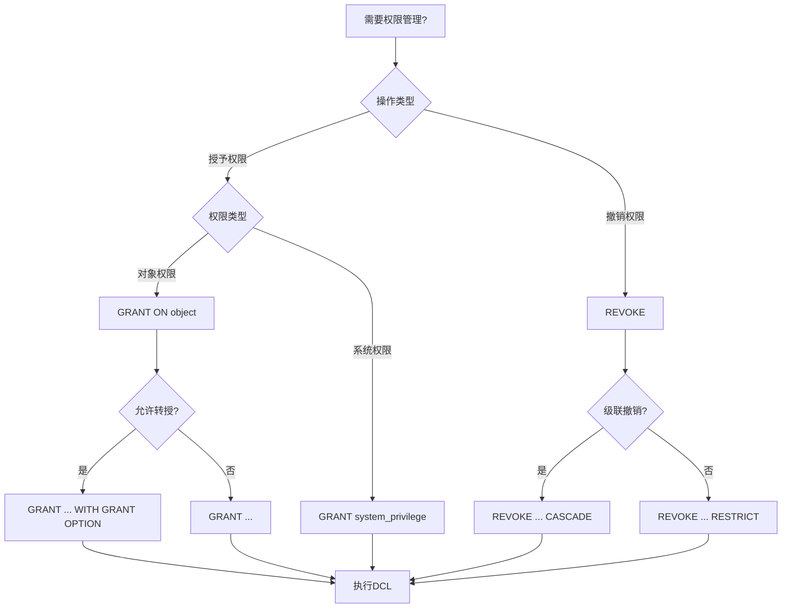
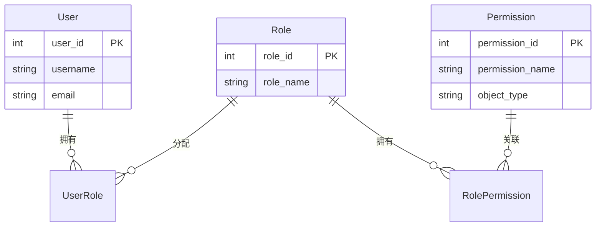
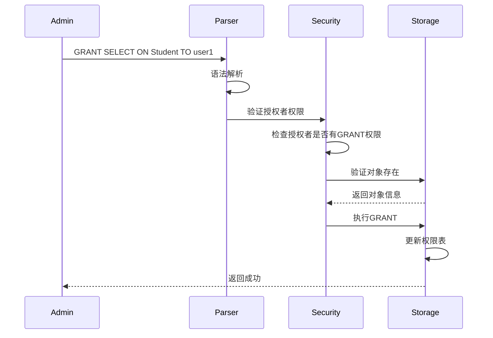

# 数据控制语言(DCL)

> **创建日期**：2025-01-15
> **最后更新**：2025-01-16
> **版本**：v1.0.0
> **难度**：⭐⭐⭐
> **应用场景**：权限管理、安全控制

---

## 📋 目录

- [数据控制语言(DCL)](#数据控制语言dcl)
  - [📋 目录](#-目录)
  - [一、概述](#一概述)
    - [1.0 DCL的历史背景](#10-dcl的历史背景)
      - [1.0.1 DCL的起源](#101-dcl的起源)
      - [1.0.2 DCL在SQL标准中的位置](#102-dcl在sql标准中的位置)
      - [1.0.3 DCL的形式化定义](#103-dcl的形式化定义)
      - [1.0.4 DCL与安全模型的对应关系](#104-dcl与安全模型的对应关系)
    - [1.1 DCL权限管理思维导图](#11-dcl权限管理思维导图)
    - [1.2 权限管理决策树](#12-权限管理决策树)
    - [1.3 权限类型对比矩阵](#13-权限类型对比矩阵)
  - [二、GRANT](#二grant)
    - [2.1 基本语法](#21-基本语法)
    - [2.2 场景示例：学生管理系统权限管理](#22-场景示例学生管理系统权限管理)
  - [三、REVOKE](#三revoke)
    - [3.1 基本语法](#31-基本语法)
  - [四、DCL最佳实践](#四dcl最佳实践)
    - [4.1 权限管理最佳实践](#41-权限管理最佳实践)
    - [4.2 安全最佳实践](#42-安全最佳实践)
  - [五、DCL标准演进历史](#五dcl标准演进历史)
    - [5.1 SQL-86到SQL-92的演进](#51-sql-86到sql-92的演进)
    - [5.2 SQL:1999到SQL:2023的演进](#52-sql1999到sql2023的演进)
  - [六、相关资源](#六相关资源)
    - [相关文档](#相关文档)
    - [外部资源](#外部资源)
      - [经典教材](#经典教材)
      - [标准文档](#标准文档)
      - [在线资源](#在线资源)
  - [七、PostgreSQL 18 DCL特性 🆕](#七postgresql-18-dcl特性-)
    - [7.1 行级安全策略(RLS)](#71-行级安全策略rls)
    - [7.2 角色和权限管理](#72-角色和权限管理)
  - [八、SQLite 3.45+ 权限说明 🆕](#八sqlite-345-权限说明-)

---

## 一、概述

**数据控制语言（DCL, Data Control Language）**用于控制数据库访问权限。

**DCL主要语句**：

- GRANT：授予权限
- REVOKE：撤销权限

### 1.0 DCL的历史背景

#### 1.0.1 DCL的起源

**历史背景**：

DCL的概念最早出现在1970年代，随着数据库安全需求的发展而诞生：

- **1970年**：Codd提出关系模型，为DCL奠定理论基础
- **1974年**：IBM的System R项目开始开发，首次实现了权限控制
- **1979年**：Oracle发布第一个商业SQL数据库，包含完整的DCL支持
- **1986年**：SQL-86标准正式发布，DCL成为SQL标准的核心组成部分

**DCL的演进历程**：



#### 1.0.2 DCL在SQL标准中的位置

**DCL在SQL标准中的定义**：

根据ISO/IEC 9075标准，DCL属于SQL/Foundation部分，是SQL标准的核心组成部分。

#### 1.0.3 DCL的形式化定义

**DCL的数学定义**：

```latex
\text{DCL（数据控制语言）是一个四元组：}
\text{DCL} = (\text{Subjects}, \text{Objects}, \text{Privileges}, \text{Authorization})

\text{其中：}
- \text{Subjects} = \{\text{User}, \text{Role}\} \text{ 是主体集合（用户、角色）}
- \text{Objects} = \{\text{Table}, \text{View}, \text{Database}\} \text{ 是对象集合}
- \text{Privileges} = \{\text{SELECT}, \text{INSERT}, \text{UPDATE}, \text{DELETE}, \text{ALL}\} \text{ 是权限集合}
- \text{Authorization} \text{ 是授权函数}
```

**权限的形式化定义**：

```latex
\text{权限的形式化定义：}
\text{Privilege}(s, o, p) \text{ 表示主体 } s \text{ 对对象 } o \text{ 拥有权限 } p

\text{GRANT操作的语义：}
\text{Semantics}(\text{GRANT } p \text{ ON } o \text{ TO } s) =
  \text{Authorization}' = \text{Authorization} \cup \{(s, o, p)\}

\text{REVOKE操作的语义：}
\text{Semantics}(\text{REVOKE } p \text{ ON } o \text{ FROM } s) =
  \text{Authorization}' = \text{Authorization} \setminus \{(s, o, p)\}
```

#### 1.0.4 DCL与安全模型的对应关系

**DCL操作与安全模型概念的对应**：

| DCL操作 | 安全模型概念 | 数学表示 | 说明 |
|---------|------------|---------|------|
| **GRANT** | 权限授予 | $\text{Privilege}(s, o, p) = \text{true}$ | 授予权限 |
| **REVOKE** | 权限撤销 | $\text{Privilege}(s, o, p) = \text{false}$ | 撤销权限 |
| **角色** | 权限组 | $\text{Role} = \{p_1, p_2, \ldots, p_n\}$ | 权限集合 |
| **用户** | 主体 | $s \in \text{Subjects}$ | 权限主体 |

### 1.1 DCL权限管理思维导图



### 1.2 权限管理决策树



### 1.3 权限类型对比矩阵

| 权限类型 | 权限名称 | 作用范围 | 可转授 | 使用场景 |
|---------|---------|---------|--------|---------|
| **SELECT** | 查询权限 | 表/视图 | ✅ | 只读访问 |
| **INSERT** | 插入权限 | 表 | ✅ | 数据录入 |
| **UPDATE** | 更新权限 | 表/列 | ✅ | 数据修改 |
| **DELETE** | 删除权限 | 表 | ✅ | 数据删除 |
| **ALL PRIVILEGES** | 所有权限 | 表/数据库 | ✅ | 完全控制 |

---

## 二、GRANT

### 2.1 基本语法

**GRANT语法**：

```sql
GRANT privilege_list
ON object
TO user_list
[WITH GRANT OPTION];
```

### 2.2 场景示例：学生管理系统权限管理

**业务需求**：为学生管理系统设置不同角色的权限。

**权限管理ER图**：



**GRANT实现**：

```sql
-- 授予学生角色查询权限
GRANT SELECT ON Student TO student_role;
GRANT SELECT ON Course TO student_role;

-- 授予教师角色完整权限
GRANT SELECT, INSERT, UPDATE ON Student TO teacher_role;
GRANT SELECT, INSERT, UPDATE, DELETE ON Course TO teacher_role;
GRANT SELECT, INSERT, UPDATE ON Enrollment TO teacher_role;

-- 授予管理员所有权限（可转授）
GRANT ALL PRIVILEGES ON Student TO admin_role WITH GRANT OPTION;
GRANT ALL PRIVILEGES ON Course TO admin_role WITH GRANT OPTION;
GRANT ALL PRIVILEGES ON Enrollment TO admin_role WITH GRANT OPTION;
```

**权限授予执行流程时序图**：



---

## 三、REVOKE

### 3.1 基本语法

**REVOKE语法**：

```sql
REVOKE privilege_list
ON object
FROM user_list
[CASCADE | RESTRICT];
```

---

## 四、DCL最佳实践

### 4.1 权限管理最佳实践

**权限管理最佳实践**：

1. **最小权限原则**：只授予必要的权限
2. **角色管理**：使用角色管理权限，而不是直接授予用户
3. **定期审查**：定期审查和清理不必要的权限
4. **权限分离**：分离不同角色的权限，避免权限集中
5. **审计日志**：记录所有权限变更操作

### 4.2 安全最佳实践

**安全最佳实践**：

1. **强密码策略**：实施强密码策略
2. **定期更新密码**：定期更新用户密码
3. **禁用未使用账户**：禁用长期未使用的账户
4. **监控异常访问**：监控异常访问行为
5. **数据加密**：对敏感数据进行加密

## 五、DCL标准演进历史

### 5.1 SQL-86到SQL-92的演进

**SQL-86**：

- 基本的GRANT和REVOKE语法
- 支持对象权限

**SQL-92**：

- 增强了权限管理功能
- 支持系统权限

### 5.2 SQL:1999到SQL:2023的演进

**SQL:1999**：

- 添加了角色支持
- 增强了权限模型

**SQL:2003**：

- 增强了安全功能

**SQL:2008**：

- 添加了行级安全支持

**SQL:2011**：

- 增强了安全功能

**SQL:2016**：

- 添加了更多安全特性

**SQL:2023**：

- 增强了多模型数据库的安全支持

## 六、相关资源

### 相关文档

- [事务控制语言(TCL)](./04.05-事务控制语言(TCL).md) - TCL语法
- [数据定义语言(DDL)](./04.01-数据定义语言(DDL).md) - DDL语法

### 外部资源

#### 经典教材

- **Date, C. J. (2003)**. "An Introduction to Database Systems" (8th Edition). Addison-Wesley.
  - 详细讲解权限管理

- **Silberschatz, A., Korth, H. F., & Sudarshan, S. (2019)**. "Database System Concepts" (7th Edition). McGraw-Hill.
  - 深入讲解数据库安全

#### 标准文档

- **ISO/IEC 9075:2023** - SQL:2023标准文档
  - DCL的完整标准定义

#### 在线资源

- [Wikipedia: Data Control Language](https://en.wikipedia.org/wiki/Data_control_language)
- [PostgreSQL DCL Documentation](https://www.postgresql.org/docs/current/sql-grant.html)

---

## 七、PostgreSQL 18 DCL特性 🆕

### 7.1 行级安全策略(RLS)

```sql
-- PostgreSQL 18: 行级安全策略
ALTER TABLE orders ENABLE ROW LEVEL SECURITY;

-- 用户只能看自己的订单
CREATE POLICY user_orders ON orders
    FOR SELECT
    USING (user_id = current_user_id());

-- 管理员可以看所有订单
CREATE POLICY admin_all ON orders
    FOR ALL
    TO admin_role
    USING (true);

-- 强制策略（包括表所有者）
ALTER TABLE orders FORCE ROW LEVEL SECURITY;
```

### 7.2 角色和权限管理

```sql
-- 创建角色层次
CREATE ROLE reader;
CREATE ROLE writer;
CREATE ROLE admin;

GRANT reader TO writer;
GRANT writer TO admin;

-- 细粒度权限
GRANT SELECT (id, name, email) ON users TO reader;
GRANT INSERT, UPDATE ON orders TO writer;
GRANT ALL PRIVILEGES ON ALL TABLES IN SCHEMA public TO admin;
```

---

## 八、SQLite 3.45+ 权限说明 🆕

SQLite作为嵌入式数据库，不支持SQL级别的权限控制。安全性通过以下方式实现：

```sql
-- 文件系统权限
-- SQLite数据库文件的读写权限由操作系统控制

-- 应用层权限控制
-- 在应用代码中实现权限检查

-- sqlite3_set_authorizer() C API
-- 可以注册回调函数控制SQL操作权限

-- 加密扩展 (SQLite Encryption Extension)
-- 通过加密保护数据库文件
```

---

**维护者**: SQL Standards Team
**最后更新**: 2025-12-01
