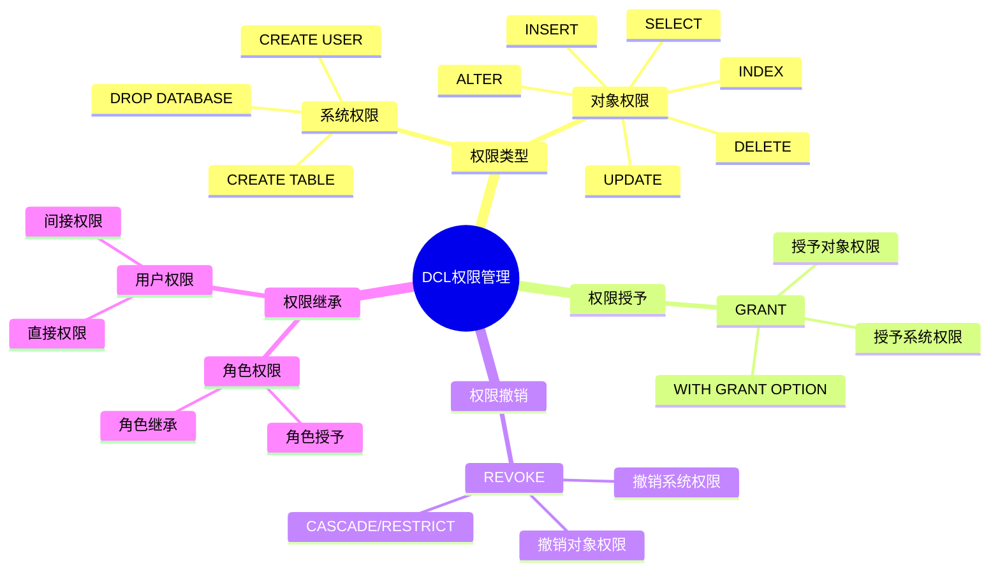
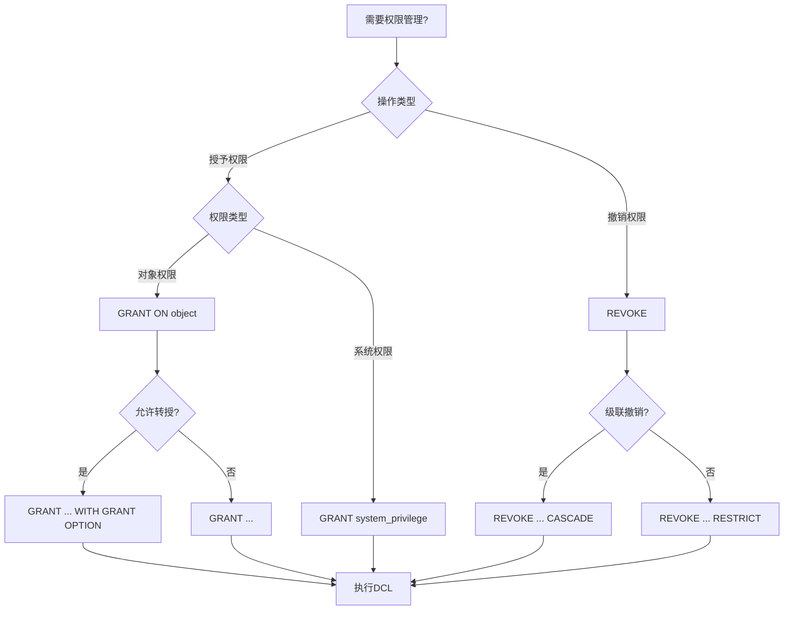
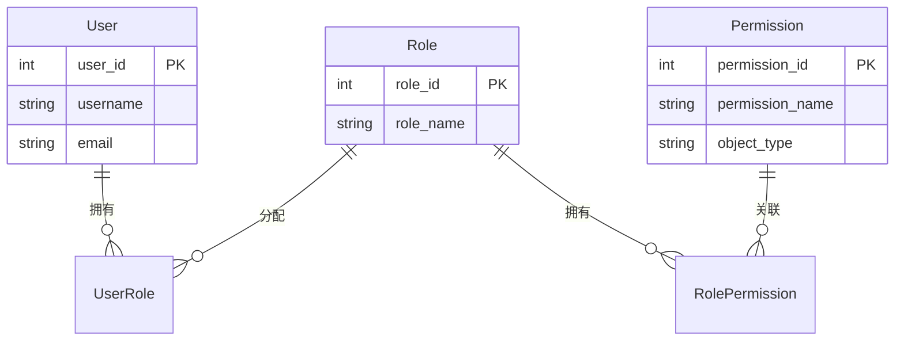
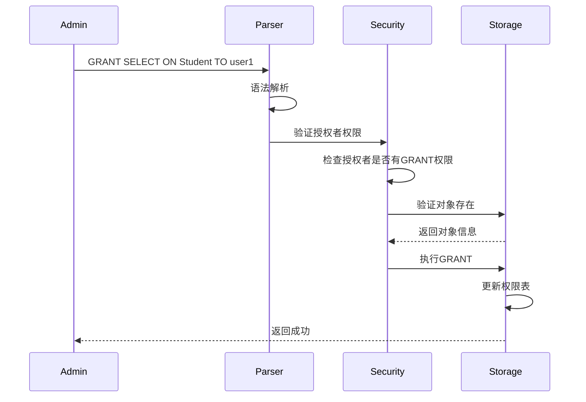

# 数据控制语言(DCL)

> **创建日期**：2025-01-15
> **最后更新**：2025-01-15
> **版本**：v1.0.0
> **难度**：⭐⭐⭐
> **应用场景**：权限管理、安全控制

---

## 📋 目录

- [数据控制语言(DCL)](#数据控制语言dcl)
  - [📋 目录](#-目录)
  - [一、概述](#一概述)
    - [1.1 DCL权限管理思维导图](#11-dcl权限管理思维导图)
    - [1.2 权限管理决策树](#12-权限管理决策树)
    - [1.3 权限类型对比矩阵](#13-权限类型对比矩阵)
  - [二、GRANT](#二grant)
    - [2.1 基本语法](#21-基本语法)
    - [2.2 场景示例：学生管理系统权限管理](#22-场景示例学生管理系统权限管理)
  - [三、REVOKE](#三revoke)
    - [3.1 基本语法](#31-基本语法)
  - [四、相关资源](#四相关资源)
    - [相关文档](#相关文档)

---

## 一、概述

**数据控制语言（DCL, Data Control Language）**用于控制数据库访问权限。

**DCL主要语句**：

- GRANT：授予权限
- REVOKE：撤销权限

### 1.1 DCL权限管理思维导图



### 1.2 权限管理决策树



### 1.3 权限类型对比矩阵

| 权限类型 | 权限名称 | 作用范围 | 可转授 | 使用场景 |
|---------|---------|---------|--------|---------|
| **SELECT** | 查询权限 | 表/视图 | ✅ | 只读访问 |
| **INSERT** | 插入权限 | 表 | ✅ | 数据录入 |
| **UPDATE** | 更新权限 | 表/列 | ✅ | 数据修改 |
| **DELETE** | 删除权限 | 表 | ✅ | 数据删除 |
| **ALL PRIVILEGES** | 所有权限 | 表/数据库 | ✅ | 完全控制 |

---

## 二、GRANT

### 2.1 基本语法

**GRANT语法**：

```sql
GRANT privilege_list
ON object
TO user_list
[WITH GRANT OPTION];
```

### 2.2 场景示例：学生管理系统权限管理

**业务需求**：为学生管理系统设置不同角色的权限。

**权限管理ER图**：



**GRANT实现**：

```sql
-- 授予学生角色查询权限
GRANT SELECT ON Student TO student_role;
GRANT SELECT ON Course TO student_role;

-- 授予教师角色完整权限
GRANT SELECT, INSERT, UPDATE ON Student TO teacher_role;
GRANT SELECT, INSERT, UPDATE, DELETE ON Course TO teacher_role;
GRANT SELECT, INSERT, UPDATE ON Enrollment TO teacher_role;

-- 授予管理员所有权限（可转授）
GRANT ALL PRIVILEGES ON Student TO admin_role WITH GRANT OPTION;
GRANT ALL PRIVILEGES ON Course TO admin_role WITH GRANT OPTION;
GRANT ALL PRIVILEGES ON Enrollment TO admin_role WITH GRANT OPTION;
```

**权限授予执行流程时序图**：



---

## 三、REVOKE

### 3.1 基本语法

**REVOKE语法**：

```sql
REVOKE privilege_list
ON object
FROM user_list
[CASCADE | RESTRICT];
```

---

## 四、相关资源

### 相关文档

- [事务控制语言(TCL)](./04.05-事务控制语言(TCL).md) - TCL语法

---

**维护者**: SQL Standards Team
**最后更新**: 2025-01-15
