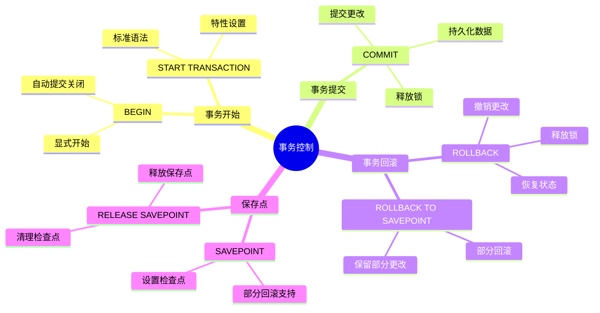
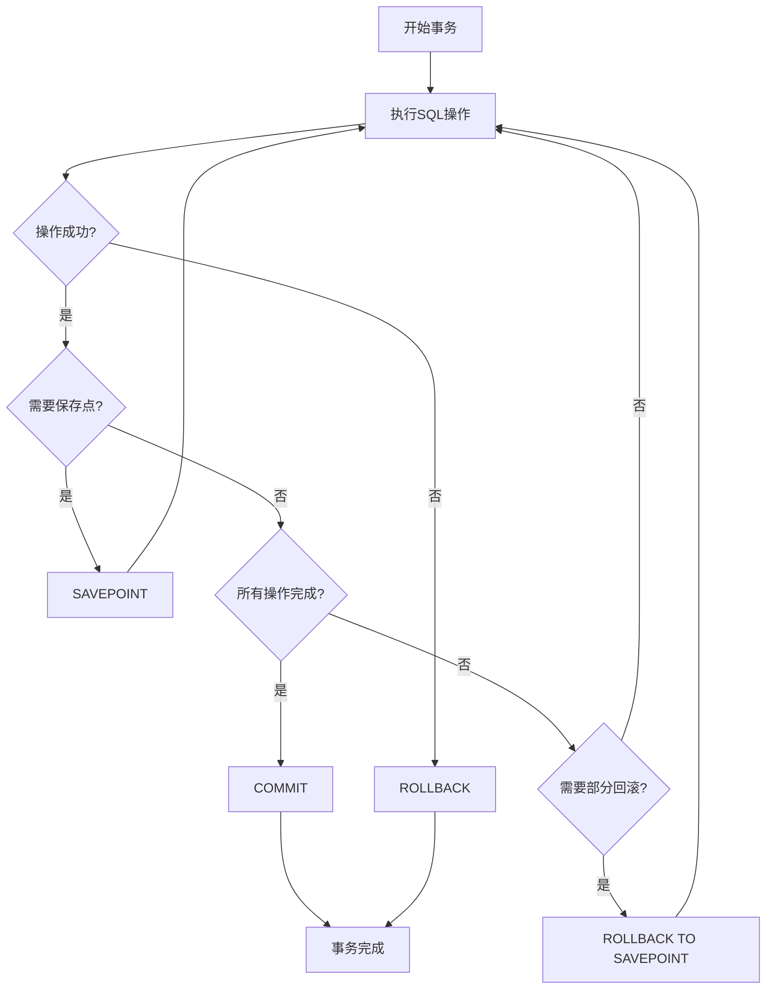
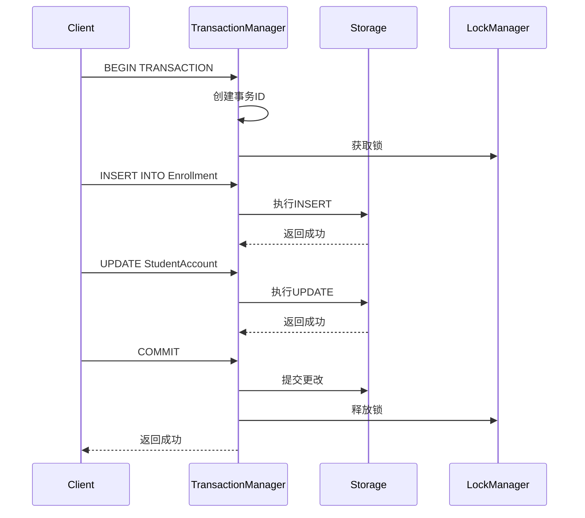
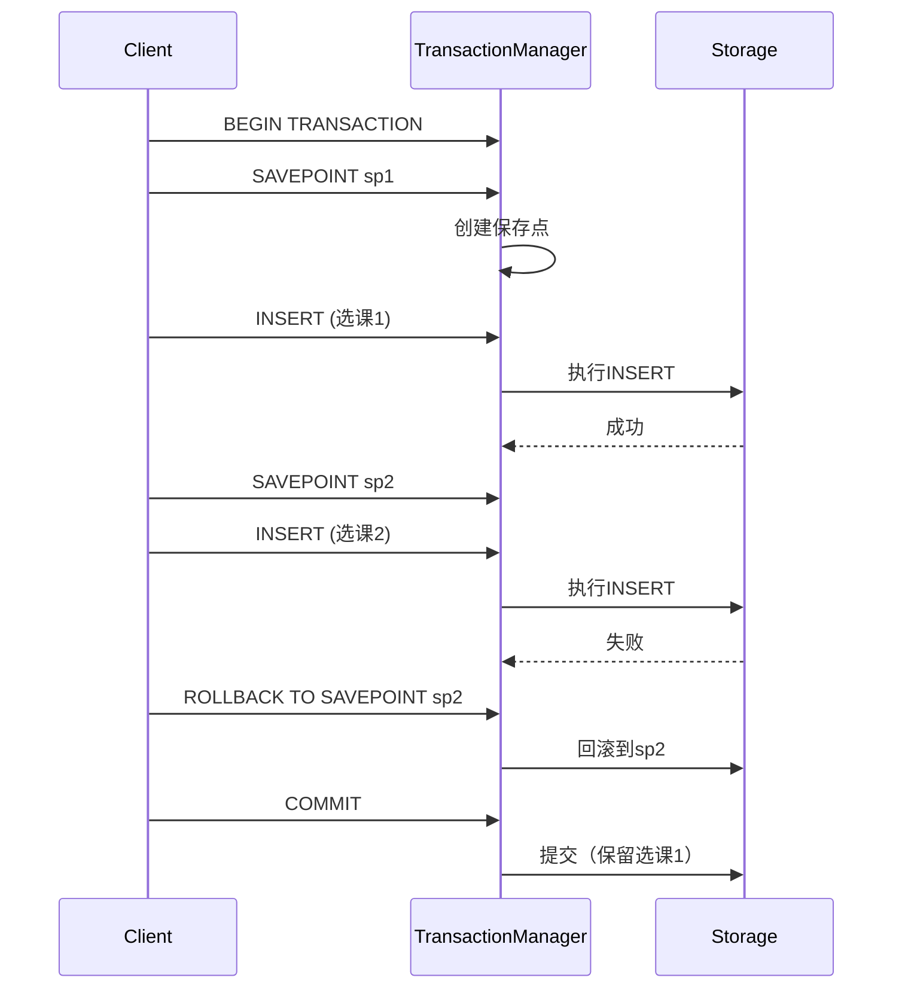

# 事务控制语言(TCL)

> **创建日期**：2025-01-15
> **最后更新**：2025-01-15
> **版本**：v1.0.0
> **难度**：⭐⭐⭐
> **应用场景**：事务管理、并发控制

---

## 📋 目录

- [事务控制语言(TCL)](#事务控制语言tcl)
  - [📋 目录](#-目录)
  - [一、概述](#一概述)
    - [1.1 事务控制思维导图](#11-事务控制思维导图)
    - [1.2 事务控制决策树](#12-事务控制决策树)
    - [1.3 事务隔离级别对比矩阵](#13-事务隔离级别对比矩阵)
  - [二、BEGIN/COMMIT/ROLLBACK](#二begincommitrollback)
    - [2.1 基本语法](#21-基本语法)
    - [2.2 场景示例：学生选课事务处理](#22-场景示例学生选课事务处理)
  - [三、SAVEPOINT](#三savepoint)
    - [3.1 保存点](#31-保存点)
    - [3.2 场景示例：多步骤操作部分回滚](#32-场景示例多步骤操作部分回滚)
  - [四、事务隔离级别](#四事务隔离级别)
    - [4.1 隔离级别](#41-隔离级别)
  - [五、相关资源](#五相关资源)
    - [相关文档](#相关文档)

---

## 一、概述

**事务控制语言（TCL, Transaction Control Language）**用于管理数据库事务。

**TCL主要语句**：

- BEGIN/START TRANSACTION：开始事务
- COMMIT：提交事务
- ROLLBACK：回滚事务
- SAVEPOINT：设置保存点

### 1.1 事务控制思维导图



### 1.2 事务控制决策树



### 1.3 事务隔离级别对比矩阵

| 隔离级别 | 脏读 | 不可重复读 | 幻读 | 性能 | 使用场景 |
|---------|------|-----------|------|------|---------|
| **READ UNCOMMITTED** | ❌ 可能 | ❌ 可能 | ❌ 可能 | ⭐⭐⭐⭐⭐ | 性能优先 |
| **READ COMMITTED** | ✅ 防止 | ❌ 可能 | ❌ 可能 | ⭐⭐⭐⭐ | 默认级别 |
| **REPEATABLE READ** | ✅ 防止 | ✅ 防止 | ❌ 可能 | ⭐⭐⭐ | 一致性要求 |
| **SERIALIZABLE** | ✅ 防止 | ✅ 防止 | ✅ 防止 | ⭐⭐ | 严格一致性 |

---

## 二、BEGIN/COMMIT/ROLLBACK

### 2.1 基本语法

**事务控制**：

```sql
BEGIN TRANSACTION;
-- SQL语句
COMMIT;

BEGIN TRANSACTION;
-- SQL语句
ROLLBACK;
```

### 2.2 场景示例：学生选课事务处理

**业务需求**：学生选课操作需要保证数据一致性，选课和扣费必须同时成功或失败。

**事务实现**：

```sql
-- 开始事务
BEGIN TRANSACTION;

-- 插入选课记录
INSERT INTO Enrollment (student_id, course_id, enroll_date)
VALUES (1, 101, CURRENT_DATE);

-- 扣除选课费用
UPDATE StudentAccount
SET balance = balance - 500
WHERE student_id = 1;

-- 检查余额是否足够
IF (SELECT balance FROM StudentAccount WHERE student_id = 1) < 0 THEN
    ROLLBACK;  -- 余额不足，回滚事务
ELSE
    COMMIT;    -- 提交事务
END IF;
```

**事务执行流程时序图**：



---

## 三、SAVEPOINT

### 3.1 保存点

**SAVEPOINT语法**：

```sql
BEGIN TRANSACTION;
SAVEPOINT sp1;
-- SQL语句
ROLLBACK TO SAVEPOINT sp1;
COMMIT;
```

### 3.2 场景示例：多步骤操作部分回滚

**业务需求**：学生批量选课操作，如果某门课程选课失败，只回滚该课程，保留其他已选课程。

**SAVEPOINT实现**：

```sql
BEGIN TRANSACTION;

-- 选课1
SAVEPOINT sp1;
INSERT INTO Enrollment (student_id, course_id, enroll_date)
VALUES (1, 101, CURRENT_DATE);
-- 假设成功，继续

-- 选课2
SAVEPOINT sp2;
INSERT INTO Enrollment (student_id, course_id, enroll_date)
VALUES (1, 102, CURRENT_DATE);
-- 假设失败，回滚到sp2
ROLLBACK TO SAVEPOINT sp2;

-- 选课3
SAVEPOINT sp3;
INSERT INTO Enrollment (student_id, course_id, enroll_date)
VALUES (1, 103, CURRENT_DATE);
-- 假设成功，继续

-- 提交事务（保留选课1和选课3）
COMMIT;
```

**保存点执行流程时序图**：



---

## 四、事务隔离级别

### 4.1 隔离级别

**隔离级别**：

- READ UNCOMMITTED
- READ COMMITTED
- REPEATABLE READ
- SERIALIZABLE

---

## 五、相关资源

### 相关文档

- [事务理论](../01-理论基础/01.05-事务理论.md) - 事务的形式化定义和ACID特性证明
- [数据控制语言(DCL)](./04.04-数据控制语言(DCL).md) - DCL语法

---

**维护者**: SQL Standards Team
**最后更新**: 2025-01-15
