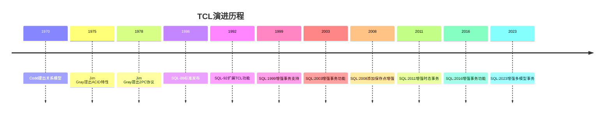
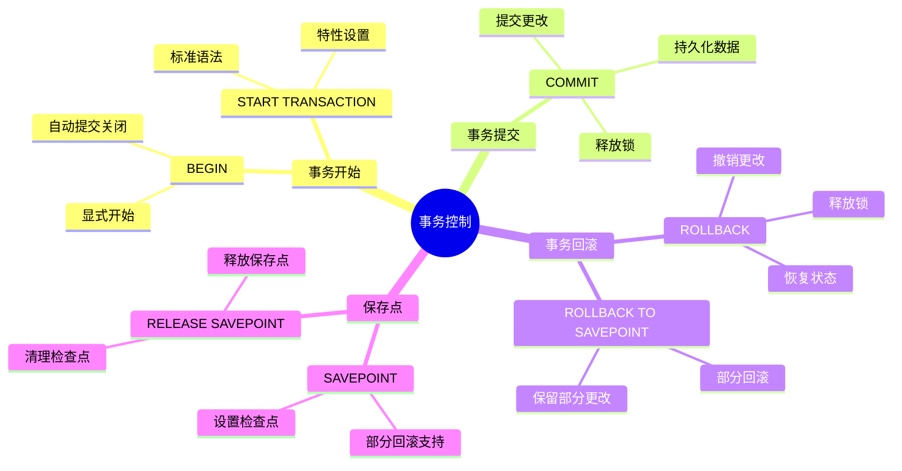
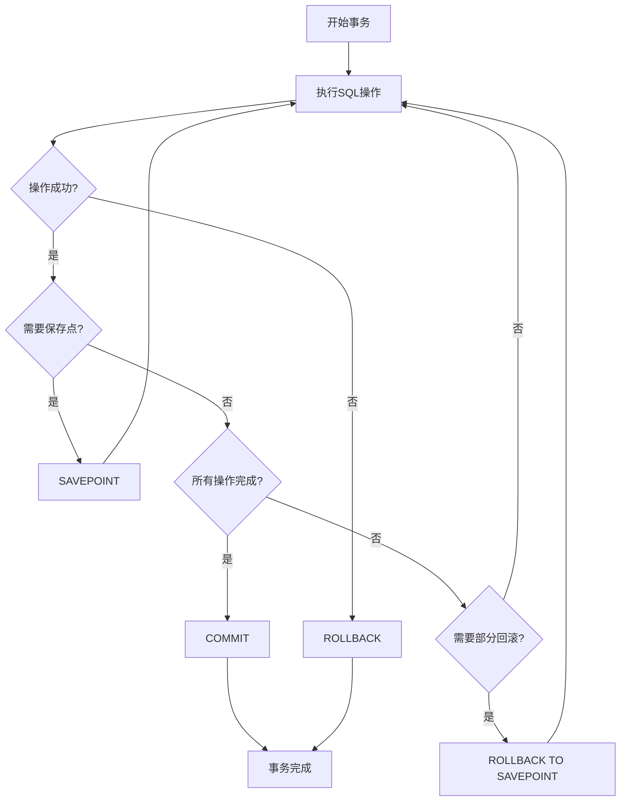
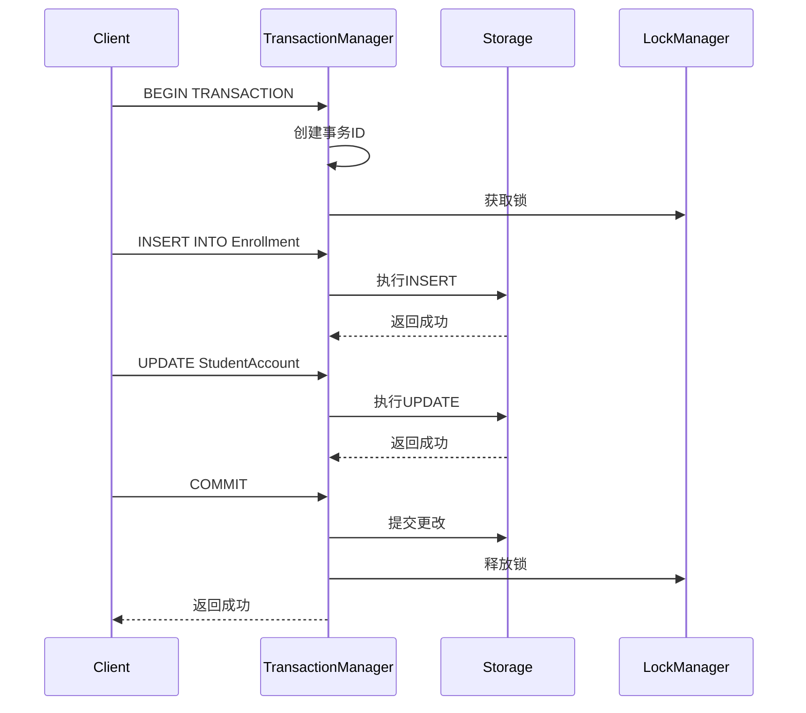
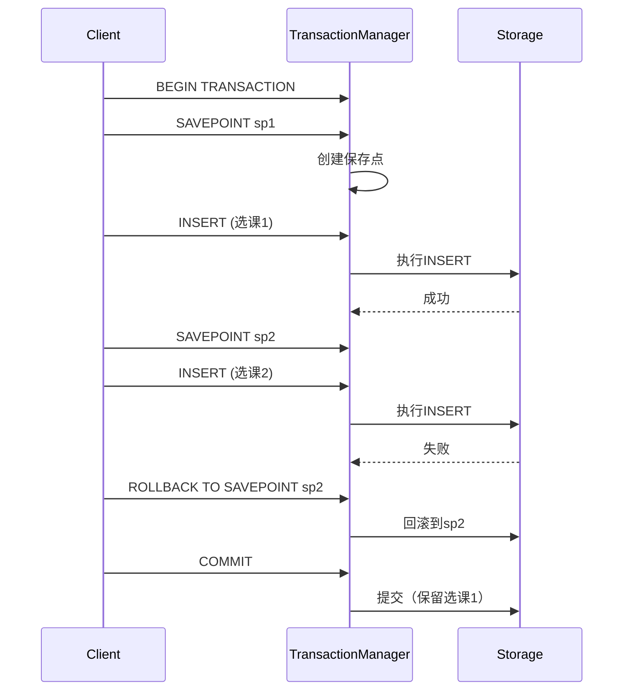

# 事务控制语言(TCL)

> **创建日期**：2025-01-15
> **最后更新**：2025-01-16
> **版本**：v1.0.0
> **难度**：⭐⭐⭐
> **应用场景**：事务管理、并发控制

---

## 📋 目录

- [事务控制语言(TCL)](#事务控制语言tcl)
  - [📋 目录](#-目录)
  - [一、概述](#一概述)
    - [1.0 TCL的历史背景](#10-tcl的历史背景)
      - [1.0.1 TCL的起源](#101-tcl的起源)
      - [1.0.2 TCL在SQL标准中的位置](#102-tcl在sql标准中的位置)
      - [1.0.3 TCL的形式化定义](#103-tcl的形式化定义)
      - [1.0.4 TCL与ACID特性的对应关系](#104-tcl与acid特性的对应关系)
    - [1.1 事务控制思维导图](#11-事务控制思维导图)
    - [1.2 事务控制决策树](#12-事务控制决策树)
    - [1.3 事务隔离级别对比矩阵](#13-事务隔离级别对比矩阵)
  - [二、BEGIN/COMMIT/ROLLBACK](#二begincommitrollback)
    - [2.1 基本语法](#21-基本语法)
    - [2.2 场景示例：学生选课事务处理](#22-场景示例学生选课事务处理)
  - [三、SAVEPOINT](#三savepoint)
    - [3.1 保存点](#31-保存点)
    - [3.2 场景示例：多步骤操作部分回滚](#32-场景示例多步骤操作部分回滚)
  - [四、事务隔离级别](#四事务隔离级别)
    - [4.1 隔离级别](#41-隔离级别)
  - [五、TCL最佳实践](#五tcl最佳实践)
    - [5.1 事务管理最佳实践](#51-事务管理最佳实践)
    - [5.2 事务设计最佳实践](#52-事务设计最佳实践)
  - [六、TCL标准演进历史](#六tcl标准演进历史)
    - [6.1 SQL-86到SQL-92的演进](#61-sql-86到sql-92的演进)
    - [6.2 SQL:1999到SQL:2023的演进](#62-sql1999到sql2023的演进)
  - [七、相关资源](#七相关资源)
    - [相关文档](#相关文档)
    - [外部资源](#外部资源)
      - [经典教材](#经典教材)
      - [标准文档](#标准文档)
      - [在线资源](#在线资源)
  - [八、PostgreSQL 18 TCL特性 🆕](#八postgresql-18-tcl特性-)
    - [8.1 事务隔离级别](#81-事务隔离级别)
    - [8.2 保存点与嵌套事务](#82-保存点与嵌套事务)
    - [8.3 两阶段提交](#83-两阶段提交)
  - [九、SQLite 3.45+ TCL特性 🆕](#九sqlite-345-tcl特性-)
    - [9.1 事务模式](#91-事务模式)
    - [9.2 WAL模式事务](#92-wal模式事务)

---

## 一、概述

**事务控制语言（TCL, Transaction Control Language）**用于管理数据库事务。

**TCL主要语句**：

- BEGIN/START TRANSACTION：开始事务
- COMMIT：提交事务
- ROLLBACK：回滚事务
- SAVEPOINT：设置保存点

### 1.0 TCL的历史背景

#### 1.0.1 TCL的起源

**历史背景**：

TCL的概念最早出现在1970年代，随着事务处理理论的发展而诞生：

- **1970年**：Codd提出关系模型，为TCL奠定理论基础
- **1975年**：Jim Gray提出ACID特性，奠定了事务理论的基础
- **1978年**：Jim Gray提出两阶段提交协议（2PC）
- **1986年**：SQL-86标准正式发布，TCL成为SQL标准的核心组成部分

**TCL的演进历程**：



#### 1.0.2 TCL在SQL标准中的位置

**TCL在SQL标准中的定义**：

根据ISO/IEC 9075标准，TCL属于SQL/Foundation部分，是SQL标准的核心组成部分。

#### 1.0.3 TCL的形式化定义

**TCL的数学定义**：

```latex
\text{TCL（事务控制语言）是一个四元组：}
\text{TCL} = (\text{Transactions}, \text{States}, \text{Operations}, \text{Semantics})

\text{其中：}
- \text{Transactions} = \{T_1, T_2, \ldots, T_n\} \text{ 是事务集合}
- \text{States} = \{\text{ACTIVE}, \text{COMMITTED}, \text{ABORTED}\} \text{ 是事务状态集合}
- \text{Operations} = \{\text{BEGIN}, \text{COMMIT}, \text{ROLLBACK}, \text{SAVEPOINT}\} \text{ 是TCL操作集合}
- \text{Semantics} \text{ 是TCL操作的语义函数}
```

**TCL操作的语义函数**：

```latex
\text{BEGIN操作的语义：}
\text{Semantics}(\text{BEGIN TRANSACTION}) =
  T \text{ 进入 ACTIVE 状态}

\text{COMMIT操作的语义：}
\text{Semantics}(\text{COMMIT}) =
  T \text{ 进入 COMMITTED 状态，所有更改永久保存}

\text{ROLLBACK操作的语义：}
\text{Semantics}(\text{ROLLBACK}) =
  T \text{ 进入 ABORTED 状态，所有更改被撤销}
```

#### 1.0.4 TCL与ACID特性的对应关系

**TCL操作与ACID特性的对应**：

| TCL操作 | ACID特性 | 说明 |
|---------|---------|------|
| **BEGIN** | 原子性、隔离性 | 开始事务，建立隔离边界 |
| **COMMIT** | 原子性、持久性 | 提交事务，保证原子性和持久性 |
| **ROLLBACK** | 原子性 | 回滚事务，保证原子性 |
| **SAVEPOINT** | 原子性 | 设置保存点，支持部分回滚 |

### 1.1 事务控制思维导图



### 1.2 事务控制决策树



### 1.3 事务隔离级别对比矩阵

| 隔离级别 | 脏读 | 不可重复读 | 幻读 | 性能 | 使用场景 |
|---------|------|-----------|------|------|---------|
| **READ UNCOMMITTED** | ❌ 可能 | ❌ 可能 | ❌ 可能 | ⭐⭐⭐⭐⭐ | 性能优先 |
| **READ COMMITTED** | ✅ 防止 | ❌ 可能 | ❌ 可能 | ⭐⭐⭐⭐ | 默认级别 |
| **REPEATABLE READ** | ✅ 防止 | ✅ 防止 | ❌ 可能 | ⭐⭐⭐ | 一致性要求 |
| **SERIALIZABLE** | ✅ 防止 | ✅ 防止 | ✅ 防止 | ⭐⭐ | 严格一致性 |

---

## 二、BEGIN/COMMIT/ROLLBACK

### 2.1 基本语法

**事务控制**：

```sql
BEGIN TRANSACTION;
-- SQL语句
COMMIT;

BEGIN TRANSACTION;
-- SQL语句
ROLLBACK;
```

### 2.2 场景示例：学生选课事务处理

**业务需求**：学生选课操作需要保证数据一致性，选课和扣费必须同时成功或失败。

**事务实现**：

```sql
-- 开始事务
BEGIN TRANSACTION;

-- 插入选课记录
INSERT INTO Enrollment (student_id, course_id, enroll_date)
VALUES (1, 101, CURRENT_DATE);

-- 扣除选课费用
UPDATE StudentAccount
SET balance = balance - 500
WHERE student_id = 1;

-- 检查余额是否足够
IF (SELECT balance FROM StudentAccount WHERE student_id = 1) < 0 THEN
    ROLLBACK;  -- 余额不足，回滚事务
ELSE
    COMMIT;    -- 提交事务
END IF;
```

**事务执行流程时序图**：



---

## 三、SAVEPOINT

### 3.1 保存点

**SAVEPOINT语法**：

```sql
BEGIN TRANSACTION;
SAVEPOINT sp1;
-- SQL语句
ROLLBACK TO SAVEPOINT sp1;
COMMIT;
```

### 3.2 场景示例：多步骤操作部分回滚

**业务需求**：学生批量选课操作，如果某门课程选课失败，只回滚该课程，保留其他已选课程。

**SAVEPOINT实现**：

```sql
BEGIN TRANSACTION;

-- 选课1
SAVEPOINT sp1;
INSERT INTO Enrollment (student_id, course_id, enroll_date)
VALUES (1, 101, CURRENT_DATE);
-- 假设成功，继续

-- 选课2
SAVEPOINT sp2;
INSERT INTO Enrollment (student_id, course_id, enroll_date)
VALUES (1, 102, CURRENT_DATE);
-- 假设失败，回滚到sp2
ROLLBACK TO SAVEPOINT sp2;

-- 选课3
SAVEPOINT sp3;
INSERT INTO Enrollment (student_id, course_id, enroll_date)
VALUES (1, 103, CURRENT_DATE);
-- 假设成功，继续

-- 提交事务（保留选课1和选课3）
COMMIT;
```

**保存点执行流程时序图**：



---

## 四、事务隔离级别

### 4.1 隔离级别

**隔离级别**：

- READ UNCOMMITTED
- READ COMMITTED
- REPEATABLE READ
- SERIALIZABLE

---

## 五、TCL最佳实践

### 5.1 事务管理最佳实践

**事务管理最佳实践**：

1. **保持事务简短**：事务应该尽可能简短，减少锁定时间
2. **避免长事务**：避免在事务中执行长时间操作
3. **使用适当的隔离级别**：根据业务需求选择合适的隔离级别
4. **处理死锁**：实现死锁检测和处理机制
5. **错误处理**：在事务中正确处理错误，及时回滚

### 5.2 事务设计最佳实践

**事务设计最佳实践**：

1. **原子性设计**：确保事务中的所有操作要么全部成功，要么全部失败
2. **一致性保证**：确保事务执行前后数据库状态一致
3. **隔离性考虑**：考虑并发访问的影响，选择合适的隔离级别
4. **持久性保证**：确保提交的事务数据持久保存

## 六、TCL标准演进历史

### 6.1 SQL-86到SQL-92的演进

**SQL-86**：

- 基本的BEGIN、COMMIT、ROLLBACK语法
- 支持基本事务控制

**SQL-92**：

- 增强了事务控制功能
- 支持保存点（SAVEPOINT）

### 6.2 SQL:1999到SQL:2023的演进

**SQL:1999**：

- 增强了事务控制功能
- 支持事务特性设置

**SQL:2003**：

- 增强了事务功能

**SQL:2008**：

- 增强了保存点功能

**SQL:2011**：

- 增强了时态事务支持

**SQL:2016**：

- 增强了事务功能

**SQL:2023**：

- 增强了多模型数据库的事务支持

## 七、相关资源

### 相关文档

- [事务理论](../01-理论基础/01.05-事务理论.md) - 事务的形式化定义和ACID特性证明
- [数据控制语言(DCL)](./04.04-数据控制语言(DCL).md) - DCL语法
- [数据操作语言(DML)](./04.02-数据操作语言(DML).md) - DML语法

### 外部资源

#### 经典教材

- **Gray, J., & Reuter, A. (1993)**. "Transaction Processing: Concepts and Techniques". Morgan Kaufmann.
  - 事务处理的经典教材

- **Date, C. J. (2003)**. "An Introduction to Database Systems" (8th Edition). Addison-Wesley.
  - 详细讲解事务管理

#### 标准文档

- **ISO/IEC 9075:2023** - SQL:2023标准文档
  - TCL的完整标准定义

#### 在线资源

- [Wikipedia: Transaction Control Language](https://en.wikipedia.org/wiki/Transaction_control_language)
- [PostgreSQL TCL Documentation](https://www.postgresql.org/docs/current/tutorial-transactions.html)

---

## 八、PostgreSQL 18 TCL特性 🆕

### 8.1 事务隔离级别

```sql
-- PostgreSQL 18: 设置隔离级别
BEGIN ISOLATION LEVEL READ COMMITTED;
BEGIN ISOLATION LEVEL REPEATABLE READ;
BEGIN ISOLATION LEVEL SERIALIZABLE;

-- 只读事务（优化）
BEGIN READ ONLY;

-- 可延迟事务（等待安全快照）
BEGIN ISOLATION LEVEL SERIALIZABLE READ ONLY DEFERRABLE;
```

### 8.2 保存点与嵌套事务

```sql
-- PostgreSQL 18: 保存点
BEGIN;
INSERT INTO orders (customer_id, amount) VALUES (1, 100);
SAVEPOINT sp1;

INSERT INTO order_items (order_id, product_id) VALUES (1, 101);
-- 出错时回滚到保存点
ROLLBACK TO SAVEPOINT sp1;

-- 继续其他操作
INSERT INTO order_items (order_id, product_id) VALUES (1, 102);
COMMIT;
```

### 8.3 两阶段提交

```sql
-- PostgreSQL 18: 准备提交（分布式事务）
BEGIN;
UPDATE accounts SET balance = balance - 100 WHERE id = 1;
PREPARE TRANSACTION 'transfer_001';

-- 在另一个会话中
COMMIT PREPARED 'transfer_001';
-- 或
ROLLBACK PREPARED 'transfer_001';
```

---

## 九、SQLite 3.45+ TCL特性 🆕

### 9.1 事务模式

```sql
-- SQLite 3.45+: 事务模式
BEGIN DEFERRED;   -- 延迟获取锁（默认）
BEGIN IMMEDIATE;  -- 立即获取RESERVED锁
BEGIN EXCLUSIVE;  -- 立即获取EXCLUSIVE锁

-- 提交和回滚
COMMIT;
ROLLBACK;

-- 保存点
SAVEPOINT sp1;
RELEASE SAVEPOINT sp1;
ROLLBACK TO SAVEPOINT sp1;
```

### 9.2 WAL模式事务

```sql
-- SQLite 3.45+: WAL模式提高并发
PRAGMA journal_mode = WAL;
PRAGMA busy_timeout = 5000;  -- 锁等待超时

-- WAL模式下的事务
BEGIN IMMEDIATE;
-- 读取不阻塞写入，写入不阻塞读取
UPDATE products SET stock = stock - 1 WHERE id = 101;
COMMIT;

-- 检查点（将WAL写入主数据库）
PRAGMA wal_checkpoint(TRUNCATE);
```

---

**维护者**: SQL Standards Team
**最后更新**: 2025-12-01
