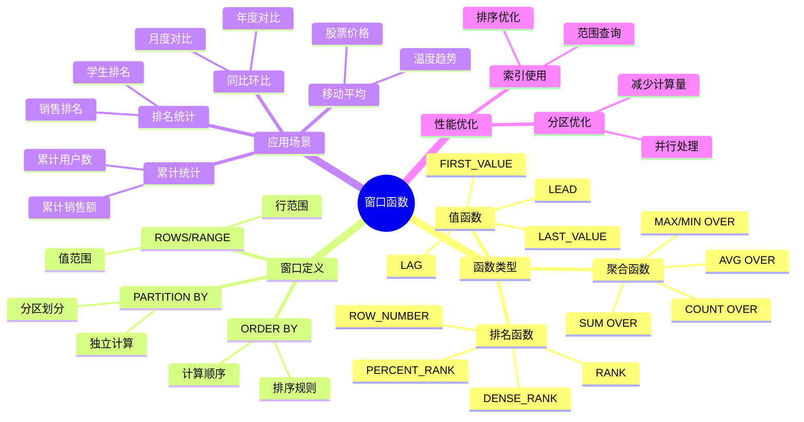
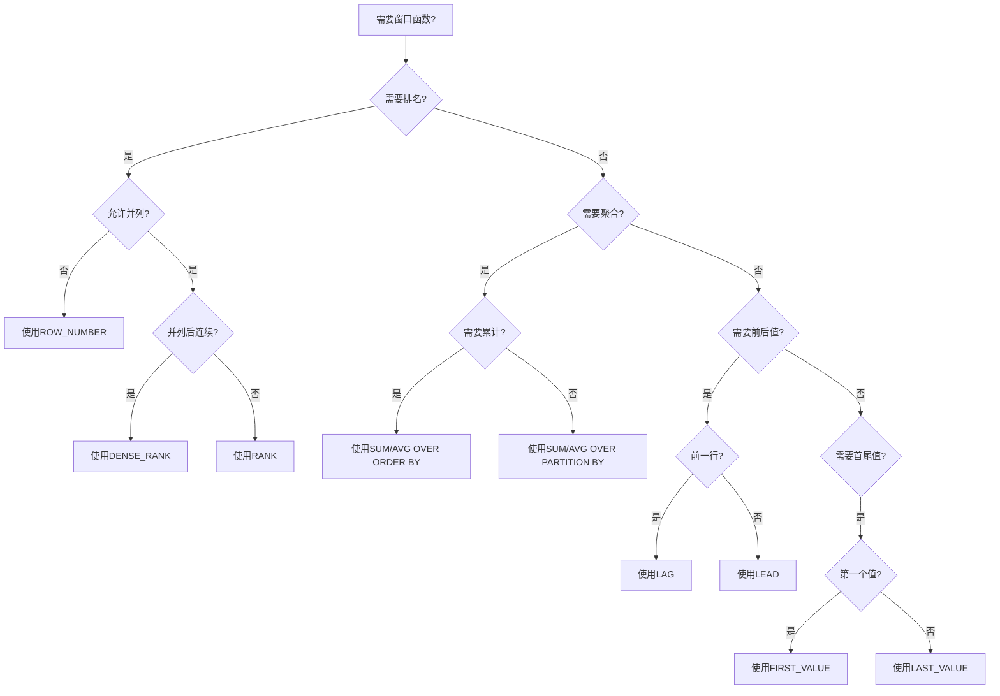
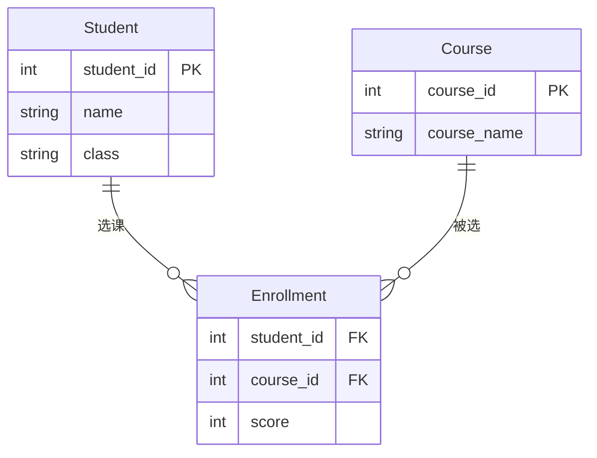
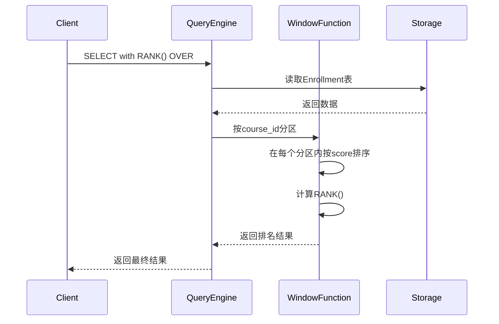
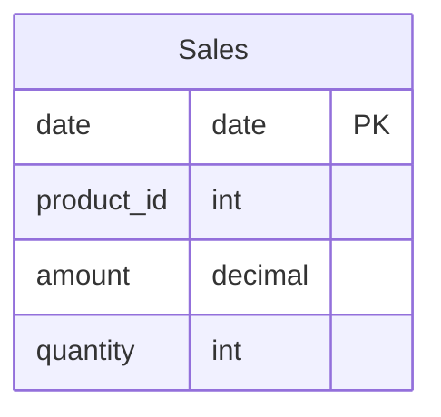

# 窗口函数详解

> **创建日期**：2025-01-15
> **最后更新**：2025-01-15
> **版本**：v1.0.0
> **难度**：⭐⭐⭐⭐
> **应用场景**：数据分析、排名计算、累计统计

---

## 📋 目录

- [窗口函数详解](#窗口函数详解)
  - [📋 目录](#-目录)
  - [一、概述](#一概述)
    - [1.1 窗口函数知识体系思维导图](#11-窗口函数知识体系思维导图)
    - [1.2 窗口函数选择决策树](#12-窗口函数选择决策树)
  - [二、窗口函数语法](#二窗口函数语法)
    - [2.1 基本语法](#21-基本语法)
    - [2.2 示例](#22-示例)
  - [三、窗口函数类型](#三窗口函数类型)
    - [3.1 排名函数](#31-排名函数)
    - [3.2 聚合函数](#32-聚合函数)
    - [3.3 值函数](#33-值函数)
  - [四、窗口函数应用](#四窗口函数应用)
    - [4.1 排名应用](#41-排名应用)
    - [4.1.1 场景示例：学生成绩排名分析](#411-场景示例学生成绩排名分析)
    - [4.2 累计统计](#42-累计统计)
    - [4.2.1 场景示例：销售累计统计和移动平均](#421-场景示例销售累计统计和移动平均)
    - [4.2.2 场景示例：同比环比分析](#422-场景示例同比环比分析)
  - [五、性能优化](#五性能优化)
    - [5.1 优化建议](#51-优化建议)
  - [六、相关资源](#六相关资源)
    - [相关文档](#相关文档)

---

## 一、概述

**窗口函数（Window Functions）**是SQL:2003引入的高级特性，用于在查询结果集的窗口上执行计算。

**窗口函数特点**：

- 不改变结果集行数
- 可以访问同一查询中其他行的数据
- 支持分区和排序

### 1.1 窗口函数知识体系思维导图



### 1.2 窗口函数选择决策树



---

## 二、窗口函数语法

### 2.1 基本语法

**窗口函数语法**：

```sql
function_name([arguments]) OVER (
    [PARTITION BY partition_list]
    [ORDER BY order_list]
    [ROWS | RANGE frame_clause]
)
```

### 2.2 示例

**示例**：

```sql
SELECT
    student_id,
    score,
    ROW_NUMBER() OVER (PARTITION BY class ORDER BY score DESC) as rank
FROM Scores;
```

---

## 三、窗口函数类型

### 3.1 排名函数

**排名函数**：

- ROW_NUMBER()：行号
- RANK()：排名（允许并列）
- DENSE_RANK()：密集排名
- PERCENT_RANK()：百分比排名

### 3.2 聚合函数

**聚合窗口函数**：

- SUM() OVER()
- AVG() OVER()
- COUNT() OVER()
- MAX() OVER()
- MIN() OVER()

### 3.3 值函数

**值函数**：

- LAG()：前一行值
- LEAD()：后一行值
- FIRST_VALUE()：窗口第一个值
- LAST_VALUE()：窗口最后一个值

---

## 四、窗口函数应用

### 4.1 排名应用

### 4.1.1 场景示例：学生成绩排名分析

**业务需求**：计算每门课程的学生排名，并分析成绩分布。

**数据模型**：



**排名查询实现**：

```sql
SELECT
    c.course_name,
    s.name,
    s.class,
    e.score,
    RANK() OVER (PARTITION BY e.course_id ORDER BY e.score DESC) as course_rank,
    DENSE_RANK() OVER (PARTITION BY e.course_id ORDER BY e.score DESC) as dense_rank,
    ROW_NUMBER() OVER (PARTITION BY e.course_id ORDER BY e.score DESC) as row_number,
    PERCENT_RANK() OVER (PARTITION BY e.course_id ORDER BY e.score DESC) as percent_rank
FROM Enrollment e
JOIN Student s ON e.student_id = s.student_id
JOIN Course c ON e.course_id = c.course_id
ORDER BY c.course_name, course_rank;
```

**查询执行流程时序图**：



### 4.2 累计统计

### 4.2.1 场景示例：销售累计统计和移动平均

**业务需求**：计算每日销售额的累计值和7日移动平均。

**数据模型**：



**累计统计查询实现**：

```sql
SELECT
    date,
    amount,
    SUM(amount) OVER (ORDER BY date) as cumulative_sales,
    AVG(amount) OVER (
        ORDER BY date
        ROWS BETWEEN 6 PRECEDING AND CURRENT ROW
    ) as moving_avg_7d,
    SUM(amount) OVER (
        ORDER BY date
        ROWS BETWEEN 29 PRECEDING AND CURRENT ROW
    ) as moving_sum_30d
FROM Sales
ORDER BY date;
```

### 4.2.2 场景示例：同比环比分析

**业务需求**：计算月度销售额的同比和环比增长率。

**同比环比查询实现**：

```sql
WITH monthly_sales AS (
    SELECT
        DATE_TRUNC('month', date) as month,
        SUM(amount) as total_sales
    FROM Sales
    GROUP BY DATE_TRUNC('month', date)
)
SELECT
    month,
    total_sales,
    LAG(total_sales, 1) OVER (ORDER BY month) as prev_month,
    LAG(total_sales, 12) OVER (ORDER BY month) as prev_year,
    (total_sales - LAG(total_sales, 1) OVER (ORDER BY month)) * 100.0 /
        LAG(total_sales, 1) OVER (ORDER BY month) as month_over_month_pct,
    (total_sales - LAG(total_sales, 12) OVER (ORDER BY month)) * 100.0 /
        LAG(total_sales, 12) OVER (ORDER BY month) as year_over_year_pct
FROM monthly_sales
ORDER BY month;
```

---

## 五、性能优化

### 5.1 优化建议

**性能优化**：

1. 合理使用PARTITION BY
2. 避免不必要的排序
3. 使用索引支持窗口函数

---

## 六、相关资源

### 相关文档

- [公共表表达式(CTE)](./05.02-公共表表达式(CTE).md) - CTE详解
- [数据查询语言(DQL)](../04-语法规范/04.03-数据查询语言(DQL).md) - DQL语法

---

**维护者**: SQL Standards Team
**最后更新**: 2025-01-15
