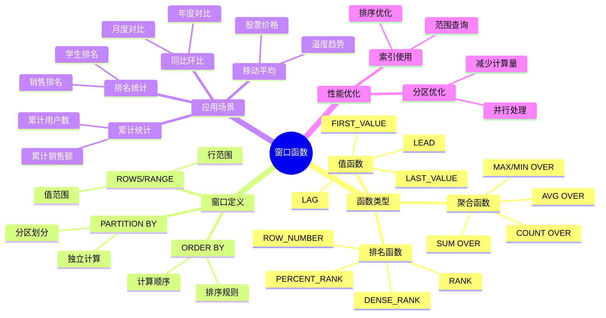
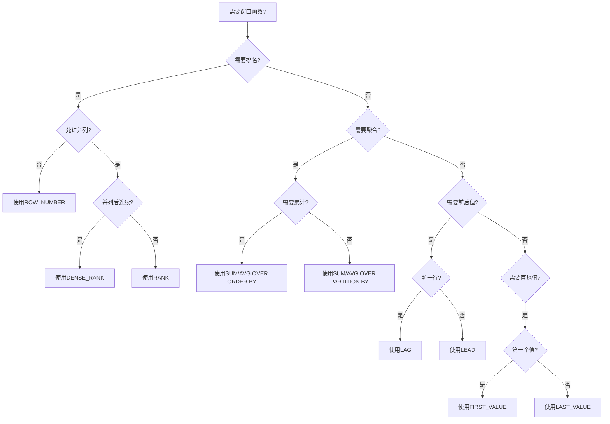
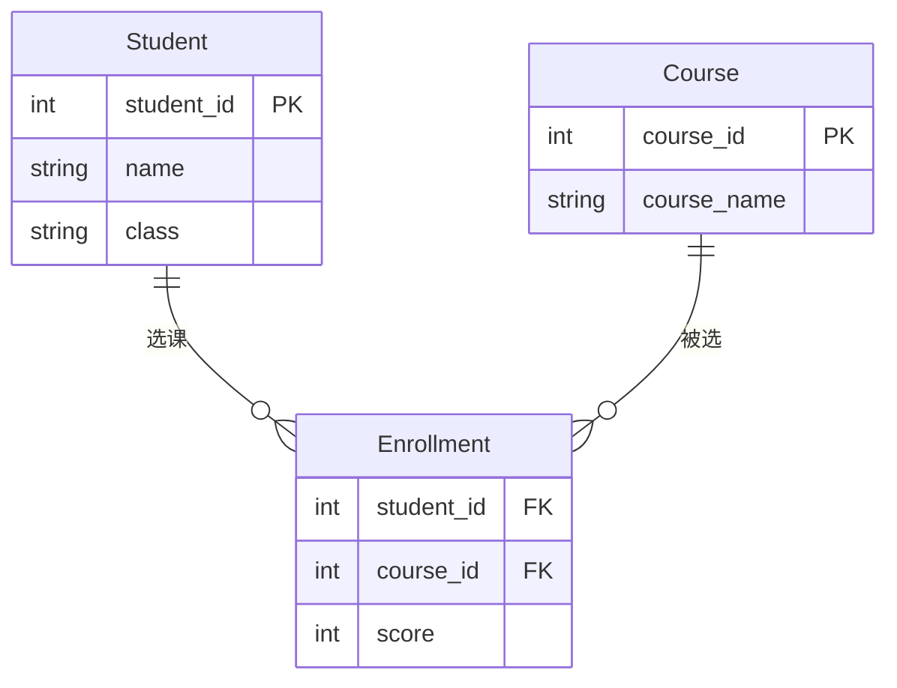
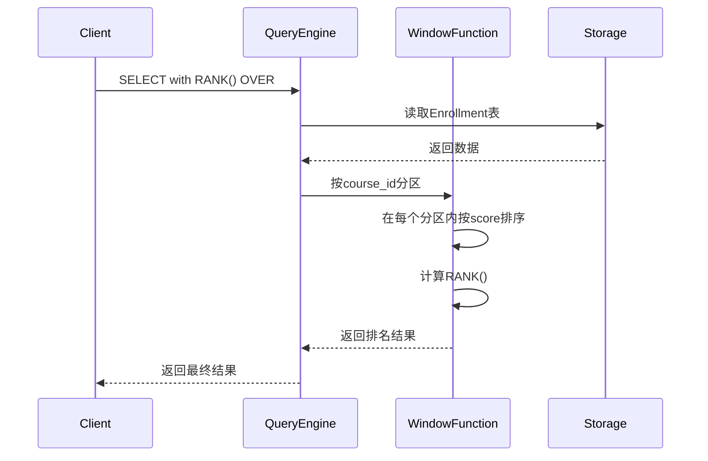
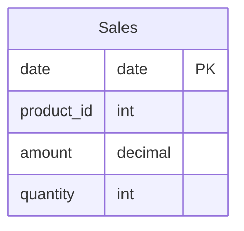
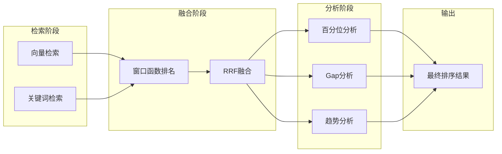

# 窗口函数详解

> **创建日期**：2025-01-15
> **最后更新**：2025-12-01
> **版本**：v2.0.0
> **难度**：⭐⭐⭐⭐
> **应用场景**：数据分析、排名计算、累计统计、向量相似度分析

---

## 📋 目录

- [窗口函数详解](#窗口函数详解)
  - [📋 目录](#-目录)
  - [一、概述](#一概述)
    - [1.0 窗口函数历史背景](#10-窗口函数历史背景)
    - [1.1 窗口函数知识体系思维导图](#11-窗口函数知识体系思维导图)
    - [1.2 窗口函数选择决策树](#12-窗口函数选择决策树)
  - [二、窗口函数语法](#二窗口函数语法)
    - [2.1 窗口函数的形式化定义](#21-窗口函数的形式化定义)
    - [2.2 基本语法](#22-基本语法)
    - [2.3 示例](#23-示例)
  - [三、窗口函数类型](#三窗口函数类型)
    - [3.1 排名函数](#31-排名函数)
    - [3.2 聚合函数](#32-聚合函数)
    - [3.3 值函数](#33-值函数)
  - [四、窗口函数应用](#四窗口函数应用)
    - [4.1 排名应用](#41-排名应用)
    - [4.1.1 场景示例：学生成绩排名分析](#411-场景示例学生成绩排名分析)
    - [4.2 累计统计](#42-累计统计)
    - [4.2.1 场景示例：销售累计统计和移动平均](#421-场景示例销售累计统计和移动平均)
    - [4.2.2 场景示例：同比环比分析](#422-场景示例同比环比分析)
  - [五、性能优化](#五性能优化)
    - [5.1 优化建议](#51-优化建议)
    - [5.2 窗口函数的性能考虑](#52-窗口函数的性能考虑)
  - [六、窗口函数标准演进](#六窗口函数标准演进)
    - [6.1 SQL:2003标准](#61-sql2003标准)
    - [6.2 SQL:2008标准](#62-sql2008标准)
    - [6.3 SQL:2011标准](#63-sql2011标准)
    - [6.4 SQL:2016标准](#64-sql2016标准)
    - [6.5 SQL:2023标准](#65-sql2023标准)
  - [七、窗口函数与关系模型的对应关系](#七窗口函数与关系模型的对应关系)
    - [7.1 窗口函数的关系代数扩展](#71-窗口函数的关系代数扩展)
    - [7.2 窗口函数的查询优化](#72-窗口函数的查询优化)
    - [7.3 窗口函数形式化证明 🆕](#73-窗口函数形式化证明-)
  - [八、2025窗口函数与向量分析](#八2025窗口函数与向量分析)
    - [8.1 向量相似度排名](#81-向量相似度排名)
    - [8.2 多路召回融合分析](#82-多路召回融合分析)
    - [8.3 时序向量分析](#83-时序向量分析)
    - [8.4 2025窗口函数应用矩阵](#84-2025窗口函数应用矩阵)
    - [8.5 窗口函数 + 向量检索流程](#85-窗口函数--向量检索流程)
  - [九、相关资源](#九相关资源)
    - [相关文档](#相关文档)
    - [2025新资源](#2025新资源)

---

## 一、概述

**窗口函数（Window Functions）**是SQL:2003引入的高级特性，用于在查询结果集的窗口上执行计算。

**窗口函数特点**：

- 不改变结果集行数
- 可以访问同一查询中其他行的数据
- 支持分区和排序

### 1.0 窗口函数历史背景

**窗口函数的发展历程**：

- **SQL:1999**：引入了OLAP函数的概念，为窗口函数奠定了基础
- **SQL:2003**：正式引入窗口函数（Window Functions），包括排名函数、聚合窗口函数和值函数
- **SQL:2008**：增强了窗口函数功能，改进了ROWS和RANGE子句
- **SQL:2011**：添加了更多窗口函数，如PERCENT_RANK、CUME_DIST等
- **SQL:2016**：增强了窗口函数的性能优化支持
- **SQL:2023**：进一步完善了窗口函数的语法和功能

**窗口函数的设计动机**：

窗口函数的设计是为了解决传统SQL在数据分析中的局限性：

1. **排名问题**：需要计算排名、百分比排名等，传统SQL需要复杂的自连接或子查询
2. **累计统计**：需要计算累计和、移动平均等，传统SQL难以高效实现
3. **前后值访问**：需要访问前一行或后一行的值，传统SQL需要自连接
4. **分区计算**：需要在不同分区内独立计算，传统SQL需要多次查询

**窗口函数与关系模型的关系**：

窗口函数扩展了关系代数的表达能力，允许在关系上定义"窗口"（Window），在窗口内执行计算。这可以看作是关系代数的一种扩展，提供了更强大的数据分析能力。

### 1.1 窗口函数知识体系思维导图



### 1.2 窗口函数选择决策树



---

## 二、窗口函数语法

### 2.1 窗口函数的形式化定义

**窗口函数的BNF语法定义**（基于SQL:2003标准）：

```bnf
<window function> ::=
    <window function type> OVER <window specification>

<window function type> ::=
    <rank function>
    | <aggregate function>
    | <value function>

<window specification> ::=
    [ <window name> ]
    | [ <partition clause> ] [ <order clause> ] [ <frame clause> ]

<partition clause> ::=
    PARTITION BY <value expression> [ { <comma> <value expression> }... ]

<order clause> ::=
    ORDER BY <sort specification> [ { <comma> <sort specification> }... ]

<frame clause> ::=
    <frame units> <frame extent> [ <frame exclusion> ]

<frame units> ::=
    ROWS
    | RANGE
    | GROUPS

<frame extent> ::=
    <frame start>
    | <frame between>

<frame start> ::=
    UNBOUNDED PRECEDING
    | <unsigned value specification> PRECEDING
    | CURRENT ROW

<frame between> ::=
    BETWEEN <frame bound> AND <frame bound>

<frame bound> ::=
    <frame start>
    | UNBOUNDED FOLLOWING
    | <unsigned value specification> FOLLOWING

<frame exclusion> ::=
    EXCLUDE CURRENT ROW
    | EXCLUDE GROUP
    | EXCLUDE TIES
    | EXCLUDE NO OTHERS
```

**窗口函数的语义定义**：

窗口函数在关系$R$上定义了一个窗口$W$，窗口函数$f$在窗口$W$内的每一行$r$上计算值$f(r, W)$。

形式化地，对于关系$R$和窗口函数$f$：

- 窗口$W$由分区子句$P$、排序子句$O$和框架子句$F$定义
- 对于每一行$r \in R$，窗口$W(r)$是满足以下条件的行的集合：
  - 如果存在分区子句$P$，则$W(r)$中的行与$r$在分区属性上具有相同的值
  - 如果存在排序子句$O$，则$W(r)$中的行按照$O$排序
  - 如果存在框架子句$F$，则$W(r)$中的行在框架范围内

### 2.2 基本语法

**窗口函数语法**：

```sql
function_name([arguments]) OVER (
    [PARTITION BY partition_list]
    [ORDER BY order_list]
    [ROWS | RANGE frame_clause]
)
```

### 2.3 示例

**示例**：

```sql
SELECT
    student_id,
    score,
    ROW_NUMBER() OVER (PARTITION BY class ORDER BY score DESC) as rank
FROM Scores;
```

---

## 三、窗口函数类型

### 3.1 排名函数

**排名函数**：

- ROW_NUMBER()：行号
- RANK()：排名（允许并列）
- DENSE_RANK()：密集排名
- PERCENT_RANK()：百分比排名

### 3.2 聚合函数

**聚合窗口函数**：

- SUM() OVER()
- AVG() OVER()
- COUNT() OVER()
- MAX() OVER()
- MIN() OVER()

### 3.3 值函数

**值函数**：

- LAG()：前一行值
- LEAD()：后一行值
- FIRST_VALUE()：窗口第一个值
- LAST_VALUE()：窗口最后一个值

---

## 四、窗口函数应用

### 4.1 排名应用

### 4.1.1 场景示例：学生成绩排名分析

**业务需求**：计算每门课程的学生排名，并分析成绩分布。

**数据模型**：



**排名查询实现**：

```sql
SELECT
    c.course_name,
    s.name,
    s.class,
    e.score,
    RANK() OVER (PARTITION BY e.course_id ORDER BY e.score DESC) as course_rank,
    DENSE_RANK() OVER (PARTITION BY e.course_id ORDER BY e.score DESC) as dense_rank,
    ROW_NUMBER() OVER (PARTITION BY e.course_id ORDER BY e.score DESC) as row_number,
    PERCENT_RANK() OVER (PARTITION BY e.course_id ORDER BY e.score DESC) as percent_rank
FROM Enrollment e
JOIN Student s ON e.student_id = s.student_id
JOIN Course c ON e.course_id = c.course_id
ORDER BY c.course_name, course_rank;
```

**查询执行流程时序图**：



### 4.2 累计统计

### 4.2.1 场景示例：销售累计统计和移动平均

**业务需求**：计算每日销售额的累计值和7日移动平均。

**数据模型**：



**累计统计查询实现**：

```sql
SELECT
    date,
    amount,
    SUM(amount) OVER (ORDER BY date) as cumulative_sales,
    AVG(amount) OVER (
        ORDER BY date
        ROWS BETWEEN 6 PRECEDING AND CURRENT ROW
    ) as moving_avg_7d,
    SUM(amount) OVER (
        ORDER BY date
        ROWS BETWEEN 29 PRECEDING AND CURRENT ROW
    ) as moving_sum_30d
FROM Sales
ORDER BY date;
```

### 4.2.2 场景示例：同比环比分析

**业务需求**：计算月度销售额的同比和环比增长率。

**同比环比查询实现**：

```sql
WITH monthly_sales AS (
    SELECT
        DATE_TRUNC('month', date) as month,
        SUM(amount) as total_sales
    FROM Sales
    GROUP BY DATE_TRUNC('month', date)
)
SELECT
    month,
    total_sales,
    LAG(total_sales, 1) OVER (ORDER BY month) as prev_month,
    LAG(total_sales, 12) OVER (ORDER BY month) as prev_year,
    (total_sales - LAG(total_sales, 1) OVER (ORDER BY month)) * 100.0 /
        LAG(total_sales, 1) OVER (ORDER BY month) as month_over_month_pct,
    (total_sales - LAG(total_sales, 12) OVER (ORDER BY month)) * 100.0 /
        LAG(total_sales, 12) OVER (ORDER BY month) as year_over_year_pct
FROM monthly_sales
ORDER BY month;
```

---

## 五、性能优化

### 5.1 优化建议

**性能优化**：

1. 合理使用PARTITION BY
2. 避免不必要的排序
3. 使用索引支持窗口函数

### 5.2 窗口函数的性能考虑

**窗口函数的执行模型**：

窗口函数的执行通常包括以下步骤：

1. **分区划分**：根据PARTITION BY子句将数据划分为多个分区
2. **排序**：在每个分区内根据ORDER BY子句排序
3. **框架计算**：对于每一行，根据框架子句确定窗口范围
4. **函数计算**：在窗口范围内计算窗口函数的值

**性能优化策略**：

1. **分区优化**：
   - 合理选择分区键，避免分区过多或过少
   - 使用索引支持分区键的查找

2. **排序优化**：
   - 使用索引支持排序操作
   - 避免不必要的排序

3. **框架优化**：
   - 使用ROWS而不是RANGE（如果可能），因为ROWS更高效
   - 避免使用UNBOUNDED FOLLOWING（如果可能）

---

## 六、窗口函数标准演进

### 6.1 SQL:2003标准

**SQL:2003引入的窗口函数**：

- 排名函数：ROW_NUMBER、RANK、DENSE_RANK
- 聚合窗口函数：SUM、AVG、COUNT、MAX、MIN等
- 值函数：LAG、LEAD、FIRST_VALUE、LAST_VALUE

**SQL:2003的窗口函数特性**：

- 支持PARTITION BY子句
- 支持ORDER BY子句
- 支持ROWS和RANGE框架

### 6.2 SQL:2008标准

**SQL:2008的增强**：

- 改进了ROWS和RANGE框架的语义
- 增强了窗口函数的性能优化支持

### 6.3 SQL:2011标准

**SQL:2011的新增函数**：

- PERCENT_RANK：计算百分比排名
- CUME_DIST：计算累积分布
- NTH_VALUE：获取第N个值

### 6.4 SQL:2016标准

**SQL:2016的增强**：

- 增强了窗口函数的性能优化
- 改进了窗口函数的语法

### 6.5 SQL:2023标准

**SQL:2023的新特性**：

- 支持GROUPS框架单位
- 支持EXCLUDE子句（EXCLUDE CURRENT ROW、EXCLUDE GROUP、EXCLUDE TIES）
- 增强了窗口函数的表达能力

---

## 七、窗口函数与关系模型的对应关系

### 7.1 窗口函数的关系代数扩展

**窗口函数可以看作是关系代数的一种扩展**：

传统的关系代数操作（选择、投影、连接等）是"集合操作"，而窗口函数是"有序集合操作"。

**窗口函数的关系代数表示**：

对于窗口函数$f$和关系$R$，窗口函数可以表示为：
$$\text{Window}(R, f, P, O, F) = \{ (r, f(r, W(r))) \mid r \in R \}$$

其中：

- $P$是分区子句
- $O$是排序子句
- $F$是框架子句
- $W(r)$是行$r$的窗口

### 7.2 窗口函数的查询优化

**窗口函数的查询优化规则**：

1. **投影下推**：窗口函数之前的投影可以下推到窗口函数之前
2. **选择下推**：窗口函数之前的选择可以下推到窗口函数之前（需要谨慎处理）
3. **窗口合并**：多个窗口函数可以合并为一次窗口计算

### 7.3 窗口函数形式化证明 🆕

**7.3.1 窗口函数语义正确性**:

```text
定义 7.1 (窗口函数语义)
────────────────────────────────────────────────────────────────
设关系 R = {t₁, t₂, ..., tₙ}，窗口函数 f，分区谓词 P，排序键 K

窗口函数的语义定义为：

Window(R, f, P, K) =
    { (t, f(frame(t, R, P, K))) | t ∈ R }

其中 frame(t, R, P, K) =
    { t' ∈ R | P(t) = P(t') ∧ K(t') ≤ K(t) }  (对于ROWS UNBOUNDED PRECEDING)
```

**7.3.2 排名函数等价性证明**:

```text
定理 7.1 (RANK与DENSE_RANK的关系)
────────────────────────────────────────────────────────────────
设 R 为关系，K 为排序键，则：

DENSE_RANK(t) = |{ K(t') | t' ∈ R, K(t') < K(t) }| + 1

RANK(t) = |{ t' ∈ R | K(t') < K(t) }| + 1

关系：DENSE_RANK(t) ≤ RANK(t)

证明：
设 S = { K(t') | t' ∈ R, K(t') < K(t) }  (小于K(t)的不同键值集合)
设 T = { t' ∈ R | K(t') < K(t) }        (排序在t之前的元组集合)

由于每个 t' ∈ T 对应唯一的 K(t') ∈ S，
但多个 t' 可能有相同的 K(t')，
因此 |S| ≤ |T|，即 DENSE_RANK(t) ≤ RANK(t)  ∎
```

**7.3.3 累计聚合的可加性证明**:

```text
定理 7.2 (SUM窗口函数的可加性)
────────────────────────────────────────────────────────────────
对于 SUM OVER (ORDER BY K ROWS UNBOUNDED PRECEDING)：

设 t_i, t_{i+1} 为按K排序的相邻元组，则：

SUM_i+1 = SUM_i + value(t_{i+1})

证明：
SUM_i = Σ_{j≤i} value(t_j)           (前i个元组的和)
SUM_{i+1} = Σ_{j≤i+1} value(t_j)     (前i+1个元组的和)
         = Σ_{j≤i} value(t_j) + value(t_{i+1})
         = SUM_i + value(t_{i+1})     ∎

推论：增量计算复杂度
单行更新的复杂度从 O(n) 降为 O(1)
```

**7.3.4 窗口合并的正确性证明**:

```text
定理 7.3 (窗口规范合并)
────────────────────────────────────────────────────────────────
设两个窗口函数 f₁ OVER W₁ 和 f₂ OVER W₂，其中 W₁ = W₂

则可以合并为一次窗口计算：

SELECT f₁ OVER W, f₂ OVER W
  ≡
单次窗口扫描计算 f₁ 和 f₂

证明：
1. 窗口规范 W 定义了相同的分区和排序
2. 对于每个元组 t，其窗口帧 frame(t, W) 相同
3. f₁ 和 f₂ 可以在同一次窗口遍历中计算
4. 不改变语义，减少排序和扫描次数  ∎
```

**7.3.5 ROWS/RANGE/GROUPS完整语义推导** 🆕

```text
定义 7.4 (帧单位语义)
────────────────────────────────────────────────────────────────
设关系 R，排序键 K，当前行 current，帧边界 start 和 end

三种帧单位的语义差异：

1. ROWS语义（物理行偏移）
   ─────────────────────────────────────────────
   frame_ROWS(current, start, end) =
       { r ∈ partition |
         physical_position(r) ∈ [pos(current) + start, pos(current) + end] }

   其中 pos(r) 是 r 在分区内按ORDER BY排序后的物理位置（0-indexed）

   示例：ROWS BETWEEN 2 PRECEDING AND CURRENT ROW
   如果 current 是第5行，则帧包含第3、4、5行

2. RANGE语义（逻辑值偏移）
   ─────────────────────────────────────────────
   frame_RANGE(current, start, end) =
       { r ∈ partition |
         K(r) ∈ [K(current) + start_value, K(current) + end_value] }

   其中 K(r) 是 r 的排序键值

   示例：RANGE BETWEEN 10 PRECEDING AND 5 FOLLOWING
   如果 K(current) = 100，则帧包含所有 K(r) ∈ [90, 105] 的行

   注意：同一K值的所有行被视为同一"组"

3. GROUPS语义（逻辑组偏移）SQL:2011+
   ─────────────────────────────────────────────
   frame_GROUPS(current, start, end) =
       { r ∈ partition |
         group_rank(r) ∈ [group_rank(current) + start, group_rank(current) + end] }

   其中 group_rank(r) = |{ distinct K(r') | K(r') < K(r) }|

   示例：GROUPS BETWEEN 1 PRECEDING AND 1 FOLLOWING
   包含当前组、前一组、后一组的所有行

定理 7.4.1 (ROWS/RANGE/GROUPS结果差异)
────────────────────────────────────────────────────────────────
对于相同的边界规范（如 BETWEEN 1 PRECEDING AND CURRENT ROW）：

  |frame_ROWS| ≤ |frame_GROUPS| ≤ |frame_RANGE|（一般情况）

证明：
- ROWS 精确选择固定数量的物理行
- GROUPS 选择固定数量的逻辑组，每组可能有多行
- RANGE 选择值范围内的所有行，数量取决于数据分布

反例（RANGE可能更小）：
  当ORDER BY列是唯一值时，ROWS = GROUPS = RANGE
```

**完整示例：三种帧类型对比**:

```sql
-- PostgreSQL 18 / SQLite 3.45+ 测试数据
CREATE TABLE sales (
    sale_date DATE,
    amount DECIMAL(10,2)
);

INSERT INTO sales VALUES
('2025-01-01', 100),
('2025-01-01', 150),  -- 同日重复
('2025-01-02', 200),
('2025-01-03', 120),
('2025-01-03', 180),  -- 同日重复
('2025-01-05', 250);  -- 跳过01-04

-- 对比三种帧类型
SELECT
    sale_date,
    amount,
    -- ROWS: 物理行
    SUM(amount) OVER (
        ORDER BY sale_date
        ROWS BETWEEN 1 PRECEDING AND CURRENT ROW
    ) AS sum_rows,
    -- RANGE: 值范围（同日所有记录）
    SUM(amount) OVER (
        ORDER BY sale_date
        RANGE BETWEEN INTERVAL '1 day' PRECEDING AND CURRENT ROW
    ) AS sum_range,
    -- GROUPS: 组（同日为一组）
    SUM(amount) OVER (
        ORDER BY sale_date
        GROUPS BETWEEN 1 PRECEDING AND CURRENT ROW
    ) AS sum_groups
FROM sales
ORDER BY sale_date, amount;

/*
PostgreSQL 18 结果:
 sale_date  | amount | sum_rows | sum_range | sum_groups
------------+--------+----------+-----------+------------
 2025-01-01 | 100.00 |   100.00 |    250.00 |     250.00
 2025-01-01 | 150.00 |   250.00 |    250.00 |     250.00
 2025-01-02 | 200.00 |   350.00 |    450.00 |     450.00
 2025-01-03 | 120.00 |   320.00 |    500.00 |     500.00
 2025-01-03 | 180.00 |   300.00 |    500.00 |     500.00
 2025-01-05 | 250.00 |   430.00 |    250.00 |     550.00

解释:
- sum_rows: 当前行+前1行（物理）
- sum_range: 当前日期+前1天范围内所有行
- sum_groups: 当前组+前1组所有行
*/
```

**7.3.6 EXCLUDE子句语义（SQL:2011+）**

```text
定义 7.5 (EXCLUDE子句语义)
────────────────────────────────────────────────────────────────
EXCLUDE子句从窗口帧中排除特定行：

1. EXCLUDE NO OTHERS（默认）
   frame' = frame  (不排除任何行)

2. EXCLUDE CURRENT ROW
   frame' = frame \ {current}  (排除当前行)

3. EXCLUDE GROUP
   frame' = frame \ {r | K(r) = K(current)}  (排除同组所有行)

4. EXCLUDE TIES
   frame' = frame \ {r | K(r) = K(current) ∧ r ≠ current}
   (排除同组其他行，保留当前行)
```

**PostgreSQL 18 EXCLUDE示例**:

```sql
-- PostgreSQL 18: EXCLUDE子句演示
SELECT
    sale_date,
    amount,
    -- 不排除
    AVG(amount) OVER w AS avg_all,
    -- 排除当前行
    AVG(amount) OVER (w EXCLUDE CURRENT ROW) AS avg_excl_current,
    -- 排除同组
    AVG(amount) OVER (w EXCLUDE GROUP) AS avg_excl_group,
    -- 排除同组其他行
    AVG(amount) OVER (w EXCLUDE TIES) AS avg_excl_ties
FROM sales
WINDOW w AS (ORDER BY sale_date ROWS BETWEEN 2 PRECEDING AND 2 FOLLOWING)
ORDER BY sale_date;
```

**SQLite 3.45+ EXCLUDE支持**:

```sql
-- SQLite 3.45+: 支持 EXCLUDE CURRENT ROW 和 EXCLUDE NO OTHERS
SELECT
    sale_date,
    amount,
    SUM(amount) OVER (
        ORDER BY sale_date
        ROWS BETWEEN 1 PRECEDING AND 1 FOLLOWING
        EXCLUDE CURRENT ROW
    ) AS sum_neighbors
FROM sales;
```

**7.3.7 选择下推的正确性条件**:

```text
定理 7.5 (窗口函数前选择下推)
────────────────────────────────────────────────────────────────
设查询：SELECT * FROM (SELECT f() OVER W FROM R) WHERE cond

选择下推条件：
- 如果 cond 仅涉及非窗口列，可以安全下推
- 如果 cond 涉及窗口函数结果，不能下推

形式化表示：
σ_cond(Window(R, f, W)) ≠ Window(σ_cond(R), f, W)  (一般情况)

反例：
R = {(1), (2), (3)}
f = ROW_NUMBER()

Window(R, f) = {(1,1), (2,2), (3,3)}
σ_{f≤2}(Window(R, f)) = {(1,1), (2,2)}

但：
σ_{value≤2}(R) = {(1), (2)}
Window(σ_{value≤2}(R), f) = {(1,1), (2,2)}  ← 仅当cond不涉及f时等价
```

---

## 八、2025窗口函数与向量分析

### 8.1 向量相似度排名

**场景**：RAG系统中对检索结果进行相似度排名。

```sql
-- 向量检索结果的窗口函数分析
WITH vector_search AS (
    SELECT
        id,
        title,
        category,
        1 - (embedding <=> query_vec) AS similarity
    FROM documents
    WHERE category IN ('tech', 'science')
    ORDER BY embedding <=> query_vec
    LIMIT 100
)
SELECT
    id,
    title,
    category,
    similarity,
    -- 全局相似度排名
    ROW_NUMBER() OVER (ORDER BY similarity DESC) AS global_rank,
    -- 分类内排名
    ROW_NUMBER() OVER (PARTITION BY category ORDER BY similarity DESC) AS category_rank,
    -- 分类内相似度百分位
    PERCENT_RANK() OVER (PARTITION BY category ORDER BY similarity) AS percentile,
    -- 与前一条的相似度差异
    similarity - LAG(similarity) OVER (ORDER BY similarity DESC) AS similarity_gap
FROM vector_search;
```

### 8.2 多路召回融合分析

**RRF (Reciprocal Rank Fusion) 实现**：

```sql
-- 多路召回 + RRF融合
WITH
-- 向量召回
vector_recall AS (
    SELECT id, title,
           ROW_NUMBER() OVER (ORDER BY embedding <=> query_vec) AS vec_rank
    FROM documents
    ORDER BY embedding <=> query_vec
    LIMIT 50
),
-- 关键词召回
keyword_recall AS (
    SELECT id, title,
           ROW_NUMBER() OVER (ORDER BY ts_rank(tsv, query) DESC) AS kw_rank
    FROM documents
    WHERE tsv @@ query
    ORDER BY ts_rank(tsv, query) DESC
    LIMIT 50
),
-- RRF融合
rrf_fusion AS (
    SELECT
        COALESCE(v.id, k.id) AS id,
        COALESCE(v.title, k.title) AS title,
        -- RRF公式: 1/(k + rank)
        COALESCE(1.0 / (60 + v.vec_rank), 0) AS vec_score,
        COALESCE(1.0 / (60 + k.kw_rank), 0) AS kw_score
    FROM vector_recall v
    FULL OUTER JOIN keyword_recall k ON v.id = k.id
)
SELECT
    id,
    title,
    vec_score,
    kw_score,
    vec_score + kw_score AS rrf_score,
    -- RRF分数排名
    ROW_NUMBER() OVER (ORDER BY vec_score + kw_score DESC) AS final_rank,
    -- 累计RRF分数
    SUM(vec_score + kw_score) OVER (ORDER BY vec_score + kw_score DESC) AS cumulative_score
FROM rrf_fusion
ORDER BY rrf_score DESC
LIMIT 20;
```

### 8.3 时序向量分析

**场景**：分析用户查询向量的时序变化。

```sql
-- 用户查询向量的时序分析
WITH user_queries AS (
    SELECT
        user_id,
        query_text,
        query_embedding,
        created_at,
        -- 时间排序
        ROW_NUMBER() OVER (PARTITION BY user_id ORDER BY created_at) AS query_seq
    FROM query_logs
    WHERE user_id = $1
      AND created_at > NOW() - INTERVAL '7 days'
)
SELECT
    user_id,
    query_text,
    created_at,
    query_seq,
    -- 与上一次查询的向量相似度（兴趣漂移检测）
    CASE
        WHEN LAG(query_embedding) OVER (PARTITION BY user_id ORDER BY created_at) IS NOT NULL
        THEN 1 - (query_embedding <=> LAG(query_embedding) OVER (PARTITION BY user_id ORDER BY created_at))
        ELSE NULL
    END AS similarity_to_prev,
    -- 7天内的平均相似度（用户兴趣稳定性）
    AVG(1 - (query_embedding <=> FIRST_VALUE(query_embedding) OVER (PARTITION BY user_id ORDER BY created_at)))
        OVER (PARTITION BY user_id ORDER BY created_at ROWS BETWEEN 6 PRECEDING AND CURRENT ROW) AS avg_stability
FROM user_queries
ORDER BY user_id, created_at;
```

### 8.4 2025窗口函数应用矩阵

| 应用场景 | 窗口函数 | 向量操作 | 典型用例 |
|---------|---------|---------|---------|
| **相似度排名** | ROW_NUMBER, RANK | `<=>` 距离 | RAG TopK |
| **RRF融合** | SUM, ROW_NUMBER | 多路召回 | 混合检索 |
| **兴趣漂移** | LAG, LEAD | 向量相似度 | 用户画像 |
| **聚类分析** | NTILE, PERCENT_RANK | 向量距离 | 数据分组 |
| **异常检测** | AVG, STDDEV | 向量偏差 | 质量监控 |

### 8.5 窗口函数 + 向量检索流程



---

## 九、相关资源

### 相关文档

- [公共表表达式(CTE)](./05.02-公共表表达式(CTE).md) - CTE详解
- [数据查询语言(DQL)](../04-语法规范/04.03-数据查询语言(DQL).md) - DQL语法
- [JSON支持详解](./05.04-JSON支持详解.md) - JSONB + 向量融合

### 2025新资源

- [pgvector文档](https://github.com/pgvector/pgvector) - PostgreSQL向量扩展
- [RRF论文](https://plg.uwaterloo.ca/~gvcormac/cormacksigir09-rrf.pdf) - RRF融合算法

---

**维护者**: SQL Standards Team
**最后更新**: 2025-12-01
