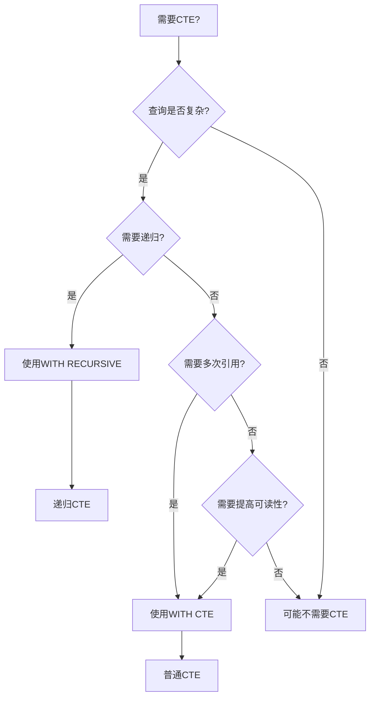
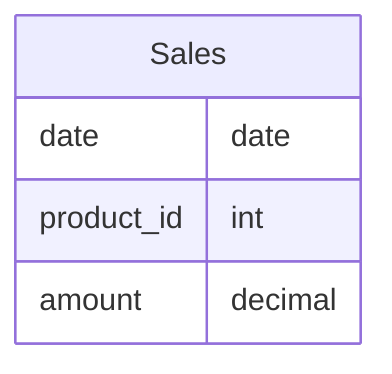
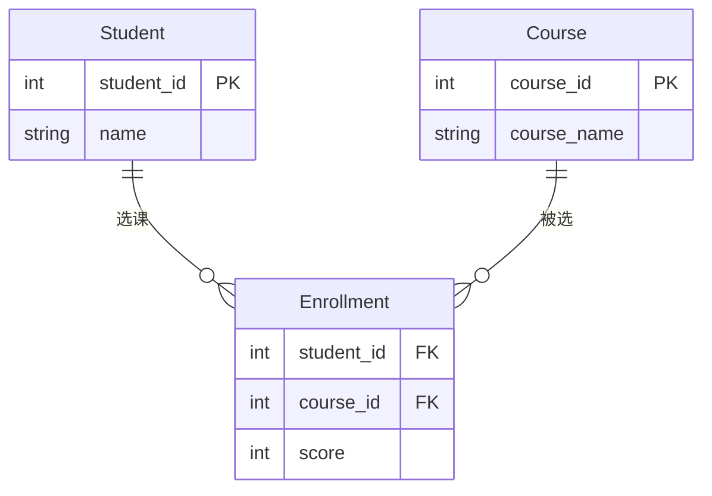
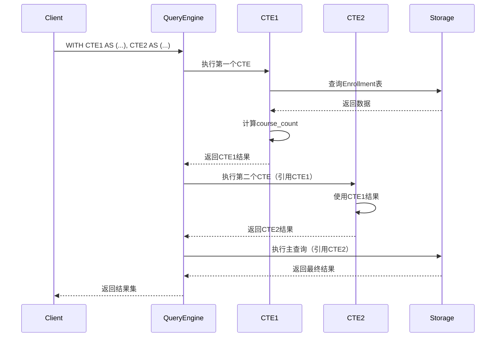

# 公共表表达式(CTE)

> **创建日期**：2025-01-15
> **最后更新**：2025-01-16
> **版本**：v1.0.0
> **难度**：⭐⭐⭐
> **应用场景**：复杂查询简化、递归查询、查询可读性提升

---

## 📋 目录

- [公共表表达式(CTE)](#公共表表达式cte)
  - [📋 目录](#-目录)
  - [一、概述](#一概述)
    - [1.0 CTE历史背景](#10-cte历史背景)
    - [1.1 CTE应用场景决策树](#11-cte应用场景决策树)
    - [1.2 CTE vs 子查询对比矩阵](#12-cte-vs-子查询对比矩阵)
  - [二、CTE语法](#二cte语法)
    - [2.1 CTE的形式化定义](#21-cte的形式化定义)
    - [2.2 基本语法](#22-基本语法)
    - [2.3 示例](#23-示例)
  - [三、递归CTE](#三递归cte)
    - [3.1 递归CTE语法](#31-递归cte语法)
    - [3.2 递归CTE示例](#32-递归cte示例)
  - [四、CTE应用场景](#四cte应用场景)
    - [4.1 查询简化](#41-查询简化)
    - [4.1.1 场景示例1：复杂查询简化](#411-场景示例1复杂查询简化)
    - [4.1.2 场景示例2：多步骤数据分析](#412-场景示例2多步骤数据分析)
  - [五、性能考虑](#五性能考虑)
    - [5.1 性能优化](#51-性能优化)
  - [六、完整业务案例：组织架构查询 🆕](#六完整业务案例组织架构查询-)
    - [6.1 业务场景描述](#61-业务场景描述)
    - [6.2 案例1：查询员工的完整汇报链](#62-案例1查询员工的完整汇报链)
    - [6.3 案例2：查询管理者的所有下属](#63-案例2查询管理者的所有下属)
    - [6.4 案例3：组织架构完整可视化](#64-案例3组织架构完整可视化)
    - [6.5 性能优化与执行计划分析](#65-性能优化与执行计划分析)
    - [6.6 递归终止条件形式化证明](#66-递归终止条件形式化证明)
  - [七、PostgreSQL 18 CTE新特性 🆕](#七postgresql-18-cte新特性-)
    - [7.1 MATERIALIZED控制](#71-materialized控制)
    - [7.2 SEARCH和CYCLE子句（SQL:2023）](#72-search和cycle子句sql2023)
  - [八、SQLite 3.45+ CTE特性 🆕](#八sqlite-345-cte特性-)
    - [8.1 递归查询基本用法](#81-递归查询基本用法)
    - [8.2 WITH子句的多CTE用法](#82-with子句的多cte用法)
  - [九、相关资源](#九相关资源)
    - [相关文档](#相关文档)
    - [外部资源](#外部资源)

---

## 一、概述

**公共表表达式（CTE, Common Table Expression）**是SQL:1999引入的特性，用于定义临时的命名结果集。

**CTE特点**：

- 提高查询可读性
- 支持递归查询
- 可以多次引用

### 1.0 CTE历史背景

**CTE的发展历程**：

- **SQL:1999**：正式引入CTE（WITH子句），包括普通CTE和递归CTE（WITH RECURSIVE）
- **SQL:2003**：增强了CTE的功能，改进了递归CTE的语义
- **SQL:2008**：进一步完善了CTE的语法和性能优化
- **SQL:2011**：增强了CTE在复杂查询中的应用
- **SQL:2016**：改进了CTE的性能优化支持
- **SQL:2023**：进一步完善了CTE的语法和功能

**CTE的设计动机**：

CTE的设计是为了解决传统SQL在复杂查询中的局限性：

1. **查询可读性问题**：复杂的嵌套子查询难以理解和维护
2. **代码重复问题**：同一个子查询在查询中多次出现，导致代码重复
3. **递归查询需求**：需要处理层次结构和图数据，传统SQL难以实现
4. **查询组织问题**：需要更好的方式组织复杂查询的逻辑

**CTE与关系模型的关系**：

CTE可以看作是关系代数中"临时关系"概念的SQL实现。在关系代数中，我们可以定义中间关系并在后续操作中使用，CTE提供了类似的机制，允许在SQL查询中定义临时关系并在查询中引用。

### 1.1 CTE应用场景决策树



### 1.2 CTE vs 子查询对比矩阵

| 特性 | CTE | 子查询 | 视图 | 临时表 |
|------|-----|--------|------|--------|
| **可读性** | ⭐⭐⭐⭐⭐ | ⭐⭐ | ⭐⭐⭐⭐ | ⭐⭐⭐ |
| **性能** | ⭐⭐⭐⭐ | ⭐⭐⭐ | ⭐⭐⭐⭐ | ⭐⭐⭐⭐⭐ |
| **递归支持** | ✅ | ❌ | ❌ | ⚠️ |
| **作用域** | 单查询 | 单查询 | 全局 | 会话 |
| **可维护性** | ⭐⭐⭐⭐⭐ | ⭐⭐ | ⭐⭐⭐⭐ | ⭐⭐⭐ |

---

## 二、CTE语法

### 2.1 CTE的形式化定义

**CTE的BNF语法定义**（基于SQL:1999标准）：

```bnf
<with clause> ::=
    WITH [ RECURSIVE ] <with list>

<with list> ::=
    <with list element> [ { <comma> <with list element> }... ]

<with list element> ::=
    <query name> [ <left paren> <with column list> <right paren> ]
    AS <left paren> <query expression> <right paren>

<with column list> ::=
    <column name list>

<query name> ::=
    <identifier>
```

**CTE的语义定义**：

对于CTE `WITH cte_name AS (Q)`，CTE定义了一个临时关系$R_{cte}$，其中：

- $R_{cte}$是查询表达式$Q$的结果关系
- $R_{cte}$的作用域是包含该CTE的查询表达式
- 在查询表达式中，可以通过名称$cte\_name$引用$R_{cte}$

**递归CTE的语义定义**：

对于递归CTE `WITH RECURSIVE cte_name AS (Q)`，递归CTE定义了一个递归关系$R_{rec}$，其中：

- $R_{rec}$是递归查询表达式$Q$的固定点（fixed point）
- 递归查询表达式$Q$通常包含：
  - 基础查询（base case）：$Q_{base}$
  - 递归查询（recursive case）：$Q_{rec}$，引用$cte\_name$
- $R_{rec} = \mu X. (Q_{base} \cup Q_{rec}(X))$，其中$\mu$表示最小固定点操作符

### 2.2 基本语法

**CTE语法**：

```sql
WITH cte_name AS (
    SELECT ...
)
SELECT * FROM cte_name;
```

### 2.3 示例

**示例**：

```sql
WITH high_scores AS (
    SELECT * FROM Scores WHERE score > 90
)
SELECT * FROM high_scores;
```

---

## 三、递归CTE

### 3.1 递归CTE语法

**递归CTE**：

```sql
WITH RECURSIVE cte_name AS (
    -- 基础查询
    SELECT ...
    UNION ALL
    -- 递归查询
    SELECT ... FROM cte_name WHERE ...
)
SELECT * FROM cte_name;
```

### 3.2 递归CTE示例

**示例**：

```sql
WITH RECURSIVE hierarchy AS (
    SELECT id, name, parent_id, 0 as level
    FROM Employees WHERE parent_id IS NULL
    UNION ALL
    SELECT e.id, e.name, e.parent_id, h.level + 1
    FROM Employees e
    JOIN hierarchy h ON e.parent_id = h.id
)
SELECT * FROM hierarchy;
```

---

## 四、CTE应用场景

### 4.1 查询简化

### 4.1.1 场景示例1：复杂查询简化

**业务需求**：查询销售额超过10000的月份，并计算同比增长率。

**数据模型**：



**CTE查询实现**：

```sql
WITH monthly_sales AS (
    SELECT
        DATE_TRUNC('month', date) as month,
        SUM(amount) as total
    FROM Sales
    GROUP BY DATE_TRUNC('month', date)
),
high_sales_months AS (
    SELECT
        month,
        total,
        LAG(total, 12) OVER (ORDER BY month) as prev_year_total
    FROM monthly_sales
    WHERE total > 10000
)
SELECT
    month,
    total,
    prev_year_total,
    (total - prev_year_total) * 100.0 / prev_year_total as yoy_growth
FROM high_sales_months
ORDER BY month;
```

### 4.1.2 场景示例2：多步骤数据分析

**业务需求**：分析学生选课情况，找出选课数量最多的学生及其选课详情。

**数据模型**：



**多步骤CTE查询实现**：

```sql
-- 步骤1：统计每个学生的选课数量
WITH student_course_count AS (
    SELECT
        student_id,
        COUNT(*) as course_count
    FROM Enrollment
    GROUP BY student_id
),
-- 步骤2：找出选课数量最多的学生
top_students AS (
    SELECT student_id
    FROM student_course_count
    WHERE course_count = (SELECT MAX(course_count) FROM student_course_count)
)
-- 步骤3：查询这些学生的选课详情
SELECT
    s.name,
    c.course_name,
    e.score
FROM top_students ts
JOIN Student s ON ts.student_id = s.student_id
JOIN Enrollment e ON s.student_id = e.student_id
JOIN Course c ON e.course_id = c.course_id
ORDER BY s.name, e.score DESC;
```

**CTE执行流程时序图**：



---

## 五、性能考虑

### 5.1 性能优化

**性能考虑**：

1. CTE可能被物化
2. 递归CTE需要注意终止条件
3. 合理使用索引

---

## 六、完整业务案例：组织架构查询 🆕

### 6.1 业务场景描述

**背景**：企业需要查询组织架构信息，包括：

- 员工的完整汇报链（从员工到CEO）
- 某管理者下属的所有员工（直接+间接）
- 组织层级深度统计

**数据模型**：

```sql
-- PostgreSQL 18 / SQLite 3.45+ 通用
CREATE TABLE employees (
    emp_id      INTEGER PRIMARY KEY,
    emp_name    TEXT NOT NULL,
    title       TEXT NOT NULL,
    manager_id  INTEGER REFERENCES employees(emp_id),
    salary      DECIMAL(10,2),
    hire_date   DATE
);

-- 测试数据
INSERT INTO employees VALUES
(1, '张总', 'CEO', NULL, 500000, '2010-01-01'),
(2, '李副总', 'VP Engineering', 1, 300000, '2012-03-15'),
(3, '王副总', 'VP Sales', 1, 280000, '2013-06-20'),
(4, '赵经理', 'Engineering Manager', 2, 150000, '2015-09-01'),
(5, '钱经理', 'Sales Manager', 3, 140000, '2016-02-10'),
(6, '孙工程师', 'Senior Engineer', 4, 80000, '2018-07-15'),
(7, '周工程师', 'Engineer', 4, 60000, '2020-03-01'),
(8, '吴销售', 'Sales Rep', 5, 50000, '2021-01-15'),
(9, '郑工程师', 'Junior Engineer', 6, 45000, '2023-06-01');
```

### 6.2 案例1：查询员工的完整汇报链

**需求**：给定员工ID，查询从该员工到CEO的完整汇报链。

**形式化定义**：

```text
定义：汇报链函数 ReportChain
──────────────────────────────────────────────────
ReportChain(emp_id) =
    {emp_id} ∪
    (IF manager_id(emp_id) ≠ NULL
     THEN ReportChain(manager_id(emp_id))
     ELSE ∅)

终止条件：manager_id = NULL (到达CEO)
```

**PostgreSQL 18 实现**：

```sql
-- PostgreSQL 18: 查询员工9(郑工程师)的完整汇报链
WITH RECURSIVE report_chain AS (
    -- 锚定成员：起始员工
    SELECT
        emp_id,
        emp_name,
        title,
        manager_id,
        1 AS level,
        ARRAY[emp_name] AS path,
        emp_name::TEXT AS path_string
    FROM employees
    WHERE emp_id = 9  -- 起始员工ID

    UNION ALL

    -- 递归成员：沿manager_id向上遍历
    SELECT
        e.emp_id,
        e.emp_name,
        e.title,
        e.manager_id,
        rc.level + 1,
        rc.path || e.emp_name,
        rc.path_string || ' → ' || e.emp_name
    FROM employees e
    INNER JOIN report_chain rc ON e.emp_id = rc.manager_id
)
SELECT
    level AS "层级",
    emp_name AS "姓名",
    title AS "职位",
    path_string AS "汇报路径"
FROM report_chain
ORDER BY level;

/*
结果:
 层级 |   姓名    |       职位        |              汇报路径
------+-----------+-------------------+--------------------------------------
    1 | 郑工程师  | Junior Engineer   | 郑工程师
    2 | 孙工程师  | Senior Engineer   | 郑工程师 → 孙工程师
    3 | 赵经理    | Engineering Manager| 郑工程师 → 孙工程师 → 赵经理
    4 | 李副总    | VP Engineering    | 郑工程师 → 孙工程师 → 赵经理 → 李副总
    5 | 张总      | CEO               | 郑工程师 → 孙工程师 → 赵经理 → 李副总 → 张总
*/
```

**SQLite 3.45+ 实现**：

```sql
-- SQLite 3.45+: 路径使用字符串拼接（无ARRAY类型）
WITH RECURSIVE report_chain AS (
    SELECT
        emp_id,
        emp_name,
        title,
        manager_id,
        1 AS level,
        emp_name AS path_string
    FROM employees
    WHERE emp_id = 9

    UNION ALL

    SELECT
        e.emp_id,
        e.emp_name,
        e.title,
        e.manager_id,
        rc.level + 1,
        rc.path_string || ' → ' || e.emp_name
    FROM employees e
    INNER JOIN report_chain rc ON e.emp_id = rc.manager_id
)
SELECT * FROM report_chain ORDER BY level;
```

### 6.3 案例2：查询管理者的所有下属

**需求**：给定管理者ID，查询其所有直接和间接下属。

**形式化定义**：

```text
定义：下属集合函数 Subordinates
──────────────────────────────────────────────────
Subordinates(mgr_id) =
    DirectReports(mgr_id) ∪
    ⋃{Subordinates(emp_id) | emp_id ∈ DirectReports(mgr_id)}

其中：DirectReports(mgr_id) = {e | e.manager_id = mgr_id}

定理：递归终止性
──────────────────────────────────────────────────
由于组织架构是有向无环图(DAG)，递归必然终止。
证明：每次递归深度增加1，组织层级有上界N，故最多N次递归。
```

**PostgreSQL 18 实现（含统计）**：

```sql
-- PostgreSQL 18: 查询李副总(emp_id=2)的所有下属
WITH RECURSIVE subordinates AS (
    -- 锚定成员：直接下属
    SELECT
        emp_id,
        emp_name,
        title,
        salary,
        manager_id,
        1 AS depth
    FROM employees
    WHERE manager_id = 2  -- 李副总的ID

    UNION ALL

    -- 递归成员：间接下属
    SELECT
        e.emp_id,
        e.emp_name,
        e.title,
        e.salary,
        e.manager_id,
        s.depth + 1
    FROM employees e
    INNER JOIN subordinates s ON e.manager_id = s.emp_id
)
SELECT
    emp_id,
    emp_name,
    title,
    salary,
    depth AS "层级深度"
FROM subordinates
ORDER BY depth, emp_name;

-- 汇总统计
WITH RECURSIVE subordinates AS (
    SELECT emp_id, emp_name, salary, 1 AS depth
    FROM employees WHERE manager_id = 2
    UNION ALL
    SELECT e.emp_id, e.emp_name, e.salary, s.depth + 1
    FROM employees e
    INNER JOIN subordinates s ON e.manager_id = s.emp_id
)
SELECT
    COUNT(*) AS "下属总数",
    MAX(depth) AS "最大层级深度",
    SUM(salary) AS "下属薪资总和",
    ROUND(AVG(salary), 2) AS "下属平均薪资"
FROM subordinates;

/*
结果:
 下属总数 | 最大层级深度 | 下属薪资总和 | 下属平均薪资
----------+--------------+--------------+--------------
        4 |            3 |    245000.00 |     61250.00
*/
```

### 6.4 案例3：组织架构完整可视化

**PostgreSQL 18 实现（树形展示）**：

```sql
-- PostgreSQL 18: 完整组织架构树形展示
WITH RECURSIVE org_tree AS (
    -- CEO作为根节点
    SELECT
        emp_id,
        emp_name,
        title,
        manager_id,
        0 AS level,
        emp_name::TEXT AS tree_path,
        LPAD('', 0) || emp_name AS tree_display
    FROM employees
    WHERE manager_id IS NULL

    UNION ALL

    SELECT
        e.emp_id,
        e.emp_name,
        e.title,
        e.manager_id,
        ot.level + 1,
        ot.tree_path || '/' || e.emp_name,
        LPAD('', (ot.level + 1) * 4) || '├── ' || e.emp_name
    FROM employees e
    INNER JOIN org_tree ot ON e.manager_id = ot.emp_id
)
SELECT
    tree_display AS "组织架构",
    title AS "职位",
    level AS "层级"
FROM org_tree
ORDER BY tree_path;

/*
结果:
         组织架构          |        职位         | 层级
---------------------------+---------------------+------
 张总                      | CEO                 |    0
     ├── 李副总            | VP Engineering      |    1
         ├── 赵经理        | Engineering Manager |    2
             ├── 孙工程师  | Senior Engineer     |    3
                 ├── 郑工程师 | Junior Engineer  |    4
             ├── 周工程师  | Engineer            |    3
     ├── 王副总            | VP Sales            |    1
         ├── 钱经理        | Sales Manager       |    2
             ├── 吴销售    | Sales Rep           |    3
*/
```

### 6.5 性能优化与执行计划分析

**PostgreSQL 18 执行计划分析**：

```sql
-- 查看递归CTE执行计划
EXPLAIN (ANALYZE, BUFFERS, FORMAT TEXT)
WITH RECURSIVE subordinates AS (
    SELECT emp_id, emp_name, manager_id, 1 AS depth
    FROM employees WHERE manager_id = 2
    UNION ALL
    SELECT e.emp_id, e.emp_name, e.manager_id, s.depth + 1
    FROM employees e
    INNER JOIN subordinates s ON e.manager_id = s.emp_id
)
SELECT * FROM subordinates;

/*
执行计划解读:
──────────────────────────────────────────────────
1. CTE Scan: 扫描递归CTE结果
2. WorkTable Scan: 工作表扫描（存储中间递归结果）
3. Recursive Union: 合并锚定成员和递归成员
4. Index Scan: 使用manager_id索引加速连接

优化建议:
- 创建 manager_id 索引: CREATE INDEX idx_emp_manager ON employees(manager_id);
- PostgreSQL 18 自动检测递归深度，避免无限循环
*/
```

**SQLite 优化**：

```sql
-- SQLite: 创建索引优化递归查询
CREATE INDEX idx_emp_manager ON employees(manager_id);

-- SQLite 递归查询限制设置
-- 默认最大递归深度1000，可通过PRAGMA调整
PRAGMA recursive_triggers = ON;
```

### 6.6 递归终止条件形式化证明

```text
定理：组织架构递归查询的终止性
──────────────────────────────────────────────────
给定组织架构表 E = {(emp_id, manager_id, ...)}

前提条件:
  P1: ∀ e ∈ E: e.manager_id ≠ e.emp_id (无自引用)
  P2: ¬∃ cycle ⊆ E: 形成manager_id的环 (无环)
  P3: |E| = n < ∞ (员工数有限)

证明递归终止:
  设 depth(e) = 递归到达e时的深度

  基础情况: depth(anchor) = 1
  递归情况: depth(e) = depth(parent(e)) + 1

  由P1和P2，manager_id关系构成有向无环图(DAG)
  由P3，DAG的最长路径 ≤ n

  ∴ 递归深度 ≤ n，递归必然终止 ∎

PostgreSQL 18 实现保护:
  - 默认递归深度无限制，但通过工作内存限制间接控制
  - 可使用 CYCLE 子句检测循环（SQL:2023标准）

SQLite 实现保护:
  - 默认最大递归深度 1,000,000
  - 可通过 sqlite3_limit(SQLITE_LIMIT_RECURSIVE_DEPTH, N) 调整
```

---

## 七、PostgreSQL 18 CTE新特性 🆕

### 7.1 MATERIALIZED控制

```sql
-- PostgreSQL 18: 显式控制CTE物化行为
WITH monthly_stats AS MATERIALIZED (
    -- 强制物化：CTE结果存储在临时空间，适合多次引用
    SELECT DATE_TRUNC('month', hire_date) AS month, COUNT(*) AS cnt
    FROM employees
    GROUP BY 1
)
SELECT * FROM monthly_stats WHERE cnt > 1;

WITH monthly_stats AS NOT MATERIALIZED (
    -- 不物化：CTE内联到主查询，适合单次引用
    SELECT DATE_TRUNC('month', hire_date) AS month, COUNT(*) AS cnt
    FROM employees
    GROUP BY 1
)
SELECT * FROM monthly_stats WHERE cnt > 1;
```

### 7.2 SEARCH和CYCLE子句（SQL:2023）

```sql
-- PostgreSQL 18: SEARCH子句控制遍历顺序
WITH RECURSIVE org_tree AS (
    SELECT emp_id, emp_name, manager_id, ARRAY[emp_id] AS path
    FROM employees WHERE manager_id IS NULL
    UNION ALL
    SELECT e.emp_id, e.emp_name, e.manager_id, ot.path || e.emp_id
    FROM employees e JOIN org_tree ot ON e.manager_id = ot.emp_id
)
SEARCH DEPTH FIRST BY emp_id SET ordercol  -- 深度优先
SELECT * FROM org_tree ORDER BY ordercol;

-- PostgreSQL 18: CYCLE子句检测循环
WITH RECURSIVE traverse AS (
    SELECT emp_id, manager_id, ARRAY[emp_id] AS path, false AS is_cycle
    FROM employees WHERE emp_id = 1
    UNION ALL
    SELECT e.emp_id, e.manager_id, t.path || e.emp_id, e.emp_id = ANY(t.path)
    FROM employees e JOIN traverse t ON e.manager_id = t.emp_id
    WHERE NOT t.is_cycle
)
CYCLE emp_id SET is_cycle USING path
SELECT * FROM traverse WHERE NOT is_cycle;
```

---

## 八、SQLite 3.45+ CTE特性 🆕

### 8.1 递归查询基本用法

```sql
-- SQLite 3.45+: 递归CTE完整示例
WITH RECURSIVE
  cnt(x) AS (
    SELECT 1              -- 锚定成员
    UNION ALL
    SELECT x+1 FROM cnt   -- 递归成员
    WHERE x < 10          -- 终止条件
  )
SELECT x FROM cnt;

-- SQLite: 生成日期序列
WITH RECURSIVE dates(d) AS (
    SELECT date('2025-01-01')
    UNION ALL
    SELECT date(d, '+1 day') FROM dates WHERE d < '2025-01-31'
)
SELECT d AS "日期", strftime('%w', d) AS "星期" FROM dates;
```

### 8.2 WITH子句的多CTE用法

```sql
-- SQLite 3.45+: 多个CTE协作
WITH
    dept_count AS (
        SELECT manager_id, COUNT(*) AS direct_reports
        FROM employees
        WHERE manager_id IS NOT NULL
        GROUP BY manager_id
    ),
    high_performers AS (
        SELECT emp_id, emp_name, salary
        FROM employees
        WHERE salary > (SELECT AVG(salary) FROM employees)
    )
SELECT
    e.emp_name,
    e.title,
    COALESCE(dc.direct_reports, 0) AS "直接下属数",
    CASE WHEN hp.emp_id IS NOT NULL THEN '是' ELSE '否' END AS "高绩效"
FROM employees e
LEFT JOIN dept_count dc ON e.emp_id = dc.manager_id
LEFT JOIN high_performers hp ON e.emp_id = hp.emp_id
ORDER BY e.salary DESC;
```

---

## 九、相关资源

### 相关文档

- [递归查询详解](./05.03-递归查询详解.md) - 递归查询深入分析
- [窗口函数详解](./05.01-窗口函数详解.md) - 窗口函数与CTE配合
- [01.06-数学基础到SQL因果链](../01-理论基础/01.06-数学基础到SQL因果链.md) - 递归的数学基础
- [09.07-决策推理规则库](../09-整合资源/09.07-决策推理规则库.md) - CTE选择决策规则

### 外部资源

- [PostgreSQL 18 WITH Queries](https://www.postgresql.org/docs/current/queries-with.html)
- [SQLite WITH Clause](https://www.sqlite.org/lang_with.html)

---

**维护者**: SQL Standards Team
**最后更新**: 2025-12-01
