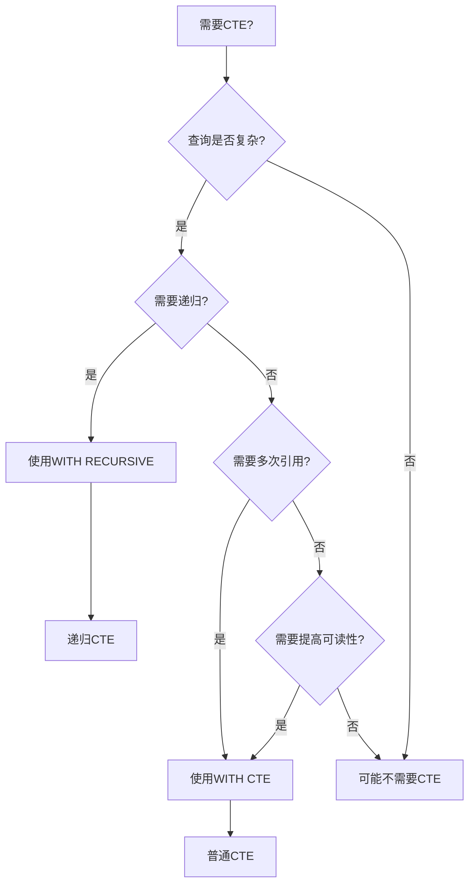
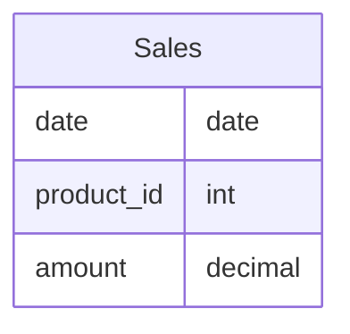
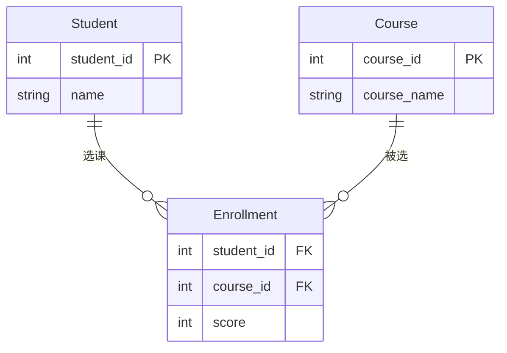
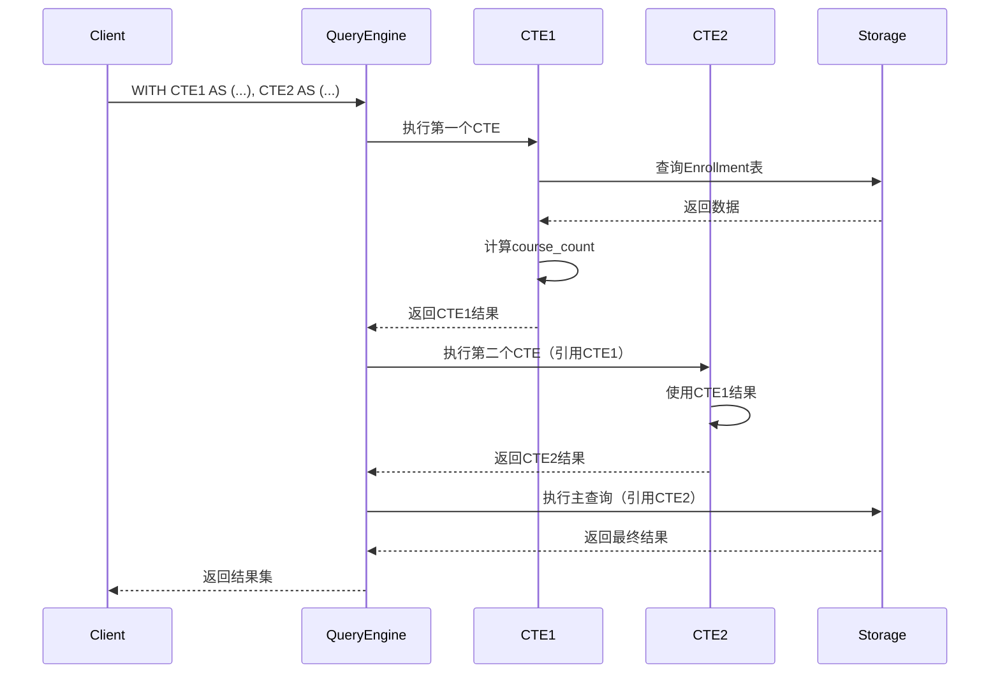

# 公共表表达式(CTE)

> **创建日期**：2025-01-15
> **最后更新**：2025-01-15
> **版本**：v1.0.0
> **难度**：⭐⭐⭐
> **应用场景**：复杂查询简化、递归查询、查询可读性提升

---

## 📋 目录

- [公共表表达式(CTE)](#公共表表达式cte)
  - [📋 目录](#-目录)
  - [一、概述](#一概述)
    - [1.1 CTE应用场景决策树](#11-cte应用场景决策树)
    - [1.2 CTE vs 子查询对比矩阵](#12-cte-vs-子查询对比矩阵)
  - [二、CTE语法](#二cte语法)
    - [2.1 基本语法](#21-基本语法)
    - [2.2 示例](#22-示例)
  - [三、递归CTE](#三递归cte)
    - [3.1 递归CTE语法](#31-递归cte语法)
    - [3.2 递归CTE示例](#32-递归cte示例)
  - [四、CTE应用场景](#四cte应用场景)
    - [4.1 查询简化](#41-查询简化)
    - [4.1.1 场景示例1：复杂查询简化](#411-场景示例1复杂查询简化)
    - [4.1.2 场景示例2：多步骤数据分析](#412-场景示例2多步骤数据分析)
  - [五、性能考虑](#五性能考虑)
    - [5.1 性能优化](#51-性能优化)
  - [六、相关资源](#六相关资源)
    - [相关文档](#相关文档)

---

## 一、概述

**公共表表达式（CTE, Common Table Expression）**是SQL:1999引入的特性，用于定义临时的命名结果集。

**CTE特点**：

- 提高查询可读性
- 支持递归查询
- 可以多次引用

### 1.1 CTE应用场景决策树



### 1.2 CTE vs 子查询对比矩阵

| 特性 | CTE | 子查询 | 视图 | 临时表 |
|------|-----|--------|------|--------|
| **可读性** | ⭐⭐⭐⭐⭐ | ⭐⭐ | ⭐⭐⭐⭐ | ⭐⭐⭐ |
| **性能** | ⭐⭐⭐⭐ | ⭐⭐⭐ | ⭐⭐⭐⭐ | ⭐⭐⭐⭐⭐ |
| **递归支持** | ✅ | ❌ | ❌ | ⚠️ |
| **作用域** | 单查询 | 单查询 | 全局 | 会话 |
| **可维护性** | ⭐⭐⭐⭐⭐ | ⭐⭐ | ⭐⭐⭐⭐ | ⭐⭐⭐ |

---

## 二、CTE语法

### 2.1 基本语法

**CTE语法**：

```sql
WITH cte_name AS (
    SELECT ...
)
SELECT * FROM cte_name;
```

### 2.2 示例

**示例**：

```sql
WITH high_scores AS (
    SELECT * FROM Scores WHERE score > 90
)
SELECT * FROM high_scores;
```

---

## 三、递归CTE

### 3.1 递归CTE语法

**递归CTE**：

```sql
WITH RECURSIVE cte_name AS (
    -- 基础查询
    SELECT ...
    UNION ALL
    -- 递归查询
    SELECT ... FROM cte_name WHERE ...
)
SELECT * FROM cte_name;
```

### 3.2 递归CTE示例

**示例**：

```sql
WITH RECURSIVE hierarchy AS (
    SELECT id, name, parent_id, 0 as level
    FROM Employees WHERE parent_id IS NULL
    UNION ALL
    SELECT e.id, e.name, e.parent_id, h.level + 1
    FROM Employees e
    JOIN hierarchy h ON e.parent_id = h.id
)
SELECT * FROM hierarchy;
```

---

## 四、CTE应用场景

### 4.1 查询简化

### 4.1.1 场景示例1：复杂查询简化

**业务需求**：查询销售额超过10000的月份，并计算同比增长率。

**数据模型**：



**CTE查询实现**：

```sql
WITH monthly_sales AS (
    SELECT
        DATE_TRUNC('month', date) as month,
        SUM(amount) as total
    FROM Sales
    GROUP BY DATE_TRUNC('month', date)
),
high_sales_months AS (
    SELECT
        month,
        total,
        LAG(total, 12) OVER (ORDER BY month) as prev_year_total
    FROM monthly_sales
    WHERE total > 10000
)
SELECT
    month,
    total,
    prev_year_total,
    (total - prev_year_total) * 100.0 / prev_year_total as yoy_growth
FROM high_sales_months
ORDER BY month;
```

### 4.1.2 场景示例2：多步骤数据分析

**业务需求**：分析学生选课情况，找出选课数量最多的学生及其选课详情。

**数据模型**：



**多步骤CTE查询实现**：

```sql
-- 步骤1：统计每个学生的选课数量
WITH student_course_count AS (
    SELECT
        student_id,
        COUNT(*) as course_count
    FROM Enrollment
    GROUP BY student_id
),
-- 步骤2：找出选课数量最多的学生
top_students AS (
    SELECT student_id
    FROM student_course_count
    WHERE course_count = (SELECT MAX(course_count) FROM student_course_count)
)
-- 步骤3：查询这些学生的选课详情
SELECT
    s.name,
    c.course_name,
    e.score
FROM top_students ts
JOIN Student s ON ts.student_id = s.student_id
JOIN Enrollment e ON s.student_id = e.student_id
JOIN Course c ON e.course_id = c.course_id
ORDER BY s.name, e.score DESC;
```

**CTE执行流程时序图**：



---

## 五、性能考虑

### 5.1 性能优化

**性能考虑**：

1. CTE可能被物化
2. 递归CTE需要注意终止条件
3. 合理使用索引

---

## 六、相关资源

### 相关文档

- [递归查询详解](./05.03-递归查询详解.md) - 递归查询
- [窗口函数详解](./05.01-窗口函数详解.md) - 窗口函数

---

**维护者**: SQL Standards Team
**最后更新**: 2025-01-15
