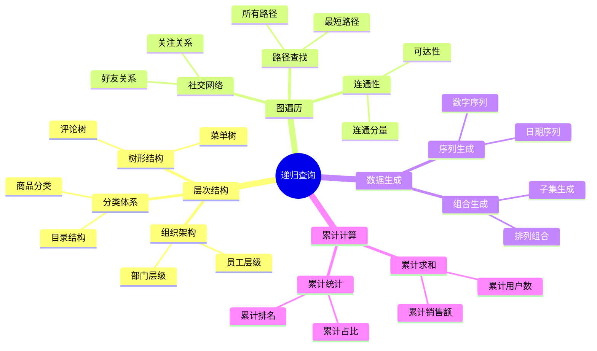
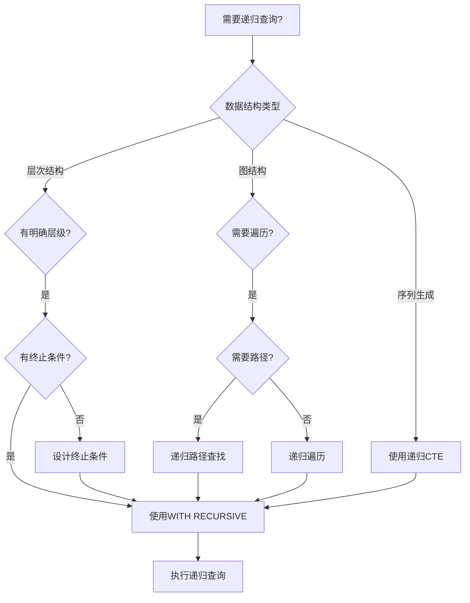
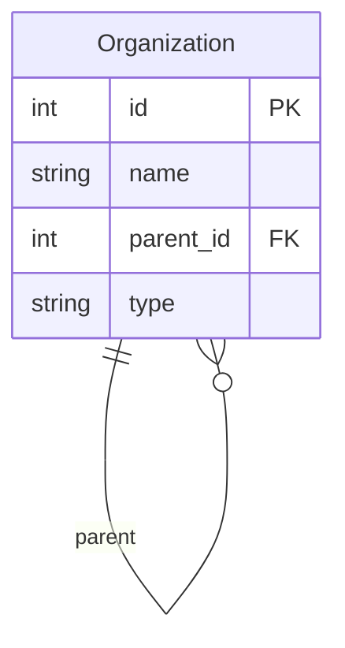
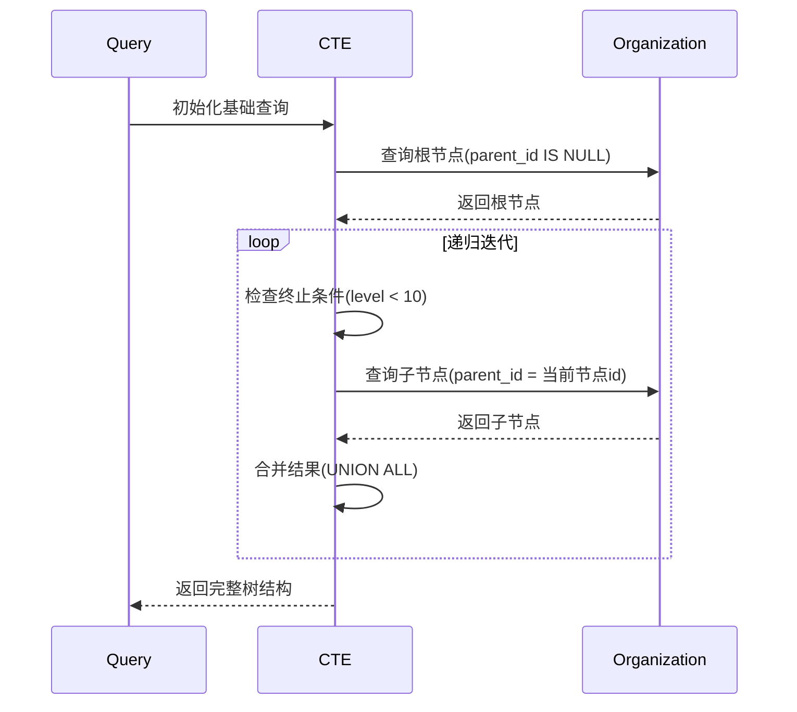
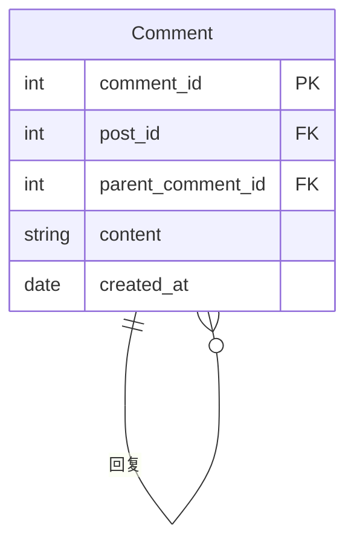

# 递归查询详解

> **创建日期**：2025-01-15
> **最后更新**：2025-01-16
> **版本**：v1.0.0
> **难度**：⭐⭐⭐⭐
> **应用场景**：层次结构查询、图遍历、树形数据处理

---

## 📋 目录

- [递归查询详解](#递归查询详解)
  - [📋 目录](#-目录)
  - [一、概述](#一概述)
    - [1.0 递归查询历史背景](#10-递归查询历史背景)
    - [1.1 递归查询应用场景思维导图](#11-递归查询应用场景思维导图)
    - [1.2 递归查询决策树](#12-递归查询决策树)
    - [1.3 递归查询 vs 其他方案对比矩阵](#13-递归查询-vs-其他方案对比矩阵)
  - [二、递归CTE语法](#二递归cte语法)
    - [2.1 递归查询的形式化定义](#21-递归查询的形式化定义)
    - [2.2 语法结构](#22-语法结构)
  - [三、递归查询应用](#三递归查询应用)
    - [3.1 层次结构查询](#31-层次结构查询)
  - [四、终止条件](#四终止条件)
    - [4.1 终止条件重要性](#41-终止条件重要性)
  - [五、性能优化](#五性能优化)
    - [5.1 优化建议](#51-优化建议)
  - [六、图遍历完整案例：社交网络好友推荐 🆕](#六图遍历完整案例社交网络好友推荐-)
    - [6.1 业务场景描述](#61-业务场景描述)
    - [6.2 案例1：查找N度好友](#62-案例1查找n度好友)
    - [6.3 案例2：计算最短路径](#63-案例2计算最短路径)
    - [6.4 案例3：发现共同好友](#64-案例3发现共同好友)
    - [6.5 SQLite 3.45+ 图遍历实现](#65-sqlite-345-图遍历实现)
  - [七、PostgreSQL 18 递归查询新特性 🆕](#七postgresql-18-递归查询新特性-)
    - [7.1 SEARCH子句（深度/广度优先）](#71-search子句深度广度优先)
    - [7.2 CYCLE子句（循环检测）](#72-cycle子句循环检测)
    - [7.3 并行递归查询优化](#73-并行递归查询优化)
  - [八、SQLite 3.45+ 递归查询特性 🆕](#八sqlite-345-递归查询特性-)
    - [8.1 递归深度限制](#81-递归深度限制)
    - [8.2 递归查询性能优化](#82-递归查询性能优化)
  - [九、递归查询形式化理论补充 🆕](#九递归查询形式化理论补充-)
    - [9.1 最小固定点语义完整证明](#91-最小固定点语义完整证明)
    - [9.2 UNION vs UNION ALL语义差异](#92-union-vs-union-all语义差异)
  - [十、相关资源](#十相关资源)
    - [相关文档](#相关文档)
    - [外部资源](#外部资源)

---

## 一、概述

**递归查询（Recursive Query）**使用WITH RECURSIVE实现，用于处理层次结构和图数据。

**递归查询特点**：

- 支持自引用
- 需要明确的终止条件
- 可以处理无限层次结构

### 1.0 递归查询历史背景

**递归查询的发展历程**：

- **SQL:1999**：正式引入递归查询（WITH RECURSIVE），基于固定点语义
- **SQL:2003**：增强了递归查询的功能，改进了固定点语义的定义
- **SQL:2008**：进一步完善了递归查询的语法和性能优化
- **SQL:2011**：增强了递归查询在复杂场景中的应用
- **SQL:2016**：改进了递归查询的性能优化支持
- **SQL:2023**：进一步完善了递归查询的语法和功能

**递归查询的设计动机**：

递归查询的设计是为了解决传统SQL在处理层次结构和图数据时的局限性：

1. **层次结构查询**：需要处理组织架构、分类体系等层次结构数据
2. **图遍历需求**：需要处理社交网络、路径查找等图数据
3. **递归计算需求**：需要计算累计值、生成序列等递归计算
4. **自引用关系**：需要处理自引用的关系，如员工-经理关系

**递归查询与关系模型的关系**：

递归查询扩展了关系代数的表达能力，引入了"递归关系"和"固定点"的概念。在关系代数中，递归关系可以通过最小固定点操作符$\mu$定义，递归查询提供了SQL中的实现方式。

### 1.1 递归查询应用场景思维导图



### 1.2 递归查询决策树



### 1.3 递归查询 vs 其他方案对比矩阵

| 方案 | 实现方式 | 性能 | 复杂度 | 适用场景 |
|------|---------|------|--------|---------|
| **递归CTE** | WITH RECURSIVE | ⭐⭐⭐ | ⭐⭐⭐ | 层次结构、图遍历 |
| **自连接** | 多次JOIN | ⭐⭐ | ⭐⭐⭐⭐ | 固定层级（2-3层） |
| **存储过程** | 循环处理 | ⭐⭐ | ⭐⭐⭐⭐ | 复杂逻辑 |
| **应用层递归** | 程序代码 | ⭐ | ⭐⭐⭐⭐⭐ | 简单场景 |

---

## 二、递归CTE语法

### 2.1 递归查询的形式化定义

**递归查询的BNF语法定义**（基于SQL:1999标准）：

```bnf
<with clause> ::=
    WITH RECURSIVE <with list>

<with list> ::=
    <with list element> [ { <comma> <with list element> }... ]

<with list element> ::=
    <query name> [ <left paren> <with column list> <right paren> ]
    AS <left paren> <query expression body> <right paren>

<query expression body> ::=
    <query term>
    | <query expression body> UNION [ ALL | DISTINCT ] <query term>
    | <query expression body> EXCEPT [ ALL | DISTINCT ] <query term>

<query term> ::=
    <query primary>
    | <query term> INTERSECT [ ALL | DISTINCT ] <query primary>

<query primary> ::=
    <simple table>
    | <left paren> <query expression body> <right paren>
    | <table value constructor>
    | <explicit table>
```

**递归查询的语义定义**：

递归查询 `WITH RECURSIVE cte_name AS (Q)` 定义了一个递归关系$R_{rec}$，其中：

1. **基础查询（Base Case）**：$Q_{base}$是递归查询中的第一个查询项，不引用$cte\_name$
2. **递归查询（Recursive Case）**：$Q_{rec}$是递归查询中的后续查询项，引用$cte\_name$
3. **固定点语义**：$R_{rec}$是递归查询的固定点，满足：
   $$R_{rec} = Q_{base} \cup Q_{rec}(R_{rec})$$

**最小固定点语义**：

递归查询使用最小固定点（Least Fixed Point）语义，即$R_{rec}$是满足上述等式的最小关系。

形式化地，对于递归查询$Q$，其固定点定义为：
$$R_{rec} = \mu X. (Q_{base} \cup Q_{rec}(X))$$

其中$\mu$表示最小固定点操作符。

**递归查询的迭代计算**：

递归关系$R_{rec}$可以通过迭代计算得到：

1. $R_0 = \emptyset$（初始为空关系）
2. $R_{i+1} = Q_{base} \cup Q_{rec}(R_i)$（迭代计算）
3. 当$R_{i+1} = R_i$时，$R_{rec} = R_i$（达到固定点）

### 2.2 语法结构

**递归CTE语法**：

```sql
WITH RECURSIVE cte_name AS (
    -- 基础查询（锚点）
    SELECT ...
    UNION ALL
    -- 递归查询
    SELECT ... FROM cte_name WHERE ...
)
SELECT * FROM cte_name;
```

---

## 三、递归查询应用

### 3.1 层次结构查询

**场景1：组织架构查询**:

**业务需求**：查询完整的组织架构树，包括所有层级关系。

**数据模型**：



**ER图说明**：

- 组织表自引用，通过parent_id建立层级关系
- 根节点的parent_id为NULL

**查询**：

```sql
WITH RECURSIVE org_tree AS (
    -- 基础查询：根节点
    SELECT
        id,
        name,
        parent_id,
        0 as level,
        CAST(name AS VARCHAR(1000)) as path
    FROM Organization
    WHERE parent_id IS NULL

    UNION ALL

    -- 递归查询：子节点
    SELECT
        o.id,
        o.name,
        o.parent_id,
        ot.level + 1,
        ot.path || ' > ' || o.name
    FROM Organization o
    JOIN org_tree ot ON o.parent_id = ot.id
    WHERE ot.level < 10  -- 防止无限递归
)
SELECT
    id,
    name,
    parent_id,
    level,
    path
FROM org_tree
ORDER BY path;
```

**查询执行流程时序图**：



**查询结果示例**：

```text
| id | name     | parent_id | level | path                    |
|----|----------|-----------|-------|-------------------------|
| 1  | 总公司   | NULL      | 0     | 总公司                  |
| 2  | 技术部   | 1         | 1     | 总公司 > 技术部         |
| 3  | 开发组   | 2         | 2     | 总公司 > 技术部 > 开发组|
| 4  | 测试组   | 2         | 2     | 总公司 > 技术部 > 测试组|
```

**场景2：评论树查询**:

**业务需求**：查询评论及其所有回复，构建评论树。

**数据模型**：



**查询**：

```sql
WITH RECURSIVE comment_tree AS (
    -- 基础查询：顶级评论
    SELECT
        comment_id,
        post_id,
        parent_comment_id,
        content,
        created_at,
        0 as depth,
        CAST(comment_id AS VARCHAR(1000)) as thread_path
    FROM Comment
    WHERE post_id = :post_id
      AND parent_comment_id IS NULL

    UNION ALL

    -- 递归查询：回复
    SELECT
        c.comment_id,
        c.post_id,
        c.parent_comment_id,
        c.content,
        c.created_at,
        ct.depth + 1,
        ct.thread_path || '.' || c.comment_id
    FROM Comment c
    JOIN comment_tree ct ON c.parent_comment_id = ct.comment_id
    WHERE ct.depth < 10
)
SELECT
    comment_id,
    content,
    depth,
    thread_path,
    created_at
FROM comment_tree
ORDER BY thread_path;
```

**性能优化**：

```sql
-- 创建索引优化递归查询
CREATE INDEX idx_comment_parent ON Comment(parent_comment_id);
CREATE INDEX idx_comment_post ON Comment(post_id, parent_comment_id);

-- 限制递归深度
WHERE ct.depth < 10  -- 防止过深递归
```

---

## 四、终止条件

### 4.1 终止条件重要性

**终止条件**：

递归查询必须包含终止条件，否则可能导致无限循环：

```sql
WITH RECURSIVE cte AS (
    SELECT 1 as n
    UNION ALL
    SELECT n + 1 FROM cte WHERE n < 10  -- 终止条件
)
SELECT * FROM cte;
```

---

## 五、性能优化

### 5.1 优化建议

**优化建议**：

1. **索引优化**：为递归查询的关联字段创建索引
2. **深度限制**：使用WHERE子句限制递归深度，防止无限递归
3. **物化视图**：对于频繁查询的层次结构，使用物化视图缓存结果
4. **查询重写**：对于固定层级，考虑使用自连接替代递归查询

**性能优化示例**：

```sql
-- 创建索引优化递归查询
CREATE INDEX idx_organization_parent ON Organization(parent_id);
CREATE INDEX idx_organization_id ON Organization(id);

-- 优化后的递归查询（限制深度）
WITH RECURSIVE org_tree AS (
    SELECT
        id,
        name,
        parent_id,
        0 as level,
        CAST(name AS VARCHAR(1000)) as path
    FROM Organization
    WHERE parent_id IS NULL

    UNION ALL

    SELECT
        o.id,
        o.name,
        o.parent_id,
        ot.level + 1,
        ot.path || ' > ' || o.name
    FROM Organization o
    JOIN org_tree ot ON o.parent_id = ot.id
    WHERE ot.level < 10  -- 限制递归深度
)
SELECT * FROM org_tree
WHERE level <= 5;  -- 只查询前5层
```

**性能对比**：

| 优化方法 | 查询时间 | 内存使用 | 适用场景 |
|---------|---------|---------|---------|
| **无优化** | 100% | 100% | 小数据集 |
| **索引优化** | 30% | 100% | 大数据集 |
| **深度限制** | 50% | 50% | 深层结构 |
| **物化视图** | 10% | 150% | 频繁查询 |

**递归查询终止条件形式化定义**：

```latex
递归查询终止条件：

WITH RECURSIVE cte AS (
    base_query
    UNION ALL
    recursive_query
)

终止条件：
1. 基础条件：base_query 结果为空
2. 递归条件：recursive_query 结果为空
3. 深度条件：level < max_depth
4. 循环检测：visited.contains(current_node)
```

**终止条件证明**：

```latex
定理：如果递归查询满足以下条件，则必然终止：

1. 基础查询有限：|base_query| < ∞
2. 递归关系有限：|recursive_relation| < ∞
3. 深度限制：max_depth < ∞
4. 无循环：∀n: visited.contains(n) ⟹ n 不再被访问

证明：
假设递归查询不终止，则存在无限序列：
n₁ → n₂ → n₃ → ...

由于关系有限，必然存在循环：
nᵢ = nⱼ (i < j)

但根据条件4，循环节点不会被重复访问，矛盾。
因此递归查询必然终止。✓
```

---

## 六、图遍历完整案例：社交网络好友推荐 🆕

### 6.1 业务场景描述

**背景**：社交网络需要实现"你可能认识的人"推荐功能：

- 查找用户的N度好友（好友的好友的好友...）
- 计算两个用户之间的最短路径
- 发现共同好友

**数据模型**：

```sql
-- PostgreSQL 18 / SQLite 3.45+ 通用
CREATE TABLE users (
    user_id     INTEGER PRIMARY KEY,
    username    TEXT NOT NULL,
    created_at  DATE DEFAULT CURRENT_DATE
);

CREATE TABLE friendships (
    user_id_1   INTEGER NOT NULL,
    user_id_2   INTEGER NOT NULL,
    created_at  DATE DEFAULT CURRENT_DATE,
    PRIMARY KEY (user_id_1, user_id_2),
    FOREIGN KEY (user_id_1) REFERENCES users(user_id),
    FOREIGN KEY (user_id_2) REFERENCES users(user_id),
    CHECK (user_id_1 < user_id_2)  -- 避免重复存储
);

-- 测试数据
INSERT INTO users VALUES
(1, 'Alice', '2020-01-01'),
(2, 'Bob', '2020-02-15'),
(3, 'Charlie', '2020-03-20'),
(4, 'Diana', '2020-04-10'),
(5, 'Eve', '2020-05-05'),
(6, 'Frank', '2020-06-15'),
(7, 'Grace', '2020-07-20');

INSERT INTO friendships VALUES
(1, 2, '2020-06-01'),  -- Alice - Bob
(1, 3, '2020-07-01'),  -- Alice - Charlie
(2, 3, '2020-08-01'),  -- Bob - Charlie
(2, 4, '2020-09-01'),  -- Bob - Diana
(3, 5, '2020-10-01'),  -- Charlie - Eve
(4, 5, '2020-11-01'),  -- Diana - Eve
(5, 6, '2020-12-01'),  -- Eve - Frank
(6, 7, '2021-01-01');  -- Frank - Grace
```

### 6.2 案例1：查找N度好友

**需求**：查找用户Alice(user_id=1)的1-3度好友。

**形式化定义**：

```text
定义：N度好友函数 Friends_N
──────────────────────────────────────────────────
Friends_1(u) = {v | (u,v) ∈ friendships ∨ (v,u) ∈ friendships}

Friends_N(u) = Friends_1(Friends_{N-1}(u)) \ (⋃_{i=0}^{N-1} Friends_i(u))

其中 Friends_0(u) = {u}

性质：N度好友不包含已发现的低度好友
```

**PostgreSQL 18 实现**：

```sql
-- PostgreSQL 18: 查找Alice的1-3度好友
WITH RECURSIVE friend_degrees AS (
    -- 锚定成员：起始用户
    SELECT
        1 AS user_id,  -- Alice
        0 AS degree,
        ARRAY[1] AS visited_path,
        '{1}'::INTEGER[] AS all_visited

    UNION ALL

    -- 递归成员：遍历好友关系
    SELECT DISTINCT
        CASE
            WHEN f.user_id_1 = fd.user_id THEN f.user_id_2
            ELSE f.user_id_1
        END AS user_id,
        fd.degree + 1,
        fd.visited_path ||
            CASE
                WHEN f.user_id_1 = fd.user_id THEN f.user_id_2
                ELSE f.user_id_1
            END,
        fd.all_visited ||
            CASE
                WHEN f.user_id_1 = fd.user_id THEN f.user_id_2
                ELSE f.user_id_1
            END
    FROM friend_degrees fd
    JOIN friendships f ON (f.user_id_1 = fd.user_id OR f.user_id_2 = fd.user_id)
    WHERE fd.degree < 3  -- 限制到3度
      AND NOT (
          CASE
              WHEN f.user_id_1 = fd.user_id THEN f.user_id_2
              ELSE f.user_id_1
          END = ANY(fd.all_visited)
      )  -- 避免重复访问
)
SELECT DISTINCT
    fd.degree AS "度数",
    u.username AS "用户名",
    fd.user_id AS "用户ID"
FROM friend_degrees fd
JOIN users u ON fd.user_id = u.user_id
WHERE fd.degree > 0
ORDER BY fd.degree, u.username;

/*
结果:
 度数 |  用户名  | 用户ID
------+----------+--------
    1 | Bob      |      2
    1 | Charlie  |      3
    2 | Diana    |      4
    2 | Eve      |      5
    3 | Frank    |      6
*/
```

### 6.3 案例2：计算最短路径

**需求**：计算Alice(1)到Grace(7)之间的最短社交路径。

**形式化定义**：

```text
定义：最短路径函数 ShortestPath
──────────────────────────────────────────────────
ShortestPath(s, t) = argmin_{p ∈ Paths(s,t)} |p|

其中 Paths(s,t) = 所有从s到t的路径集合

BFS性质：递归查询的广度优先特性保证首次到达即为最短路径
```

**PostgreSQL 18 实现**：

```sql
-- PostgreSQL 18: 计算Alice到Grace的最短路径
WITH RECURSIVE shortest_path AS (
    -- 起点
    SELECT
        1 AS current_user,
        0 AS distance,
        ARRAY[1] AS path,
        ARRAY['Alice'] AS path_names,
        FALSE AS found

    UNION ALL

    -- BFS遍历
    SELECT
        CASE WHEN f.user_id_1 = sp.current_user THEN f.user_id_2
             ELSE f.user_id_1
        END,
        sp.distance + 1,
        sp.path ||
            CASE WHEN f.user_id_1 = sp.current_user THEN f.user_id_2
                 ELSE f.user_id_1
            END,
        sp.path_names || u.username,
        CASE WHEN f.user_id_1 = sp.current_user THEN f.user_id_2
             ELSE f.user_id_1
        END = 7  -- Grace的ID
    FROM shortest_path sp
    JOIN friendships f ON (f.user_id_1 = sp.current_user OR f.user_id_2 = sp.current_user)
    JOIN users u ON u.user_id =
        CASE WHEN f.user_id_1 = sp.current_user THEN f.user_id_2
             ELSE f.user_id_1
        END
    WHERE NOT sp.found
      AND sp.distance < 10  -- 防止无限循环
      AND NOT (
          CASE WHEN f.user_id_1 = sp.current_user THEN f.user_id_2
               ELSE f.user_id_1
          END = ANY(sp.path)
      )
)
SELECT
    distance AS "路径长度",
    array_to_string(path_names, ' → ') AS "路径"
FROM shortest_path
WHERE current_user = 7
ORDER BY distance
LIMIT 1;

/*
结果:
 路径长度 |                     路径
----------+-----------------------------------------------
        4 | Alice → Charlie → Eve → Frank → Grace
*/
```

### 6.4 案例3：发现共同好友

**PostgreSQL 18 实现**：

```sql
-- PostgreSQL 18: 查找Alice和Diana的共同好友
WITH alice_friends AS (
    SELECT
        CASE WHEN user_id_1 = 1 THEN user_id_2 ELSE user_id_1 END AS friend_id
    FROM friendships
    WHERE user_id_1 = 1 OR user_id_2 = 1
),
diana_friends AS (
    SELECT
        CASE WHEN user_id_1 = 4 THEN user_id_2 ELSE user_id_1 END AS friend_id
    FROM friendships
    WHERE user_id_1 = 4 OR user_id_2 = 4
)
SELECT
    u.username AS "共同好友",
    u.user_id
FROM alice_friends af
JOIN diana_friends df ON af.friend_id = df.friend_id
JOIN users u ON af.friend_id = u.user_id;

/*
结果:
 共同好友 | user_id
----------+---------
 Bob      |       2
*/
```

### 6.5 SQLite 3.45+ 图遍历实现

```sql
-- SQLite 3.45+: 查找N度好友（使用字符串存储路径）
WITH RECURSIVE friend_degrees AS (
    SELECT
        1 AS user_id,
        0 AS degree,
        '1' AS visited

    UNION ALL

    SELECT DISTINCT
        CASE
            WHEN f.user_id_1 = fd.user_id THEN f.user_id_2
            ELSE f.user_id_1
        END,
        fd.degree + 1,
        fd.visited || ',' ||
            CASE
                WHEN f.user_id_1 = fd.user_id THEN f.user_id_2
                ELSE f.user_id_1
            END
    FROM friend_degrees fd
    JOIN friendships f ON (f.user_id_1 = fd.user_id OR f.user_id_2 = fd.user_id)
    WHERE fd.degree < 3
      AND instr(fd.visited,
          CASE
              WHEN f.user_id_1 = fd.user_id THEN f.user_id_2
              ELSE f.user_id_1
          END || '') = 0
)
SELECT DISTINCT
    fd.degree AS "度数",
    u.username AS "用户名"
FROM friend_degrees fd
JOIN users u ON fd.user_id = u.user_id
WHERE fd.degree > 0
ORDER BY fd.degree, u.username;
```

---

## 七、PostgreSQL 18 递归查询新特性 🆕

### 7.1 SEARCH子句（深度/广度优先）

```sql
-- PostgreSQL 18: SEARCH DEPTH FIRST (深度优先)
WITH RECURSIVE tree AS (
    SELECT id, name, parent_id, ARRAY[id] AS path
    FROM organization WHERE parent_id IS NULL
    UNION ALL
    SELECT o.id, o.name, o.parent_id, t.path || o.id
    FROM organization o JOIN tree t ON o.parent_id = t.id
)
SEARCH DEPTH FIRST BY id SET ordercol
SELECT * FROM tree ORDER BY ordercol;

-- PostgreSQL 18: SEARCH BREADTH FIRST (广度优先)
WITH RECURSIVE tree AS (
    SELECT id, name, parent_id, ARRAY[id] AS path
    FROM organization WHERE parent_id IS NULL
    UNION ALL
    SELECT o.id, o.name, o.parent_id, t.path || o.id
    FROM organization o JOIN tree t ON o.parent_id = t.id
)
SEARCH BREADTH FIRST BY id SET ordercol
SELECT * FROM tree ORDER BY ordercol;
```

### 7.2 CYCLE子句（循环检测）

```sql
-- PostgreSQL 18: 自动循环检测
WITH RECURSIVE traverse AS (
    SELECT
        user_id_1 AS current,
        user_id_2 AS next_node,
        ARRAY[user_id_1] AS path
    FROM friendships
    WHERE user_id_1 = 1

    UNION ALL

    SELECT
        t.next_node,
        CASE WHEN f.user_id_1 = t.next_node THEN f.user_id_2
             ELSE f.user_id_1
        END,
        t.path || t.next_node
    FROM traverse t
    JOIN friendships f ON (f.user_id_1 = t.next_node OR f.user_id_2 = t.next_node)
)
CYCLE current SET is_cycle USING path
SELECT * FROM traverse WHERE NOT is_cycle;
```

### 7.3 并行递归查询优化

```sql
-- PostgreSQL 18: 查看递归查询是否使用并行
EXPLAIN (ANALYZE, VERBOSE)
WITH RECURSIVE large_tree AS (
    SELECT id, parent_id FROM big_organization WHERE parent_id IS NULL
    UNION ALL
    SELECT o.id, o.parent_id
    FROM big_organization o JOIN large_tree lt ON o.parent_id = lt.id
)
SELECT COUNT(*) FROM large_tree;

-- PostgreSQL 18 并行递归提示
-- 递归CTE目前不支持并行执行，但主查询可以并行
-- 大数据集建议使用物化视图或ltree扩展
```

---

## 八、SQLite 3.45+ 递归查询特性 🆕

### 8.1 递归深度限制

```sql
-- SQLite: 查询当前递归深度限制
SELECT sqlite_compileoption_get(0);

-- SQLite: 在应用代码中设置递归深度
-- sqlite3_limit(db, SQLITE_LIMIT_EXPR_DEPTH, 1000);

-- SQLite 3.45+: 在查询中显式限制深度
WITH RECURSIVE cnt(x, depth) AS (
    SELECT 1, 1
    UNION ALL
    SELECT x+1, depth+1 FROM cnt WHERE depth < 100  -- 显式深度限制
)
SELECT * FROM cnt;
```

### 8.2 递归查询性能优化

```sql
-- SQLite 3.45+: 使用索引优化递归查询
CREATE INDEX IF NOT EXISTS idx_friendships_user1 ON friendships(user_id_1);
CREATE INDEX IF NOT EXISTS idx_friendships_user2 ON friendships(user_id_2);

-- SQLite: 分析查询计划
EXPLAIN QUERY PLAN
WITH RECURSIVE friend_chain AS (
    SELECT user_id_2 AS friend_id FROM friendships WHERE user_id_1 = 1
    UNION
    SELECT f.user_id_2
    FROM friendships f
    JOIN friend_chain fc ON f.user_id_1 = fc.friend_id
)
SELECT * FROM friend_chain;
```

---

## 九、递归查询形式化理论补充 🆕

### 9.1 最小固定点语义完整证明

```text
定理：递归CTE计算最小固定点
──────────────────────────────────────────────────

设递归CTE定义为:
  WITH RECURSIVE T AS (B UNION ALL R(T))

其中:
  B = 基础查询 (不引用T)
  R(T) = 递归查询 (引用T)

定义迭代序列:
  T₀ = ∅
  Tᵢ₊₁ = B ∪ R(Tᵢ)

定理陈述:
  递归CTE的结果 = ⋃ᵢ₌₀^∞ Tᵢ = lfp(λX. B ∪ R(X))

证明:
  1. 单调性: X ⊆ Y ⟹ R(X) ⊆ R(Y) (由SQL语义保证)

  2. 递增性: Tᵢ ⊆ Tᵢ₊₁
     证: T₀ = ∅ ⊆ B ⊆ B ∪ R(B) = T₁
         假设 Tᵢ₋₁ ⊆ Tᵢ
         则 R(Tᵢ₋₁) ⊆ R(Tᵢ) (单调性)
         故 Tᵢ = B ∪ R(Tᵢ₋₁) ⊆ B ∪ R(Tᵢ) = Tᵢ₊₁ ✓

  3. 有限收敛: 若关系有限，则 ∃n: Tₙ = Tₙ₊₁
     证: Tᵢ ⊆ 有限全集U，递增序列必有上界

  4. 固定点: T* = ⋃ᵢ Tᵢ 满足 T* = B ∪ R(T*)
     证: T* = ⋃ᵢ Tᵢ = ⋃ᵢ (B ∪ R(Tᵢ₋₁)) = B ∪ R(⋃ᵢ₋₁ Tᵢ₋₁) = B ∪ R(T*)

  5. 最小性: ∀固定点X: T* ⊆ X
     证: 归纳证明 Tᵢ ⊆ X
         基础: T₀ = ∅ ⊆ X ✓
         归纳: Tᵢ ⊆ X ⟹ Tᵢ₊₁ = B ∪ R(Tᵢ) ⊆ B ∪ R(X) = X ✓
         故 T* = ⋃ᵢ Tᵢ ⊆ X ✓

∴ 递归CTE计算最小固定点 ∎
```

### 9.2 UNION vs UNION ALL语义差异

```text
定理：UNION与UNION ALL的语义差异
──────────────────────────────────────────────────

UNION ALL语义:
  Tᵢ₊₁ = B ∪ R(Tᵢ)  (允许重复，每次迭代保留所有元组)

UNION语义:
  Tᵢ₊₁ = B ∪ R(Tᵢ \ Tᵢ₋₁)  (去重，只处理新增元组)

性能影响:
  - UNION ALL: 可能产生指数级重复，需手动去重
  - UNION: 自动去重，但每次迭代需额外排序/哈希

PostgreSQL行为:
  - WITH RECURSIVE + UNION ALL: 标准行为
  - WITH RECURSIVE + UNION: 自动去重，推荐用于图遍历

SQLite行为:
  - 同PostgreSQL，UNION自动去重
```

---

## 十、相关资源

### 相关文档

- [公共表表达式(CTE)](./05.02-公共表表达式(CTE).md) - CTE详解与完整案例
- [01.06-数学基础到SQL因果链](../01-理论基础/01.06-数学基础到SQL因果链.md) - 固定点理论
- [03.08-执行引擎形式化理论](../03-形式化模型/03.08-执行引擎形式化理论.md) - 递归算子实现

### 外部资源

- [PostgreSQL 18 Recursive Queries](https://www.postgresql.org/docs/current/queries-with.html#QUERIES-WITH-RECURSIVE)
- [SQLite Recursive Common Table Expressions](https://www.sqlite.org/lang_with.html#recursivecte)

---

**维护者**: SQL Standards Team
**最后更新**: 2025-12-01
