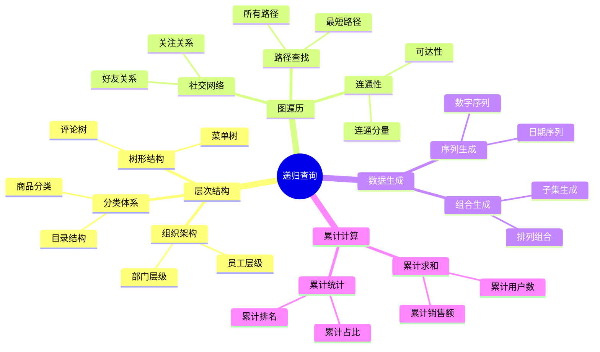
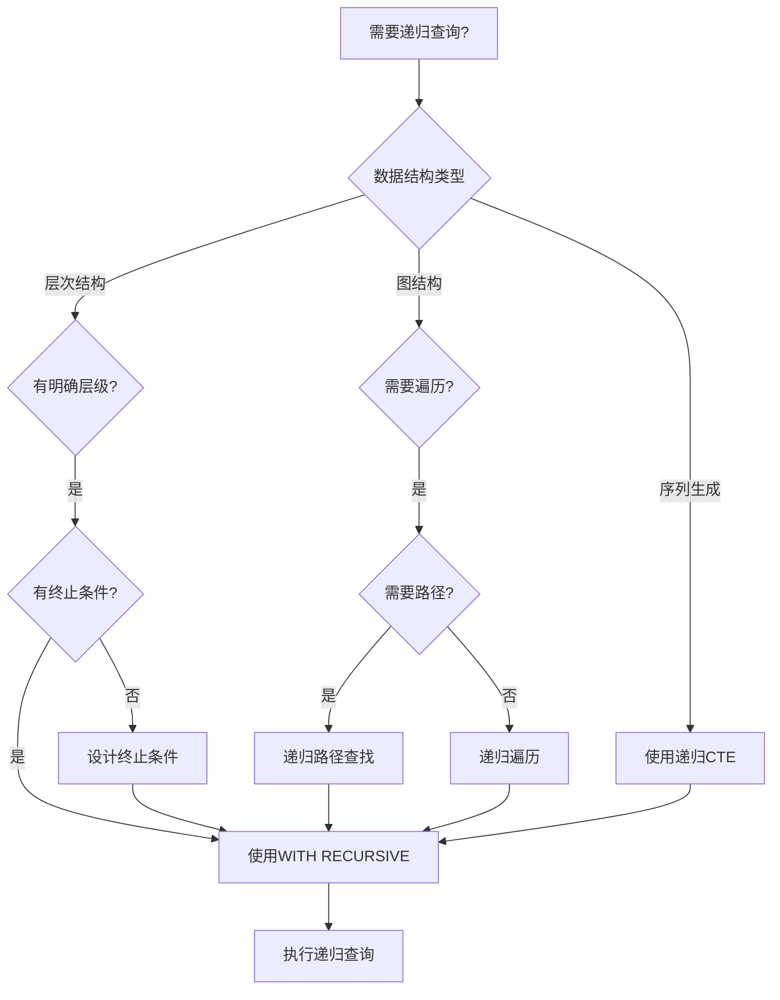
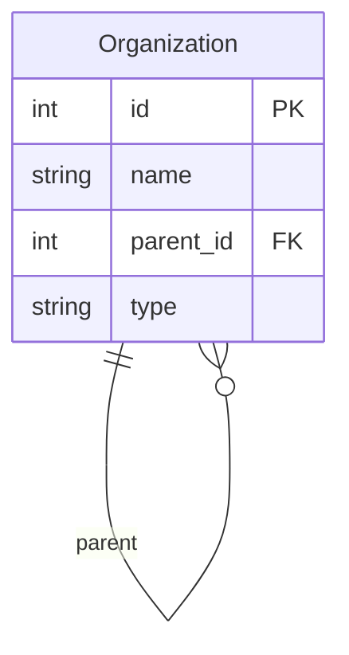
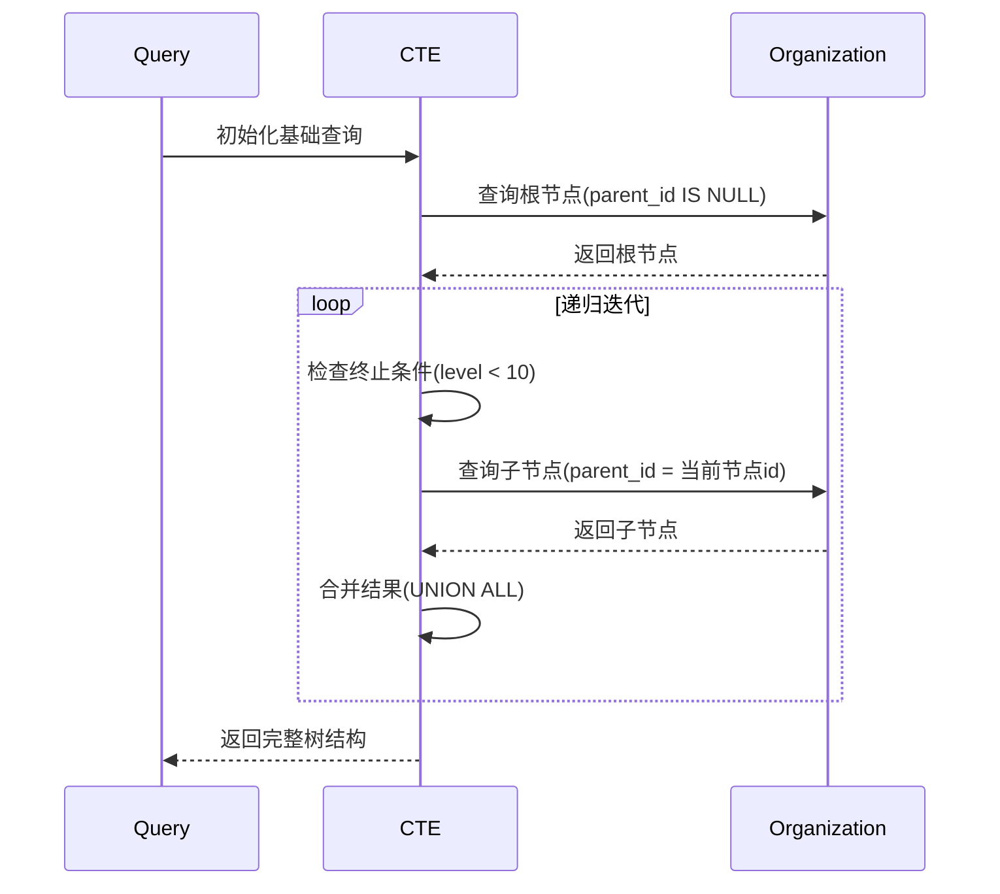
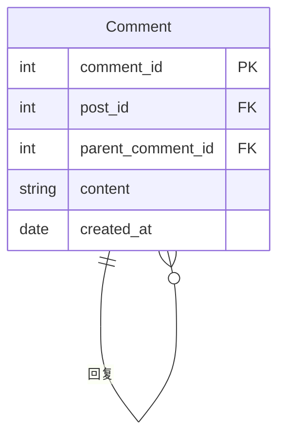

# 递归查询详解

> **创建日期**：2025-01-15
> **最后更新**：2025-01-16
> **版本**：v1.0.0
> **难度**：⭐⭐⭐⭐
> **应用场景**：层次结构查询、图遍历、树形数据处理

---

## 📋 目录

- [递归查询详解](#递归查询详解)
  - [📋 目录](#-目录)
  - [一、概述](#一概述)
    - [1.0 递归查询历史背景](#10-递归查询历史背景)
    - [1.1 递归查询应用场景思维导图](#11-递归查询应用场景思维导图)
    - [1.2 递归查询决策树](#12-递归查询决策树)
    - [1.3 递归查询 vs 其他方案对比矩阵](#13-递归查询-vs-其他方案对比矩阵)
  - [二、递归CTE语法](#二递归cte语法)
    - [2.1 递归查询的形式化定义](#21-递归查询的形式化定义)
    - [2.2 语法结构](#22-语法结构)
  - [三、递归查询应用](#三递归查询应用)
    - [3.1 层次结构查询](#31-层次结构查询)
  - [四、终止条件](#四终止条件)
    - [4.1 终止条件重要性](#41-终止条件重要性)
  - [五、性能优化](#五性能优化)
    - [5.1 优化建议](#51-优化建议)
  - [六、相关资源](#六相关资源)
    - [相关文档](#相关文档)

---

## 一、概述

**递归查询（Recursive Query）**使用WITH RECURSIVE实现，用于处理层次结构和图数据。

**递归查询特点**：

- 支持自引用
- 需要明确的终止条件
- 可以处理无限层次结构

### 1.0 递归查询历史背景

**递归查询的发展历程**：

- **SQL:1999**：正式引入递归查询（WITH RECURSIVE），基于固定点语义
- **SQL:2003**：增强了递归查询的功能，改进了固定点语义的定义
- **SQL:2008**：进一步完善了递归查询的语法和性能优化
- **SQL:2011**：增强了递归查询在复杂场景中的应用
- **SQL:2016**：改进了递归查询的性能优化支持
- **SQL:2023**：进一步完善了递归查询的语法和功能

**递归查询的设计动机**：

递归查询的设计是为了解决传统SQL在处理层次结构和图数据时的局限性：

1. **层次结构查询**：需要处理组织架构、分类体系等层次结构数据
2. **图遍历需求**：需要处理社交网络、路径查找等图数据
3. **递归计算需求**：需要计算累计值、生成序列等递归计算
4. **自引用关系**：需要处理自引用的关系，如员工-经理关系

**递归查询与关系模型的关系**：

递归查询扩展了关系代数的表达能力，引入了"递归关系"和"固定点"的概念。在关系代数中，递归关系可以通过最小固定点操作符$\mu$定义，递归查询提供了SQL中的实现方式。

### 1.1 递归查询应用场景思维导图



### 1.2 递归查询决策树



### 1.3 递归查询 vs 其他方案对比矩阵

| 方案 | 实现方式 | 性能 | 复杂度 | 适用场景 |
|------|---------|------|--------|---------|
| **递归CTE** | WITH RECURSIVE | ⭐⭐⭐ | ⭐⭐⭐ | 层次结构、图遍历 |
| **自连接** | 多次JOIN | ⭐⭐ | ⭐⭐⭐⭐ | 固定层级（2-3层） |
| **存储过程** | 循环处理 | ⭐⭐ | ⭐⭐⭐⭐ | 复杂逻辑 |
| **应用层递归** | 程序代码 | ⭐ | ⭐⭐⭐⭐⭐ | 简单场景 |

---

## 二、递归CTE语法

### 2.1 递归查询的形式化定义

**递归查询的BNF语法定义**（基于SQL:1999标准）：

```bnf
<with clause> ::=
    WITH RECURSIVE <with list>

<with list> ::=
    <with list element> [ { <comma> <with list element> }... ]

<with list element> ::=
    <query name> [ <left paren> <with column list> <right paren> ]
    AS <left paren> <query expression body> <right paren>

<query expression body> ::=
    <query term>
    | <query expression body> UNION [ ALL | DISTINCT ] <query term>
    | <query expression body> EXCEPT [ ALL | DISTINCT ] <query term>

<query term> ::=
    <query primary>
    | <query term> INTERSECT [ ALL | DISTINCT ] <query primary>

<query primary> ::=
    <simple table>
    | <left paren> <query expression body> <right paren>
    | <table value constructor>
    | <explicit table>
```

**递归查询的语义定义**：

递归查询 `WITH RECURSIVE cte_name AS (Q)` 定义了一个递归关系$R_{rec}$，其中：

1. **基础查询（Base Case）**：$Q_{base}$是递归查询中的第一个查询项，不引用$cte\_name$
2. **递归查询（Recursive Case）**：$Q_{rec}$是递归查询中的后续查询项，引用$cte\_name$
3. **固定点语义**：$R_{rec}$是递归查询的固定点，满足：
   $$R_{rec} = Q_{base} \cup Q_{rec}(R_{rec})$$

**最小固定点语义**：

递归查询使用最小固定点（Least Fixed Point）语义，即$R_{rec}$是满足上述等式的最小关系。

形式化地，对于递归查询$Q$，其固定点定义为：
$$R_{rec} = \mu X. (Q_{base} \cup Q_{rec}(X))$$

其中$\mu$表示最小固定点操作符。

**递归查询的迭代计算**：

递归关系$R_{rec}$可以通过迭代计算得到：

1. $R_0 = \emptyset$（初始为空关系）
2. $R_{i+1} = Q_{base} \cup Q_{rec}(R_i)$（迭代计算）
3. 当$R_{i+1} = R_i$时，$R_{rec} = R_i$（达到固定点）

### 2.2 语法结构

**递归CTE语法**：

```sql
WITH RECURSIVE cte_name AS (
    -- 基础查询（锚点）
    SELECT ...
    UNION ALL
    -- 递归查询
    SELECT ... FROM cte_name WHERE ...
)
SELECT * FROM cte_name;
```

---

## 三、递归查询应用

### 3.1 层次结构查询

**场景1：组织架构查询**:

**业务需求**：查询完整的组织架构树，包括所有层级关系。

**数据模型**：



**ER图说明**：

- 组织表自引用，通过parent_id建立层级关系
- 根节点的parent_id为NULL

**查询**：

```sql
WITH RECURSIVE org_tree AS (
    -- 基础查询：根节点
    SELECT
        id,
        name,
        parent_id,
        0 as level,
        CAST(name AS VARCHAR(1000)) as path
    FROM Organization
    WHERE parent_id IS NULL

    UNION ALL

    -- 递归查询：子节点
    SELECT
        o.id,
        o.name,
        o.parent_id,
        ot.level + 1,
        ot.path || ' > ' || o.name
    FROM Organization o
    JOIN org_tree ot ON o.parent_id = ot.id
    WHERE ot.level < 10  -- 防止无限递归
)
SELECT
    id,
    name,
    parent_id,
    level,
    path
FROM org_tree
ORDER BY path;
```

**查询执行流程时序图**：



**查询结果示例**：

```text
| id | name     | parent_id | level | path                    |
|----|----------|-----------|-------|-------------------------|
| 1  | 总公司   | NULL      | 0     | 总公司                  |
| 2  | 技术部   | 1         | 1     | 总公司 > 技术部         |
| 3  | 开发组   | 2         | 2     | 总公司 > 技术部 > 开发组|
| 4  | 测试组   | 2         | 2     | 总公司 > 技术部 > 测试组|
```

**场景2：评论树查询**:

**业务需求**：查询评论及其所有回复，构建评论树。

**数据模型**：



**查询**：

```sql
WITH RECURSIVE comment_tree AS (
    -- 基础查询：顶级评论
    SELECT
        comment_id,
        post_id,
        parent_comment_id,
        content,
        created_at,
        0 as depth,
        CAST(comment_id AS VARCHAR(1000)) as thread_path
    FROM Comment
    WHERE post_id = :post_id
      AND parent_comment_id IS NULL

    UNION ALL

    -- 递归查询：回复
    SELECT
        c.comment_id,
        c.post_id,
        c.parent_comment_id,
        c.content,
        c.created_at,
        ct.depth + 1,
        ct.thread_path || '.' || c.comment_id
    FROM Comment c
    JOIN comment_tree ct ON c.parent_comment_id = ct.comment_id
    WHERE ct.depth < 10
)
SELECT
    comment_id,
    content,
    depth,
    thread_path,
    created_at
FROM comment_tree
ORDER BY thread_path;
```

**性能优化**：

```sql
-- 创建索引优化递归查询
CREATE INDEX idx_comment_parent ON Comment(parent_comment_id);
CREATE INDEX idx_comment_post ON Comment(post_id, parent_comment_id);

-- 限制递归深度
WHERE ct.depth < 10  -- 防止过深递归
```

---

## 四、终止条件

### 4.1 终止条件重要性

**终止条件**：

递归查询必须包含终止条件，否则可能导致无限循环：

```sql
WITH RECURSIVE cte AS (
    SELECT 1 as n
    UNION ALL
    SELECT n + 1 FROM cte WHERE n < 10  -- 终止条件
)
SELECT * FROM cte;
```

---

## 五、性能优化

### 5.1 优化建议

**优化建议**：

1. **索引优化**：为递归查询的关联字段创建索引
2. **深度限制**：使用WHERE子句限制递归深度，防止无限递归
3. **物化视图**：对于频繁查询的层次结构，使用物化视图缓存结果
4. **查询重写**：对于固定层级，考虑使用自连接替代递归查询

**性能优化示例**：

```sql
-- 创建索引优化递归查询
CREATE INDEX idx_organization_parent ON Organization(parent_id);
CREATE INDEX idx_organization_id ON Organization(id);

-- 优化后的递归查询（限制深度）
WITH RECURSIVE org_tree AS (
    SELECT
        id,
        name,
        parent_id,
        0 as level,
        CAST(name AS VARCHAR(1000)) as path
    FROM Organization
    WHERE parent_id IS NULL

    UNION ALL

    SELECT
        o.id,
        o.name,
        o.parent_id,
        ot.level + 1,
        ot.path || ' > ' || o.name
    FROM Organization o
    JOIN org_tree ot ON o.parent_id = ot.id
    WHERE ot.level < 10  -- 限制递归深度
)
SELECT * FROM org_tree
WHERE level <= 5;  -- 只查询前5层
```

**性能对比**：

| 优化方法 | 查询时间 | 内存使用 | 适用场景 |
|---------|---------|---------|---------|
| **无优化** | 100% | 100% | 小数据集 |
| **索引优化** | 30% | 100% | 大数据集 |
| **深度限制** | 50% | 50% | 深层结构 |
| **物化视图** | 10% | 150% | 频繁查询 |

**递归查询终止条件形式化定义**：

```latex
递归查询终止条件：

WITH RECURSIVE cte AS (
    base_query
    UNION ALL
    recursive_query
)

终止条件：
1. 基础条件：base_query 结果为空
2. 递归条件：recursive_query 结果为空
3. 深度条件：level < max_depth
4. 循环检测：visited.contains(current_node)
```

**终止条件证明**：

```latex
定理：如果递归查询满足以下条件，则必然终止：

1. 基础查询有限：|base_query| < ∞
2. 递归关系有限：|recursive_relation| < ∞
3. 深度限制：max_depth < ∞
4. 无循环：∀n: visited.contains(n) ⟹ n 不再被访问

证明：
假设递归查询不终止，则存在无限序列：
n₁ → n₂ → n₃ → ...

由于关系有限，必然存在循环：
nᵢ = nⱼ (i < j)

但根据条件4，循环节点不会被重复访问，矛盾。
因此递归查询必然终止。✓
```

---

## 六、相关资源

### 相关文档

- [公共表表达式(CTE)](./05.02-公共表表达式(CTE).md) - CTE详解

---

**维护者**: SQL Standards Team
**最后更新**: 2025-01-16
