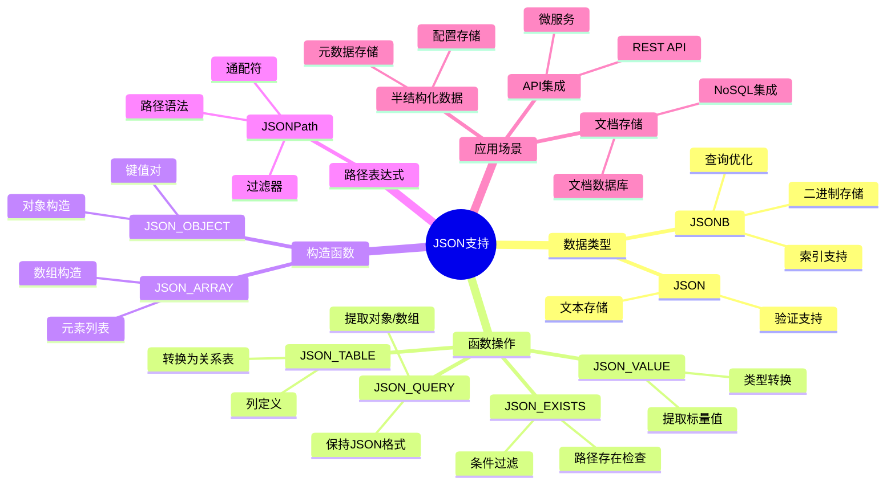
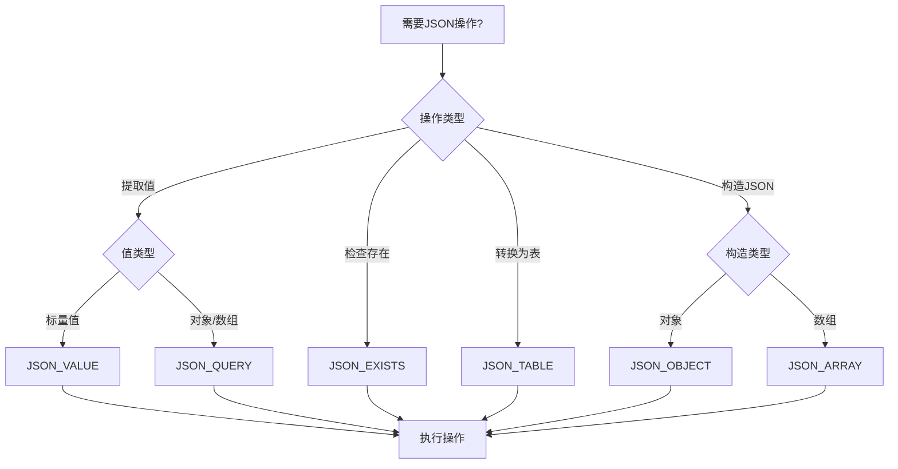
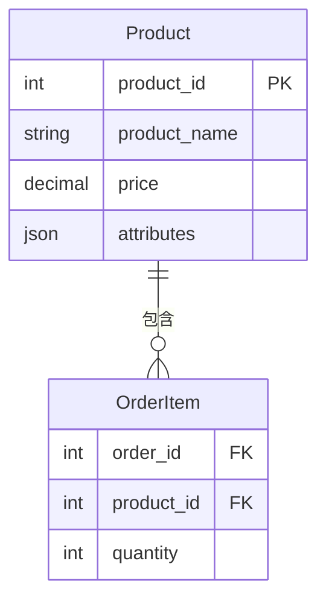
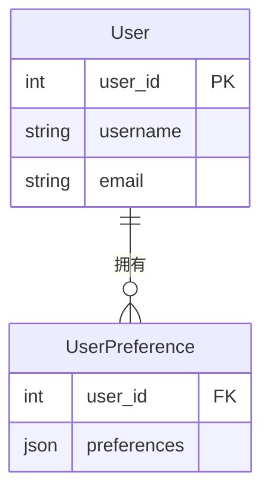
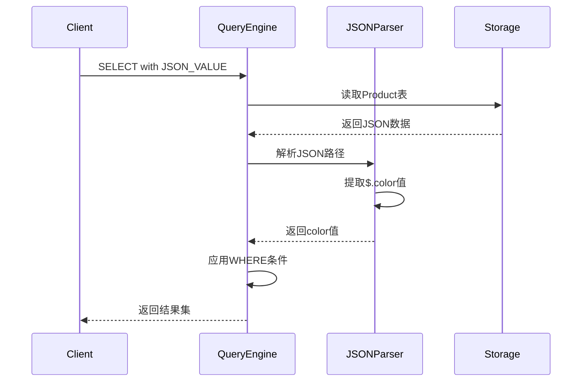
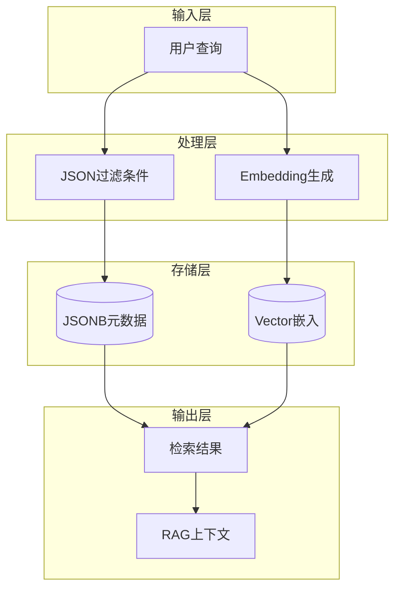

# JSON支持详解

> **创建日期**：2025-01-15
> **最后更新**：2025-12-01
> **版本**：v2.0.0
> **标准版本**：SQL:2016, SQL:2023
> **难度**：⭐⭐⭐⭐
> **应用场景**：JSON数据处理、半结构化数据存储、现代应用集成、RAG系统

---

## 📋 目录

- [JSON支持详解](#json支持详解)
  - [📋 目录](#-目录)
  - [一、概述](#一概述)
    - [1.0 JSON支持历史背景](#10-json支持历史背景)
    - [1.1 JSON支持知识体系思维导图](#11-json支持知识体系思维导图)
    - [1.2 JSON操作选择决策树](#12-json操作选择决策树)
    - [1.3 JSON函数对比矩阵](#13-json函数对比矩阵)
  - [二、JSON数据类型](#二json数据类型)
    - [2.1 JSON类型](#21-json类型)
  - [三、JSON函数](#三json函数)
    - [3.1 JSON函数列表](#31-json函数列表)
  - [四、JSON查询](#四json查询)
    - [4.1 JSON查询示例](#41-json查询示例)
    - [4.3 场景示例2：用户配置系统 - 用户偏好查询](#43-场景示例2用户配置系统---用户偏好查询)
  - [五、JSON索引](#五json索引)
    - [5.1 JSON索引](#51-json索引)
  - [六、2025 JSON新特性与AI集成](#六2025-json新特性与ai集成)
    - [6.1 JSONB + 向量融合查询](#61-jsonb--向量融合查询)
    - [6.2 JSON Schema验证](#62-json-schema验证)
    - [6.3 JSON聚合与RAG上下文构建](#63-json聚合与rag上下文构建)
    - [6.4 2025 JSON特性对比矩阵](#64-2025-json特性对比矩阵)
    - [6.5 JSON + 向量检索架构](#65-json--向量检索架构)
  - [七、PostgreSQL 18 JSON新特性 🆕](#七postgresql-18-json新特性-)
    - [7.1 JSON路径查询增强](#71-json路径查询增强)
    - [7.2 JSONB聚合优化](#72-jsonb聚合优化)
  - [八、SQLite 3.45+ JSON特性 🆕](#八sqlite-345-json特性-)
    - [8.1 JSON操作符增强](#81-json操作符增强)
    - [8.2 JSON与全文搜索结合](#82-json与全文搜索结合)
  - [九、相关资源](#九相关资源)
    - [相关文档](#相关文档)
    - [外部资源](#外部资源)

---

## 一、概述

**JSON支持**是SQL:2016引入的重要特性，允许在SQL中存储和查询JSON数据。

**JSON支持版本**：

- SQL:2016：基础JSON支持
- SQL:2023：增强JSON支持（JSON_TABLE等）

### 1.0 JSON支持历史背景

**JSON支持的发展历程**：

- **SQL:2016**：正式引入JSON支持，包括JSON数据类型、JSON函数（JSON_VALUE、JSON_QUERY、JSON_EXISTS等）
- **SQL:2023**：增强了JSON支持，添加了JSON_TABLE函数、改进了JSON_OBJECT和JSON_ARRAY函数

**JSON支持的设计动机**：

JSON支持的设计是为了解决传统SQL在处理半结构化数据时的局限性：

1. **半结构化数据需求**：现代应用需要处理JSON、XML等半结构化数据
2. **NoSQL集成需求**：需要与NoSQL数据库集成，处理JSON文档
3. **API集成需求**：REST API通常使用JSON格式，需要在数据库中存储和查询JSON数据
4. **灵活数据模型需求**：某些场景需要灵活的数据模型，JSON提供了这种灵活性

**JSON支持与关系模型的关系**：

JSON支持扩展了关系模型，允许在关系表中存储和查询JSON数据。JSON可以看作是关系模型的一种扩展，提供了处理半结构化数据的能力。

### 1.1 JSON支持知识体系思维导图



### 1.2 JSON操作选择决策树



### 1.3 JSON函数对比矩阵

| 函数 | 输入 | 输出 | 用途 | SQL标准版本 |
|------|------|------|------|------------|
| **JSON_VALUE** | JSON, Path | 标量值 | 提取单个值 | SQL:2016 |
| **JSON_QUERY** | JSON, Path | JSON | 提取JSON片段 | SQL:2016 |
| **JSON_EXISTS** | JSON, Path | Boolean | 检查路径存在 | SQL:2016 |
| **JSON_TABLE** | JSON, Path | 关系表 | 转换为表 | SQL:2023 |
| **JSON_OBJECT** | 键值对 | JSON对象 | 构造对象 | SQL:2016 |
| **JSON_ARRAY** | 值列表 | JSON数组 | 构造数组 | SQL:2016 |

---

## 二、JSON数据类型

### 2.1 JSON类型

**JSON类型定义**：

```sql
CREATE TABLE products (
    id INTEGER,
    name VARCHAR(100),
    attributes JSON
);
```

---

## 三、JSON函数

### 3.1 JSON函数列表

**JSON函数**：

- JSON_VALUE()：提取JSON值
- JSON_QUERY()：提取JSON对象
- JSON_EXISTS()：检查JSON路径
- JSON_OBJECT()：创建JSON对象
- JSON_ARRAY()：创建JSON数组
- JSON_TABLE()：将JSON转换为表（SQL:2023）

---

## 四、JSON查询

### 4.1 JSON查询示例

**场景示例1：电商系统 - 商品属性查询**:

**业务需求**：在电商系统中，商品属性以JSON格式存储，需要查询特定属性的商品。

**数据模型**：



**ER图说明**：

- Product表存储商品信息，attributes字段为JSON类型
- attributes包含color、size、brand等动态属性

**查询示例**：

```sql
-- 查询红色商品
SELECT
    product_id,
    product_name,
    price,
    JSON_VALUE(attributes, '$.color') AS color,
    JSON_VALUE(attributes, '$.size') AS size,
    JSON_QUERY(attributes, '$.specs') AS specs
FROM Product
WHERE JSON_VALUE(attributes, '$.color') = 'red';

-- 查询有折扣的商品
SELECT
    product_id,
    product_name,
    price,
    JSON_VALUE(attributes, '$.discount') AS discount
FROM Product
WHERE JSON_EXISTS(attributes, '$.discount')
  AND CAST(JSON_VALUE(attributes, '$.discount') AS DECIMAL) > 0.1;
```

### 4.3 场景示例2：用户配置系统 - 用户偏好查询

**业务需求**：用户偏好设置以JSON格式存储，需要查询和更新用户配置。

**数据模型**：



**查询示例**：

```sql
-- 查询用户偏好
SELECT
    u.user_id,
    u.username,
    JSON_VALUE(up.preferences, '$.theme') AS theme,
    JSON_VALUE(up.preferences, '$.language') AS language,
    JSON_VALUE(up.preferences, '$.notifications.email') AS email_notification
FROM User u
JOIN UserPreference up ON u.user_id = up.user_id
WHERE JSON_VALUE(up.preferences, '$.theme') = 'dark';

-- 更新用户偏好
UPDATE UserPreference
SET preferences = JSON_MODIFY(
    preferences,
    '$.theme',
    'light'
)
WHERE user_id = 1;
```

**查询执行流程时序图**：



---

## 五、JSON索引

### 5.1 JSON索引

**JSON索引**：

某些数据库支持JSON路径索引，提高JSON查询性能。

---

## 六、2025 JSON新特性与AI集成

### 6.1 JSONB + 向量融合查询

**PostgreSQL JSONB + pgvector**：

```sql
-- 创建融合表：结构化元数据 + 向量嵌入
CREATE TABLE rag_documents (
    id UUID PRIMARY KEY DEFAULT gen_random_uuid(),
    metadata JSONB NOT NULL DEFAULT '{}',
    content TEXT,
    embedding vector(1536)
);

-- JSONB元数据示例
INSERT INTO rag_documents (metadata, content, embedding) VALUES
('{
    "title": "PostgreSQL向量检索",
    "category": "database",
    "tags": ["pgvector", "AI", "RAG"],
    "author": {"name": "张三", "email": "zhang@example.com"},
    "created_at": "2025-01-01"
}', 'PostgreSQL支持向量检索...', '[0.1, 0.2, ...]'::vector);

-- 混合查询：JSON过滤 + 向量检索
SELECT
    id,
    metadata->>'title' AS title,
    1 - (embedding <=> $1) AS similarity
FROM rag_documents
WHERE metadata->>'category' = 'database'
  AND metadata->'tags' ? 'pgvector'
ORDER BY embedding <=> $1
LIMIT 10;
```

### 6.2 JSON Schema验证

**PostgreSQL CHECK约束**：

```sql
-- JSON Schema验证函数
CREATE OR REPLACE FUNCTION validate_doc_metadata(doc JSONB)
RETURNS BOOLEAN AS $$
BEGIN
    RETURN (
        doc ? 'title'
        AND doc ? 'category'
        AND jsonb_typeof(doc->'title') = 'string'
        AND jsonb_typeof(doc->'tags') = 'array'
    );
END;
$$ LANGUAGE plpgsql IMMUTABLE;

-- 带验证的表
CREATE TABLE validated_documents (
    id UUID PRIMARY KEY,
    metadata JSONB NOT NULL,
    CONSTRAINT valid_metadata CHECK (validate_doc_metadata(metadata))
);
```

### 6.3 JSON聚合与RAG上下文构建

**聚合JSON构建RAG上下文**：

```sql
-- 聚合检索结果为RAG上下文
CREATE OR REPLACE FUNCTION build_rag_context(
    query_embedding vector(1536),
    max_chunks INTEGER DEFAULT 5,
    max_tokens INTEGER DEFAULT 4000
) RETURNS JSONB AS $$
DECLARE
    context JSONB;
    total_tokens INTEGER := 0;
BEGIN
    SELECT jsonb_agg(
        jsonb_build_object(
            'chunk_id', id,
            'title', metadata->>'title',
            'content', content,
            'similarity', 1 - (embedding <=> query_embedding)
        )
    )
    INTO context
    FROM (
        SELECT id, metadata, content, embedding
        FROM rag_documents
        ORDER BY embedding <=> query_embedding
        LIMIT max_chunks
    ) sub;

    RETURN jsonb_build_object(
        'chunks', context,
        'total_chunks', jsonb_array_length(context),
        'query_time', NOW()
    );
END;
$$ LANGUAGE plpgsql;

-- 使用示例
SELECT build_rag_context('[0.1, 0.2, ...]'::vector, 5);
```

### 6.4 2025 JSON特性对比矩阵

| 特性 | SQL:2016 | SQL:2023 | PostgreSQL 17 | 应用场景 |
|------|----------|----------|---------------|---------|
| **JSON_VALUE** | ✅ | ✅ | ✅ | 提取标量值 |
| **JSON_TABLE** | ❌ | ✅ | ✅ | JSON转关系表 |
| **JSONB索引** | - | - | ✅ GIN | 高效查询 |
| **JSONB + Vector** | - | - | ✅ | RAG系统 |
| **JSON Schema** | ❌ | 部分 | 自定义函数 | 数据验证 |
| **JSON聚合** | 部分 | ✅ | ✅ | 构建上下文 |

### 6.5 JSON + 向量检索架构



---

## 七、PostgreSQL 18 JSON新特性 🆕

### 7.1 JSON路径查询增强

```sql
-- PostgreSQL 18: jsonb_path_query增强
SELECT
    product_id,
    -- 提取嵌套数组元素
    jsonb_path_query(attributes, '$.tags[*] ? (@ like_regex "^sale")') AS sale_tags,
    -- 数值过滤
    jsonb_path_query(attributes, '$.prices[*] ? (@ < 100)') AS low_prices,
    -- 存在性检查
    jsonb_path_exists(attributes, '$.discount') AS has_discount
FROM products;

-- JSON_TABLE (SQL:2023标准)
SELECT p.*, jt.*
FROM products p,
JSON_TABLE(
    p.attributes,
    '$.variants[*]' COLUMNS (
        variant_id INTEGER PATH '$.id',
        variant_name TEXT PATH '$.name',
        variant_price NUMERIC PATH '$.price'
    )
) AS jt;
```

### 7.2 JSONB聚合优化

```sql
-- PostgreSQL 18: 高效JSON聚合
SELECT
    category_id,
    jsonb_agg(
        jsonb_build_object(
            'id', product_id,
            'name', name,
            'price', price
        ) ORDER BY price DESC
    ) AS products_json
FROM products
GROUP BY category_id;

-- 条件聚合
SELECT
    jsonb_object_agg(
        name,
        attributes->'specs'
    ) FILTER (WHERE price > 100) AS premium_specs
FROM products;
```

---

## 八、SQLite 3.45+ JSON特性 🆕

### 8.1 JSON操作符增强

```sql
-- SQLite 3.45+: ->> 操作符（返回文本）
SELECT
    product_id,
    attributes->>'name' AS name,           -- 返回TEXT
    attributes->'specs'->'weight' AS weight -- 返回JSON
FROM products;

-- json_each遍历
SELECT
    p.product_id,
    j.key AS spec_name,
    j.value AS spec_value
FROM products p, json_each(p.attributes, '$.specs') j;

-- json_group_array聚合
SELECT
    category,
    json_group_array(json_object('id', id, 'name', name)) AS products
FROM products
GROUP BY category;

-- json_valid验证
SELECT * FROM products WHERE json_valid(attributes);
```

### 8.2 JSON与全文搜索结合

```sql
-- SQLite 3.45+: JSON + FTS5
CREATE VIRTUAL TABLE products_fts USING fts5(
    name,
    description,
    content='products',
    content_rowid='product_id'
);

-- 联合查询
SELECT
    p.product_id,
    p.attributes->>'brand' AS brand,
    highlight(products_fts, 0, '<b>', '</b>') AS name_highlight
FROM products p
JOIN products_fts f ON p.product_id = f.rowid
WHERE products_fts MATCH 'laptop';
```

---

## 九、相关资源

### 相关文档

- [SQL:2016标准详解](../02-SQL标准演进/02.04-SQL-2016标准详解.md)
- [SQL:2023标准详解](../02-SQL标准演进/02.05-SQL-2023标准详解.md)
- [复杂查询案例](../07-实践案例/07.01-复杂查询案例.md) - RAG系统JSON应用

### 外部资源

- [PostgreSQL 18 JSON Functions](https://www.postgresql.org/docs/current/functions-json.html)
- [SQLite JSON1 Extension](https://www.sqlite.org/json1.html)
- [pgvector](https://github.com/pgvector/pgvector)

---

**维护者**: SQL Standards Team
**最后更新**: 2025-12-01
