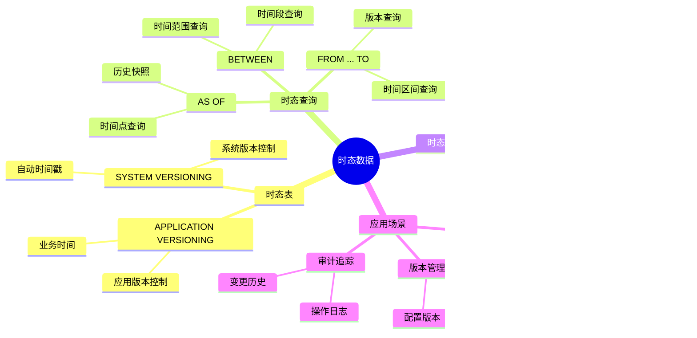
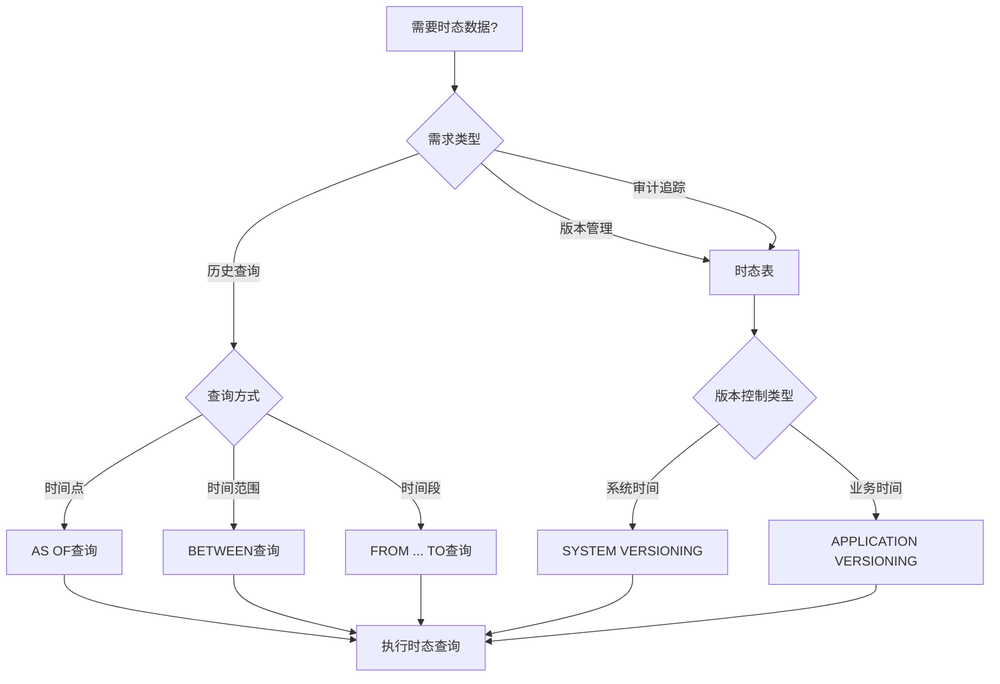
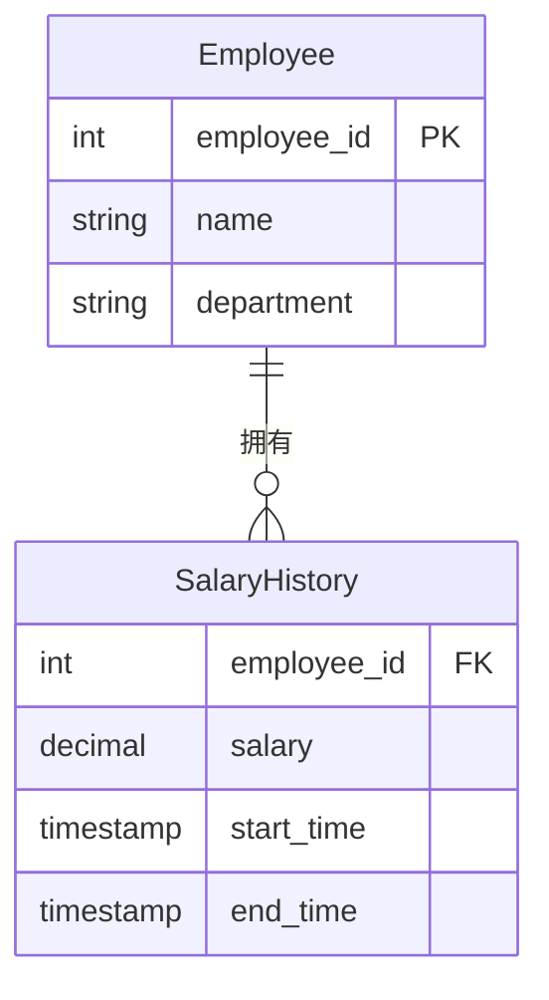
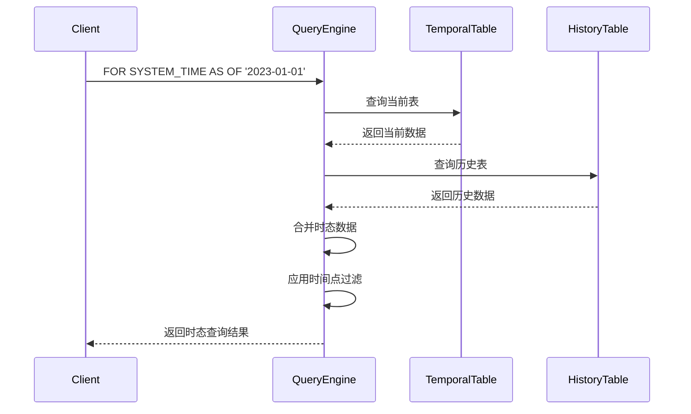

# 时态数据处理

> **创建日期**：2025-01-15
> **最后更新**：2025-01-16
> **版本**：v1.0.0
> **标准版本**：SQL:2011, SQL:2023
> **难度**：⭐⭐⭐⭐
> **应用场景**：历史数据查询、时态数据分析、数据版本管理

---

## 📋 目录

- [时态数据处理](#时态数据处理)
  - [📋 目录](#-目录)
  - [一、概述](#一概述)
    - [1.0 时态数据历史背景](#10-时态数据历史背景)
    - [1.1 时态数据知识体系思维导图](#11-时态数据知识体系思维导图)
    - [1.2 时态数据应用决策树](#12-时态数据应用决策树)
    - [1.3 时态数据 vs 其他方案对比矩阵](#13-时态数据-vs-其他方案对比矩阵)
  - [二、时态数据类型](#二时态数据类型)
    - [2.1 时态表](#21-时态表)
  - [三、时态查询](#三时态查询)
    - [3.1 时态查询语法](#31-时态查询语法)
    - [3.2 场景示例1：员工薪资历史查询](#32-场景示例1员工薪资历史查询)
    - [3.3 场景示例2：产品价格历史追踪](#33-场景示例2产品价格历史追踪)
  - [四、时态约束](#四时态约束)
    - [4.1 时态约束](#41-时态约束)
  - [五、时态索引](#五时态索引)
    - [5.1 时态索引](#51-时态索引)
  - [六、相关资源](#六相关资源)
    - [相关文档](#相关文档)

---

## 一、概述

**时态数据（Temporal Data）**是SQL:2011引入的特性，用于处理具有时间维度的数据。

**时态数据特点**：

- 支持历史数据查询
- 自动维护数据版本
- 支持时间点查询

### 1.0 时态数据历史背景

**时态数据的发展历程**：

- **SQL:2011**：正式引入时态数据支持，包括时态表（Temporal Tables）、时态查询（Temporal Queries）
- **SQL:2016**：增强了时态数据的功能，改进了时态查询的性能
- **SQL:2023**：进一步完善了时态数据的语法和功能

**时态数据的设计动机**：

时态数据的设计是为了解决传统SQL在处理历史数据和数据版本管理时的局限性：

1. **历史数据查询需求**：需要查询数据在特定时间点的状态
2. **数据版本管理需求**：需要自动维护数据的版本历史
3. **审计追踪需求**：需要追踪数据的变更历史
4. **时间序列分析需求**：需要分析数据随时间的变化趋势

**时态数据与关系模型的关系**：

时态数据扩展了关系模型，引入了"时间维度"的概念。在关系模型中，关系是静态的，而时态关系是动态的，包含了时间信息。这可以看作是关系模型的一种扩展，提供了处理时间维度数据的能力。

### 1.1 时态数据知识体系思维导图



### 1.2 时态数据应用决策树



### 1.3 时态数据 vs 其他方案对比矩阵

| 方案 | 实现方式 | 自动维护 | 查询性能 | 存储开销 | 适用场景 |
|------|---------|---------|---------|---------|---------|
| **时态表** | SYSTEM VERSIONING | ✅ 自动 | ⭐⭐⭐⭐ | 中 | 历史数据管理 |
| **历史表** | 手动维护 | ❌ 手动 | ⭐⭐⭐ | 高 | 简单历史记录 |
| **版本字段** | 版本号字段 | ❌ 手动 | ⭐⭐⭐⭐ | 低 | 版本控制 |
| **时间戳字段** | 时间戳字段 | ❌ 手动 | ⭐⭐⭐ | 低 | 简单时间查询 |

---

## 二、时态数据类型

### 2.1 时态表

**时态表定义**：

```sql
CREATE TABLE Employee (
    id INTEGER,
    name VARCHAR(50),
    salary DECIMAL(10,2),
    PERIOD FOR SYSTEM_TIME (start_time, end_time)
) WITH SYSTEM VERSIONING;
```

---

## 三、时态查询

### 3.1 时态查询语法

### 3.2 场景示例1：员工薪资历史查询

**业务需求**：跟踪员工薪资变更历史，支持查询任意时间点的薪资信息。

**数据模型**：



**时态表定义**：

```sql
-- 创建时态表
CREATE TABLE Employee (
    employee_id INTEGER PRIMARY KEY,
    name VARCHAR(50),
    department VARCHAR(50),
    salary DECIMAL(10,2),
    PERIOD FOR SYSTEM_TIME (start_time, end_time)
) WITH SYSTEM VERSIONING;

-- 插入数据
INSERT INTO Employee (employee_id, name, department, salary)
VALUES (1, 'Alice', 'Engineering', 50000);

-- 更新薪资（系统自动创建历史记录）
UPDATE Employee
SET salary = 55000
WHERE employee_id = 1;
```

**时态查询示例**：

```sql
-- 查询当前数据
SELECT * FROM Employee;

-- 查询2023-01-01的薪资
SELECT
    employee_id,
    name,
    salary
FROM Employee
FOR SYSTEM_TIME AS OF '2023-01-01'
WHERE employee_id = 1;

-- 查询2023年全年的薪资变更
SELECT
    employee_id,
    name,
    salary,
    start_time,
    end_time
FROM Employee
FOR SYSTEM_TIME BETWEEN '2023-01-01' AND '2023-12-31'
WHERE employee_id = 1
ORDER BY start_time;
```

**查询执行流程时序图**：



### 3.3 场景示例2：产品价格历史追踪

**业务需求**：追踪产品价格变更历史，支持价格趋势分析。

**时态表定义**：

```sql
CREATE TABLE Product (
    product_id INTEGER PRIMARY KEY,
    product_name VARCHAR(100),
    price DECIMAL(10,2),
    PERIOD FOR SYSTEM_TIME (start_time, end_time)
) WITH SYSTEM VERSIONING;
```

**时态查询示例**：

```sql
-- 查询产品价格历史
SELECT
    product_id,
    product_name,
    price,
    start_time,
    end_time
FROM Product
FOR SYSTEM_TIME FROM '2023-01-01' TO '2023-12-31'
WHERE product_id = 101
ORDER BY start_time;

-- 查询价格变更次数
SELECT
    product_id,
    product_name,
    COUNT(*) - 1 AS price_change_count
FROM Product
FOR SYSTEM_TIME ALL
WHERE product_id = 101
GROUP BY product_id, product_name;
```

---

## 四、时态约束

### 4.1 时态约束

**时态约束**：

时态表支持时态完整性约束，确保时间范围的有效性。

---

## 五、时态索引

### 5.1 时态索引

**时态索引**：

时态表可以使用时间范围索引，提高时态查询性能。

---

## 六、相关资源

### 相关文档

- [SQL:2011标准](../02-SQL标准演进/02.03-SQL-1999到SQL-2011标准.md#五sql2011标准) - SQL:2011标准
- [SQL:2023标准详解](../02-SQL标准演进/02.05-SQL-2023标准详解.md) - SQL:2023标准

---

**维护者**: SQL Standards Team
**最后更新**: 2025-01-16
