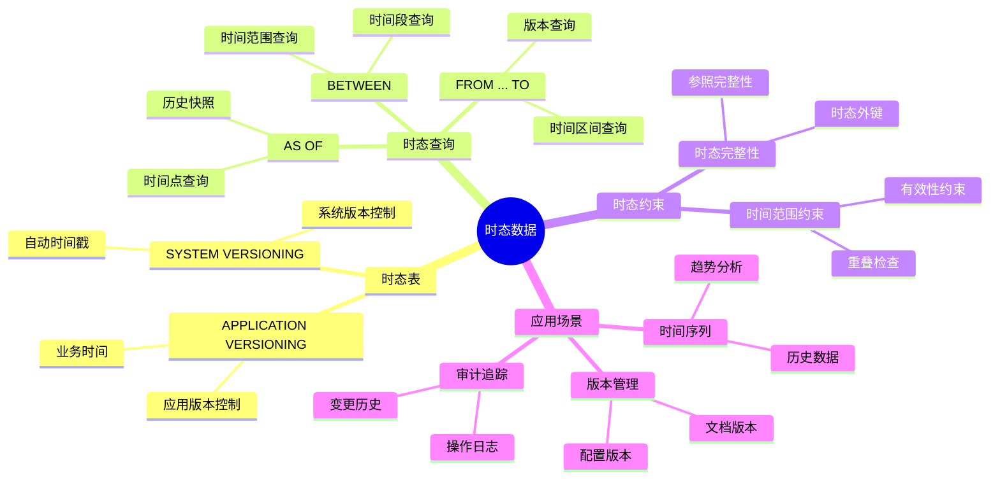
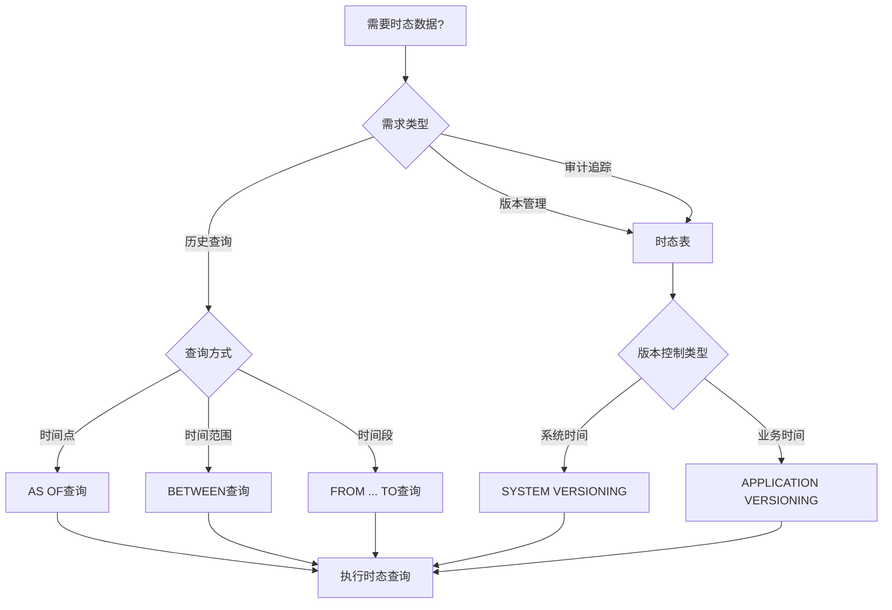
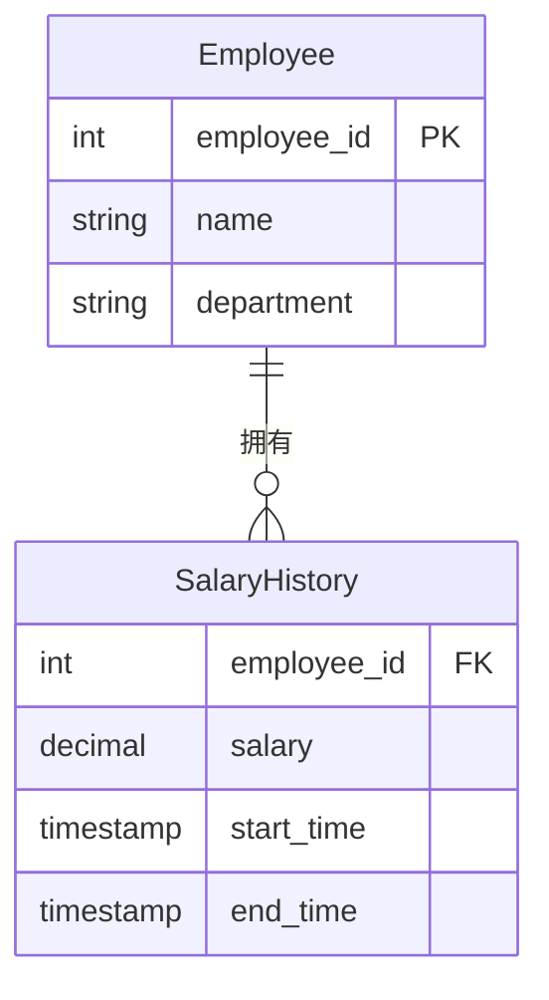
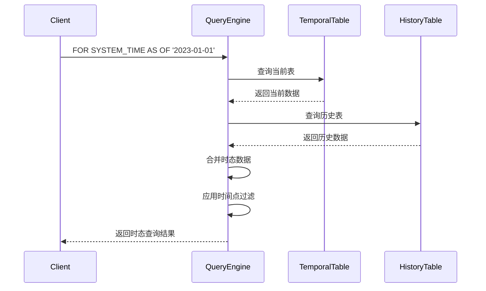

# 时态数据处理

> **创建日期**：2025-01-15
> **最后更新**：2025-01-16
> **版本**：v1.0.0
> **标准版本**：SQL:2011, SQL:2023
> **难度**：⭐⭐⭐⭐
> **应用场景**：历史数据查询、时态数据分析、数据版本管理

---

## 📋 目录

- [时态数据处理](#时态数据处理)
  - [📋 目录](#-目录)
  - [一、概述](#一概述)
    - [1.0 时态数据历史背景](#10-时态数据历史背景)
    - [1.1 时态数据知识体系思维导图](#11-时态数据知识体系思维导图)
    - [1.2 时态数据应用决策树](#12-时态数据应用决策树)
    - [1.3 时态数据 vs 其他方案对比矩阵](#13-时态数据-vs-其他方案对比矩阵)
  - [二、时态数据类型](#二时态数据类型)
    - [2.1 时态表](#21-时态表)
  - [三、时态查询](#三时态查询)
    - [3.1 时态查询语法](#31-时态查询语法)
    - [3.2 场景示例1：员工薪资历史查询](#32-场景示例1员工薪资历史查询)
    - [3.3 场景示例2：产品价格历史追踪](#33-场景示例2产品价格历史追踪)
  - [四、时态约束](#四时态约束)
    - [4.1 时态约束](#41-时态约束)
  - [五、时态索引](#五时态索引)
    - [5.1 时态索引](#51-时态索引)
  - [六、PostgreSQL 18 时态数据实现 🆕](#六postgresql-18-时态数据实现-)
    - [6.1 PostgreSQL时态表实现](#61-postgresql时态表实现)
    - [6.2 PostgreSQL 18 时态查询示例](#62-postgresql-18-时态查询示例)
  - [七、SQLite 3.45+ 时态数据实现 🆕](#七sqlite-345-时态数据实现-)
    - [7.1 SQLite时态表实现](#71-sqlite时态表实现)
    - [7.2 SQLite时态查询](#72-sqlite时态查询)
  - [八、时态数据形式化理论 🆕](#八时态数据形式化理论-)
    - [8.1 时态关系形式化定义](#81-时态关系形式化定义)
    - [8.2 时态操作语义](#82-时态操作语义)
  - [九、相关资源](#九相关资源)
    - [相关文档](#相关文档)
    - [外部资源](#外部资源)

---

## 一、概述

**时态数据（Temporal Data）**是SQL:2011引入的特性，用于处理具有时间维度的数据。

**时态数据特点**：

- 支持历史数据查询
- 自动维护数据版本
- 支持时间点查询

### 1.0 时态数据历史背景

**时态数据的发展历程**：

- **SQL:2011**：正式引入时态数据支持，包括时态表（Temporal Tables）、时态查询（Temporal Queries）
- **SQL:2016**：增强了时态数据的功能，改进了时态查询的性能
- **SQL:2023**：进一步完善了时态数据的语法和功能

**时态数据的设计动机**：

时态数据的设计是为了解决传统SQL在处理历史数据和数据版本管理时的局限性：

1. **历史数据查询需求**：需要查询数据在特定时间点的状态
2. **数据版本管理需求**：需要自动维护数据的版本历史
3. **审计追踪需求**：需要追踪数据的变更历史
4. **时间序列分析需求**：需要分析数据随时间的变化趋势

**时态数据与关系模型的关系**：

时态数据扩展了关系模型，引入了"时间维度"的概念。在关系模型中，关系是静态的，而时态关系是动态的，包含了时间信息。这可以看作是关系模型的一种扩展，提供了处理时间维度数据的能力。

### 1.1 时态数据知识体系思维导图



### 1.2 时态数据应用决策树



### 1.3 时态数据 vs 其他方案对比矩阵

| 方案 | 实现方式 | 自动维护 | 查询性能 | 存储开销 | 适用场景 |
|------|---------|---------|---------|---------|---------|
| **时态表** | SYSTEM VERSIONING | ✅ 自动 | ⭐⭐⭐⭐ | 中 | 历史数据管理 |
| **历史表** | 手动维护 | ❌ 手动 | ⭐⭐⭐ | 高 | 简单历史记录 |
| **版本字段** | 版本号字段 | ❌ 手动 | ⭐⭐⭐⭐ | 低 | 版本控制 |
| **时间戳字段** | 时间戳字段 | ❌ 手动 | ⭐⭐⭐ | 低 | 简单时间查询 |

---

## 二、时态数据类型

### 2.1 时态表

**时态表定义**：

```sql
CREATE TABLE Employee (
    id INTEGER,
    name VARCHAR(50),
    salary DECIMAL(10,2),
    PERIOD FOR SYSTEM_TIME (start_time, end_time)
) WITH SYSTEM VERSIONING;
```

---

## 三、时态查询

### 3.1 时态查询语法

### 3.2 场景示例1：员工薪资历史查询

**业务需求**：跟踪员工薪资变更历史，支持查询任意时间点的薪资信息。

**数据模型**：



**时态表定义**：

```sql
-- 创建时态表
CREATE TABLE Employee (
    employee_id INTEGER PRIMARY KEY,
    name VARCHAR(50),
    department VARCHAR(50),
    salary DECIMAL(10,2),
    PERIOD FOR SYSTEM_TIME (start_time, end_time)
) WITH SYSTEM VERSIONING;

-- 插入数据
INSERT INTO Employee (employee_id, name, department, salary)
VALUES (1, 'Alice', 'Engineering', 50000);

-- 更新薪资（系统自动创建历史记录）
UPDATE Employee
SET salary = 55000
WHERE employee_id = 1;
```

**时态查询示例**：

```sql
-- 查询当前数据
SELECT * FROM Employee;

-- 查询2023-01-01的薪资
SELECT
    employee_id,
    name,
    salary
FROM Employee
FOR SYSTEM_TIME AS OF '2023-01-01'
WHERE employee_id = 1;

-- 查询2023年全年的薪资变更
SELECT
    employee_id,
    name,
    salary,
    start_time,
    end_time
FROM Employee
FOR SYSTEM_TIME BETWEEN '2023-01-01' AND '2023-12-31'
WHERE employee_id = 1
ORDER BY start_time;
```

**查询执行流程时序图**：



### 3.3 场景示例2：产品价格历史追踪

**业务需求**：追踪产品价格变更历史，支持价格趋势分析。

**时态表定义**：

```sql
CREATE TABLE Product (
    product_id INTEGER PRIMARY KEY,
    product_name VARCHAR(100),
    price DECIMAL(10,2),
    PERIOD FOR SYSTEM_TIME (start_time, end_time)
) WITH SYSTEM VERSIONING;
```

**时态查询示例**：

```sql
-- 查询产品价格历史
SELECT
    product_id,
    product_name,
    price,
    start_time,
    end_time
FROM Product
FOR SYSTEM_TIME FROM '2023-01-01' TO '2023-12-31'
WHERE product_id = 101
ORDER BY start_time;

-- 查询价格变更次数
SELECT
    product_id,
    product_name,
    COUNT(*) - 1 AS price_change_count
FROM Product
FOR SYSTEM_TIME ALL
WHERE product_id = 101
GROUP BY product_id, product_name;
```

---

## 四、时态约束

### 4.1 时态约束

**时态约束**：

时态表支持时态完整性约束，确保时间范围的有效性。

---

## 五、时态索引

### 5.1 时态索引

**时态索引**：

时态表可以使用时间范围索引，提高时态查询性能。

---

## 六、PostgreSQL 18 时态数据实现 🆕

### 6.1 PostgreSQL时态表实现

PostgreSQL不直接支持SQL:2011的SYSTEM VERSIONING语法，但可以通过以下方式实现等效功能：

**方案1：使用触发器实现**:

```sql
-- PostgreSQL 18: 手动实现时态表
CREATE TABLE employees_history (
    emp_id INTEGER NOT NULL,
    emp_name VARCHAR(100),
    salary DECIMAL(10,2),
    department VARCHAR(50),
    valid_from TIMESTAMPTZ NOT NULL,
    valid_to TIMESTAMPTZ NOT NULL DEFAULT '9999-12-31',
    PRIMARY KEY (emp_id, valid_from)
);

-- 当前数据视图
CREATE VIEW employees_current AS
SELECT emp_id, emp_name, salary, department, valid_from
FROM employees_history
WHERE valid_to = '9999-12-31';

-- 更新触发器
CREATE OR REPLACE FUNCTION update_employee_history()
RETURNS TRIGGER AS $$
BEGIN
    -- 关闭旧记录
    UPDATE employees_history
    SET valid_to = NOW()
    WHERE emp_id = NEW.emp_id AND valid_to = '9999-12-31';

    -- 插入新记录
    INSERT INTO employees_history (emp_id, emp_name, salary, department, valid_from)
    VALUES (NEW.emp_id, NEW.emp_name, NEW.salary, NEW.department, NOW());

    RETURN NEW;
END;
$$ LANGUAGE plpgsql;
```

**方案2：使用temporal_tables扩展**:

```sql
-- 安装temporal_tables扩展
CREATE EXTENSION IF NOT EXISTS temporal_tables;

-- 创建时态表
CREATE TABLE employees (
    emp_id INTEGER PRIMARY KEY,
    emp_name VARCHAR(100),
    salary DECIMAL(10,2),
    sys_period tstzrange NOT NULL
);

-- 创建历史表
CREATE TABLE employees_history (LIKE employees);

-- 设置系统版本控制
CREATE TRIGGER versioning_trigger
BEFORE INSERT OR UPDATE OR DELETE ON employees
FOR EACH ROW EXECUTE PROCEDURE versioning(
    'sys_period', 'employees_history', true
);
```

### 6.2 PostgreSQL 18 时态查询示例

```sql
-- 查询特定时间点的数据
SELECT * FROM employees_history
WHERE emp_id = 1
  AND valid_from <= '2024-06-01'
  AND valid_to > '2024-06-01';

-- 查询时间范围内的所有版本
SELECT
    emp_id,
    emp_name,
    salary,
    valid_from,
    valid_to,
    -- 计算每个版本的有效时长
    valid_to - valid_from AS duration
FROM employees_history
WHERE emp_id = 1
  AND valid_from < '2025-01-01'
  AND valid_to > '2024-01-01'
ORDER BY valid_from;

-- 薪资变化分析（使用窗口函数）
WITH salary_changes AS (
    SELECT
        emp_id,
        emp_name,
        salary,
        valid_from,
        LAG(salary) OVER (PARTITION BY emp_id ORDER BY valid_from) AS prev_salary
    FROM employees_history
    WHERE emp_id = 1
)
SELECT
    emp_name,
    valid_from AS change_date,
    prev_salary,
    salary AS new_salary,
    salary - prev_salary AS change_amount,
    ROUND((salary - prev_salary) * 100.0 / prev_salary, 2) AS change_pct
FROM salary_changes
WHERE prev_salary IS NOT NULL;
```

---

## 七、SQLite 3.45+ 时态数据实现 🆕

### 7.1 SQLite时态表实现

```sql
-- SQLite 3.45+: 使用触发器实现时态表
CREATE TABLE employees (
    emp_id INTEGER PRIMARY KEY,
    emp_name TEXT NOT NULL,
    salary REAL,
    department TEXT,
    updated_at TEXT DEFAULT (datetime('now'))
);

CREATE TABLE employees_history (
    history_id INTEGER PRIMARY KEY AUTOINCREMENT,
    emp_id INTEGER NOT NULL,
    emp_name TEXT,
    salary REAL,
    department TEXT,
    valid_from TEXT NOT NULL,
    valid_to TEXT NOT NULL,
    operation TEXT NOT NULL  -- 'INSERT', 'UPDATE', 'DELETE'
);

-- 更新触发器
CREATE TRIGGER employees_update_history
AFTER UPDATE ON employees
BEGIN
    INSERT INTO employees_history (emp_id, emp_name, salary, department, valid_from, valid_to, operation)
    VALUES (
        OLD.emp_id,
        OLD.emp_name,
        OLD.salary,
        OLD.department,
        OLD.updated_at,
        datetime('now'),
        'UPDATE'
    );

    UPDATE employees SET updated_at = datetime('now') WHERE emp_id = NEW.emp_id;
END;

-- 删除触发器
CREATE TRIGGER employees_delete_history
BEFORE DELETE ON employees
BEGIN
    INSERT INTO employees_history (emp_id, emp_name, salary, department, valid_from, valid_to, operation)
    VALUES (
        OLD.emp_id,
        OLD.emp_name,
        OLD.salary,
        OLD.department,
        OLD.updated_at,
        datetime('now'),
        'DELETE'
    );
END;
```

### 7.2 SQLite时态查询

```sql
-- 查询特定时间点的数据
SELECT * FROM employees_history
WHERE emp_id = 1
  AND valid_from <= '2024-06-01'
  AND valid_to > '2024-06-01';

-- 查询完整历史
SELECT
    emp_id,
    emp_name,
    salary,
    valid_from,
    valid_to,
    operation,
    -- 计算有效天数
    julianday(valid_to) - julianday(valid_from) AS duration_days
FROM employees_history
WHERE emp_id = 1
ORDER BY valid_from;

-- SQLite 3.45+: 使用JSON聚合返回历史
SELECT
    emp_id,
    json_group_array(
        json_object(
            'salary', salary,
            'from', valid_from,
            'to', valid_to
        )
    ) AS salary_history
FROM employees_history
GROUP BY emp_id;
```

---

## 八、时态数据形式化理论 🆕

### 8.1 时态关系形式化定义

```text
定义：时态关系 (Temporal Relation)
──────────────────────────────────────────────────
时态关系 R_T 是一个三元组 (R, T_s, T_e)，其中：
- R 是基础关系
- T_s 是有效起始时间属性
- T_e 是有效结束时间属性

时态元组的有效期：
  valid(t) = [t.T_s, t.T_e)

时态快照：
  Snapshot(R_T, τ) = { t | t ∈ R_T ∧ τ ∈ [t.T_s, t.T_e) }

定理：时态快照与传统关系的等价性
──────────────────────────────────────────────────
对于任意时间点τ，Snapshot(R_T, τ) 是一个有效的关系实例。

证明：
1. Snapshot(R_T, τ) 包含有限个元组（由R_T有限性）
2. 每个元组的结构与R的模式一致
3. 满足R的所有完整性约束（在该时间点）
∴ Snapshot(R_T, τ) 是有效关系实例 ∎
```

### 8.2 时态操作语义

```text
时态选择 (Temporal Selection):
  σ_T[t1,t2](R_T) = { r | r ∈ R_T ∧ valid(r) ∩ [t1,t2) ≠ ∅ }

时态投影 (Temporal Projection):
  π_T_A(R_T) = { (a, T_s, T_e) | ∃r ∈ R_T: r.A = a ∧ T_s = r.T_s ∧ T_e = r.T_e }

时态合并 (Temporal Coalescing):
  合并相邻且属性相同的时态元组

  Coalesce(R_T) = 最小化时态元组数量，保持语义等价

定理：时态合并的正确性
──────────────────────────────────────────────────
∀τ: Snapshot(R_T, τ) = Snapshot(Coalesce(R_T), τ)

证明略（通过时间区间的并集运算）
```

---

## 九、相关资源

### 相关文档

- [SQL:2011标准](../02-SQL标准演进/02.03-SQL-1999到SQL-2011标准.md#五sql2011标准) - SQL:2011标准
- [SQL:2023标准详解](../02-SQL标准演进/02.05-SQL-2023标准详解.md) - SQL:2023标准
- [事务理论](../01-理论基础/01.05-事务理论.md) - 时态与事务的关系

### 外部资源

- [PostgreSQL temporal_tables扩展](https://github.com/arkhipov/temporal_tables)
- [SQL:2011 Temporal Features](https://en.wikipedia.org/wiki/SQL:2011)

---

**维护者**: SQL Standards Team
**最后更新**: 2025-12-01
