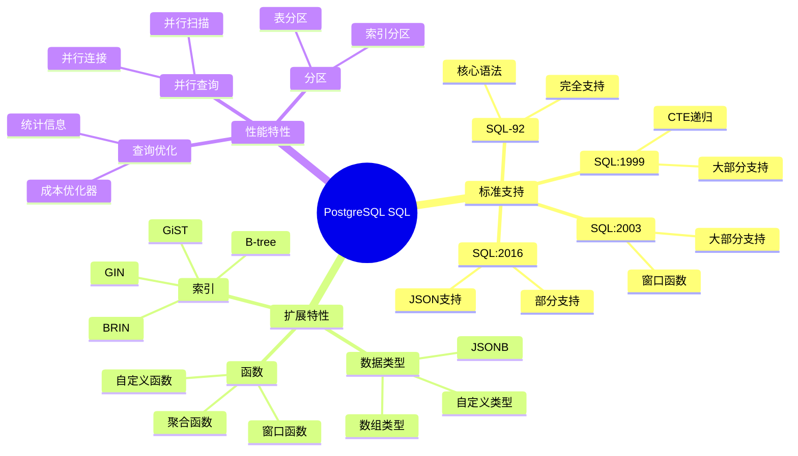

# PostgreSQL SQL实现

> **创建日期**：2025-01-15
> **最后更新**：2025-01-16
> **版本**：v1.0.0
> **难度**：⭐⭐⭐
> **应用场景**：PostgreSQL SQL标准对齐、兼容性分析

---

## 📋 目录

- [PostgreSQL SQL实现](#postgresql-sql实现)
  - [📋 目录](#-目录)
  - [一、概述](#一概述)
    - [1.1 PostgreSQL SQL特性思维导图](#11-postgresql-sql特性思维导图)
    - [1.2 PostgreSQL SQL标准支持对比矩阵](#12-postgresql-sql标准支持对比矩阵)
  - [二、SQL标准支持情况](#二sql标准支持情况)
    - [2.1 核心特性支持](#21-核心特性支持)
    - [2.2 详细特性说明](#22-详细特性说明)
      - [2.2.1 窗口函数支持](#221-窗口函数支持)
      - [2.2.2 CTE和递归查询支持](#222-cte和递归查询支持)
      - [2.2.3 JSON支持](#223-json支持)
  - [三、PostgreSQL扩展特性](#三postgresql扩展特性)
    - [3.1 数组类型](#31-数组类型)
    - [3.2 JSONB类型](#32-jsonb类型)
    - [3.3 全文搜索](#33-全文搜索)
    - [3.4 自定义类型](#34-自定义类型)
    - [3.5 扩展系统](#35-扩展系统)
  - [四、标准对齐情况](#四标准对齐情况)
    - [4.1 对齐度评估](#41-对齐度评估)
    - [4.2 标准兼容性分析](#42-标准兼容性分析)
    - [4.3 迁移建议](#43-迁移建议)
    - [4.4 最佳实践](#44-最佳实践)
  - [五、PostgreSQL 18 新特性 (2025) 🆕](#五postgresql-18-新特性-2025-)
    - [5.1 主要新增特性](#51-主要新增特性)
    - [5.2 SQL语法增强](#52-sql语法增强)
    - [5.3 pgvector 0.8+ 向量支持](#53-pgvector-08-向量支持)
  - [六、相关资源](#六相关资源)
    - [相关文档](#相关文档)
    - [外部资源](#外部资源)

---

## 一、概述

PostgreSQL是一个功能强大的开源关系数据库，对SQL标准有很好的支持。

**PostgreSQL SQL标准支持**：

- SQL-92：完全支持
- SQL:1999：大部分支持
- SQL:2003：大部分支持
- SQL:2016：部分支持（JSON等）
- SQL:2023：部分支持

### 1.1 PostgreSQL SQL特性思维导图



### 1.2 PostgreSQL SQL标准支持对比矩阵

| SQL标准版本 | 支持程度 | 核心特性 | 扩展特性 | 兼容性 |
|------------|---------|---------|---------|--------|
| **SQL-92** | ⭐⭐⭐⭐⭐ | ✅ 完全 | ✅ 完全 | ⭐⭐⭐⭐⭐ |
| **SQL:1999** | ⭐⭐⭐⭐ | ✅ 大部分 | ✅ 大部分 | ⭐⭐⭐⭐ |
| **SQL:2003** | ⭐⭐⭐⭐ | ✅ 大部分 | ✅ 大部分 | ⭐⭐⭐⭐ |
| **SQL:2016** | ⭐⭐⭐ | ✅ 部分 | ✅ 部分 | ⭐⭐⭐ |
| **SQL:2023** | ⭐⭐⭐ | ✅ 部分 | ✅ 部分 | ⭐⭐⭐ |

---

## 二、SQL标准支持情况

### 2.1 核心特性支持

| 特性 | 支持情况 | 版本要求 | 说明 |
|------|---------|---------|------|
| **基本查询** | ✅ 完全支持 | 所有版本 | SELECT、INSERT、UPDATE、DELETE完全符合标准 |
| **窗口函数** | ✅ 完全支持 | PostgreSQL 8.4+ | 支持所有标准窗口函数 |
| **CTE** | ✅ 完全支持 | PostgreSQL 8.4+ | WITH子句完全支持 |
| **递归查询** | ✅ 完全支持 | PostgreSQL 8.4+ | WITH RECURSIVE完全支持 |
| **JSON支持** | ✅ 完全支持 | PostgreSQL 9.2+ | JSON和JSONB类型，丰富的JSON函数 |
| **时态数据** | ⚠️ 部分支持 | PostgreSQL 9.2+ | 支持时间戳，但缺少标准时态表特性 |

### 2.2 详细特性说明

#### 2.2.1 窗口函数支持

**PostgreSQL窗口函数示例**：

```sql
-- 排名函数
SELECT
    student_id,
    score,
    ROW_NUMBER() OVER (ORDER BY score DESC) as row_num,
    RANK() OVER (ORDER BY score DESC) as rank,
    DENSE_RANK() OVER (ORDER BY score DESC) as dense_rank
FROM Enrollment
WHERE course_id = 1;

-- 聚合窗口函数
SELECT
    date,
    sales,
    SUM(sales) OVER (ORDER BY date) as cumulative_sales,
    AVG(sales) OVER (ROWS BETWEEN 6 PRECEDING AND CURRENT ROW) as moving_avg
FROM Sales;

-- 值函数
SELECT
    student_id,
    score,
    LAG(score, 1) OVER (ORDER BY score) as prev_score,
    LEAD(score, 1) OVER (ORDER BY score) as next_score
FROM Enrollment;
```

**支持情况**：

- ✅ 所有标准窗口函数（ROW_NUMBER、RANK、DENSE_RANK、PERCENT_RANK等）
- ✅ 聚合窗口函数（SUM、AVG、COUNT等）
- ✅ 值函数（LAG、LEAD、FIRST_VALUE、LAST_VALUE等）
- ✅ 窗口框架（ROWS、RANGE）

#### 2.2.2 CTE和递归查询支持

**CTE示例**：

```sql
-- 基本CTE
WITH high_scores AS (
    SELECT * FROM Enrollment WHERE score > 90
)
SELECT * FROM high_scores;

-- 递归CTE：组织架构查询
WITH RECURSIVE org_tree AS (
    -- 基础查询：根节点
    SELECT org_id, org_name, parent_id, 0 as level
    FROM Organization
    WHERE parent_id IS NULL

    UNION ALL

    -- 递归查询：子节点
    SELECT o.org_id, o.org_name, o.parent_id, ot.level + 1
    FROM Organization o
    JOIN org_tree ot ON o.parent_id = ot.org_id
)
SELECT * FROM org_tree;
```

**支持情况**：

- ✅ 基本CTE完全支持
- ✅ 递归CTE完全支持
- ✅ 多个CTE链式使用
- ✅ CTE在UPDATE/DELETE中使用

#### 2.2.3 JSON支持

**JSON功能示例**：

```sql
-- 创建JSON列
CREATE TABLE products (
    id SERIAL PRIMARY KEY,
    name VARCHAR(100),
    attributes JSONB
);

-- 插入JSON数据
INSERT INTO products (name, attributes) VALUES
('Laptop', '{"color": "black", "price": 999, "specs": {"cpu": "Intel i7", "ram": "16GB"}}');

-- 查询JSON数据
SELECT
    name,
    attributes->>'color' as color,
    attributes->'specs'->>'cpu' as cpu,
    (attributes->>'price')::numeric as price
FROM products
WHERE attributes @> '{"color": "black"}';

-- JSON函数
SELECT
    jsonb_pretty(attributes) as formatted_json,
    jsonb_object_keys(attributes) as keys
FROM products;
```

**支持情况**：

- ✅ JSON和JSONB数据类型
- ✅ JSON操作符（->、->>、@>、?等）
- ✅ JSON函数（jsonb_pretty、jsonb_object_keys等）
- ✅ JSON索引（GIN索引）

---

## 三、PostgreSQL扩展特性

### 3.1 数组类型

**数组类型示例**：

```sql
-- 创建数组列
CREATE TABLE students (
    id SERIAL PRIMARY KEY,
    name VARCHAR(100),
    hobbies TEXT[],
    scores INTEGER[]
);

-- 插入数组数据
INSERT INTO students (name, hobbies, scores) VALUES
('Alice', ARRAY['reading', 'swimming'], ARRAY[85, 90, 88]);

-- 查询数组
SELECT
    name,
    hobbies[1] as first_hobby,
    array_length(hobbies, 1) as hobby_count,
    unnest(scores) as score
FROM students
WHERE 'reading' = ANY(hobbies);
```

### 3.2 JSONB类型

**JSONB优势**：

- 二进制存储，查询性能更好
- 支持索引（GIN索引）
- 支持更多操作符

**JSONB索引示例**：

```sql
-- 创建GIN索引
CREATE INDEX idx_products_attributes ON products USING GIN (attributes);

-- 使用索引查询
SELECT * FROM products
WHERE attributes @> '{"color": "black"}';
```

### 3.3 全文搜索

**全文搜索示例**：

```sql
-- 创建全文搜索索引
CREATE TABLE articles (
    id SERIAL PRIMARY KEY,
    title VARCHAR(200),
    content TEXT
);

CREATE INDEX idx_articles_content ON articles USING GIN (to_tsvector('english', content));

-- 全文搜索查询
SELECT
    title,
    ts_rank(to_tsvector('english', content), query) as rank
FROM articles, to_tsquery('english', 'database & SQL') query
WHERE to_tsvector('english', content) @@ query
ORDER BY rank DESC;
```

### 3.4 自定义类型

**自定义类型示例**：

```sql
-- 创建自定义类型
CREATE TYPE address AS (
    street VARCHAR(100),
    city VARCHAR(50),
    zip_code VARCHAR(10)
);

-- 使用自定义类型
CREATE TABLE customers (
    id SERIAL PRIMARY KEY,
    name VARCHAR(100),
    address address
);

-- 插入数据
INSERT INTO customers (name, address) VALUES
('John', ROW('123 Main St', 'New York', '10001')::address);

-- 查询自定义类型
SELECT
    name,
    (address).street,
    (address).city
FROM customers;
```

### 3.5 扩展系统

**常用扩展**：

```sql
-- 安装扩展
CREATE EXTENSION IF NOT EXISTS pg_stat_statements;
CREATE EXTENSION IF NOT EXISTS pg_trgm;  -- 模糊搜索
CREATE EXTENSION IF NOT EXISTS postgis;  -- 地理空间数据

-- 查看已安装扩展
SELECT * FROM pg_extension;
```

---

## 四、标准对齐情况

### 4.1 对齐度评估

**标准对齐度**：⭐⭐⭐⭐⭐（5/5）

PostgreSQL对SQL标准有很好的支持，是SQL标准实现最好的开源数据库之一。

### 4.2 标准兼容性分析

**SQL-92兼容性**：✅ 完全兼容

- 所有核心语法完全支持
- 数据类型完全支持
- 完整性约束完全支持

**SQL:1999兼容性**：✅ 大部分兼容

- CTE和递归查询完全支持
- 触发器支持
- 存储过程支持

**SQL:2003兼容性**：✅ 大部分兼容

- 窗口函数完全支持
- MERGE语句支持
- 序列支持

**SQL:2016兼容性**：⚠️ 部分兼容

- JSON支持（使用JSONB扩展）
- 行模式匹配（MATCH_RECOGNIZE）不支持

**SQL:2023兼容性**：⚠️ 部分兼容

- JSON增强功能部分支持
- 时态数据增强部分支持

### 4.3 迁移建议

**从其他数据库迁移到PostgreSQL**：

1. **从MySQL迁移**：
   - 注意数据类型差异（MySQL的AUTO_INCREMENT → PostgreSQL的SERIAL）
   - 注意字符串比较的差异（MySQL不区分大小写，PostgreSQL区分）
   - 注意日期时间函数的差异

2. **从SQL Server迁移**：
   - T-SQL语法需要转换为标准SQL
   - 注意TOP子句 → LIMIT的转换
   - 注意日期时间函数的差异

3. **从SQLite迁移**：
   - 注意动态类型系统的差异
   - 注意并发控制的差异
   - 注意数据类型映射

### 4.4 最佳实践

**PostgreSQL SQL最佳实践**：

1. **使用参数化查询**：

   ```sql
   -- 推荐：使用参数化查询
   PREPARE get_student(INTEGER) AS
   SELECT * FROM Student WHERE student_id = $1;

   EXECUTE get_student(1);
   ```

2. **合理使用索引**：

   ```sql
   -- 创建复合索引
   CREATE INDEX idx_enrollment_course_score
   ON Enrollment(course_id, score DESC);
   ```

3. **使用EXPLAIN分析查询**：

   ```sql
   EXPLAIN ANALYZE
   SELECT * FROM Student WHERE major = 'CS';
   ```

4. **使用事务**：

   ```sql
   BEGIN;
   UPDATE Account SET balance = balance - 100 WHERE id = 1;
   UPDATE Account SET balance = balance + 100 WHERE id = 2;
   COMMIT;
   ```

---

## 五、PostgreSQL 18 新特性 (2025) 🆕

### 5.1 主要新增特性

| 特性 | 说明 | 示例 |
|------|------|------|
| **虚拟生成列** | 查询时计算，不存储 | `GENERATED ALWAYS AS (...) VIRTUAL` |
| **增量备份** | pg_basebackup增强 | `pg_basebackup --incremental` |
| **JSON增强** | jsonb_path_query改进 | 更强大的JSONPath支持 |
| **并行查询** | 更多操作支持并行 | 并行聚合、并行HashJoin |
| **逻辑复制** | 复制功能增强 | 支持更多DDL同步 |

### 5.2 SQL语法增强

```sql
-- PostgreSQL 18: 虚拟生成列
CREATE TABLE orders (
    quantity INTEGER,
    price DECIMAL(10,2),
    total DECIMAL(12,2) GENERATED ALWAYS AS (quantity * price) VIRTUAL
);

-- PostgreSQL 18: 递归CTE CYCLE检测
WITH RECURSIVE traverse AS (
    SELECT id, parent_id, ARRAY[id] AS path FROM tree WHERE parent_id IS NULL
    UNION ALL
    SELECT t.id, t.parent_id, tr.path || t.id
    FROM tree t JOIN traverse tr ON t.parent_id = tr.id
)
CYCLE id SET is_cycle USING path
SELECT * FROM traverse WHERE NOT is_cycle;

-- PostgreSQL 18: MERGE语句增强
MERGE INTO target t
USING source s ON t.id = s.id
WHEN MATCHED AND s.deleted THEN DELETE
WHEN MATCHED THEN UPDATE SET value = s.value
WHEN NOT MATCHED THEN INSERT (id, value) VALUES (s.id, s.value);
```

### 5.3 pgvector 0.8+ 向量支持

```sql
-- 创建向量表
CREATE TABLE documents (
    id SERIAL PRIMARY KEY,
    content TEXT,
    embedding vector(1536)
);

-- HNSW索引（高性能近似搜索）
CREATE INDEX ON documents USING hnsw (embedding vector_cosine_ops);

-- 向量相似度搜索
SELECT id, content, 1 - (embedding <=> '[0.1,0.2,...]'::vector) AS similarity
FROM documents
ORDER BY embedding <=> '[0.1,0.2,...]'::vector
LIMIT 10;
```

---

## 六、相关资源

### 相关文档

- [数据库SQL标准对比矩阵](./06.05-数据库SQL标准对比矩阵.md)
- [事务理论](../01-理论基础/01.05-事务理论.md) - PostgreSQL隔离级别实现

### 外部资源

- [PostgreSQL 18 Release Notes](https://www.postgresql.org/docs/18/release-18.html)
- [pgvector](https://github.com/pgvector/pgvector)

---

**维护者**: SQL Standards Team
**最后更新**: 2025-12-01
