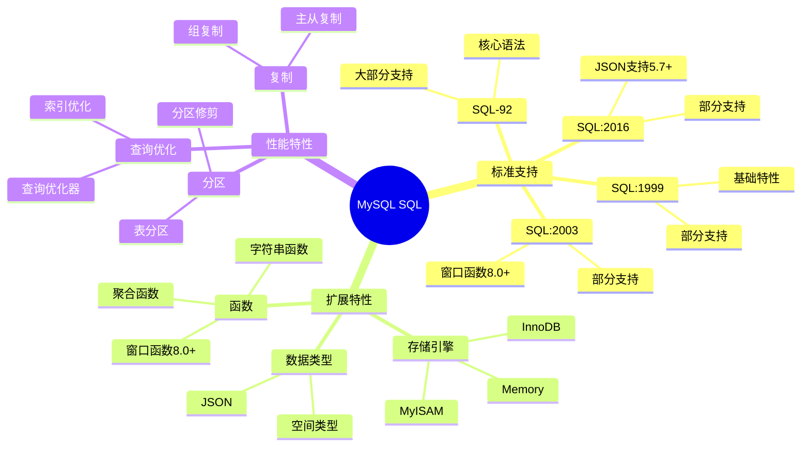

# MySQL SQL实现

> **创建日期**：2025-01-15
> **最后更新**：2025-01-15
> **版本**：v1.0.0
> **难度**：⭐⭐⭐
> **应用场景**：MySQL SQL标准对齐、兼容性分析

---

## 📋 目录

- [MySQL SQL实现](#mysql-sql实现)
  - [📋 目录](#-目录)
  - [一、概述](#一概述)
    - [1.1 MySQL SQL特性思维导图](#11-mysql-sql特性思维导图)
    - [1.2 MySQL SQL标准支持对比矩阵](#12-mysql-sql标准支持对比矩阵)
  - [二、SQL标准支持情况](#二sql标准支持情况)
    - [2.1 核心特性支持](#21-核心特性支持)
    - [2.2 详细特性说明](#22-详细特性说明)
      - [2.2.1 窗口函数支持（MySQL 8.0+）](#221-窗口函数支持mysql-80)
      - [2.2.2 CTE和递归查询支持（MySQL 8.0+）](#222-cte和递归查询支持mysql-80)
      - [2.2.3 JSON支持（MySQL 5.7+）](#223-json支持mysql-57)
  - [三、MySQL扩展特性](#三mysql扩展特性)
    - [3.1 存储引擎系统](#31-存储引擎系统)
    - [3.2 全文搜索](#32-全文搜索)
    - [3.3 分区表](#33-分区表)
  - [四、标准对齐情况](#四标准对齐情况)
    - [4.1 对齐度评估](#41-对齐度评估)
    - [4.2 标准兼容性分析](#42-标准兼容性分析)
    - [4.3 MySQL特有特性](#43-mysql特有特性)
    - [4.4 迁移建议](#44-迁移建议)
    - [4.5 最佳实践](#45-最佳实践)
  - [五、相关资源](#五相关资源)
    - [相关文档](#相关文档)

---

## 一、概述

MySQL是流行的开源关系数据库，对SQL标准有较好的支持。

**MySQL SQL标准支持**：

- SQL-92：大部分支持
- SQL:1999：部分支持
- SQL:2003：部分支持
- SQL:2016：部分支持（JSON等）
- SQL:2023：部分支持

### 1.1 MySQL SQL特性思维导图



### 1.2 MySQL SQL标准支持对比矩阵

| SQL标准版本 | 支持程度 | 核心特性 | 扩展特性 | 版本要求 |
|------------|---------|---------|---------|---------|
| **SQL-92** | ⭐⭐⭐⭐ | ✅ 大部分 | ✅ 大部分 | 所有版本 |
| **SQL:1999** | ⭐⭐⭐ | ✅ 部分 | ✅ 部分 | 5.0+ |
| **SQL:2003** | ⭐⭐⭐ | ✅ 部分 | ✅ 部分 | 8.0+ |
| **SQL:2016** | ⭐⭐⭐ | ✅ 部分 | ✅ 部分 | 5.7+ |
| **SQL:2023** | ⭐⭐⭐ | ✅ 部分 | ✅ 部分 | 8.0+ |

---

## 二、SQL标准支持情况

### 2.1 核心特性支持

| 特性 | 支持情况 | 版本要求 | 说明 |
|------|---------|---------|------|
| **基本查询** | ✅ 完全支持 | 所有版本 | SELECT、INSERT、UPDATE、DELETE完全支持 |
| **窗口函数** | ✅ 完全支持 | MySQL 8.0+ | 支持所有标准窗口函数 |
| **CTE** | ✅ 完全支持 | MySQL 8.0+ | WITH子句完全支持 |
| **递归查询** | ✅ 完全支持 | MySQL 8.0+ | WITH RECURSIVE完全支持 |
| **JSON支持** | ✅ 完全支持 | MySQL 5.7+ | JSON数据类型和丰富的JSON函数 |
| **时态数据** | ❌ 不支持 | - | 不支持标准时态表特性 |

### 2.2 详细特性说明

#### 2.2.1 窗口函数支持（MySQL 8.0+）

**窗口函数示例**：

```sql
-- 排名函数
SELECT
    student_id,
    score,
    ROW_NUMBER() OVER (ORDER BY score DESC) as row_num,
    RANK() OVER (ORDER BY score DESC) as rank,
    DENSE_RANK() OVER (ORDER BY score DESC) as dense_rank
FROM Enrollment
WHERE course_id = 1;

-- 聚合窗口函数
SELECT
    date,
    sales,
    SUM(sales) OVER (ORDER BY date) as cumulative_sales,
    AVG(sales) OVER (ROWS BETWEEN 6 PRECEDING AND CURRENT ROW) as moving_avg
FROM Sales;

-- 值函数
SELECT
    student_id,
    score,
    LAG(score, 1) OVER (ORDER BY score) as prev_score,
    LEAD(score, 1) OVER (ORDER BY score) as next_score
FROM Enrollment;
```

**版本差异**：

- MySQL 8.0之前：不支持窗口函数
- MySQL 8.0+：完全支持标准窗口函数

#### 2.2.2 CTE和递归查询支持（MySQL 8.0+）

**CTE示例**：

```sql
-- 基本CTE
WITH high_scores AS (
    SELECT * FROM Enrollment WHERE score > 90
)
SELECT * FROM high_scores;

-- 递归CTE：组织架构查询
WITH RECURSIVE org_tree AS (
    -- 基础查询：根节点
    SELECT org_id, org_name, parent_id, 0 as level
    FROM Organization
    WHERE parent_id IS NULL

    UNION ALL

    -- 递归查询：子节点
    SELECT o.org_id, o.org_name, o.parent_id, ot.level + 1
    FROM Organization o
    JOIN org_tree ot ON o.parent_id = ot.org_id
)
SELECT * FROM org_tree;
```

**版本差异**：

- MySQL 8.0之前：不支持CTE
- MySQL 8.0+：完全支持CTE和递归查询

#### 2.2.3 JSON支持（MySQL 5.7+）

**JSON功能示例**：

```sql
-- 创建JSON列
CREATE TABLE products (
    id INT AUTO_INCREMENT PRIMARY KEY,
    name VARCHAR(100),
    attributes JSON
);

-- 插入JSON数据
INSERT INTO products (name, attributes) VALUES
('Laptop', '{"color": "black", "price": 999, "specs": {"cpu": "Intel i7", "ram": "16GB"}}');

-- 查询JSON数据
SELECT
    name,
    JSON_EXTRACT(attributes, '$.color') as color,
    JSON_EXTRACT(attributes, '$.specs.cpu') as cpu,
    attributes->>'$.price' as price
FROM products
WHERE JSON_EXTRACT(attributes, '$.color') = 'black';

-- JSON函数
SELECT
    JSON_PRETTY(attributes) as formatted_json,
    JSON_KEYS(attributes) as keys
FROM products;
```

**JSON函数支持**：

- ✅ JSON_EXTRACT / -> / ->>：提取JSON值
- ✅ JSON_OBJECT：创建JSON对象
- ✅ JSON_ARRAY：创建JSON数组
- ✅ JSON_PRETTY：格式化JSON
- ✅ JSON_KEYS：获取JSON键

---

## 三、MySQL扩展特性

### 3.1 存储引擎系统

**存储引擎对比**：

| 存储引擎 | 事务支持 | 外键支持 | 全文索引 | 适用场景 |
|---------|---------|---------|---------|---------|
| **InnoDB** | ✅ | ✅ | ✅ | 默认引擎，事务应用 |
| **MyISAM** | ❌ | ❌ | ✅ | 只读应用，日志表 |
| **Memory** | ❌ | ❌ | ❌ | 临时表，缓存 |

**InnoDB特性示例**：

```sql
-- 创建InnoDB表
CREATE TABLE accounts (
    id INT AUTO_INCREMENT PRIMARY KEY,
    account_number VARCHAR(20) UNIQUE,
    balance DECIMAL(10,2),
    INDEX idx_account_number (account_number)
) ENGINE=InnoDB;

-- 事务示例
START TRANSACTION;
UPDATE accounts SET balance = balance - 100 WHERE id = 1;
UPDATE accounts SET balance = balance + 100 WHERE id = 2;
COMMIT;
```

### 3.2 全文搜索

**全文搜索示例**：

```sql
-- 创建全文索引
CREATE TABLE articles (
    id INT AUTO_INCREMENT PRIMARY KEY,
    title VARCHAR(200),
    content TEXT,
    FULLTEXT INDEX idx_content (content)
) ENGINE=InnoDB;

-- 全文搜索查询
SELECT
    title,
    MATCH(content) AGAINST('database SQL' IN NATURAL LANGUAGE MODE) as relevance
FROM articles
WHERE MATCH(content) AGAINST('database SQL' IN NATURAL LANGUAGE MODE)
ORDER BY relevance DESC;
```

### 3.3 分区表

**分区表示例**：

```sql
-- 创建范围分区表
CREATE TABLE sales (
    id INT AUTO_INCREMENT,
    sale_date DATE,
    amount DECIMAL(10,2),
    PRIMARY KEY (id, sale_date)
) PARTITION BY RANGE (YEAR(sale_date)) (
    PARTITION p2020 VALUES LESS THAN (2021),
    PARTITION p2021 VALUES LESS THAN (2022),
    PARTITION p2022 VALUES LESS THAN (2023),
    PARTITION p2023 VALUES LESS THAN (2024),
    PARTITION pmax VALUES LESS THAN MAXVALUE
);

-- 查询特定分区
SELECT * FROM sales PARTITION (p2023);
```

---

## 四、标准对齐情况

### 4.1 对齐度评估

**标准对齐度**：⭐⭐⭐⭐（4/5）

MySQL对SQL标准有较好的支持，但在某些高级特性上支持有限。

### 4.2 标准兼容性分析

**SQL-92兼容性**：✅ 大部分兼容

- 核心语法大部分支持
- 某些特性有差异（如字符串比较）

**SQL:1999兼容性**：⚠️ 部分兼容

- CTE和递归查询（MySQL 8.0+）
- 触发器支持
- 存储过程支持

**SQL:2003兼容性**：⚠️ 部分兼容

- 窗口函数（MySQL 8.0+）
- MERGE语句支持
- 序列不支持（使用AUTO_INCREMENT）

**SQL:2016兼容性**：⚠️ 部分兼容

- JSON支持（MySQL 5.7+）
- 行模式匹配不支持

**SQL:2023兼容性**：⚠️ 部分兼容

- JSON增强功能部分支持
- 时态数据不支持

### 4.3 MySQL特有特性

**AUTO_INCREMENT**：

```sql
-- MySQL的AUTO_INCREMENT（非标准）
CREATE TABLE students (
    id INT AUTO_INCREMENT PRIMARY KEY,
    name VARCHAR(100)
);

-- 标准SQL使用SERIAL或IDENTITY
-- PostgreSQL: id SERIAL PRIMARY KEY
-- SQL Server: id INT IDENTITY(1,1) PRIMARY KEY
```

**LIMIT子句**：

```sql
-- MySQL的LIMIT（非标准，但被广泛采用）
SELECT * FROM Student LIMIT 10 OFFSET 20;

-- 标准SQL使用FETCH FIRST
-- SELECT * FROM Student OFFSET 20 ROWS FETCH FIRST 10 ROWS ONLY;
```

### 4.4 迁移建议

**从MySQL迁移到其他数据库**：

1. **迁移到PostgreSQL**：
   - AUTO_INCREMENT → SERIAL
   - LIMIT → FETCH FIRST
   - 注意字符串比较的差异
   - 注意日期时间函数的差异

2. **迁移到SQL Server**：
   - AUTO_INCREMENT → IDENTITY
   - LIMIT → TOP或FETCH FIRST
   - 注意数据类型映射

**从其他数据库迁移到MySQL**：

1. **从PostgreSQL迁移**：
   - SERIAL → AUTO_INCREMENT
   - 注意窗口函数版本要求（MySQL 8.0+）
   - 注意CTE版本要求（MySQL 8.0+）

2. **从SQL Server迁移**：
   - IDENTITY → AUTO_INCREMENT
   - TOP → LIMIT
   - 注意T-SQL语法转换

### 4.5 最佳实践

**MySQL SQL最佳实践**：

1. **使用InnoDB存储引擎**：

   ```sql
   CREATE TABLE table_name (
       ...
   ) ENGINE=InnoDB;
   ```

2. **合理使用索引**：

   ```sql
   -- 创建复合索引
   CREATE INDEX idx_enrollment_course_score
   ON Enrollment(course_id, score DESC);
   ```

3. **使用EXPLAIN分析查询**：

   ```sql
   EXPLAIN SELECT * FROM Student WHERE major = 'CS';
   ```

4. **使用参数化查询**：

   ```sql
   PREPARE stmt FROM 'SELECT * FROM Student WHERE student_id = ?';
   SET @id = 1;
   EXECUTE stmt USING @id;
   ```

---

## 五、相关资源

### 相关文档

- [数据库SQL标准对比矩阵](./06.05-数据库SQL标准对比矩阵.md) - 数据库对比

---

**维护者**: SQL Standards Team
**最后更新**: 2025-01-15
