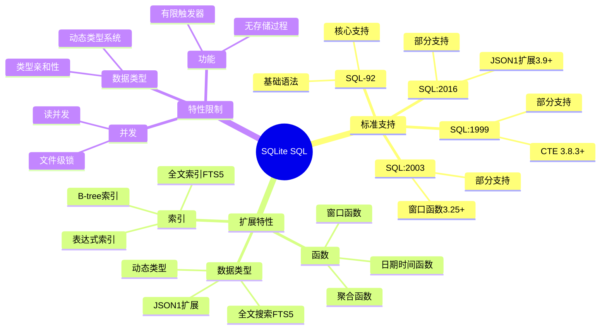

# SQLite SQL实现

> **创建日期**：2025-01-15
> **最后更新**：2025-01-16
> **版本**：v1.0.0
> **难度**：⭐⭐⭐
> **应用场景**：SQLite SQL标准对齐、兼容性分析

---

## 📋 目录

- [SQLite SQL实现](#sqlite-sql实现)
  - [📋 目录](#-目录)
  - [一、概述](#一概述)
    - [1.1 SQLite SQL特性思维导图](#11-sqlite-sql特性思维导图)
    - [1.2 SQLite SQL标准支持对比矩阵](#12-sqlite-sql标准支持对比矩阵)
  - [二、SQL标准支持情况](#二sql标准支持情况)
    - [2.1 核心特性支持](#21-核心特性支持)
    - [2.2 详细特性说明](#22-详细特性说明)
      - [2.2.1 窗口函数支持（SQLite 3.25+）](#221-窗口函数支持sqlite-325)
      - [2.2.2 CTE和递归查询支持（SQLite 3.8.3+）](#222-cte和递归查询支持sqlite-383)
      - [2.2.3 JSON支持（SQLite 3.9+）](#223-json支持sqlite-39)
  - [三、SQLite扩展特性](#三sqlite扩展特性)
    - [3.1 动态类型系统](#31-动态类型系统)
    - [3.2 FTS5全文搜索](#32-fts5全文搜索)
    - [3.3 表达式索引](#33-表达式索引)
    - [3.4 生成列（Generated Columns）](#34-生成列generated-columns)
  - [四、标准对齐情况](#四标准对齐情况)
    - [4.1 对齐度评估](#41-对齐度评估)
    - [4.2 标准兼容性分析](#42-标准兼容性分析)
    - [4.3 SQLite特有特性](#43-sqlite特有特性)
    - [4.4 迁移建议](#44-迁移建议)
    - [4.5 最佳实践](#45-最佳实践)
  - [五、相关资源](#五相关资源)
    - [相关文档](#相关文档)

---

## 一、概述

SQLite是轻量级嵌入式数据库，对SQL标准有基础支持。

**SQLite SQL标准支持**：

- SQL-92：核心支持
- SQL:1999：部分支持
- SQL:2003：部分支持
- SQL:2016：部分支持（JSON等）
- SQL:2023：部分支持

### 1.1 SQLite SQL特性思维导图



### 1.2 SQLite SQL标准支持对比矩阵

| SQL标准版本 | 支持程度 | 核心特性 | 扩展特性 | 版本要求 |
|------------|---------|---------|---------|---------|
| **SQL-92** | ⭐⭐⭐ | ✅ 核心 | ✅ 核心 | 所有版本 |
| **SQL:1999** | ⭐⭐⭐ | ✅ 部分 | ✅ 部分 | 3.8.3+ |
| **SQL:2003** | ⭐⭐⭐ | ✅ 部分 | ✅ 部分 | 3.25+ |
| **SQL:2016** | ⭐⭐⭐ | ✅ 部分 | ✅ 部分 | 3.9+ |
| **SQL:2023** | ⭐⭐ | ✅ 部分 | ✅ 部分 | 3.38+ |

---

## 二、SQL标准支持情况

### 2.1 核心特性支持

| 特性 | 支持情况 | 版本要求 | 说明 |
|------|---------|---------|------|
| **基本查询** | ✅ 完全支持 | 所有版本 | SELECT、INSERT、UPDATE、DELETE完全支持 |
| **窗口函数** | ✅ 完全支持 | SQLite 3.25+ | 支持所有标准窗口函数 |
| **CTE** | ✅ 完全支持 | SQLite 3.8.3+ | WITH子句完全支持 |
| **递归查询** | ✅ 完全支持 | SQLite 3.8.3+ | WITH RECURSIVE完全支持 |
| **JSON支持** | ✅ 完全支持 | SQLite 3.9+ | JSON1扩展提供JSON支持 |
| **时态数据** | ⚠️ 部分支持 | SQLite 3.0+ | 支持时间戳，但缺少标准时态表特性 |

### 2.2 详细特性说明

#### 2.2.1 窗口函数支持（SQLite 3.25+）

**窗口函数示例**：

```sql
-- 排名函数
SELECT
    student_id,
    score,
    ROW_NUMBER() OVER (ORDER BY score DESC) as row_num,
    RANK() OVER (ORDER BY score DESC) as rank,
    DENSE_RANK() OVER (ORDER BY score DESC) as dense_rank
FROM Enrollment
WHERE course_id = 1;

-- 聚合窗口函数
SELECT
    date,
    sales,
    SUM(sales) OVER (ORDER BY date) as cumulative_sales,
    AVG(sales) OVER (ROWS BETWEEN 6 PRECEDING AND CURRENT ROW) as moving_avg
FROM Sales;
```

**版本要求**：

- SQLite 3.25.0+：支持窗口函数
- 之前版本：不支持窗口函数

#### 2.2.2 CTE和递归查询支持（SQLite 3.8.3+）

**CTE示例**：

```sql
-- 基本CTE
WITH high_scores AS (
    SELECT * FROM Enrollment WHERE score > 90
)
SELECT * FROM high_scores;

-- 递归CTE：组织架构查询
WITH RECURSIVE org_tree AS (
    -- 基础查询：根节点
    SELECT org_id, org_name, parent_id, 0 as level
    FROM Organization
    WHERE parent_id IS NULL

    UNION ALL

    -- 递归查询：子节点
    SELECT o.org_id, o.org_name, o.parent_id, ot.level + 1
    FROM Organization o
    JOIN org_tree ot ON o.parent_id = ot.org_id
)
SELECT * FROM org_tree;
```

#### 2.2.3 JSON支持（SQLite 3.9+）

**JSON1扩展示例**：

```sql
-- 加载JSON1扩展（默认已加载）
-- .load json1

-- 创建表（JSON存储为TEXT）
CREATE TABLE products (
    id INTEGER PRIMARY KEY,
    name TEXT,
    attributes TEXT  -- JSON存储为TEXT
);

-- 插入JSON数据
INSERT INTO products (name, attributes) VALUES
('Laptop', '{"color": "black", "price": 999, "specs": {"cpu": "Intel i7", "ram": "16GB"}}');

-- 查询JSON数据
SELECT
    name,
    json_extract(attributes, '$.color') as color,
    json_extract(attributes, '$.specs.cpu') as cpu,
    json_extract(attributes, '$.price') as price
FROM products
WHERE json_extract(attributes, '$.color') = 'black';

-- JSON函数
SELECT
    json(attributes) as json_object,
    json_array(1, 2, 3) as json_array,
    json_object('key', 'value') as json_obj
FROM products;
```

**JSON1扩展函数**：

- ✅ json()：创建JSON对象
- ✅ json_array()：创建JSON数组
- ✅ json_extract()：提取JSON值
- ✅ json_insert()：插入JSON值
- ✅ json_replace()：替换JSON值
- ✅ json_set()：设置JSON值
- ✅ json_remove()：删除JSON值

---

## 三、SQLite扩展特性

### 3.1 动态类型系统

**SQLite类型系统**：

SQLite使用动态类型系统，列可以存储任何类型的数据。

**类型亲和性**：

| 声明类型 | 类型亲和性 | 说明 |
|---------|-----------|------|
| INTEGER | INTEGER | 整数类型 |
| TEXT | TEXT | 文本类型 |
| REAL | REAL | 浮点数类型 |
| BLOB | BLOB | 二进制类型 |
| NUMERIC | NUMERIC | 数值类型 |

**示例**：

```sql
-- SQLite允许在INTEGER列中存储文本
CREATE TABLE test (
    id INTEGER,
    value TEXT
);

-- 可以插入任何类型的数据
INSERT INTO test VALUES (1, 'text');
INSERT INTO test VALUES ('2', 123);  -- 字符串'2'会被转换为整数2
INSERT INTO test VALUES (3.5, 'text');  -- 3.5会被转换为整数3
```

### 3.2 FTS5全文搜索

**FTS5全文搜索示例**：

```sql
-- 创建FTS5虚拟表
CREATE VIRTUAL TABLE articles USING fts5(
    title,
    content
);

-- 插入数据
INSERT INTO articles (title, content) VALUES
('SQL Tutorial', 'This is a comprehensive SQL tutorial'),
('Database Design', 'Learn about database design principles');

-- 全文搜索
SELECT
    title,
    rank
FROM articles
WHERE articles MATCH 'SQL tutorial'
ORDER BY rank;
```

### 3.3 表达式索引

**表达式索引示例**：

```sql
-- 创建表达式索引
CREATE INDEX idx_student_name_upper
ON Student(UPPER(name));

-- 使用表达式索引查询
SELECT * FROM Student
WHERE UPPER(name) = 'ALICE';
```

### 3.4 生成列（Generated Columns）

**生成列示例**：

```sql
-- 创建生成列
CREATE TABLE products (
    id INTEGER PRIMARY KEY,
    name TEXT,
    price REAL,
    tax_rate REAL,
    total_price REAL GENERATED ALWAYS AS (price * (1 + tax_rate)) STORED
);

-- 插入数据（total_price自动计算）
INSERT INTO products (name, price, tax_rate) VALUES
('Laptop', 1000, 0.1);  -- total_price自动为1100
```

---

## 四、标准对齐情况

### 4.1 对齐度评估

**标准对齐度**：⭐⭐⭐（3/5）

SQLite对SQL标准有基础支持，适合轻量级应用。

### 4.2 标准兼容性分析

**SQL-92兼容性**：✅ 核心兼容

- 核心语法支持
- 动态类型系统与标准不同
- 某些特性不支持（如外键需要启用）

**SQL:1999兼容性**：⚠️ 部分兼容

- CTE和递归查询（SQLite 3.8.3+）
- 触发器支持（有限）
- 存储过程不支持

**SQL:2003兼容性**：⚠️ 部分兼容

- 窗口函数（SQLite 3.25+）
- MERGE语句不支持

**SQL:2016兼容性**：⚠️ 部分兼容

- JSON支持（SQLite 3.9+，通过JSON1扩展）
- 行模式匹配不支持

**SQL:2023兼容性**：⚠️ 部分兼容

- JSON增强功能部分支持
- 时态数据不支持

### 4.3 SQLite特有特性

**动态类型系统**：

- SQLite使用动态类型，与标准SQL的静态类型不同
- 列可以存储任何类型的数据
- 类型亲和性用于优化存储

**文件级锁**：

- SQLite使用文件级锁，而不是行级锁
- 支持读并发，写操作会锁定整个数据库文件
- 适合读多写少的场景

**无服务器架构**：

- SQLite是嵌入式数据库，不需要独立的服务器进程
- 数据库存储在单个文件中
- 适合移动应用、桌面应用等场景

### 4.4 迁移建议

**从SQLite迁移到其他数据库**：

1. **迁移到PostgreSQL**：
   - 注意类型系统的差异（动态类型 → 静态类型）
   - 注意并发控制的差异（文件锁 → 行级锁）
   - 注意外键需要显式启用

2. **迁移到MySQL**：
   - 注意类型系统的差异
   - 注意AUTO_INCREMENT的使用
   - 注意LIMIT子句的使用

**从其他数据库迁移到SQLite**：

1. **从PostgreSQL迁移**：
   - 注意类型系统的差异
   - 注意并发控制的限制
   - 注意某些高级特性不支持

2. **从MySQL迁移**：
   - 注意类型系统的差异
   - 注意AUTO_INCREMENT的使用
   - 注意存储引擎的差异

### 4.5 最佳实践

**SQLite SQL最佳实践**：

1. **启用外键约束**：

   ```sql
   PRAGMA foreign_keys = ON;
   ```

2. **使用WAL模式提高并发**：

   ```sql
   PRAGMA journal_mode = WAL;
   ```

3. **合理使用索引**：

   ```sql
   CREATE INDEX idx_student_major ON Student(major);
   ```

4. **使用事务**：

   ```sql
   BEGIN TRANSACTION;
   -- 多个操作
   COMMIT;
   ```

5. **使用参数化查询**：

   ```sql
   -- 使用参数化查询防止SQL注入
   SELECT * FROM Student WHERE student_id = ?;
   ```

---

## 五、相关资源

### 相关文档

- [数据库SQL标准对比矩阵](./06.05-数据库SQL标准对比矩阵.md) - 数据库对比

---

**维护者**: SQL Standards Team
**最后更新**: 2025-01-16
