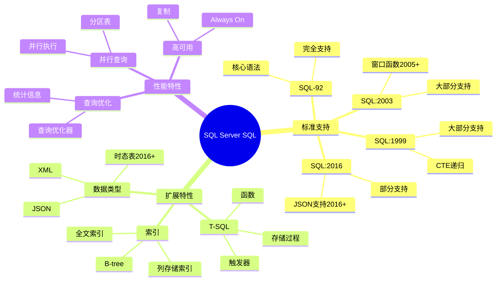

# SQL Server SQL实现

> **创建日期**：2025-01-15
> **最后更新**：2025-01-15
> **版本**：v1.0.0
> **难度**：⭐⭐⭐
> **应用场景**：SQL Server SQL标准对齐、兼容性分析

---

## 📋 目录

- [SQL Server SQL实现](#sql-server-sql实现)
  - [📋 目录](#-目录)
  - [一、概述](#一概述)
    - [1.1 SQL Server SQL特性思维导图](#11-sql-server-sql特性思维导图)
    - [1.2 SQL Server SQL标准支持对比矩阵](#12-sql-server-sql标准支持对比矩阵)
  - [二、SQL标准支持情况](#二sql标准支持情况)
    - [2.1 核心特性支持](#21-核心特性支持)
    - [2.2 详细特性说明](#22-详细特性说明)
      - [2.2.1 窗口函数支持（SQL Server 2005+）](#221-窗口函数支持sql-server-2005)
      - [2.2.2 CTE和递归查询支持（SQL Server 2005+）](#222-cte和递归查询支持sql-server-2005)
      - [2.2.3 JSON支持（SQL Server 2016+）](#223-json支持sql-server-2016)
      - [2.2.4 时态数据支持（SQL Server 2016+）](#224-时态数据支持sql-server-2016)
  - [三、SQL Server扩展特性](#三sql-server扩展特性)
    - [3.1 T-SQL语言](#31-t-sql语言)
    - [3.2 XML支持](#32-xml支持)
    - [3.3 列存储索引](#33-列存储索引)
    - [3.4 分区表](#34-分区表)
  - [四、标准对齐情况](#四标准对齐情况)
    - [4.1 对齐度评估](#41-对齐度评估)
    - [4.2 标准兼容性分析](#42-标准兼容性分析)
    - [4.3 T-SQL特有特性](#43-t-sql特有特性)
    - [4.4 迁移建议](#44-迁移建议)
    - [4.5 最佳实践](#45-最佳实践)
  - [五、相关资源](#五相关资源)
    - [相关文档](#相关文档)

---

## 一、概述

SQL Server是Microsoft的企业级关系数据库，对SQL标准有很好的支持。

**SQL Server SQL标准支持**：

- SQL-92：完全支持
- SQL:1999：大部分支持
- SQL:2003：大部分支持
- SQL:2016：部分支持（JSON等）
- SQL:2023：部分支持

### 1.1 SQL Server SQL特性思维导图



### 1.2 SQL Server SQL标准支持对比矩阵

| SQL标准版本 | 支持程度 | 核心特性 | 扩展特性 | 版本要求 |
|------------|---------|---------|---------|---------|
| **SQL-92** | ⭐⭐⭐⭐⭐ | ✅ 完全 | ✅ 完全 | 所有版本 |
| **SQL:1999** | ⭐⭐⭐⭐ | ✅ 大部分 | ✅ 大部分 | 2000+ |
| **SQL:2003** | ⭐⭐⭐⭐ | ✅ 大部分 | ✅ 大部分 | 2005+ |
| **SQL:2016** | ⭐⭐⭐⭐ | ✅ 部分 | ✅ 部分 | 2016+ |
| **SQL:2023** | ⭐⭐⭐ | ✅ 部分 | ✅ 部分 | 2022+ |

---

## 二、SQL标准支持情况

### 2.1 核心特性支持

| 特性 | 支持情况 | 版本要求 | 说明 |
|------|---------|---------|------|
| **基本查询** | ✅ 完全支持 | 所有版本 | SELECT、INSERT、UPDATE、DELETE完全支持 |
| **窗口函数** | ✅ 完全支持 | SQL Server 2005+ | 支持所有标准窗口函数 |
| **CTE** | ✅ 完全支持 | SQL Server 2005+ | WITH子句完全支持 |
| **递归查询** | ✅ 完全支持 | SQL Server 2005+ | WITH RECURSIVE完全支持 |
| **JSON支持** | ✅ 完全支持 | SQL Server 2016+ | JSON数据类型和丰富的JSON函数 |
| **时态数据** | ✅ 完全支持 | SQL Server 2016+ | 时态表完全支持 |

### 2.2 详细特性说明

#### 2.2.1 窗口函数支持（SQL Server 2005+）

**窗口函数示例**：

```sql
-- 排名函数
SELECT
    student_id,
    score,
    ROW_NUMBER() OVER (ORDER BY score DESC) as row_num,
    RANK() OVER (ORDER BY score DESC) as rank,
    DENSE_RANK() OVER (ORDER BY score DESC) as dense_rank
FROM Enrollment
WHERE course_id = 1;

-- 聚合窗口函数
SELECT
    date,
    sales,
    SUM(sales) OVER (ORDER BY date) as cumulative_sales,
    AVG(sales) OVER (ROWS BETWEEN 6 PRECEDING AND CURRENT ROW) as moving_avg
FROM Sales;

-- 值函数
SELECT
    student_id,
    score,
    LAG(score, 1) OVER (ORDER BY score) as prev_score,
    LEAD(score, 1) OVER (ORDER BY score) as next_score
FROM Enrollment;
```

**支持情况**：

- ✅ 所有标准窗口函数
- ✅ 聚合窗口函数
- ✅ 值函数
- ✅ 窗口框架（ROWS、RANGE）

#### 2.2.2 CTE和递归查询支持（SQL Server 2005+）

**CTE示例**：

```sql
-- 基本CTE
WITH high_scores AS (
    SELECT * FROM Enrollment WHERE score > 90
)
SELECT * FROM high_scores;

-- 递归CTE：组织架构查询
WITH org_tree AS (
    -- 基础查询：根节点
    SELECT org_id, org_name, parent_id, 0 as level
    FROM Organization
    WHERE parent_id IS NULL

    UNION ALL

    -- 递归查询：子节点
    SELECT o.org_id, o.org_name, o.parent_id, ot.level + 1
    FROM Organization o
    JOIN org_tree ot ON o.parent_id = ot.org_id
)
SELECT * FROM org_tree;
```

#### 2.2.3 JSON支持（SQL Server 2016+）

**JSON功能示例**：

```sql
-- 创建JSON列
CREATE TABLE products (
    id INT IDENTITY(1,1) PRIMARY KEY,
    name NVARCHAR(100),
    attributes NVARCHAR(MAX)  -- JSON存储为NVARCHAR(MAX)
);

-- 插入JSON数据
INSERT INTO products (name, attributes) VALUES
('Laptop', '{"color": "black", "price": 999, "specs": {"cpu": "Intel i7", "ram": "16GB"}}');

-- 查询JSON数据
SELECT
    name,
    JSON_VALUE(attributes, '$.color') as color,
    JSON_QUERY(attributes, '$.specs') as specs,
    JSON_VALUE(attributes, '$.price') as price
FROM products
WHERE JSON_VALUE(attributes, '$.color') = 'black';

-- JSON函数
SELECT
    JSON_MODIFY(attributes, '$.price', 1099) as updated_json,
    ISJSON(attributes) as is_valid_json
FROM products;
```

**JSON函数支持**：

- ✅ JSON_VALUE：提取JSON值
- ✅ JSON_QUERY：提取JSON对象
- ✅ JSON_MODIFY：修改JSON
- ✅ ISJSON：验证JSON格式
- ✅ OPENJSON：将JSON转换为行

#### 2.2.4 时态数据支持（SQL Server 2016+）

**时态表示例**：

```sql
-- 创建时态表
CREATE TABLE Employee (
    employee_id INT PRIMARY KEY,
    name NVARCHAR(100),
    salary DECIMAL(10,2),
    ValidFrom DATETIME2 GENERATED ALWAYS AS ROW START,
    ValidTo DATETIME2 GENERATED ALWAYS AS ROW END,
    PERIOD FOR SYSTEM_TIME (ValidFrom, ValidTo)
) WITH (SYSTEM_VERSIONING = ON (HISTORY_TABLE = dbo.EmployeeHistory));

-- 查询当前数据
SELECT * FROM Employee;

-- 查询历史数据
SELECT * FROM Employee
FOR SYSTEM_TIME AS OF '2023-01-01';

-- 查询时间范围数据
SELECT * FROM Employee
FOR SYSTEM_TIME BETWEEN '2023-01-01' AND '2023-12-31';
```

---

## 三、SQL Server扩展特性

### 3.1 T-SQL语言

**T-SQL特性**：

T-SQL是SQL Server的扩展SQL语言，提供丰富的编程功能。

**存储过程示例**：

```sql
-- 创建存储过程
CREATE PROCEDURE GetStudentWithCourses
    @StudentId INT
AS
BEGIN
    SELECT
        s.student_id,
        s.name,
        c.course_name,
        e.score
    FROM Student s
    LEFT JOIN Enrollment e ON s.student_id = e.student_id
    LEFT JOIN Course c ON e.course_id = c.course_id
    WHERE s.student_id = @StudentId;
END;

-- 调用存储过程
EXEC GetStudentWithCourses @StudentId = 1;
```

**用户定义函数示例**：

```sql
-- 创建标量函数
CREATE FUNCTION CalculateGrade(@Score INT)
RETURNS NVARCHAR(10)
AS
BEGIN
    DECLARE @Grade NVARCHAR(10);
    IF @Score >= 90 SET @Grade = 'A';
    ELSE IF @Score >= 80 SET @Grade = 'B';
    ELSE IF @Score >= 70 SET @Grade = 'C';
    ELSE SET @Grade = 'F';
    RETURN @Grade;
END;

-- 使用函数
SELECT
    student_id,
    score,
    dbo.CalculateGrade(score) as grade
FROM Enrollment;
```

### 3.2 XML支持

**XML功能示例**：

```sql
-- 创建XML列
CREATE TABLE products (
    id INT IDENTITY(1,1) PRIMARY KEY,
    name NVARCHAR(100),
    specs XML
);

-- 插入XML数据
INSERT INTO products (name, specs) VALUES
('Laptop', '<specs><cpu>Intel i7</cpu><ram>16GB</ram></specs>');

-- 查询XML数据
SELECT
    name,
    specs.value('(/specs/cpu)[1]', 'NVARCHAR(50)') as cpu,
    specs.value('(/specs/ram)[1]', 'NVARCHAR(50)') as ram
FROM products;
```

### 3.3 列存储索引

**列存储索引示例**：

```sql
-- 创建列存储索引（适合OLAP场景）
CREATE TABLE Sales (
    id INT IDENTITY(1,1) PRIMARY KEY,
    sale_date DATE,
    product_id INT,
    amount DECIMAL(10,2),
    INDEX CCI_Sales CLUSTERED COLUMNSTORE
);

-- 列存储索引优势
-- 1. 高压缩比
-- 2. 列式扫描性能好
-- 3. 适合分析查询
```

### 3.4 分区表

**分区表示例**：

```sql
-- 创建分区函数
CREATE PARTITION FUNCTION SalesPartitionFunction (DATE)
AS RANGE RIGHT FOR VALUES ('2020-01-01', '2021-01-01', '2022-01-01', '2023-01-01');

-- 创建分区方案
CREATE PARTITION SCHEME SalesPartitionScheme
AS PARTITION SalesPartitionFunction
TO ([PRIMARY], [PRIMARY], [PRIMARY], [PRIMARY], [PRIMARY]);

-- 创建分区表
CREATE TABLE Sales (
    id INT IDENTITY(1,1),
    sale_date DATE,
    amount DECIMAL(10,2),
    PRIMARY KEY (id, sale_date)
) ON SalesPartitionScheme(sale_date);
```

---

## 四、标准对齐情况

### 4.1 对齐度评估

**标准对齐度**：⭐⭐⭐⭐⭐（5/5）

SQL Server对SQL标准有很好的支持，是企业级应用的首选。

### 4.2 标准兼容性分析

**SQL-92兼容性**：✅ 完全兼容

- 所有核心语法完全支持
- 数据类型完全支持
- 完整性约束完全支持

**SQL:1999兼容性**：✅ 大部分兼容

- CTE和递归查询完全支持
- 触发器支持
- 存储过程支持

**SQL:2003兼容性**：✅ 大部分兼容

- 窗口函数完全支持
- MERGE语句支持
- 序列支持（IDENTITY）

**SQL:2016兼容性**：✅ 大部分兼容

- JSON支持（SQL Server 2016+）
- 行模式匹配不支持

**SQL:2023兼容性**：⚠️ 部分兼容

- JSON增强功能部分支持
- 时态数据完全支持

### 4.3 T-SQL特有特性

**TOP子句**：

```sql
-- T-SQL的TOP子句（非标准，但被广泛采用）
SELECT TOP 10 * FROM Student ORDER BY score DESC;

-- 标准SQL使用FETCH FIRST
-- SELECT * FROM Student ORDER BY score DESC FETCH FIRST 10 ROWS ONLY;
```

**IDENTITY列**：

```sql
-- T-SQL的IDENTITY（标准SQL:2003）
CREATE TABLE students (
    id INT IDENTITY(1,1) PRIMARY KEY,
    name NVARCHAR(100)
);

-- 标准SQL使用GENERATED ALWAYS AS IDENTITY
-- CREATE TABLE students (
--     id INT GENERATED ALWAYS AS IDENTITY PRIMARY KEY,
--     name VARCHAR(100)
-- );
```

### 4.4 迁移建议

**从SQL Server迁移到其他数据库**：

1. **迁移到PostgreSQL**：
   - IDENTITY → SERIAL
   - TOP → LIMIT或FETCH FIRST
   - T-SQL语法转换为标准SQL
   - 注意日期时间函数的差异

2. **迁移到MySQL**：
   - IDENTITY → AUTO_INCREMENT
   - TOP → LIMIT
   - T-SQL语法转换为标准SQL

**从其他数据库迁移到SQL Server**：

1. **从PostgreSQL迁移**：
   - SERIAL → IDENTITY
   - LIMIT → TOP或FETCH FIRST
   - 注意数据类型映射

2. **从MySQL迁移**：
   - AUTO_INCREMENT → IDENTITY
   - 注意数据类型映射

### 4.5 最佳实践

**SQL Server SQL最佳实践**：

1. **使用参数化查询**：

   ```sql
   -- 使用参数化查询防止SQL注入
   DECLARE @StudentId INT = 1;
   SELECT * FROM Student WHERE student_id = @StudentId;
   ```

2. **合理使用索引**：

   ```sql
   -- 创建复合索引
   CREATE INDEX idx_enrollment_course_score
   ON Enrollment(course_id, score DESC);
   ```

3. **使用执行计划分析**：

   ```sql
   SET STATISTICS IO ON;
   SET STATISTICS TIME ON;
   SELECT * FROM Student WHERE major = 'CS';
   ```

4. **使用事务**：

   ```sql
   BEGIN TRANSACTION;
   UPDATE Account SET balance = balance - 100 WHERE id = 1;
   UPDATE Account SET balance = balance + 100 WHERE id = 2;
   COMMIT;
   ```

---

## 五、相关资源

### 相关文档

- [数据库SQL标准对比矩阵](./06.05-数据库SQL标准对比矩阵.md) - 数据库对比

---

**维护者**: SQL Standards Team
**最后更新**: 2025-01-15
