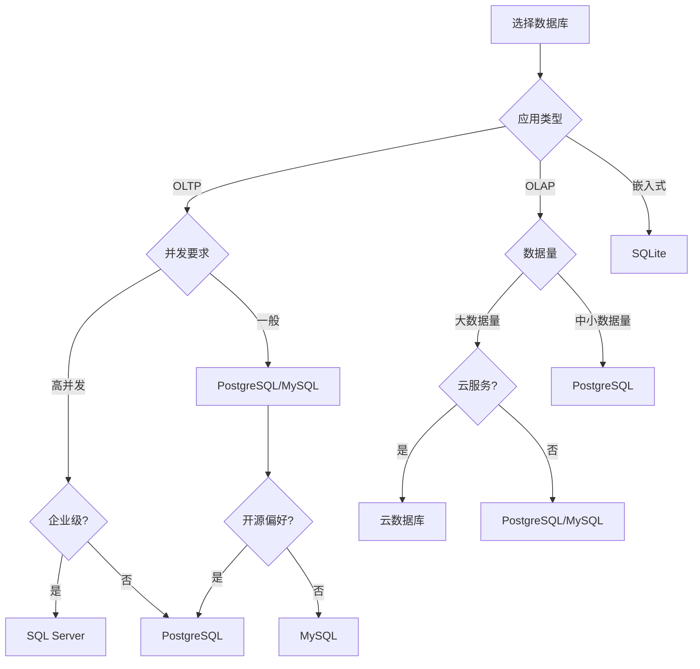
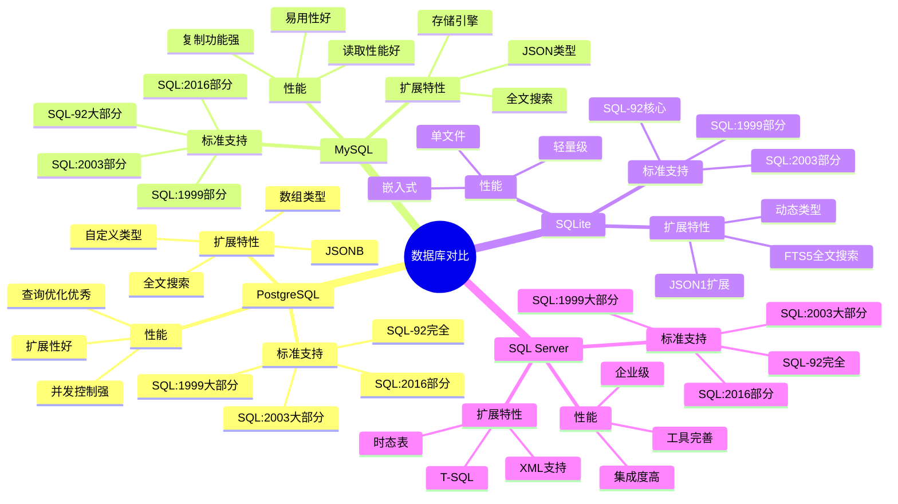
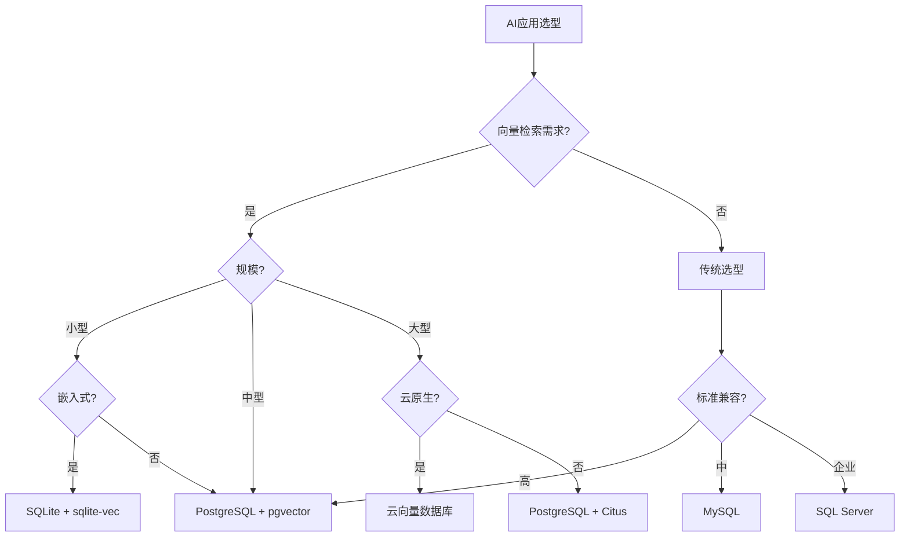

# 数据库SQL标准对比矩阵

> **创建日期**：2025-01-15
> **最后更新**：2025-12-01
> **版本**：v2.0.0
> **难度**：⭐⭐⭐
> **应用场景**：数据库选型、标准对齐分析、迁移规划、向量检索

---

## 📋 目录

- [数据库SQL标准对比矩阵](#数据库sql标准对比矩阵)
  - [📋 目录](#-目录)
  - [一、概述](#一概述)
    - [1.1 数据库选型决策树](#11-数据库选型决策树)
    - [1.2 数据库特性对比思维导图](#12-数据库特性对比思维导图)
  - [二、核心特性对比](#二核心特性对比)
  - [三、标准版本支持对比](#三标准版本支持对比)
  - [四、扩展特性对比](#四扩展特性对比)
  - [五、选型建议](#五选型建议)
    - [5.1 选型矩阵](#51-选型矩阵)
  - [六、2025向量数据库支持对比](#六2025向量数据库支持对比)
    - [6.1 向量类型与索引支持](#61-向量类型与索引支持)
    - [6.2 RAG系统支持对比](#62-rag系统支持对比)
    - [6.3 2025 AI数据库选型决策树](#63-2025-ai数据库选型决策树)
    - [6.4 向量检索性能对比](#64-向量检索性能对比)
    - [6.5 2025选型建议](#65-2025选型建议)
  - [七、相关资源](#七相关资源)
    - [相关文档](#相关文档)
    - [2025新资源](#2025新资源)

---

## 一、概述

本文档对比PostgreSQL、MySQL、SQLite、SQL Server对SQL标准的支持情况。

### 1.1 数据库选型决策树

### 1.2 数据库特性对比思维导图

---

## 二、核心特性对比

| 特性 | PostgreSQL | MySQL | SQLite | SQL Server |
|------|-----------|-------|--------|------------|
| **基本查询** | ✅ | ✅ | ✅ | ✅ |
| **窗口函数** | ✅ | ✅ | ✅ | ✅ |
| **CTE** | ✅ | ✅ | ✅ | ✅ |
| **递归查询** | ✅ | ✅ | ✅ | ✅ |
| **JSON支持** | ✅ | ✅ | ✅ | ✅ |
| **时态数据** | ⚠️ | ❌ | ⚠️ | ✅ |
| **存储过程** | ✅ | ✅ | ❌ | ✅ |
| **触发器** | ✅ | ✅ | ✅ | ✅ |

---

## 三、标准版本支持对比

| 标准版本 | PostgreSQL | MySQL | SQLite | SQL Server |
|---------|-----------|-------|--------|------------|
| **SQL-92** | ⭐⭐⭐⭐⭐ | ⭐⭐⭐⭐ | ⭐⭐⭐ | ⭐⭐⭐⭐⭐ |
| **SQL:1999** | ⭐⭐⭐⭐ | ⭐⭐⭐ | ⭐⭐⭐ | ⭐⭐⭐⭐ |
| **SQL:2003** | ⭐⭐⭐⭐ | ⭐⭐⭐ | ⭐⭐⭐ | ⭐⭐⭐⭐ |
| **SQL:2016** | ⭐⭐⭐⭐ | ⭐⭐⭐ | ⭐⭐⭐ | ⭐⭐⭐⭐ |
| **SQL:2023** | ⭐⭐⭐ | ⭐⭐⭐ | ⭐⭐ | ⭐⭐⭐ |

---

## 四、扩展特性对比

| 扩展特性 | PostgreSQL | MySQL | SQLite | SQL Server |
|---------|-----------|-------|--------|------------|
| **数组类型** | ✅ | ❌ | ❌ | ❌ |
| **JSONB** | ✅ | ❌ | ❌ | ❌ |
| **全文搜索** | ✅ | ✅ | ✅ | ✅ |
| **自定义类型** | ✅ | ❌ | ❌ | ⚠️ |
| **扩展系统** | ✅ | ⚠️ | ⚠️ | ⚠️ |

---

## 五、选型建议

### 5.1 选型矩阵

| 场景 | 推荐数据库 | 理由 |
|------|-----------|------|
| **标准兼容性要求高** | PostgreSQL | SQL标准支持最好 |
| **企业级应用** | SQL Server | 企业级特性完整 |
| **轻量级应用** | SQLite | 轻量级、易部署 |
| **Web应用** | MySQL | 广泛支持、性能好 |

---

## 六、2025向量数据库支持对比

### 6.1 向量类型与索引支持

| 特性 | PostgreSQL | MySQL | SQLite | SQL Server |
|------|-----------|-------|--------|------------|
| **向量类型** | ✅ pgvector | ❌ | ✅ sqlite-vec | ❌ |
| **HNSW索引** | ✅ | ❌ | ❌ | ❌ |
| **IVFFlat索引** | ✅ | ❌ | ❌ | ❌ |
| **余弦距离** | ✅ `<=>` | ❌ | ✅ | ❌ |
| **欧氏距离** | ✅ `<->` | ❌ | ✅ | ❌ |
| **内积距离** | ✅ `<#>` | ❌ | ✅ | ❌ |
| **向量维度** | 最大16000 | - | 最大65535 | - |

### 6.2 RAG系统支持对比

| 特性 | PostgreSQL | MySQL | SQLite | SQL Server |
|------|-----------|-------|--------|------------|
| **混合检索** | ✅ 向量+全文+JSONB | ⚠️ 全文 | ✅ 向量+FTS5 | ⚠️ 全文 |
| **JSON过滤** | ✅ JSONB GIN | ✅ JSON | ✅ JSON | ✅ JSON |
| **元数据索引** | ✅ GIN/GiST | ✅ B-tree | ✅ B-tree | ✅ B-tree |
| **并发性能** | ⭐⭐⭐⭐⭐ | ⭐⭐⭐⭐ | ⭐⭐ | ⭐⭐⭐⭐ |
| **分布式** | ✅ Citus | ✅ 集群 | ❌ | ✅ 集群 |

### 6.3 2025 AI数据库选型决策树

### 6.4 向量检索性能对比

| 指标 | PostgreSQL pgvector | SQLite sqlite-vec | 专用向量DB |
|------|---------------------|-------------------|-----------|
| **1M向量QPS** | ~500 | ~100 | ~2000 |
| **10M向量召回率** | 95%+ | 90%+ | 99%+ |
| **索引构建时间** | 中等 | 快 | 慢 |
| **内存占用** | 中等 | 低 | 高 |
| **SQL兼容性** | ⭐⭐⭐⭐⭐ | ⭐⭐⭐⭐ | ⭐ |
| **混合查询** | ⭐⭐⭐⭐⭐ | ⭐⭐⭐ | ⭐⭐ |

### 6.5 2025选型建议

| 场景 | 推荐方案 | 理由 |
|------|---------|------|
| **企业RAG** | PostgreSQL + pgvector | 功能全面、SQL兼容 |
| **边缘AI** | SQLite + sqlite-vec | 轻量、嵌入式 |
| **大规模检索** | 专用向量DB + PostgreSQL | 性能+功能 |
| **实时分析** | PostgreSQL + TimescaleDB | 时序+向量 |
| **知识图谱** | PostgreSQL + AGE + pgvector | 图+向量 |

---

## 七、相关资源

### 相关文档

- [PostgreSQL SQL实现](./06.01-PostgreSQL-SQL实现.md) - PostgreSQL标准对齐
- [MySQL SQL实现](./06.02-MySQL-SQL实现.md) - MySQL标准对齐
- [SQLite SQL实现](./06.03-SQLite-SQL实现.md) - SQLite标准对齐
- [SQL Server SQL实现](./06.04-SQL-Server-SQL实现.md) - SQL Server标准对齐

### 2025新资源

- [pgvector文档](https://github.com/pgvector/pgvector)
- [sqlite-vec文档](https://github.com/asg017/sqlite-vec)
- [PostgreSQL向量检索](../PostgreSQL/) - PostgreSQL向量检索指南

---

**维护者**: SQL Standards Team
**最后更新**: 2025-12-01
