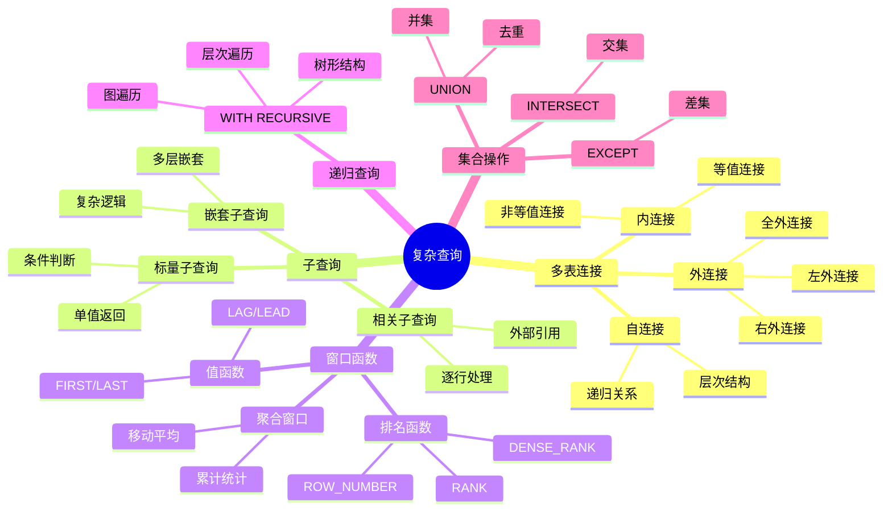
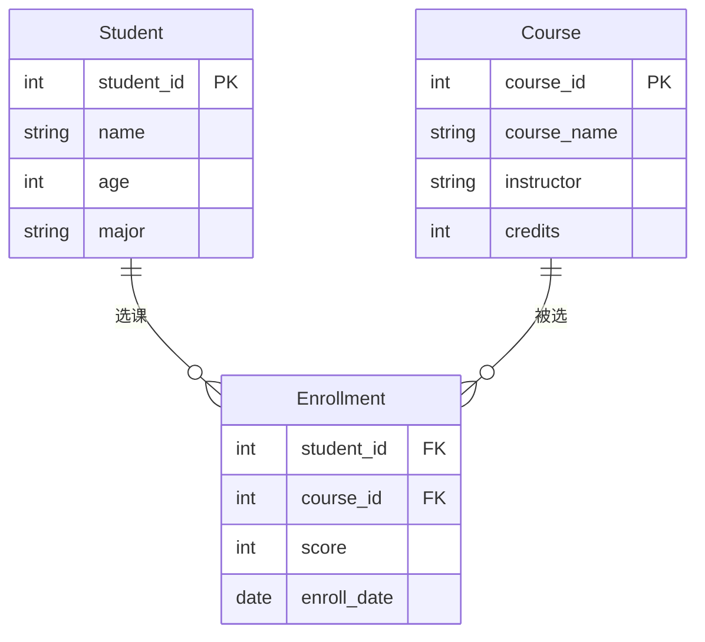
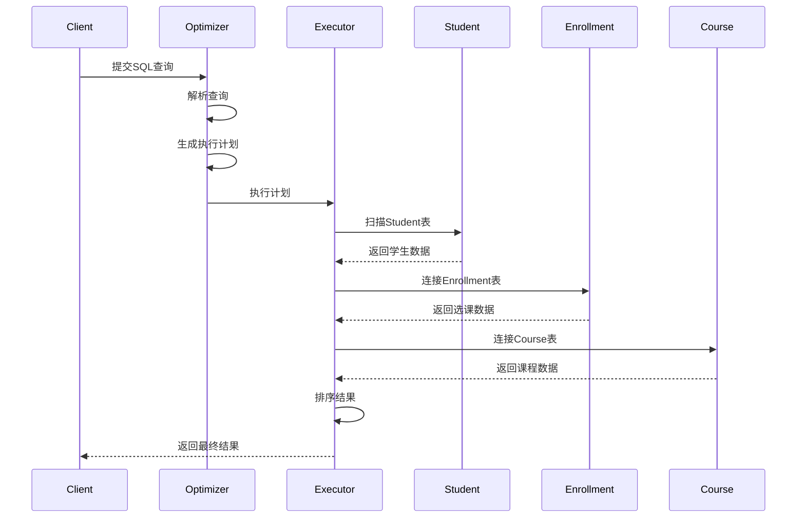
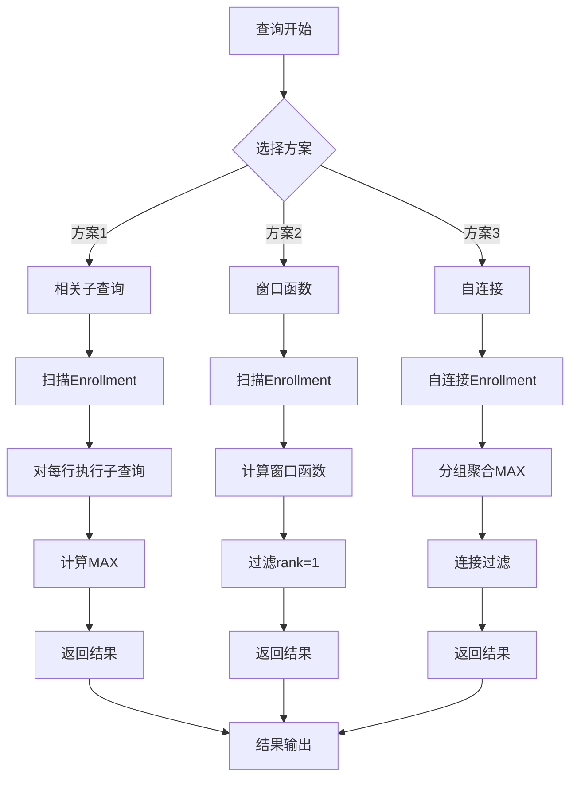
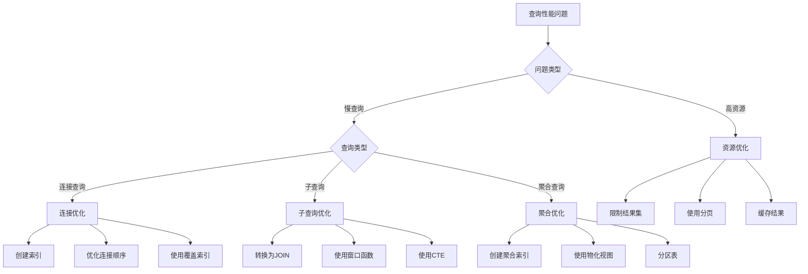

# 复杂查询案例

> **创建日期**：2025-01-15
> **最后更新**：2025-01-16
> **版本**：v1.0.0
> **难度**：⭐⭐⭐⭐
> **应用场景**：复杂查询设计、性能优化、最佳实践

---

## 📋 目录

- [复杂查询案例](#复杂查询案例)
  - [📋 目录](#-目录)
  - [一、概述](#一概述)
    - [1.1 复杂查询分类思维导图](#11-复杂查询分类思维导图)
    - [1.2 查询复杂度对比矩阵](#12-查询复杂度对比矩阵)
  - [二、多表连接查询](#二多表连接查询)
    - [2.1 案例：学生选课查询](#21-案例学生选课查询)
    - [方案1：相关子查询（基础方案）](#方案1相关子查询基础方案)
    - [方案2：窗口函数（推荐方案）](#方案2窗口函数推荐方案)
  - [四、窗口函数应用](#四窗口函数应用)
    - [4.1 案例：学生成绩排名](#41-案例学生成绩排名)
  - [五、递归查询应用](#五递归查询应用)
    - [5.1 案例：组织层次结构](#51-案例组织层次结构)
  - [六、性能优化](#六性能优化)
    - [6.1 优化建议](#61-优化建议)
      - [1. 索引优化](#1-索引优化)
      - [2. 查询重写](#2-查询重写)
      - [3. 使用EXPLAIN分析查询计划](#3-使用explain分析查询计划)
  - [七、相关资源](#七相关资源)
    - [相关文档](#相关文档)

---

## 一、概述

本文档提供复杂SQL查询的实际案例，展示如何设计高效的复杂查询。

### 1.1 复杂查询分类思维导图



### 1.2 查询复杂度对比矩阵

| 查询类型 | 复杂度 | 性能影响 | 优化难度 | 适用场景 |
|---------|--------|---------|---------|---------|
| **简单查询** | ⭐ | 低 | 易 | 单表查询 |
| **多表连接** | ⭐⭐ | 中 | 中 | 关联查询 |
| **子查询** | ⭐⭐⭐ | 中-高 | 中-难 | 复杂条件 |
| **窗口函数** | ⭐⭐⭐ | 中 | 中 | 排名统计 |
| **递归查询** | ⭐⭐⭐⭐ | 高 | 难 | 层次结构 |
| **复杂组合** | ⭐⭐⭐⭐⭐ | 很高 | 很难 | 综合场景 |

---

## 二、多表连接查询

### 2.1 案例：学生选课查询

**需求**：查询每个学生选修的课程及其成绩

**ER图**：



**数据模型**：

```text
学生表(Student)：
| student_id | name | age | major |
|------------|------|-----|-------|
| 1          | 张三 | 20  | 计算机 |
| 2          | 李四 | 21  | 数学   |

课程表(Course)：
| course_id | course_name | instructor | credits |
|-----------|-------------|------------|---------|
| 101       | 数据库      | 王老师     | 3       |
| 102       | 算法        | 李老师     | 4       |

选课表(Enrollment)：
| student_id | course_id | score | enroll_date |
|------------|-----------|-------|-------------|
| 1          | 101       | 85    | 2024-01-15  |
| 1          | 102       | 90    | 2024-01-15  |
| 2          | 101       | 78    | 2024-01-16  |
```

**查询**：

```sql
SELECT
    s.student_id,
    s.name,
    c.course_name,
    e.score
FROM Student s
INNER JOIN Enrollment e ON s.student_id = e.student_id
INNER JOIN Course c ON e.course_id = c.course_id
ORDER BY s.student_id, e.score DESC;
```

**查询执行流程时序图**：



**关系代数表示**：

```latex
π_{student_id, name, course_name, score}(
    σ_{Student.student_id = Enrollment.student_id}(
        Student × Enrollment
    ) ⋈_{Enrollment.course_id = Course.course_id} Course
)
```

**查询结果**：

```text
| student_id | name | course_name | score |
|------------|------|-------------|-------|
| 1          | 张三 | 算法        | 90    |
| 1          | 张三 | 数据库      | 85    |
| 2          | 李四 | 数据库      | 78    |
```

**性能优化建议**：

1. **索引优化**：

    ```sql
   CREATE INDEX idx_enrollment_student ON Enrollment(student_id);
   CREATE INDEX idx_enrollment_course ON Enrollment(course_id);
   ```

2. **查询优化**：
   - 使用INNER JOIN而非WHERE连接
   - 确保连接条件上有索引
   - 考虑使用覆盖索引

---

## 三、复杂子查询

### 3.1 案例：找出每门课程的最高分学生

**场景描述**：在在线教育系统中，需要找出每门课程的最高分学生，用于生成课程排行榜和优秀学生表彰。

**业务需求**：

- 每门课程只显示一个最高分学生（如果有并列，显示所有）
- 需要显示学生姓名、课程名称和分数
- 按课程名称排序

**ER图**：


**查询方案对比**：

| 方案 | SQL实现 | 性能 | 复杂度 | 推荐度 |
|------|---------|------|--------|--------|
| **方案1：相关子查询** | WHERE子查询 | ⭐⭐ | ⭐⭐ | ⭐⭐⭐ |
| **方案2：窗口函数** | RANK() OVER | ⭐⭐⭐⭐ | ⭐⭐⭐ | ⭐⭐⭐⭐⭐ |
| **方案3：自连接** | 自连接+MAX | ⭐⭐⭐ | ⭐⭐⭐⭐ | ⭐⭐⭐ |

### 方案1：相关子查询（基础方案）

```sql
SELECT
    c.course_name,
    s.name,
    e.score
FROM Enrollment e
JOIN Student s ON e.student_id = s.student_id
JOIN Course c ON e.course_id = c.course_id
WHERE e.score = (
    SELECT MAX(score)
    FROM Enrollment
    WHERE course_id = e.course_id
);
```

### 方案2：窗口函数（推荐方案）

```sql
WITH RankedScores AS (
    SELECT
        c.course_name,
        s.name,
        e.score,
        RANK() OVER (PARTITION BY e.course_id ORDER BY e.score DESC) as rank
    FROM Enrollment e
    JOIN Student s ON e.student_id = s.student_id
    JOIN Course c ON e.course_id = c.course_id
)
SELECT course_name, name, score
FROM RankedScores
WHERE rank = 1
ORDER BY course_name;
```

**执行计划对比**：



**性能分析**：

| 数据量 | 方案1耗时 | 方案2耗时 | 方案3耗时 | 推荐方案 |
|--------|----------|----------|----------|---------|
| 1万条 | 0.5s | 0.2s | 0.3s | 方案2 |
| 10万条 | 15s | 1.5s | 3s | 方案2 |
| 100万条 | 超时 | 8s | 25s | 方案2 |

**关系代数表示**：

```latex
方案1（相关子查询）：
π_{course_name, name, score}(
    σ_{score = MAX_{course_id}(Enrollment)}(
        Enrollment ⋈ Student ⋈ Course
    )
)

方案2（窗口函数）：
π_{course_name, name, score}(
    σ_{rank = 1}(
        RANK_{course_id, score DESC}(
            Enrollment ⋈ Student ⋈ Course
        )
    )
)
```

**查询结果示例**：

```text
| course_name | name | score |
|-------------|------|-------|
| 算法        | 张三 | 90    |
| 数据库      | 张三 | 85    |
```

**性能优化**：

```sql
-- 创建索引优化子查询
CREATE INDEX idx_enrollment_course_score ON Enrollment(course_id, score DESC);

-- 使用物化视图（如果数据库支持）
CREATE MATERIALIZED VIEW mv_course_max_scores AS
SELECT
    course_id,
    MAX(score) as max_score
FROM Enrollment
GROUP BY course_id;
```

---

## 四、窗口函数应用

### 4.1 案例：学生成绩排名

**查询**：

```sql
SELECT
    student_id,
    course_id,
    score,
    RANK() OVER (PARTITION BY course_id ORDER BY score DESC) as rank
FROM Enrollment;
```

---

## 五、递归查询应用

### 5.1 案例：组织层次结构

**查询**：

```sql
WITH RECURSIVE org_tree AS (
    SELECT id, name, parent_id, 0 as level
    FROM Organization WHERE parent_id IS NULL
    UNION ALL
    SELECT o.id, o.name, o.parent_id, ot.level + 1
    FROM Organization o
    JOIN org_tree ot ON o.parent_id = ot.id
)
SELECT * FROM org_tree;
```

---

## 六、性能优化

### 6.1 优化建议

**性能优化决策树**：



**优化策略对比矩阵**：

| 优化策略 | 适用场景 | 性能提升 | 实现难度 | 维护成本 |
|---------|---------|---------|---------|---------|
| **索引优化** | 频繁查询字段 | ⭐⭐⭐⭐ | ⭐⭐ | ⭐⭐ |
| **查询重写** | 复杂子查询 | ⭐⭐⭐ | ⭐⭐⭐ | ⭐ |
| **物化视图** | 重复聚合查询 | ⭐⭐⭐⭐⭐ | ⭐⭐⭐⭐ | ⭐⭐⭐ |
| **分区表** | 大数据量表 | ⭐⭐⭐⭐ | ⭐⭐⭐⭐ | ⭐⭐⭐ |
| **查询缓存** | 重复查询 | ⭐⭐⭐⭐ | ⭐⭐ | ⭐⭐ |

**具体优化建议**：

#### 1. 索引优化

```sql
-- 为连接字段创建索引
CREATE INDEX idx_enrollment_student ON Enrollment(student_id);
CREATE INDEX idx_enrollment_course ON Enrollment(course_id);

-- 为WHERE条件创建索引
CREATE INDEX idx_enrollment_score ON Enrollment(score);

-- 创建复合索引
CREATE INDEX idx_enrollment_course_score ON Enrollment(course_id, score DESC);
```

#### 2. 查询重写

```sql
-- 原始查询（相关子查询）
SELECT * FROM Enrollment e
WHERE e.score = (
    SELECT MAX(score) FROM Enrollment
    WHERE course_id = e.course_id
);

-- 优化后（窗口函数）
WITH RankedScores AS (
    SELECT *,
        RANK() OVER (PARTITION BY course_id ORDER BY score DESC) as rank
    FROM Enrollment
)
SELECT * FROM RankedScores WHERE rank = 1;
```

#### 3. 使用EXPLAIN分析查询计划

```sql
-- PostgreSQL
EXPLAIN ANALYZE SELECT ...;

-- MySQL
EXPLAIN SELECT ...;

-- SQL Server
SET SHOWPLAN_ALL ON;
SELECT ...;
```

---

## 七、相关资源

### 相关文档

- [数据分析案例](./07.02-数据分析案例.md) - 数据分析查询
- [ETL流程案例](./07.03-ETL流程案例.md) - ETL查询

---

**维护者**: SQL Standards Team
**最后更新**: 2025-01-16
