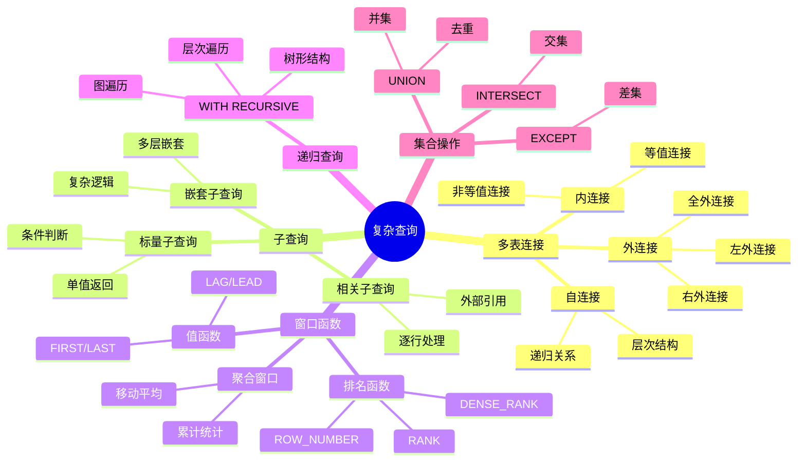
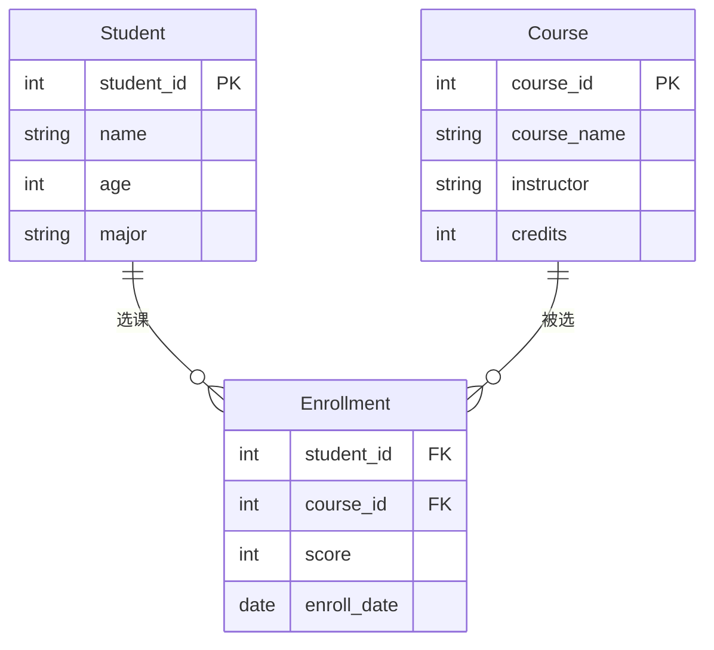
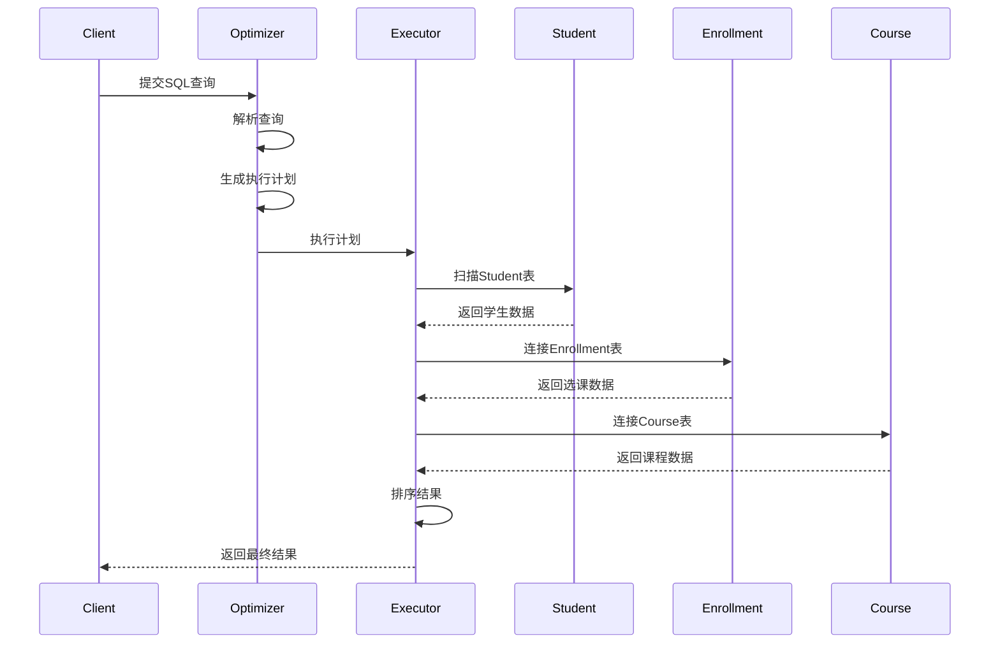
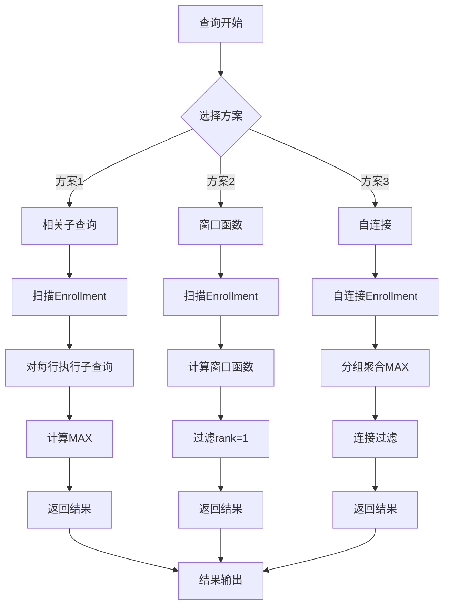
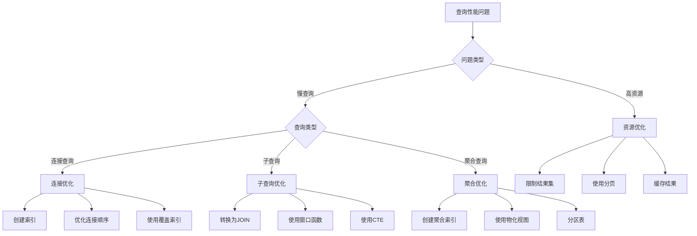

# 复杂查询案例

> **创建日期**：2025-01-15
> **最后更新**：2025-12-01
> **版本**：v2.0.0
> **难度**：⭐⭐⭐⭐
> **应用场景**：复杂查询设计、性能优化、最佳实践、RAG检索

---

## 📋 目录

- [复杂查询案例](#复杂查询案例)
  - [📋 目录](#-目录)
  - [一、概述](#一概述)
    - [1.1 复杂查询分类思维导图](#11-复杂查询分类思维导图)
    - [1.2 查询复杂度对比矩阵](#12-查询复杂度对比矩阵)
  - [二、多表连接查询](#二多表连接查询)
    - [2.1 案例：学生选课查询](#21-案例学生选课查询)
    - [方案1：相关子查询（基础方案）](#方案1相关子查询基础方案)
    - [方案2：窗口函数（推荐方案）](#方案2窗口函数推荐方案)
  - [四、窗口函数应用](#四窗口函数应用)
    - [4.1 案例：学生成绩排名](#41-案例学生成绩排名)
  - [五、递归查询应用](#五递归查询应用)
    - [5.1 案例：组织层次结构](#51-案例组织层次结构)
  - [六、性能优化](#六性能优化)
    - [6.1 优化建议](#61-优化建议)
      - [1. 索引优化](#1-索引优化)
      - [2. 查询重写](#2-查询重写)
      - [3. 使用EXPLAIN分析查询计划](#3-使用explain分析查询计划)
  - [七、2025 RAG检索案例](#七2025-rag检索案例)
    - [7.1 企业知识库RAG Schema](#71-企业知识库rag-schema)
    - [7.2 混合检索查询](#72-混合检索查询)
    - [7.3 RAG上下文构建](#73-rag上下文构建)
    - [7.4 查询日志与分析](#74-查询日志与分析)
    - [7.5 2025 RAG查询模式矩阵](#75-2025-rag查询模式矩阵)
  - [八、端到端业务案例：电商订单系统 🆕](#八端到端业务案例电商订单系统-)
    - [8.1 业务需求描述](#81-业务需求描述)
    - [8.2 PostgreSQL 18 数据模型](#82-postgresql-18-数据模型)
    - [8.3 核心业务查询](#83-核心业务查询)
    - [8.4 SQLite 3.45+ 简化版本](#84-sqlite-345-简化版本)
    - [8.5 性能优化建议](#85-性能优化建议)
  - [九、相关资源](#九相关资源)
    - [相关文档](#相关文档)
    - [2025新资源](#2025新资源)

---

## 一、概述

本文档提供复杂SQL查询的实际案例，展示如何设计高效的复杂查询。

### 1.1 复杂查询分类思维导图



### 1.2 查询复杂度对比矩阵

| 查询类型 | 复杂度 | 性能影响 | 优化难度 | 适用场景 |
|---------|--------|---------|---------|---------|
| **简单查询** | ⭐ | 低 | 易 | 单表查询 |
| **多表连接** | ⭐⭐ | 中 | 中 | 关联查询 |
| **子查询** | ⭐⭐⭐ | 中-高 | 中-难 | 复杂条件 |
| **窗口函数** | ⭐⭐⭐ | 中 | 中 | 排名统计 |
| **递归查询** | ⭐⭐⭐⭐ | 高 | 难 | 层次结构 |
| **复杂组合** | ⭐⭐⭐⭐⭐ | 很高 | 很难 | 综合场景 |

---

## 二、多表连接查询

### 2.1 案例：学生选课查询

**需求**：查询每个学生选修的课程及其成绩

**ER图**：



**数据模型**：

```text
学生表(Student)：
| student_id | name | age | major |
|------------|------|-----|-------|
| 1          | 张三 | 20  | 计算机 |
| 2          | 李四 | 21  | 数学   |

课程表(Course)：
| course_id | course_name | instructor | credits |
|-----------|-------------|------------|---------|
| 101       | 数据库      | 王老师     | 3       |
| 102       | 算法        | 李老师     | 4       |

选课表(Enrollment)：
| student_id | course_id | score | enroll_date |
|------------|-----------|-------|-------------|
| 1          | 101       | 85    | 2024-01-15  |
| 1          | 102       | 90    | 2024-01-15  |
| 2          | 101       | 78    | 2024-01-16  |
```

**查询**：

```sql
SELECT
    s.student_id,
    s.name,
    c.course_name,
    e.score
FROM Student s
INNER JOIN Enrollment e ON s.student_id = e.student_id
INNER JOIN Course c ON e.course_id = c.course_id
ORDER BY s.student_id, e.score DESC;
```

**查询执行流程时序图**：



**关系代数表示**：

```latex
π_{student_id, name, course_name, score}(
    σ_{Student.student_id = Enrollment.student_id}(
        Student × Enrollment
    ) ⋈_{Enrollment.course_id = Course.course_id} Course
)
```

**查询结果**：

```text
| student_id | name | course_name | score |
|------------|------|-------------|-------|
| 1          | 张三 | 算法        | 90    |
| 1          | 张三 | 数据库      | 85    |
| 2          | 李四 | 数据库      | 78    |
```

**性能优化建议**：

1. **索引优化**：

    ```sql
   CREATE INDEX idx_enrollment_student ON Enrollment(student_id);
   CREATE INDEX idx_enrollment_course ON Enrollment(course_id);
   ```

2. **查询优化**：
   - 使用INNER JOIN而非WHERE连接
   - 确保连接条件上有索引
   - 考虑使用覆盖索引

---

## 三、复杂子查询

### 3.1 案例：找出每门课程的最高分学生

**场景描述**：在在线教育系统中，需要找出每门课程的最高分学生，用于生成课程排行榜和优秀学生表彰。

**业务需求**：

- 每门课程只显示一个最高分学生（如果有并列，显示所有）
- 需要显示学生姓名、课程名称和分数
- 按课程名称排序

**ER图**：


**查询方案对比**：

| 方案 | SQL实现 | 性能 | 复杂度 | 推荐度 |
|------|---------|------|--------|--------|
| **方案1：相关子查询** | WHERE子查询 | ⭐⭐ | ⭐⭐ | ⭐⭐⭐ |
| **方案2：窗口函数** | RANK() OVER | ⭐⭐⭐⭐ | ⭐⭐⭐ | ⭐⭐⭐⭐⭐ |
| **方案3：自连接** | 自连接+MAX | ⭐⭐⭐ | ⭐⭐⭐⭐ | ⭐⭐⭐ |

### 方案1：相关子查询（基础方案）

```sql
SELECT
    c.course_name,
    s.name,
    e.score
FROM Enrollment e
JOIN Student s ON e.student_id = s.student_id
JOIN Course c ON e.course_id = c.course_id
WHERE e.score = (
    SELECT MAX(score)
    FROM Enrollment
    WHERE course_id = e.course_id
);
```

### 方案2：窗口函数（推荐方案）

```sql
WITH RankedScores AS (
    SELECT
        c.course_name,
        s.name,
        e.score,
        RANK() OVER (PARTITION BY e.course_id ORDER BY e.score DESC) as rank
    FROM Enrollment e
    JOIN Student s ON e.student_id = s.student_id
    JOIN Course c ON e.course_id = c.course_id
)
SELECT course_name, name, score
FROM RankedScores
WHERE rank = 1
ORDER BY course_name;
```

**执行计划对比**：



**性能分析**：

| 数据量 | 方案1耗时 | 方案2耗时 | 方案3耗时 | 推荐方案 |
|--------|----------|----------|----------|---------|
| 1万条 | 0.5s | 0.2s | 0.3s | 方案2 |
| 10万条 | 15s | 1.5s | 3s | 方案2 |
| 100万条 | 超时 | 8s | 25s | 方案2 |

**关系代数表示**：

```latex
方案1（相关子查询）：
π_{course_name, name, score}(
    σ_{score = MAX_{course_id}(Enrollment)}(
        Enrollment ⋈ Student ⋈ Course
    )
)

方案2（窗口函数）：
π_{course_name, name, score}(
    σ_{rank = 1}(
        RANK_{course_id, score DESC}(
            Enrollment ⋈ Student ⋈ Course
        )
    )
)
```

**查询结果示例**：

```text
| course_name | name | score |
|-------------|------|-------|
| 算法        | 张三 | 90    |
| 数据库      | 张三 | 85    |
```

**性能优化**：

```sql
-- 创建索引优化子查询
CREATE INDEX idx_enrollment_course_score ON Enrollment(course_id, score DESC);

-- 使用物化视图（如果数据库支持）
CREATE MATERIALIZED VIEW mv_course_max_scores AS
SELECT
    course_id,
    MAX(score) as max_score
FROM Enrollment
GROUP BY course_id;
```

---

## 四、窗口函数应用

### 4.1 案例：学生成绩排名

**查询**：

```sql
SELECT
    student_id,
    course_id,
    score,
    RANK() OVER (PARTITION BY course_id ORDER BY score DESC) as rank
FROM Enrollment;
```

---

## 五、递归查询应用

### 5.1 案例：组织层次结构

**查询**：

```sql
WITH RECURSIVE org_tree AS (
    SELECT id, name, parent_id, 0 as level
    FROM Organization WHERE parent_id IS NULL
    UNION ALL
    SELECT o.id, o.name, o.parent_id, ot.level + 1
    FROM Organization o
    JOIN org_tree ot ON o.parent_id = ot.id
)
SELECT * FROM org_tree;
```

---

## 六、性能优化

### 6.1 优化建议

**性能优化决策树**：



**优化策略对比矩阵**：

| 优化策略 | 适用场景 | 性能提升 | 实现难度 | 维护成本 |
|---------|---------|---------|---------|---------|
| **索引优化** | 频繁查询字段 | ⭐⭐⭐⭐ | ⭐⭐ | ⭐⭐ |
| **查询重写** | 复杂子查询 | ⭐⭐⭐ | ⭐⭐⭐ | ⭐ |
| **物化视图** | 重复聚合查询 | ⭐⭐⭐⭐⭐ | ⭐⭐⭐⭐ | ⭐⭐⭐ |
| **分区表** | 大数据量表 | ⭐⭐⭐⭐ | ⭐⭐⭐⭐ | ⭐⭐⭐ |
| **查询缓存** | 重复查询 | ⭐⭐⭐⭐ | ⭐⭐ | ⭐⭐ |

**具体优化建议**：

#### 1. 索引优化

```sql
-- 为连接字段创建索引
CREATE INDEX idx_enrollment_student ON Enrollment(student_id);
CREATE INDEX idx_enrollment_course ON Enrollment(course_id);

-- 为WHERE条件创建索引
CREATE INDEX idx_enrollment_score ON Enrollment(score);

-- 创建复合索引
CREATE INDEX idx_enrollment_course_score ON Enrollment(course_id, score DESC);
```

#### 2. 查询重写

```sql
-- 原始查询（相关子查询）
SELECT * FROM Enrollment e
WHERE e.score = (
    SELECT MAX(score) FROM Enrollment
    WHERE course_id = e.course_id
);

-- 优化后（窗口函数）
WITH RankedScores AS (
    SELECT *,
        RANK() OVER (PARTITION BY course_id ORDER BY score DESC) as rank
    FROM Enrollment
)
SELECT * FROM RankedScores WHERE rank = 1;
```

#### 3. 使用EXPLAIN分析查询计划

```sql
-- PostgreSQL
EXPLAIN ANALYZE SELECT ...;

-- MySQL
EXPLAIN SELECT ...;

-- SQL Server
SET SHOWPLAN_ALL ON;
SELECT ...;
```

---

## 七、2025 RAG检索案例

### 7.1 企业知识库RAG Schema

```sql
-- 企业知识库完整Schema
CREATE EXTENSION IF NOT EXISTS vector;
CREATE EXTENSION IF NOT EXISTS pg_trgm;

-- 文档表
CREATE TABLE documents (
    id UUID PRIMARY KEY DEFAULT gen_random_uuid(),
    title TEXT NOT NULL,
    content TEXT NOT NULL,
    source_url TEXT,
    doc_type VARCHAR(50),
    created_at TIMESTAMPTZ DEFAULT NOW(),
    updated_at TIMESTAMPTZ DEFAULT NOW()
);

-- 文档分块表
CREATE TABLE document_chunks (
    id UUID PRIMARY KEY DEFAULT gen_random_uuid(),
    document_id UUID REFERENCES documents(id) ON DELETE CASCADE,
    chunk_index INTEGER NOT NULL,
    content TEXT NOT NULL,
    embedding vector(1536),
    token_count INTEGER,
    metadata JSONB DEFAULT '{}',
    created_at TIMESTAMPTZ DEFAULT NOW(),
    UNIQUE(document_id, chunk_index)
);

-- 向量索引 (HNSW)
CREATE INDEX idx_chunks_embedding ON document_chunks
    USING hnsw (embedding vector_cosine_ops);

-- 全文索引
ALTER TABLE document_chunks ADD COLUMN tsv tsvector
    GENERATED ALWAYS AS (to_tsvector('chinese', content)) STORED;
CREATE INDEX idx_chunks_tsv ON document_chunks USING gin(tsv);

-- JSON索引
CREATE INDEX idx_chunks_metadata ON document_chunks USING gin(metadata);
```

### 7.2 混合检索查询

```sql
-- 混合检索：向量 + 全文 + 元数据过滤
CREATE OR REPLACE FUNCTION hybrid_search(
    query_text TEXT,
    query_embedding vector(1536),
    filter_metadata JSONB DEFAULT '{}',
    vector_weight FLOAT DEFAULT 0.7,
    keyword_weight FLOAT DEFAULT 0.3,
    limit_count INTEGER DEFAULT 10
) RETURNS TABLE (
    chunk_id UUID,
    document_id UUID,
    content TEXT,
    metadata JSONB,
    vector_score FLOAT,
    keyword_score FLOAT,
    combined_score FLOAT
) AS $$
BEGIN
    RETURN QUERY
    WITH
    -- 向量检索
    vector_results AS (
        SELECT
            id,
            document_id,
            content,
            metadata,
            1 - (embedding <=> query_embedding) AS score
        FROM document_chunks
        WHERE (filter_metadata = '{}' OR metadata @> filter_metadata)
        ORDER BY embedding <=> query_embedding
        LIMIT limit_count * 3
    ),
    -- 关键词检索
    keyword_results AS (
        SELECT
            id,
            document_id,
            content,
            metadata,
            ts_rank_cd(tsv, plainto_tsquery('chinese', query_text)) AS score
        FROM document_chunks
        WHERE tsv @@ plainto_tsquery('chinese', query_text)
          AND (filter_metadata = '{}' OR metadata @> filter_metadata)
        ORDER BY score DESC
        LIMIT limit_count * 3
    ),
    -- RRF融合
    combined AS (
        SELECT
            COALESCE(v.id, k.id) AS chunk_id,
            COALESCE(v.document_id, k.document_id) AS document_id,
            COALESCE(v.content, k.content) AS content,
            COALESCE(v.metadata, k.metadata) AS metadata,
            COALESCE(v.score, 0) AS vector_score,
            COALESCE(k.score, 0) AS keyword_score,
            (COALESCE(v.score, 0) * vector_weight +
             COALESCE(k.score, 0) * keyword_weight) AS combined_score
        FROM vector_results v
        FULL OUTER JOIN keyword_results k ON v.id = k.id
    )
    SELECT * FROM combined
    ORDER BY combined_score DESC
    LIMIT limit_count;
END;
$$ LANGUAGE plpgsql;

-- 使用示例
SELECT * FROM hybrid_search(
    '如何配置PostgreSQL连接池',
    '[0.1, 0.2, ...]'::vector,
    '{"category": "database"}'::jsonb
);
```

### 7.3 RAG上下文构建

```sql
-- 构建LLM上下文
CREATE OR REPLACE FUNCTION build_rag_context(
    query_embedding vector(1536),
    max_tokens INTEGER DEFAULT 4000,
    max_chunks INTEGER DEFAULT 5
) RETURNS JSONB AS $$
DECLARE
    result JSONB;
    total_tokens INTEGER := 0;
    chunk_count INTEGER := 0;
BEGIN
    WITH ranked_chunks AS (
        SELECT
            dc.id,
            dc.content,
            dc.token_count,
            dc.metadata,
            d.title AS doc_title,
            1 - (dc.embedding <=> query_embedding) AS similarity,
            ROW_NUMBER() OVER (ORDER BY dc.embedding <=> query_embedding) AS rank
        FROM document_chunks dc
        JOIN documents d ON dc.document_id = d.id
        ORDER BY dc.embedding <=> query_embedding
        LIMIT max_chunks * 2
    ),
    selected_chunks AS (
        SELECT *
        FROM ranked_chunks
        WHERE rank <= max_chunks
    )
    SELECT jsonb_build_object(
        'chunks', jsonb_agg(
            jsonb_build_object(
                'id', id,
                'title', doc_title,
                'content', content,
                'similarity', ROUND(similarity::numeric, 4),
                'metadata', metadata
            ) ORDER BY similarity DESC
        ),
        'total_chunks', COUNT(*),
        'total_tokens', SUM(token_count),
        'avg_similarity', ROUND(AVG(similarity)::numeric, 4)
    )
    INTO result
    FROM selected_chunks;

    RETURN result;
END;
$$ LANGUAGE plpgsql;
```

### 7.4 查询日志与分析

```sql
-- 查询日志表
CREATE TABLE query_logs (
    id UUID PRIMARY KEY DEFAULT gen_random_uuid(),
    user_id UUID,
    query_text TEXT NOT NULL,
    query_embedding vector(1536),
    result_count INTEGER,
    latency_ms INTEGER,
    created_at TIMESTAMPTZ DEFAULT NOW()
);

-- 查询分析：热门查询
WITH query_stats AS (
    SELECT
        query_text,
        COUNT(*) AS query_count,
        AVG(latency_ms) AS avg_latency,
        AVG(result_count) AS avg_results
    FROM query_logs
    WHERE created_at > NOW() - INTERVAL '7 days'
    GROUP BY query_text
)
SELECT
    query_text,
    query_count,
    avg_latency,
    avg_results,
    -- 排名
    ROW_NUMBER() OVER (ORDER BY query_count DESC) AS popularity_rank,
    -- 累计占比
    SUM(query_count) OVER (ORDER BY query_count DESC) * 100.0 /
        SUM(query_count) OVER () AS cumulative_pct
FROM query_stats
ORDER BY query_count DESC
LIMIT 20;
```

### 7.5 2025 RAG查询模式矩阵

| 查询模式 | SQL特性 | 适用场景 | 复杂度 |
|---------|--------|---------|-------|
| **向量检索** | `<=>` 操作符 | 语义搜索 | ⭐⭐ |
| **混合检索** | 向量 + 全文 | 精准+语义 | ⭐⭐⭐ |
| **RRF融合** | CTE + 窗口函数 | 多路召回 | ⭐⭐⭐⭐ |
| **上下文构建** | JSONB聚合 | LLM输入 | ⭐⭐⭐ |
| **查询分析** | 窗口函数 | 运营分析 | ⭐⭐⭐ |

---

## 八、端到端业务案例：电商订单系统 🆕

### 8.1 业务需求描述

**电商平台核心需求**：

- 订单管理（创建、支付、发货、完成）
- 库存管理（扣减、回滚、预警）
- 用户分析（RFM模型、用户画像）
- 促销活动（优惠券、满减）

### 8.2 PostgreSQL 18 数据模型

```sql
-- PostgreSQL 18: 电商订单系统完整Schema
-- 用户表
CREATE TABLE users (
    user_id     BIGSERIAL PRIMARY KEY,
    username    VARCHAR(50) UNIQUE NOT NULL,
    email       VARCHAR(100) UNIQUE NOT NULL,
    phone       VARCHAR(20),
    created_at  TIMESTAMPTZ DEFAULT NOW(),
    -- PostgreSQL 18: 虚拟生成列
    user_level  VARCHAR(10) GENERATED ALWAYS AS (
        CASE
            WHEN total_orders >= 100 THEN 'VIP'
            WHEN total_orders >= 10 THEN 'Gold'
            ELSE 'Normal'
        END
    ) STORED,
    total_orders INTEGER DEFAULT 0
);

-- 商品表
CREATE TABLE products (
    product_id  BIGSERIAL PRIMARY KEY,
    name        VARCHAR(200) NOT NULL,
    category_id INTEGER NOT NULL,
    price       DECIMAL(10,2) NOT NULL,
    stock       INTEGER NOT NULL DEFAULT 0 CHECK (stock >= 0),
    status      VARCHAR(20) DEFAULT 'active',
    attributes  JSONB DEFAULT '{}',
    created_at  TIMESTAMPTZ DEFAULT NOW(),
    -- 全文搜索向量
    search_vector TSVECTOR GENERATED ALWAYS AS (
        setweight(to_tsvector('chinese', name), 'A') ||
        setweight(to_tsvector('chinese', COALESCE(attributes->>'description', '')), 'B')
    ) STORED
);

-- 订单表
CREATE TABLE orders (
    order_id    BIGSERIAL PRIMARY KEY,
    user_id     BIGINT NOT NULL REFERENCES users(user_id),
    status      VARCHAR(20) NOT NULL DEFAULT 'pending',
    total_amount DECIMAL(12,2) NOT NULL,
    discount_amount DECIMAL(10,2) DEFAULT 0,
    pay_amount  DECIMAL(12,2) GENERATED ALWAYS AS (total_amount - discount_amount) STORED,
    created_at  TIMESTAMPTZ DEFAULT NOW(),
    paid_at     TIMESTAMPTZ,
    shipped_at  TIMESTAMPTZ,
    completed_at TIMESTAMPTZ,
    -- 订单状态约束
    CONSTRAINT valid_status CHECK (status IN ('pending', 'paid', 'shipped', 'completed', 'cancelled'))
);

-- 订单明细表
CREATE TABLE order_items (
    item_id     BIGSERIAL PRIMARY KEY,
    order_id    BIGINT NOT NULL REFERENCES orders(order_id),
    product_id  BIGINT NOT NULL REFERENCES products(product_id),
    quantity    INTEGER NOT NULL CHECK (quantity > 0),
    unit_price  DECIMAL(10,2) NOT NULL,
    subtotal    DECIMAL(12,2) GENERATED ALWAYS AS (quantity * unit_price) STORED
);

-- 库存变动日志
CREATE TABLE inventory_logs (
    log_id      BIGSERIAL PRIMARY KEY,
    product_id  BIGINT NOT NULL REFERENCES products(product_id),
    change_type VARCHAR(20) NOT NULL, -- 'sale', 'return', 'restock', 'adjustment'
    quantity    INTEGER NOT NULL,
    order_id    BIGINT REFERENCES orders(order_id),
    created_at  TIMESTAMPTZ DEFAULT NOW()
);

-- 索引
CREATE INDEX idx_orders_user ON orders(user_id);
CREATE INDEX idx_orders_status ON orders(status);
CREATE INDEX idx_orders_created ON orders(created_at);
CREATE INDEX idx_products_search ON products USING GIN(search_vector);
CREATE INDEX idx_products_category ON products(category_id);
```

### 8.3 核心业务查询

**8.3.1 创建订单（含库存扣减）**:

```sql
-- PostgreSQL 18: 原子性订单创建
CREATE OR REPLACE FUNCTION create_order(
    p_user_id BIGINT,
    p_items JSONB  -- [{"product_id": 1, "quantity": 2}, ...]
) RETURNS BIGINT AS $$
DECLARE
    v_order_id BIGINT;
    v_total DECIMAL(12,2) := 0;
    v_item JSONB;
    v_product RECORD;
BEGIN
    -- 1. 创建订单头
    INSERT INTO orders (user_id, status, total_amount)
    VALUES (p_user_id, 'pending', 0)
    RETURNING order_id INTO v_order_id;

    -- 2. 处理每个商品
    FOR v_item IN SELECT * FROM jsonb_array_elements(p_items)
    LOOP
        -- 获取商品信息并锁定行
        SELECT * INTO v_product
        FROM products
        WHERE product_id = (v_item->>'product_id')::BIGINT
        FOR UPDATE;

        -- 检查库存
        IF v_product.stock < (v_item->>'quantity')::INTEGER THEN
            RAISE EXCEPTION '商品 % 库存不足', v_product.name;
        END IF;

        -- 扣减库存
        UPDATE products
        SET stock = stock - (v_item->>'quantity')::INTEGER
        WHERE product_id = v_product.product_id;

        -- 记录库存变动
        INSERT INTO inventory_logs (product_id, change_type, quantity, order_id)
        VALUES (v_product.product_id, 'sale', -(v_item->>'quantity')::INTEGER, v_order_id);

        -- 创建订单明细
        INSERT INTO order_items (order_id, product_id, quantity, unit_price)
        VALUES (v_order_id, v_product.product_id, (v_item->>'quantity')::INTEGER, v_product.price);

        v_total := v_total + v_product.price * (v_item->>'quantity')::INTEGER;
    END LOOP;

    -- 3. 更新订单总金额
    UPDATE orders SET total_amount = v_total WHERE order_id = v_order_id;

    -- 4. 更新用户订单数
    UPDATE users SET total_orders = total_orders + 1 WHERE user_id = p_user_id;

    RETURN v_order_id;
END;
$$ LANGUAGE plpgsql;

-- 使用示例
SELECT create_order(
    1,
    '[{"product_id": 101, "quantity": 2}, {"product_id": 102, "quantity": 1}]'::JSONB
);
```

**8.3.2 用户RFM分析（高级窗口函数）**:

```sql
-- PostgreSQL 18: RFM用户价值分析
WITH user_metrics AS (
    SELECT
        u.user_id,
        u.username,
        -- Recency: 最后一次购买距今天数
        EXTRACT(DAY FROM NOW() - MAX(o.paid_at)) AS recency_days,
        -- Frequency: 购买次数
        COUNT(DISTINCT o.order_id) AS frequency,
        -- Monetary: 总消费金额
        COALESCE(SUM(o.pay_amount), 0) AS monetary
    FROM users u
    LEFT JOIN orders o ON u.user_id = o.user_id AND o.status = 'completed'
    GROUP BY u.user_id, u.username
),
rfm_scores AS (
    SELECT
        user_id,
        username,
        recency_days,
        frequency,
        monetary,
        -- RFM打分 (1-5分)
        NTILE(5) OVER (ORDER BY recency_days DESC) AS r_score,
        NTILE(5) OVER (ORDER BY frequency) AS f_score,
        NTILE(5) OVER (ORDER BY monetary) AS m_score
    FROM user_metrics
    WHERE frequency > 0  -- 排除从未购买的用户
)
SELECT
    user_id,
    username,
    recency_days,
    frequency,
    monetary,
    r_score,
    f_score,
    m_score,
    r_score + f_score + m_score AS rfm_total,
    -- 用户分群
    CASE
        WHEN r_score >= 4 AND f_score >= 4 AND m_score >= 4 THEN '重要价值客户'
        WHEN r_score >= 4 AND f_score >= 4 THEN '重要发展客户'
        WHEN r_score >= 4 AND m_score >= 4 THEN '重要保持客户'
        WHEN f_score >= 4 AND m_score >= 4 THEN '重要挽留客户'
        WHEN r_score >= 4 THEN '一般发展客户'
        WHEN f_score >= 4 THEN '一般保持客户'
        WHEN m_score >= 4 THEN '一般挽留客户'
        ELSE '一般客户'
    END AS customer_segment,
    -- 分群内排名
    ROW_NUMBER() OVER (
        PARTITION BY
            CASE
                WHEN r_score >= 4 AND f_score >= 4 AND m_score >= 4 THEN '重要价值客户'
                WHEN r_score >= 4 AND f_score >= 4 THEN '重要发展客户'
                ELSE '其他'
            END
        ORDER BY monetary DESC
    ) AS segment_rank
FROM rfm_scores
ORDER BY rfm_total DESC, monetary DESC;
```

**8.3.3 销售趋势分析（时间序列）**:

```sql
-- PostgreSQL 18: 销售趋势与同比环比分析
WITH daily_sales AS (
    SELECT
        DATE(created_at) AS sale_date,
        COUNT(DISTINCT order_id) AS order_count,
        SUM(pay_amount) AS revenue,
        COUNT(DISTINCT user_id) AS unique_customers
    FROM orders
    WHERE status IN ('paid', 'shipped', 'completed')
      AND created_at >= CURRENT_DATE - INTERVAL '90 days'
    GROUP BY DATE(created_at)
),
sales_with_trends AS (
    SELECT
        sale_date,
        order_count,
        revenue,
        unique_customers,
        -- 7日移动平均
        AVG(revenue) OVER (
            ORDER BY sale_date
            ROWS BETWEEN 6 PRECEDING AND CURRENT ROW
        ) AS revenue_ma7,
        -- 环比（与前一天对比）
        revenue - LAG(revenue) OVER (ORDER BY sale_date) AS revenue_dod,
        -- 同比（与去年同日对比）
        revenue - LAG(revenue, 365) OVER (ORDER BY sale_date) AS revenue_yoy,
        -- 周累计
        SUM(revenue) OVER (
            PARTITION BY DATE_TRUNC('week', sale_date)
            ORDER BY sale_date
        ) AS weekly_cumulative
    FROM daily_sales
)
SELECT
    sale_date,
    order_count,
    revenue,
    ROUND(revenue_ma7, 2) AS "7日均值",
    ROUND(revenue_dod, 2) AS "日环比",
    ROUND(revenue_yoy, 2) AS "年同比",
    ROUND(weekly_cumulative, 2) AS "周累计",
    -- 趋势指标
    CASE
        WHEN revenue > revenue_ma7 * 1.1 THEN '↑↑'
        WHEN revenue > revenue_ma7 THEN '↑'
        WHEN revenue < revenue_ma7 * 0.9 THEN '↓↓'
        WHEN revenue < revenue_ma7 THEN '↓'
        ELSE '→'
    END AS trend
FROM sales_with_trends
ORDER BY sale_date DESC
LIMIT 30;
```

### 8.4 SQLite 3.45+ 简化版本

```sql
-- SQLite 3.45+: 简化版电商查询
-- 创建订单（不支持存储过程，使用触发器）
CREATE TRIGGER after_order_item_insert
AFTER INSERT ON order_items
BEGIN
    -- 扣减库存
    UPDATE products
    SET stock = stock - NEW.quantity
    WHERE product_id = NEW.product_id;

    -- 更新订单总金额
    UPDATE orders
    SET total_amount = (
        SELECT SUM(quantity * unit_price)
        FROM order_items
        WHERE order_id = NEW.order_id
    )
    WHERE order_id = NEW.order_id;
END;

-- SQLite: RFM分析（窗口函数）
WITH user_metrics AS (
    SELECT
        u.user_id,
        u.username,
        julianday('now') - julianday(MAX(o.paid_at)) AS recency_days,
        COUNT(DISTINCT o.order_id) AS frequency,
        COALESCE(SUM(o.total_amount - o.discount_amount), 0) AS monetary
    FROM users u
    LEFT JOIN orders o ON u.user_id = o.user_id AND o.status = 'completed'
    GROUP BY u.user_id, u.username
)
SELECT
    user_id,
    username,
    recency_days,
    frequency,
    monetary,
    -- SQLite支持NTILE
    NTILE(5) OVER (ORDER BY recency_days DESC) AS r_score,
    NTILE(5) OVER (ORDER BY frequency) AS f_score,
    NTILE(5) OVER (ORDER BY monetary) AS m_score
FROM user_metrics
WHERE frequency > 0;

-- SQLite 3.45+: 使用JSON函数
SELECT
    order_id,
    json_group_array(
        json_object(
            'product_id', product_id,
            'quantity', quantity,
            'subtotal', quantity * unit_price
        )
    ) AS items_json
FROM order_items
GROUP BY order_id;
```

### 8.5 性能优化建议

```sql
-- PostgreSQL 18: 执行计划分析
EXPLAIN (ANALYZE, BUFFERS, FORMAT TEXT)
SELECT * FROM rfm_analysis_view WHERE customer_segment = '重要价值客户';

-- 关键索引
CREATE INDEX CONCURRENTLY idx_orders_user_status ON orders(user_id, status);
CREATE INDEX CONCURRENTLY idx_orders_paid_at ON orders(paid_at) WHERE status = 'completed';

-- 物化视图（定期刷新）
CREATE MATERIALIZED VIEW mv_daily_sales AS
SELECT DATE(created_at) AS sale_date, COUNT(*) AS orders, SUM(pay_amount) AS revenue
FROM orders WHERE status IN ('paid', 'shipped', 'completed')
GROUP BY DATE(created_at);

-- 刷新物化视图
REFRESH MATERIALIZED VIEW CONCURRENTLY mv_daily_sales;
```

---

## 九、相关资源

### 相关文档

- [数据分析案例](./07.02-数据分析案例.md) - 数据分析查询
- [ETL流程案例](./07.03-ETL流程案例.md) - ETL查询
- [窗口函数详解](../05-高级特性/05.01-窗口函数详解.md) - 窗口函数与向量分析
- [事务理论](../01-理论基础/01.05-事务理论.md) - 🆕 事务隔离与并发控制

### 2025新资源

- [pgvector文档](https://github.com/pgvector/pgvector)
- [LangChain PostgreSQL集成](https://python.langchain.com/docs/integrations/vectorstores/pgvector)
- [PostgreSQL 18 Release Notes](https://www.postgresql.org/docs/18/release-18.html)

---

**维护者**: SQL Standards Team
**最后更新**: 2025-12-01
