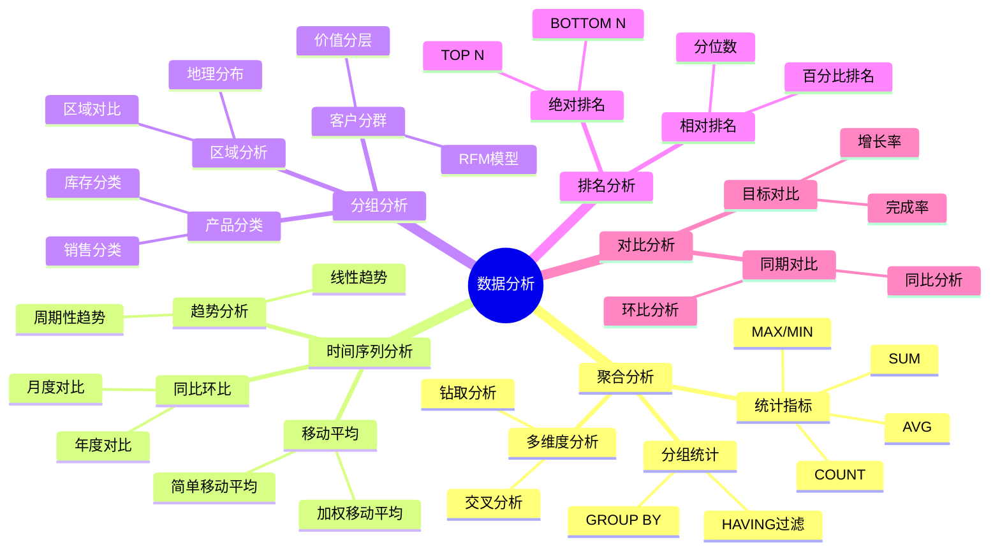
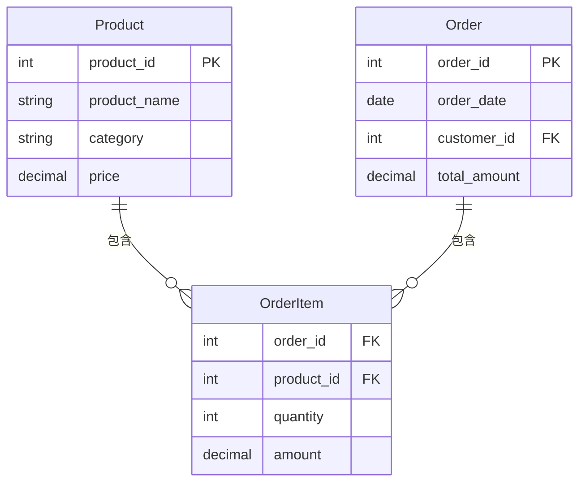
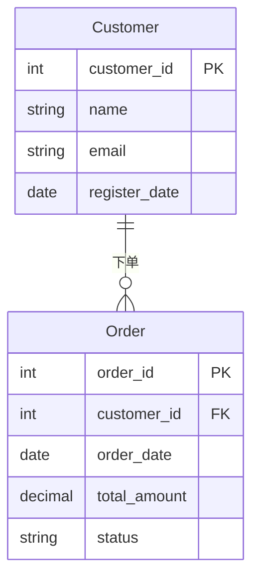
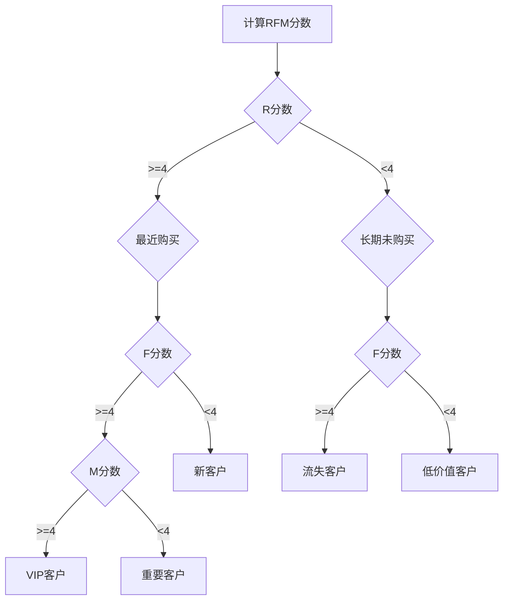

# 数据分析案例

> **创建日期**：2025-01-15
> **最后更新**：2025-01-16
> **版本**：v1.0.0
> **难度**：⭐⭐⭐⭐
> **应用场景**：数据分析、报表生成、数据挖掘

---

## 📋 目录

- [数据分析案例](#数据分析案例)
  - [📋 目录](#-目录)
  - [一、概述](#一概述)
    - [1.1 数据分析场景分类思维导图](#11-数据分析场景分类思维导图)
    - [1.2 数据分析方法对比矩阵](#12-数据分析方法对比矩阵)
  - [二、聚合分析](#二聚合分析)
    - [2.1 案例：销售统计](#21-案例销售统计)
  - [三、时间序列分析](#三时间序列分析)
    - [3.1 案例：月度销售趋势](#31-案例月度销售趋势)
  - [四、分组分析](#四分组分析)
    - [4.1 案例：客户分群（RFM模型）](#41-案例客户分群rfm模型)
  - [五、相关资源](#五相关资源)
    - [相关文档](#相关文档)

---

## 一、概述

本文档提供数据分析SQL查询的实际案例，涵盖聚合分析、时间序列分析、分组分析等场景。

### 1.1 数据分析场景分类思维导图



### 1.2 数据分析方法对比矩阵

| 分析方法 | SQL实现 | 复杂度 | 性能 | 适用场景 |
|---------|---------|--------|------|---------|
| **聚合分析** | GROUP BY + 聚合函数 | ⭐⭐ | ⭐⭐⭐⭐ | 统计汇总 |
| **时间序列** | 窗口函数 + 日期函数 | ⭐⭐⭐ | ⭐⭐⭐ | 趋势分析 |
| **分组分析** | CASE WHEN + GROUP BY | ⭐⭐ | ⭐⭐⭐ | 客户分群 |
| **排名分析** | 窗口函数 RANK | ⭐⭐⭐ | ⭐⭐⭐ | TOP N查询 |
| **对比分析** | LAG/LEAD + 计算 | ⭐⭐⭐⭐ | ⭐⭐ | 同比环比 |

---

## 二、聚合分析

### 2.1 案例：销售统计

**场景描述**：电商平台需要按商品类别统计销售数据，用于生成销售报表和制定营销策略。

**业务需求**：

- 按商品类别统计总销售额
- 计算平均订单金额
- 统计订单数量
- 按销售额降序排列

**数据模型**：



**查询**：

```sql
SELECT
    product_category,
    SUM(amount) as total_sales,
    AVG(amount) as avg_sales,
    COUNT(*) as order_count,
    COUNT(DISTINCT order_id) as unique_orders,
    MAX(amount) as max_order,
    MIN(amount) as min_order
FROM Sales
GROUP BY product_category
HAVING SUM(amount) > 10000  -- 只显示销售额大于10000的类别
ORDER BY total_sales DESC;
```

**关系代数表示**：

```latex
γ_{product_category, SUM(amount), AVG(amount), COUNT(*)}(Sales)
```

**查询结果示例**：

```text
| product_category | total_sales | avg_sales | order_count | unique_orders | max_order | min_order |
|------------------|-------------|-----------|-------------|---------------|-----------|-----------|
| 电子产品        | 500000      | 5000      | 100         | 80            | 20000     | 1000      |
| 服装            | 300000      | 3000      | 100         | 90            | 15000     | 500       |
| 图书            | 100000      | 1000      | 100         | 95            | 5000      | 200       |
```

**性能优化**：

```sql
-- 创建索引优化GROUP BY
CREATE INDEX idx_sales_category ON Sales(product_category);
CREATE INDEX idx_sales_amount ON Sales(amount);

-- 使用物化视图（如果数据库支持）
CREATE MATERIALIZED VIEW mv_category_sales AS
SELECT
    product_category,
    SUM(amount) as total_sales,
    AVG(amount) as avg_sales,
    COUNT(*) as order_count
FROM Sales
GROUP BY product_category;
```

---

## 三、时间序列分析

### 3.1 案例：月度销售趋势

**查询**：

```sql
SELECT
    DATE_TRUNC('month', sale_date) as month,
    SUM(amount) as monthly_sales,
    LAG(SUM(amount)) OVER (ORDER BY DATE_TRUNC('month', sale_date)) as prev_month_sales
FROM Sales
GROUP BY DATE_TRUNC('month', sale_date)
ORDER BY month;
```

---

## 四、分组分析

### 4.1 案例：客户分群（RFM模型）

**场景描述**：电商平台使用RFM模型对客户进行分群，制定精准营销策略。

**RFM模型**：

- **R (Recency)**：最近一次购买时间
- **F (Frequency)**：购买频率
- **M (Monetary)**：购买金额

**数据模型**：



**RFM分群查询**：

```sql
WITH customer_rfm AS (
    SELECT
        customer_id,
        -- R: 最近一次购买距离现在的天数
        DATEDIFF(DAY, MAX(order_date), CURRENT_DATE) as recency,
        -- F: 购买频率（订单数）
        COUNT(*) as frequency,
        -- M: 购买金额
        SUM(total_amount) as monetary
    FROM Orders
    WHERE status = 'completed'
    GROUP BY customer_id
),
rfm_scores AS (
    SELECT
        customer_id,
        recency,
        frequency,
        monetary,
        -- R分数（越小越好，最近购买得分高）
        CASE
            WHEN recency <= 30 THEN 5
            WHEN recency <= 60 THEN 4
            WHEN recency <= 90 THEN 3
            WHEN recency <= 180 THEN 2
            ELSE 1
        END as r_score,
        -- F分数（越大越好）
        CASE
            WHEN frequency >= 20 THEN 5
            WHEN frequency >= 10 THEN 4
            WHEN frequency >= 5 THEN 3
            WHEN frequency >= 2 THEN 2
            ELSE 1
        END as f_score,
        -- M分数（越大越好）
        CASE
            WHEN monetary >= 10000 THEN 5
            WHEN monetary >= 5000 THEN 4
            WHEN monetary >= 2000 THEN 3
            WHEN monetary >= 1000 THEN 2
            ELSE 1
        END as m_score
    FROM customer_rfm
)
SELECT
    customer_id,
    recency,
    frequency,
    monetary,
    r_score,
    f_score,
    m_score,
    r_score + f_score + m_score as rfm_score,
    CASE
        WHEN r_score >= 4 AND f_score >= 4 AND m_score >= 4 THEN 'VIP客户'
        WHEN r_score >= 3 AND f_score >= 3 AND m_score >= 3 THEN '重要客户'
        WHEN r_score >= 2 AND f_score >= 2 THEN '普通客户'
        WHEN r_score >= 4 AND f_score <= 2 THEN '新客户'
        WHEN r_score <= 2 AND f_score >= 4 THEN '流失客户'
        ELSE '低价值客户'
    END as customer_segment
FROM rfm_scores
ORDER BY rfm_score DESC;
```

**客户分群决策树**：



**客户分群矩阵**：

| R分数 | F分数 | M分数 | 客户类型 | 营销策略 |
|-------|-------|-------|---------|---------|
| 5 | 5 | 5 | VIP客户 | 专属服务、高价值优惠 |
| 4-5 | 4-5 | 4-5 | 重要客户 | 定期优惠、会员权益 |
| 3-4 | 3-4 | 3-4 | 普通客户 | 常规营销、提升复购 |
| 4-5 | 1-2 | 1-2 | 新客户 | 新客优惠、引导复购 |
| 1-2 | 4-5 | 4-5 | 流失客户 | 召回活动、挽回策略 |
| 1-2 | 1-2 | 1-2 | 低价值客户 | 基础维护、成本控制 |

**查询结果示例**：

```text
| customer_id | recency | frequency | monetary | r_score | f_score | m_score | rfm_score | customer_segment |
|-------------|---------|-----------|----------|---------|---------|---------|-----------|------------------|
| 1001        | 15      | 25        | 15000    | 5       | 5       | 5       | 15        | VIP客户          |
| 1002        | 45      | 12        | 8000     | 4       | 4       | 4       | 12        | 重要客户         |
| 1003        | 200     | 8         | 6000     | 2       | 3       | 3       | 8         | 流失客户         |
```

---

## 五、相关资源

### 相关文档

- [复杂查询案例](./07.01-复杂查询案例.md) - 复杂查询
- [ETL流程案例](./07.03-ETL流程案例.md) - ETL查询

---

**维护者**: SQL Standards Team
**最后更新**: 2025-01-16
