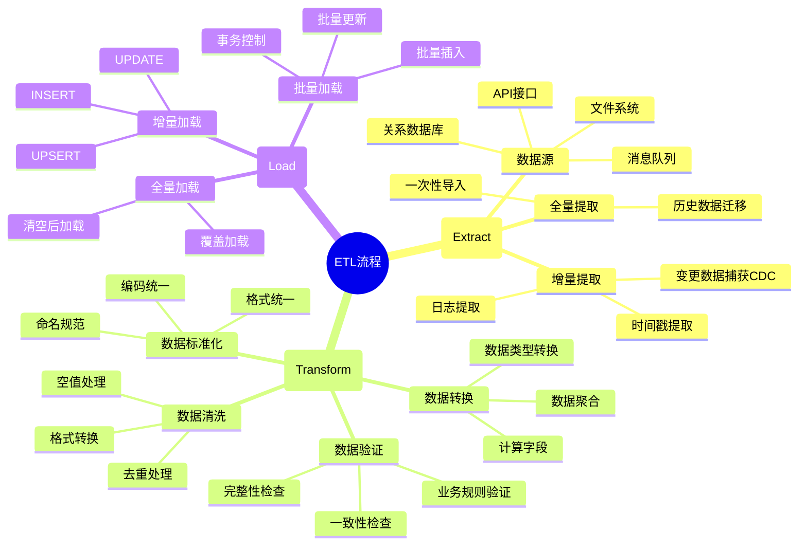
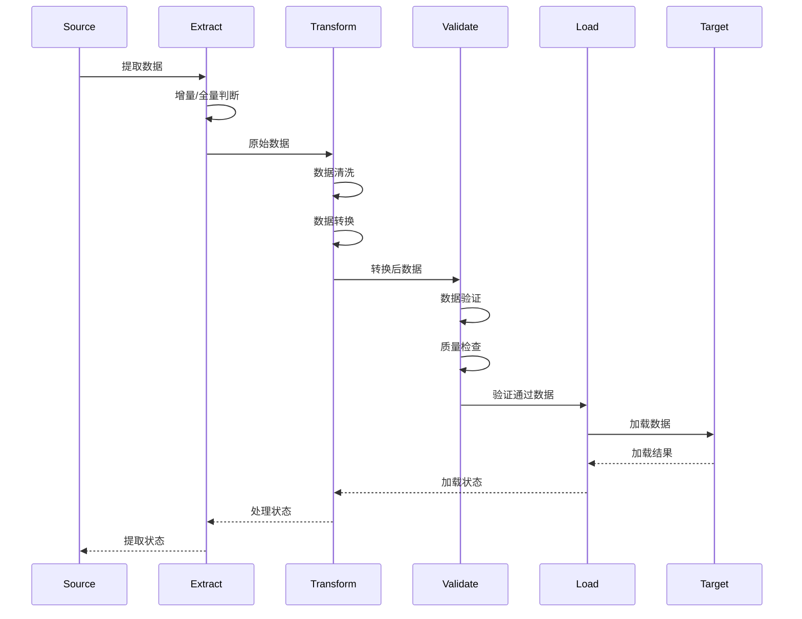
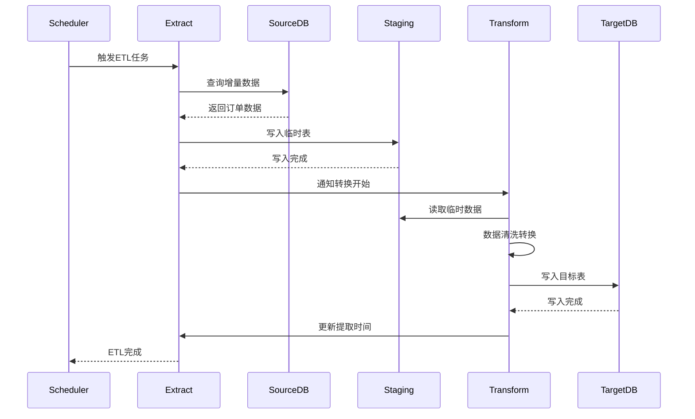

# ETL流程案例

> **创建日期**：2025-01-15
> **最后更新**：2025-01-15
> **版本**：v1.0.0
> **难度**：⭐⭐⭐⭐
> **应用场景**：ETL流程、数据转换、数据加载

---

## 📋 目录

- [ETL流程案例](#etl流程案例)
  - [📋 目录](#-目录)
  - [一、概述](#一概述)
    - [1.1 ETL流程思维导图](#11-etl流程思维导图)
    - [1.2 ETL流程时序图](#12-etl流程时序图)
  - [二、数据提取](#二数据提取)
    - [2.1 案例：增量数据提取](#21-案例增量数据提取)
  - [三、数据转换](#三数据转换)
    - [3.1 案例：数据清洗和转换](#31-案例数据清洗和转换)
  - [四、数据加载](#四数据加载)
    - [4.1 案例：批量数据加载](#41-案例批量数据加载)
  - [五、相关资源](#五相关资源)
    - [相关文档](#相关文档)

---

## 一、概述

本文档提供ETL流程中SQL查询的实际案例，涵盖数据提取、转换、加载的完整流程。

### 1.1 ETL流程思维导图



### 1.2 ETL流程时序图



---

## 二、数据提取

### 2.1 案例：增量数据提取

**场景描述**：电商系统需要每天从订单系统提取新增订单数据到数据仓库，用于分析和报表。

**业务需求**：

- 只提取上次提取后新增或更新的订单
- 记录提取时间点
- 支持断点续传
- 处理数据量：每天约10万条订单

**方案对比**：

| 方案 | 实现方式 | 优点 | 缺点 | 适用场景 |
|------|---------|------|------|---------|
| **时间戳提取** | WHERE last_updated > :last_time | 简单、高效 | 依赖时间戳字段 | 有更新时间戳 |
| **CDC变更捕获** | 读取变更日志 | 实时、准确 | 实现复杂 | 需要CDC支持 |
| **全量对比** | 全量提取后对比 | 准确 | 性能差 | 小数据量 |

**方案1：时间戳提取（推荐）**:

```sql
-- 提取新增和更新的订单
SELECT
    order_id,
    customer_id,
    order_date,
    total_amount,
    status,
    last_updated
FROM Orders
WHERE last_updated > :last_extract_time
ORDER BY last_updated;

-- 更新提取时间点
UPDATE ETL_Config
SET last_extract_time = CURRENT_TIMESTAMP
WHERE table_name = 'Orders';
```

**方案2：变更数据捕获（CDC）**:

```sql
-- 从变更日志表提取
SELECT
    order_id,
    customer_id,
    order_date,
    total_amount,
    status,
    change_type,  -- INSERT, UPDATE, DELETE
    change_time
FROM Orders_CDC
WHERE change_time > :last_extract_time
  AND change_type IN ('INSERT', 'UPDATE')
ORDER BY change_time;
```

**ETL流程时序图**：



**性能优化**：

```sql
-- 创建索引优化提取
CREATE INDEX idx_orders_last_updated ON Orders(last_updated);

-- 分区表优化（如果支持）
CREATE TABLE Orders (
    ...
) PARTITION BY RANGE (last_updated);

-- 批量提取优化
SELECT * FROM Orders
WHERE last_updated > :last_extract_time
ORDER BY last_updated
LIMIT 10000;  -- 分批提取
```

---

## 三、数据转换

### 3.1 案例：数据清洗和转换

**查询**：

```sql
SELECT
    TRIM(UPPER(name)) as clean_name,
    CAST(age AS INTEGER) as age_int,
    CASE
        WHEN status = 'A' THEN 'Active'
        WHEN status = 'I' THEN 'Inactive'
        ELSE 'Unknown'
    END as status_desc
FROM RawData
WHERE age IS NOT NULL;
```

---

## 四、数据加载

### 4.1 案例：批量数据加载

**查询**：

```sql
INSERT INTO TargetTable (id, name, age, status)
SELECT id, name, age, status
FROM StagingTable
WHERE NOT EXISTS (
    SELECT 1 FROM TargetTable
    WHERE TargetTable.id = StagingTable.id
);
```

---

## 五、相关资源

### 相关文档

- [复杂查询案例](./07.01-复杂查询案例.md) - 复杂查询
- [数据分析案例](./07.02-数据分析案例.md) - 数据分析

---

**维护者**: SQL Standards Team
**最后更新**: 2025-01-15
