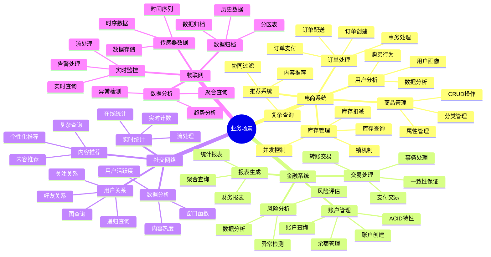
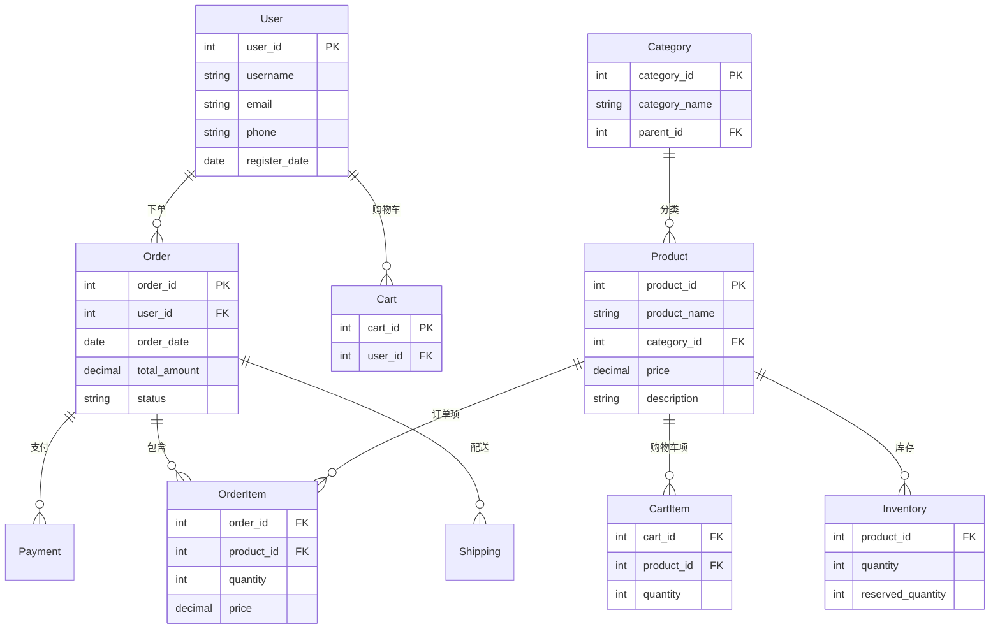
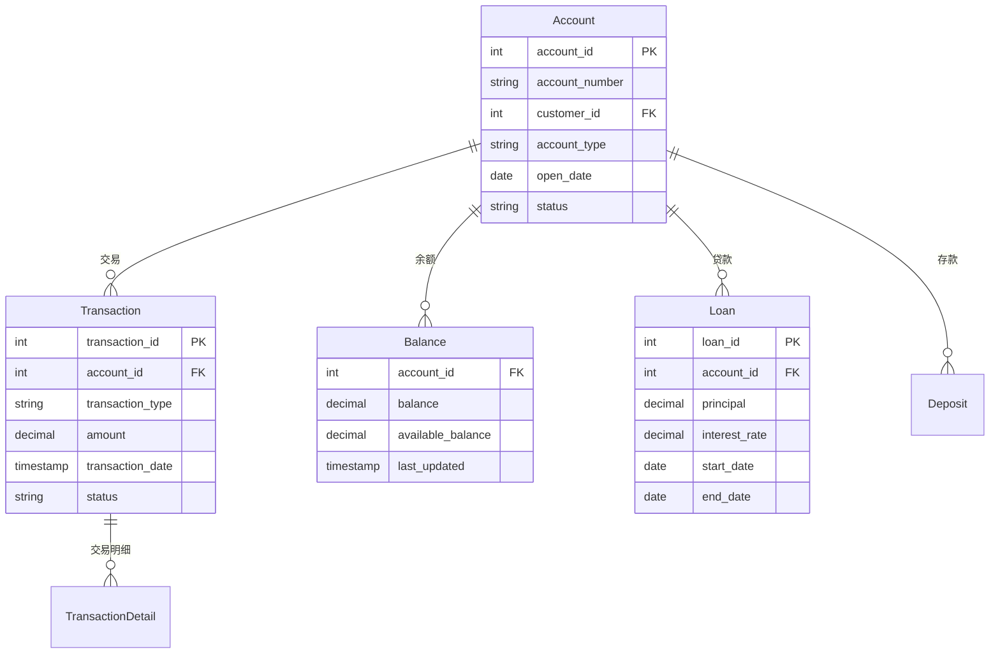
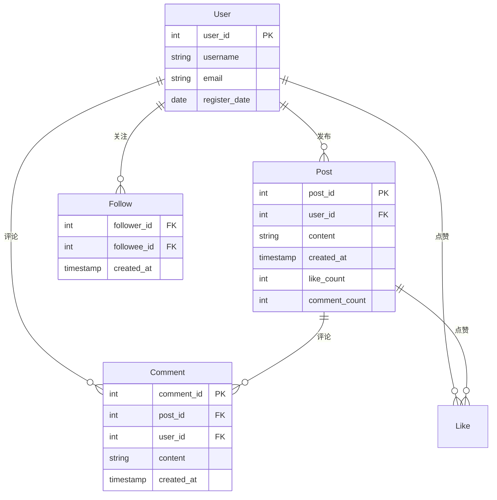
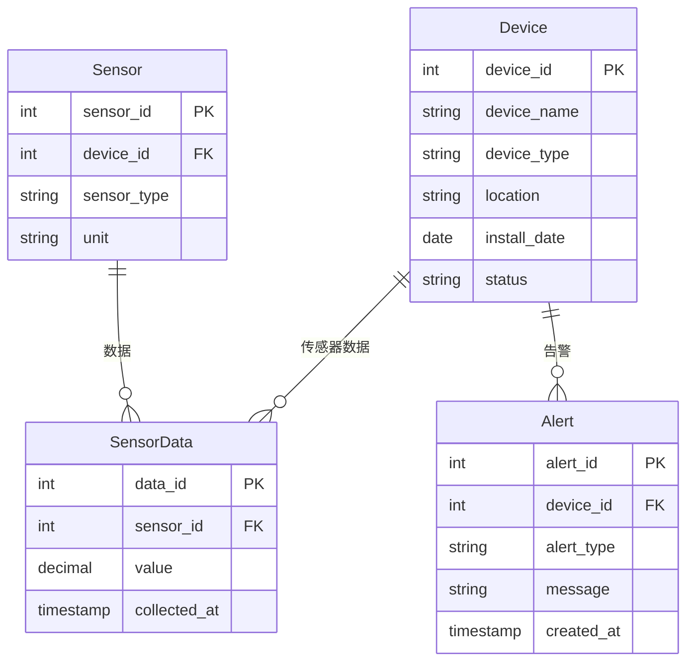

# 业务场景完整指南

> **创建日期**：2025-01-15
> **最后更新**：2025-01-15
> **版本**：v1.0.0
> **难度**：⭐⭐⭐⭐
> **应用场景**：业务系统设计、SQL实践、最佳实践

---

## 📋 目录

- [业务场景完整指南](#业务场景完整指南)
  - [📋 目录](#-目录)
  - [一、概述](#一概述)
    - [1.1 业务场景分类思维导图](#11-业务场景分类思维导图)
    - [1.2 业务场景对比矩阵](#12-业务场景对比矩阵)
  - [二、电商系统场景](#二电商系统场景)
    - [2.1 系统架构ER图](#21-系统架构er图)
    - [2.2 商品管理（CRUD操作）](#22-商品管理crud操作)
      - [2.2.1 商品创建](#221-商品创建)
      - [2.2.2 商品查询](#222-商品查询)
      - [2.2.3 商品更新](#223-商品更新)
      - [2.2.4 商品删除](#224-商品删除)
    - [2.3 订单处理（事务处理）](#23-订单处理事务处理)
      - [2.3.1 订单创建事务](#231-订单创建事务)
      - [2.3.2 订单支付事务](#232-订单支付事务)
    - [2.4 库存管理（并发控制）](#24-库存管理并发控制)
      - [2.4.1 库存查询（带锁）](#241-库存查询带锁)
      - [2.4.2 库存扣减（乐观锁）](#242-库存扣减乐观锁)
      - [2.4.3 库存扣减（悲观锁）](#243-库存扣减悲观锁)
    - [2.5 用户分析（数据分析）](#25-用户分析数据分析)
      - [2.5.1 用户购买行为分析](#251-用户购买行为分析)
      - [2.5.2 用户画像分析](#252-用户画像分析)
    - [2.6 推荐系统（复杂查询）](#26-推荐系统复杂查询)
      - [2.6.1 基于协同过滤的商品推荐](#261-基于协同过滤的商品推荐)
  - [三、金融系统场景](#三金融系统场景)
    - [3.1 系统架构ER图](#31-系统架构er图)
    - [3.2 账户管理（ACID特性）](#32-账户管理acid特性)
      - [3.2.1 账户创建](#321-账户创建)
      - [3.2.2 账户查询](#322-账户查询)
    - [3.3 交易处理（事务处理）](#33-交易处理事务处理)
      - [3.3.1 转账交易](#331-转账交易)
      - [3.3.2 支付交易](#332-支付交易)
    - [3.4 风险分析（数据分析）](#34-风险分析数据分析)
      - [3.4.1 异常交易检测](#341-异常交易检测)
    - [3.5 报表生成（聚合查询）](#35-报表生成聚合查询)
      - [3.5.1 财务报表生成](#351-财务报表生成)
  - [四、社交网络场景](#四社交网络场景)
    - [4.1 系统架构ER图](#41-系统架构er图)
    - [4.2 用户关系（图查询）](#42-用户关系图查询)
      - [4.2.1 好友关系查询](#421-好友关系查询)
      - [4.2.2 共同好友查询](#422-共同好友查询)
      - [4.2.3 好友推荐（基于共同好友）](#423-好友推荐基于共同好友)
    - [4.3 内容推荐（复杂查询）](#43-内容推荐复杂查询)
      - [4.3.1 基于关注的内容推荐](#431-基于关注的内容推荐)
    - [4.4 数据分析（窗口函数）](#44-数据分析窗口函数)
      - [4.4.1 用户活跃度分析](#441-用户活跃度分析)
    - [4.5 实时统计（流处理）](#45-实时统计流处理)
      - [4.5.1 实时热门内容统计](#451-实时热门内容统计)
  - [五、物联网场景](#五物联网场景)
    - [5.1 系统架构ER图](#51-系统架构er图)
    - [5.2 传感器数据存储（时序数据）](#52-传感器数据存储时序数据)
      - [5.2.1 时序数据表设计](#521-时序数据表设计)
      - [5.2.2 批量插入传感器数据](#522-批量插入传感器数据)
    - [5.3 数据分析（聚合查询）](#53-数据分析聚合查询)
      - [5.3.1 传感器数据统计](#531-传感器数据统计)
      - [5.3.2 趋势分析](#532-趋势分析)
    - [5.4 实时监控（流处理）](#54-实时监控流处理)
      - [5.4.1 异常值检测](#541-异常值检测)
    - [5.5 数据归档（分区表）](#55-数据归档分区表)
      - [5.5.1 数据归档策略](#551-数据归档策略)
  - [六、相关资源](#六相关资源)
    - [相关文档](#相关文档)

---

## 一、概述

本文档提供完整的业务场景SQL实践指南，涵盖电商、金融、社交网络、物联网等典型业务场景。

### 1.1 业务场景分类思维导图



### 1.2 业务场景对比矩阵

| 业务场景 | 主要特点 | SQL特性 | 性能要求 | 数据量 | 典型操作 |
|---------|---------|---------|---------|--------|---------|
| **电商系统** | 高并发、事务性强 | 事务、锁、索引 | 高 | 大 | CRUD、JOIN、聚合 |
| **金融系统** | 强一致性、高可靠性 | ACID、事务、约束 | 极高 | 中-大 | 事务、聚合、报表 |
| **社交网络** | 关系复杂、实时性 | 递归查询、窗口函数 | 中-高 | 极大 | 图查询、推荐、统计 |
| **物联网** | 时序数据、高写入 | 分区表、时序查询 | 中 | 极大 | 插入、聚合、归档 |

---

## 二、电商系统场景

### 2.1 系统架构ER图



### 2.2 商品管理（CRUD操作）

#### 2.2.1 商品创建

```sql
-- 创建商品
INSERT INTO Product (product_name, category_id, price, description)
VALUES ('iPhone 15 Pro', 1, 8999.00, 'Apple iPhone 15 Pro 256GB');

-- 创建商品库存
INSERT INTO Inventory (product_id, quantity, reserved_quantity)
VALUES (LAST_INSERT_ID(), 100, 0);
```

#### 2.2.2 商品查询

```sql
-- 查询商品列表（带分类信息）
SELECT
    p.product_id,
    p.product_name,
    c.category_name,
    p.price,
    i.quantity as stock_quantity
FROM Product p
JOIN Category c ON p.category_id = c.category_id
LEFT JOIN Inventory i ON p.product_id = i.product_id
WHERE p.price BETWEEN 1000 AND 10000
ORDER BY p.price DESC
LIMIT 20;
```

#### 2.2.3 商品更新

```sql
-- 更新商品价格
UPDATE Product
SET price = 7999.00
WHERE product_id = 1;

-- 批量更新商品分类
UPDATE Product
SET category_id = 2
WHERE category_id = 1 AND price < 1000;
```

#### 2.2.4 商品删除

```sql
-- 软删除商品（推荐）
UPDATE Product
SET status = 'deleted'
WHERE product_id = 1;

-- 硬删除商品（需先删除关联数据）
DELETE FROM Inventory WHERE product_id = 1;
DELETE FROM Product WHERE product_id = 1;
```

### 2.3 订单处理（事务处理）

#### 2.3.1 订单创建事务

```sql
-- 订单创建事务（保证数据一致性）
BEGIN TRANSACTION;

-- 1. 创建订单
INSERT INTO Order (user_id, order_date, total_amount, status)
VALUES (1, CURRENT_DATE, 8999.00, 'pending');

SET @order_id = LAST_INSERT_ID();

-- 2. 创建订单项
INSERT INTO OrderItem (order_id, product_id, quantity, price)
VALUES (@order_id, 1, 1, 8999.00);

-- 3. 扣减库存
UPDATE Inventory
SET quantity = quantity - 1,
    reserved_quantity = reserved_quantity + 1
WHERE product_id = 1 AND quantity >= 1;

-- 4. 检查库存是否足够
IF (SELECT quantity FROM Inventory WHERE product_id = 1) < 0 THEN
    ROLLBACK;
ELSE
    COMMIT;
END IF;
```

#### 2.3.2 订单支付事务

```sql
-- 订单支付事务
BEGIN TRANSACTION;

-- 1. 更新订单状态
UPDATE Order
SET status = 'paid',
    payment_date = CURRENT_TIMESTAMP
WHERE order_id = 1 AND status = 'pending';

-- 2. 创建支付记录
INSERT INTO Payment (order_id, amount, payment_method, payment_date)
VALUES (1, 8999.00, 'credit_card', CURRENT_TIMESTAMP);

-- 3. 确认库存扣减
UPDATE Inventory
SET reserved_quantity = reserved_quantity - 1
WHERE product_id = 1;

COMMIT;
```

### 2.4 库存管理（并发控制）

#### 2.4.1 库存查询（带锁）

```sql
-- 查询可用库存（使用行锁）
SELECT
    product_id,
    quantity - reserved_quantity as available_quantity
FROM Inventory
WHERE product_id = 1
FOR UPDATE;  -- 行级锁，防止并发修改
```

#### 2.4.2 库存扣减（乐观锁）

```sql
-- 使用版本号实现乐观锁
UPDATE Inventory
SET quantity = quantity - 1,
    version = version + 1
WHERE product_id = 1
  AND version = @current_version  -- 检查版本号
  AND quantity >= 1;

-- 检查更新是否成功
IF ROW_COUNT() = 0 THEN
    -- 版本冲突，重试或返回错误
    SIGNAL SQLSTATE '45000' SET MESSAGE_TEXT = '库存更新冲突，请重试';
END IF;
```

#### 2.4.3 库存扣减（悲观锁）

```sql
-- 使用SELECT FOR UPDATE实现悲观锁
BEGIN TRANSACTION;

SELECT quantity, reserved_quantity
FROM Inventory
WHERE product_id = 1
FOR UPDATE;  -- 获取行锁

-- 检查库存
IF quantity - reserved_quantity >= 1 THEN
    UPDATE Inventory
    SET quantity = quantity - 1,
        reserved_quantity = reserved_quantity + 1
    WHERE product_id = 1;
    COMMIT;
ELSE
    ROLLBACK;
    SIGNAL SQLSTATE '45000' SET MESSAGE_TEXT = '库存不足';
END IF;
```

### 2.5 用户分析（数据分析）

#### 2.5.1 用户购买行为分析

```sql
-- 用户购买行为分析
WITH user_purchase_stats AS (
    SELECT
        u.user_id,
        u.username,
        COUNT(DISTINCT o.order_id) as order_count,
        SUM(o.total_amount) as total_spent,
        AVG(o.total_amount) as avg_order_amount,
        MAX(o.order_date) as last_purchase_date,
        MIN(o.order_date) as first_purchase_date
    FROM User u
    LEFT JOIN Order o ON u.user_id = o.user_id
    WHERE o.status = 'completed'
    GROUP BY u.user_id, u.username
)
SELECT
    user_id,
    username,
    order_count,
    total_spent,
    avg_order_amount,
    DATEDIFF(CURRENT_DATE, last_purchase_date) as days_since_last_purchase,
    CASE
        WHEN total_spent >= 10000 THEN 'VIP'
        WHEN total_spent >= 5000 THEN 'Gold'
        WHEN total_spent >= 1000 THEN 'Silver'
        ELSE 'Regular'
    END as user_level
FROM user_purchase_stats
ORDER BY total_spent DESC;
```

#### 2.5.2 用户画像分析

```sql
-- 用户画像分析（使用窗口函数）
SELECT
    u.user_id,
    u.username,
    COUNT(DISTINCT o.order_id) as order_count,
    SUM(o.total_amount) as total_spent,
    -- 计算用户购买频率排名
    RANK() OVER (ORDER BY COUNT(DISTINCT o.order_id) DESC) as frequency_rank,
    -- 计算用户消费金额排名
    RANK() OVER (ORDER BY SUM(o.total_amount) DESC) as spending_rank,
    -- 计算最近购买时间
    MAX(o.order_date) as last_purchase_date,
    -- 计算购买间隔
    AVG(DATEDIFF(o.order_date, LAG(o.order_date) OVER (PARTITION BY u.user_id ORDER BY o.order_date))) as avg_purchase_interval
FROM User u
LEFT JOIN Order o ON u.user_id = o.user_id
WHERE o.status = 'completed'
GROUP BY u.user_id, u.username;
```

### 2.6 推荐系统（复杂查询）

#### 2.6.1 基于协同过滤的商品推荐

```sql
-- 基于用户购买历史的商品推荐
WITH user_similarity AS (
    -- 计算用户相似度（基于共同购买的商品）
    SELECT
        o1.user_id as user1,
        o2.user_id as user2,
        COUNT(DISTINCT oi1.product_id) as common_products,
        COUNT(DISTINCT oi1.product_id) * 1.0 /
        (SELECT COUNT(DISTINCT product_id) FROM OrderItem WHERE order_id IN (SELECT order_id FROM Order WHERE user_id = o1.user_id)) as similarity
    FROM Order o1
    JOIN OrderItem oi1 ON o1.order_id = oi1.order_id
    JOIN OrderItem oi2 ON oi1.product_id = oi2.product_id
    JOIN Order o2 ON oi2.order_id = o2.order_id
    WHERE o1.user_id != o2.user_id
      AND o1.status = 'completed'
      AND o2.status = 'completed'
    GROUP BY o1.user_id, o2.user_id
    HAVING common_products >= 3
),
recommended_products AS (
    -- 基于相似用户推荐商品
    SELECT
        us.user1 as target_user,
        oi.product_id,
        SUM(us.similarity * oi.quantity) as recommendation_score
    FROM user_similarity us
    JOIN Order o ON us.user2 = o.user_id
    JOIN OrderItem oi ON o.order_id = oi.order_id
    WHERE o.status = 'completed'
      AND oi.product_id NOT IN (
          SELECT product_id
          FROM OrderItem oi2
          JOIN Order o2 ON oi2.order_id = o2.order_id
          WHERE o2.user_id = us.user1
      )
    GROUP BY us.user1, oi.product_id
)
SELECT
    rp.target_user,
    p.product_name,
    p.price,
    rp.recommendation_score
FROM recommended_products rp
JOIN Product p ON rp.product_id = p.product_id
WHERE rp.target_user = 1
ORDER BY rp.recommendation_score DESC
LIMIT 10;
```

---

## 三、金融系统场景

### 3.1 系统架构ER图



### 3.2 账户管理（ACID特性）

#### 3.2.1 账户创建

```sql
-- 创建账户（保证ACID特性）
BEGIN TRANSACTION;

-- 1. 创建账户
INSERT INTO Account (account_number, customer_id, account_type, open_date, status)
VALUES ('ACC001', 1, 'checking', CURRENT_DATE, 'active');

SET @account_id = LAST_INSERT_ID();

-- 2. 初始化余额
INSERT INTO Balance (account_id, balance, available_balance, last_updated)
VALUES (@account_id, 0.00, 0.00, CURRENT_TIMESTAMP);

COMMIT;
```

#### 3.2.2 账户查询

```sql
-- 查询账户信息（带余额）
SELECT
    a.account_id,
    a.account_number,
    a.account_type,
    b.balance,
    b.available_balance,
    b.last_updated
FROM Account a
JOIN Balance b ON a.account_id = b.account_id
WHERE a.customer_id = 1
  AND a.status = 'active';
```

### 3.3 交易处理（事务处理）

#### 3.3.1 转账交易

```sql
-- 转账交易（保证ACID特性）
BEGIN TRANSACTION;

-- 1. 检查转出账户余额
SELECT balance, available_balance
INTO @from_balance, @from_available
FROM Balance
WHERE account_id = 1
FOR UPDATE;  -- 行级锁

-- 2. 检查余额是否足够
IF @from_available < 1000.00 THEN
    ROLLBACK;
    SIGNAL SQLSTATE '45000' SET MESSAGE_TEXT = '余额不足';
END IF;

-- 3. 扣减转出账户余额
UPDATE Balance
SET balance = balance - 1000.00,
    available_balance = available_balance - 1000.00,
    last_updated = CURRENT_TIMESTAMP
WHERE account_id = 1;

-- 4. 增加转入账户余额
UPDATE Balance
SET balance = balance + 1000.00,
    available_balance = available_balance + 1000.00,
    last_updated = CURRENT_TIMESTAMP
WHERE account_id = 2;

-- 5. 创建交易记录
INSERT INTO Transaction (account_id, transaction_type, amount, transaction_date, status)
VALUES (1, 'transfer_out', -1000.00, CURRENT_TIMESTAMP, 'completed'),
       (2, 'transfer_in', 1000.00, CURRENT_TIMESTAMP, 'completed');

COMMIT;
```

#### 3.3.2 支付交易

```sql
-- 支付交易（保证一致性）
BEGIN TRANSACTION;

-- 1. 扣减账户余额
UPDATE Balance
SET balance = balance - 500.00,
    available_balance = available_balance - 500.00,
    last_updated = CURRENT_TIMESTAMP
WHERE account_id = 1
  AND available_balance >= 500.00;

-- 2. 检查更新是否成功
IF ROW_COUNT() = 0 THEN
    ROLLBACK;
    SIGNAL SQLSTATE '45000' SET MESSAGE_TEXT = '余额不足';
END IF;

-- 3. 创建交易记录
INSERT INTO Transaction (account_id, transaction_type, amount, transaction_date, status)
VALUES (1, 'payment', -500.00, CURRENT_TIMESTAMP, 'completed');

COMMIT;
```

### 3.4 风险分析（数据分析）

#### 3.4.1 异常交易检测

```sql
-- 异常交易检测（使用窗口函数）
WITH transaction_stats AS (
    SELECT
        account_id,
        transaction_date,
        amount,
        -- 计算平均交易金额
        AVG(amount) OVER (PARTITION BY account_id ORDER BY transaction_date ROWS BETWEEN 29 PRECEDING AND CURRENT ROW) as avg_amount_30d,
        -- 计算交易金额标准差
        STDDEV(amount) OVER (PARTITION BY account_id ORDER BY transaction_date ROWS BETWEEN 29 PRECEDING AND CURRENT ROW) as stddev_amount_30d,
        -- 计算交易频率
        COUNT(*) OVER (PARTITION BY account_id ORDER BY transaction_date ROWS BETWEEN 23 PRECEDING AND CURRENT ROW) as transaction_count_24h
    FROM Transaction
    WHERE transaction_date >= DATE_SUB(CURRENT_TIMESTAMP, INTERVAL 30 DAY)
      AND status = 'completed'
)
SELECT
    account_id,
    transaction_date,
    amount,
    avg_amount_30d,
    stddev_amount_30d,
    transaction_count_24h,
    CASE
        WHEN ABS(amount) > avg_amount_30d + 3 * stddev_amount_30d THEN '金额异常'
        WHEN transaction_count_24h > 20 THEN '频率异常'
        ELSE '正常'
    END as risk_level
FROM transaction_stats
WHERE ABS(amount) > avg_amount_30d + 3 * stddev_amount_30d
   OR transaction_count_24h > 20
ORDER BY transaction_date DESC;
```

### 3.5 报表生成（聚合查询）

#### 3.5.1 财务报表生成

```sql
-- 财务报表生成（按日期、类型统计）
SELECT
    DATE(transaction_date) as transaction_date,
    transaction_type,
    COUNT(*) as transaction_count,
    SUM(amount) as total_amount,
    AVG(amount) as avg_amount,
    MIN(amount) as min_amount,
    MAX(amount) as max_amount
FROM Transaction
WHERE transaction_date >= DATE_SUB(CURRENT_DATE, INTERVAL 30 DAY)
  AND status = 'completed'
GROUP BY DATE(transaction_date), transaction_type
ORDER BY transaction_date DESC, transaction_type;
```

---

## 四、社交网络场景

### 4.1 系统架构ER图



### 4.2 用户关系（图查询）

#### 4.2.1 好友关系查询

```sql
-- 查询用户的好友（双向关注）
SELECT
    u1.user_id as user1,
    u2.user_id as user2,
    u1.username as user1_name,
    u2.username as user2_name
FROM Follow f1
JOIN Follow f2 ON f1.follower_id = f2.followee_id AND f1.followee_id = f2.follower_id
JOIN User u1 ON f1.follower_id = u1.user_id
JOIN User u2 ON f1.followee_id = u2.user_id
WHERE f1.follower_id = 1;
```

#### 4.2.2 共同好友查询

```sql
-- 查询两个用户的共同好友
SELECT
    u.user_id,
    u.username
FROM Follow f1
JOIN Follow f2 ON f1.followee_id = f2.followee_id
JOIN User u ON f1.followee_id = u.user_id
WHERE f1.follower_id = 1
  AND f2.follower_id = 2
  AND f1.followee_id = f2.followee_id;
```

#### 4.2.3 好友推荐（基于共同好友）

```sql
-- 基于共同好友的好友推荐
WITH common_friends AS (
    SELECT
        f2.follower_id as recommended_user,
        COUNT(*) as common_friend_count
    FROM Follow f1
    JOIN Follow f2 ON f1.followee_id = f2.followee_id
    WHERE f1.follower_id = 1
      AND f2.follower_id != 1
      AND f2.follower_id NOT IN (
          SELECT followee_id FROM Follow WHERE follower_id = 1
      )
    GROUP BY f2.follower_id
)
SELECT
    u.user_id,
    u.username,
    cf.common_friend_count
FROM common_friends cf
JOIN User u ON cf.recommended_user = u.user_id
ORDER BY cf.common_friend_count DESC
LIMIT 10;
```

### 4.3 内容推荐（复杂查询）

#### 4.3.1 基于关注的内容推荐

```sql
-- 基于关注用户的内容推荐
SELECT
    p.post_id,
    p.content,
    u.username as author,
    p.created_at,
    p.like_count,
    p.comment_count,
    -- 计算推荐分数（基于关注用户的互动）
    (p.like_count * 1.0 + p.comment_count * 2.0) as recommendation_score
FROM Post p
JOIN User u ON p.user_id = u.user_id
WHERE p.user_id IN (
    SELECT followee_id
    FROM Follow
    WHERE follower_id = 1
)
  AND p.created_at >= DATE_SUB(CURRENT_TIMESTAMP, INTERVAL 7 DAY)
ORDER BY recommendation_score DESC, p.created_at DESC
LIMIT 20;
```

### 4.4 数据分析（窗口函数）

#### 4.4.1 用户活跃度分析

```sql
-- 用户活跃度分析（使用窗口函数）
SELECT
    user_id,
    DATE(created_at) as activity_date,
    COUNT(*) as post_count,
    -- 计算累计发帖数
    SUM(COUNT(*)) OVER (PARTITION BY user_id ORDER BY DATE(created_at)) as cumulative_posts,
    -- 计算7日移动平均
    AVG(COUNT(*)) OVER (PARTITION BY user_id ORDER BY DATE(created_at) ROWS BETWEEN 6 PRECEDING AND CURRENT ROW) as avg_posts_7d,
    -- 计算排名
    RANK() OVER (PARTITION BY DATE(created_at) ORDER BY COUNT(*) DESC) as daily_rank
FROM Post
WHERE created_at >= DATE_SUB(CURRENT_DATE, INTERVAL 30 DAY)
GROUP BY user_id, DATE(created_at)
ORDER BY user_id, activity_date;
```

### 4.5 实时统计（流处理）

#### 4.5.1 实时热门内容统计

```sql
-- 实时热门内容统计（最近1小时）
SELECT
    p.post_id,
    p.content,
    u.username as author,
    p.like_count,
    p.comment_count,
    -- 计算热度分数
    (p.like_count * 1.0 + p.comment_count * 2.0) /
    (TIMESTAMPDIFF(HOUR, p.created_at, CURRENT_TIMESTAMP) + 1) as hot_score
FROM Post p
JOIN User u ON p.user_id = u.user_id
WHERE p.created_at >= DATE_SUB(CURRENT_TIMESTAMP, INTERVAL 1 HOUR)
ORDER BY hot_score DESC
LIMIT 10;
```

---

## 五、物联网场景

### 5.1 系统架构ER图



### 5.2 传感器数据存储（时序数据）

#### 5.2.1 时序数据表设计

```sql
-- 创建时序数据表（使用分区表优化）
CREATE TABLE SensorData (
    data_id BIGINT AUTO_INCREMENT,
    sensor_id INT NOT NULL,
    value DECIMAL(10,2) NOT NULL,
    collected_at TIMESTAMP NOT NULL,
    PRIMARY KEY (data_id, collected_at),
    INDEX idx_sensor_time (sensor_id, collected_at)
) PARTITION BY RANGE (UNIX_TIMESTAMP(collected_at)) (
    PARTITION p202501 VALUES LESS THAN (UNIX_TIMESTAMP('2025-02-01')),
    PARTITION p202502 VALUES LESS THAN (UNIX_TIMESTAMP('2025-03-01')),
    PARTITION p202503 VALUES LESS THAN (UNIX_TIMESTAMP('2025-04-01')),
    PARTITION p_future VALUES LESS THAN MAXVALUE
);
```

#### 5.2.2 批量插入传感器数据

```sql
-- 批量插入传感器数据（优化性能）
INSERT INTO SensorData (sensor_id, value, collected_at)
VALUES
    (1, 25.5, '2025-01-15 10:00:00'),
    (1, 25.6, '2025-01-15 10:01:00'),
    (1, 25.7, '2025-01-15 10:02:00'),
    (2, 60.0, '2025-01-15 10:00:00'),
    (2, 60.1, '2025-01-15 10:01:00'),
    (2, 60.2, '2025-01-15 10:02:00');
```

### 5.3 数据分析（聚合查询）

#### 5.3.1 传感器数据统计

```sql
-- 传感器数据统计（按小时聚合）
SELECT
    sensor_id,
    DATE_FORMAT(collected_at, '%Y-%m-%d %H:00:00') as hour,
    COUNT(*) as data_count,
    AVG(value) as avg_value,
    MIN(value) as min_value,
    MAX(value) as max_value,
    STDDEV(value) as stddev_value
FROM SensorData
WHERE collected_at >= DATE_SUB(CURRENT_TIMESTAMP, INTERVAL 24 HOUR)
GROUP BY sensor_id, DATE_FORMAT(collected_at, '%Y-%m-%d %H:00:00')
ORDER BY sensor_id, hour;
```

#### 5.3.2 趋势分析

```sql
-- 传感器数据趋势分析（使用窗口函数）
SELECT
    sensor_id,
    collected_at,
    value,
    -- 计算移动平均
    AVG(value) OVER (PARTITION BY sensor_id ORDER BY collected_at ROWS BETWEEN 9 PRECEDING AND CURRENT ROW) as moving_avg_10,
    -- 计算变化率
    (value - LAG(value) OVER (PARTITION BY sensor_id ORDER BY collected_at)) /
    LAG(value) OVER (PARTITION BY sensor_id ORDER BY collected_at) * 100 as change_rate
FROM SensorData
WHERE sensor_id = 1
  AND collected_at >= DATE_SUB(CURRENT_TIMESTAMP, INTERVAL 1 DAY)
ORDER BY collected_at;
```

### 5.4 实时监控（流处理）

#### 5.4.1 异常值检测

```sql
-- 异常值检测（实时监控）
WITH sensor_stats AS (
    SELECT
        sensor_id,
        AVG(value) as avg_value,
        STDDEV(value) as stddev_value
    FROM SensorData
    WHERE collected_at >= DATE_SUB(CURRENT_TIMESTAMP, INTERVAL 1 HOUR)
    GROUP BY sensor_id
)
SELECT
    sd.sensor_id,
    sd.value,
    sd.collected_at,
    ss.avg_value,
    ss.stddev_value,
    CASE
        WHEN ABS(sd.value - ss.avg_value) > 3 * ss.stddev_value THEN '异常'
        ELSE '正常'
    END as status
FROM SensorData sd
JOIN sensor_stats ss ON sd.sensor_id = ss.sensor_id
WHERE sd.collected_at >= DATE_SUB(CURRENT_TIMESTAMP, INTERVAL 5 MINUTE)
  AND ABS(sd.value - ss.avg_value) > 3 * ss.stddev_value
ORDER BY sd.collected_at DESC;
```

### 5.5 数据归档（分区表）

#### 5.5.1 数据归档策略

```sql
-- 归档历史数据（移动到归档表）
CREATE TABLE SensorDataArchive LIKE SensorData;

-- 归档3个月前的数据
INSERT INTO SensorDataArchive
SELECT * FROM SensorData
WHERE collected_at < DATE_SUB(CURRENT_DATE, INTERVAL 3 MONTH);

-- 删除已归档的数据
DELETE FROM SensorData
WHERE collected_at < DATE_SUB(CURRENT_DATE, INTERVAL 3 MONTH);
```

---

## 六、相关资源

### 相关文档

- [复杂查询案例](./07.01-复杂查询案例.md) - 复杂查询设计
- [数据分析案例](./07.02-数据分析案例.md) - 数据分析实践
- [ETL流程案例](./07.03-ETL流程案例.md) - ETL流程设计

---

**维护者**: SQL Standards Team
**最后更新**: 2025-01-15
