# 业务场景完整指南

> **创建日期**：2025-01-15
> **最后更新**：2025-01-15
> **版本**：v1.0.0
> **难度**：⭐⭐⭐⭐
> **应用场景**：业务系统设计、SQL实践、最佳实践

---

## 📋 目录

- [业务场景完整指南](#业务场景完整指南)
  - [📋 目录](#-目录)
  - [一、概述](#一概述)
    - [1.1 业务场景分类思维导图](#11-业务场景分类思维导图)
    - [1.2 业务场景对比矩阵](#12-业务场景对比矩阵)
  - [二、电商系统场景](#二电商系统场景)
    - [2.1 系统架构ER图](#21-系统架构er图)
    - [2.2 商品管理（CRUD操作）](#22-商品管理crud操作)
    - [2.3 订单处理（事务处理）](#23-订单处理事务处理)
    - [2.4 库存管理（并发控制）](#24-库存管理并发控制)
    - [2.5 用户分析（数据分析）](#25-用户分析数据分析)
    - [2.6 推荐系统（复杂查询）](#26-推荐系统复杂查询)
  - [三、金融系统场景](#三金融系统场景)
    - [3.1 系统架构ER图](#31-系统架构er图)
    - [3.2 账户管理（ACID特性）](#32-账户管理acid特性)
    - [3.3 交易处理（事务处理）](#33-交易处理事务处理)
    - [3.4 风险分析（数据分析）](#34-风险分析数据分析)
    - [3.5 报表生成（聚合查询）](#35-报表生成聚合查询)
  - [四、社交网络场景](#四社交网络场景)
    - [4.1 系统架构ER图](#41-系统架构er图)
    - [4.2 用户关系（图查询）](#42-用户关系图查询)
    - [4.3 内容推荐（复杂查询）](#43-内容推荐复杂查询)
    - [4.4 数据分析（窗口函数）](#44-数据分析窗口函数)
    - [4.5 实时统计（流处理）](#45-实时统计流处理)
  - [五、物联网场景](#五物联网场景)
    - [5.1 系统架构ER图](#51-系统架构er图)
    - [5.2 传感器数据存储（时序数据）](#52-传感器数据存储时序数据)
    - [5.3 数据分析（聚合查询）](#53-数据分析聚合查询)
    - [5.4 实时监控（流处理）](#54-实时监控流处理)
    - [5.5 数据归档（分区表）](#55-数据归档分区表)
  - [六、相关资源](#六相关资源)

---

## 一、概述

本文档提供完整的业务场景SQL实践指南，涵盖电商、金融、社交网络、物联网等典型业务场景。

### 1.1 业务场景分类思维导图

```mermaid
mindmap
  root((业务场景))
    电商系统
      商品管理
        CRUD操作
        分类管理
        属性管理
      订单处理
        订单创建
        订单支付
        订单配送
        事务处理
      库存管理
        库存查询
        库存扣减
        并发控制
        锁机制
      用户分析
        购买行为
        用户画像
        数据分析
      推荐系统
        协同过滤
        内容推荐
        复杂查询
    金融系统
      账户管理
        ACID特性
        账户创建
        账户查询
        余额管理
      交易处理
        转账交易
        支付交易
        事务处理
        一致性保证
      风险分析
        异常检测
        风险评估
        数据分析
      报表生成
        财务报表
        统计报表
        聚合查询
    社交网络
      用户关系
        好友关系
        关注关系
        图查询
        递归查询
      内容推荐
        内容推荐
        个性化推荐
        复杂查询
      数据分析
        用户活跃度
        内容热度
        窗口函数
      实时统计
        在线统计
        实时计数
        流处理
    物联网
      传感器数据
        时序数据
        数据存储
        时间序列
      数据分析
        聚合查询
        趋势分析
        异常检测
      实时监控
        实时查询
        告警处理
        流处理
      数据归档
        分区表
        数据归档
        历史数据
```



### 1.2 业务场景对比矩阵

| 业务场景 | 主要特点 | SQL特性 | 性能要求 | 数据量 | 典型操作 |
|---------|---------|---------|---------|--------|---------|
| **电商系统** | 高并发、事务性强 | 事务、锁、索引 | 高 | 大 | CRUD、JOIN、聚合 |
| **金融系统** | 强一致性、高可靠性 | ACID、事务、约束 | 极高 | 中-大 | 事务、聚合、报表 |
| **社交网络** | 关系复杂、实时性 | 递归查询、窗口函数 | 中-高 | 极大 | 图查询、推荐、统计 |
| **物联网** | 时序数据、高写入 | 分区表、时序查询 | 中 | 极大 | 插入、聚合、归档 |

---

## 二、电商系统场景

### 2.1 系统架构ER图

```mermaid
erDiagram
    User ||--o{ Order : "下单"
    User ||--o{ Cart : "购物车"
    Product ||--o{ OrderItem : "订单项"
    Product ||--o{ CartItem : "购物车项"
    Product ||--o{ Inventory : "库存"
    Category ||--o{ Product : "分类"
    Order ||--o{ OrderItem : "包含"
    Order ||--o{ Payment : "支付"
    Order ||--o{ Shipping : "配送"

    User {
        int user_id PK
        string username
        string email
        string phone
        date register_date
    }
    Product {
        int product_id PK
        string product_name
        int category_id FK
        decimal price
        string description
    }
    Category {
        int category_id PK
        string category_name
        int parent_id FK
    }
    Order {
        int order_id PK
        int user_id FK
        date order_date
        decimal total_amount
        string status
    }
    OrderItem {
        int order_id FK
        int product_id FK
        int quantity
        decimal price
    }
    Inventory {
        int product_id FK
        int quantity
        int reserved_quantity
    }
    Cart {
        int cart_id PK
        int user_id FK
    }
    CartItem {
        int cart_id FK
        int product_id FK
        int quantity
    }
```



### 2.2 商品管理（CRUD操作）

#### 2.2.1 商品创建

```sql
-- 创建商品
INSERT INTO Product (product_name, category_id, price, description)
VALUES ('iPhone 15 Pro', 1, 8999.00, 'Apple iPhone 15 Pro 256GB');

-- 创建商品库存
INSERT INTO Inventory (product_id, quantity, reserved_quantity)
VALUES (LAST_INSERT_ID(), 100, 0);
```

#### 2.2.2 商品查询

```sql
-- 查询商品列表（带分类信息）
SELECT
    p.product_id,
    p.product_name,
    c.category_name,
    p.price,
    i.quantity as stock_quantity
FROM Product p
JOIN Category c ON p.category_id = c.category_id
LEFT JOIN Inventory i ON p.product_id = i.product_id
WHERE p.price BETWEEN 1000 AND 10000
ORDER BY p.price DESC
LIMIT 20;
```

#### 2.2.3 商品更新

```sql
-- 更新商品价格
UPDATE Product
SET price = 7999.00
WHERE product_id = 1;

-- 批量更新商品分类
UPDATE Product
SET category_id = 2
WHERE category_id = 1 AND price < 1000;
```

#### 2.2.4 商品删除

```sql
-- 软删除商品（推荐）
UPDATE Product
SET status = 'deleted'
WHERE product_id = 1;

-- 硬删除商品（需先删除关联数据）
DELETE FROM Inventory WHERE product_id = 1;
DELETE FROM Product WHERE product_id = 1;
```

### 2.3 订单处理（事务处理）

#### 2.3.1 订单创建事务

```sql
-- 订单创建事务（保证数据一致性）
BEGIN TRANSACTION;

-- 1. 创建订单
INSERT INTO Order (user_id, order_date, total_amount, status)
VALUES (1, CURRENT_DATE, 8999.00, 'pending');

SET @order_id = LAST_INSERT_ID();

-- 2. 创建订单项
INSERT INTO OrderItem (order_id, product_id, quantity, price)
VALUES (@order_id, 1, 1, 8999.00);

-- 3. 扣减库存
UPDATE Inventory
SET quantity = quantity - 1,
    reserved_quantity = reserved_quantity + 1
WHERE product_id = 1 AND quantity >= 1;

-- 4. 检查库存是否足够
IF (SELECT quantity FROM Inventory WHERE product_id = 1) < 0 THEN
    ROLLBACK;
ELSE
    COMMIT;
END IF;
```

#### 2.3.2 订单支付事务

```sql
-- 订单支付事务
BEGIN TRANSACTION;

-- 1. 更新订单状态
UPDATE Order
SET status = 'paid',
    payment_date = CURRENT_TIMESTAMP
WHERE order_id = 1 AND status = 'pending';

-- 2. 创建支付记录
INSERT INTO Payment (order_id, amount, payment_method, payment_date)
VALUES (1, 8999.00, 'credit_card', CURRENT_TIMESTAMP);

-- 3. 确认库存扣减
UPDATE Inventory
SET reserved_quantity = reserved_quantity - 1
WHERE product_id = 1;

COMMIT;
```

### 2.4 库存管理（并发控制）

#### 2.4.1 库存查询（带锁）

```sql
-- 查询可用库存（使用行锁）
SELECT
    product_id,
    quantity - reserved_quantity as available_quantity
FROM Inventory
WHERE product_id = 1
FOR UPDATE;  -- 行级锁，防止并发修改
```

#### 2.4.2 库存扣减（乐观锁）

```sql
-- 使用版本号实现乐观锁
UPDATE Inventory
SET quantity = quantity - 1,
    version = version + 1
WHERE product_id = 1
  AND version = @current_version  -- 检查版本号
  AND quantity >= 1;

-- 检查更新是否成功
IF ROW_COUNT() = 0 THEN
    -- 版本冲突，重试或返回错误
    SIGNAL SQLSTATE '45000' SET MESSAGE_TEXT = '库存更新冲突，请重试';
END IF;
```

#### 2.4.3 库存扣减（悲观锁）

```sql
-- 使用SELECT FOR UPDATE实现悲观锁
BEGIN TRANSACTION;

SELECT quantity, reserved_quantity
FROM Inventory
WHERE product_id = 1
FOR UPDATE;  -- 获取行锁

-- 检查库存
IF quantity - reserved_quantity >= 1 THEN
    UPDATE Inventory
    SET quantity = quantity - 1,
        reserved_quantity = reserved_quantity + 1
    WHERE product_id = 1;
    COMMIT;
ELSE
    ROLLBACK;
    SIGNAL SQLSTATE '45000' SET MESSAGE_TEXT = '库存不足';
END IF;
```

### 2.5 用户分析（数据分析）

#### 2.5.1 用户购买行为分析

```sql
-- 用户购买行为分析
WITH user_purchase_stats AS (
    SELECT
        u.user_id,
        u.username,
        COUNT(DISTINCT o.order_id) as order_count,
        SUM(o.total_amount) as total_spent,
        AVG(o.total_amount) as avg_order_amount,
        MAX(o.order_date) as last_purchase_date,
        MIN(o.order_date) as first_purchase_date
    FROM User u
    LEFT JOIN Order o ON u.user_id = o.user_id
    WHERE o.status = 'completed'
    GROUP BY u.user_id, u.username
)
SELECT
    user_id,
    username,
    order_count,
    total_spent,
    avg_order_amount,
    DATEDIFF(CURRENT_DATE, last_purchase_date) as days_since_last_purchase,
    CASE
        WHEN total_spent >= 10000 THEN 'VIP'
        WHEN total_spent >= 5000 THEN 'Gold'
        WHEN total_spent >= 1000 THEN 'Silver'
        ELSE 'Regular'
    END as user_level
FROM user_purchase_stats
ORDER BY total_spent DESC;
```

#### 2.5.2 用户画像分析

```sql
-- 用户画像分析（使用窗口函数）
SELECT
    u.user_id,
    u.username,
    COUNT(DISTINCT o.order_id) as order_count,
    SUM(o.total_amount) as total_spent,
    -- 计算用户购买频率排名
    RANK() OVER (ORDER BY COUNT(DISTINCT o.order_id) DESC) as frequency_rank,
    -- 计算用户消费金额排名
    RANK() OVER (ORDER BY SUM(o.total_amount) DESC) as spending_rank,
    -- 计算最近购买时间
    MAX(o.order_date) as last_purchase_date,
    -- 计算购买间隔
    AVG(DATEDIFF(o.order_date, LAG(o.order_date) OVER (PARTITION BY u.user_id ORDER BY o.order_date))) as avg_purchase_interval
FROM User u
LEFT JOIN Order o ON u.user_id = o.user_id
WHERE o.status = 'completed'
GROUP BY u.user_id, u.username;
```

### 2.6 推荐系统（复杂查询）

#### 2.6.1 基于协同过滤的商品推荐

```sql
-- 基于用户购买历史的商品推荐
WITH user_similarity AS (
    -- 计算用户相似度（基于共同购买的商品）
    SELECT
        o1.user_id as user1,
        o2.user_id as user2,
        COUNT(DISTINCT oi1.product_id) as common_products,
        COUNT(DISTINCT oi1.product_id) * 1.0 /
        (SELECT COUNT(DISTINCT product_id) FROM OrderItem WHERE order_id IN (SELECT order_id FROM Order WHERE user_id = o1.user_id)) as similarity
    FROM Order o1
    JOIN OrderItem oi1 ON o1.order_id = oi1.order_id
    JOIN OrderItem oi2 ON oi1.product_id = oi2.product_id
    JOIN Order o2 ON oi2.order_id = o2.order_id
    WHERE o1.user_id != o2.user_id
      AND o1.status = 'completed'
      AND o2.status = 'completed'
    GROUP BY o1.user_id, o2.user_id
    HAVING common_products >= 3
),
recommended_products AS (
    -- 基于相似用户推荐商品
    SELECT
        us.user1 as target_user,
        oi.product_id,
        SUM(us.similarity * oi.quantity) as recommendation_score
    FROM user_similarity us
    JOIN Order o ON us.user2 = o.user_id
    JOIN OrderItem oi ON o.order_id = oi.order_id
    WHERE o.status = 'completed'
      AND oi.product_id NOT IN (
          SELECT product_id
          FROM OrderItem oi2
          JOIN Order o2 ON oi2.order_id = o2.order_id
          WHERE o2.user_id = us.user1
      )
    GROUP BY us.user1, oi.product_id
)
SELECT
    rp.target_user,
    p.product_name,
    p.price,
    rp.recommendation_score
FROM recommended_products rp
JOIN Product p ON rp.product_id = p.product_id
WHERE rp.target_user = 1
ORDER BY rp.recommendation_score DESC
LIMIT 10;
```

---

## 三、金融系统场景

### 3.1 系统架构ER图


### 3.2 账户管理（ACID特性）

#### 3.2.1 账户创建

```sql
-- 创建账户（保证ACID特性）
BEGIN TRANSACTION;

-- 1. 创建账户
INSERT INTO Account (account_number, customer_id, account_type, open_date, status)
VALUES ('ACC001', 1, 'checking', CURRENT_DATE, 'active');

SET @account_id = LAST_INSERT_ID();

-- 2. 初始化余额
INSERT INTO Balance (account_id, balance, available_balance, last_updated)
VALUES (@account_id, 0.00, 0.00, CURRENT_TIMESTAMP);

COMMIT;
```

#### 3.2.2 账户查询

```sql
-- 查询账户信息（带余额）
SELECT
    a.account_id,
    a.account_number,
    a.account_type,
    b.balance,
    b.available_balance,
    b.last_updated
FROM Account a
JOIN Balance b ON a.account_id = b.account_id
WHERE a.customer_id = 1
  AND a.status = 'active';
```

### 3.3 交易处理（事务处理）

#### 3.3.1 转账交易

```sql
-- 转账交易（保证ACID特性）
BEGIN TRANSACTION;

-- 1. 检查转出账户余额
SELECT balance, available_balance
INTO @from_balance, @from_available
FROM Balance
WHERE account_id = 1
FOR UPDATE;  -- 行级锁

-- 2. 检查余额是否足够
IF @from_available < 1000.00 THEN
    ROLLBACK;
    SIGNAL SQLSTATE '45000' SET MESSAGE_TEXT = '余额不足';
END IF;

-- 3. 扣减转出账户余额
UPDATE Balance
SET balance = balance - 1000.00,
    available_balance = available_balance - 1000.00,
    last_updated = CURRENT_TIMESTAMP
WHERE account_id = 1;

-- 4. 增加转入账户余额
UPDATE Balance
SET balance = balance + 1000.00,
    available_balance = available_balance + 1000.00,
    last_updated = CURRENT_TIMESTAMP
WHERE account_id = 2;

-- 5. 创建交易记录
INSERT INTO Transaction (account_id, transaction_type, amount, transaction_date, status)
VALUES (1, 'transfer_out', -1000.00, CURRENT_TIMESTAMP, 'completed'),
       (2, 'transfer_in', 1000.00, CURRENT_TIMESTAMP, 'completed');

COMMIT;
```

#### 3.3.2 支付交易

```sql
-- 支付交易（保证一致性）
BEGIN TRANSACTION;

-- 1. 扣减账户余额
UPDATE Balance
SET balance = balance - 500.00,
    available_balance = available_balance - 500.00,
    last_updated = CURRENT_TIMESTAMP
WHERE account_id = 1
  AND available_balance >= 500.00;

-- 2. 检查更新是否成功
IF ROW_COUNT() = 0 THEN
    ROLLBACK;
    SIGNAL SQLSTATE '45000' SET MESSAGE_TEXT = '余额不足';
END IF;

-- 3. 创建交易记录
INSERT INTO Transaction (account_id, transaction_type, amount, transaction_date, status)
VALUES (1, 'payment', -500.00, CURRENT_TIMESTAMP, 'completed');

COMMIT;
```

### 3.4 风险分析（数据分析）

#### 3.4.1 异常交易检测

```sql
-- 异常交易检测（使用窗口函数）
WITH transaction_stats AS (
    SELECT
        account_id,
        transaction_date,
        amount,
        -- 计算平均交易金额
        AVG(amount) OVER (PARTITION BY account_id ORDER BY transaction_date ROWS BETWEEN 29 PRECEDING AND CURRENT ROW) as avg_amount_30d,
        -- 计算交易金额标准差
        STDDEV(amount) OVER (PARTITION BY account_id ORDER BY transaction_date ROWS BETWEEN 29 PRECEDING AND CURRENT ROW) as stddev_amount_30d,
        -- 计算交易频率
        COUNT(*) OVER (PARTITION BY account_id ORDER BY transaction_date ROWS BETWEEN 23 PRECEDING AND CURRENT ROW) as transaction_count_24h
    FROM Transaction
    WHERE transaction_date >= DATE_SUB(CURRENT_TIMESTAMP, INTERVAL 30 DAY)
      AND status = 'completed'
)
SELECT
    account_id,
    transaction_date,
    amount,
    avg_amount_30d,
    stddev_amount_30d,
    transaction_count_24h,
    CASE
        WHEN ABS(amount) > avg_amount_30d + 3 * stddev_amount_30d THEN '金额异常'
        WHEN transaction_count_24h > 20 THEN '频率异常'
        ELSE '正常'
    END as risk_level
FROM transaction_stats
WHERE ABS(amount) > avg_amount_30d + 3 * stddev_amount_30d
   OR transaction_count_24h > 20
ORDER BY transaction_date DESC;
```

### 3.5 报表生成（聚合查询）

#### 3.5.1 财务报表生成

```sql
-- 财务报表生成（按日期、类型统计）
SELECT
    DATE(transaction_date) as transaction_date,
    transaction_type,
    COUNT(*) as transaction_count,
    SUM(amount) as total_amount,
    AVG(amount) as avg_amount,
    MIN(amount) as min_amount,
    MAX(amount) as max_amount
FROM Transaction
WHERE transaction_date >= DATE_SUB(CURRENT_DATE, INTERVAL 30 DAY)
  AND status = 'completed'
GROUP BY DATE(transaction_date), transaction_type
ORDER BY transaction_date DESC, transaction_type;
```

---

## 四、社交网络场景

### 4.1 系统架构ER图

```mermaid
erDiagram
    User ||--o{ Post : "发布"
    User ||--o{ Comment : "评论"
    User ||--o{ Like : "点赞"
    User ||--o{ Follow : "关注"
    Post ||--o{ Comment : "评论"
    Post ||--o{ Like : "点赞"

    User {
        int user_id PK
        string username
        string email
        date register_date
    }
    Post {
        int post_id PK
        int user_id FK
        string content
        timestamp created_at
        int like_count
        int comment_count
    }
    Comment {
        int comment_id PK
        int post_id FK
        int user_id FK
        string content
        timestamp created_at
    }
    Follow {
        int follower_id FK
        int followee_id FK
        timestamp created_at
    }
```



### 4.2 用户关系（图查询）

#### 4.2.1 好友关系查询

```sql
-- 查询用户的好友（双向关注）
SELECT
    u1.user_id as user1,
    u2.user_id as user2,
    u1.username as user1_name,
    u2.username as user2_name
FROM Follow f1
JOIN Follow f2 ON f1.follower_id = f2.followee_id AND f1.followee_id = f2.follower_id
JOIN User u1 ON f1.follower_id = u1.user_id
JOIN User u2 ON f1.followee_id = u2.user_id
WHERE f1.follower_id = 1;
```

#### 4.2.2 共同好友查询

```sql
-- 查询两个用户的共同好友
SELECT
    u.user_id,
    u.username
FROM Follow f1
JOIN Follow f2 ON f1.followee_id = f2.followee_id
JOIN User u ON f1.followee_id = u.user_id
WHERE f1.follower_id = 1
  AND f2.follower_id = 2
  AND f1.followee_id = f2.followee_id;
```

#### 4.2.3 好友推荐（基于共同好友）

```sql
-- 基于共同好友的好友推荐
WITH common_friends AS (
    SELECT
        f2.follower_id as recommended_user,
        COUNT(*) as common_friend_count
    FROM Follow f1
    JOIN Follow f2 ON f1.followee_id = f2.followee_id
    WHERE f1.follower_id = 1
      AND f2.follower_id != 1
      AND f2.follower_id NOT IN (
          SELECT followee_id FROM Follow WHERE follower_id = 1
      )
    GROUP BY f2.follower_id
)
SELECT
    u.user_id,
    u.username,
    cf.common_friend_count
FROM common_friends cf
JOIN User u ON cf.recommended_user = u.user_id
ORDER BY cf.common_friend_count DESC
LIMIT 10;
```

### 4.3 内容推荐（复杂查询）

#### 4.3.1 基于关注的内容推荐

```sql
-- 基于关注用户的内容推荐
SELECT
    p.post_id,
    p.content,
    u.username as author,
    p.created_at,
    p.like_count,
    p.comment_count,
    -- 计算推荐分数（基于关注用户的互动）
    (p.like_count * 1.0 + p.comment_count * 2.0) as recommendation_score
FROM Post p
JOIN User u ON p.user_id = u.user_id
WHERE p.user_id IN (
    SELECT followee_id
    FROM Follow
    WHERE follower_id = 1
)
  AND p.created_at >= DATE_SUB(CURRENT_TIMESTAMP, INTERVAL 7 DAY)
ORDER BY recommendation_score DESC, p.created_at DESC
LIMIT 20;
```

### 4.4 数据分析（窗口函数）

#### 4.4.1 用户活跃度分析

```sql
-- 用户活跃度分析（使用窗口函数）
SELECT
    user_id,
    DATE(created_at) as activity_date,
    COUNT(*) as post_count,
    -- 计算累计发帖数
    SUM(COUNT(*)) OVER (PARTITION BY user_id ORDER BY DATE(created_at)) as cumulative_posts,
    -- 计算7日移动平均
    AVG(COUNT(*)) OVER (PARTITION BY user_id ORDER BY DATE(created_at) ROWS BETWEEN 6 PRECEDING AND CURRENT ROW) as avg_posts_7d,
    -- 计算排名
    RANK() OVER (PARTITION BY DATE(created_at) ORDER BY COUNT(*) DESC) as daily_rank
FROM Post
WHERE created_at >= DATE_SUB(CURRENT_DATE, INTERVAL 30 DAY)
GROUP BY user_id, DATE(created_at)
ORDER BY user_id, activity_date;
```

### 4.5 实时统计（流处理）

#### 4.5.1 实时热门内容统计

```sql
-- 实时热门内容统计（最近1小时）
SELECT
    p.post_id,
    p.content,
    u.username as author,
    p.like_count,
    p.comment_count,
    -- 计算热度分数
    (p.like_count * 1.0 + p.comment_count * 2.0) /
    (TIMESTAMPDIFF(HOUR, p.created_at, CURRENT_TIMESTAMP) + 1) as hot_score
FROM Post p
JOIN User u ON p.user_id = u.user_id
WHERE p.created_at >= DATE_SUB(CURRENT_TIMESTAMP, INTERVAL 1 HOUR)
ORDER BY hot_score DESC
LIMIT 10;
```

---

## 五、物联网场景

### 5.1 系统架构ER图

```mermaid
erDiagram
    Device ||--o{ SensorData : "传感器数据"
    Device ||--o{ Alert : "告警"
    Sensor ||--o{ SensorData : "数据"

    Device {
        int device_id PK
        string device_name
        string device_type
        string location
        date install_date
        string status
    }
    Sensor {
        int sensor_id PK
        int device_id FK
        string sensor_type
        string unit
    }
    SensorData {
        int data_id PK
        int sensor_id FK
        decimal value
        timestamp collected_at
    }
    Alert {
        int alert_id PK
        int device_id FK
        string alert_type
        string message
        timestamp created_at
    }
```



### 5.2 传感器数据存储（时序数据）

#### 5.2.1 时序数据表设计

```sql
-- 创建时序数据表（使用分区表优化）
CREATE TABLE SensorData (
    data_id BIGINT AUTO_INCREMENT,
    sensor_id INT NOT NULL,
    value DECIMAL(10,2) NOT NULL,
    collected_at TIMESTAMP NOT NULL,
    PRIMARY KEY (data_id, collected_at),
    INDEX idx_sensor_time (sensor_id, collected_at)
) PARTITION BY RANGE (UNIX_TIMESTAMP(collected_at)) (
    PARTITION p202501 VALUES LESS THAN (UNIX_TIMESTAMP('2025-02-01')),
    PARTITION p202502 VALUES LESS THAN (UNIX_TIMESTAMP('2025-03-01')),
    PARTITION p202503 VALUES LESS THAN (UNIX_TIMESTAMP('2025-04-01')),
    PARTITION p_future VALUES LESS THAN MAXVALUE
);
```

#### 5.2.2 批量插入传感器数据

```sql
-- 批量插入传感器数据（优化性能）
INSERT INTO SensorData (sensor_id, value, collected_at)
VALUES
    (1, 25.5, '2025-01-15 10:00:00'),
    (1, 25.6, '2025-01-15 10:01:00'),
    (1, 25.7, '2025-01-15 10:02:00'),
    (2, 60.0, '2025-01-15 10:00:00'),
    (2, 60.1, '2025-01-15 10:01:00'),
    (2, 60.2, '2025-01-15 10:02:00');
```

### 5.3 数据分析（聚合查询）

#### 5.3.1 传感器数据统计

```sql
-- 传感器数据统计（按小时聚合）
SELECT
    sensor_id,
    DATE_FORMAT(collected_at, '%Y-%m-%d %H:00:00') as hour,
    COUNT(*) as data_count,
    AVG(value) as avg_value,
    MIN(value) as min_value,
    MAX(value) as max_value,
    STDDEV(value) as stddev_value
FROM SensorData
WHERE collected_at >= DATE_SUB(CURRENT_TIMESTAMP, INTERVAL 24 HOUR)
GROUP BY sensor_id, DATE_FORMAT(collected_at, '%Y-%m-%d %H:00:00')
ORDER BY sensor_id, hour;
```

#### 5.3.2 趋势分析

```sql
-- 传感器数据趋势分析（使用窗口函数）
SELECT
    sensor_id,
    collected_at,
    value,
    -- 计算移动平均
    AVG(value) OVER (PARTITION BY sensor_id ORDER BY collected_at ROWS BETWEEN 9 PRECEDING AND CURRENT ROW) as moving_avg_10,
    -- 计算变化率
    (value - LAG(value) OVER (PARTITION BY sensor_id ORDER BY collected_at)) /
    LAG(value) OVER (PARTITION BY sensor_id ORDER BY collected_at) * 100 as change_rate
FROM SensorData
WHERE sensor_id = 1
  AND collected_at >= DATE_SUB(CURRENT_TIMESTAMP, INTERVAL 1 DAY)
ORDER BY collected_at;
```

### 5.4 实时监控（流处理）

#### 5.4.1 异常值检测

```sql
-- 异常值检测（实时监控）
WITH sensor_stats AS (
    SELECT
        sensor_id,
        AVG(value) as avg_value,
        STDDEV(value) as stddev_value
    FROM SensorData
    WHERE collected_at >= DATE_SUB(CURRENT_TIMESTAMP, INTERVAL 1 HOUR)
    GROUP BY sensor_id
)
SELECT
    sd.sensor_id,
    sd.value,
    sd.collected_at,
    ss.avg_value,
    ss.stddev_value,
    CASE
        WHEN ABS(sd.value - ss.avg_value) > 3 * ss.stddev_value THEN '异常'
        ELSE '正常'
    END as status
FROM SensorData sd
JOIN sensor_stats ss ON sd.sensor_id = ss.sensor_id
WHERE sd.collected_at >= DATE_SUB(CURRENT_TIMESTAMP, INTERVAL 5 MINUTE)
  AND ABS(sd.value - ss.avg_value) > 3 * ss.stddev_value
ORDER BY sd.collected_at DESC;
```

### 5.5 数据归档（分区表）

#### 5.5.1 数据归档策略

```sql
-- 归档历史数据（移动到归档表）
CREATE TABLE SensorDataArchive LIKE SensorData;

-- 归档3个月前的数据
INSERT INTO SensorDataArchive
SELECT * FROM SensorData
WHERE collected_at < DATE_SUB(CURRENT_DATE, INTERVAL 3 MONTH);

-- 删除已归档的数据
DELETE FROM SensorData
WHERE collected_at < DATE_SUB(CURRENT_DATE, INTERVAL 3 MONTH);
```

---

## 六、相关资源

### 相关文档

- [复杂查询案例](./07.01-复杂查询案例.md) - 复杂查询设计
- [数据分析案例](./07.02-数据分析案例.md) - 数据分析实践
- [ETL流程案例](./07.03-ETL流程案例.md) - ETL流程设计

---

**维护者**: SQL Standards Team
**最后更新**: 2025-01-15
