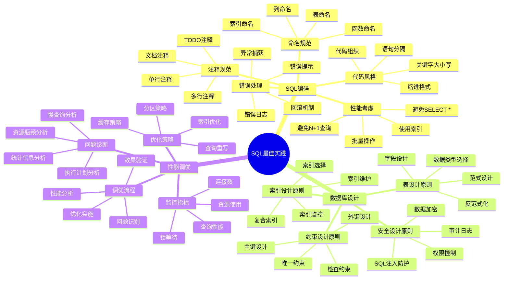
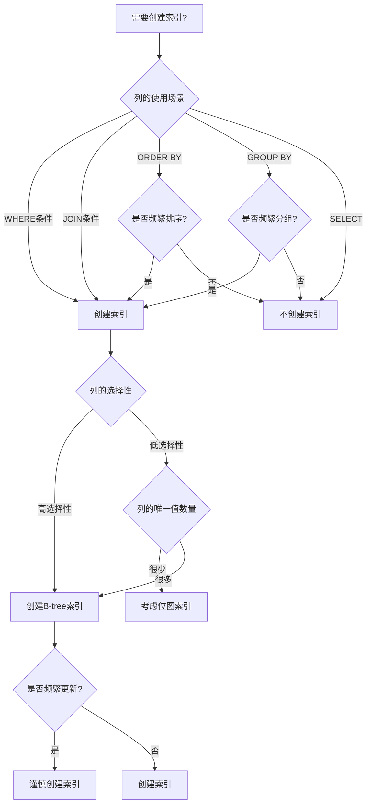
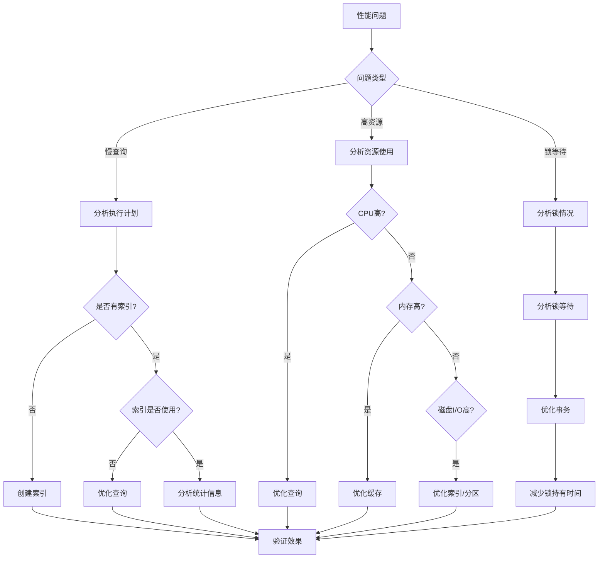

# SQL最佳实践指南

> **创建日期**：2025-01-15
> **最后更新**：2025-01-15
> **版本**：v1.0.0
> **难度**：⭐⭐⭐⭐
> **应用场景**：SQL编码规范、数据库设计、性能调优

---

## 📋 目录

- [SQL最佳实践指南](#sql最佳实践指南)
  - [📋 目录](#-目录)
  - [一、概述](#一概述)
    - [1.1 最佳实践分类思维导图](#11-最佳实践分类思维导图)
    - [1.2 最佳实践对比矩阵](#12-最佳实践对比矩阵)
  - [二、SQL编码最佳实践](#二sql编码最佳实践)
    - [2.1 命名规范](#21-命名规范)
    - [2.2 代码风格](#22-代码风格)
    - [2.3 注释规范](#23-注释规范)
    - [2.4 错误处理](#24-错误处理)
    - [2.5 性能考虑](#25-性能考虑)
  - [三、数据库设计最佳实践](#三数据库设计最佳实践)
    - [3.1 表设计原则](#31-表设计原则)
    - [3.2 索引设计原则](#32-索引设计原则)
    - [3.3 约束设计原则](#33-约束设计原则)
    - [3.4 安全设计原则](#34-安全设计原则)
  - [四、性能调优最佳实践](#四性能调优最佳实践)
    - [4.1 监控指标](#41-监控指标)
    - [4.2 调优流程](#42-调优流程)
    - [4.3 问题诊断](#43-问题诊断)
    - [4.4 优化策略](#44-优化策略)
  - [五、相关资源](#五相关资源)

---

## 一、概述

本文档提供SQL编码、数据库设计和性能调优的最佳实践指南，帮助开发者编写高质量、高性能的SQL代码。

### 1.1 最佳实践分类思维导图



### 1.2 最佳实践对比矩阵

| 实践类别 | 重要性 | 难度 | 影响范围 | 实施优先级 |
|---------|--------|------|---------|-----------|
| **SQL编码规范** | ⭐⭐⭐⭐ | ⭐⭐ | 代码质量 | P0 |
| **数据库设计** | ⭐⭐⭐⭐⭐ | ⭐⭐⭐⭐ | 系统性能 | P0 |
| **性能调优** | ⭐⭐⭐⭐⭐ | ⭐⭐⭐⭐⭐ | 系统性能 | P1 |

---

## 二、SQL编码最佳实践

### 2.1 命名规范

#### 2.1.1 表命名规范

**原则**：

- 使用复数形式或单数形式（保持一致性）
- 使用下划线分隔单词
- 避免使用SQL关键字
- 表名应具有描述性

**示例**：

```sql
-- ✅ 好的命名
CREATE TABLE users (...);
CREATE TABLE order_items (...);
CREATE TABLE product_categories (...);

-- ❌ 不好的命名
CREATE TABLE user (...);  -- 单复数不一致
CREATE TABLE OrderItems (...);  -- 驼峰命名（不统一）
CREATE TABLE tbl_users (...);  -- 不必要的前缀
CREATE TABLE select (...);  -- SQL关键字
```

#### 2.1.2 列命名规范

**原则**：

- 使用小写字母和下划线
- 列名应具有描述性
- 布尔类型使用is_、has_、can_等前缀
- 外键列名应与被引用表的主键列名一致

**示例**：

```sql
-- ✅ 好的命名
CREATE TABLE users (
    user_id INTEGER PRIMARY KEY,
    first_name VARCHAR(50),
    last_name VARCHAR(50),
    email_address VARCHAR(100),
    is_active BOOLEAN,
    created_at TIMESTAMP,
    updated_at TIMESTAMP
);

-- ❌ 不好的命名
CREATE TABLE users (
    id INTEGER PRIMARY KEY,  -- 不够描述性
    name VARCHAR(50),  -- 不够具体
    email VARCHAR(100),  -- 可以，但email_address更好
    active BOOLEAN,  -- 应该用is_active
    date TIMESTAMP  -- 不够描述性
);
```

#### 2.1.3 索引命名规范

**原则**：

- 使用idx_前缀
- 包含表名和列名
- 唯一索引使用uk_前缀
- 外键索引使用fk_前缀

**示例**：

```sql
-- ✅ 好的命名
CREATE INDEX idx_users_email ON users(email);
CREATE UNIQUE INDEX uk_users_email ON users(email);
CREATE INDEX idx_order_items_order_id ON order_items(order_id);
CREATE INDEX fk_orders_user_id ON orders(user_id);

-- ❌ 不好的命名
CREATE INDEX email ON users(email);  -- 缺少前缀
CREATE INDEX idx1 ON users(email);  -- 不够描述性
```

### 2.2 代码风格

#### 2.2.1 缩进格式

**原则**：

- 使用4个空格或2个空格缩进（保持一致性）
- 关键字大写
- 子句换行对齐

**示例**：

```sql
-- ✅ 好的格式
SELECT
    u.user_id,
    u.username,
    u.email,
    COUNT(o.order_id) as order_count
FROM users u
LEFT JOIN orders o ON u.user_id = o.user_id
WHERE u.is_active = TRUE
  AND u.created_at >= '2024-01-01'
GROUP BY u.user_id, u.username, u.email
HAVING COUNT(o.order_id) > 0
ORDER BY order_count DESC
LIMIT 10;

-- ❌ 不好的格式
SELECT u.user_id, u.username, u.email, COUNT(o.order_id) as order_count FROM users u LEFT JOIN orders o ON u.user_id = o.user_id WHERE u.is_active = TRUE AND u.created_at >= '2024-01-01' GROUP BY u.user_id, u.username, u.email HAVING COUNT(o.order_id) > 0 ORDER BY order_count DESC LIMIT 10;
```

#### 2.2.2 关键字大小写

**原则**：

- SQL关键字使用大写（SELECT, FROM, WHERE等）
- 表名和列名使用小写
- 函数名使用大写（COUNT, SUM, AVG等）

**示例**：

```sql
-- ✅ 好的风格
SELECT
    user_id,
    username,
    COUNT(*) as total
FROM users
WHERE is_active = TRUE
GROUP BY user_id, username
ORDER BY total DESC;

-- ❌ 不好的风格
select user_id, username, count(*) as total from users where is_active = true group by user_id, username order by total desc;
```

#### 2.2.3 代码组织

**原则**：

- 复杂查询使用CTE分解
- 相关查询分组
- 使用注释说明复杂逻辑

**示例**：

```sql
-- ✅ 好的组织
WITH active_users AS (
    SELECT user_id, username, email
    FROM users
    WHERE is_active = TRUE
),
user_orders AS (
    SELECT
        u.user_id,
        COUNT(o.order_id) as order_count,
        SUM(o.total_amount) as total_spent
    FROM active_users u
    LEFT JOIN orders o ON u.user_id = o.user_id
    GROUP BY u.user_id
)
SELECT
    u.user_id,
    u.username,
    u.email,
    uo.order_count,
    uo.total_spent
FROM active_users u
JOIN user_orders uo ON u.user_id = uo.user_id
ORDER BY uo.total_spent DESC;
```

### 2.3 注释规范

#### 2.3.1 单行注释

**原则**：

- 使用`--`进行单行注释
- 注释应解释"为什么"而不是"做什么"
- 复杂逻辑必须添加注释

**示例**：

```sql
-- 查询活跃用户在过去30天的订单统计
-- 只统计已完成和已支付的订单
SELECT
    u.user_id,
    u.username,
    COUNT(o.order_id) as order_count,
    SUM(o.total_amount) as total_spent
FROM users u
LEFT JOIN orders o ON u.user_id = o.user_id
WHERE u.is_active = TRUE
  AND o.status IN ('completed', 'paid')  -- 排除取消和待支付的订单
  AND o.order_date >= DATE_SUB(CURRENT_DATE, INTERVAL 30 DAY)
GROUP BY u.user_id, u.username;
```

#### 2.3.2 多行注释

**原则**：

- 使用`/* */`进行多行注释
- 用于函数、存储过程的文档说明
- 包含参数说明、返回值说明、示例

**示例**：

```sql
/*
 * 函数：计算用户的总消费金额
 *
 * 参数：
 *   @user_id: 用户ID
 *   @start_date: 开始日期（可选）
 *   @end_date: 结束日期（可选）
 *
 * 返回：
 *   用户的总消费金额
 *
 * 示例：
 *   SELECT calculate_user_total_spent(1, '2024-01-01', '2024-12-31');
 */
CREATE FUNCTION calculate_user_total_spent(
    user_id INT,
    start_date DATE DEFAULT NULL,
    end_date DATE DEFAULT NULL
) RETURNS DECIMAL(10,2)
BEGIN
    -- 函数实现
END;
```

### 2.4 错误处理

#### 2.4.1 异常捕获

**原则**：

- 使用TRY-CATCH块处理异常
- 记录错误日志
- 提供有意义的错误消息

**示例**：

```sql
-- SQL Server
BEGIN TRY
    BEGIN TRANSACTION;

    UPDATE accounts
    SET balance = balance - 1000
    WHERE account_id = 1;

    UPDATE accounts
    SET balance = balance + 1000
    WHERE account_id = 2;

    COMMIT TRANSACTION;
END TRY
BEGIN CATCH
    IF @@TRANCOUNT > 0
        ROLLBACK TRANSACTION;

    -- 记录错误日志
    INSERT INTO error_log (error_message, error_time)
    VALUES (ERROR_MESSAGE(), CURRENT_TIMESTAMP);

    -- 抛出错误
    THROW;
END CATCH;
```

#### 2.4.2 数据验证

**原则**：

- 在应用层和数据库层都进行验证
- 使用约束确保数据完整性
- 提供清晰的错误消息

**示例**：

```sql
-- 使用约束进行数据验证
CREATE TABLE users (
    user_id INTEGER PRIMARY KEY,
    email VARCHAR(100) NOT NULL,
    age INTEGER CHECK (age >= 0 AND age <= 150),
    CONSTRAINT chk_email_format CHECK (email LIKE '%@%')
);

-- 插入前验证
INSERT INTO users (email, age)
VALUES ('invalid-email', 200);  -- ❌ 违反约束
```

### 2.5 性能考虑

#### 2.5.1 避免SELECT *

**原则**：

- 只选择需要的列
- 减少数据传输量
- 提高查询性能

**示例**：

```sql
-- ❌ 不好的做法
SELECT * FROM users WHERE user_id = 1;

-- ✅ 好的做法
SELECT user_id, username, email FROM users WHERE user_id = 1;
```

#### 2.5.2 使用索引

**原则**：

- 为WHERE、JOIN、ORDER BY子句中的列创建索引
- 避免在索引列上使用函数
- 使用覆盖索引减少回表

**示例**：

```sql
-- ❌ 不好的做法（索引失效）
SELECT * FROM users WHERE UPPER(email) = 'USER@EXAMPLE.COM';

-- ✅ 好的做法
SELECT * FROM users WHERE email = 'user@example.com';

-- 如果需要大小写不敏感，使用函数索引
CREATE INDEX idx_users_email_upper ON users(UPPER(email));
SELECT * FROM users WHERE UPPER(email) = 'USER@EXAMPLE.COM';
```

#### 2.5.3 避免N+1查询

**原则**：

- 使用JOIN代替多次查询
- 使用IN代替循环查询
- 批量查询代替逐条查询

**示例**：

```sql
-- ❌ 不好的做法（N+1查询）
-- 应用层循环
FOR EACH user_id IN user_list:
    SELECT * FROM orders WHERE user_id = user_id;

-- ✅ 好的做法（一次查询）
SELECT * FROM orders WHERE user_id IN (1, 2, 3, 4, 5);
```

#### 2.5.4 批量操作

**原则**：

- 使用批量INSERT代替逐条INSERT
- 使用批量UPDATE代替逐条UPDATE
- 使用事务包装批量操作

**示例**：

```sql
-- ❌ 不好的做法
INSERT INTO users (username, email) VALUES ('user1', 'user1@example.com');
INSERT INTO users (username, email) VALUES ('user2', 'user2@example.com');
INSERT INTO users (username, email) VALUES ('user3', 'user3@example.com');

-- ✅ 好的做法
INSERT INTO users (username, email) VALUES
    ('user1', 'user1@example.com'),
    ('user2', 'user2@example.com'),
    ('user3', 'user3@example.com');
```

---

## 三、数据库设计最佳实践

### 3.1 表设计原则

#### 3.1.1 范式设计

**原则**：

- 至少满足3NF
- 根据业务需求决定是否使用BCNF
- 考虑查询性能，必要时反范式化

**示例**：

```sql
-- ✅ 符合3NF的设计
CREATE TABLE users (
    user_id INTEGER PRIMARY KEY,
    username VARCHAR(50) NOT NULL,
    email VARCHAR(100) NOT NULL UNIQUE
);

CREATE TABLE orders (
    order_id INTEGER PRIMARY KEY,
    user_id INTEGER NOT NULL,
    order_date DATE NOT NULL,
    total_amount DECIMAL(10,2) NOT NULL,
    FOREIGN KEY (user_id) REFERENCES users(user_id)
);

CREATE TABLE order_items (
    order_id INTEGER NOT NULL,
    product_id INTEGER NOT NULL,
    quantity INTEGER NOT NULL,
    price DECIMAL(10,2) NOT NULL,
    PRIMARY KEY (order_id, product_id),
    FOREIGN KEY (order_id) REFERENCES orders(order_id)
);
```

#### 3.1.2 数据类型选择

**原则**：

- 选择合适的数据类型
- 避免过度使用VARCHAR
- 使用DECIMAL处理金额
- 使用TIMESTAMP处理时间

**示例**：

```sql
-- ✅ 好的数据类型选择
CREATE TABLE products (
    product_id INTEGER PRIMARY KEY,
    product_name VARCHAR(100) NOT NULL,
    price DECIMAL(10,2) NOT NULL,  -- 金额使用DECIMAL
    stock_quantity INTEGER NOT NULL,  -- 整数使用INTEGER
    is_active BOOLEAN NOT NULL DEFAULT TRUE,  -- 布尔值使用BOOLEAN
    created_at TIMESTAMP NOT NULL DEFAULT CURRENT_TIMESTAMP,  -- 时间使用TIMESTAMP
    description TEXT  -- 长文本使用TEXT
);

-- ❌ 不好的数据类型选择
CREATE TABLE products (
    product_id VARCHAR(50) PRIMARY KEY,  -- ID应该用INTEGER
    price VARCHAR(20),  -- 金额应该用DECIMAL
    stock_quantity VARCHAR(10),  -- 数量应该用INTEGER
    is_active VARCHAR(5),  -- 布尔值应该用BOOLEAN
    created_at VARCHAR(50)  -- 时间应该用TIMESTAMP
);
```

### 3.2 索引设计原则

#### 3.2.1 索引选择决策树



#### 3.2.2 复合索引设计

**原则**：

- 遵循最左前缀原则
- 将选择性高的列放在前面
- 考虑查询模式

**示例**：

```sql
-- ✅ 好的复合索引设计
-- 查询：WHERE user_id = ? AND order_date >= ? ORDER BY order_date DESC
CREATE INDEX idx_orders_user_date ON orders(user_id, order_date DESC);

-- ❌ 不好的复合索引设计
-- 如果查询只有order_date条件，索引无法使用
CREATE INDEX idx_orders_date_user ON orders(order_date, user_id);
```

### 3.3 约束设计原则

#### 3.3.1 主键设计

**原则**：

- 每个表必须有主键
- 主键应该是稳定的、不可变的
- 优先使用自增整数或UUID

**示例**：

```sql
-- ✅ 好的主键设计
CREATE TABLE users (
    user_id INTEGER PRIMARY KEY AUTO_INCREMENT,  -- 自增主键
    username VARCHAR(50) NOT NULL UNIQUE,
    email VARCHAR(100) NOT NULL UNIQUE
);

-- ❌ 不好的主键设计
CREATE TABLE users (
    username VARCHAR(50) PRIMARY KEY,  -- 用户名可能改变
    email VARCHAR(100) NOT NULL
);
```

#### 3.3.2 外键设计

**原则**：

- 为所有外键关系创建外键约束
- 设置合适的级联操作
- 创建外键索引

**示例**：

```sql
-- ✅ 好的外键设计
CREATE TABLE orders (
    order_id INTEGER PRIMARY KEY,
    user_id INTEGER NOT NULL,
    FOREIGN KEY (user_id) REFERENCES users(user_id)
        ON DELETE RESTRICT  -- 防止删除有订单的用户
        ON UPDATE CASCADE,  -- 用户ID更新时级联更新
    INDEX idx_orders_user_id (user_id)  -- 为外键创建索引
);
```

### 3.4 安全设计原则

#### 3.4.1 SQL注入防护

**原则**：

- 使用参数化查询
- 验证和清理用户输入
- 使用最小权限原则

**示例**：

```sql
-- ❌ 不好的做法（SQL注入风险）
-- 应用层代码
query = "SELECT * FROM users WHERE username = '" + user_input + "'";

-- ✅ 好的做法（参数化查询）
-- 应用层代码
query = "SELECT * FROM users WHERE username = ?";
parameters = [user_input];
```

#### 3.4.2 权限控制

**原则**：

- 使用最小权限原则
- 为不同角色创建不同的用户
- 定期审查权限

**示例**：

```sql
-- 创建只读用户
CREATE USER readonly_user IDENTIFIED BY 'password';
GRANT SELECT ON database_name.* TO readonly_user;

-- 创建应用用户（只有必要的权限）
CREATE USER app_user IDENTIFIED BY 'password';
GRANT SELECT, INSERT, UPDATE ON database_name.orders TO app_user;
GRANT SELECT ON database_name.users TO app_user;
```

---

## 四、性能调优最佳实践

### 4.1 监控指标

#### 4.1.1 查询性能指标

**关键指标**：

- 查询执行时间
- 查询频率
- 慢查询数量
- 索引使用率

**监控查询**：

```sql
-- PostgreSQL: 查询慢查询
SELECT
    query,
    calls,
    total_exec_time,
    mean_exec_time,
    max_exec_time
FROM pg_stat_statements
ORDER BY mean_exec_time DESC
LIMIT 10;

-- MySQL: 查询慢查询日志
SELECT * FROM mysql.slow_log
ORDER BY start_time DESC
LIMIT 10;
```

#### 4.1.2 资源使用指标

**关键指标**：

- CPU使用率
- 内存使用率
- 磁盘I/O
- 连接数

**监控查询**：

```sql
-- PostgreSQL: 查询连接数
SELECT
    count(*) as total_connections,
    count(*) FILTER (WHERE state = 'active') as active_connections,
    count(*) FILTER (WHERE state = 'idle') as idle_connections
FROM pg_stat_activity;

-- MySQL: 查询连接数
SHOW STATUS LIKE 'Threads_connected';
SHOW STATUS LIKE 'Threads_running';
```

### 4.2 调优流程

#### 4.2.1 性能调优决策树



#### 4.2.2 调优步骤

**步骤**：

1. 识别性能问题
2. 收集性能数据
3. 分析问题原因
4. 制定优化方案
5. 实施优化
6. 验证效果
7. 监控持续改进

**示例**：

```sql
-- 步骤1: 识别慢查询
SELECT query, mean_exec_time
FROM pg_stat_statements
WHERE mean_exec_time > 1000  -- 执行时间超过1秒
ORDER BY mean_exec_time DESC;

-- 步骤2: 分析执行计划
EXPLAIN ANALYZE
SELECT * FROM orders o
JOIN users u ON o.user_id = u.user_id
WHERE o.order_date >= '2024-01-01';

-- 步骤3: 创建索引
CREATE INDEX idx_orders_user_date ON orders(user_id, order_date);

-- 步骤4: 验证效果
EXPLAIN ANALYZE
SELECT * FROM orders o
JOIN users u ON o.user_id = u.user_id
WHERE o.order_date >= '2024-01-01';
```

### 4.3 问题诊断

#### 4.3.1 慢查询分析

**分析方法**：

- 使用EXPLAIN分析执行计划
- 检查索引使用情况
- 分析表扫描情况
- 检查连接顺序

**示例**：

```sql
-- 分析慢查询
EXPLAIN (ANALYZE, BUFFERS, VERBOSE)
SELECT
    u.user_id,
    u.username,
    COUNT(o.order_id) as order_count
FROM users u
LEFT JOIN orders o ON u.user_id = o.user_id
WHERE u.created_at >= '2024-01-01'
GROUP BY u.user_id, u.username
HAVING COUNT(o.order_id) > 10;

-- 如果看到Seq Scan，考虑创建索引
CREATE INDEX idx_users_created_at ON users(created_at);
CREATE INDEX idx_orders_user_id ON orders(user_id);
```

#### 4.3.2 统计信息分析

**原则**：

- 定期更新统计信息
- 检查统计信息准确性
- 分析数据分布

**示例**：

```sql
-- PostgreSQL: 更新统计信息
ANALYZE users;
ANALYZE orders;

-- 查看统计信息
SELECT
    schemaname,
    tablename,
    n_live_tup,
    n_dead_tup,
    last_vacuum,
    last_autovacuum,
    last_analyze,
    last_autoanalyze
FROM pg_stat_user_tables
WHERE tablename IN ('users', 'orders');
```

### 4.4 优化策略

#### 4.4.1 索引优化策略

**策略**：

- 为频繁查询的列创建索引
- 使用覆盖索引减少回表
- 定期维护索引
- 删除未使用的索引

**示例**：

```sql
-- 创建覆盖索引
CREATE INDEX idx_orders_covering ON orders(user_id, order_date, total_amount);

-- 查询可以使用覆盖索引，无需回表
SELECT user_id, order_date, total_amount
FROM orders
WHERE user_id = 1
ORDER BY order_date DESC;
```

#### 4.4.2 查询重写策略

**策略**：

- 将子查询转换为JOIN
- 使用窗口函数代替相关子查询
- 合并多个查询
- 使用CTE提高可读性

**示例**：

```sql
-- ❌ 原始查询（相关子查询）
SELECT
    u.user_id,
    u.username,
    (SELECT COUNT(*) FROM orders WHERE user_id = u.user_id) as order_count
FROM users u;

-- ✅ 优化后（LEFT JOIN）
SELECT
    u.user_id,
    u.username,
    COUNT(o.order_id) as order_count
FROM users u
LEFT JOIN orders o ON u.user_id = o.user_id
GROUP BY u.user_id, u.username;
```

---

## 五、相关资源

### 相关文档

- [复杂查询案例](./07.01-复杂查询案例.md) - 复杂查询设计
- [数据分析案例](./07.02-数据分析案例.md) - 数据分析实践
- [业务场景完整指南](./07.04-业务场景完整指南.md) - 业务场景实践

---

**维护者**: SQL Standards Team
**最后更新**: 2025-01-15
