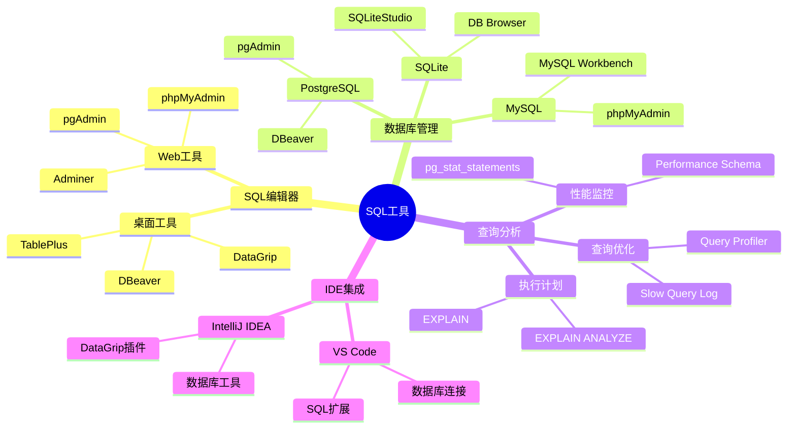
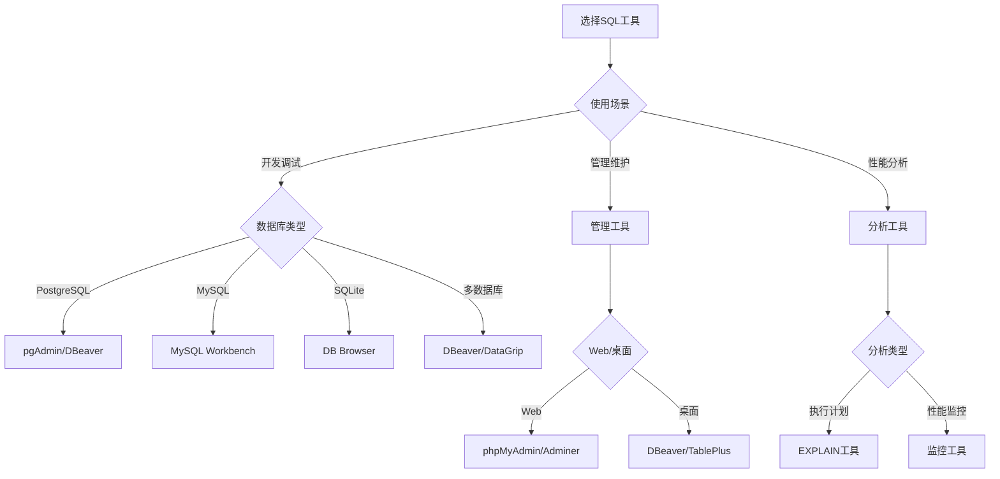

# SQL工具指南

> **创建日期**：2025-01-15
> **最后更新**：2025-01-16
> **版本**：v1.0.0
> **难度**：⭐⭐
> **应用场景**：SQL工具选择、开发效率提升

---

## 📋 目录

- [SQL工具指南](#sql工具指南)
  - [📋 目录](#-目录)
  - [一、概述](#一概述)
    - [1.1 SQL工具分类思维导图](#11-sql工具分类思维导图)
    - [1.2 SQL工具选择决策树](#12-sql工具选择决策树)
    - [1.3 SQL工具对比矩阵](#13-sql工具对比矩阵)
  - [二、SQL编辑器](#二sql编辑器)
    - [2.1 DBeaver - 跨平台数据库工具](#21-dbeaver---跨平台数据库工具)
    - [2.1.1 使用场景示例：学生管理系统查询](#211-使用场景示例学生管理系统查询)
    - [2.2 DataGrip - JetBrains数据库IDE](#22-datagrip---jetbrains数据库ide)
    - [2.2.1 使用场景示例：复杂查询开发](#221-使用场景示例复杂查询开发)
    - [2.3 pgAdmin - PostgreSQL管理工具](#23-pgadmin---postgresql管理工具)
    - [2.3.1 使用场景示例：数据库管理](#231-使用场景示例数据库管理)
  - [三、数据库管理工具](#三数据库管理工具)
    - [3.1 phpMyAdmin - Web-based MySQL管理](#31-phpmyadmin---web-based-mysql管理)
    - [3.1.1 使用场景示例：Web环境数据库管理](#311-使用场景示例web环境数据库管理)
    - [3.2 TablePlus - 现代数据库管理工具](#32-tableplus---现代数据库管理工具)
    - [3.2.1 使用场景示例：快速数据浏览和编辑](#321-使用场景示例快速数据浏览和编辑)
  - [四、查询分析工具](#四查询分析工具)
    - [4.1 EXPLAIN - 查询计划分析](#41-explain---查询计划分析)
    - [4.1.1 PostgreSQL EXPLAIN示例](#411-postgresql-explain示例)
    - [4.1.2 执行计划解读](#412-执行计划解读)
    - [4.1.3 优化建议](#413-优化建议)
    - [4.2 pg\_stat\_statements - PostgreSQL查询统计](#42-pg_stat_statements---postgresql查询统计)
    - [4.2.1 pg\_stat\_statements简介](#421-pg_stat_statements简介)
    - [4.2.2 使用场景示例：查询性能分析](#422-使用场景示例查询性能分析)
    - [4.3 Performance Schema - MySQL性能分析](#43-performance-schema---mysql性能分析)
    - [4.3.1 Performance Schema简介](#431-performance-schema简介)
    - [4.3.2 使用场景示例：查询性能监控](#432-使用场景示例查询性能监控)
  - [五、IDE集成工具](#五ide集成工具)
    - [5.1 VS Code SQL扩展](#51-vs-code-sql扩展)
    - [5.1.1 VS Code SQL扩展推荐](#511-vs-code-sql扩展推荐)
    - [5.1.2 使用场景示例：在VS Code中开发SQL](#512-使用场景示例在vs-code中开发sql)
  - [六、工具选择建议](#六工具选择建议)
    - [6.1 工具选择决策矩阵](#61-工具选择决策矩阵)
    - [6.2 工具组合建议](#62-工具组合建议)
  - [五、相关资源](#五相关资源)
    - [相关文档](#相关文档)

---

## 一、概述

本文档介绍常用的SQL工具，帮助提高SQL开发效率。

### 1.1 SQL工具分类思维导图



### 1.2 SQL工具选择决策树



### 1.3 SQL工具对比矩阵

| 工具 | 类型 | 数据库支持 | 功能 | 价格 | 推荐度 |
|------|------|-----------|------|------|--------|
| **DBeaver** | 通用 | 多数据库 | ⭐⭐⭐⭐⭐ | 免费/付费 | ⭐⭐⭐⭐⭐ |
| **DataGrip** | IDE | 多数据库 | ⭐⭐⭐⭐⭐ | 付费 | ⭐⭐⭐⭐⭐ |
| **pgAdmin** | 专用 | PostgreSQL | ⭐⭐⭐⭐ | 免费 | ⭐⭐⭐⭐ |
| **MySQL Workbench** | 专用 | MySQL | ⭐⭐⭐⭐ | 免费 | ⭐⭐⭐⭐ |
| **TablePlus** | 通用 | 多数据库 | ⭐⭐⭐⭐ | 付费 | ⭐⭐⭐⭐ |

---

## 二、SQL编辑器

### 2.1 DBeaver - 跨平台数据库工具

**DBeaver简介**：

DBeaver是免费开源的通用数据库工具，支持多种数据库系统。

**主要特性**：

- ✅ 支持50+种数据库（PostgreSQL、MySQL、SQLite、Oracle、SQL Server等）
- ✅ 跨平台（Windows、macOS、Linux）
- ✅ 强大的SQL编辑器（语法高亮、自动完成、代码格式化）
- ✅ 数据浏览和编辑
- ✅ 执行计划可视化
- ✅ ER图生成
- ✅ 数据导入导出

**安装步骤**：

```bash
# Windows: 下载安装包
# https://dbeaver.io/download/

# macOS: 使用Homebrew
brew install --cask dbeaver-community

# Linux: 使用包管理器
sudo apt-get install dbeaver-ce
```

### 2.1.1 使用场景示例：学生管理系统查询

**场景**：使用DBeaver连接PostgreSQL数据库，查询学生选课信息。

**步骤**：

1. **创建数据库连接**：
   - 打开DBeaver
   - 新建数据库连接 → 选择PostgreSQL
   - 配置连接信息：
     - Host: localhost
     - Port: 5432
     - Database: student_db
     - Username: postgres
     - Password: ***

2. **执行SQL查询**：

    ```sql
    -- 查询每门课程的平均分
    SELECT
        c.course_name,
        COUNT(e.student_id) as student_count,
        AVG(e.score) as avg_score,
        MAX(e.score) as max_score,
        MIN(e.score) as min_score
    FROM Course c
    LEFT JOIN Enrollment e ON c.course_id = e.course_id
    GROUP BY c.course_id, c.course_name
    ORDER BY avg_score DESC;
    ```

3. **查看执行计划**：
   - 在SQL编辑器中右键 → "Explain Plan"
   - 查看查询优化建议

4. **导出查询结果**：
   - 右键查询结果 → "Export Data"
   - 选择导出格式（CSV、Excel、JSON等）

**配置优化建议**：

```properties
# DBeaver配置优化
# 文件位置: ~/.dbeaver/General/.dbeaver/data-sources.json

{
  "connections": [{
    "configuration": {
      "queryTimeout": 30,
      "maxResultSetSize": 10000,
      "autoCommit": false,
      "readOnly": false
    }
  }]
}
```

### 2.2 DataGrip - JetBrains数据库IDE

**DataGrip简介**：

DataGrip是JetBrains推出的专业数据库IDE，提供强大的SQL开发功能。

**主要特性**：

- ✅ 智能SQL编辑器（代码补全、重构、导航）
- ✅ 多数据库支持
- ✅ 强大的查询分析工具
- ✅ 版本控制集成（Git）
- ✅ 数据库重构工具
- ✅ 数据可视化

**安装步骤**：

```bash
# 下载安装包
# https://www.jetbrains.com/datagrip/download/

# 或使用JetBrains Toolbox
# https://www.jetbrains.com/toolbox-app/
```

### 2.2.1 使用场景示例：复杂查询开发

**场景**：使用DataGrip开发复杂的多表连接查询。

**步骤**：

1. **创建数据源**：
   - File → New → Data Source → PostgreSQL
   - 配置连接信息

2. **使用智能代码补全**：

    ```sql
    -- DataGrip会自动提示表名、列名、函数名
    SELECT
        s.student_id,
        s.name,
        -- 输入"s."会自动提示Student表的列
        -- 输入"AVG("会自动提示聚合函数
        AVG(e.score) as avg_score
    FROM Student s
    JOIN Enrollment e ON s.student_id = e.student_id
    GROUP BY s.student_id, s.name
    HAVING AVG(e.score) > 80;
    ```

3. **使用查询分析**：
   - 右键SQL → "Explain Plan"
   - 查看详细的执行计划树
   - 分析查询性能瓶颈

4. **使用重构功能**：
   - 重命名表/列：Shift+F6
   - 提取子查询：Ctrl+Alt+M
   - 内联变量：Ctrl+Alt+N

**快捷键参考**：

| 功能 | Windows/Linux | macOS |
|------|--------------|-------|
| 执行查询 | Ctrl+Enter | Cmd+Enter |
| 格式化SQL | Ctrl+Alt+L | Cmd+Option+L |
| 查找用法 | Alt+F7 | Option+F7 |
| 快速文档 | Ctrl+Q | F1 |
| 代码补全 | Ctrl+Space | Ctrl+Space |

### 2.3 pgAdmin - PostgreSQL管理工具

**pgAdmin简介**：

pgAdmin是PostgreSQL的官方管理工具，提供完整的数据库管理功能。

**主要特性**：

- ✅ PostgreSQL专用工具
- ✅ 图形化数据库管理
- ✅ 查询工具
- ✅ 备份恢复工具
- ✅ 性能监控

**安装步骤**：

```bash
# Windows: 下载安装包
# https://www.pgadmin.org/download/

# macOS: 使用Homebrew
brew install --cask pgadmin4

# Linux: 使用包管理器
sudo apt-get install pgadmin4
```

### 2.3.1 使用场景示例：数据库管理

**场景**：使用pgAdmin管理PostgreSQL数据库，创建表、索引，执行查询。

**步骤**：

1. **创建表**：
   - 右键数据库 → Create → Table
   - 使用图形界面创建表结构
   - 或使用SQL编辑器：

    ```sql
    CREATE TABLE Student (
        student_id SERIAL PRIMARY KEY,
        name VARCHAR(100) NOT NULL,
        age INTEGER CHECK (age > 0),
        major VARCHAR(50),
        email VARCHAR(100) UNIQUE,
        created_at TIMESTAMP DEFAULT CURRENT_TIMESTAMP
    );

    -- 创建索引
    CREATE INDEX idx_student_major ON Student(major);
    CREATE INDEX idx_student_email ON Student(email);
    ```

2. **执行查询**：
   - Tools → Query Tool
   - 输入SQL查询
   - 执行并查看结果

3. **查看执行计划**：
   - Query Tool → Explain → Explain Analyze
   - 查看详细的执行计划

---

## 三、数据库管理工具

### 3.1 phpMyAdmin - Web-based MySQL管理

**phpMyAdmin简介**：

phpMyAdmin是基于Web的MySQL管理工具，适合远程管理MySQL数据库。

**主要特性**：

- ✅ Web界面，无需安装客户端
- ✅ 完整的数据库管理功能
- ✅ SQL查询执行
- ✅ 数据导入导出
- ✅ 用户权限管理

**安装步骤**：

```bash
# 使用Docker快速部署
docker run --name phpmyadmin \
  -e PMA_HOST=mysql_host \
  -e PMA_PORT=3306 \
  -p 8080:80 \
  -d phpmyadmin/phpmyadmin

# 或使用XAMPP/WAMP等集成环境
```

### 3.1.1 使用场景示例：Web环境数据库管理

**场景**：在Web服务器上管理MySQL数据库。

**配置示例**：

```php
// config.inc.php
$cfg['Servers'][1]['host'] = 'localhost';
$cfg['Servers'][1]['port'] = '3306';
$cfg['Servers'][1]['user'] = 'root';
$cfg['Servers'][1]['password'] = '';
$cfg['Servers'][1]['auth_type'] = 'cookie';
```

### 3.2 TablePlus - 现代数据库管理工具

**TablePlus简介**：

TablePlus是现代化的数据库管理工具，界面美观，功能强大。

**主要特性**：

- ✅ 支持多种数据库
- ✅ 美观的用户界面
- ✅ 快速查询执行
- ✅ 数据编辑
- ✅ 多标签页支持

### 3.2.1 使用场景示例：快速数据浏览和编辑

**场景**：快速浏览和编辑数据库中的数据。

**功能特点**：

- 双击单元格直接编辑
- 支持多行编辑
- 实时保存更改
- 支持事务回滚

---

## 四、查询分析工具

### 4.1 EXPLAIN - 查询计划分析

**EXPLAIN简介**：

EXPLAIN是SQL标准提供的查询计划分析工具，帮助理解查询执行过程。

### 4.1.1 PostgreSQL EXPLAIN示例

```sql
-- 基本EXPLAIN
EXPLAIN SELECT * FROM Student WHERE age > 20;

-- EXPLAIN ANALYZE（实际执行查询）
EXPLAIN ANALYZE
SELECT
    s.name,
    c.course_name,
    e.score
FROM Student s
JOIN Enrollment e ON s.student_id = e.student_id
JOIN Course c ON e.course_id = c.course_id
WHERE s.major = 'Computer Science'
ORDER BY e.score DESC;
```

### 4.1.2 执行计划解读

```sql
-- 执行计划输出示例
QUERY PLAN
─────────────────────────────────────────────────────────────
Sort  (cost=1234.56..1235.67 rows=100 width=64)
  Sort Key: e.score DESC
  ->  Hash Join  (cost=567.89..890.12 rows=100 width=64)
        Hash Cond: (e.student_id = s.student_id)
        ->  Seq Scan on enrollment e  (cost=0.00..234.56 rows=1000)
        ->  Hash  (cost=345.67..345.67 rows=50 width=32)
              ->  Seq Scan on student s  (cost=0.00..345.67 rows=50)
                    Filter: (major = 'Computer Science'::text)
```

### 4.1.3 优化建议

- 如果看到"Seq Scan"（顺序扫描），考虑添加索引
- 如果看到"Hash Join"，确保连接列有索引
- 关注"cost"值，较高的cost可能需要优化

### 4.2 pg_stat_statements - PostgreSQL查询统计

### 4.2.1 pg_stat_statements简介

pg_stat_statements是PostgreSQL的查询统计扩展，记录所有SQL查询的执行统计信息。

**安装和配置**：

```sql
-- 1. 安装扩展
CREATE EXTENSION IF NOT EXISTS pg_stat_statements;

-- 2. 配置postgresql.conf
-- shared_preload_libraries = 'pg_stat_statements'
-- pg_stat_statements.track = all
-- pg_stat_statements.max = 10000

-- 3. 重启PostgreSQL服务
```

### 4.2.2 使用场景示例：查询性能分析

**场景**：分析数据库中执行最频繁、最耗时的查询。

**查询示例**：

```sql
-- 查看执行时间最长的查询
SELECT
    query,
    calls,
    total_exec_time,
    mean_exec_time,
    max_exec_time,
    stddev_exec_time
FROM pg_stat_statements
ORDER BY total_exec_time DESC
LIMIT 10;

-- 查看执行次数最多的查询
SELECT
    query,
    calls,
    total_exec_time,
    mean_exec_time
FROM pg_stat_statements
ORDER BY calls DESC
LIMIT 10;

-- 查看特定表的查询统计
SELECT
    query,
    calls,
    total_exec_time
FROM pg_stat_statements
WHERE query LIKE '%Student%'
ORDER BY total_exec_time DESC;
```

### 4.3 Performance Schema - MySQL性能分析

### 4.3.1 Performance Schema简介

Performance Schema是MySQL的性能监控系统，提供详细的性能数据。

**启用Performance Schema**：

```sql
-- 检查是否启用
SHOW VARIABLES LIKE 'performance_schema';

-- 如果未启用，在my.cnf中配置
-- [mysqld]
-- performance_schema=ON
```

### 4.3.2 使用场景示例：查询性能监控

**场景**：监控MySQL数据库中的慢查询和性能瓶颈。

**查询示例**：

```sql
-- 查看执行时间最长的查询
SELECT
    sql_text,
    count_star,
    sum_timer_wait/1000000000000 as total_time_sec,
    avg_timer_wait/1000000000000 as avg_time_sec,
    max_timer_wait/1000000000000 as max_time_sec
FROM performance_schema.events_statements_summary_by_digest
ORDER BY sum_timer_wait DESC
LIMIT 10;

-- 查看表访问统计
SELECT
    object_schema,
    object_name,
    count_star,
    sum_timer_wait/1000000000000 as total_time_sec
FROM performance_schema.table_io_waits_summary_by_table
ORDER BY sum_timer_wait DESC
LIMIT 10;
```

---

## 五、IDE集成工具

### 5.1 VS Code SQL扩展

### 5.1.1 VS Code SQL扩展推荐

1. **SQLTools** - 通用数据库工具
2. **SQLTools PostgreSQL/Cockroach Driver** - PostgreSQL驱动
3. **SQLTools MySQL/MariaDB** - MySQL驱动

**安装步骤**：

```bash
# 在VS Code中安装扩展
# 1. 打开扩展面板 (Ctrl+Shift+X)
# 2. 搜索 "SQLTools"
# 3. 安装 SQLTools 和对应的数据库驱动
```

### 5.1.2 使用场景示例：在VS Code中开发SQL

**场景**：在VS Code中编写和执行SQL查询。

**配置示例**：

```json
// settings.json
{
  "sqltools.connections": [
    {
      "name": "PostgreSQL Local",
      "driver": "PostgreSQL",
      "server": "localhost",
      "port": 5432,
      "database": "student_db",
      "username": "postgres",
      "password": "***"
    }
  ]
}
```

**功能特点**：

- SQL语法高亮
- 代码补全
- 查询执行
- 结果查看
- 连接管理

---

## 六、工具选择建议

### 6.1 工具选择决策矩阵

| 使用场景 | 推荐工具 | 理由 |
|---------|---------|------|
| **多数据库开发** | DBeaver / DataGrip | 支持多种数据库，功能全面 |
| **PostgreSQL专用** | pgAdmin | 官方工具，功能完整 |
| **MySQL专用** | MySQL Workbench | 官方工具，功能完整 |
| **Web环境管理** | phpMyAdmin / Adminer | 基于Web，无需安装客户端 |
| **快速数据浏览** | TablePlus | 界面美观，操作便捷 |
| **IDE集成开发** | VS Code SQLTools / DataGrip | 与开发环境集成 |
| **性能分析** | EXPLAIN + pg_stat_statements / Performance Schema | 专业的性能分析工具 |

### 6.2 工具组合建议

**开发环境组合**：

- **主要工具**：DataGrip（专业SQL开发）
- **辅助工具**：DBeaver（多数据库支持）
- **性能分析**：EXPLAIN + 数据库特定工具

**生产环境组合**：

- **管理工具**：pgAdmin / MySQL Workbench（数据库管理）
- **监控工具**：pg_stat_statements / Performance Schema（性能监控）
- **备份工具**：数据库自带备份工具

---

## 五、相关资源

### 相关文档

- [SQL学习资源](./08.02-SQL学习资源.md) - 学习资源

---

**维护者**: SQL Standards Team
**最后更新**: 2025-01-16
