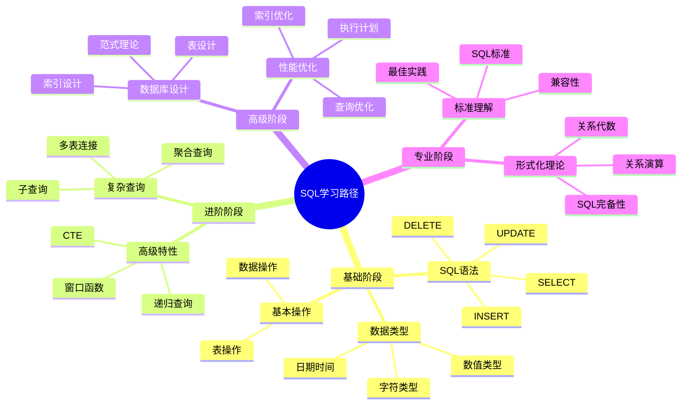

# SQL学习资源

> **创建日期**：2025-01-15
> **最后更新**：2025-01-15
> **版本**：v1.0.0
> **难度**：⭐⭐
> **应用场景**：SQL学习、知识扩展

---

## 📋 目录

- [SQL学习资源](#sql学习资源)
  - [📋 目录](#-目录)
  - [一、概述](#一概述)
    - [1.1 SQL学习路径思维导图](#11-sql学习路径思维导图)
    - [1.2 SQL学习资源对比矩阵](#12-sql学习资源对比矩阵)
  - [二、官方文档](#二官方文档)
    - [2.1 SQL标准官方文档](#21-sql标准官方文档)
    - [2.2 数据库官方文档](#22-数据库官方文档)
  - [三、教程资源](#三教程资源)
    - [3.1 在线教程网站](#31-在线教程网站)
    - [3.2 交互式学习平台](#32-交互式学习平台)
  - [四、参考书籍](#四参考书籍)
    - [4.1 理论基础书籍](#41-理论基础书籍)
    - [4.2 实践应用书籍](#42-实践应用书籍)
    - [4.3 高级特性书籍](#43-高级特性书籍)
  - [五、在线课程](#五在线课程)
    - [5.1 综合平台课程](#51-综合平台课程)
    - [5.2 专业培训课程](#52-专业培训课程)
  - [六、实践练习平台](#六实践练习平台)
    - [6.1 编程练习平台](#61-编程练习平台)
    - [6.2 数据集练习](#62-数据集练习)
  - [七、学习路径建议](#七学习路径建议)
    - [7.1 初学者路径](#71-初学者路径)
    - [7.1.1 阶段1：基础语法（2-4周）](#711-阶段1基础语法2-4周)
    - [7.1.2 阶段2：进阶查询（2-4周）](#712-阶段2进阶查询2-4周)
    - [7.1.3 阶段3：高级特性（3-6周）](#713-阶段3高级特性3-6周)
    - [7.2 进阶学习路径](#72-进阶学习路径)
    - [7.3 专业学习路径](#73-专业学习路径)
  - [六、相关资源](#六相关资源)
    - [相关文档](#相关文档)

---

## 一、概述

本文档提供SQL学习的推荐资源。

### 1.1 SQL学习路径思维导图

### 1.2 SQL学习资源对比矩阵

| 资源类型 | 资源名称 | 难度 | 深度 | 适用阶段 | 推荐度 |
|---------|---------|------|------|---------|--------|
| **官方文档** | ISO/IEC 9075 | ⭐⭐⭐⭐⭐ | ⭐⭐⭐⭐⭐ | 专业 | ⭐⭐⭐⭐ |
| **教程** | W3Schools | ⭐⭐ | ⭐⭐ | 基础 | ⭐⭐⭐⭐ |
| **书籍** | "Learning SQL" | ⭐⭐⭐ | ⭐⭐⭐ | 进阶 | ⭐⭐⭐⭐⭐ |
| **在线课程** | Coursera | ⭐⭐⭐ | ⭐⭐⭐ | 进阶 | ⭐⭐⭐⭐ |
| **实践平台** | LeetCode | ⭐⭐⭐⭐ | ⭐⭐⭐ | 进阶 | ⭐⭐⭐⭐⭐ |

---

## 二、官方文档

### 2.1 SQL标准官方文档

**ISO/IEC 9075:2023 (SQL:2023)**：

- **官方链接**：<https://www.iso.org/standard/76583.html>
- **内容**：完整的SQL:2023标准规范
- **适用对象**：数据库开发者、标准制定者、研究人员
- **难度**：⭐⭐⭐⭐⭐
- **特点**：
  - 最权威的SQL标准文档
  - 包含完整的语法和语义定义
  - 适合深入理解SQL标准

**使用建议**：

- 作为参考文档，查询特定语法规范
- 理解SQL标准的演进历史
- 进行数据库兼容性分析

### 2.2 数据库官方文档

**PostgreSQL官方文档**：

- **链接**：<https://www.postgresql.org/docs/>
- **内容**：PostgreSQL完整文档，包括SQL语法、函数、特性
- **特点**：
  - 文档质量高，示例丰富
  - 包含SQL标准对齐说明
  - 提供最佳实践建议

**MySQL官方文档**：

- **链接**：<https://dev.mysql.com/doc/>
- **内容**：MySQL完整文档，包括SQL语法、存储引擎、优化
- **特点**：
  - 详细的SQL语法说明
  - 性能优化指南
  - 版本特性对比

**SQLite官方文档**：

- **链接**：<https://www.sqlite.org/docs.html>
- **内容**：SQLite完整文档，包括SQL语法、API、扩展
- **特点**：
  - 轻量级数据库文档
  - SQL标准兼容性说明
  - 嵌入式应用指南

**SQL Server官方文档**：

- **链接**：<https://docs.microsoft.com/sql/>
- **内容**：SQL Server完整文档，包括T-SQL、管理、优化
- **特点**：
  - 企业级数据库文档
  - T-SQL扩展说明
  - 性能调优指南

---

## 三、教程资源

### 3.1 在线教程网站

**W3Schools SQL教程**：

- **链接**：<https://www.w3schools.com/sql/>
- **难度**：⭐⭐
- **特点**：
  - 适合初学者
  - 交互式示例
  - 覆盖基础SQL语法
- **学习路径**：
  1. SQL基础语法（SELECT、INSERT、UPDATE、DELETE）
  2. WHERE子句和条件查询
  3. JOIN操作
  4. 聚合函数和GROUP BY
  5. 子查询

**SQL Tutorial (sql-tutorial.com)**：

- **链接**：<https://www.sql-tutorial.com/>
- **难度**：⭐⭐⭐
- **特点**：
  - 系统化的SQL教程
  - 包含实际案例
  - 覆盖高级特性

**Mode Analytics SQL教程**：

- **链接**：<https://mode.com/sql-tutorial/>
- **难度**：⭐⭐⭐
- **特点**：
  - 面向数据分析
  - 实际数据集练习
  - 窗口函数等高级特性

**学习建议**：

1. **初学者**：从W3Schools开始，掌握基础语法
2. **进阶学习**：使用Mode Analytics学习数据分析相关SQL
3. **实践练习**：结合实际项目或数据集进行练习

### 3.2 交互式学习平台

**SQLBolt**：

- **链接**：<https://sqlbolt.com/>
- **特点**：
  - 交互式SQL教程
  - 逐步引导学习
  - 即时反馈

**LeetCode Database**：

- **链接**：<https://leetcode.com/problemset/database/>
- **特点**：
  - SQL编程题练习
  - 难度分级
  - 社区讨论和解答

**HackerRank SQL**：

- **链接**：<https://www.hackerrank.com/domains/sql>
- **特点**：
  - SQL技能测试
  - 实际场景题目
  - 认证考试

---

## 四、参考书籍

### 4.1 理论基础书籍

**"An Introduction to Database Systems" - C.J. Date**：

- **作者**：C.J. Date
- **难度**：⭐⭐⭐⭐⭐
- **内容**：
  - 数据库系统理论基础
  - 关系模型理论
  - SQL理论基础
- **适用对象**：数据库研究人员、高级开发者
- **评价**：数据库领域的经典教材，理论深度高

**"Database System Concepts" - Silberschatz, Korth, Sudarshan**：

- **难度**：⭐⭐⭐⭐
- **内容**：
  - 数据库系统概念
  - SQL语法和语义
  - 数据库设计
- **适用对象**：计算机科学学生、数据库开发者

### 4.2 实践应用书籍

**"Learning SQL" - Alan Beaulieu**：

- **作者**：Alan Beaulieu
- **难度**：⭐⭐⭐
- **内容**：
  - SQL基础语法
  - 实际应用案例
  - 最佳实践
- **适用对象**：SQL初学者、数据分析师
- **评价**：实践性强，适合快速上手

**"SQL Performance Explained" - Markus Winand**：

- **作者**：Markus Winand
- **难度**：⭐⭐⭐⭐
- **内容**：
  - SQL性能优化
  - 索引使用
  - 查询优化技巧
- **适用对象**：数据库开发者、DBA
- **评价**：专注于性能优化，实用性强

**"SQL Antipatterns" - Bill Karwin**：

- **作者**：Bill Karwin
- **难度**：⭐⭐⭐
- **内容**：
  - SQL常见错误
  - 反模式识别
  - 最佳实践
- **适用对象**：所有SQL开发者
- **评价**：帮助避免常见错误，提高代码质量

### 4.3 高级特性书籍

**"SQL Cookbook" - Anthony Molinaro**：

- **难度**：⭐⭐⭐⭐
- **内容**：
  - SQL高级技巧
  - 复杂查询解决方案
  - 实际案例
- **适用对象**：有经验的SQL开发者

---

## 五、在线课程

### 5.1 综合平台课程

**Coursera - "SQL for Data Science"**：

- **平台**：Coursera
- **提供者**：University of California, Davis
- **难度**：⭐⭐⭐
- **内容**：
  - SQL基础语法
  - 数据分析应用
  - 实际项目练习
- **时长**：4-6周
- **证书**：提供认证证书

**Coursera - "Databases: Relational Databases and SQL"**：

- **平台**：Coursera
- **提供者**：Stanford University
- **难度**：⭐⭐⭐⭐
- **内容**：
  - 关系数据库理论
  - SQL语法和语义
  - 数据库设计
- **时长**：8-10周

**Udemy - "The Complete SQL Bootcamp"**：

- **平台**：Udemy
- **难度**：⭐⭐⭐
- **内容**：
  - 完整的SQL教程
  - 从基础到高级
  - 实际项目练习
- **特点**：价格实惠，内容全面

**edX - "Introduction to Databases"**：

- **平台**：edX
- **提供者**：Stanford University
- **难度**：⭐⭐⭐⭐
- **内容**：
  - 数据库系统概念
  - SQL语法
  - 数据库设计

### 5.2 专业培训课程

**DataCamp SQL课程**：

- **平台**：DataCamp
- **特点**：
  - 交互式学习
  - 数据分析导向
  - 实际数据集练习
- **课程系列**：
  - Introduction to SQL
  - Intermediate SQL
  - Advanced SQL

**Pluralsight SQL课程**：

- **平台**：Pluralsight
- **特点**：
  - 专业级课程
  - 涵盖多个数据库系统
  - 实际项目练习

---

## 六、实践练习平台

### 6.1 编程练习平台

**LeetCode Database**：

- **链接**：<https://leetcode.com/problemset/database/>
- **题目数量**：100+道SQL题目
- **难度分级**：Easy、Medium、Hard
- **特点**：
  - 实际面试题目
  - 多种数据库支持
  - 社区讨论和解答

**练习建议**：

1. 从Easy题目开始，掌握基础语法
2. 逐步挑战Medium和Hard题目
3. 学习其他用户的优秀解答
4. 总结常见解题模式

**HackerRank SQL**：

- **链接**：<https://www.hackerrank.com/domains/sql>
- **特点**：
  - 技能测试和认证
  - 实际业务场景
  - 多种难度级别

**SQLZoo**：

- **链接**：<https://sqlzoo.net/>
- **特点**：
  - 交互式SQL教程
  - 逐步引导
  - 即时反馈

### 6.2 数据集练习

**Kaggle SQL课程**：

- **平台**：Kaggle
- **特点**：
  - 真实数据集
  - 数据分析导向
  - 社区竞赛

**Mode Analytics SQL Tutorial**：

- **特点**：
  - 实际业务数据集
  - 数据分析场景
  - 窗口函数等高级特性

---

## 七、学习路径建议

### 7.1 初学者路径

### 7.1.1 阶段1：基础语法（2-4周）

1. 学习资源：W3Schools SQL教程
2. 学习内容：
   - SELECT、INSERT、UPDATE、DELETE
   - WHERE子句和条件查询
   - 数据类型和函数
3. 实践练习：SQLBolt交互式教程

### 7.1.2 阶段2：进阶查询（2-4周）

1. 学习资源：Mode Analytics SQL教程
2. 学习内容：
   - JOIN操作（INNER、LEFT、RIGHT、FULL）
   - 聚合函数和GROUP BY
   - 子查询
3. 实践练习：LeetCode Easy题目

### 7.1.3 阶段3：高级特性（3-6周）

1. 学习资源：官方文档 + 书籍
2. 学习内容：
   - 窗口函数
   - CTE和递归查询
   - JSON支持
3. 实践练习：LeetCode Medium/Hard题目

### 7.2 进阶学习路径

### 7.2.1 阶段1：性能优化（4-8周）

1. 学习资源："SQL Performance Explained"
2. 学习内容：
   - 索引优化
   - 查询优化
   - 执行计划分析
3. 实践练习：实际项目性能调优

### 7.2.2 阶段2：数据库设计（4-8周）

1. 学习资源："An Introduction to Database Systems"
2. 学习内容：
   - 范式理论
   - 数据库设计
   - 关系模型
3. 实践练习：设计实际数据库系统

### 7.2.3 阶段3：标准理解（持续学习）

1. 学习资源：SQL标准官方文档
2. 学习内容：
   - SQL标准演进
   - 标准兼容性
   - 最佳实践
3. 实践练习：数据库兼容性分析

### 7.3 专业学习路径

### 7.3.1 阶段1：理论基础（6-12个月）

- 关系模型理论
- 关系代数
- SQL完备性理论
- 形式化语义

### 7.3.2 阶段2：标准深入（持续学习）

- SQL标准详细研究
- 数据库实现对比
- 兼容性分析
- 最佳实践总结

### 7.3.3 阶段3：应用实践（持续学习）

- 实际项目应用
- 性能优化实践
- 数据库设计实践
- 技术分享和总结

---

## 六、相关资源

### 相关文档

- [SQL工具指南](./08.01-SQL工具指南.md) - SQL工具

---

**维护者**: SQL Standards Team
**最后更新**: 2025-01-15
