# 决策树与学习路径整合

> **创建日期**：2025-01-15
> **最后更新**：2025-01-15
> **版本**：v1.0.0
> **状态**：✅ 已完成

---

## 📋 目录

- [决策树与学习路径整合](#决策树与学习路径整合)
  - [📋 目录](#-目录)
  - [一、概述](#一概述)
  - [二、技术选型决策树](#二技术选型决策树)
    - [2.1 数据库选型决策树](#21-数据库选型决策树)
    - [2.2 存储引擎选型决策树](#22-存储引擎选型决策树)
    - [2.3 索引类型选型决策树](#23-索引类型选型决策树)
    - [2.4 分区策略选型决策树](#24-分区策略选型决策树)
  - [三、优化策略决策树](#三优化策略决策树)
    - [3.1 查询优化决策树](#31-查询优化决策树)
    - [3.2 索引优化决策树](#32-索引优化决策树)
    - [3.3 数据库设计优化决策树](#33-数据库设计优化决策树)
  - [四、问题解决决策树](#四问题解决决策树)
    - [4.1 性能问题诊断决策树](#41-性能问题诊断决策树)
    - [4.2 数据一致性问题诊断决策树](#42-数据一致性问题诊断决策树)
    - [4.3 并发问题诊断决策树](#43-并发问题诊断决策树)
  - [五、学习路径](#五学习路径)
    - [5.1 SQL初学者学习路径](#51-sql初学者学习路径)
    - [5.2 SQL进阶学习路径](#52-sql进阶学习路径)
    - [5.3 SQL专家学习路径](#53-sql专家学习路径)
    - [5.4 数据库系统学习路径](#54-数据库系统学习路径)
  - [六、应用路径](#六应用路径)
    - [6.1 数据库设计应用路径](#61-数据库设计应用路径)
    - [6.2 查询优化应用路径](#62-查询优化应用路径)
    - [6.3 性能调优应用路径](#63-性能调优应用路径)
  - [七、优化路径](#七优化路径)
    - [7.1 查询性能优化路径](#71-查询性能优化路径)
    - [7.2 数据库设计优化路径](#72-数据库设计优化路径)
    - [7.3 系统架构优化路径](#73-系统架构优化路径)
  - [八、相关资源](#八相关资源)
    - [相关文档](#相关文档)

---

## 一、概述

本文档整合了SQL知识库中所有的决策树和学习路径，提供系统化的技术选型、优化策略、问题解决和学习指导。

**文档来源**：

- 决策树主要来自：`03-形式化模型`、`07-实践案例`、`07.05-SQL最佳实践指南.md`
- 学习路径主要来自：`08.02-SQL学习资源.md`

---

## 二、技术选型决策树

### 2.1 数据库选型决策树

**来源**：`06.05-数据库SQL标准对比矩阵.md`

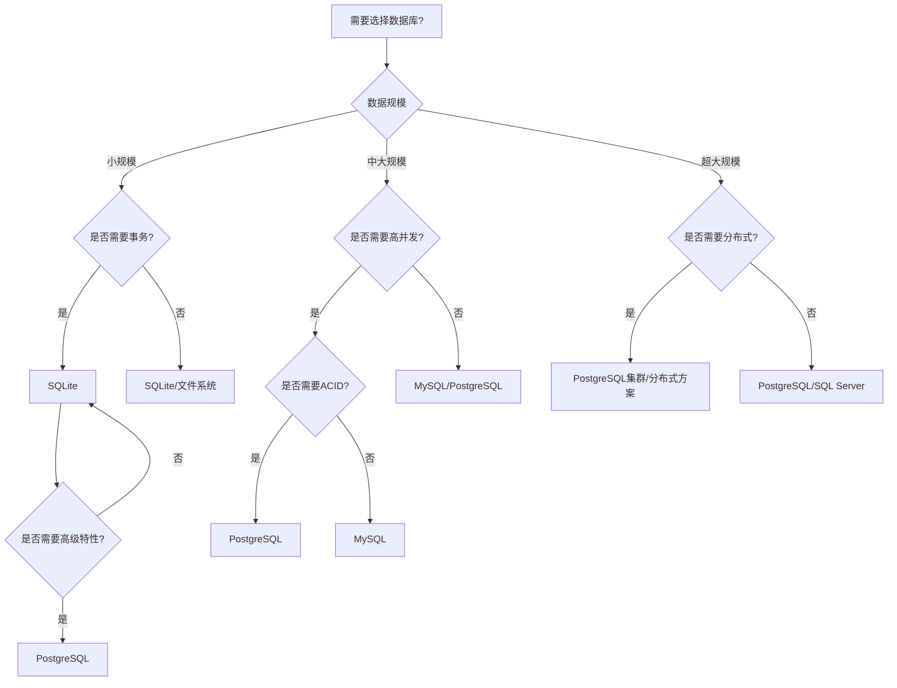

**决策矩阵**：

| 数据库 | 适用场景 | 优势 | 劣势 |
|--------|---------|------|------|
| **SQLite** | 小型应用、嵌入式 | 轻量、零配置 | 并发性能有限 |
| **MySQL** | Web应用、高并发 | 性能好、生态丰富 | 高级特性较少 |
| **PostgreSQL** | 企业应用、复杂查询 | 功能强大、标准兼容 | 配置复杂 |
| **SQL Server** | Windows环境、企业应用 | 集成度高、工具丰富 | 跨平台支持有限 |

### 2.2 存储引擎选型决策树

**来源**：`06-数据库实现对比`

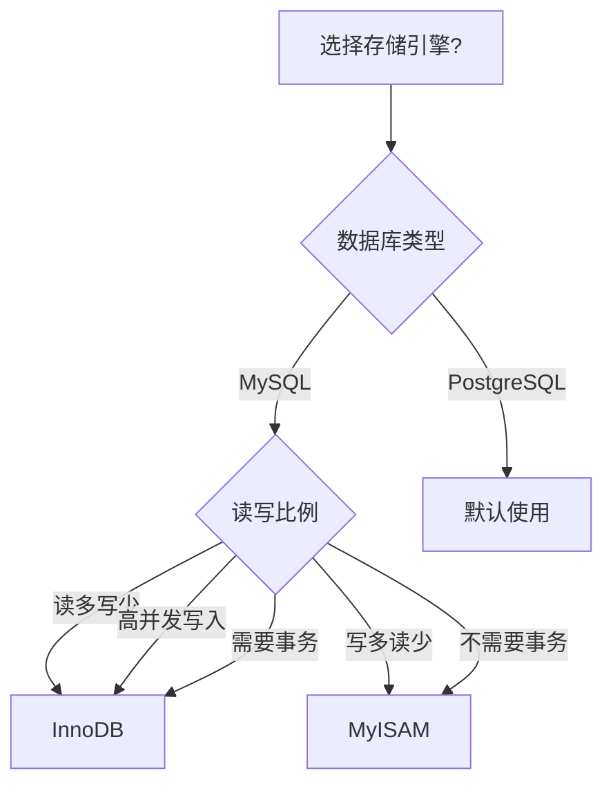

### 2.3 索引类型选型决策树

**来源**：`07.05-SQL最佳实践指南.md`

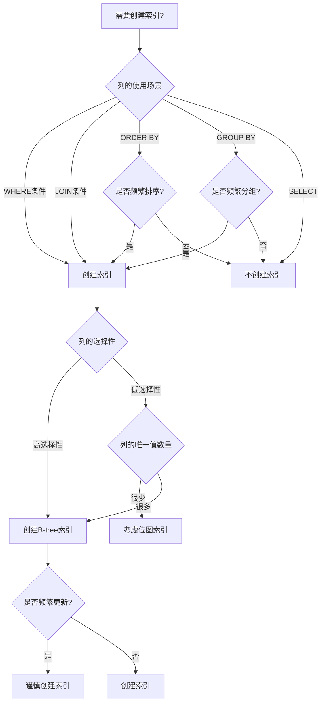

### 2.4 分区策略选型决策树

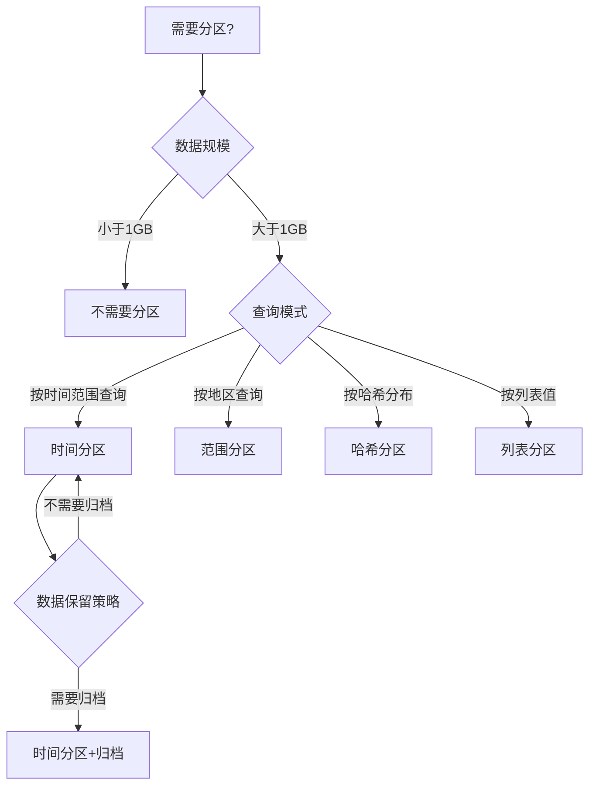

---

## 三、优化策略决策树

### 3.1 查询优化决策树

**来源**：`03.02-查询等价性理论.md`、`07.01-复杂查询案例.md`

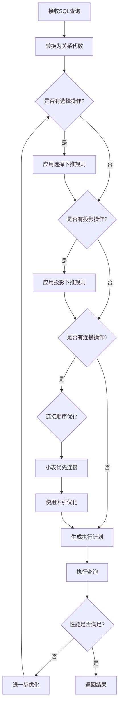

### 3.2 索引优化决策树

**来源**：`07.05-SQL最佳实践指南.md`

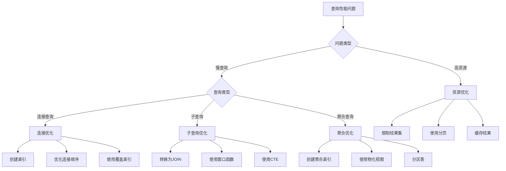

### 3.3 数据库设计优化决策树

**来源**：`01.01-关系模型理论.md`

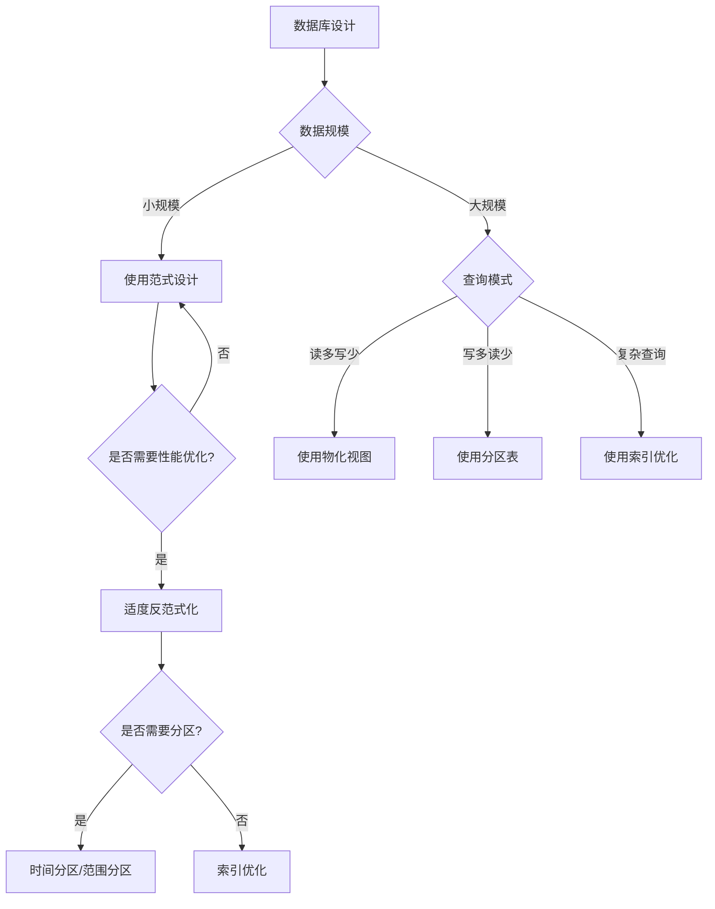

---

## 四、问题解决决策树

### 4.1 性能问题诊断决策树

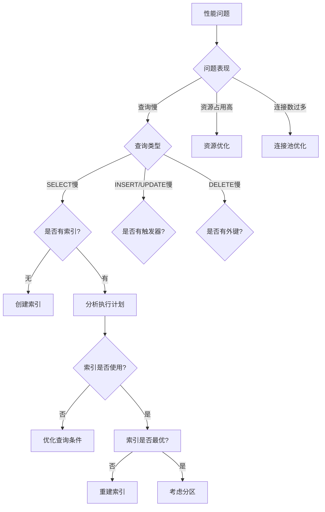

### 4.2 数据一致性问题诊断决策树

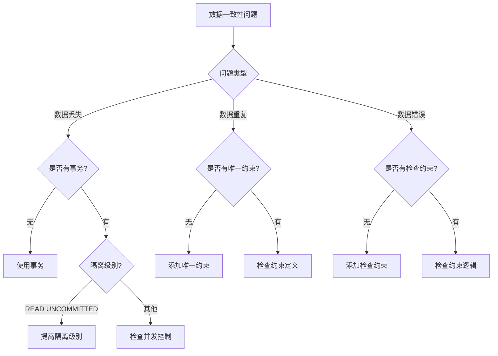

### 4.3 并发问题诊断决策树

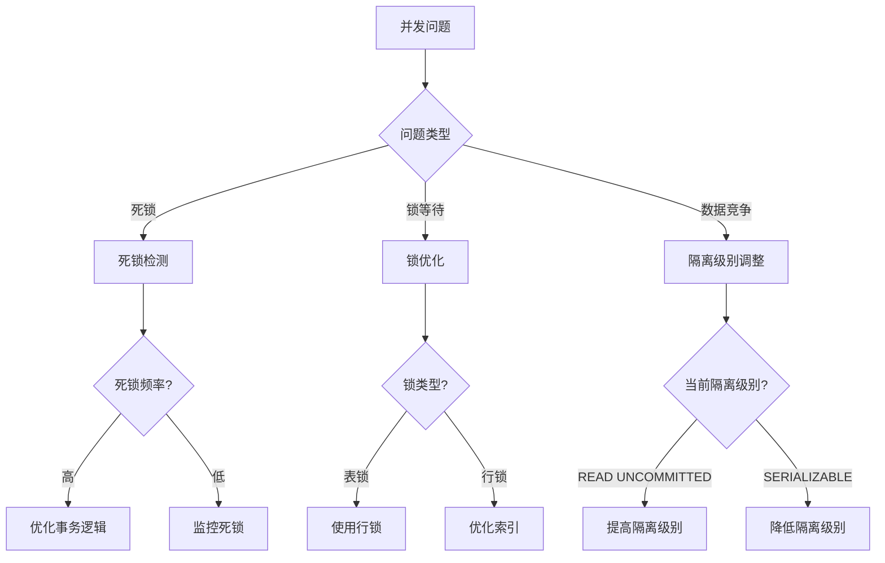

---

## 五、学习路径

### 5.1 SQL初学者学习路径

**来源**：`08.02-SQL学习资源.md`

#### 阶段1：基础语法（2-4周）

1. **SQL基础概念**
   - 关系数据库概念
   - SQL语言概述
   - 数据类型

2. **基本操作**
   - SELECT查询
   - INSERT插入
   - UPDATE更新
   - DELETE删除

3. **表操作**
   - CREATE TABLE
   - ALTER TABLE
   - DROP TABLE

#### 阶段2：进阶查询（2-4周）

1. **多表操作**
   - JOIN连接
   - 子查询
   - UNION操作

2. **聚合查询**
   - GROUP BY
   - HAVING
   - 聚合函数

3. **数据过滤**
   - WHERE条件
   - 通配符
   - 正则表达式

#### 阶段3：高级特性（3-6周）

1. **窗口函数**
   - ROW_NUMBER
   - RANK
   - 聚合窗口函数

2. **CTE和递归查询**
   - WITH子句
   - 递归CTE

3. **JSON支持**
   - JSON数据类型
   - JSON函数

### 5.2 SQL进阶学习路径

#### 阶段1：数据库设计（2-3周）

1. **范式理论**
   - 1NF、2NF、3NF
   - BCNF
   - 范式选择

2. **索引设计**
   - 索引类型
   - 索引优化
   - 复合索引

3. **约束设计**
   - 主键、外键
   - 唯一约束
   - 检查约束

#### 阶段2：性能优化（2-3周）

1. **查询优化**
   - 执行计划分析
   - 查询重写
   - 索引优化

2. **数据库优化**
   - 分区策略
   - 物化视图
   - 缓存策略

#### 阶段3：高级特性（1-2周）

1. **事务处理**
   - ACID特性
   - 隔离级别
   - 并发控制

2. **存储过程**
   - 函数定义
   - 触发器
   - 游标

### 5.3 SQL专家学习路径

#### 阶段1：理论基础（3-4周）

1. **关系模型理论**
   - 关系代数
   - 关系演算
   - SQL完备性

2. **形式化语义**
   - SQL语义定义
   - 查询等价性
   - 正确性验证

#### 阶段2：标准理解（2-3周）

1. **SQL标准演进**
   - SQL-92到SQL:2023
   - 标准特性对比
   - 兼容性分析

2. **数据库实现对比**
   - PostgreSQL
   - MySQL
   - SQLite
   - SQL Server

#### 阶段3：实践应用（1-2周）

1. **复杂场景**
   - 大数据处理
   - 高并发场景
   - 分布式系统

2. **最佳实践**
   - 编码规范
   - 性能调优
   - 安全设计

### 5.4 数据库系统学习路径

#### 阶段1：系统架构（2-3周）

1. **存储管理**
   - 存储引擎
   - 索引结构
   - 数据组织

2. **查询处理**
   - 查询解析
   - 查询优化
   - 执行引擎

#### 阶段2：并发控制（2-3周）

1. **事务管理**
   - 事务调度
   - 锁机制
   - 死锁处理

2. **恢复系统**
   - 日志管理
   - 故障恢复
   - 备份策略

#### 阶段3：高级主题（1-2周）

1. **分布式数据库**
   - 数据分片
   - 复制策略
   - 一致性协议

2. **新兴技术**
   - 列存储
   - 内存数据库
   - 图数据库

---

## 六、应用路径

### 6.1 数据库设计应用路径

**详细步骤**：

1. **需求分析**
   - 业务需求收集
   - 数据需求分析
   - 性能需求确定

2. **概念设计**
   - ER图设计
   - 实体关系定义
   - 业务规则梳理

3. **逻辑设计**
   - 表结构设计
   - 范式选择
   - 关系定义

4. **物理设计**
   - 索引设计
   - 分区策略
   - 存储优化

5. **实施部署**
   - DDL脚本编写
   - 数据迁移
   - 环境配置

6. **测试验证**
   - 功能测试
   - 性能测试
   - 压力测试

7. **优化调整**
   - 性能调优
   - 索引优化
   - 查询优化

### 6.2 查询优化应用路径

**详细步骤**：

1. **识别慢查询**
   - 慢查询日志分析
   - 性能监控
   - 用户反馈

2. **分析执行计划**
   - EXPLAIN分析
   - 执行计划解读
   - 瓶颈识别

3. **定位瓶颈**
   - 索引缺失
   - 查询重写
   - 资源限制

4. **制定优化策略**
   - 索引优化
   - 查询重写
   - 架构调整

5. **实施优化**
   - 创建索引
   - 修改查询
   - 调整配置

6. **验证效果**
   - 性能测试
   - 对比分析
   - 监控观察

### 6.3 性能调优应用路径

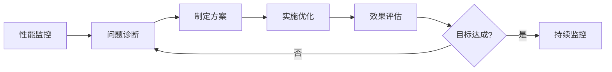

**详细步骤**：

1. **性能监控**
   - 指标收集
   - 趋势分析
   - 告警设置

2. **问题诊断**
   - 瓶颈分析
   - 根因定位
   - 影响评估

3. **制定方案**
   - 优化策略
   - 实施计划
   - 风险评估

4. **实施优化**
   - 配置调整
   - 代码优化
   - 架构优化

5. **效果评估**
   - 性能对比
   - 成本分析
   - 稳定性验证

---

## 七、优化路径

### 7.1 查询性能优化路径

**优化层次**：

1. **SQL层优化**
   - 查询重写
   - 避免N+1查询
   - 使用合适的JOIN

2. **索引层优化**
   - 创建必要索引
   - 优化索引结构
   - 使用覆盖索引

3. **架构层优化**
   - 读写分离
   - 分库分表
   - 缓存策略

### 7.2 数据库设计优化路径

**优化维度**：

1. **范式优化**
   - 范式选择
   - 适度反范式化
   - 冗余控制

2. **索引优化**
   - 索引设计
   - 索引维护
   - 索引监控

3. **分区优化**
   - 分区策略
   - 分区维护
   - 分区查询优化

### 7.3 系统架构优化路径

**优化方向**：

1. **存储优化**
   - 存储引擎选择
   - 存储参数调优
   - 存储空间管理

2. **并发优化**
   - 连接池配置
   - 锁机制优化
   - 事务管理优化

3. **高可用优化**
   - 主从复制
   - 集群部署
   - 故障转移

---

## 八、相关资源

### 相关文档

- [SQL最佳实践指南](../07-实践案例/07.05-SQL最佳实践指南.md)
- [SQL学习资源](../08-工具与资源/08.02-SQL学习资源.md)
- [查询等价性理论](../03-形式化模型/03.02-查询等价性理论.md)
- [复杂查询案例](../07-实践案例/07.01-复杂查询案例.md)
- [数据库SQL标准对比矩阵](../06-数据库实现对比/06.05-数据库SQL标准对比矩阵.md)

---

**维护者**: SQL Standards Team
**最后更新**: 2025-01-15
