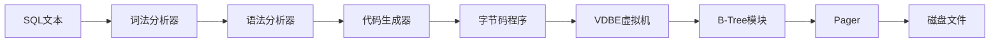

# 编译执行模型：SQL → 字节码 → 磁盘操作

> **创建日期**：2025-11-13
> **最后更新**：2025-11-13
> **版本**：SQLite 3.31+ 至 3.47+

---

## 📋 概述

SQLite3采用独特的前端-后端分离架构，将SQL处理流程分解为清晰的编译与执行阶段。本文档深入解析编译执行模型的各个组件。

---

## 📑 目录

- [编译执行模型：SQL → 字节码 → 磁盘操作](#编译执行模型sql--字节码--磁盘操作)
  - [📋 概述](#-概述)
  - [📑 目录](#-目录)
  - [一、架构总览](#一架构总览)
    - [1.1 流水线式处理流程](#11-流水线式处理流程)
    - [1.2 前端与后端分离](#12-前端与后端分离)
  - [二、前端编译系统（SQL → 字节码）](#二前端编译系统sql--字节码)
    - [2.1 词法分析器（Tokenizer）](#21-词法分析器tokenizer)
    - [2.2 语法分析器（Parser）](#22-语法分析器parser)
    - [2.3 代码生成器（Code Generator）](#23-代码生成器code-generator)
  - [三、后端执行引擎（字节码 → 磁盘操作）](#三后端执行引擎字节码--磁盘操作)
    - [3.1 虚拟数据库引擎（VDBE）](#31-虚拟数据库引擎vdbe)
    - [3.2 B-Tree模块](#32-b-tree模块)
    - [3.3 Pager（页面调度程序）](#33-pager页面调度程序)
    - [3.4 OS接口层（VFS）](#34-os接口层vfs)
  - [四、完整执行流程示例](#四完整执行流程示例)
    - [4.1 示例SQL语句](#41-示例sql语句)
    - [4.2 编译阶段](#42-编译阶段)
    - [4.3 执行阶段](#43-执行阶段)
  - [五、性能优化点](#五性能优化点)
    - [5.1 编译阶段优化](#51-编译阶段优化)
    - [5.2 执行阶段优化](#52-执行阶段优化)
  - [🔗 相关资源](#-相关资源)
  - [📚 参考资料](#-参考资料)

---

## 一、架构总览

### 1.1 流水线式处理流程



### 1.2 前端与后端分离

**前端（编译阶段）**：

- 输入：SQL文本字符串
- 输出：字节码程序（`sqlite3_stmt`对象）
- 职责：语法分析、语义检查、优化

**后端（执行阶段）**：

- 输入：字节码程序
- 输出：磁盘操作结果
- 职责：解释执行、数据访问、事务管理

---

## 二、前端编译系统（SQL → 字节码）

### 2.1 词法分析器（Tokenizer）

**实现位置**：`tokenize.c`（手工编写，非工具生成）

**核心功能**：

- 将SQL字符串分割为token流
- 识别关键字、标识符、字面量
- 处理Unicode字符
- 处理转义字符和注释

**技术特性**：

- **状态机驱动**：使用有限状态自动机识别token
- **Unicode支持**：完整支持UTF-8编码
- **注释处理**：支持`--`单行注释和`/* */`多行注释

**示例**：

```sql
-- SQL语句
SELECT * FROM users WHERE id = 123;

-- Token流
[SELECT] [*] [FROM] [users] [WHERE] [id] [=] [123] [;]
```

**源码位置**：

- `tokenize.c`：词法分析器实现
- `keywordhash.h`：关键字哈希表

### 2.2 语法分析器（Parser）

**实现技术**：使用Lemon LALR(1)分析器生成器

**核心功能**：

- 将token流构建为抽象语法树（AST）
- 执行语法检查
- 执行基础语义检查

**关键优势**：

- **天生可重入**：支持多线程环境
- **线程安全**：无全局状态
- **内存泄漏防护**：内置内存管理机制

**Lemon vs YACC**：

- Lemon：SQLite专用，更安全
- YACC：通用工具，但存在安全问题

**AST结构示例**：

```c
// 简化的AST节点结构
struct ASTNode {
    int type;           // 节点类型（SELECT, FROM, WHERE等）
    char* value;        // 节点值
    ASTNode* left;      // 左子树
    ASTNode* right;     // 右子树
};
```

**源码位置**：

- `parse.y`：语法规则定义
- `lempar.c`：Lemon解析器核心

### 2.3 代码生成器（Code Generator）

**工作机制**：

- 遍历AST
- 生成SQLite专用的128条操作码（opcodes）
- 执行基本优化

**优化策略**：

- **常量折叠**：`1 + 2` → `3`
- **谓词下推**：将WHERE条件尽可能下推到数据源
- **索引选择**：选择最优索引

**输出产物**：

- `sqlite3_stmt`对象：字节码程序的容器
- 包含操作码序列和元数据

**操作码示例**：

```c
// 128条操作码中的部分示例
OP_OpenRead      // 打开表或索引进行读取
OP_Column        // 读取列值
OP_ResultRow     // 输出一行结果
OP_Halt          // 停止执行
```

**源码位置**：

- `build.c`：代码生成器实现
- `vdbe.c`：操作码定义

---

## 三、后端执行引擎（字节码 → 磁盘操作）

### 3.1 虚拟数据库引擎（VDBE）

**设计哲学**：类似JVM的栈式虚拟机，实现跨平台抽象

**执行模型**：

- 从指令0开始顺序执行
- 直到Halt指令或异常中断
- 支持条件跳转和循环

**核心操作码**：

- `OpenRead`：打开表或索引进行读取
- `Column`：读取列值
- `ResultRow`：输出一行结果
- `Halt`：停止执行

**寄存器架构**：

- 每个指令含1个操作码 + 5个操作数
- 操作虚拟寄存器和游标
- 支持临时表操作

**执行流程示例**：

```c
// 简化的VDBE执行流程
while (pc < nOp) {
    op = aOp[pc];
    switch (op.opcode) {
        case OP_OpenRead:
            // 打开表
            break;
        case OP_Column:
            // 读取列
            break;
        case OP_ResultRow:
            // 输出结果
            break;
    }
    pc++;
}
```

**源码位置**：

- `vdbe.c`：VDBE核心实现
- `vdbe.h`：操作码定义

### 3.2 B-Tree模块

**数据结构**：采用变体B-Tree（支持B+Tree特性）

**关键角色**：

- 维护表和索引的树形结构
- 管理页面间复杂关系
- 保证O(log n)查询复杂度
- 实现唯一性约束和外键约束

**游标机制**：

- 通过`BtCursor`定位记录
- 记录位置 = 页面ID + 页内偏移
- 支持顺序扫描和随机访问

**B-Tree操作**：

```c
// B-Tree操作示例
sqlite3BtreeOpen();      // 打开B-Tree
sqlite3BtreeInsert();    // 插入记录
sqlite3BtreeDelete();    // 删除记录
sqlite3BtreeMoveto();    // 定位记录
```

**源码位置**：

- `btree.c`：B-Tree核心实现
- `btree.h`：B-Tree接口定义

### 3.3 Pager（页面调度程序）

**核心职责**：

- 在B-Tree和磁盘间传递页面
- 管理页缓存
- 实现ACID的核心层

**事务功能**：

- 回滚：通过回滚日志恢复
- 原子提交：通过WAL或回滚日志保证
- 故障恢复：重启时检查日志

**锁机制**：

- 提供数据库文件级别的读写锁
- 支持五种锁状态：
  - UNLOCKED → SHARED → RESERVED → PENDING → EXCLUSIVE

**页缓存管理**：

```c
// 页缓存操作
sqlite3PagerGet();       // 获取页面（可能从缓存或磁盘）
sqlite3PagerWrite();     // 标记页面为脏页
sqlite3PagerSync();      // 同步脏页到磁盘
```

**源码位置**：

- `pager.c`：Pager核心实现
- `pager.h`：Pager接口定义

### 3.4 OS接口层（VFS）

**抽象设计**：虚拟文件系统屏蔽操作系统差异

**可移植性**：

- 每个平台实现自定义VFS
- 提供统一文件操作、同步、锁机制
- 支持自定义VFS实现

**核心API**：

```c
// VFS接口示例
xOpen()      // 打开文件
xRead()       // 读取数据
xWrite()      // 写入数据
xSync()       // 同步到磁盘
xLock()       // 文件锁
xUnlock()     // 解锁
```

**平台实现**：

- `os_unix.c`：Unix/Linux实现
- `os_win.c`：Windows实现
- `os_os2.c`：OS/2实现

**源码位置**：

- `os.h`：VFS接口定义
- `os_*.c`：各平台实现

---

## 四、完整执行流程示例

### 4.1 示例SQL语句

```sql
SELECT name, age FROM users WHERE id = 123;
```

### 4.2 编译阶段

1. **词法分析**：

   ```text
   [SELECT] [name] [,] [age] [FROM] [users] [WHERE] [id] [=] [123] [;]
   ```

2. **语法分析**：

   ```text
   SELECT
     ├─ columns: [name, age]
     ├─ FROM: users
     └─ WHERE: id = 123
   ```

3. **代码生成**：

   ```c
   OP_OpenRead      // 打开users表
   OP_Rewind        // 定位到表开始
   OP_Column        // 读取id列
   OP_Ne            // 比较 id != 123
   OP_Next          // 跳转到下一行
   OP_Column        // 读取name列
   OP_Column        // 读取age列
   OP_ResultRow     // 输出结果
   OP_Halt          // 停止
   ```

### 4.3 执行阶段

1. **VDBE解释执行**：逐条执行操作码
2. **B-Tree访问**：通过索引或全表扫描定位记录
3. **Pager管理**：从磁盘读取页面到缓存
4. **结果返回**：将结果返回给应用程序

---

## 五、性能优化点

### 5.1 编译阶段优化

- **预编译缓存**：`sqlite3_prepare_v2()`缓存编译结果
- **常量折叠**：编译时计算常量表达式
- **索引选择**：选择最优索引

### 5.2 执行阶段优化

- **页缓存**：减少磁盘I/O
- **索引使用**：避免全表扫描
- **批量操作**：减少事务开销

---

## 🔗 相关资源

- [SQLite官方文档 - 架构](https://www.sqlite.org/arch.html)
- [VDBE操作码列表](https://www.sqlite.org/opcode.html)
- [B-Tree实现](https://www.sqlite.org/btree.html)

---

## 📚 参考资料

- [SQLite源码](https://www.sqlite.org/src)
- [数据库系统实现](https://www.sqlite.org/arch.html)
- [编译原理](https://www.sqlite.org/arch.html)

---

**最后更新**：2025-11-13
**维护者**：Data-Science Team
