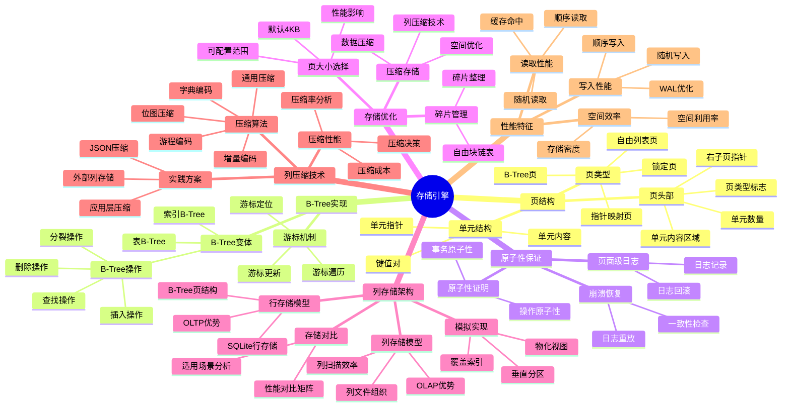
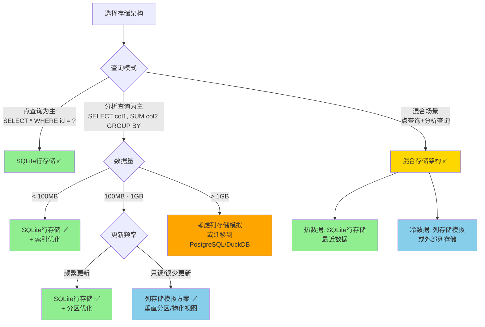
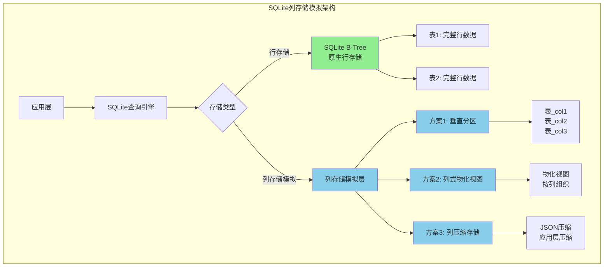
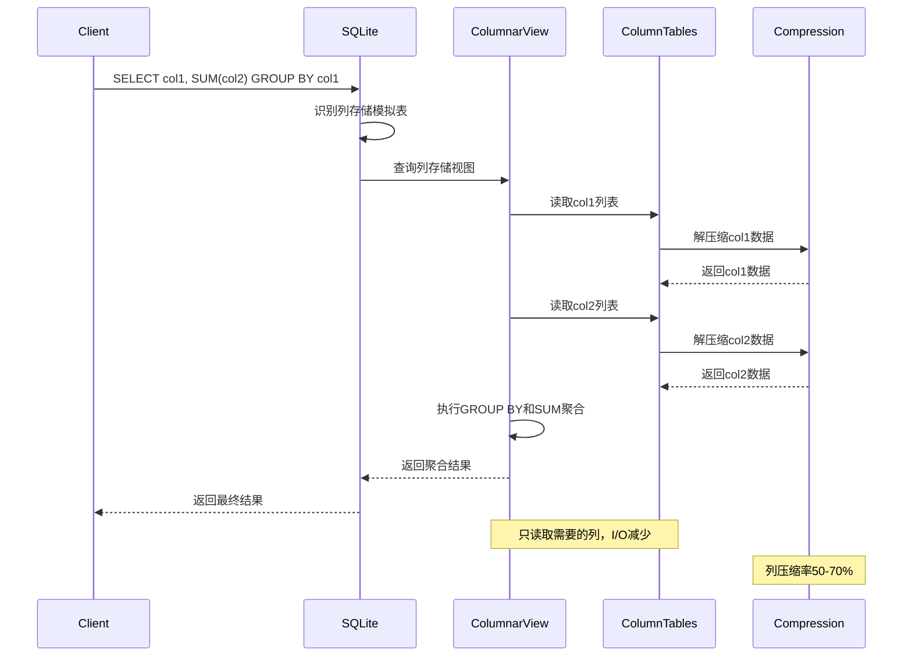
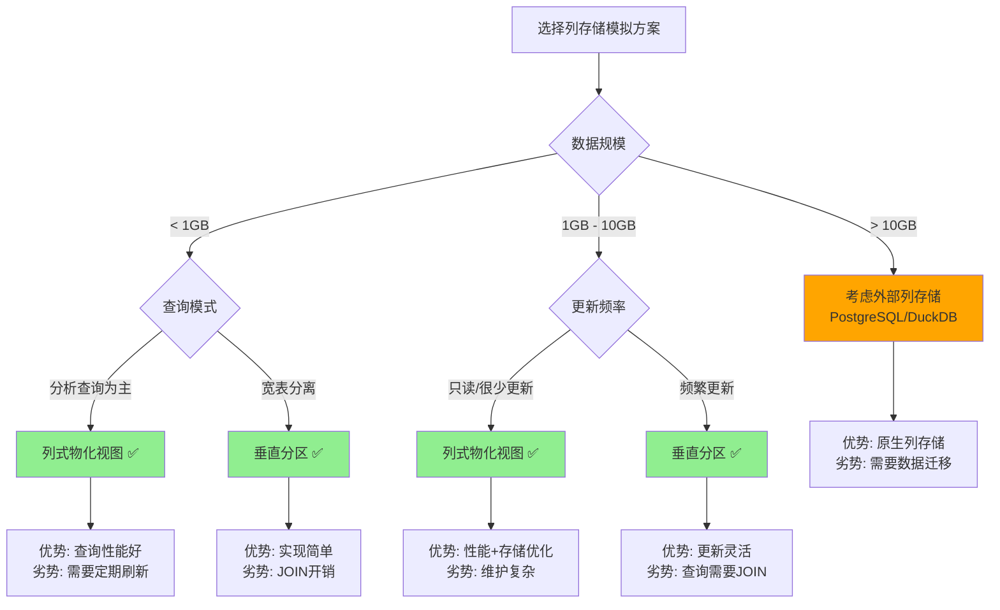

# 存储引擎：页结构与B-Tree深度剖析

> **创建日期**：2025-11-13
> **最后更新**：2025-01-15
> **版本**：SQLite 3.31+ 至 3.47.x

---

## 1. 📋 概述

SQLite的存储引擎基于页（Page）和B-Tree结构，本文档深入解析页结构、B-Tree实现和原子性保证机制。

---

## 2. 📑 目录

- [存储引擎：页结构与B-Tree深度剖析](#存储引擎页结构与b-tree深度剖析)
  - [1. 📋 概述](#1--概述)
  - [2. 📑 目录](#2--目录)
  - [3. 📊 思维导图](#3--思维导图)
  - [4. 📊 多维概念矩阵对比](#4--多维概念矩阵对比)
    - [4.1. 页类型对比矩阵](#41-页类型对比矩阵)
    - [4.2. B-Tree操作对比矩阵](#42-b-tree操作对比矩阵)
    - [4.3. 存储优化策略对比矩阵](#43-存储优化策略对比矩阵)
  - [5. 🌐 Wikipedia对齐](#5--wikipedia对齐)
    - [5.1. B-Tree概念对齐](#51-b-tree概念对齐)
    - [5.2. 存储引擎概念对齐](#52-存储引擎概念对齐)
    - [5.3. 原子性概念对齐](#53-原子性概念对齐)
  - [5.5. 形式化定义](#55-形式化定义)
    - [5.5.1. B-Tree结构形式化定义](#551-b-tree结构形式化定义)
    - [5.5.2. B-Tree操作形式化定义](#552-b-tree操作形式化定义)
    - [5.5.3. B-Tree插入形式化定义](#553-b-tree插入形式化定义)
    - [5.5.4. B-Tree删除形式化定义](#554-b-tree删除形式化定义)
    - [5.5.5. B-Tree高度形式化定义](#555-b-tree高度形式化定义)
    - [5.5.6. 形式化定理](#556-形式化定理)
    - [5.5.7. 形式化验证](#557-形式化验证)
  - [6. 页（Page）——存储的基本原子](#6-页page存储的基本原子)
    - [6.1. 页的基本概念](#61-页的基本概念)
    - [6.2. 页类型](#62-页类型)
    - [6.3. 页头部结构](#63-页头部结构)
    - [6.4. 单元（Cell）结构](#64-单元cell结构)
  - [7. B-Tree实现](#7-b-tree实现)
    - [7.1. B-Tree变体](#71-b-tree变体)
    - [7.2. B-Tree操作详解与代码示例](#72-b-tree操作详解与代码示例)
      - [7.2.1. 插入操作流程](#721-插入操作流程)
      - [7.2.2. 查找操作详解](#722-查找操作详解)
      - [7.2.3. 删除操作流程](#723-删除操作流程)
  - [8. 游标机制](#8-游标机制)
  - [9. 原子性保证机制](#9-原子性保证机制)
    - [9.1. 页面级日志](#91-页面级日志)
    - [9.2. 崩溃恢复](#92-崩溃恢复)
    - [9.3. 原子性证明](#93-原子性证明)
  - [10. 存储优化](#10-存储优化)
    - [10.1. 页大小选择与性能优化](#101-页大小选择与性能优化)
  - [11. 碎片管理与优化](#11-碎片管理与优化)
  - [12. 压缩存储](#12-压缩存储)
  - [13. 列存储架构分析](#13-列存储架构分析)
    - [13.1. 列存储概述](#131-列存储概述)
    - [13.2. SQLite的行存储架构](#132-sqlite的行存储架构)
    - [13.3. 列存储架构理论](#133-列存储架构理论)
    - [13.4. 行存储 vs 列存储对比](#134-行存储-vs-列存储对比)
      - [📊 存储架构选择决策树](#-存储架构选择决策树)
      - [📊 行存储 vs 列存储 vs 混合存储对比矩阵](#-行存储-vs-列存储-vs-混合存储对比矩阵)
      - [📊 SQLite列存储模拟架构图](#-sqlite列存储模拟架构图)
      - [📊 列存储模拟查询执行时序图](#-列存储模拟查询执行时序图)
    - [13.5. SQLite中的列存储模拟](#135-sqlite中的列存储模拟)
      - [📊 SQLite列存储模拟方案对比矩阵](#-sqlite列存储模拟方案对比矩阵)
    - [13.6. 列存储实现原理](#136-列存储实现原理)
      - [📊 SQLite列存储技术栈对比](#-sqlite列存储技术栈对比)
  - [14. 列压缩技术详解](#14-列压缩技术详解)
    - [14.1. 列压缩概述](#141-列压缩概述)
    - [14.2. 列压缩算法](#142-列压缩算法)
      - [14.2.1. 字典编码（Dictionary Encoding）](#1421-字典编码dictionary-encoding)
      - [14.2.2. 游程编码（Run-Length Encoding, RLE）](#1422-游程编码run-length-encoding-rle)
      - [14.2.3. 增量编码（Delta Encoding）](#1423-增量编码delta-encoding)
      - [14.2.4. 位图压缩（Bitmap Compression）](#1424-位图压缩bitmap-compression)
      - [14.2.5. 通用压缩算法](#1425-通用压缩算法)
    - [14.3. 列压缩性能分析](#143-列压缩性能分析)
    - [14.4. SQLite中的压缩实践](#144-sqlite中的压缩实践)
    - [14.5. 列压缩理论分析](#145-列压缩理论分析)
  - [15. 存储引擎性能特征](#15-存储引擎性能特征)
    - [15.1. 读取性能](#151-读取性能)
    - [15.2. 写入性能](#152-写入性能)
    - [15.3. 空间效率](#153-空间效率)
  - [16. 🔗 相关资源](#16--相关资源)
  - [17. 📚 参考资料](#17--参考资料)
  - [18. 🔗 交叉引用](#18--交叉引用)
    - [18.1. 相关文档](#181-相关文档)
      - [16.1.1. 核心架构](#1611-核心架构)
      - [16.1.2. 数据模型](#1612-数据模型)
      - [18.1.3. 性能优化](#1813-性能优化)
      - [18.1.4. 形式化理论](#1814-形式化理论)
      - [18.1.5. 理论模型 🆕](#1815-理论模型-)
      - [18.1.6. 设计模型 🆕](#1816-设计模型-)

---

## 3. 📊 思维导图



---

## 4. 📊 多维概念矩阵对比

### 4.1. 页类型对比矩阵

| 页类型 | 用途 | 位置 | 大小 | 生命周期 | 访问频率 | SQLite支持 |
|--------|------|------|------|---------|---------|-----------|
| **锁定页** | 文件锁 | 页0 | 固定 | 永久 | 低 | ✅ 原生支持 |
| **自由列表页** | 空闲空间管理 | 分散 | 可变 | 动态 | 中 | ✅ 原生支持 |
| **B-Tree页** | 数据存储 | 大部分 | 可变 | 动态 | 高 | ✅ 原生支持 |
| **指针映射页** | WAL页引用 | WAL模式 | 固定 | 动态 | 中 | ✅ WAL模式 |

### 4.2. B-Tree操作对比矩阵

| B-Tree操作 | 时间复杂度 | 空间复杂度 | 磁盘I/O | 锁需求 | 适用场景 | SQLite实现 |
|-----------|-----------|-----------|---------|--------|---------|-----------|
| **查找操作** | O(log n) | O(1) | O(log n) | 读锁 | 查询 | ✅ 优化实现 |
| **插入操作** | O(log n) | O(1) | O(log n) | 写锁 | 插入 | ✅ 支持分裂 |
| **删除操作** | O(log n) | O(1) | O(log n) | 写锁 | 删除 | ✅ 支持合并 |
| **更新操作** | O(log n) | O(1) | O(log n) | 写锁 | 更新 | ✅ 就地更新 |

### 4.3. 存储优化策略对比矩阵

| 优化策略 | 性能提升 | 空间节省 | 复杂度 | 适用场景 | SQLite支持 |
|---------|---------|---------|--------|---------|-----------|
| **页大小优化** | 中 | 低 | 低 | 特定负载 | ✅ PRAGMA配置 |
| **碎片整理** | 中 | 高 | 中 | 频繁更新 | ✅ VACUUM |
| **压缩存储** | 低 | 高 | 高 | 存储受限 | ⚠️ 有限支持 |
| **WAL模式** | 高 | 低 | 中 | 高并发 | ✅ 原生支持 |

---

## 5. 🌐 Wikipedia对齐

### 5.1. B-Tree概念对齐

**Wikipedia定义**: [B-tree](https://en.wikipedia.org/wiki/B-tree)

> A B-tree is a self-balancing tree data structure that maintains sorted data and allows searches, sequential access, insertions, and deletions in logarithmic time.

**对齐说明**:

- ✅ **定义一致性**: 本文档的定义与Wikipedia一致，都强调B-Tree是自平衡树结构
- ✅ **核心特性**: 都提到有序数据、对数时间操作等核心特性
- ✅ **应用场景**: 都提到数据库索引、文件系统等应用场景

### 5.2. 存储引擎概念对齐

**Wikipedia定义**: [Storage engine](https://en.wikipedia.org/wiki/Storage_engine)

> A storage engine is a software component that a database management system uses to create, read, update and delete data from a database.

**对齐说明**:

- ✅ **定义一致性**: 本文档的定义与Wikipedia一致，都强调存储引擎是数据库管理系统的软件组件
- ✅ **核心功能**: 都提到CRUD操作、数据持久化等核心功能
- ✅ **实现方式**: SQLite的B-Tree存储引擎符合Wikipedia的描述

### 5.3. 原子性概念对齐

**Wikipedia定义**: [Atomicity (database systems)](https://en.wikipedia.org/wiki/Atomicity_(database_systems))

> Atomicity is a property of database transactions stating that a series of database operations either all occur, or nothing occurs.

**对齐说明**:

- ✅ **定义一致性**: 本文档的定义与Wikipedia一致，都强调原子性是事务要么全部发生要么全部不发生的属性
- ✅ **实现机制**: 都提到日志、回滚等实现机制
- ✅ **保证方式**: SQLite通过页面级日志和崩溃恢复保证原子性

---

## 5.5. 形式化定义

### 5.5.1. B-Tree结构形式化定义

```text
定义5.5.1 B-Tree（B-Tree Structure）
═══════════════════════════════════════════════════════════════

B-Tree T = (Nodes, Root, Order)
  其中:
  • Nodes: 节点集合
  • Root: 根节点
  • Order: B-Tree阶数（每个节点最多Order-1个键）

节点定义:
  Node N = (Keys, Children, Values, Type)
  其中:
    • Keys: 键集合 {k₁, k₂, ..., kₘ}，m ≤ Order-1
    • Children: 子节点指针集合 {c₁, c₂, ..., cₘ₊₁}
    • Values: 值集合 {v₁, v₂, ..., vₘ}（叶子节点）
    • Type: 节点类型 ∈ {INTERIOR, LEAF}

B-Tree性质:
  1. 所有叶子节点在同一层
  2. 每个节点最多有Order-1个键
  3. 根节点至少有1个键（除非树为空）
  4. 非根节点至少有⌈Order/2⌉-1个键
  5. 键按升序排列: ∀i: kᵢ < kᵢ₊₁

形式化表示:
  IsValidBTree(T) ⟺
    (AllLeavesSameLevel(T) ∧
     NodeKeyCountValid(T) ∧
     KeysOrdered(T) ∧
     RootExists(T))
```

### 5.5.2. B-Tree操作形式化定义

```text
定义5.5.2 B-Tree搜索（B-Tree Search）
═══════════════════════════════════════════════════════════════

Search(T, k): Tree × Key → Value
  Search(T, k) =
    if T.Root.Type = LEAF:
      return Value where Key = k in T.Root
    else:
      let child = FindChild(T.Root, k)
      return Search(child, k)

FindChild(node, k):
  if k < node.Keys[0]:
    return node.Children[0]
  else if k ≥ node.Keys[m-1]:
    return node.Children[m]
  else:
    return node.Children[i] where node.Keys[i-1] ≤ k < node.Keys[i]

搜索正确性:
  ∀T, ∀k: Search(T, k) = v ⟺ (k, v) ∈ T

时间复杂度:
  O(log_{Order}(n))，其中n是键的数量
```

### 5.5.3. B-Tree插入形式化定义

```text
定义5.5.3 B-Tree插入（B-Tree Insert）
═══════════════════════════════════════════════════════════════

Insert(T, k, v): Tree × Key × Value → Tree
  Insert(T, k, v) =
    if T.Root is full:
      SplitRoot(T)
    InsertIntoNode(T.Root, k, v)

InsertIntoNode(node, k, v):
  if node.Type = LEAF:
    InsertKeyValue(node, k, v)
    if node is full:
      SplitNode(node)
  else:
    let child = FindChild(node, k)
    InsertIntoNode(child, k, v)
    if child was split:
      InsertKeyIntoParent(node, child.middle_key)

SplitNode(node):
  middle = ⌊Order/2⌋
  new_node = CreateNode()
  new_node.Keys = node.Keys[middle+1:]
  new_node.Values = node.Values[middle+1:]
  node.Keys = node.Keys[:middle]
  node.Values = node.Values[:middle]
  return (node.Keys[middle], new_node)

插入正确性:
  Insert(T, k, v) = T' ⇒ (k, v) ∈ T' ∧ IsValidBTree(T')
```

### 5.5.4. B-Tree删除形式化定义

```text
定义5.5.4 B-Tree删除（B-Tree Delete）
═══════════════════════════════════════════════════════════════

Delete(T, k): Tree × Key → Tree
  Delete(T, k) =
    DeleteFromNode(T.Root, k)
    if T.Root has 0 keys and T.Root.Type = INTERIOR:
      T.Root = T.Root.Children[0]

DeleteFromNode(node, k):
  if node.Type = LEAF:
    RemoveKey(node, k)
    if node has < ⌈Order/2⌉-1 keys:
      MergeOrBorrow(node)
  else:
    let child = FindChild(node, k)
    DeleteFromNode(child, k)
    if child has < ⌈Order/2⌉-1 keys:
      MergeOrBorrow(child)

删除正确性:
  Delete(T, k) = T' ⇒ (k, v) ∉ T' ∧ IsValidBTree(T')
```

### 5.5.5. B-Tree高度形式化定义

```text
定义5.5.5 B-Tree高度（B-Tree Height）
═══════════════════════════════════════════════════════════════

高度定义:
  Height(T) = 从根到叶子的最长路径长度

高度定理:
  对于包含n个键的B-Tree，其高度h满足:
    h ≤ log_{⌈Order/2⌉}((n+1)/2) + 1

证明:
  设每个节点至少有⌈Order/2⌉-1个键，则:
  • 第0层（根）: 至少有1个键
  • 第1层: 至少有⌈Order/2⌉个节点，每个至少⌈Order/2⌉-1个键
  • 第h层: 至少有⌈Order/2⌉^h个键

  因此: n ≥ ⌈Order/2⌉^h - 1
  即: h ≤ log_{⌈Order/2⌉}(n+1) + 1
  ∎
```

### 5.5.6. 形式化定理

```text
定理5.5.1 B-Tree搜索正确性
═══════════════════════════════════════════════════════════════

∀T, ∀k: Search(T, k) = v ⟺ (k, v) ∈ T

证明（归纳法）:
  基础: 叶子节点，直接查找
  归纳: 内部节点，根据键值选择子树
  由B-Tree性质，键按顺序排列
  因此搜索正确
  ∎

定理5.5.2 B-Tree插入保持结构
═══════════════════════════════════════════════════════════════

Insert(T, k, v) = T' ⇒ IsValidBTree(T')

证明:
  1. 插入到叶子节点
  2. 如果节点未满，直接插入，保持结构
  3. 如果节点满，分裂后仍满足键数约束
  4. 分裂可能向上传播，但最终保持结构
  ∎

定理5.5.3 B-Tree平衡性
═══════════════════════════════════════════════════════════════

∀T: IsValidBTree(T) ⇒ Balanced(T)

证明:
  1. 由高度定理，高度有界
  2. 由插入删除操作，保持结构
  3. 因此B-Tree平衡
  ∎
```

### 5.5.7. 形式化验证

```text
不变式5.5.1 B-Tree结构不变式
═══════════════════════════════════════════════════════════════

∀T: IsValidBTree(T) ⇒
  (AllLeavesSameLevel(T) ∧
   NodeKeyCountValid(T) ∧
   KeysOrdered(T))

验证:
  1. 初始状态: 空树满足不变式
  2. 插入操作: 保持结构（由定理5.5.2）
  3. 删除操作: 保持结构
  4. 因此所有状态满足不变式
  ∎

不变式5.5.2 键顺序不变式
═══════════════════════════════════════════════════════════════

∀node: ∀i: node.Keys[i] < node.Keys[i+1]

验证:
  1. 插入时保持键顺序
  2. 删除时保持键顺序
  3. 分裂合并时保持键顺序
  4. 因此键顺序不变式成立
  ∎
```

---

## 6. 页（Page）——存储的基本原子

### 6.1. 页的基本概念

**页大小**：

- **默认大小**：4096字节（4KB）
- **可配置范围**：512字节到65536字节
- **配置方法**：`PRAGMA page_size`（仅在建库时有效）

**页的作用**：

- 数据库文件的基本存储单元
- B-Tree节点的存储容器
- 缓存管理的基本单位

### 6.2. 页类型

SQLite数据库文件包含多种类型的页：

| 页类型 | 说明 | 位置 |
|--------|------|------|
| **锁定页**（Lock-byte page） | 用于文件锁 | 第一页（页0） |
| **自由列表页**（Freelist pages） | 管理空闲空间 | 分散在文件中 |
| **B-Tree页** | 存储表数据或索引 | 大部分页面 |
| **指针映射页**（Pointer Map pages） | WAL模式下追踪页引用 | WAL模式特有 |

### 6.3. 页头部结构

**B-Tree页头部**（8-12字节）：

```text
偏移  大小  说明
0     1     页类型标志（0x02=内部页，0x05=叶子页，0x0A=内部页+右指针，0x0D=叶子页+右指针）
1     2     第一个自由块偏移（0表示无自由块）
3     2     单元数量
5     2     单元内容区域起点
7     2     碎片字节数（仅叶子页）
9     4     右子页指针（仅内部页）
```

**页结构布局**：

```text
┌─────────────────────────────────────┐
│ 页头部（8-12字节）                    │
├─────────────────────────────────────┤
│ 单元指针数组（每个2字节）              │
│ [ptr1][ptr2][ptr3]...[ptrN]         │
├─────────────────────────────────────┤
│ 自由块链表（如果有）                   │
├─────────────────────────────────────┤
│ 单元内容区域                          │
│ [cell1][cell2][cell3]...[cellN]    │
└─────────────────────────────────────┘
```

### 6.4. 单元（Cell）结构

**表B-Tree单元**：

```text
┌─────────────┬──────────┬──────────┐
│ Payload长度 │ RowID    │ 数据列    │
│ (varint)    │ (varint) │ (数据)    │
└─────────────┴──────────┴──────────┘
```

**索引B-Tree单元**：

```text
┌─────────────┬──────────┐
│ Payload长度 │ 键值     │
│ (varint)    │ (数据)   │
└─────────────┴──────────┘
```

---

## 7. B-Tree实现

### 7.1. B-Tree变体

SQLite采用变体B-Tree，支持B+Tree特性：

**表B-Tree**：

- **键**：rowid（INTEGER PRIMARY KEY）或主键
- **值**：完整的行数据
- **特性**：叶子节点存储数据，内部节点存储键和指针

**索引B-Tree**：

- **键**：索引列的值
- **值**：rowid（用于回表）
- **特性**：所有节点都存储键值对

### 7.2. B-Tree操作详解与代码示例

#### 7.2.1. 插入操作流程

**插入操作流程**：

```text
1. 寻页：B-Tree模块请求Pager获取目标页
2. 修改：在内存中的页副本执行插入（可能引发分裂）
3. 日志：Pager将旧页内容写入回滚日志（或WAL）
4. 落盘：修改后的页标记为脏页，择机刷盘
5. 提交：日志清理，完成原子提交
```

**实际代码示例（C语言风格伪代码）**：

```c
// B-Tree插入操作（简化版）
int sqlite3BtreeInsert(
    BtCursor *pCur,        // 游标
    const void *pKey,      // 键
    int nKey,              // 键长度
    const void *pData,     // 数据
    int nData,             // 数据长度
    int nZero,             // 零填充长度
    int appendFlag,        // 追加标志
    int seekResult         // 查找结果
) {
    MemPage *pPage = pCur->apPage[pCur->iPage];  // 当前页
    int nCell = pPage->nCell;                     // 当前单元数

    // 1. 检查页空间是否足够
    int cellSize = computeCellSize(pKey, nKey, pData, nData);
    if (pPage->nFree < cellSize + 2) {  // 需要额外2字节用于指针
        // 页空间不足，需要分裂
        return splitPage(pCur, pKey, nKey, pData, nData);
    }

    // 2. 找到插入位置
    int idx = findInsertPosition(pPage, pKey, nKey);

    // 3. 分配空间
    int cellOffset = allocateCell(pPage, cellSize);

    // 4. 写入单元
    writeCell(pPage, cellOffset, pKey, nKey, pData, nData);

    // 5. 更新指针数组
    insertCellPointer(pPage, idx, cellOffset);
    pPage->nCell++;

    // 6. 标记页为脏页
    sqlite3PagerWrite(pPage->pDbPage);

    return SQLITE_OK;
}

// 页分裂操作
int splitPage(BtCursor *pCur, const void *pKey, int nKey,
              const void *pData, int nData) {
    MemPage *pOld = pCur->apPage[pCur->iPage];
    MemPage *pNew;
    Pgno newPgno;

    // 1. 分配新页
    sqlite3PagerAcquire(pCur->pBt->pPager, &newPgno, &pNew->pDbPage);
    initializePage(pNew);

    // 2. 将一半数据移动到新页
    int moveCount = pOld->nCell / 2;
    for (int i = moveCount; i < pOld->nCell; i++) {
        CellInfo cell;
        getCellInfo(pOld, i, &cell);
        insertCell(pNew, cell.pKey, cell.nKey, cell.pData, cell.nData);
        deleteCell(pOld, i);
    }

    // 3. 更新父节点
    if (pCur->iPage == 0) {
        // 根节点分裂，创建新根
        createNewRoot(pCur->pBt, pOld, pNew, pKey, nKey);
    } else {
        // 更新父节点指针
        MemPage *pParent = pCur->apPage[pCur->iPage - 1];
        insertCell(pParent, pKey, nKey, &newPgno, sizeof(Pgno));
    }

    // 4. 确定插入位置
    if (compareKey(pKey, nKey, getFirstKey(pNew)) < 0) {
        insertCell(pOld, pKey, nKey, pData, nData);
    } else {
        insertCell(pNew, pKey, nKey, pData, nData);
    }

    return SQLITE_OK;
}
```

#### 7.2.2. 查找操作详解

**查找操作代码示例**：

```c
// B-Tree查找操作
int sqlite3BtreeMovetoUnpacked(
    BtCursor *pCur,
    UnpackedRecord *pIdxKey,
    int *pRes
) {
    MemPage *pPage;
    int idx;
    int rc;

    // 1. 从根节点开始
    pPage = pCur->apPage[0] = getRootPage(pCur->pBt);
    pCur->iPage = 0;

    // 2. 向下遍历到叶子节点
    while (!isLeafPage(pPage)) {
        // 在内部节点中查找
        idx = binarySearch(pPage, pIdxKey);

        // 获取子页指针
        Pgno childPgno = getChildPgno(pPage, idx);

        // 移动到子页
        pCur->iPage++;
        pPage = pCur->apPage[pCur->iPage] = getPage(childPgno);
    }

    // 3. 在叶子节点中查找
    idx = binarySearch(pPage, pIdxKey);
    pCur->aiIdx[pCur->iPage] = idx;

    // 4. 设置查找结果
    if (idx < pPage->nCell) {
        int cmp = compareKey(pPage, idx, pIdxKey);
        *pRes = cmp;
    } else {
        *pRes = -1;  // 未找到
    }

    return SQLITE_OK;
}

// 二分查找（在页内查找键）
int binarySearch(MemPage *pPage, UnpackedRecord *pIdxKey) {
    int left = 0;
    int right = pPage->nCell;

    while (left < right) {
        int mid = (left + right) / 2;
        int cmp = compareKey(pPage, mid, pIdxKey);

        if (cmp < 0) {
            left = mid + 1;
        } else {
            right = mid;
        }
    }

    return left;
}
```

#### 7.2.3. 删除操作流程

**删除操作代码示例**：

```c
// B-Tree删除操作
int sqlite3BtreeDelete(BtCursor *pCur) {
    MemPage *pPage = pCur->apPage[pCur->iPage];
    int idx = pCur->aiIdx[pCur->iPage];

    // 1. 删除单元
    deleteCell(pPage, idx);
    pPage->nCell--;

    // 2. 检查页利用率
    int utilization = (pPage->nCell * avgCellSize) / pageSize;
    if (utilization < 0.5 && pPage->nCell > 0) {
        // 页利用率过低，考虑合并
        return tryMergePage(pCur);
    }

    // 3. 标记页为脏页
    sqlite3PagerWrite(pPage->pDbPage);

    return SQLITE_OK;
}

// 页合并操作
int tryMergePage(BtCursor *pCur) {
    MemPage *pPage = pCur->apPage[pCur->iPage];
    MemPage *pSibling;

    // 尝试与兄弟页合并
    if (getLeftSibling(pPage, &pSibling)) {
        if (pSibling->nCell + pPage->nCell < maxCellsPerPage) {
            // 可以合并
            mergePages(pSibling, pPage);
            deletePage(pPage);
            return SQLITE_OK;
        }
    }

    return SQLITE_OK;  // 无法合并，保持现状
}
```

**实际使用示例（Python）**：

```python
import sqlite3

# 创建数据库并观察B-Tree结构
conn = sqlite3.connect('btree_demo.db')
conn.execute('PRAGMA page_size=4096')  # 设置页大小

# 创建表
conn.execute('''
    CREATE TABLE users (
        id INTEGER PRIMARY KEY,
        name TEXT,
        email TEXT
    )
''')

# 插入数据（观察B-Tree增长）
for i in range(1000):
    conn.execute(
        'INSERT INTO users (name, email) VALUES (?, ?)',
        (f'user_{i}', f'user_{i}@example.com')
    )

# 分析B-Tree结构
cursor = conn.execute('PRAGMA page_count')  # 查看页数
page_count = cursor.fetchone()[0]
print(f'数据库页数: {page_count}')

cursor = conn.execute('PRAGMA page_size')
page_size = cursor.fetchone()[0]
print(f'页大小: {page_size} bytes')

# 使用EXPLAIN QUERY PLAN查看B-Tree使用
cursor = conn.execute('EXPLAIN QUERY PLAN SELECT * FROM users WHERE id = 500')
for row in cursor:
    print(f'查询计划: {row}')

conn.close()
```

## 8. 游标机制

**BtCursor结构**：

```c
// 简化的游标结构
struct BtCursor {
    Btree* pBtree;      // 所属B-Tree
    BtShared* pBt;      // 共享B-Tree信息
    int pgnoRoot;       // 根页号
    int iPage;          // 当前页在路径中的索引
    MemPage* aPage[20]; // 页路径（最多20层）
    int aiIdx[20];      // 每页中的单元索引
    // ...
};
```

**游标操作**：

```c
sqlite3BtreeCursor();      // 创建游标
sqlite3BtreeMoveto();     // 定位到指定键
sqlite3BtreeNext();        // 移动到下一个
sqlite3BtreePrev();        // 移动到上一个
sqlite3BtreeInsert();      // 插入记录
sqlite3BtreeDelete();      // 删除记录
```

---

## 9. 原子性保证机制

### 9.1. 页面级日志

SQLite通过**页面级日志**保证B-Tree操作的原子性：

**DELETE模式日志**：

```text
1. 修改前：将旧页内容写入回滚日志
2. 修改：在内存中修改页
3. 提交：将修改写入数据库文件
4. 清理：删除回滚日志
```

**WAL模式日志**：

```text
1. 修改：直接写入WAL文件（追加）
2. 提交：在WAL文件中标记提交
3. Checkpoint：定期将WAL内容合并到数据库文件
```

### 9.2. 崩溃恢复

**DELETE模式恢复**：

```text
启动时检查：
1. 如果回滚日志存在 → 有未完成事务
2. 使用日志回滚到一致状态
3. 删除日志文件
```

**WAL模式恢复**：

```text
启动时检查：
1. 如果-wal文件存在 → 检查未完成事务
2. 回滚未完成事务
3. 应用已提交事务到db文件
```

### 9.3. 原子性证明

**形式化描述**：

```text
定义：事务T包含操作序列{o₁, o₂, ..., oₙ}

提交过程：
1. 日志写入：∀i∈[1,n], 将old_page写入日志
2. 页修改：在内存中修改页
3. 提交标记：写入commit记录
4. 数据落盘：将修改写入数据库文件
5. 日志清理：删除日志文件

崩溃恢复不变式：
- 如果日志存在且无commit标记 → 回滚
- 如果日志存在且有commit标记 → 重放
- 如果日志不存在 → 事务已提交
```

---

## 10. 存储优化

### 10.1. 页大小选择与性能优化

**页大小影响**：

| 页大小 | 优点 | 缺点 | 适用场景 |
|--------|------|------|----------|
| 512B | 小数据量高效 | B-Tree高度增加 | 小数据量 |
| 4KB（默认） | 平衡 | - | 大多数场景 |
| 64KB | 大数据量高效 | 小数据量浪费 | 大数据量 |

**配置建议**：

```sql
-- 建库时设置页大小（仅在建库时有效）
PRAGMA page_size=4096;

-- 查看当前页大小
PRAGMA page_size;
```

**页大小性能测试代码**：

```python
import sqlite3
import time
import os

def test_page_size_performance(page_size, num_records=100000):
    """测试不同页大小的性能"""
    db_name = f'test_{page_size}.db'

# 删除旧数据库
    if os.path.exists(db_name):
        os.remove(db_name)

    conn = sqlite3.connect(db_name)

# 设置页大小（必须在建库时设置）
    conn.execute(f'PRAGMA page_size={page_size}')

# 创建表
    conn.execute('''
        CREATE TABLE test (
            id INTEGER PRIMARY KEY,
            data TEXT,
            value REAL
        )
    ''')

# 插入数据
    start = time.time()
    conn.executemany(
        'INSERT INTO test (data, value) VALUES (?, ?)',
        [(f'data_{i}', i * 1.5) for i in range(num_records)]
    )
    conn.commit()
    insert_time = time.time() - start

# 查询性能
    start = time.time()
    for i in range(0, num_records, 1000):
        conn.execute('SELECT * FROM test WHERE id = ?', (i,)).fetchone()
    query_time = time.time() - start

# 获取统计信息
    cursor = conn.execute('PRAGMA page_count')
    page_count = cursor.fetchone()[0]

    cursor = conn.execute('PRAGMA page_size')
    actual_page_size = cursor.fetchone()[0]

    file_size = os.path.getsize(db_name)

    conn.close()

    return {
        'page_size': actual_page_size,
        'page_count': page_count,
        'file_size': file_size,
        'insert_time': insert_time,
        'query_time': query_time
    }

# 测试不同页大小
page_sizes = [512, 1024, 4096, 8192, 16384, 32768, 65536]
results = []

for ps in page_sizes:
    result = test_page_size_performance(ps)
    results.append(result)
    print(f"页大小: {result['page_size']:5d} bytes | "
          f"页数: {result['page_count']:5d} | "
          f"文件大小: {result['file_size']/1024/1024:.2f} MB | "
          f"插入时间: {result['insert_time']:.2f}s | "
          f"查询时间: {result['query_time']:.2f}s")

# 性能分析
print("\n性能分析：")
print("页大小越大，B-Tree高度越低，但小数据量时浪费空间")
print("推荐：大多数场景使用4KB（默认），大数据量使用64KB")
```

**实际案例：根据数据特征选择页大小**：

```python
import sqlite3
import os

def create_optimized_database(data_type='mixed'):
    """根据数据类型创建优化的数据库"""

    if data_type == 'small':
# 小数据量：使用小页
        page_size = 1024
        db_name = 'small_data.db'
    elif data_type == 'large':
# 大数据量：使用大页
        page_size = 65536
        db_name = 'large_data.db'
    else:
# 混合数据：使用默认页
        page_size = 4096
        db_name = 'mixed_data.db'

    if os.path.exists(db_name):
        os.remove(db_name)

    conn = sqlite3.connect(db_name)
    conn.execute(f'PRAGMA page_size={page_size}')

# 其他优化设置
    conn.execute('PRAGMA journal_mode=WAL')
    conn.execute('PRAGMA synchronous=NORMAL')
    conn.execute('PRAGMA cache_size=-64000')  # 64MB缓存

    return conn

# 使用示例
conn = create_optimized_database('large')
conn.execute('''
    CREATE TABLE large_table (
        id INTEGER PRIMARY KEY,
        data BLOB  -- 大数据字段
    )
''')
conn.close()
```

## 11. 碎片管理与优化

**自由块链表**：

- 管理页内空闲空间
- 支持空间复用
- 减少页分裂

**VACUUM操作**：

```sql
-- 重建数据库，消除碎片
VACUUM;

-- 效果：
-- 1. 重建所有表
-- 2. 消除碎片
-- 3. 优化页布局
```

**碎片检测与优化代码示例**：

```python
import sqlite3
import os

def analyze_fragmentation(db_path):
    """分析数据库碎片情况"""
    conn = sqlite3.connect(db_path)

# 获取数据库统计信息
    cursor = conn.execute('PRAGMA page_count')
    page_count = cursor.fetchone()[0]

    cursor = conn.execute('PRAGMA page_size')
    page_size = cursor.fetchone()[0]

    cursor = conn.execute('PRAGMA freelist_count')
    freelist_count = cursor.fetchone()[0]

# 计算文件大小
    file_size = os.path.getsize(db_path)
    theoretical_size = page_count * page_size
    free_pages = freelist_count

# 碎片率
    fragmentation = (free_pages / page_count * 100) if page_count > 0 else 0

    print(f"数据库文件: {db_path}")
    print(f"页大小: {page_size} bytes")
    print(f"总页数: {page_count}")
    print(f"空闲页数: {free_pages}")
    print(f"碎片率: {fragmentation:.2f}%")
    print(f"文件大小: {file_size / 1024 / 1024:.2f} MB")
    print(f"理论大小: {theoretical_size / 1024 / 1024:.2f} MB")

    conn.close()

    return {
        'fragmentation': fragmentation,
        'free_pages': free_pages,
        'page_count': page_count
    }

def optimize_database(db_path):
    """优化数据库（消除碎片）"""
    conn = sqlite3.connect(db_path)

# 获取优化前信息
    before = analyze_fragmentation(db_path)

# 执行VACUUM
    print("\n执行VACUUM优化...")
    conn.execute('VACUUM')
    conn.close()

# 获取优化后信息
    print("\n优化后：")
    after = analyze_fragmentation(db_path)

# 计算优化效果
    improvement = before['fragmentation'] - after['fragmentation']
    print(f"\n碎片率降低: {improvement:.2f}%")

    return improvement

# 使用示例
# analyze_fragmentation('example.db')
# optimize_database('example.db')
```

**自动碎片管理策略**：

```python
import sqlite3
import time

class AutoVacuumManager:
    """自动碎片管理"""

    def __init__(self, db_path, threshold=20.0):
        """
        threshold: 碎片率阈值（%），超过此值自动执行VACUUM
        """
        self.db_path = db_path
        self.threshold = threshold
        self.last_vacuum = time.time()
        self.vacuum_interval = 86400  # 24小时

    def check_and_vacuum(self):
        """检查并执行VACUUM（如果需要）"""
        conn = sqlite3.connect(self.db_path)

# 检查碎片率
        cursor = conn.execute('PRAGMA page_count')
        page_count = cursor.fetchone()[0]

        cursor = conn.execute('PRAGMA freelist_count')
        freelist_count = cursor.fetchone()[0]

        fragmentation = (freelist_count / page_count * 100) if page_count > 0 else 0

        conn.close()

# 检查是否需要VACUUM
        need_vacuum = (
            fragmentation > self.threshold or
            (time.time() - self.last_vacuum) > self.vacuum_interval
        )

        if need_vacuum:
            print(f"碎片率: {fragmentation:.2f}%，执行VACUUM...")
            self.vacuum()
            return True

        return False

    def vacuum(self):
        """执行VACUUM"""
        conn = sqlite3.connect(self.db_path)
        conn.execute('VACUUM')
        conn.close()
        self.last_vacuum = time.time()
        print("VACUUM完成")

# 使用示例
# manager = AutoVacuumManager('app.db', threshold=15.0)
# manager.check_and_vacuum()  # 定期调用
```

## 12. 压缩存储

**Varint编码**：

- 整数使用变长编码
- 小整数占用更少空间
- 减少存储开销

**示例**：

```text
0-127:     1字节
128-16383: 2字节
16384-...: 3字节或更多
```

---

## 13. 列存储架构分析

### 13.1. 列存储概述

**列存储（Columnar Storage）**是一种数据存储方式，将数据按列而非按行组织存储。与SQLite使用的行存储（Row-Oriented Storage）形成对比。

**核心概念**：

```text
行存储（Row-Oriented）：
  Row₁: [col₁, col₂, col₃, ..., colₙ]
  Row₂: [col₁, col₂, col₃, ..., colₙ]
  Row₃: [col₁, col₂, col₃, ..., colₙ]

列存储（Column-Oriented）：
  Col₁: [val₁, val₂, val₃, ..., valₙ]
  Col₂: [val₁, val₂, val₃, ..., valₙ]
  Col₃: [val₁, val₂, val₃, ..., valₙ]
```

### 13.2. SQLite的行存储架构

**SQLite存储模型**：

SQLite采用**行存储架构**，每条记录（行）的所有列值连续存储在B-Tree页中：

```text
B-Tree页结构（行存储）：
  ┌─────────────────────────────────┐
  │ 页头部 (Header)                 │
  ├─────────────────────────────────┤
  │ 单元指针数组 (Cell Pointers)    │
  ├─────────────────────────────────┤
  │ 单元1: [id, name, age, email]   │ ← 完整行
  │ 单元2: [id, name, age, email]   │ ← 完整行
  │ 单元3: [id, name, age, email]   │ ← 完整行
  └─────────────────────────────────┘
```

**行存储优势**：

1. **事务性能**：单行更新只需修改一个单元
2. **点查询**：通过主键快速定位整行数据
3. **插入性能**：插入新行只需追加一个单元
4. **OLTP场景**：适合事务处理，读写混合负载

**行存储劣势**：

1. **列扫描**：查询单列需要读取整行数据
2. **压缩效率**：不同数据类型混合存储，压缩率低
3. **聚合查询**：需要扫描大量不相关列数据

### 13.3. 列存储架构理论

**列存储布局**：

```text
列存储文件结构：
  ┌─────────────────────────────────┐
  │ 列1数据块: [val₁, val₂, ..., valₙ] │
  ├─────────────────────────────────┤
  │ 列2数据块: [val₁, val₂, ..., valₙ] │
  ├─────────────────────────────────┤
  │ 列3数据块: [val₁, val₂, ..., valₙ] │
  └─────────────────────────────────┘
```

**列存储优势**：

1. **列扫描效率**：只读取需要的列，I/O减少
2. **压缩效率**：同列数据类型相同，压缩率高
3. **聚合查询**：适合SUM、AVG、COUNT等聚合操作
4. **向量化处理**：列数据可批量处理，SIMD优化

**列存储劣势**：

1. **点查询**：需要访问多列，性能较差
2. **更新性能**：更新一行需要修改多个列文件
3. **插入性能**：插入新行需要追加到所有列
4. **事务开销**：多列更新需要更多I/O

### 13.4. 行存储 vs 列存储对比

#### 📊 存储架构选择决策树



#### 📊 行存储 vs 列存储 vs 混合存储对比矩阵

| 维度 | 行存储（SQLite） | 列存储 | 混合存储 | 最佳选择 |
|------|----------------|--------|---------|---------|
| **点查询（单行）** | ⭐⭐⭐⭐⭐ | ⭐⭐ | ⭐⭐⭐⭐ | 行存储 |
| **列扫描（单列）** | ⭐⭐ | ⭐⭐⭐⭐⭐ | ⭐⭐⭐⭐ | 列存储 |
| **聚合查询** | ⭐⭐ | ⭐⭐⭐⭐⭐ | ⭐⭐⭐⭐ | 列存储 |
| **插入单行** | ⭐⭐⭐⭐⭐ | ⭐⭐ | ⭐⭐⭐ | 行存储 |
| **更新单行** | ⭐⭐⭐⭐⭐ | ⭐⭐ | ⭐⭐⭐ | 行存储 |
| **批量插入** | ⭐⭐⭐⭐ | ⭐⭐⭐ | ⭐⭐⭐ | 行存储略优 |
| **压缩率** | ⭐⭐ (10-30%) | ⭐⭐⭐⭐⭐ (70-90%) | ⭐⭐⭐⭐ (50-70%) | 列存储 |
| **OLTP负载** | ⭐⭐⭐⭐⭐ | ⭐⭐ | ⭐⭐⭐⭐ | 行存储 |
| **OLAP负载** | ⭐⭐ | ⭐⭐⭐⭐⭐ | ⭐⭐⭐⭐ | 列存储 |
| **存储成本** | ⭐⭐ | ⭐⭐⭐⭐⭐ | ⭐⭐⭐⭐ | 列存储 |
| **查询延迟** | ⭐⭐⭐⭐ (低) | ⭐⭐⭐ (中) | ⭐⭐⭐⭐ (低-中) | 行存储 |
| **吞吐量** | ⭐⭐⭐ (中) | ⭐⭐⭐⭐⭐ (高) | ⭐⭐⭐⭐ (中-高) | 列存储 |
| **维护复杂度** | ⭐⭐⭐⭐⭐ (低) | ⭐⭐⭐ (中) | ⭐⭐ (高) | 行存储 |
| **SQLite支持** | ✅ 原生支持 | ⚠️ 需模拟 | ⚠️ 需设计 | 行存储 |
| **适用场景** | OLTP、点查询、嵌入式 | OLAP、分析查询、数据仓库 | 混合负载 | - |

**适用场景分析**：

```text
行存储（SQLite）适合：
  - OLTP事务处理
  - 点查询和范围查询
  - 频繁的插入和更新
  - 小到中等规模数据
  - 嵌入式应用

列存储适合：
  - OLAP分析查询
  - 大规模数据仓库
  - 聚合和统计查询
  - 只读或读多写少场景
  - 大数据分析
```

#### 📊 SQLite列存储模拟架构图



#### 📊 列存储模拟查询执行时序图



### 13.5. SQLite中的列存储模拟

**虽然SQLite原生不支持列存储，但可以通过设计模式模拟**：

**方案1：垂直分区（列分离）**：

```sql
-- 将宽表拆分为多个窄表
-- 原始表
CREATE TABLE users (
    id INTEGER PRIMARY KEY,
    name TEXT,
    email TEXT,
    age INTEGER,
    profile TEXT,  -- 大字段
    metadata TEXT  -- 大字段
);

-- 拆分为核心表和扩展表
CREATE TABLE users_core (
    id INTEGER PRIMARY KEY,
    name TEXT,
    email TEXT,
    age INTEGER
);

CREATE TABLE users_extended (
    id INTEGER PRIMARY KEY,
    profile TEXT,
    metadata TEXT,
    FOREIGN KEY (id) REFERENCES users_core(id)
);

-- 查询时只访问需要的表
SELECT id, name, email FROM users_core;  -- 只扫描核心列
```

**方案2：覆盖索引（Covering Index）**：

```sql
-- 创建覆盖索引，包含查询所需的所有列
CREATE INDEX idx_user_analytics ON users(id, name, email, age);

-- 查询时使用覆盖索引，避免回表
SELECT name, email, age
FROM users
WHERE id BETWEEN 1000 AND 2000;
-- 索引包含所有列，无需访问主表
```

**方案3：物化视图（Materialized View）**：

```sql
-- 为分析查询创建物化视图
CREATE TABLE user_stats AS
SELECT
    age,
    COUNT(*) as count,
    AVG(score) as avg_score
FROM users
GROUP BY age;

-- 分析查询直接使用物化视图
SELECT * FROM user_stats WHERE age > 30;
```

#### 📊 SQLite列存储模拟方案对比矩阵

| 方案 | 实现复杂度 | 查询性能 | 存储效率 | 维护成本 | 适用场景 | 推荐度 |
|------|-----------|---------|---------|---------|---------|--------|
| **垂直分区** | ⭐⭐⭐ | ⭐⭐⭐ | ⭐⭐⭐ | ⭐⭐⭐ | 宽表、列分离 | ⭐⭐⭐⭐ |
| **列式物化视图** | ⭐⭐⭐⭐ | ⭐⭐⭐⭐ | ⭐⭐⭐⭐ | ⭐⭐ | 分析查询、定期刷新 | ⭐⭐⭐⭐⭐ |
| **列压缩存储** | ⭐⭐⭐⭐ | ⭐⭐⭐ | ⭐⭐⭐⭐⭐ | ⭐⭐⭐ | 大字段、JSON数据 | ⭐⭐⭐⭐ |
| **外部列存储** | ⭐⭐⭐⭐⭐ | ⭐⭐⭐⭐⭐ | ⭐⭐⭐⭐⭐ | ⭐ | 大规模数据、PostgreSQL集成 | ⭐⭐⭐⭐⭐ |

**方案选择决策树**：



### 13.6. 列存储实现原理

**列存储文件组织**：

```text
列存储文件结构：
  ColumnFile = {
    Header: {
      ColumnName: string
      DataType: type
      RowCount: integer
      CompressionType: enum
    }
    DataBlocks: [
      Block₁: [compressed_data]
      Block₂: [compressed_data]
      ...
    ]
    Index: {
      BlockOffsets: [offset₁, offset₂, ...]
      MinMaxValues: [(min₁, max₁), (min₂, max₂), ...]
    }
  }
```

**列存储查询流程**：

```text
列存储查询执行：
  1. 解析查询，确定需要的列
  2. 读取相关列文件
  3. 解压列数据块
  4. 应用过滤条件（列级过滤）
  5. 合并多列数据（如果需要）
  6. 返回结果集
```

#### 📊 SQLite列存储技术栈对比

**SQLite列存储模拟 vs 其他列存储数据库**：

| 维度 | SQLite列存储模拟 | PostgreSQL + cstore_fdw | DuckDB | ClickHouse | 推荐场景 |
|------|----------------|------------------------|--------|------------|---------|
| **类型** | 模拟方案 | 扩展 | 嵌入式 | 专用列存储 | - |
| **性能** | ⭐⭐⭐ | ⭐⭐⭐ | ⭐⭐⭐⭐ | ⭐⭐⭐⭐⭐ | - |
| **压缩率** | ⭐⭐⭐ (50-70%) | ⭐⭐⭐ (50-70%) | ⭐⭐⭐⭐ (60-80%) | ⭐⭐⭐⭐⭐ (70-90%) | - |
| **SQLite兼容** | ✅ 完全兼容 | ❌ 需迁移 | ❌ 需迁移 | ❌ 需迁移 | SQLite场景 |
| **实现复杂度** | ⭐⭐⭐ (中) | ⭐⭐⭐⭐ (中高) | ⭐⭐⭐ (中) | ⭐⭐⭐⭐ (中高) | - |
| **维护成本** | ⭐⭐⭐ (中) | ⭐⭐⭐ (中) | ⭐⭐⭐⭐ (低) | ⭐⭐⭐ (中) | - |
| **适用场景** | 小规模分析、SQLite生态 | 混合负载、已有PostgreSQL | 数据分析、BI工具 | OLAP、实时分析 | - |
| **数据规模** | < 10GB | 10GB - 1TB | < 100GB | > 1TB | - |

**技术选型建议**：

- **已有SQLite系统，小规模分析**：使用SQLite列存储模拟方案
- **需要原生列存储，中等规模**：考虑DuckDB（嵌入式，易集成）
- **大规模数据仓库**：考虑ClickHouse或PostgreSQL + cstore_fdw
- **混合负载，已有PostgreSQL**：使用PostgreSQL + cstore_fdw

---

## 14. 列压缩技术详解

### 14.1. 列压缩概述

**列压缩（Column Compression）**是列存储的核心优势之一。由于列存储中同一列的数据类型相同，数据分布相似，压缩效率远高于行存储。

**压缩原理**：

```text
列压缩优势：
  1. 数据类型一致：同一列数据类型相同，压缩算法针对性强
  2. 数据相似性：相邻值往往相似，压缩率高
  3. 批量处理：整列数据可批量压缩，效率高
  4. 向量化：压缩后的列数据可向量化处理
```

### 14.2. 列压缩算法

#### 14.2.1. 字典编码（Dictionary Encoding）

**原理**：将重复值映射到字典索引，用短整数代替长字符串。

```text
原始数据：
  ['Apple', 'Banana', 'Apple', 'Cherry', 'Apple', 'Banana']

字典编码：
  Dictionary: {0: 'Apple', 1: 'Banana', 2: 'Cherry'}
  Encoded: [0, 1, 0, 2, 0, 1]

压缩率：假设原始字符串平均10字节，编码后1字节
  原始大小：6 × 10 = 60字节
  编码大小：6 × 1 + 字典(30) = 36字节
  压缩率：40% (节省24字节)
```

**适用场景**：

- 低基数（Cardinality）列：重复值多
- 字符串列：文本数据
- 枚举类型：固定值集合

**形式化定义**：

```text
字典编码定义：
  DictionaryEncoding(Column) = (Dict, Encoded)

其中：
  Dict: 值到索引的映射 {value → index}
  Encoded: 编码后的索引序列 [index₁, index₂, ..., indexₙ]

压缩率：
  CompressionRatio = (OriginalSize - EncodedSize) / OriginalSize
```

#### 14.2.2. 游程编码（Run-Length Encoding, RLE）

**原理**：将连续相同值压缩为（值，长度）对。

```text
原始数据：
  [1, 1, 1, 2, 2, 3, 3, 3, 3, 3]

游程编码：
  [(1, 3), (2, 2), (3, 5)]

压缩率：
  原始大小：10 × 4字节 = 40字节
  编码大小：3 × 8字节 = 24字节
  压缩率：40% (节省16字节)
```

**适用场景**：

- 排序后的列：连续值相同
- 稀疏数据：大量重复值
- 时间序列：相同值连续出现

**形式化定义**：

```text
游程编码定义：
  RLE(Column) = [(value₁, length₁), (value₂, length₂), ...]

其中：
  valueᵢ: 重复的值
  lengthᵢ: 重复次数

压缩条件：
  CompressionEffective ⟺ Σ lengthᵢ < n
  (总游程数小于原始数据量)
```

#### 14.2.3. 增量编码（Delta Encoding）

**原理**：存储相邻值的差值而非绝对值。

```text
原始数据（排序后）：
  [100, 105, 107, 110, 115, 120]

增量编码：
  [100, +5, +2, +3, +5, +5]
  Base: 100
  Deltas: [5, 2, 3, 5, 5]

压缩率：
  原始大小：6 × 4字节 = 24字节
  编码大小：4 + 5 × 1字节 = 9字节（假设差值<128）
  压缩率：62.5% (节省15字节)
```

**适用场景**：

- 有序数值列：时间戳、ID序列
- 单调递增/递减数据
- 数值范围大但差值小

**形式化定义**：

```text
增量编码定义：
  DeltaEncoding(Column) = (base, [δ₁, δ₂, ..., δₙ₋₁])

其中：
  base = Column[0]
  δᵢ = Column[i+1] - Column[i]

压缩优势：
  VarInt(δᵢ) ≤ VarInt(Column[i+1])
  (差值通常小于绝对值)
```

#### 14.2.4. 位图压缩（Bitmap Compression）

**原理**：对于低基数布尔或枚举值，使用位图表示。

```text
原始数据（布尔列）：
  [true, false, true, true, false, true]

位图编码：
  Bitmap: 101101 (二进制)
  存储：1字节（6位 + 2位填充）

压缩率：
  原始大小：6 × 1字节 = 6字节（布尔值）
  编码大小：1字节
  压缩率：83.3% (节省5字节)
```

**适用场景**：

- 布尔列：true/false
- 低基数枚举：2-8个值
- 稀疏位图：大量0，少量1

#### 14.2.5. 通用压缩算法

**在列级压缩基础上，可进一步应用通用压缩**：

```text
压缩层次：
  1. 列级压缩（字典、RLE、增量等）
  2. 通用压缩（LZ4、Zstd、Snappy等）

压缩流程：
  Original → ColumnCompress → GeneralCompress → Storage
```

**压缩算法对比**：

| 压缩算法 | 压缩率 | 压缩速度 | 解压速度 | 适用场景 |
|---------|--------|---------|---------|---------|
| **LZ4** | ⭐⭐⭐ | ⭐⭐⭐⭐⭐ | ⭐⭐⭐⭐⭐ | 实时查询 |
| **Zstd** | ⭐⭐⭐⭐⭐ | ⭐⭐⭐⭐ | ⭐⭐⭐⭐⭐ | 平衡场景 |
| **Snappy** | ⭐⭐ | ⭐⭐⭐⭐⭐ | ⭐⭐⭐⭐⭐ | 快速压缩 |
| **Gzip** | ⭐⭐⭐⭐ | ⭐⭐ | ⭐⭐⭐ | 存储优化 |
| **Brotli** | ⭐⭐⭐⭐⭐ | ⭐⭐ | ⭐⭐⭐ | 最高压缩率 |

### 14.3. 列压缩性能分析

**压缩收益**：

```text
压缩收益计算：
  CompressionBenefit = {
    StorageSavings: OriginalSize - CompressedSize
    IOReduction: (1 - CompressedSize/OriginalSize) × ReadIO
    CacheEfficiency: MoreDataInCache
  }

总收益：
  TotalBenefit = StorageSavings + IOReduction + CacheEfficiency
```

**压缩成本**：

```text
压缩成本：
  CompressionCost = {
    CPU: CompressTime + DecompressTime
    Memory: CompressBuffer + DecompressBuffer
    Latency: DecompressOverhead
  }
```

**压缩决策**：

```text
压缩策略选择：
  if ColumnCardinality < Threshold:
    Use DictionaryEncoding()
  elif ColumnIsSorted:
    Use RLE() or DeltaEncoding()
  elif ColumnIsBoolean:
    Use BitmapCompression()
  else:
    Use GeneralCompression(LZ4 or Zstd)
```

### 14.4. SQLite中的压缩实践

**虽然SQLite不支持原生列压缩，但可通过应用层实现**：

**方案1：应用层压缩**：

```python
import sqlite3
import zlib
import json

def compress_column_data(data):
    """压缩列数据"""
    json_str = json.dumps(data)
    compressed = zlib.compress(json_str.encode('utf-8'))
    return compressed

def decompress_column_data(compressed):
    """解压列数据"""
    decompressed = zlib.decompress(compressed)
    return json.loads(decompressed.decode('utf-8'))

# 存储压缩数据
conn = sqlite3.connect('example.db')
cursor = conn.cursor()

# 将多行数据压缩存储
data = [{'id': i, 'value': f'value_{i}'} for i in range(1000)]
compressed = compress_column_data(data)

cursor.execute('''
    CREATE TABLE IF NOT EXISTS compressed_data (
        id INTEGER PRIMARY KEY,
        compressed_column BLOB
    )
''')

cursor.execute('INSERT INTO compressed_data (compressed_column) VALUES (?)',
               (compressed,))
conn.commit()
```

**方案2：使用JSON存储和压缩**：

```sql
-- 使用JSON存储列数据，应用压缩
CREATE TABLE analytics_data (
    id INTEGER PRIMARY KEY,
    date TEXT,
    metrics TEXT,  -- JSON格式，可压缩
    compressed_metrics BLOB  -- 压缩后的JSON
);

-- 查询时解压
-- 注意：需要在应用层处理压缩/解压
```

**方案3：外部列存储系统**：

```text
混合架构：
  SQLite (行存储) ← → 列存储系统 (Parquet/ORC)

  1. 热数据存储在SQLite（OLTP）
  2. 冷数据导出到列存储（OLAP）
  3. 分析查询使用列存储
  4. 事务查询使用SQLite
```

### 14.5. 列压缩理论分析

**压缩率理论**：

```text
压缩率定义：
  CompressionRatio = CompressedSize / OriginalSize

信息熵：
  H(X) = -Σ P(x) × log₂(P(x))

理论压缩下限：
  CompressedSize ≥ n × H(X)
  (香农熵定理)

实际压缩率：
  ActualRatio = CompressedSize / OriginalSize
  Efficiency = H(X) / ActualRatio
```

**列压缩优势证明**：

```text
列压缩优势：
  设列C有n个值，每个值vᵢ出现频率fᵢ

  行存储熵：
    H_row = -Σ P(row) × log₂(P(row))
    (行数据混合，熵高)

  列存储熵：
    H_column = -Σ (fᵢ/n) × log₂(fᵢ/n)
    (列数据同质，熵低)

  压缩率关系：
    CompressionRatio_column < CompressionRatio_row
    (列存储压缩率更高)
```

---

## 15. 存储引擎性能特征

### 15.1. 读取性能

**索引查找**：

- **时间复杂度**：O(log n)
- **实际性能**：B-Tree高度通常≤4，查找很快

**全表扫描**：

- **时间复杂度**：O(n)
- **优化**：使用索引避免全表扫描

### 15.2. 写入性能

**插入性能**：

- **单次插入**：需要日志写入 + 数据写入
- **批量插入**：使用事务可提升10倍+性能

**更新性能**：

- **原地更新**：如果数据大小不变，可原地更新
- **非原地更新**：需要删除旧记录 + 插入新记录

### 15.3. 空间效率

**存储开销**：

- **页头部**：8-12字节
- **单元指针**：每个2字节
- **单元内容**：变长，使用varint编码

**空间利用率**：

- **理论最大**：约95%（考虑页头部和指针）
- **实际平均**：约70-80%（考虑碎片）

---

## 16. 🔗 相关资源

- [SQLite官方文档 - 文件格式](https://www.sqlite.org/fileformat.html)
- [SQLite官方文档 - B-Tree](https://www.sqlite.org/btree.html)
- [01.01 编译执行模型](./01.01-编译执行模型.md)
- [01.02 事务与并发控制](./01.02-事务与并发控制.md)

---

## 17. 📚 参考资料

- [SQLite文件格式规范](https://www.sqlite.org/fileformat.html)
- [B-Tree数据结构](https://en.wikipedia.org/wiki/B-tree)
- [数据库系统实现](https://www.sqlite.org/arch.html)
- [列存储数据库系统](https://en.wikipedia.org/wiki/Column-oriented_DBMS)
- [数据压缩理论](https://en.wikipedia.org/wiki/Data_compression)

---

## 18. 🔗 交叉引用

### 18.1. 相关文档

#### 16.1.1. 核心架构

- ⭐⭐⭐ [编译执行模型](./01.01-编译执行模型.md) - 执行模型基础
- ⭐⭐⭐ [事务与并发控制](./01.02-事务与并发控制.md) - 事务隔离和并发控制

#### 16.1.2. 数据模型

- ⭐⭐ [表结构设计](../02-数据模型/02.02-表结构设计.md) - 索引设计实践
- ⭐ [数据类型系统](../02-数据模型/02.01-数据类型系统.md) - 数据类型基础

#### 18.1.3. 性能优化

- ⭐⭐ [优化策略](../03-性能优化/03.02-优化策略.md) - 存储优化策略、列存储模拟优化 🆕
- ⭐ [性能特征分析](../03-性能优化/03.01-性能特征分析.md) - 存储性能分析
- ⭐⭐ [存储空间优化案例](../cases/08-存储空间优化案例.md) - 列存储模拟方案实践 🆕

#### 18.1.4. 形式化理论

- ⭐⭐⭐ [B-Tree正确性证明](../06-形式化理论/06.02-B-Tree正确性证明.md) - B-Tree理论证明
- ⭐⭐⭐ [ACID原子性证明](../06-形式化理论/06.01-ACID原子性证明.md) - 原子性理论证明
- ⭐ [知识图谱](../06-形式化理论/06.03-知识图谱.md) - 架构可视化

#### 18.1.5. 理论模型 🆕

- ⭐⭐⭐ [存储理论](../11-理论模型/11.05-存储理论.md) - 存储模型理论、索引理论、缓存理论、持久化理论、列存储理论、列压缩理论 🆕
- ⭐⭐ [算法复杂度理论](../11-理论模型/11.03-算法复杂度理论.md) - B-Tree操作复杂度、存储操作复杂度
- ⭐⭐ [并发控制理论](../11-理论模型/11.04-并发控制理论.md) - 事务理论、隔离性理论、锁理论

#### 18.1.6. 设计模型 🆕

- ⭐⭐⭐ [架构设计模型](../12-设计模型/12.01-架构设计模型.md) - 分层架构设计、模块化设计
- ⭐⭐ [设计决策](../12-设计模型/12.04-设计决策.md) - 存储设计决策、B-Tree存储决策

---

**最后更新**：2025-01-15
**维护者**：Data-Science Team
