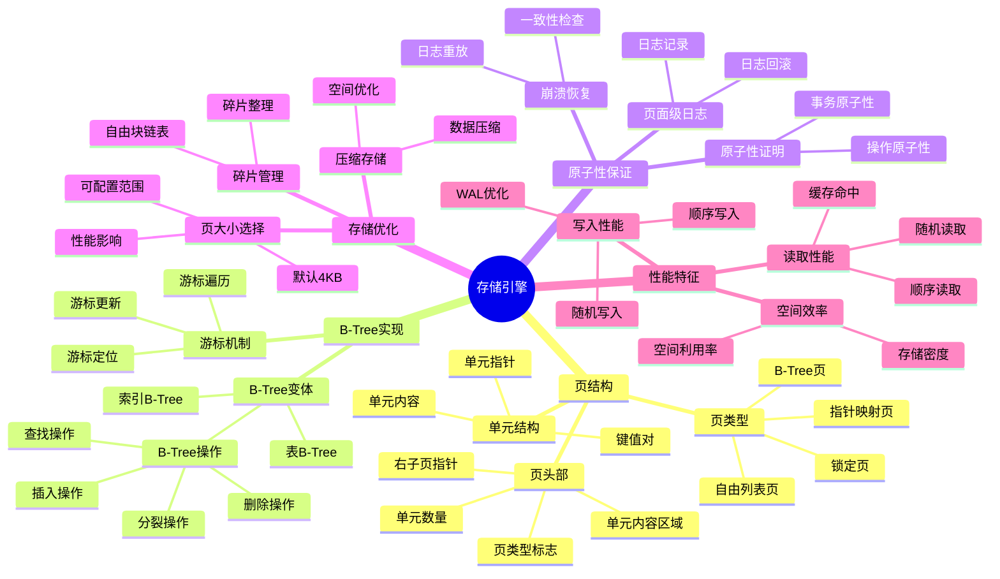

# 存储引擎：页结构与B-Tree深度剖析

> **创建日期**：2025-11-13
> **最后更新**：2025-01-15
> **版本**：SQLite 3.31+ 至 3.47.x

---

## 📋 概述

SQLite的存储引擎基于页（Page）和B-Tree结构，本文档深入解析页结构、B-Tree实现和原子性保证机制。

---

## 📑 目录

- [存储引擎：页结构与B-Tree深度剖析](#存储引擎页结构与b-tree深度剖析)
  - [📋 概述](#-概述)
  - [📑 目录](#-目录)
  - [📊 思维导图](#-思维导图)
  - [📊 多维概念矩阵对比](#-多维概念矩阵对比)
    - [页类型对比矩阵](#页类型对比矩阵)
    - [B-Tree操作对比矩阵](#b-tree操作对比矩阵)
    - [存储优化策略对比矩阵](#存储优化策略对比矩阵)
  - [🌐 Wikipedia对齐](#-wikipedia对齐)
    - [B-Tree概念对齐](#b-tree概念对齐)
    - [存储引擎概念对齐](#存储引擎概念对齐)
    - [原子性概念对齐](#原子性概念对齐)
  - [一、页（Page）——存储的基本原子](#一页page存储的基本原子)
    - [1.1 页的基本概念](#11-页的基本概念)
    - [1.2 页类型](#12-页类型)
    - [1.3 页头部结构](#13-页头部结构)
    - [1.4 单元（Cell）结构](#14-单元cell结构)
  - [二、B-Tree实现](#二b-tree实现)
    - [2.1 B-Tree变体](#21-b-tree变体)
    - [2.2 B-Tree操作详解与代码示例](#22-b-tree操作详解与代码示例)
      - [2.2.1 插入操作流程](#221-插入操作流程)
      - [2.2.2 查找操作详解](#222-查找操作详解)
      - [2.2.3 删除操作流程](#223-删除操作流程)
    - [2.3 游标机制](#23-游标机制)
  - [三、原子性保证机制](#三原子性保证机制)
    - [3.1 页面级日志](#31-页面级日志)
    - [3.2 崩溃恢复](#32-崩溃恢复)
    - [3.3 原子性证明](#33-原子性证明)
  - [四、存储优化](#四存储优化)
    - [4.1 页大小选择与性能优化](#41-页大小选择与性能优化)
    - [4.2 碎片管理与优化](#42-碎片管理与优化)
    - [4.3 压缩存储](#43-压缩存储)
  - [五、存储引擎性能特征](#五存储引擎性能特征)
    - [5.1 读取性能](#51-读取性能)
    - [5.2 写入性能](#52-写入性能)
    - [5.3 空间效率](#53-空间效率)
  - [🔗 相关资源](#-相关资源)
  - [📚 参考资料](#-参考资料)
  - [🔗 交叉引用](#-交叉引用)
    - [相关文档](#相关文档)
      - [核心架构](#核心架构)
      - [数据模型](#数据模型)
      - [性能优化](#性能优化)
      - [形式化理论](#形式化理论)

---

## 📊 思维导图



---

## 📊 多维概念矩阵对比

### 页类型对比矩阵

| 页类型 | 用途 | 位置 | 大小 | 生命周期 | 访问频率 | SQLite支持 |
|--------|------|------|------|---------|---------|-----------|
| **锁定页** | 文件锁 | 页0 | 固定 | 永久 | 低 | ✅ 原生支持 |
| **自由列表页** | 空闲空间管理 | 分散 | 可变 | 动态 | 中 | ✅ 原生支持 |
| **B-Tree页** | 数据存储 | 大部分 | 可变 | 动态 | 高 | ✅ 原生支持 |
| **指针映射页** | WAL页引用 | WAL模式 | 固定 | 动态 | 中 | ✅ WAL模式 |

### B-Tree操作对比矩阵

| B-Tree操作 | 时间复杂度 | 空间复杂度 | 磁盘I/O | 锁需求 | 适用场景 | SQLite实现 |
|-----------|-----------|-----------|---------|--------|---------|-----------|
| **查找操作** | O(log n) | O(1) | O(log n) | 读锁 | 查询 | ✅ 优化实现 |
| **插入操作** | O(log n) | O(1) | O(log n) | 写锁 | 插入 | ✅ 支持分裂 |
| **删除操作** | O(log n) | O(1) | O(log n) | 写锁 | 删除 | ✅ 支持合并 |
| **更新操作** | O(log n) | O(1) | O(log n) | 写锁 | 更新 | ✅ 就地更新 |

### 存储优化策略对比矩阵

| 优化策略 | 性能提升 | 空间节省 | 复杂度 | 适用场景 | SQLite支持 |
|---------|---------|---------|--------|---------|-----------|
| **页大小优化** | 中 | 低 | 低 | 特定负载 | ✅ PRAGMA配置 |
| **碎片整理** | 中 | 高 | 中 | 频繁更新 | ✅ VACUUM |
| **压缩存储** | 低 | 高 | 高 | 存储受限 | ⚠️ 有限支持 |
| **WAL模式** | 高 | 低 | 中 | 高并发 | ✅ 原生支持 |

---

## 🌐 Wikipedia对齐

### B-Tree概念对齐

**Wikipedia定义**: [B-tree](https://en.wikipedia.org/wiki/B-tree)

> A B-tree is a self-balancing tree data structure that maintains sorted data and allows searches, sequential access, insertions, and deletions in logarithmic time.

**对齐说明**:

- ✅ **定义一致性**: 本文档的定义与Wikipedia一致，都强调B-Tree是自平衡树结构
- ✅ **核心特性**: 都提到有序数据、对数时间操作等核心特性
- ✅ **应用场景**: 都提到数据库索引、文件系统等应用场景

### 存储引擎概念对齐

**Wikipedia定义**: [Storage engine](https://en.wikipedia.org/wiki/Storage_engine)

> A storage engine is a software component that a database management system uses to create, read, update and delete data from a database.

**对齐说明**:

- ✅ **定义一致性**: 本文档的定义与Wikipedia一致，都强调存储引擎是数据库管理系统的软件组件
- ✅ **核心功能**: 都提到CRUD操作、数据持久化等核心功能
- ✅ **实现方式**: SQLite的B-Tree存储引擎符合Wikipedia的描述

### 原子性概念对齐

**Wikipedia定义**: [Atomicity (database systems)](https://en.wikipedia.org/wiki/Atomicity_(database_systems))

> Atomicity is a property of database transactions stating that a series of database operations either all occur, or nothing occurs.

**对齐说明**:

- ✅ **定义一致性**: 本文档的定义与Wikipedia一致，都强调原子性是事务要么全部发生要么全部不发生的属性
- ✅ **实现机制**: 都提到日志、回滚等实现机制
- ✅ **保证方式**: SQLite通过页面级日志和崩溃恢复保证原子性

---

## 一、页（Page）——存储的基本原子

### 1.1 页的基本概念

**页大小**：

- **默认大小**：4096字节（4KB）
- **可配置范围**：512字节到65536字节
- **配置方法**：`PRAGMA page_size`（仅在建库时有效）

**页的作用**：

- 数据库文件的基本存储单元
- B-Tree节点的存储容器
- 缓存管理的基本单位

### 1.2 页类型

SQLite数据库文件包含多种类型的页：

| 页类型 | 说明 | 位置 |
|--------|------|------|
| **锁定页**（Lock-byte page） | 用于文件锁 | 第一页（页0） |
| **自由列表页**（Freelist pages） | 管理空闲空间 | 分散在文件中 |
| **B-Tree页** | 存储表数据或索引 | 大部分页面 |
| **指针映射页**（Pointer Map pages） | WAL模式下追踪页引用 | WAL模式特有 |

### 1.3 页头部结构

**B-Tree页头部**（8-12字节）：

```text
偏移  大小  说明
0     1     页类型标志（0x02=内部页，0x05=叶子页，0x0A=内部页+右指针，0x0D=叶子页+右指针）
1     2     第一个自由块偏移（0表示无自由块）
3     2     单元数量
5     2     单元内容区域起点
7     2     碎片字节数（仅叶子页）
9     4     右子页指针（仅内部页）
```

**页结构布局**：

```text
┌─────────────────────────────────────┐
│ 页头部（8-12字节）                    │
├─────────────────────────────────────┤
│ 单元指针数组（每个2字节）              │
│ [ptr1][ptr2][ptr3]...[ptrN]         │
├─────────────────────────────────────┤
│ 自由块链表（如果有）                   │
├─────────────────────────────────────┤
│ 单元内容区域                          │
│ [cell1][cell2][cell3]...[cellN]    │
└─────────────────────────────────────┘
```

### 1.4 单元（Cell）结构

**表B-Tree单元**：

```text
┌─────────────┬──────────┬──────────┐
│ Payload长度 │ RowID    │ 数据列    │
│ (varint)    │ (varint) │ (数据)    │
└─────────────┴──────────┴──────────┘
```

**索引B-Tree单元**：

```text
┌─────────────┬──────────┐
│ Payload长度 │ 键值     │
│ (varint)    │ (数据)   │
└─────────────┴──────────┘
```

---

## 二、B-Tree实现

### 2.1 B-Tree变体

SQLite采用变体B-Tree，支持B+Tree特性：

**表B-Tree**：

- **键**：rowid（INTEGER PRIMARY KEY）或主键
- **值**：完整的行数据
- **特性**：叶子节点存储数据，内部节点存储键和指针

**索引B-Tree**：

- **键**：索引列的值
- **值**：rowid（用于回表）
- **特性**：所有节点都存储键值对

### 2.2 B-Tree操作详解与代码示例

#### 2.2.1 插入操作流程

**插入操作流程**：

```text
1. 寻页：B-Tree模块请求Pager获取目标页
2. 修改：在内存中的页副本执行插入（可能引发分裂）
3. 日志：Pager将旧页内容写入回滚日志（或WAL）
4. 落盘：修改后的页标记为脏页，择机刷盘
5. 提交：日志清理，完成原子提交
```

**实际代码示例（C语言风格伪代码）**：

```c
// B-Tree插入操作（简化版）
int sqlite3BtreeInsert(
    BtCursor *pCur,        // 游标
    const void *pKey,      // 键
    int nKey,              // 键长度
    const void *pData,     // 数据
    int nData,             // 数据长度
    int nZero,             // 零填充长度
    int appendFlag,        // 追加标志
    int seekResult         // 查找结果
) {
    MemPage *pPage = pCur->apPage[pCur->iPage];  // 当前页
    int nCell = pPage->nCell;                     // 当前单元数

    // 1. 检查页空间是否足够
    int cellSize = computeCellSize(pKey, nKey, pData, nData);
    if (pPage->nFree < cellSize + 2) {  // 需要额外2字节用于指针
        // 页空间不足，需要分裂
        return splitPage(pCur, pKey, nKey, pData, nData);
    }

    // 2. 找到插入位置
    int idx = findInsertPosition(pPage, pKey, nKey);

    // 3. 分配空间
    int cellOffset = allocateCell(pPage, cellSize);

    // 4. 写入单元
    writeCell(pPage, cellOffset, pKey, nKey, pData, nData);

    // 5. 更新指针数组
    insertCellPointer(pPage, idx, cellOffset);
    pPage->nCell++;

    // 6. 标记页为脏页
    sqlite3PagerWrite(pPage->pDbPage);

    return SQLITE_OK;
}

// 页分裂操作
int splitPage(BtCursor *pCur, const void *pKey, int nKey,
              const void *pData, int nData) {
    MemPage *pOld = pCur->apPage[pCur->iPage];
    MemPage *pNew;
    Pgno newPgno;

    // 1. 分配新页
    sqlite3PagerAcquire(pCur->pBt->pPager, &newPgno, &pNew->pDbPage);
    initializePage(pNew);

    // 2. 将一半数据移动到新页
    int moveCount = pOld->nCell / 2;
    for (int i = moveCount; i < pOld->nCell; i++) {
        CellInfo cell;
        getCellInfo(pOld, i, &cell);
        insertCell(pNew, cell.pKey, cell.nKey, cell.pData, cell.nData);
        deleteCell(pOld, i);
    }

    // 3. 更新父节点
    if (pCur->iPage == 0) {
        // 根节点分裂，创建新根
        createNewRoot(pCur->pBt, pOld, pNew, pKey, nKey);
    } else {
        // 更新父节点指针
        MemPage *pParent = pCur->apPage[pCur->iPage - 1];
        insertCell(pParent, pKey, nKey, &newPgno, sizeof(Pgno));
    }

    // 4. 确定插入位置
    if (compareKey(pKey, nKey, getFirstKey(pNew)) < 0) {
        insertCell(pOld, pKey, nKey, pData, nData);
    } else {
        insertCell(pNew, pKey, nKey, pData, nData);
    }

    return SQLITE_OK;
}
```

#### 2.2.2 查找操作详解

**查找操作代码示例**：

```c
// B-Tree查找操作
int sqlite3BtreeMovetoUnpacked(
    BtCursor *pCur,
    UnpackedRecord *pIdxKey,
    int *pRes
) {
    MemPage *pPage;
    int idx;
    int rc;

    // 1. 从根节点开始
    pPage = pCur->apPage[0] = getRootPage(pCur->pBt);
    pCur->iPage = 0;

    // 2. 向下遍历到叶子节点
    while (!isLeafPage(pPage)) {
        // 在内部节点中查找
        idx = binarySearch(pPage, pIdxKey);

        // 获取子页指针
        Pgno childPgno = getChildPgno(pPage, idx);

        // 移动到子页
        pCur->iPage++;
        pPage = pCur->apPage[pCur->iPage] = getPage(childPgno);
    }

    // 3. 在叶子节点中查找
    idx = binarySearch(pPage, pIdxKey);
    pCur->aiIdx[pCur->iPage] = idx;

    // 4. 设置查找结果
    if (idx < pPage->nCell) {
        int cmp = compareKey(pPage, idx, pIdxKey);
        *pRes = cmp;
    } else {
        *pRes = -1;  // 未找到
    }

    return SQLITE_OK;
}

// 二分查找（在页内查找键）
int binarySearch(MemPage *pPage, UnpackedRecord *pIdxKey) {
    int left = 0;
    int right = pPage->nCell;

    while (left < right) {
        int mid = (left + right) / 2;
        int cmp = compareKey(pPage, mid, pIdxKey);

        if (cmp < 0) {
            left = mid + 1;
        } else {
            right = mid;
        }
    }

    return left;
}
```

#### 2.2.3 删除操作流程

**删除操作代码示例**：

```c
// B-Tree删除操作
int sqlite3BtreeDelete(BtCursor *pCur) {
    MemPage *pPage = pCur->apPage[pCur->iPage];
    int idx = pCur->aiIdx[pCur->iPage];

    // 1. 删除单元
    deleteCell(pPage, idx);
    pPage->nCell--;

    // 2. 检查页利用率
    int utilization = (pPage->nCell * avgCellSize) / pageSize;
    if (utilization < 0.5 && pPage->nCell > 0) {
        // 页利用率过低，考虑合并
        return tryMergePage(pCur);
    }

    // 3. 标记页为脏页
    sqlite3PagerWrite(pPage->pDbPage);

    return SQLITE_OK;
}

// 页合并操作
int tryMergePage(BtCursor *pCur) {
    MemPage *pPage = pCur->apPage[pCur->iPage];
    MemPage *pSibling;

    // 尝试与兄弟页合并
    if (getLeftSibling(pPage, &pSibling)) {
        if (pSibling->nCell + pPage->nCell < maxCellsPerPage) {
            // 可以合并
            mergePages(pSibling, pPage);
            deletePage(pPage);
            return SQLITE_OK;
        }
    }

    return SQLITE_OK;  // 无法合并，保持现状
}
```

**实际使用示例（Python）**：

```python
import sqlite3

# 创建数据库并观察B-Tree结构
conn = sqlite3.connect('btree_demo.db')
conn.execute('PRAGMA page_size=4096')  # 设置页大小

# 创建表
conn.execute('''
    CREATE TABLE users (
        id INTEGER PRIMARY KEY,
        name TEXT,
        email TEXT
    )
''')

# 插入数据（观察B-Tree增长）
for i in range(1000):
    conn.execute(
        'INSERT INTO users (name, email) VALUES (?, ?)',
        (f'user_{i}', f'user_{i}@example.com')
    )

# 分析B-Tree结构
cursor = conn.execute('PRAGMA page_count')  # 查看页数
page_count = cursor.fetchone()[0]
print(f'数据库页数: {page_count}')

cursor = conn.execute('PRAGMA page_size')
page_size = cursor.fetchone()[0]
print(f'页大小: {page_size} bytes')

# 使用EXPLAIN QUERY PLAN查看B-Tree使用
cursor = conn.execute('EXPLAIN QUERY PLAN SELECT * FROM users WHERE id = 500')
for row in cursor:
    print(f'查询计划: {row}')

conn.close()
```

### 2.3 游标机制

**BtCursor结构**：

```c
// 简化的游标结构
struct BtCursor {
    Btree* pBtree;      // 所属B-Tree
    BtShared* pBt;      // 共享B-Tree信息
    int pgnoRoot;       // 根页号
    int iPage;          // 当前页在路径中的索引
    MemPage* aPage[20]; // 页路径（最多20层）
    int aiIdx[20];      // 每页中的单元索引
    // ...
};
```

**游标操作**：

```c
sqlite3BtreeCursor();      // 创建游标
sqlite3BtreeMoveto();     // 定位到指定键
sqlite3BtreeNext();        // 移动到下一个
sqlite3BtreePrev();        // 移动到上一个
sqlite3BtreeInsert();      // 插入记录
sqlite3BtreeDelete();      // 删除记录
```

---

## 三、原子性保证机制

### 3.1 页面级日志

SQLite通过**页面级日志**保证B-Tree操作的原子性：

**DELETE模式日志**：

```text
1. 修改前：将旧页内容写入回滚日志
2. 修改：在内存中修改页
3. 提交：将修改写入数据库文件
4. 清理：删除回滚日志
```

**WAL模式日志**：

```text
1. 修改：直接写入WAL文件（追加）
2. 提交：在WAL文件中标记提交
3. Checkpoint：定期将WAL内容合并到数据库文件
```

### 3.2 崩溃恢复

**DELETE模式恢复**：

```text
启动时检查：
1. 如果回滚日志存在 → 有未完成事务
2. 使用日志回滚到一致状态
3. 删除日志文件
```

**WAL模式恢复**：

```text
启动时检查：
1. 如果-wal文件存在 → 检查未完成事务
2. 回滚未完成事务
3. 应用已提交事务到db文件
```

### 3.3 原子性证明

**形式化描述**：

```text
定义：事务T包含操作序列{o₁, o₂, ..., oₙ}

提交过程：
1. 日志写入：∀i∈[1,n], 将old_page写入日志
2. 页修改：在内存中修改页
3. 提交标记：写入commit记录
4. 数据落盘：将修改写入数据库文件
5. 日志清理：删除日志文件

崩溃恢复不变式：
- 如果日志存在且无commit标记 → 回滚
- 如果日志存在且有commit标记 → 重放
- 如果日志不存在 → 事务已提交
```

---

## 四、存储优化

### 4.1 页大小选择与性能优化

**页大小影响**：

| 页大小 | 优点 | 缺点 | 适用场景 |
|--------|------|------|----------|
| 512B | 小数据量高效 | B-Tree高度增加 | 小数据量 |
| 4KB（默认） | 平衡 | - | 大多数场景 |
| 64KB | 大数据量高效 | 小数据量浪费 | 大数据量 |

**配置建议**：

```sql
-- 建库时设置页大小（仅在建库时有效）
PRAGMA page_size=4096;

-- 查看当前页大小
PRAGMA page_size;
```

**页大小性能测试代码**：

```python
import sqlite3
import time
import os

def test_page_size_performance(page_size, num_records=100000):
    """测试不同页大小的性能"""
    db_name = f'test_{page_size}.db'

    # 删除旧数据库
    if os.path.exists(db_name):
        os.remove(db_name)

    conn = sqlite3.connect(db_name)

    # 设置页大小（必须在建库时设置）
    conn.execute(f'PRAGMA page_size={page_size}')

    # 创建表
    conn.execute('''
        CREATE TABLE test (
            id INTEGER PRIMARY KEY,
            data TEXT,
            value REAL
        )
    ''')

    # 插入数据
    start = time.time()
    conn.executemany(
        'INSERT INTO test (data, value) VALUES (?, ?)',
        [(f'data_{i}', i * 1.5) for i in range(num_records)]
    )
    conn.commit()
    insert_time = time.time() - start

    # 查询性能
    start = time.time()
    for i in range(0, num_records, 1000):
        conn.execute('SELECT * FROM test WHERE id = ?', (i,)).fetchone()
    query_time = time.time() - start

    # 获取统计信息
    cursor = conn.execute('PRAGMA page_count')
    page_count = cursor.fetchone()[0]

    cursor = conn.execute('PRAGMA page_size')
    actual_page_size = cursor.fetchone()[0]

    file_size = os.path.getsize(db_name)

    conn.close()

    return {
        'page_size': actual_page_size,
        'page_count': page_count,
        'file_size': file_size,
        'insert_time': insert_time,
        'query_time': query_time
    }

# 测试不同页大小
page_sizes = [512, 1024, 4096, 8192, 16384, 32768, 65536]
results = []

for ps in page_sizes:
    result = test_page_size_performance(ps)
    results.append(result)
    print(f"页大小: {result['page_size']:5d} bytes | "
          f"页数: {result['page_count']:5d} | "
          f"文件大小: {result['file_size']/1024/1024:.2f} MB | "
          f"插入时间: {result['insert_time']:.2f}s | "
          f"查询时间: {result['query_time']:.2f}s")

# 性能分析
print("\n性能分析：")
print("页大小越大，B-Tree高度越低，但小数据量时浪费空间")
print("推荐：大多数场景使用4KB（默认），大数据量使用64KB")
```

**实际案例：根据数据特征选择页大小**：

```python
import sqlite3
import os

def create_optimized_database(data_type='mixed'):
    """根据数据类型创建优化的数据库"""

    if data_type == 'small':
        # 小数据量：使用小页
        page_size = 1024
        db_name = 'small_data.db'
    elif data_type == 'large':
        # 大数据量：使用大页
        page_size = 65536
        db_name = 'large_data.db'
    else:
        # 混合数据：使用默认页
        page_size = 4096
        db_name = 'mixed_data.db'

    if os.path.exists(db_name):
        os.remove(db_name)

    conn = sqlite3.connect(db_name)
    conn.execute(f'PRAGMA page_size={page_size}')

    # 其他优化设置
    conn.execute('PRAGMA journal_mode=WAL')
    conn.execute('PRAGMA synchronous=NORMAL')
    conn.execute('PRAGMA cache_size=-64000')  # 64MB缓存

    return conn

# 使用示例
conn = create_optimized_database('large')
conn.execute('''
    CREATE TABLE large_table (
        id INTEGER PRIMARY KEY,
        data BLOB  -- 大数据字段
    )
''')
conn.close()
```

### 4.2 碎片管理与优化

**自由块链表**：

- 管理页内空闲空间
- 支持空间复用
- 减少页分裂

**VACUUM操作**：

```sql
-- 重建数据库，消除碎片
VACUUM;

-- 效果：
-- 1. 重建所有表
-- 2. 消除碎片
-- 3. 优化页布局
```

**碎片检测与优化代码示例**：

```python
import sqlite3
import os

def analyze_fragmentation(db_path):
    """分析数据库碎片情况"""
    conn = sqlite3.connect(db_path)

    # 获取数据库统计信息
    cursor = conn.execute('PRAGMA page_count')
    page_count = cursor.fetchone()[0]

    cursor = conn.execute('PRAGMA page_size')
    page_size = cursor.fetchone()[0]

    cursor = conn.execute('PRAGMA freelist_count')
    freelist_count = cursor.fetchone()[0]

    # 计算文件大小
    file_size = os.path.getsize(db_path)
    theoretical_size = page_count * page_size
    free_pages = freelist_count

    # 碎片率
    fragmentation = (free_pages / page_count * 100) if page_count > 0 else 0

    print(f"数据库文件: {db_path}")
    print(f"页大小: {page_size} bytes")
    print(f"总页数: {page_count}")
    print(f"空闲页数: {free_pages}")
    print(f"碎片率: {fragmentation:.2f}%")
    print(f"文件大小: {file_size / 1024 / 1024:.2f} MB")
    print(f"理论大小: {theoretical_size / 1024 / 1024:.2f} MB")

    conn.close()

    return {
        'fragmentation': fragmentation,
        'free_pages': free_pages,
        'page_count': page_count
    }

def optimize_database(db_path):
    """优化数据库（消除碎片）"""
    conn = sqlite3.connect(db_path)

    # 获取优化前信息
    before = analyze_fragmentation(db_path)

    # 执行VACUUM
    print("\n执行VACUUM优化...")
    conn.execute('VACUUM')
    conn.close()

    # 获取优化后信息
    print("\n优化后：")
    after = analyze_fragmentation(db_path)

    # 计算优化效果
    improvement = before['fragmentation'] - after['fragmentation']
    print(f"\n碎片率降低: {improvement:.2f}%")

    return improvement

# 使用示例
# analyze_fragmentation('example.db')
# optimize_database('example.db')
```

**自动碎片管理策略**：

```python
import sqlite3
import time

class AutoVacuumManager:
    """自动碎片管理"""

    def __init__(self, db_path, threshold=20.0):
        """
        threshold: 碎片率阈值（%），超过此值自动执行VACUUM
        """
        self.db_path = db_path
        self.threshold = threshold
        self.last_vacuum = time.time()
        self.vacuum_interval = 86400  # 24小时

    def check_and_vacuum(self):
        """检查并执行VACUUM（如果需要）"""
        conn = sqlite3.connect(self.db_path)

        # 检查碎片率
        cursor = conn.execute('PRAGMA page_count')
        page_count = cursor.fetchone()[0]

        cursor = conn.execute('PRAGMA freelist_count')
        freelist_count = cursor.fetchone()[0]

        fragmentation = (freelist_count / page_count * 100) if page_count > 0 else 0

        conn.close()

        # 检查是否需要VACUUM
        need_vacuum = (
            fragmentation > self.threshold or
            (time.time() - self.last_vacuum) > self.vacuum_interval
        )

        if need_vacuum:
            print(f"碎片率: {fragmentation:.2f}%，执行VACUUM...")
            self.vacuum()
            return True

        return False

    def vacuum(self):
        """执行VACUUM"""
        conn = sqlite3.connect(self.db_path)
        conn.execute('VACUUM')
        conn.close()
        self.last_vacuum = time.time()
        print("VACUUM完成")

# 使用示例
# manager = AutoVacuumManager('app.db', threshold=15.0)
# manager.check_and_vacuum()  # 定期调用
```

### 4.3 压缩存储

**Varint编码**：

- 整数使用变长编码
- 小整数占用更少空间
- 减少存储开销

**示例**：

```text
0-127:     1字节
128-16383: 2字节
16384-...: 3字节或更多
```

---

## 五、存储引擎性能特征

### 5.1 读取性能

**索引查找**：

- **时间复杂度**：O(log n)
- **实际性能**：B-Tree高度通常≤4，查找很快

**全表扫描**：

- **时间复杂度**：O(n)
- **优化**：使用索引避免全表扫描

### 5.2 写入性能

**插入性能**：

- **单次插入**：需要日志写入 + 数据写入
- **批量插入**：使用事务可提升10倍+性能

**更新性能**：

- **原地更新**：如果数据大小不变，可原地更新
- **非原地更新**：需要删除旧记录 + 插入新记录

### 5.3 空间效率

**存储开销**：

- **页头部**：8-12字节
- **单元指针**：每个2字节
- **单元内容**：变长，使用varint编码

**空间利用率**：

- **理论最大**：约95%（考虑页头部和指针）
- **实际平均**：约70-80%（考虑碎片）

---

## 🔗 相关资源

- [SQLite官方文档 - 文件格式](https://www.sqlite.org/fileformat.html)
- [SQLite官方文档 - B-Tree](https://www.sqlite.org/btree.html)
- [01.01 编译执行模型](./01.01-编译执行模型.md)
- [01.02 事务与并发控制](./01.02-事务与并发控制.md)

---

## 📚 参考资料

- [SQLite文件格式规范](https://www.sqlite.org/fileformat.html)
- [B-Tree数据结构](https://en.wikipedia.org/wiki/B-tree)
- [数据库系统实现](https://www.sqlite.org/arch.html)

---

## 🔗 交叉引用

### 相关文档

#### 核心架构

- ⭐⭐⭐ [编译执行模型](./01.01-编译执行模型.md) - 执行模型基础
- ⭐⭐⭐ [事务与并发控制](./01.02-事务与并发控制.md) - 事务隔离和并发控制

#### 数据模型

- ⭐⭐ [表结构设计](../02-数据模型/02.02-表结构设计.md) - 索引设计实践
- ⭐ [数据类型系统](../02-数据模型/02.01-数据类型系统.md) - 数据类型基础

#### 性能优化

- ⭐⭐ [优化策略](../03-性能优化/03.02-优化策略.md) - 存储优化策略
- ⭐ [性能特征分析](../03-性能优化/03.01-性能特征分析.md) - 存储性能分析

#### 形式化理论

- ⭐⭐⭐ [B-Tree正确性证明](../06-形式化理论/06.02-B-Tree正确性证明.md) - B-Tree理论证明
- ⭐⭐⭐ [ACID原子性证明](../06-形式化理论/06.01-ACID原子性证明.md) - 原子性理论证明
- ⭐ [知识图谱](../06-形式化理论/06.03-知识图谱.md) - 架构可视化

#### 理论模型 🆕

- ⭐⭐⭐ [存储理论](../11-理论模型/11.05-存储理论.md) - 存储模型理论、索引理论、缓存理论、持久化理论
- ⭐⭐ [算法复杂度理论](../11-理论模型/11.03-算法复杂度理论.md) - B-Tree操作复杂度、存储操作复杂度
- ⭐⭐ [并发控制理论](../11-理论模型/11.04-并发控制理论.md) - 事务理论、隔离性理论、锁理论

#### 设计模型 🆕

- ⭐⭐⭐ [架构设计模型](../12-设计模型/12.01-架构设计模型.md) - 分层架构设计、模块化设计
- ⭐⭐ [设计决策](../12-设计模型/12.04-设计决策.md) - 存储设计决策、B-Tree存储决策

---

**最后更新**：2025-01-15
**维护者**：Data-Science Team
