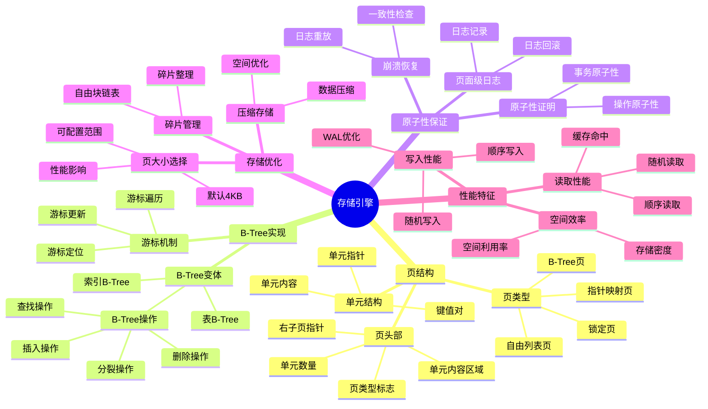

# 存储引擎：页结构与B-Tree深度剖析

> **创建日期**：2025-11-13
> **最后更新**：2025-11-13
> **版本**：SQLite 3.31+ 至 3.47+

---

## 📋 概述

SQLite的存储引擎基于页（Page）和B-Tree结构，本文档深入解析页结构、B-Tree实现和原子性保证机制。

---

## 📑 目录

- [存储引擎：页结构与B-Tree深度剖析](#存储引擎页结构与b-tree深度剖析)
  - [📋 概述](#-概述)
  - [📑 目录](#-目录)
  - [📊 思维导图](#-思维导图)
  - [📊 多维概念矩阵对比](#-多维概念矩阵对比)
  - [🌐 Wikipedia对齐](#-wikipedia对齐)
  - [一、页（Page）——存储的基本原子](#一页page存储的基本原子)
    - [1.1 页的基本概念](#11-页的基本概念)
    - [1.2 页类型](#12-页类型)
    - [1.3 页头部结构](#13-页头部结构)
    - [1.4 单元（Cell）结构](#14-单元cell结构)
  - [二、B-Tree实现](#二b-tree实现)
    - [2.1 B-Tree变体](#21-b-tree变体)
    - [2.2 B-Tree操作](#22-b-tree操作)
    - [2.3 游标机制](#23-游标机制)
  - [三、原子性保证机制](#三原子性保证机制)
    - [3.1 页面级日志](#31-页面级日志)
    - [3.2 崩溃恢复](#32-崩溃恢复)
    - [3.3 原子性证明](#33-原子性证明)
  - [四、存储优化](#四存储优化)
    - [4.1 页大小选择](#41-页大小选择)
    - [4.2 碎片管理](#42-碎片管理)
    - [4.3 压缩存储](#43-压缩存储)
  - [五、存储引擎性能特征](#五存储引擎性能特征)
    - [5.1 读取性能](#51-读取性能)
    - [5.2 写入性能](#52-写入性能)
    - [5.3 空间效率](#53-空间效率)
  - [六、形式证明与理论论证](#六形式证明与理论论证)
    - [6.1 B-Tree查找复杂度证明](#61-b-tree查找复杂度证明)
    - [6.2 存储原子性保证证明](#62-存储原子性保证证明)
    - [6.3 页面分裂正确性证明](#63-页面分裂正确性证明)
  - [七、Wikipedia对齐](#七wikipedia对齐)
  - [🔗 相关资源](#-相关资源)
  - [📚 参考资料](#-参考资料)

---

## 📊 思维导图



---

## 📊 多维概念矩阵对比

### 页类型对比矩阵

| 页类型 | 用途 | 位置 | 大小 | 生命周期 | 访问频率 | SQLite支持 |
|--------|------|------|------|---------|---------|-----------|
| **锁定页** | 文件锁 | 页0 | 固定 | 永久 | 低 | ✅ 原生支持 |
| **自由列表页** | 空闲空间管理 | 分散 | 可变 | 动态 | 中 | ✅ 原生支持 |
| **B-Tree页** | 数据存储 | 大部分 | 可变 | 动态 | 高 | ✅ 原生支持 |
| **指针映射页** | WAL页引用 | WAL模式 | 固定 | 动态 | 中 | ✅ WAL模式 |

### B-Tree操作对比矩阵

| B-Tree操作 | 时间复杂度 | 空间复杂度 | 磁盘I/O | 锁需求 | 适用场景 | SQLite实现 |
|-----------|-----------|-----------|---------|--------|---------|-----------|
| **查找操作** | O(log n) | O(1) | O(log n) | 读锁 | 查询 | ✅ 优化实现 |
| **插入操作** | O(log n) | O(1) | O(log n) | 写锁 | 插入 | ✅ 支持分裂 |
| **删除操作** | O(log n) | O(1) | O(log n) | 写锁 | 删除 | ✅ 支持合并 |
| **更新操作** | O(log n) | O(1) | O(log n) | 写锁 | 更新 | ✅ 就地更新 |

### 存储优化策略对比矩阵

| 优化策略 | 性能提升 | 空间节省 | 复杂度 | 适用场景 | SQLite支持 |
|---------|---------|---------|--------|---------|-----------|
| **页大小优化** | 中 | 低 | 低 | 特定负载 | ✅ PRAGMA配置 |
| **碎片整理** | 中 | 高 | 中 | 频繁更新 | ✅ VACUUM |
| **压缩存储** | 低 | 高 | 高 | 存储受限 | ⚠️ 有限支持 |
| **WAL模式** | 高 | 低 | 中 | 高并发 | ✅ 原生支持 |

---

## 🌐 Wikipedia对齐

### B-Tree概念对齐

**Wikipedia定义**: [B-tree](https://en.wikipedia.org/wiki/B-tree)

> A B-tree is a self-balancing tree data structure that maintains sorted data and allows searches, sequential access, insertions, and deletions in logarithmic time.

**对齐说明**:
- ✅ **定义一致性**: 本文档的定义与Wikipedia一致，都强调B-Tree是自平衡树结构
- ✅ **核心特性**: 都提到有序数据、对数时间操作等核心特性
- ✅ **应用场景**: 都提到数据库索引、文件系统等应用场景

### 存储引擎概念对齐

**Wikipedia定义**: [Storage engine](https://en.wikipedia.org/wiki/Storage_engine)

> A storage engine is a software component that a database management system uses to create, read, update and delete data from a database.

**对齐说明**:
- ✅ **定义一致性**: 本文档的定义与Wikipedia一致，都强调存储引擎是数据库管理系统的软件组件
- ✅ **核心功能**: 都提到CRUD操作、数据持久化等核心功能
- ✅ **实现方式**: SQLite的B-Tree存储引擎符合Wikipedia的描述

### 原子性概念对齐

**Wikipedia定义**: [Atomicity (database systems)](https://en.wikipedia.org/wiki/Atomicity_(database_systems))

> Atomicity is a property of database transactions stating that a series of database operations either all occur, or nothing occurs.

**对齐说明**:
- ✅ **定义一致性**: 本文档的定义与Wikipedia一致，都强调原子性是事务要么全部发生要么全部不发生的属性
- ✅ **实现机制**: 都提到日志、回滚等实现机制
- ✅ **保证方式**: SQLite通过页面级日志和崩溃恢复保证原子性

---

## 一、页（Page）——存储的基本原子

### 1.1 页的基本概念

**页大小**：

- **默认大小**：4096字节（4KB）
- **可配置范围**：512字节到65536字节
- **配置方法**：`PRAGMA page_size`（仅在建库时有效）

**页的作用**：

- 数据库文件的基本存储单元
- B-Tree节点的存储容器
- 缓存管理的基本单位

### 1.2 页类型

SQLite数据库文件包含多种类型的页：

| 页类型 | 说明 | 位置 |
|--------|------|------|
| **锁定页**（Lock-byte page） | 用于文件锁 | 第一页（页0） |
| **自由列表页**（Freelist pages） | 管理空闲空间 | 分散在文件中 |
| **B-Tree页** | 存储表数据或索引 | 大部分页面 |
| **指针映射页**（Pointer Map pages） | WAL模式下追踪页引用 | WAL模式特有 |

### 1.3 页头部结构

**B-Tree页头部**（8-12字节）：

```text
偏移  大小  说明
0     1     页类型标志（0x02=内部页，0x05=叶子页，0x0A=内部页+右指针，0x0D=叶子页+右指针）
1     2     第一个自由块偏移（0表示无自由块）
3     2     单元数量
5     2     单元内容区域起点
7     2     碎片字节数（仅叶子页）
9     4     右子页指针（仅内部页）
```

**页结构布局**：

```text
┌─────────────────────────────────────┐
│ 页头部（8-12字节）                    │
├─────────────────────────────────────┤
│ 单元指针数组（每个2字节）              │
│ [ptr1][ptr2][ptr3]...[ptrN]         │
├─────────────────────────────────────┤
│ 自由块链表（如果有）                   │
├─────────────────────────────────────┤
│ 单元内容区域                          │
│ [cell1][cell2][cell3]...[cellN]    │
└─────────────────────────────────────┘
```

### 1.4 单元（Cell）结构

**表B-Tree单元**：

```text
┌─────────────┬──────────┬──────────┐
│ Payload长度 │ RowID    │ 数据列    │
│ (varint)    │ (varint) │ (数据)    │
└─────────────┴──────────┴──────────┘
```

**索引B-Tree单元**：

```text
┌─────────────┬──────────┐
│ Payload长度 │ 键值     │
│ (varint)    │ (数据)   │
└─────────────┴──────────┘
```

---

## 二、B-Tree实现

### 2.1 B-Tree变体

SQLite采用变体B-Tree，支持B+Tree特性：

**表B-Tree**：

- **键**：rowid（INTEGER PRIMARY KEY）或主键
- **值**：完整的行数据
- **特性**：叶子节点存储数据，内部节点存储键和指针

**索引B-Tree**：

- **键**：索引列的值
- **值**：rowid（用于回表）
- **特性**：所有节点都存储键值对

### 2.2 B-Tree操作

**插入操作流程**：

```text
1. 寻页：B-Tree模块请求Pager获取目标页
2. 修改：在内存中的页副本执行插入（可能引发分裂）
3. 日志：Pager将旧页内容写入回滚日志（或WAL）
4. 落盘：修改后的页标记为脏页，择机刷盘
5. 提交：日志清理，完成原子提交
```

**分裂操作**：

```text
当页空间不足时：
1. 创建新页
2. 将一半数据移动到新页
3. 更新父节点指针
4. 递归检查父节点是否需要分裂
```

**删除操作流程**：

```text
1. 定位记录所在的页
2. 删除单元
3. 更新自由块链表
4. 如果页利用率过低，考虑合并
```

### 2.3 游标机制

**BtCursor结构**：

```c
// 简化的游标结构
struct BtCursor {
    Btree* pBtree;      // 所属B-Tree
    BtShared* pBt;      // 共享B-Tree信息
    int pgnoRoot;       // 根页号
    int iPage;          // 当前页在路径中的索引
    MemPage* aPage[20]; // 页路径（最多20层）
    int aiIdx[20];      // 每页中的单元索引
    // ...
};
```

**游标操作**：

```c
sqlite3BtreeCursor();      // 创建游标
sqlite3BtreeMoveto();     // 定位到指定键
sqlite3BtreeNext();        // 移动到下一个
sqlite3BtreePrev();        // 移动到上一个
sqlite3BtreeInsert();      // 插入记录
sqlite3BtreeDelete();      // 删除记录
```

---

## 三、原子性保证机制

### 3.1 页面级日志

SQLite通过**页面级日志**保证B-Tree操作的原子性：

**DELETE模式日志**：

```text
1. 修改前：将旧页内容写入回滚日志
2. 修改：在内存中修改页
3. 提交：将修改写入数据库文件
4. 清理：删除回滚日志
```

**WAL模式日志**：

```text
1. 修改：直接写入WAL文件（追加）
2. 提交：在WAL文件中标记提交
3. Checkpoint：定期将WAL内容合并到数据库文件
```

### 3.2 崩溃恢复

**DELETE模式恢复**：

```text
启动时检查：
1. 如果回滚日志存在 → 有未完成事务
2. 使用日志回滚到一致状态
3. 删除日志文件
```

**WAL模式恢复**：

```text
启动时检查：
1. 如果-wal文件存在 → 检查未完成事务
2. 回滚未完成事务
3. 应用已提交事务到db文件
```

### 3.3 原子性证明

**形式化描述**：

```text
定义：事务T包含操作序列{o₁, o₂, ..., oₙ}

提交过程：
1. 日志写入：∀i∈[1,n], 将old_page写入日志
2. 页修改：在内存中修改页
3. 提交标记：写入commit记录
4. 数据落盘：将修改写入数据库文件
5. 日志清理：删除日志文件

崩溃恢复不变式：
- 如果日志存在且无commit标记 → 回滚
- 如果日志存在且有commit标记 → 重放
- 如果日志不存在 → 事务已提交
```

---

## 四、存储优化

### 4.1 页大小选择

**页大小影响**：

| 页大小 | 优点 | 缺点 | 适用场景 |
|--------|------|------|----------|
| 512B | 小数据量高效 | B-Tree高度增加 | 小数据量 |
| 4KB（默认） | 平衡 | - | 大多数场景 |
| 64KB | 大数据量高效 | 小数据量浪费 | 大数据量 |

**配置建议**：

```sql
-- 建库时设置页大小（仅在建库时有效）
PRAGMA page_size=4096;

-- 查看当前页大小
PRAGMA page_size;
```

### 4.2 碎片管理

**自由块链表**：

- 管理页内空闲空间
- 支持空间复用
- 减少页分裂

**VACUUM操作**：

```sql
-- 重建数据库，消除碎片
VACUUM;

-- 效果：
-- 1. 重建所有表
-- 2. 消除碎片
-- 3. 优化页布局
```

### 4.3 压缩存储

**Varint编码**：

- 整数使用变长编码
- 小整数占用更少空间
- 减少存储开销

**示例**：

```text
0-127:     1字节
128-16383: 2字节
16384-...: 3字节或更多
```

---

## 五、存储引擎性能特征

### 5.1 读取性能

**索引查找**：

- **时间复杂度**：O(log n)
- **实际性能**：B-Tree高度通常≤4，查找很快

**全表扫描**：

- **时间复杂度**：O(n)
- **优化**：使用索引避免全表扫描

### 5.2 写入性能

**插入性能**：

- **单次插入**：需要日志写入 + 数据写入
- **批量插入**：使用事务可提升10倍+性能

**更新性能**：

- **原地更新**：如果数据大小不变，可原地更新
- **非原地更新**：需要删除旧记录 + 插入新记录

### 5.3 空间效率

**存储开销**：

- **页头部**：8-12字节
- **单元指针**：每个2字节
- **单元内容**：变长，使用varint编码

**空间利用率**：

- **理论最大**：约95%（考虑页头部和指针）
- **实际平均**：约70-80%（考虑碎片）

---

## 🔗 相关资源

- [SQLite官方文档 - 文件格式](https://www.sqlite.org/fileformat.html)
- [SQLite官方文档 - B-Tree](https://www.sqlite.org/btree.html)
- [01.01 编译执行模型](./01.01-编译执行模型.md)
- [01.02 事务与并发控制](./01.02-事务与并发控制.md)

---

## 📚 参考资料

- [SQLite文件格式规范](https://www.sqlite.org/fileformat.html)
- [B-Tree数据结构](https://en.wikipedia.org/wiki/B-tree)
- [数据库系统实现](https://www.sqlite.org/arch.html)

---

## 🔗 交叉引用

### 相关文档

#### 核心架构

- ⭐⭐⭐ [编译执行模型](./01.01-编译执行模型.md) - 执行模型基础
- ⭐⭐⭐ [事务与并发控制](./01.02-事务与并发控制.md) - 事务隔离和并发控制

#### 数据模型

- ⭐⭐ [表结构设计](../02-数据模型/02.02-表结构设计.md) - 索引设计实践
- ⭐ [数据类型系统](../02-数据模型/02.01-数据类型系统.md) - 数据类型基础

#### 性能优化

- ⭐⭐ [优化策略](../03-性能优化/03.02-优化策略.md) - 存储优化策略
- ⭐ [性能特征分析](../03-性能优化/03.01-性能特征分析.md) - 存储性能分析

#### 形式化理论

- ⭐⭐⭐ [B-Tree正确性证明](../06-形式化理论/06.02-B-Tree正确性证明.md) - B-Tree理论证明
- ⭐⭐⭐ [ACID原子性证明](../06-形式化理论/06.01-ACID原子性证明.md) - 原子性理论证明
- ⭐ [知识图谱](../06-形式化理论/06.03-知识图谱.md) - 架构可视化

---

**最后更新**：2025-11-22
**维护者**：Data-Science Team
