# 存储引擎：页结构与B-Tree深度剖析

> **创建日期**：2025-11-13
> **最后更新**：2025-01-15
> **版本**：SQLite 3.31+ 至 3.47.x

---

## 1. 📋 概述

SQLite的存储引擎基于页（Page）和B-Tree结构，本文档深入解析页结构、B-Tree实现和原子性保证机制。

---

## 2. 📑 目录

- [存储引擎：页结构与B-Tree深度剖析](#存储引擎页结构与b-tree深度剖析)
  - [1. 📋 概述](#1--概述)
  - [2. 📑 目录](#2--目录)
  - [3. 📊 思维导图](#3--思维导图)
  - [4. 📊 多维概念矩阵对比](#4--多维概念矩阵对比)
    - [4.1. 页类型对比矩阵](#41-页类型对比矩阵)
    - [4.2. B-Tree操作对比矩阵](#42-b-tree操作对比矩阵)
    - [4.3. 存储优化策略对比矩阵](#43-存储优化策略对比矩阵)
  - [5. 🌐 Wikipedia对齐](#5--wikipedia对齐)
    - [5.1. B-Tree概念对齐](#51-b-tree概念对齐)
    - [5.2. 存储引擎概念对齐](#52-存储引擎概念对齐)
    - [5.3. 原子性概念对齐](#53-原子性概念对齐)
  - [5.5. 形式化定义](#55-形式化定义)
    - [5.5.1. B-Tree结构形式化定义](#551-b-tree结构形式化定义)
    - [5.5.2. B-Tree操作形式化定义](#552-b-tree操作形式化定义)
    - [5.5.3. B-Tree插入形式化定义](#553-b-tree插入形式化定义)
    - [5.5.4. B-Tree删除形式化定义](#554-b-tree删除形式化定义)
    - [5.5.5. B-Tree高度形式化定义](#555-b-tree高度形式化定义)
    - [5.5.6. 形式化定理](#556-形式化定理)
    - [5.5.7. 形式化验证](#557-形式化验证)
  - [6. 页（Page）——存储的基本原子](#6-页page存储的基本原子)
    - [6.1. 页的基本概念](#61-页的基本概念)
    - [6.2. 页类型](#62-页类型)
    - [6.3. 页头部结构](#63-页头部结构)
    - [6.4. 单元（Cell）结构](#64-单元cell结构)
  - [7. B-Tree实现](#7-b-tree实现)
    - [7.1. B-Tree变体](#71-b-tree变体)
    - [7.2. B-Tree操作详解与代码示例](#72-b-tree操作详解与代码示例)
      - [7.2.1. 插入操作流程](#721-插入操作流程)
      - [7.2.2. 查找操作详解](#722-查找操作详解)
      - [7.2.3. 删除操作流程](#723-删除操作流程)
  - [7.3. B-Tree操作决策树](#73-b-tree操作决策树)
  - [7.4. B-Tree理论推导](#74-b-tree理论推导)
    - [7.4.1. B-Tree查找性能推导](#741-b-tree查找性能推导)
    - [7.4.2. B-Tree插入性能推导](#742-b-tree插入性能推导)
    - [7.4.3. B-Tree空间效率推导](#743-b-tree空间效率推导)
  - [8. 游标机制](#8-游标机制)
  - [9. 原子性保证机制](#9-原子性保证机制)
    - [9.1. 页面级日志](#91-页面级日志)
    - [9.2. 崩溃恢复](#92-崩溃恢复)
    - [9.3. 原子性证明](#93-原子性证明)
  - [10. 存储优化](#10-存储优化)
    - [10.1. 页大小选择与性能优化](#101-页大小选择与性能优化)
  - [11. 碎片管理与优化](#11-碎片管理与优化)
  - [12. 压缩存储](#12-压缩存储)
  - [13. 列存储架构分析](#13-列存储架构分析)
    - [13.1. 列存储概述](#131-列存储概述)
    - [13.2. SQLite的行存储架构](#132-sqlite的行存储架构)
    - [13.3. 列存储架构理论](#133-列存储架构理论)
    - [13.4. 行存储 vs 列存储对比](#134-行存储-vs-列存储对比)
      - [📊 存储架构选择决策树](#-存储架构选择决策树)
      - [📊 行存储 vs 列存储 vs 混合存储对比矩阵](#-行存储-vs-列存储-vs-混合存储对比矩阵)
      - [📊 SQLite列存储模拟架构图](#-sqlite列存储模拟架构图)
      - [📊 列存储模拟查询执行时序图](#-列存储模拟查询执行时序图)
    - [13.5. SQLite中的列存储模拟](#135-sqlite中的列存储模拟)
      - [📊 SQLite列存储模拟方案对比矩阵](#-sqlite列存储模拟方案对比矩阵)
    - [13.6. 列存储实现原理](#136-列存储实现原理)
      - [📊 SQLite列存储技术栈对比](#-sqlite列存储技术栈对比)
  - [14. 列压缩技术详解](#14-列压缩技术详解)
    - [14.1. 列压缩概述](#141-列压缩概述)
    - [14.2. 列压缩算法](#142-列压缩算法)
      - [14.2.1. 字典编码（Dictionary Encoding）](#1421-字典编码dictionary-encoding)
      - [14.2.2. 游程编码（Run-Length Encoding, RLE）](#1422-游程编码run-length-encoding-rle)
      - [14.2.3. 增量编码（Delta Encoding）](#1423-增量编码delta-encoding)
      - [14.2.4. 位图压缩（Bitmap Compression）](#1424-位图压缩bitmap-compression)
      - [14.2.5. 通用压缩算法](#1425-通用压缩算法)
    - [14.3. 列压缩性能分析](#143-列压缩性能分析)
    - [14.4. SQLite中的压缩实践](#144-sqlite中的压缩实践)
    - [14.5. 列压缩理论分析](#145-列压缩理论分析)
  - [14.6. 存储引擎论证脉络](#146-存储引擎论证脉络)
    - [14.6.1. 论证目标](#1461-论证目标)
    - [14.6.2. 论证链条](#1462-论证链条)
    - [14.6.3. 关键论证步骤](#1463-关键论证步骤)
    - [14.6.4. 正反例证明](#1464-正反例证明)
  - [15. 存储引擎性能特征](#15-存储引擎性能特征)
    - [15.1. 读取性能](#151-读取性能)
    - [15.2. 写入性能](#152-写入性能)
    - [15.3. 空间效率](#153-空间效率)
  - [19. 存储引擎概念层次关系图](#19-存储引擎概念层次关系图)
    - [19.1. B-Tree存储引擎概念层次图](#191-b-tree存储引擎概念层次图)
    - [19.2. 存储优化概念关系图](#192-存储优化概念关系图)
  - [16. 🔗 相关资源](#16--相关资源)
  - [17. 📚 参考资料](#17--参考资料)
  - [18. 🔗 交叉引用](#18--交叉引用)
    - [18.1. 相关文档](#181-相关文档)
      - [16.1.1. 核心架构](#1611-核心架构)
      - [16.1.2. 数据模型](#1612-数据模型)
      - [18.1.3. 性能优化](#1813-性能优化)
      - [18.1.4. 形式化理论](#1814-形式化理论)
      - [18.1.5. 理论模型 🆕](#1815-理论模型-)
      - [18.1.6. 设计模型 🆕](#1816-设计模型-)
      - [18.1.7. 导航与索引 🆕](#1817-导航与索引-)
    - [18.2. 相关概念链接 🆕](#182-相关概念链接-)
      - [18.2.1. 核心概念](#1821-核心概念)
      - [18.2.2. 定理依赖链](#1822-定理依赖链)

---

## 3. 📊 思维导图

```mermaid
mindmap
  root((存储引擎))
    页结构
      页类型
        锁定页
        自由列表页
        B-Tree页
        指针映射页
      页头部
        页类型标志
        单元数量
        单元内容区域
        右子页指针
      单元结构
        单元指针
        单元内容
        键值对
    B-Tree实现
      B-Tree变体
        表B-Tree
        索引B-Tree
       B-Tree操作
        插入操作
        删除操作
        查找操作
        分裂操作
      游标机制
        游标定位
        游标遍历
        游标更新
    原子性保证
      页面级日志
        日志记录
        日志回滚
      崩溃恢复
        日志重放
        一致性检查
      原子性证明
        事务原子性
        操作原子性
    存储优化
      页大小选择
        默认4KB
        可配置范围
        性能影响
      碎片管理
        自由块链表
        碎片整理
      压缩存储
        数据压缩
        空间优化
        列压缩技术
    列存储架构
      行存储模型
        SQLite行存储
        B-Tree页结构
        OLTP优势
      列存储模型
        列文件组织
        列扫描效率
        OLAP优势
      存储对比
        性能对比矩阵
        适用场景分析
      模拟实现
        垂直分区
        覆盖索引
        物化视图
    列压缩技术
      压缩算法
        字典编码
        游程编码
        增量编码
        位图压缩
        通用压缩
      压缩性能
        压缩率分析
        压缩成本
        压缩决策
      实践方案
        应用层压缩
        JSON压缩
        外部列存储
    性能特征
      读取性能
        顺序读取
        随机读取
        缓存命中
      写入性能
        顺序写入
        随机写入
        WAL优化
      空间效率
        存储密度
        空间利用率
```



---

## 4. 📊 多维概念矩阵对比

### 4.1. 页类型对比矩阵

| 页类型 | 用途 | 位置 | 大小 | 生命周期 | 访问频率 | SQLite支持 |
|--------|------|------|------|---------|---------|-----------|
| **锁定页** | 文件锁 | 页0 | 固定 | 永久 | 低 | ✅ 原生支持 |
| **自由列表页** | 空闲空间管理 | 分散 | 可变 | 动态 | 中 | ✅ 原生支持 |
| **B-Tree页** | 数据存储 | 大部分 | 可变 | 动态 | 高 | ✅ 原生支持 |
| **指针映射页** | WAL页引用 | WAL模式 | 固定 | 动态 | 中 | ✅ WAL模式 |

### 4.2. B-Tree操作对比矩阵

| B-Tree操作 | 时间复杂度 | 空间复杂度 | 磁盘I/O | 锁需求 | 适用场景 | SQLite实现 |
|-----------|-----------|-----------|---------|--------|---------|-----------|
| **查找操作** | O(log n) | O(1) | O(log n) | 读锁 | 查询 | ✅ 优化实现 |
| **插入操作** | O(log n) | O(1) | O(log n) | 写锁 | 插入 | ✅ 支持分裂 |
| **删除操作** | O(log n) | O(1) | O(log n) | 写锁 | 删除 | ✅ 支持合并 |
| **更新操作** | O(log n) | O(1) | O(log n) | 写锁 | 更新 | ✅ 就地更新 |

### 4.3. 存储优化策略对比矩阵

| 优化策略 | 性能提升 | 空间节省 | 复杂度 | 适用场景 | SQLite支持 |
|---------|---------|---------|--------|---------|-----------|
| **页大小优化** | 中 | 低 | 低 | 特定负载 | ✅ PRAGMA配置 |
| **碎片整理** | 中 | 高 | 中 | 频繁更新 | ✅ VACUUM |
| **压缩存储** | 低 | 高 | 高 | 存储受限 | ⚠️ 有限支持 |
| **WAL模式** | 高 | 低 | 中 | 高并发 | ✅ 原生支持 |

---

## 5. 🌐 Wikipedia对齐

### 5.1. B-Tree概念对齐

**Wikipedia定义**: [B-tree](https://en.wikipedia.org/wiki/B-tree)

> A B-tree is a self-balancing tree data structure that maintains sorted data and allows searches, sequential access, insertions, and deletions in logarithmic time.

**对齐说明**:

- ✅ **定义一致性**: 本文档的定义与Wikipedia一致，都强调B-Tree是自平衡树结构
- ✅ **核心特性**: 都提到有序数据、对数时间操作等核心特性
- ✅ **应用场景**: 都提到数据库索引、文件系统等应用场景

### 5.2. 存储引擎概念对齐

**Wikipedia定义**: [Storage engine](https://en.wikipedia.org/wiki/Storage_engine)

> A storage engine is a software component that a database management system uses to create, read, update and delete data from a database.

**对齐说明**:

- ✅ **定义一致性**: 本文档的定义与Wikipedia一致，都强调存储引擎是数据库管理系统的软件组件
- ✅ **核心功能**: 都提到CRUD操作、数据持久化等核心功能
- ✅ **实现方式**: SQLite的B-Tree存储引擎符合Wikipedia的描述

### 5.3. 原子性概念对齐

**Wikipedia定义**: [Atomicity (database systems)](https://en.wikipedia.org/wiki/Atomicity_(database_systems))

> Atomicity is a property of database transactions stating that a series of database operations either all occur, or nothing occurs.

**对齐说明**:

- ✅ **定义一致性**: 本文档的定义与Wikipedia一致，都强调原子性是事务要么全部发生要么全部不发生的属性
- ✅ **实现机制**: 都提到日志、回滚等实现机制
- ✅ **保证方式**: SQLite通过页面级日志和崩溃恢复保证原子性

---

## 5.5. 形式化定义

### 5.5.1. B-Tree结构形式化定义

```text
定义5.5.1 B-Tree（B-Tree Structure）
═══════════════════════════════════════════════════════════════

B-Tree T = (Nodes, Root, Order)
  其中:
  • Nodes: 节点集合
  • Root: 根节点
  • Order: B-Tree阶数（每个节点最多Order-1个键）

节点定义:
  Node N = (Keys, Children, Values, Type)
  其中:
    • Keys: 键集合 {k₁, k₂, ..., kₘ}，m ≤ Order-1
    • Children: 子节点指针集合 {c₁, c₂, ..., cₘ₊₁}
    • Values: 值集合 {v₁, v₂, ..., vₘ}（叶子节点）
    • Type: 节点类型 ∈ {INTERIOR, LEAF}

B-Tree性质:
  1. 所有叶子节点在同一层
  2. 每个节点最多有Order-1个键
  3. 根节点至少有1个键（除非树为空）
  4. 非根节点至少有⌈Order/2⌉-1个键
  5. 键按升序排列: ∀i: kᵢ < kᵢ₊₁

形式化表示:
  IsValidBTree(T) ⟺
    (AllLeavesSameLevel(T) ∧
     NodeKeyCountValid(T) ∧
     KeysOrdered(T) ∧
     RootExists(T))
```

### 5.5.2. B-Tree操作形式化定义

```text
定义5.5.2 B-Tree搜索（B-Tree Search）
═══════════════════════════════════════════════════════════════

Search(T, k): Tree × Key → Value
  Search(T, k) =
    if T.Root.Type = LEAF:
      return Value where Key = k in T.Root
    else:
      let child = FindChild(T.Root, k)
      return Search(child, k)

FindChild(node, k):
  if k < node.Keys[0]:
    return node.Children[0]
  else if k ≥ node.Keys[m-1]:
    return node.Children[m]
  else:
    return node.Children[i] where node.Keys[i-1] ≤ k < node.Keys[i]

搜索正确性:
  ∀T, ∀k: Search(T, k) = v ⟺ (k, v) ∈ T

时间复杂度:
  O(log_{Order}(n))，其中n是键的数量
```

### 5.5.3. B-Tree插入形式化定义

```text
定义5.5.3 B-Tree插入（B-Tree Insert）
═══════════════════════════════════════════════════════════════

Insert(T, k, v): Tree × Key × Value → Tree
  Insert(T, k, v) =
    if T.Root is full:
      SplitRoot(T)
    InsertIntoNode(T.Root, k, v)

InsertIntoNode(node, k, v):
  if node.Type = LEAF:
    InsertKeyValue(node, k, v)
    if node is full:
      SplitNode(node)
  else:
    let child = FindChild(node, k)
    InsertIntoNode(child, k, v)
    if child was split:
      InsertKeyIntoParent(node, child.middle_key)

SplitNode(node):
  middle = ⌊Order/2⌋
  new_node = CreateNode()
  new_node.Keys = node.Keys[middle+1:]
  new_node.Values = node.Values[middle+1:]
  node.Keys = node.Keys[:middle]
  node.Values = node.Values[:middle]
  return (node.Keys[middle], new_node)

插入正确性:
  Insert(T, k, v) = T' ⇒ (k, v) ∈ T' ∧ IsValidBTree(T')
```

### 5.5.4. B-Tree删除形式化定义

```text
定义5.5.4 B-Tree删除（B-Tree Delete）
═══════════════════════════════════════════════════════════════

Delete(T, k): Tree × Key → Tree
  Delete(T, k) =
    DeleteFromNode(T.Root, k)
    if T.Root has 0 keys and T.Root.Type = INTERIOR:
      T.Root = T.Root.Children[0]

DeleteFromNode(node, k):
  if node.Type = LEAF:
    RemoveKey(node, k)
    if node has < ⌈Order/2⌉-1 keys:
      MergeOrBorrow(node)
  else:
    let child = FindChild(node, k)
    DeleteFromNode(child, k)
    if child has < ⌈Order/2⌉-1 keys:
      MergeOrBorrow(child)

删除正确性:
  Delete(T, k) = T' ⇒ (k, v) ∉ T' ∧ IsValidBTree(T')
```

### 5.5.5. B-Tree高度形式化定义

```text
定义5.5.5 B-Tree高度（B-Tree Height）
═══════════════════════════════════════════════════════════════

高度定义:
  Height(T) = 从根到叶子的最长路径长度

高度定理:
  对于包含n个键的B-Tree，其高度h满足:
    h ≤ log_{⌈Order/2⌉}((n+1)/2) + 1

证明:
  设每个节点至少有⌈Order/2⌉-1个键，则:
  • 第0层（根）: 至少有1个键
  • 第1层: 至少有⌈Order/2⌉个节点，每个至少⌈Order/2⌉-1个键
  • 第h层: 至少有⌈Order/2⌉^h个键

  因此: n ≥ ⌈Order/2⌉^h - 1
  即: h ≤ log_{⌈Order/2⌉}(n+1) + 1
  ∎
```

### 5.5.6. 形式化定理

```text
定理5.5.1 B-Tree搜索正确性
═══════════════════════════════════════════════════════════════

∀T, ∀k: Search(T, k) = v ⟺ (k, v) ∈ T

证明（归纳法）:
  基础: 叶子节点，直接查找
  归纳: 内部节点，根据键值选择子树
  由B-Tree性质，键按顺序排列
  因此搜索正确
  ∎

定理5.5.2 B-Tree插入保持结构
═══════════════════════════════════════════════════════════════

Insert(T, k, v) = T' ⇒ IsValidBTree(T')

证明:
  1. 插入到叶子节点
  2. 如果节点未满，直接插入，保持结构
  3. 如果节点满，分裂后仍满足键数约束
  4. 分裂可能向上传播，但最终保持结构
  ∎

定理5.5.3 B-Tree平衡性
═══════════════════════════════════════════════════════════════

∀T: IsValidBTree(T) ⇒ Balanced(T)

证明:
  1. 由高度定理，高度有界
  2. 由插入删除操作，保持结构
  3. 因此B-Tree平衡
  ∎
```

### 5.5.7. 形式化验证

```text
不变式5.5.1 B-Tree结构不变式
═══════════════════════════════════════════════════════════════

∀T: IsValidBTree(T) ⇒
  (AllLeavesSameLevel(T) ∧
   NodeKeyCountValid(T) ∧
   KeysOrdered(T))

验证:
  1. 初始状态: 空树满足不变式
  2. 插入操作: 保持结构（由定理5.5.2）
  3. 删除操作: 保持结构
  4. 因此所有状态满足不变式
  ∎

不变式5.5.2 键顺序不变式
═══════════════════════════════════════════════════════════════

∀node: ∀i: node.Keys[i] < node.Keys[i+1]

验证:
  1. 插入时保持键顺序
  2. 删除时保持键顺序
  3. 分裂合并时保持键顺序
  4. 因此键顺序不变式成立
  ∎
```

---

## 6. 页（Page）——存储的基本原子

### 6.1. 页的基本概念

**页大小**：

- **默认大小**：4096字节（4KB）
- **可配置范围**：512字节到65536字节
- **配置方法**：`PRAGMA page_size`（仅在建库时有效）

**页的作用**：

- 数据库文件的基本存储单元
- B-Tree节点的存储容器
- 缓存管理的基本单位

### 6.2. 页类型

SQLite数据库文件包含多种类型的页：

| 页类型 | 说明 | 位置 |
|--------|------|------|
| **锁定页**（Lock-byte page） | 用于文件锁 | 第一页（页0） |
| **自由列表页**（Freelist pages） | 管理空闲空间 | 分散在文件中 |
| **B-Tree页** | 存储表数据或索引 | 大部分页面 |
| **指针映射页**（Pointer Map pages） | WAL模式下追踪页引用 | WAL模式特有 |

### 6.3. 页头部结构

**B-Tree页头部**（8-12字节）：

```text
偏移  大小  说明
0     1     页类型标志（0x02=内部页，0x05=叶子页，0x0A=内部页+右指针，0x0D=叶子页+右指针）
1     2     第一个自由块偏移（0表示无自由块）
3     2     单元数量
5     2     单元内容区域起点
7     2     碎片字节数（仅叶子页）
9     4     右子页指针（仅内部页）
```

**页结构布局**：

```text
┌─────────────────────────────────────┐
│ 页头部（8-12字节）                    │
├─────────────────────────────────────┤
│ 单元指针数组（每个2字节）              │
│ [ptr1][ptr2][ptr3]...[ptrN]         │
├─────────────────────────────────────┤
│ 自由块链表（如果有）                   │
├─────────────────────────────────────┤
│ 单元内容区域                          │
│ [cell1][cell2][cell3]...[cellN]    │
└─────────────────────────────────────┘
```

### 6.4. 单元（Cell）结构

**表B-Tree单元**：

```text
┌─────────────┬──────────┬──────────┐
│ Payload长度 │ RowID    │ 数据列    │
│ (varint)    │ (varint) │ (数据)    │
└─────────────┴──────────┴──────────┘
```

**索引B-Tree单元**：

```text
┌─────────────┬──────────┐
│ Payload长度 │ 键值     │
│ (varint)    │ (数据)   │
└─────────────┴──────────┘
```

---

## 7. B-Tree实现

### 7.1. B-Tree变体

SQLite采用变体B-Tree，支持B+Tree特性：

**表B-Tree**：

- **键**：rowid（INTEGER PRIMARY KEY）或主键
- **值**：完整的行数据
- **特性**：叶子节点存储数据，内部节点存储键和指针

**索引B-Tree**：

- **键**：索引列的值
- **值**：rowid（用于回表）
- **特性**：所有节点都存储键值对

### 7.2. B-Tree操作详解与代码示例

#### 7.2.1. 插入操作流程

**插入操作流程**：

```text
1. 寻页：B-Tree模块请求Pager获取目标页
2. 修改：在内存中的页副本执行插入（可能引发分裂）
3. 日志：Pager将旧页内容写入回滚日志（或WAL）
4. 落盘：修改后的页标记为脏页，择机刷盘
5. 提交：日志清理，完成原子提交
```

**实际代码示例（C语言风格伪代码）**：

```c
// B-Tree插入操作（简化版）
int sqlite3BtreeInsert(
    BtCursor *pCur,        // 游标
    const void *pKey,      // 键
    int nKey,              // 键长度
    const void *pData,     // 数据
    int nData,             // 数据长度
    int nZero,             // 零填充长度
    int appendFlag,        // 追加标志
    int seekResult         // 查找结果
) {
    MemPage *pPage = pCur->apPage[pCur->iPage];  // 当前页
    int nCell = pPage->nCell;                     // 当前单元数

    // 1. 检查页空间是否足够
    int cellSize = computeCellSize(pKey, nKey, pData, nData);
    if (pPage->nFree < cellSize + 2) {  // 需要额外2字节用于指针
        // 页空间不足，需要分裂
        return splitPage(pCur, pKey, nKey, pData, nData);
    }

    // 2. 找到插入位置
    int idx = findInsertPosition(pPage, pKey, nKey);

    // 3. 分配空间
    int cellOffset = allocateCell(pPage, cellSize);

    // 4. 写入单元
    writeCell(pPage, cellOffset, pKey, nKey, pData, nData);

    // 5. 更新指针数组
    insertCellPointer(pPage, idx, cellOffset);
    pPage->nCell++;

    // 6. 标记页为脏页
    sqlite3PagerWrite(pPage->pDbPage);

    return SQLITE_OK;
}

// 页分裂操作
int splitPage(BtCursor *pCur, const void *pKey, int nKey,
              const void *pData, int nData) {
    MemPage *pOld = pCur->apPage[pCur->iPage];
    MemPage *pNew;
    Pgno newPgno;

    // 1. 分配新页
    sqlite3PagerAcquire(pCur->pBt->pPager, &newPgno, &pNew->pDbPage);
    initializePage(pNew);

    // 2. 将一半数据移动到新页
    int moveCount = pOld->nCell / 2;
    for (int i = moveCount; i < pOld->nCell; i++) {
        CellInfo cell;
        getCellInfo(pOld, i, &cell);
        insertCell(pNew, cell.pKey, cell.nKey, cell.pData, cell.nData);
        deleteCell(pOld, i);
    }

    // 3. 更新父节点
    if (pCur->iPage == 0) {
        // 根节点分裂，创建新根
        createNewRoot(pCur->pBt, pOld, pNew, pKey, nKey);
    } else {
        // 更新父节点指针
        MemPage *pParent = pCur->apPage[pCur->iPage - 1];
        insertCell(pParent, pKey, nKey, &newPgno, sizeof(Pgno));
    }

    // 4. 确定插入位置
    if (compareKey(pKey, nKey, getFirstKey(pNew)) < 0) {
        insertCell(pOld, pKey, nKey, pData, nData);
    } else {
        insertCell(pNew, pKey, nKey, pData, nData);
    }

    return SQLITE_OK;
}
```

#### 7.2.2. 查找操作详解

**查找操作代码示例**：

```c
// B-Tree查找操作
int sqlite3BtreeMovetoUnpacked(
    BtCursor *pCur,
    UnpackedRecord *pIdxKey,
    int *pRes
) {
    MemPage *pPage;
    int idx;
    int rc;

    // 1. 从根节点开始
    pPage = pCur->apPage[0] = getRootPage(pCur->pBt);
    pCur->iPage = 0;

    // 2. 向下遍历到叶子节点
    while (!isLeafPage(pPage)) {
        // 在内部节点中查找
        idx = binarySearch(pPage, pIdxKey);

        // 获取子页指针
        Pgno childPgno = getChildPgno(pPage, idx);

        // 移动到子页
        pCur->iPage++;
        pPage = pCur->apPage[pCur->iPage] = getPage(childPgno);
    }

    // 3. 在叶子节点中查找
    idx = binarySearch(pPage, pIdxKey);
    pCur->aiIdx[pCur->iPage] = idx;

    // 4. 设置查找结果
    if (idx < pPage->nCell) {
        int cmp = compareKey(pPage, idx, pIdxKey);
        *pRes = cmp;
    } else {
        *pRes = -1;  // 未找到
    }

    return SQLITE_OK;
}

// 二分查找（在页内查找键）
int binarySearch(MemPage *pPage, UnpackedRecord *pIdxKey) {
    int left = 0;
    int right = pPage->nCell;

    while (left < right) {
        int mid = (left + right) / 2;
        int cmp = compareKey(pPage, mid, pIdxKey);

        if (cmp < 0) {
            left = mid + 1;
        } else {
            right = mid;
        }
    }

    return left;
}
```

#### 7.2.3. 删除操作流程

**删除操作代码示例**：

```c
// B-Tree删除操作
int sqlite3BtreeDelete(BtCursor *pCur) {
    MemPage *pPage = pCur->apPage[pCur->iPage];
    int idx = pCur->aiIdx[pCur->iPage];

    // 1. 删除单元
    deleteCell(pPage, idx);
    pPage->nCell--;

    // 2. 检查页利用率
    int utilization = (pPage->nCell * avgCellSize) / pageSize;
    if (utilization < 0.5 && pPage->nCell > 0) {
        // 页利用率过低，考虑合并
        return tryMergePage(pCur);
    }

    // 3. 标记页为脏页
    sqlite3PagerWrite(pPage->pDbPage);

    return SQLITE_OK;
}

// 页合并操作
int tryMergePage(BtCursor *pCur) {
    MemPage *pPage = pCur->apPage[pCur->iPage];
    MemPage *pSibling;

    // 尝试与兄弟页合并
    if (getLeftSibling(pPage, &pSibling)) {
        if (pSibling->nCell + pPage->nCell < maxCellsPerPage) {
            // 可以合并
            mergePages(pSibling, pPage);
            deletePage(pPage);
            return SQLITE_OK;
        }
    }

    return SQLITE_OK;  // 无法合并，保持现状
}
```

**实际使用示例（Python）**：

```python
import sqlite3

# 创建数据库并观察B-Tree结构
conn = sqlite3.connect('btree_demo.db')
conn.execute('PRAGMA page_size=4096')  # 设置页大小

# 创建表
conn.execute('''
    CREATE TABLE users (
        id INTEGER PRIMARY KEY,
        name TEXT,
        email TEXT
    )
''')

# 插入数据（观察B-Tree增长）
for i in range(1000):
    conn.execute(
        'INSERT INTO users (name, email) VALUES (?, ?)',
        (f'user_{i}', f'user_{i}@example.com')
    )

# 分析B-Tree结构
cursor = conn.execute('PRAGMA page_count')  # 查看页数
page_count = cursor.fetchone()[0]
print(f'数据库页数: {page_count}')

cursor = conn.execute('PRAGMA page_size')
page_size = cursor.fetchone()[0]
print(f'页大小: {page_size} bytes')

# 使用EXPLAIN QUERY PLAN查看B-Tree使用
cursor = conn.execute('EXPLAIN QUERY PLAN SELECT * FROM users WHERE id = 500')
for row in cursor:
    print(f'查询计划: {row}')

conn.close()
```

## 7.3. B-Tree操作决策树

```text
SQLite B-Tree操作决策树
══════════════════════════════════════════════════════════════════════════════

问题：如何选择B-Tree操作策略？
    │
    ├─ 操作类型？
    │   ├─ 查找操作 → 进入查找优化路径
    │   ├─ 插入操作 → 进入插入优化路径
    │   ├─ 删除操作 → 进入删除优化路径
    │   └─ 更新操作 → 进入更新优化路径
    │
    ├─ 查找优化路径
    │   ├─ 是否有索引？
    │   │   ├─ 否 → 创建索引（CREATE INDEX）
    │   │   └─ 是 → 检查索引选择性
    │   │
    │   ├─ 索引选择性是否高？
    │   │   ├─ 否 → 考虑部分索引或覆盖索引
    │   │   └─ 是 → 检查查询计划
    │   │
    │   ├─ 查询计划是否最优？
    │   │   ├─ 否 → 使用ANALYZE更新统计信息
    │   │   └─ 是 → 检查缓存命中率
    │   │
    │   └─ 缓存命中率是否高？
    │       ├─ 否 → 调整PRAGMA cache_size
    │       └─ 是 → 查找性能正常
    │
    ├─ 插入优化路径
    │   ├─ 是否批量插入？
    │   │   ├─ 是 → 使用事务批量插入
    │   │   └─ 否 → 检查索引数量
    │   │
    │   ├─ 索引数量是否过多？
    │   │   ├─ 是 → 评估索引必要性，删除冗余索引
    │   │   └─ 否 → 检查页大小
    │   │
    │   ├─ 页大小是否合适？
    │   │   ├─ 否 → 调整PRAGMA page_size（需重建数据库）
    │   │   └─ 是 → 检查WAL模式
    │   │
    │   └─ 是否使用WAL模式？
    │       ├─ 否 → 启用WAL模式（PRAGMA journal_mode=WAL）
    │       └─ 是 → 插入性能正常
    │
    ├─ 删除优化路径
    │   ├─ 是否批量删除？
    │   │   ├─ 是 → 使用事务批量删除
    │   │   └─ 否 → 检查碎片率
    │   │
    │   ├─ 碎片率是否过高？
    │   │   ├─ 是 → 运行VACUUM整理碎片
    │   │   └─ 否 → 检查页利用率
    │   │
    │   └─ 页利用率是否过低？
    │       ├─ 是 → 考虑合并操作或重建数据库
    │       └─ 否 → 删除性能正常
    │
    └─ 更新优化路径
        ├─ 是否更新索引列？
        │   ├─ 是 → 检查索引更新成本
        │   └─ 否 → 直接更新数据页
        │
        ├─ 索引更新成本是否高？
        │   ├─ 是 → 考虑延迟索引更新或删除索引
        │   └─ 否 → 检查WAL模式
        │
        └─ 是否使用WAL模式？
            ├─ 否 → 启用WAL模式
            └─ 是 → 更新性能正常

性能优化优先级:
1. 创建必要索引（查找性能最大收益）
2. 启用WAL模式（写入性能2-3倍提升）
3. 批量事务（减少I/O开销）
4. 调整页大小（适合数据特征）
5. 定期VACUUM（减少碎片）
```

---

## 7.4. B-Tree理论推导

### 7.4.1. B-Tree查找性能推导

**定理7.4.1 B-Tree查找时间复杂度**:

```text
对于B-Tree查找操作：
  时间复杂度: O(log_B(N))
  其中: B是分支因子，N是键数量

推导过程:
1. B-Tree高度定理:
   h ≤ log_B((N+1)/2) + 1
   其中h是树高度，B是最小分支因子

2. 查找路径长度:
   - 从根到叶子需要遍历h层
   - 每层需要O(log B)时间进行二分查找
   - 总时间: O(h × log B) = O(log_B(N))

3. 实际性能:
   - 对于B=100的B-Tree，100万条记录只需3-4次磁盘I/O
   - 对于B=1000的B-Tree，10亿条记录只需4-5次磁盘I/O
   ∎
```

### 7.4.2. B-Tree插入性能推导

**定理7.4.2 B-Tree插入时间复杂度**:

```text
对于B-Tree插入操作：
  平均时间复杂度: O(log_B(N))
  最坏时间复杂度: O(log_B(N))（分裂传播）

推导过程:
1. 查找插入位置:
   - 时间复杂度: O(log_B(N))（由定理7.4.1）

2. 插入到叶子节点:
   - 如果节点未满: O(1)
   - 如果节点满: 需要分裂，O(B)

3. 分裂传播:
   - 最坏情况: 分裂传播到根节点
   - 传播层数: O(log_B(N))
   - 总时间: O(log_B(N))

4. 实际性能:
   - 平均情况: 很少分裂，接近O(log_B(N))
   - 最坏情况: 分裂传播，O(log_B(N))
   ∎
```

### 7.4.3. B-Tree空间效率推导

**定理7.4.3 B-Tree空间利用率**:

```text
对于B-Tree存储：
  最小空间利用率: 50%（节点至少半满）
  平均空间利用率: 约69%（随机插入）

推导过程:
1. B-Tree节点约束:
   - 内部节点: 至少⌈B/2⌉个子节点
   - 叶子节点: 至少⌈(B-1)/2⌉个键
   - 因此最小利用率: 50%

2. 随机插入分析:
   - 节点满时分裂为两个半满节点
   - 后续插入填充节点
   - 平均利用率: 约69%（理论分析）

3. 实际空间效率:
   - SQLite默认页大小4KB
   - 实际利用率: 60-80%（取决于数据特征）
   ∎
```

---

## 8. 游标机制

**BtCursor结构**：

```c
// 简化的游标结构
struct BtCursor {
    Btree* pBtree;      // 所属B-Tree
    BtShared* pBt;      // 共享B-Tree信息
    int pgnoRoot;       // 根页号
    int iPage;          // 当前页在路径中的索引
    MemPage* aPage[20]; // 页路径（最多20层）
    int aiIdx[20];      // 每页中的单元索引
    // ...
};
```

**游标操作**：

```c
sqlite3BtreeCursor();      // 创建游标
sqlite3BtreeMoveto();     // 定位到指定键
sqlite3BtreeNext();        // 移动到下一个
sqlite3BtreePrev();        // 移动到上一个
sqlite3BtreeInsert();      // 插入记录
sqlite3BtreeDelete();      // 删除记录
```

---

## 9. 原子性保证机制

### 9.1. 页面级日志

SQLite通过**页面级日志**保证B-Tree操作的原子性：

**DELETE模式日志**：

```text
1. 修改前：将旧页内容写入回滚日志
2. 修改：在内存中修改页
3. 提交：将修改写入数据库文件
4. 清理：删除回滚日志
```

**WAL模式日志**：

```text
1. 修改：直接写入WAL文件（追加）
2. 提交：在WAL文件中标记提交
3. Checkpoint：定期将WAL内容合并到数据库文件
```

### 9.2. 崩溃恢复

**DELETE模式恢复**：

```text
启动时检查：
1. 如果回滚日志存在 → 有未完成事务
2. 使用日志回滚到一致状态
3. 删除日志文件
```

**WAL模式恢复**：

```text
启动时检查：
1. 如果-wal文件存在 → 检查未完成事务
2. 回滚未完成事务
3. 应用已提交事务到db文件
```

### 9.3. 原子性证明

**形式化描述**：

```text
定义：事务T包含操作序列{o₁, o₂, ..., oₙ}

提交过程：
1. 日志写入：∀i∈[1,n], 将old_page写入日志
2. 页修改：在内存中修改页
3. 提交标记：写入commit记录
4. 数据落盘：将修改写入数据库文件
5. 日志清理：删除日志文件

崩溃恢复不变式：
- 如果日志存在且无commit标记 → 回滚
- 如果日志存在且有commit标记 → 重放
- 如果日志不存在 → 事务已提交
```

---

## 10. 存储优化

### 10.1. 页大小选择与性能优化

**页大小影响**：

| 页大小 | 优点 | 缺点 | 适用场景 |
|--------|------|------|----------|
| 512B | 小数据量高效 | B-Tree高度增加 | 小数据量 |
| 4KB（默认） | 平衡 | - | 大多数场景 |
| 64KB | 大数据量高效 | 小数据量浪费 | 大数据量 |

**配置建议**：

```sql
-- 建库时设置页大小（仅在建库时有效）
PRAGMA page_size=4096;

-- 查看当前页大小
PRAGMA page_size;
```

**页大小性能测试代码**：

```python
import sqlite3
import time
import os

def test_page_size_performance(page_size, num_records=100000):
    """测试不同页大小的性能"""
    db_name = f'test_{page_size}.db'

# 删除旧数据库
    if os.path.exists(db_name):
        os.remove(db_name)

    conn = sqlite3.connect(db_name)

# 设置页大小（必须在建库时设置）
    conn.execute(f'PRAGMA page_size={page_size}')

# 创建表
    conn.execute('''
        CREATE TABLE test (
            id INTEGER PRIMARY KEY,
            data TEXT,
            value REAL
        )
    ''')

# 插入数据
    start = time.time()
    conn.executemany(
        'INSERT INTO test (data, value) VALUES (?, ?)',
        [(f'data_{i}', i * 1.5) for i in range(num_records)]
    )
    conn.commit()
    insert_time = time.time() - start

# 查询性能
    start = time.time()
    for i in range(0, num_records, 1000):
        conn.execute('SELECT * FROM test WHERE id = ?', (i,)).fetchone()
    query_time = time.time() - start

# 获取统计信息
    cursor = conn.execute('PRAGMA page_count')
    page_count = cursor.fetchone()[0]

    cursor = conn.execute('PRAGMA page_size')
    actual_page_size = cursor.fetchone()[0]

    file_size = os.path.getsize(db_name)

    conn.close()

    return {
        'page_size': actual_page_size,
        'page_count': page_count,
        'file_size': file_size,
        'insert_time': insert_time,
        'query_time': query_time
    }

# 测试不同页大小
page_sizes = [512, 1024, 4096, 8192, 16384, 32768, 65536]
results = []

for ps in page_sizes:
    result = test_page_size_performance(ps)
    results.append(result)
    print(f"页大小: {result['page_size']:5d} bytes | "
          f"页数: {result['page_count']:5d} | "
          f"文件大小: {result['file_size']/1024/1024:.2f} MB | "
          f"插入时间: {result['insert_time']:.2f}s | "
          f"查询时间: {result['query_time']:.2f}s")

# 性能分析
print("\n性能分析：")
print("页大小越大，B-Tree高度越低，但小数据量时浪费空间")
print("推荐：大多数场景使用4KB（默认），大数据量使用64KB")
```

**实际案例：根据数据特征选择页大小**：

```python
import sqlite3
import os

def create_optimized_database(data_type='mixed'):
    """根据数据类型创建优化的数据库"""

    if data_type == 'small':
# 小数据量：使用小页
        page_size = 1024
        db_name = 'small_data.db'
    elif data_type == 'large':
# 大数据量：使用大页
        page_size = 65536
        db_name = 'large_data.db'
    else:
# 混合数据：使用默认页
        page_size = 4096
        db_name = 'mixed_data.db'

    if os.path.exists(db_name):
        os.remove(db_name)

    conn = sqlite3.connect(db_name)
    conn.execute(f'PRAGMA page_size={page_size}')

# 其他优化设置
    conn.execute('PRAGMA journal_mode=WAL')
    conn.execute('PRAGMA synchronous=NORMAL')
    conn.execute('PRAGMA cache_size=-64000')  # 64MB缓存

    return conn

# 使用示例
conn = create_optimized_database('large')
conn.execute('''
    CREATE TABLE large_table (
        id INTEGER PRIMARY KEY,
        data BLOB  -- 大数据字段
    )
''')
conn.close()
```

## 11. 碎片管理与优化

**自由块链表**：

- 管理页内空闲空间
- 支持空间复用
- 减少页分裂

**VACUUM操作**：

```sql
-- 重建数据库，消除碎片
VACUUM;

-- 效果：
-- 1. 重建所有表
-- 2. 消除碎片
-- 3. 优化页布局
```

**碎片检测与优化代码示例**：

```python
import sqlite3
import os

def analyze_fragmentation(db_path):
    """分析数据库碎片情况"""
    conn = sqlite3.connect(db_path)

# 获取数据库统计信息
    cursor = conn.execute('PRAGMA page_count')
    page_count = cursor.fetchone()[0]

    cursor = conn.execute('PRAGMA page_size')
    page_size = cursor.fetchone()[0]

    cursor = conn.execute('PRAGMA freelist_count')
    freelist_count = cursor.fetchone()[0]

# 计算文件大小
    file_size = os.path.getsize(db_path)
    theoretical_size = page_count * page_size
    free_pages = freelist_count

# 碎片率
    fragmentation = (free_pages / page_count * 100) if page_count > 0 else 0

    print(f"数据库文件: {db_path}")
    print(f"页大小: {page_size} bytes")
    print(f"总页数: {page_count}")
    print(f"空闲页数: {free_pages}")
    print(f"碎片率: {fragmentation:.2f}%")
    print(f"文件大小: {file_size / 1024 / 1024:.2f} MB")
    print(f"理论大小: {theoretical_size / 1024 / 1024:.2f} MB")

    conn.close()

    return {
        'fragmentation': fragmentation,
        'free_pages': free_pages,
        'page_count': page_count
    }

def optimize_database(db_path):
    """优化数据库（消除碎片）"""
    conn = sqlite3.connect(db_path)

# 获取优化前信息
    before = analyze_fragmentation(db_path)

# 执行VACUUM
    print("\n执行VACUUM优化...")
    conn.execute('VACUUM')
    conn.close()

# 获取优化后信息
    print("\n优化后：")
    after = analyze_fragmentation(db_path)

# 计算优化效果
    improvement = before['fragmentation'] - after['fragmentation']
    print(f"\n碎片率降低: {improvement:.2f}%")

    return improvement

# 使用示例
# analyze_fragmentation('example.db')
# optimize_database('example.db')
```

**自动碎片管理策略**：

```python
import sqlite3
import time

class AutoVacuumManager:
    """自动碎片管理"""

    def __init__(self, db_path, threshold=20.0):
        """
        threshold: 碎片率阈值（%），超过此值自动执行VACUUM
        """
        self.db_path = db_path
        self.threshold = threshold
        self.last_vacuum = time.time()
        self.vacuum_interval = 86400  # 24小时

    def check_and_vacuum(self):
        """检查并执行VACUUM（如果需要）"""
        conn = sqlite3.connect(self.db_path)

# 检查碎片率
        cursor = conn.execute('PRAGMA page_count')
        page_count = cursor.fetchone()[0]

        cursor = conn.execute('PRAGMA freelist_count')
        freelist_count = cursor.fetchone()[0]

        fragmentation = (freelist_count / page_count * 100) if page_count > 0 else 0

        conn.close()

# 检查是否需要VACUUM
        need_vacuum = (
            fragmentation > self.threshold or
            (time.time() - self.last_vacuum) > self.vacuum_interval
        )

        if need_vacuum:
            print(f"碎片率: {fragmentation:.2f}%，执行VACUUM...")
            self.vacuum()
            return True

        return False

    def vacuum(self):
        """执行VACUUM"""
        conn = sqlite3.connect(self.db_path)
        conn.execute('VACUUM')
        conn.close()
        self.last_vacuum = time.time()
        print("VACUUM完成")

# 使用示例
# manager = AutoVacuumManager('app.db', threshold=15.0)
# manager.check_and_vacuum()  # 定期调用
```

## 12. 压缩存储

**Varint编码**：

- 整数使用变长编码
- 小整数占用更少空间
- 减少存储开销

**示例**：

```text
0-127:     1字节
128-16383: 2字节
16384-...: 3字节或更多
```

---

## 13. 列存储架构分析

### 13.1. 列存储概述

**列存储（Columnar Storage）**是一种数据存储方式，将数据按列而非按行组织存储。与SQLite使用的行存储（Row-Oriented Storage）形成对比。

**核心概念**：

```text
行存储（Row-Oriented）：
  Row₁: [col₁, col₂, col₃, ..., colₙ]
  Row₂: [col₁, col₂, col₃, ..., colₙ]
  Row₃: [col₁, col₂, col₃, ..., colₙ]

列存储（Column-Oriented）：
  Col₁: [val₁, val₂, val₃, ..., valₙ]
  Col₂: [val₁, val₂, val₃, ..., valₙ]
  Col₃: [val₁, val₂, val₃, ..., valₙ]
```

### 13.2. SQLite的行存储架构

**SQLite存储模型**：

SQLite采用**行存储架构**，每条记录（行）的所有列值连续存储在B-Tree页中：

```text
B-Tree页结构（行存储）：
  ┌─────────────────────────────────┐
  │ 页头部 (Header)                 │
  ├─────────────────────────────────┤
  │ 单元指针数组 (Cell Pointers)    │
  ├─────────────────────────────────┤
  │ 单元1: [id, name, age, email]   │ ← 完整行
  │ 单元2: [id, name, age, email]   │ ← 完整行
  │ 单元3: [id, name, age, email]   │ ← 完整行
  └─────────────────────────────────┘
```

**行存储优势**：

1. **事务性能**：单行更新只需修改一个单元
2. **点查询**：通过主键快速定位整行数据
3. **插入性能**：插入新行只需追加一个单元
4. **OLTP场景**：适合事务处理，读写混合负载

**行存储劣势**：

1. **列扫描**：查询单列需要读取整行数据
2. **压缩效率**：不同数据类型混合存储，压缩率低
3. **聚合查询**：需要扫描大量不相关列数据

### 13.3. 列存储架构理论

**列存储布局**：

```text
列存储文件结构：
  ┌─────────────────────────────────┐
  │ 列1数据块: [val₁, val₂, ..., valₙ] │
  ├─────────────────────────────────┤
  │ 列2数据块: [val₁, val₂, ..., valₙ] │
  ├─────────────────────────────────┤
  │ 列3数据块: [val₁, val₂, ..., valₙ] │
  └─────────────────────────────────┘
```

**列存储优势**：

1. **列扫描效率**：只读取需要的列，I/O减少
2. **压缩效率**：同列数据类型相同，压缩率高
3. **聚合查询**：适合SUM、AVG、COUNT等聚合操作
4. **向量化处理**：列数据可批量处理，SIMD优化

**列存储劣势**：

1. **点查询**：需要访问多列，性能较差
2. **更新性能**：更新一行需要修改多个列文件
3. **插入性能**：插入新行需要追加到所有列
4. **事务开销**：多列更新需要更多I/O

### 13.4. 行存储 vs 列存储对比

#### 📊 存储架构选择决策树

```mermaid
flowchart TD
    A[选择存储架构] --> B{查询模式}

    B -->|点查询为主<br/>SELECT * WHERE id = ?| C[SQLite行存储 ✅]
    B -->|分析查询为主<br/>SELECT col1, SUM col2 GROUP BY| D{数据量}
    B -->|混合场景<br/>点查询+分析查询| J[混合存储架构 ✅]

    D -->|< 100MB| E[SQLite行存储 ✅<br/>+ 索引优化]
    D -->|100MB - 1GB| F{更新频率}
    D -->|> 1GB| I[考虑列存储模拟<br/>或迁移到PostgreSQL/DuckDB]

    F -->|频繁更新| G[SQLite行存储 ✅<br/>+ 分区优化]
    F -->|只读/很少更新| H[列存储模拟方案 ✅<br/>垂直分区/物化视图]

    J --> J1[热数据: SQLite行存储<br/>最近数据]
    J --> J2[冷数据: 列存储模拟<br/>或外部列存储]

    style C fill:#90EE90
    style E fill:#90EE90
    style G fill:#90EE90
    style H fill:#87CEEB
    style I fill:#FFA500
    style J fill:#FFD700
    style J1 fill:#90EE90
    style J2 fill:#87CEEB
```



#### 📊 行存储 vs 列存储 vs 混合存储对比矩阵

| 维度 | 行存储（SQLite） | 列存储 | 混合存储 | 最佳选择 |
|------|----------------|--------|---------|---------|
| **点查询（单行）** | ⭐⭐⭐⭐⭐ | ⭐⭐ | ⭐⭐⭐⭐ | 行存储 |
| **列扫描（单列）** | ⭐⭐ | ⭐⭐⭐⭐⭐ | ⭐⭐⭐⭐ | 列存储 |
| **聚合查询** | ⭐⭐ | ⭐⭐⭐⭐⭐ | ⭐⭐⭐⭐ | 列存储 |
| **插入单行** | ⭐⭐⭐⭐⭐ | ⭐⭐ | ⭐⭐⭐ | 行存储 |
| **更新单行** | ⭐⭐⭐⭐⭐ | ⭐⭐ | ⭐⭐⭐ | 行存储 |
| **批量插入** | ⭐⭐⭐⭐ | ⭐⭐⭐ | ⭐⭐⭐ | 行存储略优 |
| **压缩率** | ⭐⭐ (10-30%) | ⭐⭐⭐⭐⭐ (70-90%) | ⭐⭐⭐⭐ (50-70%) | 列存储 |
| **OLTP负载** | ⭐⭐⭐⭐⭐ | ⭐⭐ | ⭐⭐⭐⭐ | 行存储 |
| **OLAP负载** | ⭐⭐ | ⭐⭐⭐⭐⭐ | ⭐⭐⭐⭐ | 列存储 |
| **存储成本** | ⭐⭐ | ⭐⭐⭐⭐⭐ | ⭐⭐⭐⭐ | 列存储 |
| **查询延迟** | ⭐⭐⭐⭐ (低) | ⭐⭐⭐ (中) | ⭐⭐⭐⭐ (低-中) | 行存储 |
| **吞吐量** | ⭐⭐⭐ (中) | ⭐⭐⭐⭐⭐ (高) | ⭐⭐⭐⭐ (中-高) | 列存储 |
| **维护复杂度** | ⭐⭐⭐⭐⭐ (低) | ⭐⭐⭐ (中) | ⭐⭐ (高) | 行存储 |
| **SQLite支持** | ✅ 原生支持 | ⚠️ 需模拟 | ⚠️ 需设计 | 行存储 |
| **适用场景** | OLTP、点查询、嵌入式 | OLAP、分析查询、数据仓库 | 混合负载 | - |

**适用场景分析**：

```text
行存储（SQLite）适合：
  - OLTP事务处理
  - 点查询和范围查询
  - 频繁的插入和更新
  - 小到中等规模数据
  - 嵌入式应用

列存储适合：
  - OLAP分析查询
  - 大规模数据仓库
  - 聚合和统计查询
  - 只读或读多写少场景
  - 大数据分析
```

#### 📊 SQLite列存储模拟架构图

```mermaid
graph TB
    subgraph "SQLite列存储模拟架构"
        A[应用层] --> B[SQLite查询引擎]
        B --> C{存储类型}

        C -->|行存储| D[SQLite B-Tree<br/>原生行存储]
        C -->|列存储模拟| E[列存储模拟层]

        D --> D1[表1: 完整行数据]
        D --> D2[表2: 完整行数据]

        E --> E1[方案1: 垂直分区]
        E --> E2[方案2: 列式物化视图]
        E --> E3[方案3: 列压缩存储]

        E1 --> F1[表_col1<br/>表_col2<br/>表_col3]
        E2 --> F2[物化视图<br/>按列组织]
        E3 --> F3[JSON压缩<br/>应用层压缩]
    end

    style D fill:#90EE90
    style E fill:#87CEEB
    style E1 fill:#87CEEB
    style E2 fill:#87CEEB
    style E3 fill:#87CEEB
```



#### 📊 列存储模拟查询执行时序图

```mermaid
sequenceDiagram
    participant Client
    participant SQLite
    participant ColumnarView
    participant ColumnTables
    participant Compression

    Client->>SQLite: SELECT col1, SUM(col2) GROUP BY col1
    SQLite->>SQLite: 识别列存储模拟表
    SQLite->>ColumnarView: 查询列存储视图

    ColumnarView->>ColumnTables: 读取col1列表
    ColumnTables->>Compression: 解压缩col1数据
    Compression-->>ColumnTables: 返回col1数据

    ColumnarView->>ColumnTables: 读取col2列表
    ColumnTables->>Compression: 解压缩col2数据
    Compression-->>ColumnTables: 返回col2数据

    ColumnarView->>ColumnarView: 执行GROUP BY和SUM聚合
    ColumnarView-->>SQLite: 返回聚合结果
    SQLite-->>Client: 返回最终结果

    Note over ColumnarView,ColumnTables: 只读取需要的列，I/O减少
    Note over Compression: 列压缩率50-70%
```



### 13.5. SQLite中的列存储模拟

**虽然SQLite原生不支持列存储，但可以通过设计模式模拟**：

**方案1：垂直分区（列分离）**：

```sql
-- 将宽表拆分为多个窄表
-- 原始表
CREATE TABLE users (
    id INTEGER PRIMARY KEY,
    name TEXT,
    email TEXT,
    age INTEGER,
    profile TEXT,  -- 大字段
    metadata TEXT  -- 大字段
);

-- 拆分为核心表和扩展表
CREATE TABLE users_core (
    id INTEGER PRIMARY KEY,
    name TEXT,
    email TEXT,
    age INTEGER
);

CREATE TABLE users_extended (
    id INTEGER PRIMARY KEY,
    profile TEXT,
    metadata TEXT,
    FOREIGN KEY (id) REFERENCES users_core(id)
);

-- 查询时只访问需要的表
SELECT id, name, email FROM users_core;  -- 只扫描核心列
```

**方案2：覆盖索引（Covering Index）**：

```sql
-- 创建覆盖索引，包含查询所需的所有列
CREATE INDEX idx_user_analytics ON users(id, name, email, age);

-- 查询时使用覆盖索引，避免回表
SELECT name, email, age
FROM users
WHERE id BETWEEN 1000 AND 2000;
-- 索引包含所有列，无需访问主表
```

**方案3：物化视图（Materialized View）**：

```sql
-- 为分析查询创建物化视图
CREATE TABLE user_stats AS
SELECT
    age,
    COUNT(*) as count,
    AVG(score) as avg_score
FROM users
GROUP BY age;

-- 分析查询直接使用物化视图
SELECT * FROM user_stats WHERE age > 30;
```

#### 📊 SQLite列存储模拟方案对比矩阵

| 方案 | 实现复杂度 | 查询性能 | 存储效率 | 维护成本 | 适用场景 | 推荐度 |
|------|-----------|---------|---------|---------|---------|--------|
| **垂直分区** | ⭐⭐⭐ | ⭐⭐⭐ | ⭐⭐⭐ | ⭐⭐⭐ | 宽表、列分离 | ⭐⭐⭐⭐ |
| **列式物化视图** | ⭐⭐⭐⭐ | ⭐⭐⭐⭐ | ⭐⭐⭐⭐ | ⭐⭐ | 分析查询、定期刷新 | ⭐⭐⭐⭐⭐ |
| **列压缩存储** | ⭐⭐⭐⭐ | ⭐⭐⭐ | ⭐⭐⭐⭐⭐ | ⭐⭐⭐ | 大字段、JSON数据 | ⭐⭐⭐⭐ |
| **外部列存储** | ⭐⭐⭐⭐⭐ | ⭐⭐⭐⭐⭐ | ⭐⭐⭐⭐⭐ | ⭐ | 大规模数据、PostgreSQL集成 | ⭐⭐⭐⭐⭐ |

**方案选择决策树**：

```mermaid
flowchart TD
    A[选择列存储模拟方案] --> B{数据规模}

    B -->|< 1GB| C{查询模式}
    B -->|1GB - 10GB| D{更新频率}
    B -->|> 10GB| E[考虑外部列存储<br/>PostgreSQL/DuckDB]

    C -->|分析查询为主| F[列式物化视图 ✅]
    C -->|宽表分离| G[垂直分区 ✅]

    D -->|只读/很少更新| H[列式物化视图 ✅]
    D -->|频繁更新| I[垂直分区 ✅]

    F --> F1[优势: 查询性能好<br/>劣势: 需要定期刷新]
    G --> G1[优势: 实现简单<br/>劣势: JOIN开销]
    H --> H1[优势: 性能+存储优化<br/>劣势: 维护复杂]
    I --> I1[优势: 更新灵活<br/>劣势: 查询需要JOIN]
    E --> E1[优势: 原生列存储<br/>劣势: 需要数据迁移]

    style F fill:#90EE90
    style G fill:#90EE90
    style H fill:#90EE90
    style I fill:#90EE90
    style E fill:#FFA500
```



### 13.6. 列存储实现原理

**列存储文件组织**：

```text
列存储文件结构：
  ColumnFile = {
    Header: {
      ColumnName: string
      DataType: type
      RowCount: integer
      CompressionType: enum
    }
    DataBlocks: [
      Block₁: [compressed_data]
      Block₂: [compressed_data]
      ...
    ]
    Index: {
      BlockOffsets: [offset₁, offset₂, ...]
      MinMaxValues: [(min₁, max₁), (min₂, max₂), ...]
    }
  }
```

**列存储查询流程**：

```text
列存储查询执行：
  1. 解析查询，确定需要的列
  2. 读取相关列文件
  3. 解压列数据块
  4. 应用过滤条件（列级过滤）
  5. 合并多列数据（如果需要）
  6. 返回结果集
```

#### 📊 SQLite列存储技术栈对比

**SQLite列存储模拟 vs 其他列存储数据库**：

| 维度 | SQLite列存储模拟 | PostgreSQL + cstore_fdw | DuckDB | ClickHouse | 推荐场景 |
|------|----------------|------------------------|--------|------------|---------|
| **类型** | 模拟方案 | 扩展 | 嵌入式 | 专用列存储 | - |
| **性能** | ⭐⭐⭐ | ⭐⭐⭐ | ⭐⭐⭐⭐ | ⭐⭐⭐⭐⭐ | - |
| **压缩率** | ⭐⭐⭐ (50-70%) | ⭐⭐⭐ (50-70%) | ⭐⭐⭐⭐ (60-80%) | ⭐⭐⭐⭐⭐ (70-90%) | - |
| **SQLite兼容** | ✅ 完全兼容 | ❌ 需迁移 | ❌ 需迁移 | ❌ 需迁移 | SQLite场景 |
| **实现复杂度** | ⭐⭐⭐ (中) | ⭐⭐⭐⭐ (中高) | ⭐⭐⭐ (中) | ⭐⭐⭐⭐ (中高) | - |
| **维护成本** | ⭐⭐⭐ (中) | ⭐⭐⭐ (中) | ⭐⭐⭐⭐ (低) | ⭐⭐⭐ (中) | - |
| **适用场景** | 小规模分析、SQLite生态 | 混合负载、已有PostgreSQL | 数据分析、BI工具 | OLAP、实时分析 | - |
| **数据规模** | < 10GB | 10GB - 1TB | < 100GB | > 1TB | - |

**技术选型建议**：

- **已有SQLite系统，小规模分析**：使用SQLite列存储模拟方案
- **需要原生列存储，中等规模**：考虑DuckDB（嵌入式，易集成）
- **大规模数据仓库**：考虑ClickHouse或PostgreSQL + cstore_fdw
- **混合负载，已有PostgreSQL**：使用PostgreSQL + cstore_fdw

---

## 14. 列压缩技术详解

### 14.1. 列压缩概述

**列压缩（Column Compression）**是列存储的核心优势之一。由于列存储中同一列的数据类型相同，数据分布相似，压缩效率远高于行存储。

**压缩原理**：

```text
列压缩优势：
  1. 数据类型一致：同一列数据类型相同，压缩算法针对性强
  2. 数据相似性：相邻值往往相似，压缩率高
  3. 批量处理：整列数据可批量压缩，效率高
  4. 向量化：压缩后的列数据可向量化处理
```

### 14.2. 列压缩算法

#### 14.2.1. 字典编码（Dictionary Encoding）

**原理**：将重复值映射到字典索引，用短整数代替长字符串。

```text
原始数据：
  ['Apple', 'Banana', 'Apple', 'Cherry', 'Apple', 'Banana']

字典编码：
  Dictionary: {0: 'Apple', 1: 'Banana', 2: 'Cherry'}
  Encoded: [0, 1, 0, 2, 0, 1]

压缩率：假设原始字符串平均10字节，编码后1字节
  原始大小：6 × 10 = 60字节
  编码大小：6 × 1 + 字典(30) = 36字节
  压缩率：40% (节省24字节)
```

**适用场景**：

- 低基数（Cardinality）列：重复值多
- 字符串列：文本数据
- 枚举类型：固定值集合

**形式化定义**：

```text
字典编码定义：
  DictionaryEncoding(Column) = (Dict, Encoded)

其中：
  Dict: 值到索引的映射 {value → index}
  Encoded: 编码后的索引序列 [index₁, index₂, ..., indexₙ]

压缩率：
  CompressionRatio = (OriginalSize - EncodedSize) / OriginalSize
```

#### 14.2.2. 游程编码（Run-Length Encoding, RLE）

**原理**：将连续相同值压缩为（值，长度）对。

```text
原始数据：
  [1, 1, 1, 2, 2, 3, 3, 3, 3, 3]

游程编码：
  [(1, 3), (2, 2), (3, 5)]

压缩率：
  原始大小：10 × 4字节 = 40字节
  编码大小：3 × 8字节 = 24字节
  压缩率：40% (节省16字节)
```

**适用场景**：

- 排序后的列：连续值相同
- 稀疏数据：大量重复值
- 时间序列：相同值连续出现

**形式化定义**：

```text
游程编码定义：
  RLE(Column) = [(value₁, length₁), (value₂, length₂), ...]

其中：
  valueᵢ: 重复的值
  lengthᵢ: 重复次数

压缩条件：
  CompressionEffective ⟺ Σ lengthᵢ < n
  (总游程数小于原始数据量)
```

#### 14.2.3. 增量编码（Delta Encoding）

**原理**：存储相邻值的差值而非绝对值。

```text
原始数据（排序后）：
  [100, 105, 107, 110, 115, 120]

增量编码：
  [100, +5, +2, +3, +5, +5]
  Base: 100
  Deltas: [5, 2, 3, 5, 5]

压缩率：
  原始大小：6 × 4字节 = 24字节
  编码大小：4 + 5 × 1字节 = 9字节（假设差值<128）
  压缩率：62.5% (节省15字节)
```

**适用场景**：

- 有序数值列：时间戳、ID序列
- 单调递增/递减数据
- 数值范围大但差值小

**形式化定义**：

```text
增量编码定义：
  DeltaEncoding(Column) = (base, [δ₁, δ₂, ..., δₙ₋₁])

其中：
  base = Column[0]
  δᵢ = Column[i+1] - Column[i]

压缩优势：
  VarInt(δᵢ) ≤ VarInt(Column[i+1])
  (差值通常小于绝对值)
```

#### 14.2.4. 位图压缩（Bitmap Compression）

**原理**：对于低基数布尔或枚举值，使用位图表示。

```text
原始数据（布尔列）：
  [true, false, true, true, false, true]

位图编码：
  Bitmap: 101101 (二进制)
  存储：1字节（6位 + 2位填充）

压缩率：
  原始大小：6 × 1字节 = 6字节（布尔值）
  编码大小：1字节
  压缩率：83.3% (节省5字节)
```

**适用场景**：

- 布尔列：true/false
- 低基数枚举：2-8个值
- 稀疏位图：大量0，少量1

#### 14.2.5. 通用压缩算法

**在列级压缩基础上，可进一步应用通用压缩**：

```text
压缩层次：
  1. 列级压缩（字典、RLE、增量等）
  2. 通用压缩（LZ4、Zstd、Snappy等）

压缩流程：
  Original → ColumnCompress → GeneralCompress → Storage
```

**压缩算法对比**：

| 压缩算法 | 压缩率 | 压缩速度 | 解压速度 | 适用场景 |
|---------|--------|---------|---------|---------|
| **LZ4** | ⭐⭐⭐ | ⭐⭐⭐⭐⭐ | ⭐⭐⭐⭐⭐ | 实时查询 |
| **Zstd** | ⭐⭐⭐⭐⭐ | ⭐⭐⭐⭐ | ⭐⭐⭐⭐⭐ | 平衡场景 |
| **Snappy** | ⭐⭐ | ⭐⭐⭐⭐⭐ | ⭐⭐⭐⭐⭐ | 快速压缩 |
| **Gzip** | ⭐⭐⭐⭐ | ⭐⭐ | ⭐⭐⭐ | 存储优化 |
| **Brotli** | ⭐⭐⭐⭐⭐ | ⭐⭐ | ⭐⭐⭐ | 最高压缩率 |

### 14.3. 列压缩性能分析

**压缩收益**：

```text
压缩收益计算：
  CompressionBenefit = {
    StorageSavings: OriginalSize - CompressedSize
    IOReduction: (1 - CompressedSize/OriginalSize) × ReadIO
    CacheEfficiency: MoreDataInCache
  }

总收益：
  TotalBenefit = StorageSavings + IOReduction + CacheEfficiency
```

**压缩成本**：

```text
压缩成本：
  CompressionCost = {
    CPU: CompressTime + DecompressTime
    Memory: CompressBuffer + DecompressBuffer
    Latency: DecompressOverhead
  }
```

**压缩决策**：

```text
压缩策略选择：
  if ColumnCardinality < Threshold:
    Use DictionaryEncoding()
  elif ColumnIsSorted:
    Use RLE() or DeltaEncoding()
  elif ColumnIsBoolean:
    Use BitmapCompression()
  else:
    Use GeneralCompression(LZ4 or Zstd)
```

### 14.4. SQLite中的压缩实践

**虽然SQLite不支持原生列压缩，但可通过应用层实现**：

**方案1：应用层压缩**：

```python
import sqlite3
import zlib
import json

def compress_column_data(data):
    """压缩列数据"""
    json_str = json.dumps(data)
    compressed = zlib.compress(json_str.encode('utf-8'))
    return compressed

def decompress_column_data(compressed):
    """解压列数据"""
    decompressed = zlib.decompress(compressed)
    return json.loads(decompressed.decode('utf-8'))

# 存储压缩数据
conn = sqlite3.connect('example.db')
cursor = conn.cursor()

# 将多行数据压缩存储
data = [{'id': i, 'value': f'value_{i}'} for i in range(1000)]
compressed = compress_column_data(data)

cursor.execute('''
    CREATE TABLE IF NOT EXISTS compressed_data (
        id INTEGER PRIMARY KEY,
        compressed_column BLOB
    )
''')

cursor.execute('INSERT INTO compressed_data (compressed_column) VALUES (?)',
               (compressed,))
conn.commit()
```

**方案2：使用JSON存储和压缩**：

```sql
-- 使用JSON存储列数据，应用压缩
CREATE TABLE analytics_data (
    id INTEGER PRIMARY KEY,
    date TEXT,
    metrics TEXT,  -- JSON格式，可压缩
    compressed_metrics BLOB  -- 压缩后的JSON
);

-- 查询时解压
-- 注意：需要在应用层处理压缩/解压
```

**方案3：外部列存储系统**：

```text
混合架构：
  SQLite (行存储) ← → 列存储系统 (Parquet/ORC)

  1. 热数据存储在SQLite（OLTP）
  2. 冷数据导出到列存储（OLAP）
  3. 分析查询使用列存储
  4. 事务查询使用SQLite
```

### 14.5. 列压缩理论分析

**压缩率理论**：

```text
压缩率定义：
  CompressionRatio = CompressedSize / OriginalSize

信息熵：
  H(X) = -Σ P(x) × log₂(P(x))

理论压缩下限：
  CompressedSize ≥ n × H(X)
  (香农熵定理)

实际压缩率：
  ActualRatio = CompressedSize / OriginalSize
  Efficiency = H(X) / ActualRatio
```

**列压缩优势证明**：

```text
列压缩优势：
  设列C有n个值，每个值vᵢ出现频率fᵢ

  行存储熵：
    H_row = -Σ P(row) × log₂(P(row))
    (行数据混合，熵高)

  列存储熵：
    H_column = -Σ (fᵢ/n) × log₂(fᵢ/n)
    (列数据同质，熵低)

  压缩率关系：
    CompressionRatio_column < CompressionRatio_row
    (列存储压缩率更高)
```

---

## 14.6. 存储引擎论证脉络

### 14.6.1. 论证目标

**目标陈述**：

- 证明B-Tree结构的正确性和性能保证
- 证明页面管理的原子性
- 证明存储引擎的可靠性

**论证范围**：

- B-Tree结构正确性（高度、搜索、插入、删除）
- 页面操作的原子性
- 存储引擎的性能特征

### 14.6.2. 论证链条

**B-Tree正确性论证链**：

```text
公理层 (A2: B-Tree结构公理)
  ↓
基础定理层 (B1: B-Tree高度定理, B2: B-Tree搜索正确性, B3: B-Tree插入正确性)
  ↓
核心定理层 (C16: B-Tree操作正确性)
  ↓
应用层 (索引加速查询，数据完整性)
```

**页面原子性论证链**：

```text
公理层 (A3: 事务原子性公理)
  ↓
基础定理层 (B9: WAL帧原子性)
  ↓
核心定理层 (C1: ACID原子性)
  ↓
应用层 (页面操作原子性保证)
```

### 14.6.3. 关键论证步骤

**步骤1: B-Tree高度论证**:

- **前提**: B-Tree节点最小度数t，节点最多2t-1个键
- **推理**: 对于n个键的B-Tree，高度h满足 h ≤ log_t((n+1)/2)
- **结论**: B-Tree高度对数级，搜索效率O(log n) ✅

**步骤2: B-Tree搜索正确性论证**:

- **前提**: B-Tree保持有序性（左子树 < 根 < 右子树）
- **推理**: 搜索算法沿路径下降，每次比较确定子树方向
- **结论**: 搜索算法正确找到目标键或确定不存在 ✅

**步骤3: B-Tree插入正确性论证**:

- **前提**: 插入前B-Tree满足B-Tree性质
- **推理**: 插入操作维护B-Tree性质（分裂节点，提升键）
- **结论**: 插入后B-Tree仍满足B-Tree性质 ✅

**步骤4: 页面原子性论证**:

- **前提**: WAL机制保证所有页面修改先写入日志
- **推理**: 页面修改在事务提交时原子性生效
- **结论**: 页面操作满足原子性 ✅

### 14.6.4. 正反例证明

**正例：B-Tree搜索高效**:

- **场景**: 100万条记录的索引
- **操作**: 搜索特定键值
- **结果**: O(log n)时间复杂度，约20次比较即可找到
- **验证**: ✅ B-Tree搜索高效

**反例：无序存储的搜索低效**:

- **场景**: 100万条记录无序存储
- **操作**: 线性搜索特定键值
- **结果**: O(n)时间复杂度，平均50万次比较
- **问题**: 搜索性能差，无法接受
- **结论**: ❌ 说明B-Tree索引的必要性

**正例：页面原子性保证**:

- **场景**: 事务修改多个页面
- **操作**: BEGIN → 修改Page1, Page2, Page3 → COMMIT
- **结果**: 所有页面修改原子性生效，要么全部成功，要么全部回滚
- **验证**: ✅ 页面原子性成立

**反例：无原子性保证的问题**:

- **场景**: 无事务保护的多页面修改
- **操作**: 修改Page1成功 → 修改Page2失败 → Page1已修改
- **结果**: 数据不一致，部分修改生效
- **问题**: 数据完整性破坏
- **结论**: ❌ 说明原子性保证的必要性

---

## 15. 存储引擎性能特征

### 15.1. 读取性能

**索引查找**：

- **时间复杂度**：O(log n)
- **实际性能**：B-Tree高度通常≤4，查找很快

**全表扫描**：

- **时间复杂度**：O(n)
- **优化**：使用索引避免全表扫描

### 15.2. 写入性能

**插入性能**：

- **单次插入**：需要日志写入 + 数据写入
- **批量插入**：使用事务可提升10倍+性能

**更新性能**：

- **原地更新**：如果数据大小不变，可原地更新
- **非原地更新**：需要删除旧记录 + 插入新记录

### 15.3. 空间效率

**存储开销**：

- **页头部**：8-12字节
- **单元指针**：每个2字节
- **单元内容**：变长，使用varint编码

**空间利用率**：

- **理论最大**：约95%（考虑页头部和指针）
- **实际平均**：约70-80%（考虑碎片）

---

## 19. 存储引擎概念层次关系图

### 19.1. B-Tree存储引擎概念层次图

```mermaid
graph TB
    subgraph "存储引擎核心概念"
        A[存储引擎] --> B[页结构Page]
        A --> C[B-Tree结构]
        A --> D[原子性保证]

        B --> B1[页类型]
        B --> B2[页头部]
        B --> B3[单元Cell]

        B1 --> B11[锁定页]
        B1 --> B12[自由列表页]
        B1 --> B13[B-Tree页]
        B1 --> B14[指针映射页]

        C --> C1[表B-Tree]
        C --> C2[索引B-Tree]
        C --> C3[B-Tree操作]

        C3 --> C31[插入操作]
        C3 --> C32[删除操作]
        C3 --> C33[查找操作]
        C3 --> C34[分裂操作]

        D --> D1[页面级日志]
        D --> D2[崩溃恢复]
        D --> D3[原子性证明]
    end

    subgraph "存储优化"
        E[存储优化] --> E1[页大小选择]
        E --> E2[碎片管理]
        E --> E3[压缩存储]
        E --> E4[列存储架构]

        E1 --> E11[默认4KB]
        E1 --> E12[可配置范围]
        E1 --> E13[性能影响]

        E2 --> E21[自由块链表]
        E2 --> E22[碎片整理]
        E2 --> E23[VACUUM操作]

        E3 --> E31[数据压缩]
        E3 --> E32[空间优化]
        E3 --> E33[列压缩技术]
    end

    subgraph "性能特征"
        F[性能特征] --> F1[读取性能]
        F --> F2[写入性能]
        F --> F3[空间效率]

        F1 --> F11[顺序读取]
        F1 --> F12[随机读取]
        F1 --> F13[缓存命中]

        F2 --> F21[顺序写入]
        F2 --> F22[随机写入]
        F2 --> F23[批量写入]
    end

    A --> E
    C --> F
    D --> F
```



### 19.2. 存储优化概念关系图

```text
存储优化概念关系图
══════════════════════════════════════════════════════════════════════════════

优化策略层次:
┌─────────────────────────────────────────────────────────────┐
│  页大小优化                                                  │
│  ├─ 默认4KB（适合大多数场景）                                 │
│  ├─ 大页（8KB-64KB）适合大记录                               │
│  └─ 小页（1KB-2KB）适合小记录                                 │
└─────────────────────────────────────────────────────────────┘
         ↓
┌─────────────────────────────────────────────────────────────┐
│  碎片管理优化                                                │
│  ├─ 自由块链表（管理空闲空间）                                │
│  ├─ 碎片整理（VACUUM操作）                                   │
│  └─ 定期维护（减少碎片积累）                                  │
└─────────────────────────────────────────────────────────────┘
         ↓
┌─────────────────────────────────────────────────────────────┐
│  压缩存储优化                                                │
│  ├─ 字典编码（重复值压缩）                                    │
│  ├─ 游程编码（连续值压缩）                                    │
│  ├─ 增量编码（有序值压缩）                                    │
│  └─ 通用压缩（LZ4/Zstd）                                     │
└─────────────────────────────────────────────────────────────┘
         ↓
┌─────────────────────────────────────────────────────────────┐
│  列存储架构优化                                              │
│  ├─ 垂直分区（模拟列存储）                                    │
│  ├─ 覆盖索引（减少I/O）                                      │
│  ├─ 物化视图（预聚合）                                       │
│  └─ 混合存储（热数据行存储，冷数据列存储）                    │
└─────────────────────────────────────────────────────────────┘

性能优化优先级:
1. 页大小选择（基础优化，影响所有操作）
2. 碎片管理（定期维护，保持性能）
3. 压缩存储（空间优化，适合归档数据）
4. 列存储架构（分析查询优化）
```

---

## 16. 🔗 相关资源

- [SQLite官方文档 - 文件格式](https://www.sqlite.org/fileformat.html)
- [SQLite官方文档 - B-Tree](https://www.sqlite.org/btree.html)
- [01.01 编译执行模型](./01.01-编译执行模型.md)
- [01.02 事务与并发控制](./01.02-事务与并发控制.md)

---

## 17. 📚 参考资料

- [SQLite文件格式规范](https://www.sqlite.org/fileformat.html)
- [B-Tree数据结构](https://en.wikipedia.org/wiki/B-tree)
- [数据库系统实现](https://www.sqlite.org/arch.html)
- [列存储数据库系统](https://en.wikipedia.org/wiki/Column-oriented_DBMS)
- [数据压缩理论](https://en.wikipedia.org/wiki/Data_compression)

---

## 18. 🔗 交叉引用

### 18.1. 相关文档

#### 16.1.1. 核心架构

- ⭐⭐⭐ [编译执行模型](./01.01-编译执行模型.md) - 执行模型基础
- ⭐⭐⭐ [事务与并发控制](./01.02-事务与并发控制.md) - 事务隔离和并发控制

#### 16.1.2. 数据模型

- ⭐⭐ [表结构设计](../02-数据模型/02.02-表结构设计.md) - 索引设计实践
- ⭐ [数据类型系统](../02-数据模型/02.01-数据类型系统.md) - 数据类型基础

#### 18.1.3. 性能优化

- ⭐⭐ [优化策略](../03-性能优化/03.02-优化策略.md) - 存储优化策略、列存储模拟优化 🆕
- ⭐ [性能特征分析](../03-性能优化/03.01-性能特征分析.md) - 存储性能分析
- ⭐⭐ [存储空间优化案例](../cases/08-存储空间优化案例.md) - 列存储模拟方案实践 🆕

#### 18.1.4. 形式化理论

- ⭐⭐⭐ [B-Tree正确性证明](../06-形式化理论/06.02-B-Tree正确性证明.md) - B-Tree理论证明
- ⭐⭐⭐ [ACID原子性证明](../06-形式化理论/06.01-ACID原子性证明.md) - 原子性理论证明
- ⭐ [知识图谱](../06-形式化理论/06.03-知识图谱.md) - 架构可视化

#### 18.1.5. 理论模型 🆕

- ⭐⭐⭐ [存储理论](../11-理论模型/11.05-存储理论.md) - 存储模型理论、索引理论、缓存理论、持久化理论、列存储理论、列压缩理论 🆕
- ⭐⭐ [算法复杂度理论](../11-理论模型/11.03-算法复杂度理论.md) - B-Tree操作复杂度、存储操作复杂度
- ⭐⭐ [并发控制理论](../11-理论模型/11.04-并发控制理论.md) - 事务理论、隔离性理论、锁理论

#### 18.1.6. 设计模型 🆕

- ⭐⭐⭐ [架构设计模型](../12-设计模型/12.01-架构设计模型.md) - 分层架构设计、模块化设计
- ⭐⭐ [设计决策](../12-设计模型/12.04-设计决策.md) - 存储设计决策、B-Tree存储决策

#### 18.1.7. 导航与索引 🆕

- ⭐⭐⭐ [核心机制全景图](./01.05-SQLite核心机制全景图-多维度整合分析.md) - 核心机制整合分析（含存储引擎论证）
- ⭐⭐⭐ [知识图谱与概念关系网络](../09-最新特性/09.03-SQLite知识图谱与概念关系网络.md) - B-Tree存储本体
- ⭐⭐ [文档依赖关系图](../00-项目导航/06-文档依赖关系图.md) - 存储引擎文档依赖
- ⭐⭐ [术语标准化词典](../00-项目导航/03-术语词典/SQLite术语标准化词典.md) - 存储概念索引

### 18.2. 相关概念链接 🆕

#### 18.2.1. 核心概念

- **B-Tree** → [知识图谱：B-Tree存储本体](../09-最新特性/09.03-SQLite知识图谱与概念关系网络.md#核心本体b-tree存储)
- **页面管理** → [知识图谱：页面概念](../09-最新特性/09.03-SQLite知识图谱与概念关系网络.md#核心本体b-tree存储)
- **B-Tree正确性** → [定理：C16-B-Tree操作正确性](../06-形式化理论/06.06-SQLite定理依赖关系图谱.md#c16-b-tree操作正确性)
- **B-Tree高度** → [定理：B1-B-Tree高度定理](../06-形式化理论/06.06-SQLite定理依赖关系图谱.md#b1-b-tree高度定理)

#### 18.2.2. 定理依赖链

- **B-Tree正确性链**: A2 → B1 → B2 → B3 → C16 → [证明树](../06-形式化理论/06.07-SQLite核心定理完整证明树.md#b-tree正确性证明树)
- **页面原子性链**: A3 → B9 → C1 → [证明树](../06-形式化理论/06.07-SQLite核心定理完整证明树.md#acid原子性证明树)

---

**最后更新**：2025-01-15
**维护者**：Data-Science Team
