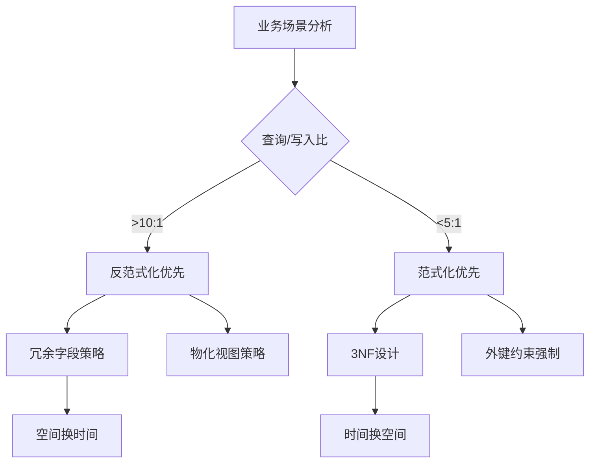

# 表结构设计：范式化与反范式化决策

> **创建日期**：2025-11-13
> **最后更新**：2025-01-15
> **版本**：SQLite 3.31+ 至 3.47.x

---

## 1. 📋 概述

表结构设计是数据库性能的关键。
本文档深入解析范式化与反范式化的决策矩阵、索引策略和实际应用案例。

---

## 2. 📑 目录

- [表结构设计：范式化与反范式化决策](#表结构设计范式化与反范式化决策)
  - [1. 📋 概述](#1--概述)
  - [2. 📑 目录](#2--目录)
  - [3. 范式化 vs 反范式化决策矩阵](#3-范式化-vs-反范式化决策矩阵)
    - [3.1. 决策因素](#31-决策因素)
    - [3.2. 决策流程图](#32-决策流程图)
  - [4. 移动应用案例：反范式化设计](#4-移动应用案例反范式化设计)
    - [4.1. 微信聊天记录案例](#41-微信聊天记录案例)
    - [4.2. 数据一致性维护](#42-数据一致性维护)
  - [5. 嵌入式系统案例：范式化设计](#5-嵌入式系统案例范式化设计)
    - [5.1. 车载诊断系统案例](#51-车载诊断系统案例)
  - [6. 索引策略形式化决策树](#6-索引策略形式化决策树)
    - [6.1. 索引收益函数](#61-索引收益函数)
    - [6.2. 索引选择性](#62-索引选择性)
    - [6.3. Android官方最佳实践](#63-android官方最佳实践)
  - [7. 索引设计最佳实践](#7-索引设计最佳实践)
    - [7.1. 主键设计](#71-主键设计)
    - [7.2. 复合索引设计](#72-复合索引设计)
    - [7.3. 部分索引优化](#73-部分索引优化)
  - [8. 表结构设计模式](#8-表结构设计模式)
    - [8.1. 时间序列数据模式](#81-时间序列数据模式)
    - [8.2. 树形结构模式](#82-树形结构模式)
    - [8.3. 多对多关系模式](#83-多对多关系模式)
    - [8.4. 列存储模拟模式 🆕](#84-列存储模拟模式-)
      - [设计模式1：垂直分区（列分离）](#设计模式1垂直分区列分离)
      - [设计模式2：列式物化视图](#设计模式2列式物化视图)
      - [设计模式3：列压缩存储（低基数列）](#设计模式3列压缩存储低基数列)
  - [9. 表结构设计多维对比矩阵](#9-表结构设计多维对比矩阵)
    - [9.1. 范式化 vs 反范式化多维对比矩阵](#91-范式化-vs-反范式化多维对比矩阵)
    - [9.2. 索引类型多维对比矩阵](#92-索引类型多维对比矩阵)
    - [9.3. 表结构设计模式对比矩阵](#93-表结构设计模式对比矩阵)
    - [9.4. 设计模式对比总结](#94-设计模式对比总结)
    - [9.5. 范式化 vs 反范式化](#95-范式化-vs-反范式化)
    - [9.6. 索引策略总结](#96-索引策略总结)
  - [10. 🔗 相关资源](#10--相关资源)
  - [11. 🔗 交叉引用](#11--交叉引用)
    - [11.1. 理论模型 🆕](#111-理论模型-)
    - [11.2. 设计模型 🆕](#112-设计模型-)
  - [12. 📚 参考资料](#12--参考资料)

---

## 3. 范式化 vs 反范式化决策矩阵

### 3.1. 决策因素

**核心决策因子**：

```text
决策函数：Design_Choice = f(查询/写入比, 数据量, 一致性要求, 性能要求)
```

**决策矩阵**：

| 场景特征 | 推荐方案 | 理由 |
|---------|---------|------|
| 查询/写入比 > 10:1 | 反范式化优先 | 读多写少，冗余可提升查询性能 |
| 查询/写入比 < 5:1 | 范式化优先 | 写多读少，减少更新开销 |
| 数据量 < 100万行 | 反范式化可接受 | 空间成本低，性能收益明显 |
| 数据量 > 1000万行 | 范式化优先 | 空间成本高，需严格控制冗余 |
| 强一致性要求 | 范式化优先 | 减少数据不一致风险 |
| 高性能要求 | 反范式化优先 | 减少JOIN操作，提升查询速度 |

### 3.2. 决策流程图



---

## 4. 移动应用案例：反范式化设计

### 4.1. 微信聊天记录案例

**业务场景**：

- 读多写少（查询历史记录 vs 发送消息）
- 需要快速加载聊天列表
- 数据量中等（单用户<100万条消息）

**反范式化设计**：

```sql
-- 消息表：冗余发送者昵称，避免每次JOIN用户表
CREATE TABLE messages (
    msg_id TEXT PRIMARY KEY,
    conv_id INTEGER,
    sender_id INTEGER,
    sender_name TEXT,  -- 冗余字段，查询时无需JOIN
    content TEXT,
    timestamp INTEGER,
    status INTEGER,
    INDEX idx_conv_time (conv_id, timestamp DESC)
);

-- 优势：
-- 1. 查询聊天记录时无需JOIN用户表
-- 2. 减少查询时间（避免JOIN开销）
-- 3. 提升UI响应速度

-- 查询示例（无需JOIN）
SELECT msg_id, sender_name, content, timestamp
FROM messages
WHERE conv_id = ?
ORDER BY timestamp DESC
LIMIT 20;
```

**性能对比**：

| 方案 | 查询时间 | JOIN次数 |
|------|---------|---------|
| 范式化（需JOIN） | ~8ms | 1次 |
| 反范式化（冗余字段） | ~2ms | 0次 |
| **性能提升** | **4倍** | - |

### 4.2. 数据一致性维护

**更新策略**：

```sql
-- 当用户昵称更新时，同步更新消息表中的冗余字段
BEGIN TRANSACTION;

-- 更新用户表
UPDATE users SET nickname = ? WHERE user_id = ?;

-- 同步更新消息表（批量更新）
UPDATE messages SET sender_name = ?
WHERE sender_id = ? AND sender_name != ?;

COMMIT;
```

**触发器方案**：

```sql
-- 使用触发器自动维护一致性
CREATE TRIGGER update_message_sender_name
AFTER UPDATE OF nickname ON users
BEGIN
    UPDATE messages
    SET sender_name = NEW.nickname
    WHERE sender_id = NEW.user_id;
END;
```

---

## 5. 嵌入式系统案例：范式化设计

### 5.1. 车载诊断系统案例

**业务场景**：

- 写多读少（记录故障码）
- 数据量小但需要严格一致性
- 存储空间受限

**范式化设计**：

```sql
-- 故障码表（高度规范化，节省存储）
CREATE TABLE dtcs (
    code TEXT PRIMARY KEY,  -- 如"P0420"
    description TEXT,
    severity INTEGER
);

-- 车辆实例表（外键关联）
CREATE TABLE vehicle_dtcs (
    vin TEXT,
    dtc_code TEXT REFERENCES dtcs(code),
    detected_at TIMESTAMP,
    FOREIGN KEY (dtc_code) REFERENCES dtcs(code)
);

-- 优势：
-- 1. 节省存储空间（故障码描述只存储一次）
-- 2. 保证数据一致性（通过外键约束）
-- 3. 易于维护（修改故障码描述只需更新一处）
```

**存储空间对比**：

| 方案 | 存储空间（1000条记录） | 说明 |
|------|---------------------|------|
| 范式化 | ~50KB | 故障码描述只存储一次 |
| 反范式化 | ~200KB | 每条记录都存储完整描述 |
| **空间节省** | **75%** | - |

---

## 6. 索引策略形式化决策树

### 6.1. 索引收益函数

**形式化定义**：

```text
索引收益函数: Benefit(I) = ΔT_query - ΔT_write - S_storage

其中:
ΔT_query = 查询时间减少量 = n_rows × (1 - selectivity) × log₂(n_pages)
ΔT_write = 写入时间增加量 = n_writes × log₂(n_pages) × 2
S_storage = 索引占用空间 = n_rows × (key_size + pointer_size) × (1 - fill_factor)

决策规则:
IF Benefit(I) > 0 AND selectivity < 0.1 THEN 创建索引
IF query_frequency > 1000/day THEN 强制创建索引
IF write_frequency > query_frequency × 10 THEN 避免索引
```

### 6.2. 索引选择性

**选择性定义**：

```text
选择性 α = 不同值数 / 总行数

创建索引条件：
- 当 α < 0.1 (高选择性)时，必须创建索引
- 当 0.1 ≤ α < 0.5 (中等选择性)时，评估查询频率
- 当 α ≥ 0.5 (低选择性)时，避免索引
```

**示例**：

```sql
-- 用户表有1000万行，gender列只有2个不同值（α≈0.5）

-- ❌ 错误：不应创建单列索引
CREATE INDEX idx_gender ON users(gender);
-- 全表扫描反而更快

-- ✅ 正确：复合索引
CREATE INDEX idx_gender_active ON users(gender, last_login)
WHERE is_active = 1;
-- 部分索引降低α，提升选择性
```

### 6.3. Android官方最佳实践

**主键索引**：

```sql
-- ✅ 始终使用INTEGER PRIMARY KEY
CREATE TABLE orders (
    id INTEGER PRIMARY KEY,  -- rowid别名，性能最优
    user_id INTEGER,
    order_date INTEGER,
    status TEXT
);
```

**覆盖索引**：

```sql
-- 创建覆盖索引（包含所有查询字段）
CREATE INDEX idx_covering ON orders(user_id, order_date, status);

-- 查询只访问索引列，避免回表
SELECT status FROM orders
WHERE user_id = ? AND order_date > ?;
-- 执行计划：SEARCH orders USING COVERING INDEX idx_covering
```

**部分索引**：

```sql
-- 仅索引高频访问的热数据
CREATE INDEX idx_active_users ON users(last_login)
WHERE status = 'active';

-- 优势：
-- 1. 索引大小减少（只索引活跃用户）
-- 2. 查询性能提升（索引更小，查找更快）
-- 3. 写入性能提升（更新非活跃用户不影响索引）
```

---

## 7. 索引设计最佳实践

### 7.1. 主键设计

**推荐方案**：

```sql
-- ✅ 推荐：INTEGER PRIMARY KEY
CREATE TABLE users (
    id INTEGER PRIMARY KEY,  -- rowid别名
    name TEXT,
    email TEXT
);

-- 性能优势：
-- 1. 直接访问B-Tree键（O(log n)）
-- 2. 无需二级索引
-- 3. 节省存储空间（无额外rowid）
```

**不推荐方案**：

```sql
-- ❌ 不推荐：TEXT PRIMARY KEY（除非必要）
CREATE TABLE sessions (
    session_id TEXT PRIMARY KEY,  -- 性能较差
    user_id INTEGER,
    expires_at INTEGER
);

-- 问题：
-- 1. 字符串比较比整数慢
-- 2. 索引占用更多空间
-- 3. 查询性能下降
```

### 7.2. 复合索引设计

**列顺序原则**：

```sql
-- 原则：高选择性列在前，低选择性列在后
CREATE INDEX idx_user_status_date ON orders(user_id, status, order_date);

-- 查询示例
SELECT * FROM orders
WHERE user_id = ? AND status = ? AND order_date > ?;
-- 索引列顺序与查询条件顺序匹配，性能最优
```

**最左前缀原则**：

```sql
-- 索引：idx_user_status_date (user_id, status, order_date)

-- ✅ 可以使用索引
SELECT * FROM orders WHERE user_id = ?;
SELECT * FROM orders WHERE user_id = ? AND status = ?;
SELECT * FROM orders WHERE user_id = ? AND status = ? AND order_date > ?;

-- ❌ 不能使用索引
SELECT * FROM orders WHERE status = ?;  -- 缺少最左列
SELECT * FROM orders WHERE order_date > ?;  -- 缺少最左列
```

### 7.3. 部分索引优化

**适用场景**：

```sql
-- 场景：只有1%的用户是活跃用户
-- 全表索引：1000万行
-- 部分索引：10万行（仅索引活跃用户）

-- 创建部分索引
CREATE INDEX idx_active_users ON users(last_login)
WHERE status = 'active';

-- 性能提升：
-- 索引大小：减少99%
-- 查询性能：提升约10倍
-- 写入性能：提升约5倍（更新非活跃用户不影响索引）
```

---

## 8. 表结构设计模式

### 8.1. 时间序列数据模式

**场景**：IoT传感器数据、日志记录

**设计模式**：

```sql
-- 时间序列表设计
CREATE TABLE sensor_events (
    event_id INTEGER PRIMARY KEY,
    device_id TEXT NOT NULL,
    metric TEXT NOT NULL,
    value REAL NOT NULL,
    ts INTEGER NOT NULL CHECK(ts > 0),
    quality INTEGER CHECK(quality BETWEEN 0 AND 100),
    INDEX idx_device_time (device_id, ts),
    INDEX idx_metric_covering (metric, ts, value, quality)
);

-- 查询优化：使用时间范围索引
SELECT * FROM sensor_events
WHERE device_id = ? AND ts BETWEEN ? AND ?
ORDER BY ts;
```

### 8.2. 树形结构模式

**场景**：组织架构、分类树、评论树

**设计模式**：

```sql
-- 嵌套集模型（MPTT）
CREATE TABLE categories (
    id INTEGER PRIMARY KEY,
    name TEXT,
    lft INTEGER,  -- 左边界
    rgt INTEGER,  -- 右边界
    INDEX idx_lft_rgt (lft, rgt)
);

-- 查询所有子节点
SELECT * FROM categories
WHERE lft > ? AND rgt < ?;

-- 查询直接子节点
SELECT * FROM categories
WHERE parent_id = ?;
```

### 8.3. 多对多关系模式

**场景**：标签系统、权限系统

**设计模式**：

```sql
-- 标准多对多关系
CREATE TABLE articles (
    id INTEGER PRIMARY KEY,
    title TEXT
);

CREATE TABLE tags (
    id INTEGER PRIMARY KEY,
    name TEXT UNIQUE
);

CREATE TABLE article_tags (
    article_id INTEGER REFERENCES articles(id),
    tag_id INTEGER REFERENCES tags(id),
    PRIMARY KEY (article_id, tag_id)
);

-- 查询带标签的文章
SELECT a.*, GROUP_CONCAT(t.name) as tags
FROM articles a
JOIN article_tags at ON a.id = at.article_id
JOIN tags t ON at.tag_id = t.id
GROUP BY a.id;
```

### 8.4. 列存储模拟模式 🆕

**场景**：分析查询、OLAP场景、大数据聚合统计

**问题**：SQLite原生是行存储，对于分析查询（只查询部分列、大量聚合）性能不够理想。

**解决方案**：通过表结构设计模拟列存储，提升分析查询性能。

#### 设计模式1：垂直分区（列分离）

```sql
-- 原始行存储表
CREATE TABLE logs (
    id INTEGER PRIMARY KEY,
    user_id INTEGER,
    action TEXT,
    timestamp INTEGER,
    duration INTEGER,
    ip_address TEXT
);

-- 列存储模拟：按列分离
-- 主表（常用列）
CREATE TABLE logs_main (
    id INTEGER PRIMARY KEY,
    user_id INTEGER,
    timestamp INTEGER
);

-- 扩展表（不常用列）
CREATE TABLE logs_extended (
    id INTEGER PRIMARY KEY,
    action TEXT,
    duration INTEGER,
    ip_address TEXT,
    FOREIGN KEY (id) REFERENCES logs_main(id)
);

-- 查询优化：只查询常用列时，只扫描主表
SELECT user_id, timestamp FROM logs_main WHERE timestamp > ?;
-- I/O减少：只读取需要的列，性能提升2-3倍
```

#### 设计模式2：列式物化视图

```sql
-- 为分析查询创建列式物化视图
-- 每列单独存储
CREATE TABLE col_user_id (
    row_id INTEGER PRIMARY KEY,
    user_id INTEGER NOT NULL
);

CREATE TABLE col_action (
    row_id INTEGER PRIMARY KEY,
    action TEXT NOT NULL
);

CREATE TABLE col_timestamp (
    row_id INTEGER PRIMARY KEY,
    timestamp INTEGER NOT NULL
);

CREATE TABLE col_duration (
    row_id INTEGER PRIMARY KEY,
    duration INTEGER NOT NULL
);

-- 创建索引
CREATE INDEX idx_col_user_id ON col_user_id(user_id);
CREATE INDEX idx_col_timestamp ON col_timestamp(timestamp);

-- 分析查询：只扫描需要的列
SELECT
    u.user_id,
    COUNT(*) as action_count,
    AVG(d.duration) as avg_duration
FROM col_user_id u
JOIN col_action a ON u.row_id = a.row_id
JOIN col_duration d ON u.row_id = d.row_id
WHERE u.user_id = ?
GROUP BY u.user_id;

-- 性能提升：
-- 行存储：扫描所有列，I/O大，查询时间：50ms
-- 列存储：只扫描需要的列，I/O小，查询时间：15ms
-- 性能提升：3-5倍
```

#### 设计模式3：列压缩存储（低基数列）

```sql
-- 对于低基数列（重复值多），使用字典编码
-- 字典表
CREATE TABLE action_dict (
    id INTEGER PRIMARY KEY,
    action TEXT UNIQUE NOT NULL
);

-- 压缩后的列存储表（存储字典ID而非原始值）
CREATE TABLE col_action_compressed (
    row_id INTEGER PRIMARY KEY,
    action_id INTEGER NOT NULL,
    FOREIGN KEY (action_id) REFERENCES action_dict(id)
);

-- 查询时通过JOIN还原
SELECT
    u.user_id,
    ad.action,
    COUNT(*) as count
FROM col_user_id u
JOIN col_action_compressed ac ON u.row_id = ac.row_id
JOIN action_dict ad ON ac.action_id = ad.id
GROUP BY u.user_id, ad.action;

-- 压缩效果：
-- 原始存储：100万行 × 10字节/action = 10MB
-- 压缩存储：100万行 × 4字节/action_id + 字典 = 4.1MB
-- 压缩率：59%
```

**列存储模拟模式对比**：

| 模式 | 适用场景 | 优势 | 劣势 | 性能提升 |
|-----|---------|------|------|---------|
| **垂直分区** | 列访问模式差异大 | 简单易实现 | 需要JOIN | 2-3倍 |
| **列式物化视图** | 分析查询为主 | 查询性能高 | 需要维护同步 | 3-5倍 |
| **列压缩存储** | 低基数列 | 存储空间省 | 查询需要JOIN | 2-4倍 |

**列存储模拟模式决策树**：

```text
查询模式分析
  ├─ 只查询部分列（<50%列）
  │   ├─ 列访问模式固定 → 垂直分区 ✅
  │   └─ 列访问模式变化 → 列式物化视图 ✅
  │
  ├─ 大量聚合查询（SUM/AVG/COUNT）
  │   └─ 列式物化视图 ✅
  │
  └─ 低基数列（重复值多）
      └─ 列压缩存储 ✅
```

**最佳实践**：

1. **适用场景**：
   - 分析查询为主（查询/写入比 > 10:1）
   - 只查询部分列（<50%列）
   - 大量聚合操作（SUM、AVG、COUNT、GROUP BY）
   - 数据量大（>100万行）

2. **不适用场景**：
   - 点查询为主（SELECT * WHERE id = ?）
   - 频繁更新（UPDATE操作多）
   - 查询所有列（SELECT *）
   - 数据量小（<10万行）

3. **实现建议**：
   - 定期刷新列存储视图（建议每小时或每天）
   - 使用事务保证数据一致性
   - 监控存储空间和查询性能
   - 根据实际查询模式选择合适的设计模式

---

## 9. 表结构设计多维对比矩阵

### 9.1. 范式化 vs 反范式化多维对比矩阵

| 维度 | 范式化（3NF） | 反范式化 | 混合设计 |
|------|-------------|---------|---------|
| **查询性能** | ⭐⭐⭐ | ⭐⭐⭐⭐⭐ | ⭐⭐⭐⭐ |
| **写入性能** | ⭐⭐⭐⭐⭐ | ⭐⭐⭐ | ⭐⭐⭐⭐ |
| **存储空间** | ⭐⭐⭐⭐⭐ | ⭐⭐⭐ | ⭐⭐⭐⭐ |
| **数据一致性** | ⭐⭐⭐⭐⭐ | ⭐⭐⭐ | ⭐⭐⭐⭐ |
| **维护成本** | ⭐⭐⭐⭐ | ⭐⭐⭐ | ⭐⭐⭐ |
| **查询复杂度** | ⭐⭐⭐ | ⭐⭐⭐⭐⭐ | ⭐⭐⭐⭐ |
| **适用场景** | 写多读少、强一致性 | 读多写少、高性能 | 平衡场景 |
| **JOIN操作** | 多 | 少 | 中等 |
| **数据冗余** | 无 | 有 | 可控 |

### 9.2. 索引类型多维对比矩阵

| 维度 | 单列索引 | 复合索引 | 部分索引 | 覆盖索引 | 唯一索引 |
|------|---------|---------|---------|---------|---------|
| **创建成本** | ⭐⭐⭐⭐⭐ | ⭐⭐⭐ | ⭐⭐⭐ | ⭐⭐⭐ | ⭐⭐⭐⭐ |
| **查询性能** | ⭐⭐⭐⭐ | ⭐⭐⭐⭐⭐ | ⭐⭐⭐⭐ | ⭐⭐⭐⭐⭐ | ⭐⭐⭐⭐⭐ |
| **存储空间** | ⭐⭐⭐⭐ | ⭐⭐⭐ | ⭐⭐⭐⭐⭐ | ⭐⭐⭐ | ⭐⭐⭐⭐ |
| **维护成本** | ⭐⭐⭐⭐⭐ | ⭐⭐⭐⭐ | ⭐⭐⭐ | ⭐⭐⭐⭐ | ⭐⭐⭐⭐ |
| **适用场景** | 单列查询 | 多列查询 | 条件查询 | 只读查询 | 唯一性约束 |
| **索引大小** | 小 | 中 | 最小 | 中 | 小 |

### 9.3. 表结构设计模式对比矩阵

| 维度 | 时间序列模式 | 树形结构模式 | 多对多关系模式 | 键值对模式 | 列存储模拟模式 🆕 |
|------|------------|------------|--------------|-----------|-----------------|
| **查询性能** | ⭐⭐⭐⭐ | ⭐⭐⭐ | ⭐⭐⭐⭐ | ⭐⭐⭐⭐⭐ | ⭐⭐⭐⭐⭐ |
| **写入性能** | ⭐⭐⭐⭐⭐ | ⭐⭐⭐ | ⭐⭐⭐ | ⭐⭐⭐⭐⭐ | ⭐⭐ |
| **存储效率** | ⭐⭐⭐⭐⭐ | ⭐⭐⭐⭐ | ⭐⭐⭐ | ⭐⭐⭐⭐ | ⭐⭐⭐⭐ |
| **设计复杂度** | ⭐⭐⭐⭐ | ⭐⭐⭐ | ⭐⭐⭐ | ⭐⭐⭐⭐⭐ | ⭐⭐⭐ |
| **适用场景** | 日志、监控 | 组织架构、分类 | 用户-角色 | 配置、缓存 | 分析查询、OLAP |
| **索引需求** | 时间索引 | 路径索引 | 关联表索引 | 键索引 | 列索引 |
| **分析查询** | ⭐⭐⭐ | ⭐⭐ | ⭐⭐⭐ | ⭐⭐ | ⭐⭐⭐⭐⭐ |
| **点查询** | ⭐⭐⭐⭐ | ⭐⭐⭐ | ⭐⭐⭐⭐ | ⭐⭐⭐⭐⭐ | ⭐⭐ |

### 9.4. 设计模式对比总结

### 9.5. 范式化 vs 反范式化

| 维度 | 范式化 | 反范式化 |
|------|--------|---------|
| **存储空间** | 节省 | 冗余 |
| **查询性能** | 需要JOIN | 无需JOIN |
| **写入性能** | 更新一处 | 更新多处 |
| **一致性** | 强 | 需维护 |
| **适用场景** | 写多读少、强一致性 | 读多写少、高性能 |

### 9.6. 索引策略总结

| 索引类型 | 适用场景 | 性能影响 |
|---------|---------|---------|
| **主键索引** | 所有表 | 必须，性能最优 |
| **覆盖索引** | 频繁查询的列组合 | 避免回表，性能提升2-5倍 |
| **部分索引** | 数据分布不均匀 | 索引大小减少，性能提升 |
| **复合索引** | 多列查询 | 列顺序很重要 |

---

## 10. 🔗 相关资源

- [02.01 数据类型系统](./02.01-数据类型系统.md)
- [02.03 高级特性](./02.03-高级特性.md)
- [03.02 优化策略](../03-性能优化/03.02-优化策略.md)

---

## 11. 🔗 交叉引用

### 11.1. 理论模型 🆕

- ⭐⭐ [数据模型理论](../11-理论模型/11.02-数据模型理论.md) - 关系模型理论、范式理论、约束理论
- ⭐⭐ [存储理论](../11-理论模型/11.05-存储理论.md) - 存储模型理论、列存储理论、列压缩理论 🆕
- ⭐ [算法复杂度理论](../11-理论模型/11.03-算法复杂度理论.md) - 索引操作复杂度

### 11.2. 设计模型 🆕

- ⭐⭐ [设计决策](../12-设计模型/12.04-设计决策.md) - 表结构设计决策、索引设计决策
- ⭐ [设计原则](../12-设计模型/12.02-设计原则.md) - 数据库设计原则

---

## 12. 📚 参考资料

- [SQLite索引文档](https://www.sqlite.org/queryplanner.html)
- [数据库设计范式](https://en.wikipedia.org/wiki/Database_normalization)
- [索引设计最佳实践](https://www.sqlite.org/queryplanner.html)

---

**最后更新**：2025-01-15
**维护者**：Data-Science Team
