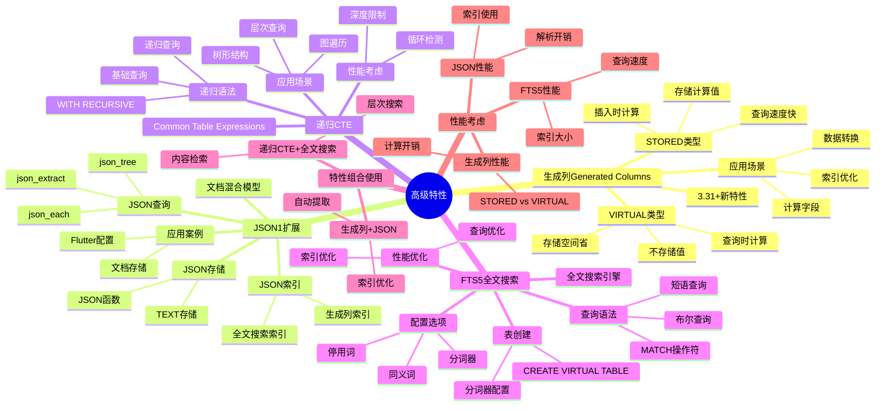

# 高级特性：生成列、JSON、CTE、全文搜索

> **创建日期**：2025-11-13
> **最后更新**：2025-01-15
> **版本**：SQLite 3.31+ 至 3.47.x

---

## 📋 概述

SQLite提供了丰富的高级特性，包括生成列、JSON扩展、递归CTE和全文搜索。
本文档深入解析这些特性的使用方法和最佳实践。

---

## 📑 目录

- [高级特性：生成列、JSON、CTE、全文搜索](#高级特性生成列jsoncte全文搜索)
  - [📋 概述](#-概述)
  - [📑 目录](#-目录)
  - [📊 思维导图](#-思维导图)
  - [一、生成列（Generated Columns）3.31+](#一生成列generated-columns331)
    - [1.1 生成列概述](#11-生成列概述)
    - [1.2 生成列语法](#12-生成列语法)
    - [1.3 STORED vs VIRTUAL](#13-stored-vs-virtual)
    - [1.4 应用场景](#14-应用场景)
  - [二、JSON1扩展与文档混合模型](#二json1扩展与文档混合模型)
    - [2.1 JSON支持概述](#21-json支持概述)
    - [2.2 JSON存储与查询](#22-json存储与查询)
    - [2.3 JSON索引](#23-json索引)
    - [2.4 应用案例：Flutter应用配置管理](#24-应用案例flutter应用配置管理)
  - [三、递归CTE（Common Table Expressions）](#三递归ctecommon-table-expressions)
    - [3.1 CTE概述](#31-cte概述)
    - [3.2 递归CTE语法](#32-递归cte语法)
    - [3.3 应用场景](#33-应用场景)
  - [四、全文搜索（FTS5）](#四全文搜索fts5)
    - [4.1 FTS5概述](#41-fts5概述)
    - [4.2 FTS5表创建](#42-fts5表创建)
    - [4.3 全文搜索查询](#43-全文搜索查询)
    - [4.4 FTS5配置](#44-fts5配置)
  - [五、高级特性组合使用](#五高级特性组合使用)
    - [5.1 生成列 + JSON](#51-生成列--json)
    - [5.2 递归CTE + 全文搜索](#52-递归cte--全文搜索)
  - [六、高级特性多维对比矩阵](#六高级特性多维对比矩阵)
    - [6.1 生成列类型多维对比矩阵](#61-生成列类型多维对比矩阵)
    - [6.2 JSON vs 关系表多维对比矩阵](#62-json-vs-关系表多维对比矩阵)
    - [6.3 全文搜索方案对比矩阵](#63-全文搜索方案对比矩阵)
    - [6.4 性能考虑](#64-性能考虑)
    - [6.4.1 生成列性能](#641-生成列性能)
    - [6.2 JSON性能](#62-json性能)
    - [6.3 FTS5性能](#63-fts5性能)
  - [🔗 相关资源](#-相关资源)
  - [📚 参考资料](#-参考资料)

---

## 📊 思维导图



---

## 一、生成列（Generated Columns）3.31+

### 1.1 生成列概述

**定义**：生成列的值由表达式自动计算，无需手动维护。

**两种类型**：

| 类型 | 关键字 | 存储方式 | 计算时机 |
|------|--------|---------|---------|
| **STORED** | `STORED` | 存储在数据库中 | 插入/更新时计算并存储 |
| **VIRTUAL** | `VIRTUAL`或省略 | 不存储，仅计算 | 查询时实时计算 |

### 1.2 生成列语法

**基本语法**：

```sql
CREATE TABLE products (
    id INTEGER PRIMARY KEY,
    price REAL,
    quantity INTEGER,
    total_price REAL GENERATED ALWAYS AS (price * quantity) STORED,
    discount_price REAL GENERATED ALWAYS AS (price * quantity * 0.9) VIRTUAL
);
```

**形式化定义**：

```text
对于表T，生成列G的值为函数f(Row)的评估结果，其中：
- f是确定性的纯函数（无副作用）
- ∀r₁,r₂∈T, 若r₁ = r₂，则f(r₁) = f(r₂)（一致性）
- 插入/更新时自动触发评估（触发器语义）
```

### 1.3 STORED vs VIRTUAL

**STORED生成列**：

```sql
CREATE TABLE orders (
    id INTEGER PRIMARY KEY,
    subtotal REAL,
    tax_rate REAL,
    tax REAL GENERATED ALWAYS AS (subtotal * tax_rate) STORED,
    total REAL GENERATED ALWAYS AS (subtotal + tax) STORED
);

-- 优势：
-- 1. 可以创建索引
-- 2. 查询性能快（无需计算）
-- 3. 可以用于WHERE条件

-- 劣势：
-- 1. 占用存储空间
-- 2. 插入/更新时需要计算
```

**VIRTUAL生成列**：

```sql
CREATE TABLE products (
    id INTEGER PRIMARY KEY,
    name TEXT,
    price REAL,
    currency TEXT,
    price_usd REAL GENERATED ALWAYS AS (
        CASE currency
            WHEN 'USD' THEN price
            WHEN 'EUR' THEN price * 1.1
            WHEN 'CNY' THEN price * 0.14
        END
    ) VIRTUAL
);

-- 优势：
-- 1. 不占用存储空间
-- 2. 插入/更新时无需计算
-- 3. 可以包含复杂逻辑

-- 劣势：
-- 1. 不能创建索引
-- 2. 查询时需要计算
```

### 1.4 应用场景

**电商订单系统**：

```sql
CREATE TABLE order_items (
    id INTEGER PRIMARY KEY,
    order_id INTEGER,
    product_id INTEGER,
    quantity INTEGER,
    unit_price REAL,
    subtotal REAL GENERATED ALWAYS AS (quantity * unit_price) STORED,
    tax REAL GENERATED ALWAYS AS (quantity * unit_price * 0.08) STORED,
    total REAL GENERATED ALWAYS AS (subtotal + tax) STORED
);

-- 自动计算，无需应用层逻辑
INSERT INTO order_items (order_id, product_id, quantity, unit_price)
VALUES (1, 100, 2, 99.99);
-- 自动得到：subtotal=199.98, tax=15.9984, total=215.9784
```

---

## 二、JSON1扩展与文档混合模型

### 2.1 JSON支持概述

SQLite通过JSON1扩展成为**关系-文档混合数据库**：

**核心功能**：

- 存储JSON数据（TEXT类型）
- JSON路径查询
- JSON函数操作
- JSON索引支持

### 2.2 JSON存储与查询

**存储JSON数据**：

```sql
-- 存储半结构化配置
CREATE TABLE device_configs (
    device_id INTEGER PRIMARY KEY,
    config TEXT NOT NULL,  -- JSON字符串
    last_update INTEGER
);

-- 插入JSON数据
INSERT INTO device_configs VALUES (
    1,
    '{"network": {"ip": "192.168.1.100", "port": 8080}, "sensors": [{"type": "temp", "threshold": 25.0}]}',
    strftime('%s', 'now')
);
```

**JSON路径查询**：

```sql
-- 查询JSON字段
SELECT
    device_id,
    json_extract(config, '$.network.ip') as ip,
    json_extract(config, '$.sensors[0].threshold') as threshold
FROM device_configs
WHERE json_type(config, '$.network') = 'object'
  AND json_array_length(config, '$.sensors') > 0;
```

**JSON函数**：

```sql
-- JSON函数列表
json(json_text)              -- 验证并格式化JSON
json_array(value1, ...)      -- 创建JSON数组
json_object(key1, value1, ...) -- 创建JSON对象
json_extract(json, path)      -- 提取JSON值
json_type(json, path)         -- 获取JSON类型
json_array_length(json, path) -- 获取数组长度
json_valid(json)              -- 验证JSON有效性
```

### 2.3 JSON索引

**JSON路径索引**：

```sql
-- 在JSON路径上创建索引
CREATE INDEX idx_config_ip ON device_configs(
    json_extract(config, '$.network.ip')
);

-- 查询使用索引
SELECT * FROM device_configs
WHERE json_extract(config, '$.network.ip') = '192.168.1.100';
```

### 2.4 应用案例：Flutter应用配置管理

**Dart代码示例**：

```dart
// 存储复杂UI配置
await db.execute('''
  CREATE TABLE user_preferences (
    user_id INTEGER PRIMARY KEY,
    layout_config TEXT NOT NULL  -- JSON字符串
  )
''');

// 查询特定配置项
final result = await db.rawQuery('''
  SELECT json_extract(layout_config, '$.theme.dark_mode') as dark_mode
  FROM user_preferences
  WHERE user_id = ?
''', [userId]);
```

---

## 三、递归CTE（Common Table Expressions）

### 3.1 CTE概述

**定义**：CTE（Common Table Expression）是临时命名的结果集，可以在查询中引用。

**递归CTE**：CTE可以引用自身，实现递归查询。

### 3.2 递归CTE语法

**基本语法**：

```sql
WITH RECURSIVE cte_name AS (
    -- 初始查询（锚点）
    SELECT ...
    UNION ALL
    -- 递归查询
    SELECT ... FROM cte_name WHERE ...
)
SELECT * FROM cte_name;
```

### 3.3 应用场景

**组织架构查询**：

```sql
-- 递归查询组织架构
WITH RECURSIVE org_chart AS (
    -- 初始查询：根节点
    SELECT id, name, manager_id, 1 AS level
    FROM employees
    WHERE manager_id IS NULL

    UNION ALL

    -- 递归查询：子节点
    SELECT e.id, e.name, e.manager_id, oc.level + 1
    FROM employees e
    JOIN org_chart oc ON e.manager_id = oc.id
)
SELECT * FROM org_chart ORDER BY level, id;
```

**执行模型**：

递归CTE转换为两个临时表的迭代：

1. **初始查询**：执行一次，结果存入临时表T₀
2. **递归查询**：重复执行，直到结果为空，每次结果追加到Tₙ
3. **合并**：UNION ALL合并所有Tᵢ

**执行复杂度**：O(k × (n + m))，其中k为递归深度，n为每轮扫描行数

**树形结构路径查询**：

```sql
-- 查询从根到叶子的完整路径
WITH RECURSIVE tree_path AS (
    -- 初始：叶子节点
    SELECT id, name, parent_id, name AS path
    FROM categories
    WHERE id NOT IN (SELECT DISTINCT parent_id FROM categories WHERE parent_id IS NOT NULL)

    UNION ALL

    -- 递归：向上查找父节点
    SELECT c.id, c.name, c.parent_id, c.name || ' > ' || tp.path
    FROM categories c
    JOIN tree_path tp ON c.id = tp.parent_id
)
SELECT * FROM tree_path WHERE parent_id IS NULL;
```

---

## 四、全文搜索（FTS5）

### 4.1 FTS5概述

**定义**：FTS5是SQLite的全文搜索扩展，提供高效的文本搜索功能。

**核心特性**：

- 倒排索引实现
- 多语言支持
- 排名算法
- 短语搜索

### 4.2 FTS5表创建

**基本语法**：

```sql
-- 创建FTS5虚拟表
CREATE VIRTUAL TABLE articles_fts USING fts5(
    title,
    content,
    author
);

-- 插入数据
INSERT INTO articles_fts VALUES (
    'SQLite Performance',
    'SQLite is a fast and reliable database...',
    'John Doe'
);
```

### 4.3 全文搜索查询

**基本搜索**：

```sql
-- 简单搜索
SELECT * FROM articles_fts
WHERE articles_fts MATCH 'SQLite';

-- 多词搜索（AND）
SELECT * FROM articles_fts
WHERE articles_fts MATCH 'SQLite AND performance';

-- 多词搜索（OR）
SELECT * FROM articles_fts
WHERE articles_fts MATCH 'SQLite OR database';
```

**排名查询**：

```sql
-- 使用bm25()排名函数
SELECT
    title,
    content,
    bm25(articles_fts) AS rank
FROM articles_fts
WHERE articles_fts MATCH 'SQLite performance'
ORDER BY rank;
```

**短语搜索**：

```sql
-- 精确短语匹配
SELECT * FROM articles_fts
WHERE articles_fts MATCH '"SQLite database"';
```

### 4.4 FTS5配置

**多语言支持**：

```sql
-- 配置分词器
CREATE VIRTUAL TABLE articles_fts USING fts5(
    title,
    content,
    tokenize = 'unicode61'  -- Unicode分词器
);
```

**外部内容表**：

```sql
-- FTS5表 + 外部内容表（避免数据冗余）
CREATE TABLE articles (
    id INTEGER PRIMARY KEY,
    title TEXT,
    content TEXT
);

CREATE VIRTUAL TABLE articles_fts USING fts5(
    title,
    content,
    content = 'articles',      -- 外部内容表
    content_rowid = 'id'       -- 行ID列
);
```

---

## 五、高级特性组合使用

### 5.1 生成列 + JSON

```sql
CREATE TABLE products (
    id INTEGER PRIMARY KEY,
    name TEXT,
    metadata TEXT,  -- JSON字符串
    price REAL GENERATED ALWAYS AS (
        json_extract(metadata, '$.price')
    ) STORED,
    category TEXT GENERATED ALWAYS AS (
        json_extract(metadata, '$.category')
    ) STORED
);

-- 自动从JSON提取并存储
INSERT INTO products (name, metadata) VALUES (
    'Product A',
    '{"price": 99.99, "category": "Electronics"}'
);
-- 自动得到：price=99.99, category='Electronics'
```

### 5.2 递归CTE + 全文搜索

```sql
-- 在组织架构中搜索
WITH RECURSIVE org_search AS (
    SELECT id, name, manager_id, 1 AS level
    FROM employees
    WHERE manager_id IS NULL
      AND name MATCH 'John'  -- 结合全文搜索

    UNION ALL

    SELECT e.id, e.name, e.manager_id, os.level + 1
    FROM employees e
    JOIN org_search os ON e.manager_id = os.id
    WHERE e.name MATCH 'John'
)
SELECT * FROM org_search;
```

---

## 六、高级特性多维对比矩阵

### 6.1 生成列类型多维对比矩阵

| 维度 | STORED | VIRTUAL |
|------|--------|---------|
| **插入性能** | ⭐⭐⭐ | ⭐⭐⭐⭐⭐ |
| **查询性能** | ⭐⭐⭐⭐⭐ | ⭐⭐⭐ |
| **存储空间** | ⭐⭐⭐ | ⭐⭐⭐⭐⭐ |
| **索引支持** | ⭐⭐⭐⭐⭐ | ⭐⭐⭐ |
| **适用场景** | 频繁查询 | 存储空间有限 |
| **计算时机** | 插入时 | 查询时 |
| **数据一致性** | ⭐⭐⭐⭐⭐ | ⭐⭐⭐⭐⭐ |

### 6.2 JSON vs 关系表多维对比矩阵

| 维度 | JSON存储 | 关系表存储 | 混合存储 |
|------|---------|-----------|---------|
| **查询性能** | ⭐⭐⭐ | ⭐⭐⭐⭐⭐ | ⭐⭐⭐⭐ |
| **写入性能** | ⭐⭐⭐⭐ | ⭐⭐⭐ | ⭐⭐⭐⭐ |
| **存储空间** | ⭐⭐⭐ | ⭐⭐⭐⭐⭐ | ⭐⭐⭐⭐ |
| **灵活性** | ⭐⭐⭐⭐⭐ | ⭐⭐⭐ | ⭐⭐⭐⭐ |
| **类型安全** | ⭐⭐ | ⭐⭐⭐⭐⭐ | ⭐⭐⭐⭐ |
| **适用场景** | 文档数据、配置 | 结构化数据 | 混合数据 |
| **索引支持** | ⭐⭐⭐ | ⭐⭐⭐⭐⭐ | ⭐⭐⭐⭐ |

### 6.3 全文搜索方案对比矩阵

| 维度 | FTS5 | LIKE查询 | 正则表达式 | 外部搜索引擎 |
|------|------|---------|-----------|------------|
| **查询性能** | ⭐⭐⭐⭐⭐ | ⭐⭐ | ⭐⭐ | ⭐⭐⭐⭐⭐ |
| **功能丰富度** | ⭐⭐⭐⭐⭐ | ⭐⭐ | ⭐⭐⭐ | ⭐⭐⭐⭐⭐ |
| **索引支持** | ⭐⭐⭐⭐⭐ | ⭐⭐ | ⭐⭐ | ⭐⭐⭐⭐⭐ |
| **存储空间** | ⭐⭐⭐ | ⭐⭐⭐⭐⭐ | ⭐⭐⭐⭐⭐ | ⭐⭐ |
| **实施复杂度** | ⭐⭐⭐ | ⭐⭐⭐⭐⭐ | ⭐⭐⭐⭐ | ⭐⭐ |
| **适用场景** | 全文搜索（推荐） | 简单匹配 | 复杂模式 | 大规模搜索 |

### 6.4 性能考虑

### 6.4.1 生成列性能

### 6.2 JSON性能

**JSON查询性能**：

- JSON路径查询：O(n)，n为JSON深度
- JSON索引：可以显著提升查询性能
- 建议：频繁查询的JSON路径创建索引

### 6.3 FTS5性能

**全文搜索性能**：

- 索引大小：约为文本大小的50-100%
- 查询性能：O(log n)，n为文档数
- 建议：定期优化FTS5表

---

## 🔗 相关资源

- [07.01 SQL标准对齐](../07-标准对齐/07.01-SQL标准对齐.md) - SQL:2016 JSON支持、CTE、生成列标准对齐
- [02.01 数据类型系统](./02.01-数据类型系统.md) - 数据类型系统基础
- [02.02 表结构设计](./02.02-表结构设计.md) - 表设计最佳实践
- [SQLite JSON1扩展](https://www.sqlite.org/json1.html)
- [SQLite FTS5扩展](https://www.sqlite.org/fts5.html)

---

## 🔗 交叉引用

### 理论模型 🆕

- ⭐⭐ [数据模型理论](../11-理论模型/11.02-数据模型理论.md) - 类型系统理论、关系模型理论
- ⭐ [算法复杂度理论](../11-理论模型/11.03-算法复杂度理论.md) - JSON查询复杂度、全文搜索复杂度

### 设计模型 🆕

- ⭐⭐ [设计模式](../12-设计模型/12.03-设计模式.md) - 生成列模式、JSON扩展模式
- ⭐ [设计决策](../12-设计模型/12.04-设计决策.md) - 高级特性设计决策

---

## 📚 参考资料

- [SQLite生成列文档](https://www.sqlite.org/gencol.html)
- [SQLite JSON1文档](https://www.sqlite.org/json1.html)
- [SQLite FTS5文档](https://www.sqlite.org/fts5.html)

---

**最后更新**：2025-01-15
**维护者**：Data-Science Team
