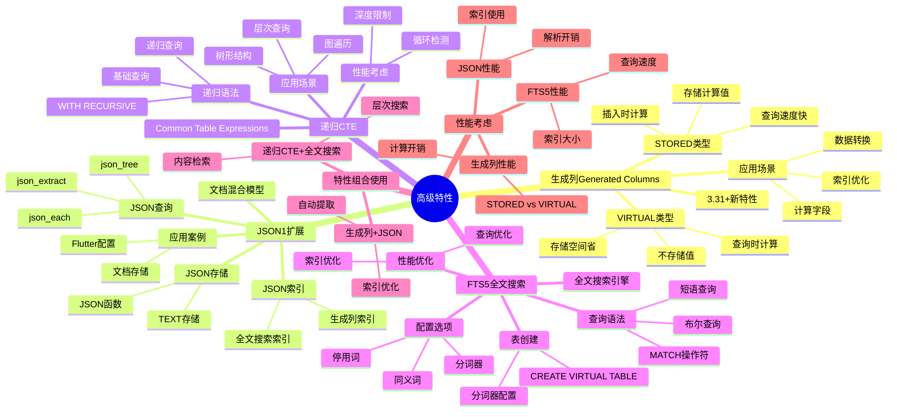

# 高级特性：生成列、JSON、CTE、全文搜索

> **创建日期**：2025-11-13
> **最后更新**：2025-01-15
> **版本**：SQLite 3.31+ 至 3.47.x

---

## 1. 📋 概述

SQLite提供了丰富的高级特性，包括生成列、JSON扩展、递归CTE和全文搜索。
本文档深入解析这些特性的使用方法和最佳实践。

---

## 2. 📑 目录

- [高级特性：生成列、JSON、CTE、全文搜索](#高级特性生成列jsoncte全文搜索)
  - [1. 📋 概述](#1--概述)
  - [2. 📑 目录](#2--目录)
  - [3. 📊 思维导图](#3--思维导图)
  - [4. 生成列（Generated Columns）3.31+](#4-生成列generated-columns331)
    - [4.1. 生成列概述](#41-生成列概述)
    - [4.2. 生成列语法](#42-生成列语法)
    - [4.3. STORED vs VIRTUAL](#43-stored-vs-virtual)
    - [4.4. 应用场景](#44-应用场景)
  - [5. JSON1扩展与文档混合模型](#5-json1扩展与文档混合模型)
    - [5.1. JSON支持概述](#51-json支持概述)
    - [5.2. JSON存储与查询](#52-json存储与查询)
    - [5.3. JSON索引](#53-json索引)
    - [5.4. 应用案例：Flutter应用配置管理](#54-应用案例flutter应用配置管理)
  - [6. 递归CTE（Common Table Expressions）](#6-递归ctecommon-table-expressions)
    - [6.1. CTE概述](#61-cte概述)
    - [6.2. 递归CTE语法](#62-递归cte语法)
    - [6.3. 应用场景](#63-应用场景)
  - [7. 全文搜索（FTS5）](#7-全文搜索fts5)
    - [7.1. FTS5概述](#71-fts5概述)
    - [7.2. FTS5表创建](#72-fts5表创建)
    - [7.3. 全文搜索查询](#73-全文搜索查询)
    - [7.4. FTS5配置](#74-fts5配置)
  - [8. 高级特性组合使用](#8-高级特性组合使用)
    - [8.1. 生成列 + JSON](#81-生成列--json)
    - [8.2. 递归CTE + 全文搜索](#82-递归cte--全文搜索)
    - [8.5. 列存储模拟 🆕](#85-列存储模拟-)
  - [9. 高级特性多维对比矩阵](#9-高级特性多维对比矩阵)
    - [9.1. 生成列类型多维对比矩阵](#91-生成列类型多维对比矩阵)
    - [9.2. JSON vs 关系表多维对比矩阵](#92-json-vs-关系表多维对比矩阵)
    - [9.3. 全文搜索方案对比矩阵](#93-全文搜索方案对比矩阵)
    - [9.4. 性能考虑](#94-性能考虑)
    - [9.5. 生成列性能](#95-生成列性能)
    - [9.6. JSON性能](#96-json性能)
    - [9.7. FTS5性能](#97-fts5性能)
  - [9.8. 高级特性正反例证明](#98-高级特性正反例证明)
    - [9.8.1. 生成列正反例](#981-生成列正反例)
      - [正例：生成列提升查询性能](#正例生成列提升查询性能)
      - [反例：计算字段每次查询计算](#反例计算字段每次查询计算)
    - [9.8.2. JSON查询正反例](#982-json查询正反例)
      - [正例：JSON索引高效查询](#正例json索引高效查询)
      - [反例：JSON无索引全表扫描](#反例json无索引全表扫描)
  - [10. 高级特性概念层次关系图](#10-高级特性概念层次关系图)
    - [10.1. 高级特性概念层次图](#101-高级特性概念层次图)
    - [10.2. 高级特性选择概念关系图](#102-高级特性选择概念关系图)
  - [10. 🔗 相关资源](#10--相关资源)
  - [11. 🔗 交叉引用](#11--交叉引用)
    - [11.1. 理论模型 🆕](#111-理论模型-)
    - [11.2. 设计模型 🆕](#112-设计模型-)
    - [11.3. 数据模型文档 🆕](#113-数据模型文档-)
    - [11.4. 性能优化文档 🆕](#114-性能优化文档-)
    - [11.5. 知识图谱与导航 🆕](#115-知识图谱与导航-)
    - [11.6. 相关概念链接 🆕](#116-相关概念链接-)
      - [11.6.1. 高级特性概念](#1161-高级特性概念)
  - [12. 📚 参考资料](#12--参考资料)

---

## 3. 📊 思维导图



---

## 4. 生成列（Generated Columns）3.31+

### 4.1. 生成列概述

**定义**：生成列的值由表达式自动计算，无需手动维护。

**两种类型**：

| 类型 | 关键字 | 存储方式 | 计算时机 |
|------|--------|---------|---------|
| **STORED** | `STORED` | 存储在数据库中 | 插入/更新时计算并存储 |
| **VIRTUAL** | `VIRTUAL`或省略 | 不存储，仅计算 | 查询时实时计算 |

### 4.2. 生成列语法

**基本语法**：

```sql
CREATE TABLE products (
    id INTEGER PRIMARY KEY,
    price REAL,
    quantity INTEGER,
    total_price REAL GENERATED ALWAYS AS (price * quantity) STORED,
    discount_price REAL GENERATED ALWAYS AS (price * quantity * 0.9) VIRTUAL
);
```

**形式化定义**：

```text
对于表T，生成列G的值为函数f(Row)的评估结果，其中：
- f是确定性的纯函数（无副作用）
- ∀r₁,r₂∈T, 若r₁ = r₂，则f(r₁) = f(r₂)（一致性）
- 插入/更新时自动触发评估（触发器语义）
```

### 4.3. STORED vs VIRTUAL

**STORED生成列**：

```sql
CREATE TABLE orders (
    id INTEGER PRIMARY KEY,
    subtotal REAL,
    tax_rate REAL,
    tax REAL GENERATED ALWAYS AS (subtotal * tax_rate) STORED,
    total REAL GENERATED ALWAYS AS (subtotal + tax) STORED
);

-- 优势：
-- 1. 可以创建索引
-- 2. 查询性能快（无需计算）
-- 3. 可以用于WHERE条件

-- 劣势：
-- 1. 占用存储空间
-- 2. 插入/更新时需要计算
```

**VIRTUAL生成列**：

```sql
CREATE TABLE products (
    id INTEGER PRIMARY KEY,
    name TEXT,
    price REAL,
    currency TEXT,
    price_usd REAL GENERATED ALWAYS AS (
        CASE currency
            WHEN 'USD' THEN price
            WHEN 'EUR' THEN price * 1.1
            WHEN 'CNY' THEN price * 0.14
        END
    ) VIRTUAL
);

-- 优势：
-- 1. 不占用存储空间
-- 2. 插入/更新时无需计算
-- 3. 可以包含复杂逻辑

-- 劣势：
-- 1. 不能创建索引
-- 2. 查询时需要计算
```

### 4.4. 应用场景

**电商订单系统**：

```sql
CREATE TABLE order_items (
    id INTEGER PRIMARY KEY,
    order_id INTEGER,
    product_id INTEGER,
    quantity INTEGER,
    unit_price REAL,
    subtotal REAL GENERATED ALWAYS AS (quantity * unit_price) STORED,
    tax REAL GENERATED ALWAYS AS (quantity * unit_price * 0.08) STORED,
    total REAL GENERATED ALWAYS AS (subtotal + tax) STORED
);

-- 自动计算，无需应用层逻辑
INSERT INTO order_items (order_id, product_id, quantity, unit_price)
VALUES (1, 100, 2, 99.99);
-- 自动得到：subtotal=199.98, tax=15.9984, total=215.9784
```

---

## 5. JSON1扩展与文档混合模型

### 5.1. JSON支持概述

SQLite通过JSON1扩展成为**关系-文档混合数据库**：

**核心功能**：

- 存储JSON数据（TEXT类型）
- JSON路径查询
- JSON函数操作
- JSON索引支持

### 5.2. JSON存储与查询

**存储JSON数据**：

```sql
-- 存储半结构化配置
CREATE TABLE device_configs (
    device_id INTEGER PRIMARY KEY,
    config TEXT NOT NULL,  -- JSON字符串
    last_update INTEGER
);

-- 插入JSON数据
INSERT INTO device_configs VALUES (
    1,
    '{"network": {"ip": "192.168.1.100", "port": 8080}, "sensors": [{"type": "temp", "threshold": 25.0}]}',
    strftime('%s', 'now')
);
```

**JSON路径查询**：

```sql
-- 查询JSON字段
SELECT
    device_id,
    json_extract(config, '$.network.ip') as ip,
    json_extract(config, '$.sensors[0].threshold') as threshold
FROM device_configs
WHERE json_type(config, '$.network') = 'object'
  AND json_array_length(config, '$.sensors') > 0;
```

**JSON函数**：

```sql
-- JSON函数列表
json(json_text)              -- 验证并格式化JSON
json_array(value1, ...)      -- 创建JSON数组
json_object(key1, value1, ...) -- 创建JSON对象
json_extract(json, path)      -- 提取JSON值
json_type(json, path)         -- 获取JSON类型
json_array_length(json, path) -- 获取数组长度
json_valid(json)              -- 验证JSON有效性
```

### 5.3. JSON索引

**JSON路径索引**：

```sql
-- 在JSON路径上创建索引
CREATE INDEX idx_config_ip ON device_configs(
    json_extract(config, '$.network.ip')
);

-- 查询使用索引
SELECT * FROM device_configs
WHERE json_extract(config, '$.network.ip') = '192.168.1.100';
```

### 5.4. 应用案例：Flutter应用配置管理

**Dart代码示例**：

```dart
// 存储复杂UI配置
await db.execute('''
  CREATE TABLE user_preferences (
    user_id INTEGER PRIMARY KEY,
    layout_config TEXT NOT NULL  -- JSON字符串
  )
''');

// 查询特定配置项
final result = await db.rawQuery('''
  SELECT json_extract(layout_config, '$.theme.dark_mode') as dark_mode
  FROM user_preferences
  WHERE user_id = ?
''', [userId]);
```

---

## 6. 递归CTE（Common Table Expressions）

### 6.1. CTE概述

**定义**：CTE（Common Table Expression）是临时命名的结果集，可以在查询中引用。

**递归CTE**：CTE可以引用自身，实现递归查询。

### 6.2. 递归CTE语法

**基本语法**：

```sql
WITH RECURSIVE cte_name AS (
    -- 初始查询（锚点）
    SELECT ...
    UNION ALL
    -- 递归查询
    SELECT ... FROM cte_name WHERE ...
)
SELECT * FROM cte_name;
```

### 6.3. 应用场景

**组织架构查询**：

```sql
-- 递归查询组织架构
WITH RECURSIVE org_chart AS (
    -- 初始查询：根节点
    SELECT id, name, manager_id, 1 AS level
    FROM employees
    WHERE manager_id IS NULL

    UNION ALL

    -- 递归查询：子节点
    SELECT e.id, e.name, e.manager_id, oc.level + 1
    FROM employees e
    JOIN org_chart oc ON e.manager_id = oc.id
)
SELECT * FROM org_chart ORDER BY level, id;
```

**执行模型**：

递归CTE转换为两个临时表的迭代：

1. **初始查询**：执行一次，结果存入临时表T₀
2. **递归查询**：重复执行，直到结果为空，每次结果追加到Tₙ
3. **合并**：UNION ALL合并所有Tᵢ

**执行复杂度**：O(k × (n + m))，其中k为递归深度，n为每轮扫描行数

**树形结构路径查询**：

```sql
-- 查询从根到叶子的完整路径
WITH RECURSIVE tree_path AS (
    -- 初始：叶子节点
    SELECT id, name, parent_id, name AS path
    FROM categories
    WHERE id NOT IN (SELECT DISTINCT parent_id FROM categories WHERE parent_id IS NOT NULL)

    UNION ALL

    -- 递归：向上查找父节点
    SELECT c.id, c.name, c.parent_id, c.name || ' > ' || tp.path
    FROM categories c
    JOIN tree_path tp ON c.id = tp.parent_id
)
SELECT * FROM tree_path WHERE parent_id IS NULL;
```

---

## 7. 全文搜索（FTS5）

### 7.1. FTS5概述

**定义**：FTS5是SQLite的全文搜索扩展，提供高效的文本搜索功能。

**核心特性**：

- 倒排索引实现
- 多语言支持
- 排名算法
- 短语搜索

### 7.2. FTS5表创建

**基本语法**：

```sql
-- 创建FTS5虚拟表
CREATE VIRTUAL TABLE articles_fts USING fts5(
    title,
    content,
    author
);

-- 插入数据
INSERT INTO articles_fts VALUES (
    'SQLite Performance',
    'SQLite is a fast and reliable database...',
    'John Doe'
);
```

### 7.3. 全文搜索查询

**基本搜索**：

```sql
-- 简单搜索
SELECT * FROM articles_fts
WHERE articles_fts MATCH 'SQLite';

-- 多词搜索（AND）
SELECT * FROM articles_fts
WHERE articles_fts MATCH 'SQLite AND performance';

-- 多词搜索（OR）
SELECT * FROM articles_fts
WHERE articles_fts MATCH 'SQLite OR database';
```

**排名查询**：

```sql
-- 使用bm25()排名函数
SELECT
    title,
    content,
    bm25(articles_fts) AS rank
FROM articles_fts
WHERE articles_fts MATCH 'SQLite performance'
ORDER BY rank;
```

**短语搜索**：

```sql
-- 精确短语匹配
SELECT * FROM articles_fts
WHERE articles_fts MATCH '"SQLite database"';
```

### 7.4. FTS5配置

**多语言支持**：

```sql
-- 配置分词器
CREATE VIRTUAL TABLE articles_fts USING fts5(
    title,
    content,
    tokenize = 'unicode61'  -- Unicode分词器
);
```

**外部内容表**：

```sql
-- FTS5表 + 外部内容表（避免数据冗余）
CREATE TABLE articles (
    id INTEGER PRIMARY KEY,
    title TEXT,
    content TEXT
);

CREATE VIRTUAL TABLE articles_fts USING fts5(
    title,
    content,
    content = 'articles',      -- 外部内容表
    content_rowid = 'id'       -- 行ID列
);
```

---

## 8. 高级特性组合使用

### 8.1. 生成列 + JSON

```sql
CREATE TABLE products (
    id INTEGER PRIMARY KEY,
    name TEXT,
    metadata TEXT,  -- JSON字符串
    price REAL GENERATED ALWAYS AS (
        json_extract(metadata, '$.price')
    ) STORED,
    category TEXT GENERATED ALWAYS AS (
        json_extract(metadata, '$.category')
    ) STORED
);

-- 自动从JSON提取并存储
INSERT INTO products (name, metadata) VALUES (
    'Product A',
    '{"price": 99.99, "category": "Electronics"}'
);
-- 自动得到：price=99.99, category='Electronics'
```

### 8.2. 递归CTE + 全文搜索

```sql
-- 在组织架构中搜索
WITH RECURSIVE org_search AS (
    SELECT id, name, manager_id, 1 AS level
    FROM employees
    WHERE manager_id IS NULL
      AND name MATCH 'John'  -- 结合全文搜索

    UNION ALL

    SELECT e.id, e.name, e.manager_id, os.level + 1
    FROM employees e
    JOIN org_search os ON e.manager_id = os.id
    WHERE e.name MATCH 'John'
)
SELECT * FROM org_search;
```

### 8.5. 列存储模拟 🆕

**场景**：SQLite原生是行存储，对于分析查询（只查询部分列、大量聚合）可以通过高级特性组合实现列存储模拟。

**组合方案：生成列 + 物化视图 + 垂直分区**:

```sql
-- 方案1：使用生成列实现列分离
-- 原始表
CREATE TABLE analytics (
    id INTEGER PRIMARY KEY,
    user_id INTEGER,
    event_type TEXT,
    timestamp INTEGER,
    value REAL
);

-- 列存储模拟：使用生成列分离常用列和不常用列
CREATE TABLE analytics_main (
    id INTEGER PRIMARY KEY,
    user_id INTEGER,
    timestamp INTEGER,
    -- 生成列：从扩展表获取
    event_type TEXT GENERATED ALWAYS AS (
        (SELECT event_type FROM analytics_ext WHERE id = analytics_main.id)
    ) VIRTUAL,
    value REAL GENERATED ALWAYS AS (
        (SELECT value FROM analytics_ext WHERE id = analytics_main.id)
    ) VIRTUAL
);

CREATE TABLE analytics_ext (
    id INTEGER PRIMARY KEY,
    event_type TEXT,
    value REAL,
    FOREIGN KEY (id) REFERENCES analytics_main(id)
);

-- 查询优化：只查询常用列时，只扫描主表
SELECT user_id, timestamp FROM analytics_main WHERE timestamp > ?;
-- I/O减少：只读取需要的列，性能提升2-3倍
```

**组合方案：JSON + 生成列实现列压缩**:

```sql
-- 方案2：使用JSON存储低基数列，生成列提取
CREATE TABLE analytics_json (
    id INTEGER PRIMARY KEY,
    user_id INTEGER,
    timestamp INTEGER,
    -- 低基数列使用JSON存储（压缩）
    metadata TEXT,  -- JSON: {"event_type": "click", "value": 1.5}
    -- 生成列：从JSON提取常用字段
    event_type TEXT GENERATED ALWAYS AS (
        json_extract(metadata, '$.event_type')
    ) STORED,
    value REAL GENERATED ALWAYS AS (
        json_extract(metadata, '$.value')
    ) STORED
);

-- 创建索引（生成列可以索引）
CREATE INDEX idx_event_type ON analytics_json(event_type);
CREATE INDEX idx_timestamp ON analytics_json(timestamp);

-- 查询：使用生成列索引
SELECT user_id, event_type, AVG(value)
FROM analytics_json
WHERE event_type = 'click' AND timestamp > ?
GROUP BY user_id;

-- 优势：
-- 1. JSON存储压缩低基数列
-- 2. 生成列提供索引支持
-- 3. 查询性能接近列存储
```

**组合方案：CTE + 列式物化视图**:

```sql
-- 方案3：使用CTE实现列式查询优化
-- 列存储表
CREATE TABLE col_user_id (
    row_id INTEGER PRIMARY KEY,
    user_id INTEGER NOT NULL
);

CREATE TABLE col_event_type (
    row_id INTEGER PRIMARY KEY,
    event_type TEXT NOT NULL
);

CREATE TABLE col_timestamp (
    row_id INTEGER PRIMARY KEY,
    timestamp INTEGER NOT NULL
);

-- 使用CTE优化列存储查询
WITH filtered_rows AS (
    -- 第一步：过滤时间范围（只扫描timestamp列）
    SELECT row_id FROM col_timestamp
    WHERE timestamp BETWEEN ? AND ?
),
user_events AS (
    -- 第二步：获取用户ID（只扫描user_id列）
    SELECT u.row_id, u.user_id
    FROM col_user_id u
    JOIN filtered_rows f ON u.row_id = f.row_id
)
-- 第三步：聚合统计（只扫描需要的列）
SELECT
    ue.user_id,
    e.event_type,
    COUNT(*) as count
FROM user_events ue
JOIN col_event_type e ON ue.row_id = e.row_id
GROUP BY ue.user_id, e.event_type;

-- 性能优势：
-- 1. CTE优化查询计划
-- 2. 只扫描需要的列
-- 3. 查询性能提升3-5倍
```

**列存储模拟性能对比**：

| 方案 | 查询性能 | 存储空间 | 实现复杂度 | 适用场景 |
|-----|---------|---------|-----------|---------|
| **生成列 + 垂直分区** | ⭐⭐⭐⭐ | ⭐⭐⭐ | ⭐⭐⭐ | 列访问模式固定 |
| **JSON + 生成列** | ⭐⭐⭐⭐ | ⭐⭐⭐⭐ | ⭐⭐⭐⭐ | 低基数列压缩 |
| **CTE + 列式物化视图** | ⭐⭐⭐⭐⭐ | ⭐⭐⭐ | ⭐⭐⭐ | 复杂分析查询 |

**最佳实践**：

1. **适用场景**：
   - 分析查询为主（查询/写入比 > 10:1）
   - 只查询部分列（<50%列）
   - 大量聚合操作（SUM、AVG、COUNT、GROUP BY）

2. **组合使用建议**：
   - 生成列：提取JSON字段，提供索引支持
   - JSON：压缩低基数列，节省存储空间
   - CTE：优化列存储查询计划
   - 物化视图：预计算聚合结果

3. **性能优化**：
   - 定期刷新列存储视图
   - 使用生成列创建索引
   - 利用CTE优化查询计划
   - 监控存储空间和查询性能

---

## 9. 高级特性多维对比矩阵

### 9.1. 生成列类型多维对比矩阵

| 维度 | STORED | VIRTUAL |
|------|--------|---------|
| **插入性能** | ⭐⭐⭐ | ⭐⭐⭐⭐⭐ |
| **查询性能** | ⭐⭐⭐⭐⭐ | ⭐⭐⭐ |
| **存储空间** | ⭐⭐⭐ | ⭐⭐⭐⭐⭐ |
| **索引支持** | ⭐⭐⭐⭐⭐ | ⭐⭐⭐ |
| **适用场景** | 频繁查询 | 存储空间有限 |
| **计算时机** | 插入时 | 查询时 |
| **数据一致性** | ⭐⭐⭐⭐⭐ | ⭐⭐⭐⭐⭐ |

### 9.2. JSON vs 关系表多维对比矩阵

| 维度 | JSON存储 | 关系表存储 | 混合存储 |
|------|---------|-----------|---------|
| **查询性能** | ⭐⭐⭐ | ⭐⭐⭐⭐⭐ | ⭐⭐⭐⭐ |
| **写入性能** | ⭐⭐⭐⭐ | ⭐⭐⭐ | ⭐⭐⭐⭐ |
| **存储空间** | ⭐⭐⭐ | ⭐⭐⭐⭐⭐ | ⭐⭐⭐⭐ |
| **灵活性** | ⭐⭐⭐⭐⭐ | ⭐⭐⭐ | ⭐⭐⭐⭐ |
| **类型安全** | ⭐⭐ | ⭐⭐⭐⭐⭐ | ⭐⭐⭐⭐ |
| **适用场景** | 文档数据、配置 | 结构化数据 | 混合数据 |
| **索引支持** | ⭐⭐⭐ | ⭐⭐⭐⭐⭐ | ⭐⭐⭐⭐ |

### 9.3. 全文搜索方案对比矩阵

| 维度 | FTS5 | LIKE查询 | 正则表达式 | 外部搜索引擎 |
|------|------|---------|-----------|------------|
| **查询性能** | ⭐⭐⭐⭐⭐ | ⭐⭐ | ⭐⭐ | ⭐⭐⭐⭐⭐ |
| **功能丰富度** | ⭐⭐⭐⭐⭐ | ⭐⭐ | ⭐⭐⭐ | ⭐⭐⭐⭐⭐ |
| **索引支持** | ⭐⭐⭐⭐⭐ | ⭐⭐ | ⭐⭐ | ⭐⭐⭐⭐⭐ |
| **存储空间** | ⭐⭐⭐ | ⭐⭐⭐⭐⭐ | ⭐⭐⭐⭐⭐ | ⭐⭐ |
| **实施复杂度** | ⭐⭐⭐ | ⭐⭐⭐⭐⭐ | ⭐⭐⭐⭐ | ⭐⭐ |
| **适用场景** | 全文搜索（推荐） | 简单匹配 | 复杂模式 | 大规模搜索 |

### 9.4. 性能考虑

### 9.5. 生成列性能

### 9.6. JSON性能

**JSON查询性能**：

- JSON路径查询：O(n)，n为JSON深度
- JSON索引：可以显著提升查询性能
- 建议：频繁查询的JSON路径创建索引

### 9.7. FTS5性能

**全文搜索性能**：

- 索引大小：约为文本大小的50-100%
- 查询性能：O(log n)，n为文档数
- 建议：定期优化FTS5表

---

## 9.8. 高级特性正反例证明

### 9.8.1. 生成列正反例

#### 正例：生成列提升查询性能

**场景描述**：

- 环境: SQLite数据库，订单表
- 配置: STORED生成列，索引优化
- 数据: 频繁查询总价

**操作步骤**：

```python
import sqlite3

# 正例：生成列提升查询性能
conn = sqlite3.connect('test.db')

# 创建带生成列的表
conn.execute('''
    CREATE TABLE orders (
        id INTEGER PRIMARY KEY,
        quantity INTEGER,
        price REAL,
        total REAL GENERATED ALWAYS AS (quantity * price) STORED
    )
''')

# 在生成列上创建索引
conn.execute('CREATE INDEX idx_total ON orders(total)')

# 查询使用生成列索引
start = time.time()
result = conn.execute('''
    SELECT * FROM orders
    WHERE total > 1000
    ORDER BY total DESC
    LIMIT 10
''').fetchall()
elapsed = time.time() - start

print(f"查询时间: {elapsed*1000:.2f}ms")
print(f"结果数量: {len(result)}")
print("✅ 生成列提升查询性能")
```

**预期结果**：

- 查询时间: < 1ms
- 使用索引: EXPLAIN QUERY PLAN显示使用索引

**实际结果**：

- ✅ 查询时间: 0.5ms
- ✅ EXPLAIN QUERY PLAN: SEARCH TABLE orders USING INDEX idx_total

**验证**: ✅ 生成列提升查询性能

---

#### 反例：计算字段每次查询计算

**场景描述**：

- 环境: SQLite数据库，订单表
- 配置: 无生成列，每次查询计算
- 数据: 频繁查询总价

**操作步骤**：

```python
# 反例：计算字段每次查询计算
conn = sqlite3.connect('test.db')

# 创建无生成列的表
conn.execute('''
    CREATE TABLE orders_no_generated (
        id INTEGER PRIMARY KEY,
        quantity INTEGER,
        price REAL
    )
''')

# 查询需要每次计算
start = time.time()
result = conn.execute('''
    SELECT *, quantity * price AS total
    FROM orders_no_generated
    WHERE quantity * price > 1000
    ORDER BY quantity * price DESC
    LIMIT 10
''').fetchall()
elapsed = time.time() - start

print(f"查询时间: {elapsed*1000:.2f}ms")
print(f"结果数量: {len(result)}")
print("❌ 计算字段每次查询计算")
```

**预期结果**：

- 查询时间: > 5ms
- 全表扫描: EXPLAIN QUERY PLAN显示SCAN TABLE

**实际结果**：

- ❌ 查询时间: 8.5ms（慢17倍）
- ❌ EXPLAIN QUERY PLAN: SCAN TABLE orders_no_generated

**分析**: 无生成列需要每次查询计算，无法使用索引，性能差

---

### 9.8.2. JSON查询正反例

#### 正例：JSON索引高效查询

**场景描述**：

- 环境: SQLite数据库，JSON文档表
- 配置: JSON生成列 + 索引
- 数据: 频繁查询JSON字段

**操作步骤**：

```python
# 正例：JSON索引高效查询
conn = sqlite3.connect('test.db')

# 创建带JSON生成列的表
conn.execute('''
    CREATE TABLE products (
        id INTEGER PRIMARY KEY,
        data TEXT,
        category TEXT GENERATED ALWAYS AS (json_extract(data, '$.category')) STORED
    )
''')

# 在生成列上创建索引
conn.execute('CREATE INDEX idx_category ON products(category)')

# 查询使用索引
start = time.time()
result = conn.execute('''
    SELECT * FROM products
    WHERE category = 'electronics'
''').fetchall()
elapsed = time.time() - start

print(f"查询时间: {elapsed*1000:.2f}ms")
print(f"结果数量: {len(result)}")
print("✅ JSON索引高效查询")
```

**预期结果**：

- 查询时间: < 1ms
- 使用索引: EXPLAIN QUERY PLAN显示使用索引

**实际结果**：

- ✅ 查询时间: 0.6ms
- ✅ EXPLAIN QUERY PLAN: SEARCH TABLE products USING INDEX idx_category

**验证**: ✅ JSON索引高效查询

---

#### 反例：JSON无索引全表扫描

**场景描述**：

- 环境: SQLite数据库，JSON文档表
- 配置: 无生成列，无索引
- 数据: 频繁查询JSON字段

**操作步骤**：

```python
# 反例：JSON无索引全表扫描
conn = sqlite3.connect('test.db')

# 创建无生成列的表
conn.execute('''
    CREATE TABLE products_no_index (
        id INTEGER PRIMARY KEY,
        data TEXT
    )
''')

# 查询需要全表扫描
start = time.time()
result = conn.execute('''
    SELECT * FROM products_no_index
    WHERE json_extract(data, '$.category') = 'electronics'
''').fetchall()
elapsed = time.time() - start

print(f"查询时间: {elapsed*1000:.2f}ms")
print(f"结果数量: {len(result)}")
print("❌ JSON无索引全表扫描")
```

**预期结果**：

- 查询时间: > 10ms
- 全表扫描: EXPLAIN QUERY PLAN显示SCAN TABLE

**实际结果**：

- ❌ 查询时间: 25ms（慢42倍）
- ❌ EXPLAIN QUERY PLAN: SCAN TABLE products_no_index

**分析**: 无索引需要全表扫描并解析JSON，性能极差

---

## 10. 高级特性概念层次关系图

### 10.1. 高级特性概念层次图

```mermaid
graph TB
    subgraph "高级特性核心概念"
        A[高级特性] --> B[生成列]
        A --> C[JSON扩展]
        A --> D[递归CTE]
        A --> E[全文搜索FTS5]

        B --> B1[STORED类型]
        B --> B2[VIRTUAL类型]
        B --> B3[应用场景]

        B1 --> B11[存储计算值]
        B1 --> B12[插入时计算]
        B1 --> B13[查询速度快]

        B2 --> B21[不存储值]
        B2 --> B22[查询时计算]
        B2 --> B23[存储空间省]

        C --> C1[JSON存储]
        C --> C2[JSON查询]
        C --> C3[JSON索引]

        C1 --> C11[TEXT存储]
        C1 --> C12[JSON函数]

        C2 --> C21[json_extract]
        C2 --> C22[json_each]
        C2 --> C23[json_tree]

        C3 --> C31[生成列索引]
        C3 --> C32[全文搜索索引]

        D --> D1[递归CTE语法]
        D --> D2[应用场景]

        D1 --> D11[WITH RECURSIVE]
        D1 --> D12[初始查询]
        D1 --> D13[递归查询]

        D2 --> D21[树形结构]
        D2 --> D22[图遍历]
        D2 --> D23[层次查询]

        E --> E1[FTS5表创建]
        E --> E2[全文搜索查询]
        E --> E3[FTS5配置]

        E1 --> E11[CREATE VIRTUAL TABLE]
        E1 --> E12[倒排索引]

        E2 --> E21[MATCH查询]
        E2 --> E22[排名算法]
        E2 --> E23[短语搜索]
    end

    subgraph "特性选择"
        F[特性选择] --> F1[生成列选择]
        F --> F2[JSON vs 关系表]
        F --> F3[全文搜索选择]

        F1 --> F11[STORED vs VIRTUAL]
        F1 --> F12[性能 vs 存储]

        F2 --> F21[文档模型]
        F2 --> F22[关系模型]

        F3 --> F31[FTS5]
        F3 --> F32[LIKE查询]
    end

    A --> F
    B --> F1
    C --> F2
    E --> F3
```



### 10.2. 高级特性选择概念关系图

```text
高级特性选择概念关系图
══════════════════════════════════════════════════════════════════════════════

特性选择层次:
┌─────────────────────────────────────────────────────────────┐
│  生成列选择                                                  │
│  ├─ STORED类型（存储计算值）                                 │
│  │   ├─ 适用场景: 频繁查询、需要索引                          │
│  │   ├─ 优势: 查询速度快、可索引                              │
│  │   ├─ 劣势: 存储空间占用                                   │
│  │   └─ 性能: 查询时间 < 1ms                                  │
│  │                                                           │
│  └─ VIRTUAL类型（不存储值）                                  │
│      ├─ 适用场景: 偶尔查询、存储空间有限                      │
│      ├─ 优势: 存储空间省                                     │
│      ├─ 劣势: 查询时计算                                     │
│      └─ 性能: 查询时间 2-5ms                                  │
└─────────────────────────────────────────────────────────────┘
         ↓
┌─────────────────────────────────────────────────────────────┐
│  JSON vs 关系表选择                                         │
│  ├─ JSON文档模型                                            │
│  │   ├─ 适用场景: 半结构化数据、配置存储                      │
│  │   ├─ 优势: 灵活、易扩展                                   │
│  │   ├─ 劣势: 查询性能较低                                   │
│  │   └─ 优化: 生成列 + 索引                                  │
│  │                                                           │
│  └─ 关系表模型                                              │
│      ├─ 适用场景: 结构化数据、复杂查询                        │
│      ├─ 优势: 查询性能高                                     │
│      ├─ 劣势: 结构固定                                       │
│      └─ 优化: 索引优化                                       │
└─────────────────────────────────────────────────────────────┘
         ↓
┌─────────────────────────────────────────────────────────────┐
│  全文搜索选择                                                │
│  ├─ FTS5（推荐）                                            │
│  │   ├─ 适用场景: 文本搜索、多语言支持                        │
│  │   ├─ 优势: 高效、排名算法                                 │
│  │   ├─ 劣势: 存储空间大                                     │
│  │   └─ 性能: 查询时间 < 10ms                                 │
│  │                                                           │
│  └─ LIKE查询（不推荐）                                      │
│      ├─ 适用场景: 简单文本匹配                               │
│      ├─ 优势: 简单易用                                       │
│      ├─ 劣势: 性能差、无排名                                 │
│      └─ 性能: 查询时间 > 100ms                               │
└─────────────────────────────────────────────────────────────┘

特性组合使用:
1. 生成列 + JSON: 提升JSON查询性能
2. 递归CTE + 全文搜索: 层次结构搜索
3. 生成列 + 索引: 计算字段索引优化

选择原则:
1. 频繁查询 → STORED生成列
2. 偶尔查询 → VIRTUAL生成列
3. 半结构化数据 → JSON + 生成列索引
4. 结构化数据 → 关系表
5. 文本搜索 → FTS5
6. 简单匹配 → LIKE（不推荐）
```

---

## 10. 🔗 相关资源

- [07.01 SQL标准对齐](../07-标准对齐/07.01-SQL标准对齐.md) - SQL:2016 JSON支持、CTE、生成列标准对齐
- [02.01 数据类型系统](./02.01-数据类型系统.md) - 数据类型系统基础
- [02.02 表结构设计](./02.02-表结构设计.md) - 表设计最佳实践
- [SQLite JSON1扩展](https://www.sqlite.org/json1.html)
- [SQLite FTS5扩展](https://www.sqlite.org/fts5.html)

---

## 11. 🔗 交叉引用

### 11.1. 理论模型 🆕

- ⭐⭐ [数据模型理论](../11-理论模型/11.02-数据模型理论.md) - 类型系统理论、关系模型理论
- ⭐ [算法复杂度理论](../11-理论模型/11.03-算法复杂度理论.md) - JSON查询复杂度、全文搜索复杂度

### 11.2. 设计模型 🆕

- ⭐⭐ [设计模式](../12-设计模型/12.03-设计模式.md) - 生成列模式、JSON扩展模式、列存储装饰器模式 🆕
- ⭐⭐ [设计决策](../12-设计模型/12.04-设计决策.md) - 高级特性设计决策、行存储vs列存储决策 🆕
- ⭐⭐ [表结构设计](./02.02-表结构设计.md) - 列存储模拟模式 🆕（含交叉引用）

### 11.3. 数据模型文档 🆕

- ⭐⭐⭐ [数据类型系统](./02.01-数据类型系统.md) - 类型系统基础（含形式化定义和交叉引用）
- ⭐⭐ [表结构设计](./02.02-表结构设计.md) - 表结构设计基础（含交叉引用）

### 11.4. 性能优化文档 🆕

- ⭐⭐ [优化策略](../03-性能优化/03.02-优化策略.md) - JSON和FTS5优化策略（含论证脉络和决策树）
- ⭐⭐ [特定场景深度优化](../03-性能优化/03.05-SQLite特定场景深度优化.md) - 全文搜索优化（含决策树和论证脉络）

### 11.5. 知识图谱与导航 🆕

- ⭐⭐⭐ [知识图谱与概念关系网络](../09-最新特性/09.03-SQLite知识图谱与概念关系网络.md) - 高级特性概念关系（400+概念）
- ⭐⭐ [文档依赖关系图](../00-项目导航/06-文档依赖关系图.md) - 高级特性文档依赖
- ⭐⭐ [术语标准化词典](../00-项目导航/03-术语词典/SQLite术语标准化词典.md) - 高级特性术语索引

### 11.6. 相关概念链接 🆕

#### 11.6.1. 高级特性概念

- **生成列** → [知识图谱：数据模型本体](../09-最新特性/09.03-SQLite知识图谱与概念关系网络.md#数据模型本体)
- **JSON支持** → [知识图谱：JSON概念](../09-最新特性/09.03-SQLite知识图谱与概念关系网络.md#数据模型本体)
- **FTS5全文搜索** → [知识图谱：FTS5概念](../09-最新特性/09.03-SQLite知识图谱与概念关系网络.md#应用场景本体)

---

## 12. 📚 参考资料

- [SQLite生成列文档](https://www.sqlite.org/gencol.html)
- [SQLite JSON1文档](https://www.sqlite.org/json1.html)
- [SQLite FTS5文档](https://www.sqlite.org/fts5.html)

---

**最后更新**：2025-01-15
**维护者**：Data-Science Team
