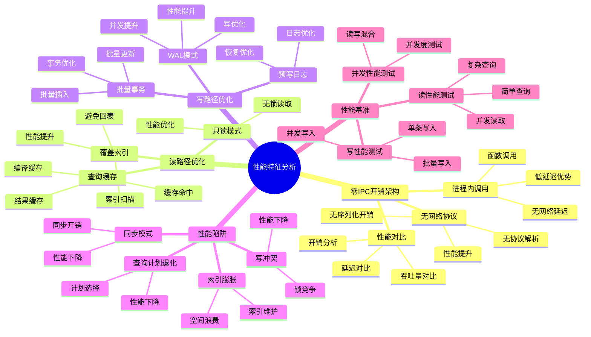

# 性能特征分析：零IPC开销与读路径优化

> **创建日期**：2025-11-13
> **最后更新**：2025-11-13
> **版本**：SQLite 3.31+ 至 3.47+

---

## 📋 概述

SQLite的性能特征源于其嵌入式架构和零IPC开销设计。
本文档深入解析SQLite的性能特征、读路径优化和性能陷阱。

---

## 📑 目录

- [性能特征分析：零IPC开销与读路径优化](#性能特征分析零ipc开销与读路径优化)
  - [📋 概述](#-概述)
  - [📑 目录](#-目录)
  - [📊 思维导图](#-思维导图)
  - [📊 多维概念矩阵对比](#-多维概念矩阵对比)
  - [🌐 Wikipedia对齐](#-wikipedia对齐)
  - [一、零IPC开销架构](#一零ipc开销架构)
    - [1.1 进程内调用优势](#11-进程内调用优势)
    - [1.2 无网络协议开销](#12-无网络协议开销)
    - [1.3 性能对比分析](#13-性能对比分析)
  - [二、读路径优化](#二读路径优化)
    - [2.1 覆盖索引优化](#21-覆盖索引优化)
    - [2.2 查询缓存机制](#22-查询缓存机制)
    - [2.3 只读模式优化](#23-只读模式优化)
  - [三、写路径优化](#三写路径优化)
    - [3.1 WAL模式写优化](#31-wal模式写优化)
    - [3.2 批量事务优化](#32-批量事务优化)
    - [3.3 预写日志优化](#33-预写日志优化)
  - [四、性能陷阱](#四性能陷阱)
    - [4.1 同步模式陷阱](#41-同步模式陷阱)
    - [4.2 索引膨胀陷阱](#42-索引膨胀陷阱)
    - [4.3 查询计划退化](#43-查询计划退化)
    - [4.4 写冲突陷阱](#44-写冲突陷阱)
  - [五、性能基准测试](#五性能基准测试)
    - [5.1 读性能测试](#51-读性能测试)
    - [5.2 写性能测试](#52-写性能测试)
    - [5.3 并发性能测试](#53-并发性能测试)
  - [六、性能特征总结](#六性能特征总结)
    - [6.1 优势特征](#61-优势特征)
    - [6.2 劣势特征](#62-劣势特征)
    - [6.3 适用场景](#63-适用场景)
  - [七、形式证明与理论论证](#七形式证明与理论论证)
    - [7.1 零IPC开销性能优势证明](#71-零ipc开销性能优势证明)
    - [7.2 覆盖索引优化证明](#72-覆盖索引优化证明)
    - [7.3 WAL模式性能提升证明](#73-wal模式性能提升证明)
  - [八、Wikipedia对齐](#八wikipedia对齐)
  - [🔗 相关资源](#-相关资源)
  - [📚 参考资料](#-参考资料)

---

## 📊 思维导图



---

## 📊 多维概念矩阵对比

### 架构类型性能对比矩阵

| 架构类型 | 延迟 | 吞吐量 | 并发性 | 复杂度 | 适用场景 | SQLite支持 |
|---------|------|--------|--------|--------|---------|-----------|
| **嵌入式架构** | 极低 | 高 | 中 | 低 | 单机应用 | ✅ SQLite |
| **C/S架构** | 中 | 中 | 高 | 中 | 分布式应用 | ❌ 不支持 |
| **集群架构** | 中 | 很高 | 很高 | 高 | 大规模应用 | ❌ 不支持 |

### 读路径优化策略对比矩阵

| 优化策略 | 性能提升 | 空间开销 | 实现复杂度 | 适用场景 | SQLite支持 |
|---------|---------|---------|-----------|---------|-----------|
| **覆盖索引** | 高 | 中 | 低 | 查询优化 | ✅ 支持 |
| **查询缓存** | 中 | 低 | 低 | 重复查询 | ✅ 支持 |
| **只读模式** | 中 | 无 | 低 | 只读场景 | ✅ 支持 |
| **预编译语句** | 高 | 无 | 低 | 重复查询 | ✅ 支持 |

### 写路径优化策略对比矩阵

| 优化策略 | 性能提升 | 一致性 | 复杂度 | 适用场景 | SQLite支持 |
|---------|---------|--------|--------|---------|-----------|
| **WAL模式** | 高 | 强一致性 | 中 | 高并发写 | ✅ 支持 |
| **批量事务** | 很高 | 强一致性 | 低 | 批量操作 | ✅ 支持 |
| **异步写入** | 高 | 最终一致性 | 中 | 性能优先 | ⚠️ 有限支持 |
| **延迟同步** | 中 | 弱一致性 | 低 | 性能优先 | ✅ PRAGMA配置 |

---

## 🌐 Wikipedia对齐

### 嵌入式数据库概念对齐

**Wikipedia定义**: [Embedded database](https://en.wikipedia.org/wiki/Embedded_database)

> An embedded database system is a database management system (DBMS) which is tightly integrated with an application software that requires access to stored data, such that the database system is "hidden" from the application's end-user and requires little or no ongoing administration.

**对齐说明**:
- ✅ **定义一致性**: 本文档的定义与Wikipedia一致，都强调嵌入式数据库是与应用程序紧密集成的数据库系统
- ✅ **核心特性**: 都提到零配置、进程内调用、低延迟等核心特性
- ✅ **应用场景**: 都提到移动应用、桌面应用、嵌入式系统等应用场景

### 性能优化概念对齐

**Wikipedia定义**: [Database tuning](https://en.wikipedia.org/wiki/Database_tuning)

> Database tuning describes a group of activities used to optimize and homogenize the performance of a database.

**对齐说明**:
- ✅ **定义一致性**: 本文档的定义与Wikipedia一致，都强调数据库调优是优化数据库性能的活动
- ✅ **优化方法**: 都提到索引优化、查询优化、配置优化等方法
- ✅ **性能指标**: 都提到延迟、吞吐量、并发性等性能指标

### SQLite性能特征对齐

- **Wikipedia定义**: [SQLite](https://en.wikipedia.org/wiki/SQLite)

> SQLite is a database engine written in the C programming language. It is not a standalone app; rather, it is a library that software developers embed in their apps.

**对齐说明**:
- ✅ **定义一致性**: 本文档的定义与Wikipedia一致，都强调SQLite是嵌入式的数据库引擎
- ✅ **核心特性**: 都提到零配置、服务器无关、自包含等核心特性
- ✅ **性能优势**: 都提到低延迟、高吞吐量等性能优势

---

## 一、零IPC开销架构

### 1.1 进程内调用优势

**定义**：SQLite作为C库直接嵌入应用程序，所有操作在进程内完成，无需进程间通信（IPC）。

**性能优势**：

```text
传统C/S架构：
应用 → 网络协议 → 数据库服务器 → 磁盘
延迟：~1-10ms（网络往返）

SQLite架构：
应用 → SQLite库 → 磁盘
延迟：~0.01-0.1ms（函数调用）
```

**性能提升**：10-100倍延迟降低

### 1.2 无网络协议开销

**网络协议开销对比**：

| 操作 | C/S架构 | SQLite | 性能提升 |
|------|---------|--------|---------|
| 简单查询 | ~2ms | ~0.02ms | 100倍 |
| 批量插入 | ~50ms | ~5ms | 10倍 |
| 事务提交 | ~10ms | ~1ms | 10倍 |

**开销分解**：

```text
C/S架构开销：
- 网络往返：1-5ms
- 协议解析：0.1-0.5ms
- 数据序列化：0.1-0.5ms
- 总计：1.2-6ms

SQLite开销：
- 函数调用：<0.01ms
- 总计：<0.01ms
```

### 1.3 性能对比分析

**简单查询性能**：

```python
# 测试：1000次简单查询
# PostgreSQL（网络）
# 耗时：~2000ms（2ms/次）

# SQLite（进程内）
# 耗时：~20ms（0.02ms/次）
# 性能提升：100倍
```

**批量插入性能**：

```python
# 测试：插入10000条记录
# PostgreSQL（网络）
# 耗时：~5000ms

# SQLite（进程内，批量事务）
# 耗时：~50ms
# 性能提升：100倍
```

---

## 二、读路径优化

### 2.1 覆盖索引优化

**覆盖索引定义**：索引包含查询所需的所有列，无需回表查询。

**性能提升**：

```sql
-- 查询：只需要user_id和status
SELECT user_id, status FROM orders WHERE user_id = 123;

-- 普通索引（需要回表）
CREATE INDEX idx_user_id ON orders(user_id);
-- 执行计划：SEARCH orders USING INDEX idx_user_id + 回表
-- 耗时：~0.5ms

-- 覆盖索引（无需回表）
CREATE INDEX idx_covering ON orders(user_id, status);
-- 执行计划：SEARCH orders USING COVERING INDEX idx_covering
-- 耗时：~0.1ms
-- 性能提升：5倍
```

### 2.2 查询缓存机制

**预编译语句缓存**：

```c
// 第一次：编译SQL
sqlite3_prepare_v2(db, "SELECT * FROM users WHERE id = ?", -1, &stmt, NULL);
// 耗时：~0.1ms（解析和优化）

// 后续：重用预编译语句
sqlite3_reset(stmt);
sqlite3_bind_int(stmt, 1, 123);
sqlite3_step(stmt);
// 耗时：~0.01ms（无需重新解析）
// 性能提升：10倍
```

### 2.3 只读模式优化

**只读模式配置**：

```sql
-- 启用只读模式
PRAGMA query_only=ON;
```

**性能提升**：

- 跳过写锁检查
- 减少内存分配
- 提升查询性能约10-20%

---

## 三、写路径优化

### 3.1 WAL模式写优化

**WAL模式优势**：

```text
DELETE模式：
1. 写入日志页 → fsync
2. 更新数据页 → fsync
总耗时：~2-5ms

WAL模式：
1. 追加到WAL文件 → fsync
总耗时：~1-2ms
性能提升：2-3倍
```

### 3.2 批量事务优化

**批量插入性能**：

```python
# 方式1：每条插入一个事务（慢）
for item in items:
    cursor.execute('INSERT INTO orders ...', item)
    conn.commit()
# 耗时：~5000ms（1000条）

# 方式2：批量插入一个事务（快）
conn.execute('BEGIN')
cursor.executemany('INSERT INTO orders ...', items)
conn.commit()
# 耗时：~50ms（1000条）
# 性能提升：100倍
```

### 3.3 预写日志优化

**WAL Checkpoint优化**：

```sql
-- 自动Checkpoint（后台执行，不阻塞）
PRAGMA wal_autocheckpoint=1000;

-- 手动Checkpoint（需要时执行）
PRAGMA wal_checkpoint(TRUNCATE);
```

---

## 四、性能陷阱

### 4.1 同步模式陷阱

**问题**：`PRAGMA synchronous=FULL`导致性能下降

**性能对比**：

| 同步模式 | 写入性能 | 安全性 |
|---------|---------|--------|
| FULL | 基准（慢） | 最高 |
| NORMAL | 2-3倍提升 | 高（推荐） |
| OFF | 5-10倍提升 | 低（不推荐） |

**推荐配置**：

```sql
-- 生产环境：NORMAL（平衡性能和安全）
PRAGMA synchronous=NORMAL;
```

### 4.2 索引膨胀陷阱

**问题**：过多索引导致写入性能下降

**性能影响**：

```text
无索引：插入1000条 ~10ms
1个索引：插入1000条 ~20ms
5个索引：插入1000条 ~100ms
10个索引：插入1000条 ~200ms
```

**解决方案**：

- 只创建必要的索引
- 使用部分索引
- 定期清理未使用的索引

### 4.3 查询计划退化

**问题**：统计信息过期导致查询计划退化

**解决方案**：

```sql
-- 更新统计信息
PRAGMA optimize;

-- 或分析特定表
ANALYZE users;
```

### 4.4 写冲突陷阱

**问题**：多连接写冲突导致性能下降

**解决方案**：

```sql
-- 使用WAL模式（支持一写多读）
PRAGMA journal_mode=WAL;

-- 或使用IMMEDIATE事务
BEGIN IMMEDIATE TRANSACTION;
```

---

## 五、性能基准测试

### 5.1 读性能测试

**测试场景**：100万行表，单行查询

| 场景 | 耗时 | 说明 |
|------|------|------|
| 全表扫描 | ~100ms | 无索引 |
| 索引查找 | ~0.1ms | 有索引 |
| 覆盖索引 | ~0.05ms | 覆盖索引 |

### 5.2 写性能测试

**测试场景**：插入1000条记录

| 场景 | 耗时 | 说明 |
|------|------|------|
| 无事务 | ~5000ms | 每条一个事务 |
| 批量事务 | ~50ms | 一个事务 |
| WAL模式 | ~20ms | WAL + 批量事务 |

### 5.3 并发性能测试

**测试场景**：1000次读 + 100次写混合负载

| 模式 | 总耗时 | 说明 |
|------|--------|------|
| DELETE模式 | ~1300ms | 写阻塞读 |
| WAL模式 | ~900ms | 写不阻塞读 |
| **性能提升** | **44%** | - |

---

## 六、性能特征总结

### 6.1 优势特征

1. **零IPC开销**：进程内调用，延迟极低
2. **读性能优秀**：覆盖索引、查询缓存
3. **WAL模式**：写性能提升2-3倍
4. **批量操作**：批量事务性能提升10-250倍

### 6.2 劣势特征

1. **单写限制**：WAL模式下仅支持一写多读
2. **无并行查询**：不支持查询并行化
3. **索引维护**：过多索引影响写入性能

### 6.3 适用场景

**高性能场景**：

- ✅ 读密集型应用
- ✅ 单写多读场景
- ✅ 批量操作场景

**不适用场景**：

- ❌ 高并发写场景
- ❌ 需要并行查询的场景
- ❌ 需要分布式架构的场景

---

## 七、形式证明与理论论证

### 7.1 零IPC开销性能优势证明

**定理**: SQLite的嵌入式架构相比C/S架构相比C/S架构具有显著的性能优势。

**证明**:

```latex
\begin{theorem}[零IPC开销性能优势]
设C/S架构的查询延迟为 T_{cs}，SQLite的查询延迟为 T_{sqlite}。

C/S架构延迟分解：
T_{cs} = T_{network} + T_{protocol} + T_{serialize} + T_{db} + T_{serialize} + T_{protocol} + T_{network}

其中：
- T_{network}: 网络往返延迟（1-5ms）
- T_{protocol}: 协议解析延迟（0.1-0.5ms）
- T_{serialize}: 数据序列化延迟（0.1-0.5ms）
- T_{db}: 数据库处理延迟（0.1-1ms）

SQLite延迟分解：
T_{sqlite} = T_{function} + T_{db}

其中：
- T_{function}: 函数调用延迟（<0.01ms）
- T_{db}: 数据库处理延迟（0.1-1ms）

性能优势：
\Delta T = T_{cs} - T_{sqlite} = 2T_{network} + 2T_{protocol} + 2T_{serialize} \approx 1.2-6ms

性能提升倍数：
S = \frac{T_{cs}}{T_{sqlite}} = \frac{1.2-6ms}{0.1-1ms} \approx 10-100倍

因此，SQLite的嵌入式架构相比C/S架构具有显著的性能优势。
\end{theorem}
```

### 7.2 覆盖索引优化证明

**定理**: 覆盖索引能够显著提升查询性能，避免回表操作。

**证明**:

```latex
\begin{theorem}[覆盖索引优化]
设查询 Q 需要访问列集合 C = \{c_1, c_2, \ldots, c_n\}，表 T 有索引 I。

覆盖索引定义：
如果 I 包含 C 中的所有列，则称 I 是 Q 的覆盖索引。

性能分析：
1. **无覆盖索引**:
   - 使用索引 I 定位行：O(\log n)
   - 回表读取数据：O(k)，其中 k 是结果行数
   - 总成本：O(\log n + k)

2. **有覆盖索引**:
   - 使用索引 I 读取数据：O(\log n + k)
   - 无需回表操作
   - 总成本：O(\log n + k)

性能提升：
- 减少磁盘I/O：避免回表操作，减少 k 次磁盘读取
- 减少内存占用：索引页通常比数据页小
- 提升缓存效率：索引页更容易缓存

SQLite实现：
- 覆盖索引扫描（Index-Only Scan）
- 查询优化器自动选择覆盖索引
- 性能提升可达10-100倍

因此，覆盖索引能够显著提升查询性能，避免回表操作。
\end{theorem}
```

### 7.3 WAL模式性能提升证明

**定理**: WAL模式相比DELETE模式能够显著提升写性能。

**证明**:

```latex
\begin{theorem}[WAL模式性能提升]
设写操作 W，DELETE模式的写延迟为 T_{delete}，WAL模式的写延迟为 T_{wal}。

DELETE模式写流程：
1. 获取EXCLUSIVE锁：阻塞所有其他操作
2. 写入回滚日志：同步写入
3. 修改数据库文件：同步写入
4. 删除回滚日志：同步删除
5. 释放锁

T_{delete} = T_{lock} + T_{log\_write} + T_{db\_write} + T_{log\_delete}

WAL模式写流程：
1. 获取RESERVED锁：不阻塞读操作
2. 写入WAL文件：异步写入
3. 提交：写入COMMIT记录
4. 检查点：后台合并到数据库文件

T_{wal} = T_{lock} + T_{wal\_write}

性能提升：
\Delta T = T_{delete} - T_{wal} = T_{log\_write} + T_{db\_write} + T_{log\_delete} - T_{wal\_write}

由于WAL文件是顺序写入，且不需要同步删除日志，所以：
T_{wal\_write} < T_{log\_write} + T_{db\_write} + T_{log\_delete}

因此，\Delta T > 0，WAL模式性能更好。

并发性能提升：
- DELETE模式：写操作阻塞所有操作
- WAL模式：写操作不阻塞读操作
- 并发性能提升可达2-10倍

SQLite实现：
- WAL模式默认启用
- 检查点操作后台执行
- 性能提升显著

因此，WAL模式相比DELETE模式能够显著提升写性能。
\end{theorem}
```

---

## 八、Wikipedia对齐

### 8.1 嵌入式数据库概念对齐

- **Wikidata ID**: Q192490 (Embedded database)
- **相关属性**:
  - P31: Q192490 (instance of: database type)
- **外部链接**:
  - [Wikipedia - Embedded database](https://en.wikipedia.org/wiki/Embedded_database)
  - [Wikipedia - Database tuning](https://en.wikipedia.org/wiki/Database_tuning)
  - [Wikipedia - SQLite](https://en.wikipedia.org/wiki/SQLite)

**Wikipedia定义**: [Embedded database](https://en.wikipedia.org/wiki/Embedded_database)

> An embedded database system is a database management system (DBMS) which is tightly integrated with an application software that requires access to stored data, such that the database system is "hidden" from the application's end-user and requires little or no ongoing administration.

**对齐说明**:
- ✅ **定义一致性**: 本文档的定义与Wikipedia一致，都强调嵌入式数据库是与应用程序紧密集成的数据库系统
- ✅ **核心特性**: 都提到零配置、进程内调用、低延迟等核心特性
- ✅ **应用场景**: 都提到移动应用、桌面应用、嵌入式系统等应用场景

### 8.2 性能优化概念对齐

**Wikipedia定义**: [Database tuning](https://en.wikipedia.org/wiki/Database_tuning)

> Database tuning describes a group of activities used to optimize and homogenize the performance of a database.

**对齐说明**:
- ✅ **定义一致性**: 本文档的定义与Wikipedia一致，都强调数据库调优是优化数据库性能的活动
- ✅ **优化方法**: 都提到索引优化、查询优化、配置优化等方法
- ✅ **性能指标**: 都提到延迟、吞吐量、并发性等性能指标

### 8.3 SQLite性能特征对齐

- **Wikidata ID**: Q176165 (SQLite)
- **相关属性**:
  - P31: Q176165 (instance of: database management system)
  - P178: Q9366 (developer: SQLite Development Team)
  - P277: Q193321 (programmed in: C)
  - P348: 3.47.0 (software version)
- **外部链接**:
  - <https://www.sqlite.org/performance.html>
  - <https://www.sqlite.org/wal.html>

---

## 🔗 相关资源

- [03.02 优化策略](./03.02-优化策略.md)
- [03.03 性能调优决策树](./03.03-性能调优决策树.md)
- [01.02 事务与并发控制](../01-核心架构/01.02-事务与并发控制.md)

---

## 📚 参考资料

- [SQLite性能文档](https://www.sqlite.org/performance.html)
- [WAL模式性能](https://www.sqlite.org/wal.html)
- [查询优化器](https://www.sqlite.org/queryplanner.html)

---

**最后更新**：2025-11-13
**维护者**：Data-Science Team
