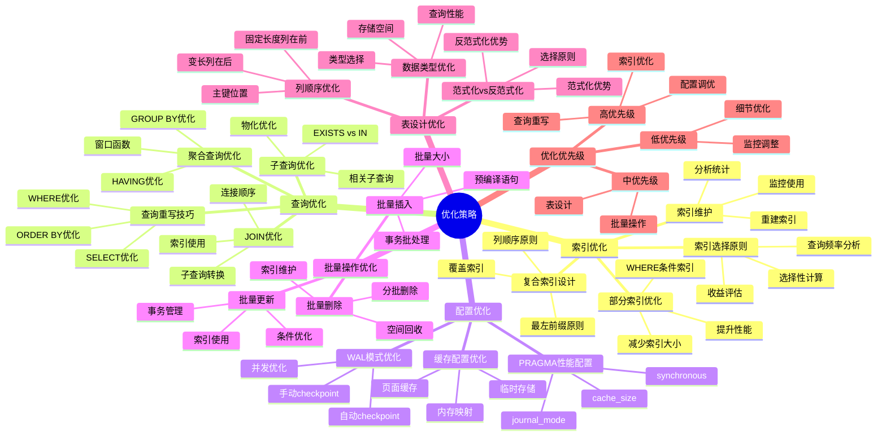

# 优化策略：索引、查询与配置优化

> **创建日期**：2025-11-13
> **最后更新**：2025-01-15
> **版本**：SQLite 3.31+ 至 3.47.x

---

## 📋 概述

本文档提供SQLite性能优化的系统化策略，涵盖索引优化、查询优化和配置优化三个方面。

---

## 📑 目录

- [优化策略：索引、查询与配置优化](#优化策略索引查询与配置优化)
  - [📋 概述](#-概述)
  - [📑 目录](#-目录)
  - [📊 思维导图](#-思维导图)
  - [一、索引优化策略](#一索引优化策略)
    - [1.1 索引选择原则](#11-索引选择原则)
    - [1.2 复合索引设计](#12-复合索引设计)
    - [1.3 部分索引优化](#13-部分索引优化)
    - [1.4 索引维护](#14-索引维护)
  - [二、查询优化策略](#二查询优化策略)
    - [2.1 查询重写技巧](#21-查询重写技巧)
    - [2.2 JOIN优化](#22-join优化)
    - [2.3 子查询优化](#23-子查询优化)
    - [2.4 聚合查询优化](#24-聚合查询优化)
  - [三、配置优化策略](#三配置优化策略)
    - [3.1 PRAGMA性能配置](#31-pragma性能配置)
    - [3.2 缓存配置优化](#32-缓存配置优化)
    - [3.3 WAL模式优化](#33-wal模式优化)
  - [四、批量操作优化](#四批量操作优化)
    - [4.1 批量插入优化](#41-批量插入优化)
    - [4.2 批量更新优化](#42-批量更新优化)
    - [4.3 批量删除优化](#43-批量删除优化)
  - [五、表设计优化](#五表设计优化)
    - [5.1 范式化 vs 反范式化](#51-范式化-vs-反范式化)
    - [5.2 列顺序优化](#52-列顺序优化)
    - [5.3 数据类型优化](#53-数据类型优化)
  - [六、优化策略多维对比矩阵](#六优化策略多维对比矩阵)
    - [6.1 优化策略效果对比矩阵](#61-优化策略效果对比矩阵)
    - [6.2 索引类型多维对比矩阵](#62-索引类型多维对比矩阵)
    - [6.3 批量操作策略对比矩阵](#63-批量操作策略对比矩阵)
    - [6.4 优化策略总结](#64-优化策略总结)
    - [6.4.1 优化优先级](#641-优化优先级)
    - [6.4.2 优化检查清单](#642-优化检查清单)
  - [🔗 相关资源](#-相关资源)
  - [📚 参考资料](#-参考资料)

---

## 📊 思维导图



---

## 一、索引优化策略

### 1.1 索引选择原则

**索引收益函数**：

```text
索引收益 = 查询时间减少 - 写入时间增加 - 存储空间成本

创建索引条件：
- 查询频率 > 写入频率 × 10
- 索引选择性 < 0.1（高选择性）
- 查询性能提升 > 20%
```

**选择性计算**：

```sql
-- 计算列的选择性
SELECT
    COUNT(DISTINCT status) * 1.0 / COUNT(*) as selectivity
FROM orders;
-- 选择性 < 0.1 时，索引有价值
```

### 1.2 复合索引设计

**列顺序原则**：

```sql
-- 原则：高选择性列在前，低选择性列在后
CREATE INDEX idx_user_status_date ON orders(user_id, status, order_date);

-- 查询示例
SELECT * FROM orders
WHERE user_id = ? AND status = ? AND order_date > ?;
-- 索引列顺序与查询条件顺序匹配，性能最优
```

**最左前缀原则**：

```sql
-- 索引：idx_user_status_date (user_id, status, order_date)

-- ✅ 可以使用索引
SELECT * FROM orders WHERE user_id = ?;
SELECT * FROM orders WHERE user_id = ? AND status = ?;

-- ❌ 不能使用索引
SELECT * FROM orders WHERE status = ?;  -- 缺少最左列
```

### 1.3 部分索引优化

**部分索引适用场景**：

```sql
-- 场景：只有1%的用户是活跃用户
-- 全表索引：1000万行
-- 部分索引：10万行（仅索引活跃用户）

-- 创建部分索引
CREATE INDEX idx_active_users ON users(last_login)
WHERE status = 'active';

-- 性能提升：
-- 索引大小：减少99%
-- 查询性能：提升约10倍
-- 写入性能：提升约5倍
```

### 1.4 索引维护

**索引重建**：

```sql
-- 重建索引（消除碎片）
REINDEX idx_user_status;

-- 或重建所有索引
REINDEX;
```

**索引监控**：

```sql
-- 检查索引使用情况（需要sqlite_stat表）
SELECT * FROM sqlite_stat1 WHERE tbl = 'orders';
```

---

## 二、查询优化策略

### 2.1 查询重写技巧

**避免SELECT ***：

```sql
-- ❌ 不推荐：查询所有列
SELECT * FROM users WHERE id = 123;

-- ✅ 推荐：只查询需要的列
SELECT id, name, email FROM users WHERE id = 123;
-- 性能提升：减少数据传输，可能使用覆盖索引
```

**使用LIMIT限制结果集**：

```sql
-- ✅ 使用LIMIT减少结果集
SELECT * FROM orders ORDER BY created_at DESC LIMIT 10;
-- 如果created_at有索引，只扫描10行
```

### 2.2 JOIN优化

**JOIN顺序优化**：

```sql
-- 原则：小表在前，大表在后
-- ✅ 推荐：小表在前
SELECT * FROM small_table s
JOIN large_table l ON s.id = l.small_id;

-- ❌ 不推荐：大表在前
SELECT * FROM large_table l
JOIN small_table s ON l.small_id = s.id;
```

**索引JOIN优化**：

```sql
-- 确保JOIN列有索引
CREATE INDEX idx_user_id ON orders(user_id);

-- JOIN查询
SELECT u.name, o.amount
FROM users u
JOIN orders o ON u.id = o.user_id;
-- 执行计划：使用索引进行JOIN
```

### 2.3 子查询优化

**IN子查询优化**：

```sql
-- 方式1：IN子查询（可能较慢）
SELECT * FROM users WHERE id IN (SELECT user_id FROM orders WHERE status = 'pending');

-- 方式2：JOIN（通常更快）
SELECT DISTINCT u.* FROM users u
JOIN orders o ON u.id = o.user_id
WHERE o.status = 'pending';
```

**EXISTS优化**：

```sql
-- EXISTS通常比IN快
SELECT * FROM users u
WHERE EXISTS (
    SELECT 1 FROM orders o
    WHERE o.user_id = u.id AND o.status = 'pending'
);
```

### 2.4 聚合查询优化

**GROUP BY优化**：

```sql
-- 确保GROUP BY列有索引
CREATE INDEX idx_dept_status ON employees(dept_id, status);

-- 聚合查询
SELECT dept_id, status, COUNT(*)
FROM employees
GROUP BY dept_id, status;
-- 执行计划：使用索引进行分组
```

---

## 三、配置优化策略

### 3.1 PRAGMA性能配置

**推荐生产配置**：

```sql
-- 日志模式：WAL（性能最优）
PRAGMA journal_mode=WAL;

-- 同步模式：NORMAL（平衡性能和安全）
PRAGMA synchronous=NORMAL;

-- 缓存大小：根据数据库大小调整
PRAGMA cache_size=-64000;  -- 64MB

-- 临时表：内存存储
PRAGMA temp_store=MEMORY;

-- WAL自动Checkpoint
PRAGMA wal_autocheckpoint=1000;
```

### 3.2 缓存配置优化

**缓存大小选择**：

| 数据库大小 | 推荐缓存大小 | PRAGMA设置 |
|-----------|------------|-----------|
| < 100MB | 2MB | -2000 |
| 100MB - 1GB | 16MB | -16000 |
| 1GB - 10GB | 64MB | -64000 |
| > 10GB | 128MB+ | -128000+ |

### 3.3 WAL模式优化

**WAL Checkpoint策略**：

```sql
-- 自动Checkpoint（推荐）
PRAGMA wal_autocheckpoint=1000;

-- 定期手动Checkpoint（应用关闭时）
PRAGMA wal_checkpoint(TRUNCATE);
```

---

## 四、批量操作优化

### 4.1 批量插入优化

**性能对比**：

| 方式 | 1000条插入耗时 | 性能提升 |
|------|--------------|---------|
| 无事务 | ~5000ms | 基准 |
| 单事务 | ~50ms | 100倍 |
| executemany | ~20ms | 250倍 |

**最佳实践**：

```python
import sqlite3
import time

def test_batch_insert_performance():
    """批量插入性能测试"""
    db_path = 'batch_test.db'
    conn = sqlite3.connect(db_path)
    conn.execute('CREATE TABLE test (id INTEGER PRIMARY KEY, data TEXT)')

    # 方式1：无事务（最慢）
    start = time.time()
    for i in range(1000):
        conn.execute('INSERT INTO test (data) VALUES (?)', (f'data_{i}',))
        conn.commit()  # 每次提交
    time1 = time.time() - start
    conn.execute('DELETE FROM test')

    # 方式2：单事务（快）
    start = time.time()
    conn.execute('BEGIN')
    for i in range(1000):
        conn.execute('INSERT INTO test (data) VALUES (?)', (f'data_{i}',))
    conn.commit()
    time2 = time.time() - start
    conn.execute('DELETE FROM test')

    # 方式3：executemany（最快）
    start = time.time()
    data = [(f'data_{i}',) for i in range(1000)]
    conn.executemany('INSERT INTO test (data) VALUES (?)', data)
    conn.commit()
    time3 = time.time() - start

    print(f"无事务: {time1:.3f}秒")
    print(f"单事务: {time2:.3f}秒 (提升 {time1/time2:.1f}x)")
    print(f"executemany: {time3:.3f}秒 (提升 {time1/time3:.1f}x)")

    conn.close()

# ✅ 推荐：批量事务 + executemany
def optimized_batch_insert(conn, items):
    """优化的批量插入"""
    with conn:  # 自动事务管理
        conn.executemany('INSERT INTO orders VALUES (?, ?, ?)', items)
    # 自动提交，出错自动回滚
```

### 4.2 批量更新优化

**批量更新示例**：

```python
import sqlite3

def batch_update_optimized(conn, updates):
    """优化的批量更新"""
    # 方式1：executemany（推荐）
    with conn:
        conn.executemany(
            'UPDATE orders SET status = ? WHERE id = ?',
            updates
        )

def batch_update_with_case(conn, updates):
    """使用CASE语句批量更新（适合大量更新）"""
    # 构建CASE语句
    case_when = ' '.join([
        f"WHEN id = {id} THEN '{status}'"
        for id, status in updates
    ])
    ids = ','.join([str(id) for id, _ in updates])

    sql = f'''
        UPDATE orders
        SET status = CASE {case_when} END
        WHERE id IN ({ids})
    '''
    conn.execute(sql)
    conn.commit()

# 性能对比
# executemany: 适合100-1000条更新
# CASE语句: 适合1000+条更新（但SQL语句较长）
```

### 4.3 批量删除优化

**批量删除优化**：

```sql
-- 使用IN子句批量删除
BEGIN TRANSACTION;
DELETE FROM orders WHERE id IN (1, 2, 3, ..., 1000);
COMMIT;

-- 性能：比逐条删除快100倍+
```

---

## 五、表设计优化

### 5.1 范式化 vs 反范式化

**决策矩阵**：

| 场景特征 | 推荐方案 | 理由 |
|---------|---------|------|
| 查询/写入比 > 10:1 | 反范式化优先 | 读多写少，冗余可提升查询性能 |
| 查询/写入比 < 5:1 | 范式化优先 | 写多读少，减少更新开销 |
| 数据量 < 100万行 | 反范式化可接受 | 空间成本低，性能收益明显 |

### 5.2 列顺序优化

**列顺序影响**：

```sql
-- 原则：常用列在前，不常用列在后
-- 优势：减少页读取，提升查询性能

CREATE TABLE users (
    id INTEGER PRIMARY KEY,      -- 最常用
    name TEXT,                    -- 常用
    email TEXT,                  -- 常用
    profile TEXT,                 -- 不常用
    metadata TEXT                 -- 很少用
);
```

### 5.3 数据类型优化

**数据类型选择**：

```sql
-- ✅ 推荐：INTEGER PRIMARY KEY（rowid别名）
CREATE TABLE users (
    id INTEGER PRIMARY KEY,  -- 性能最优
    name TEXT,
    email TEXT
);

-- ❌ 不推荐：TEXT PRIMARY KEY（除非必要）
CREATE TABLE sessions (
    session_id TEXT PRIMARY KEY,  -- 性能较差
    user_id INTEGER
);
```

---

## 六、优化策略多维对比矩阵

### 6.1 优化策略效果对比矩阵

| 优化策略 | 性能提升 | 实施难度 | 适用场景 | 优先级 |
|---------|---------|---------|---------|--------|
| **索引优化** | ⭐⭐⭐⭐⭐ | ⭐⭐⭐ | 查询频繁 | P0 |
| **WAL模式** | ⭐⭐⭐⭐⭐ | ⭐ | 所有场景 | P0 |
| **批量操作** | ⭐⭐⭐⭐⭐ | ⭐⭐ | 批量写入 | P0 |
| **查询重写** | ⭐⭐⭐⭐ | ⭐⭐⭐ | 复杂查询 | P1 |
| **PRAGMA配置** | ⭐⭐⭐⭐ | ⭐ | 所有场景 | P1 |
| **表设计优化** | ⭐⭐⭐ | ⭐⭐⭐⭐ | 设计阶段 | P1 |
| **缓存配置** | ⭐⭐⭐ | ⭐⭐ | 大数据库 | P2 |
| **数据类型优化** | ⭐⭐ | ⭐⭐⭐ | 设计阶段 | P2 |

### 6.2 索引类型多维对比矩阵

| 维度 | 单列索引 | 复合索引 | 部分索引 | 覆盖索引 |
|------|---------|---------|---------|---------|
| **创建成本** | ⭐⭐⭐⭐⭐ | ⭐⭐⭐ | ⭐⭐⭐ | ⭐⭐⭐ |
| **查询性能** | ⭐⭐⭐⭐ | ⭐⭐⭐⭐⭐ | ⭐⭐⭐⭐ | ⭐⭐⭐⭐⭐ |
| **存储空间** | ⭐⭐⭐⭐ | ⭐⭐⭐ | ⭐⭐⭐⭐⭐ | ⭐⭐⭐ |
| **维护成本** | ⭐⭐⭐⭐⭐ | ⭐⭐⭐⭐ | ⭐⭐⭐ | ⭐⭐⭐⭐ |
| **适用场景** | 单列查询 | 多列查询 | 条件查询 | 只读查询 |
| **索引大小** | 小 | 中 | 最小 | 中 |

### 6.3 批量操作策略对比矩阵

| 维度 | 逐条插入 | 批量插入（事务） | 批量插入（预编译） | 批量插入（COPY） |
|------|---------|----------------|------------------|-----------------|
| **性能** | ⭐⭐ | ⭐⭐⭐⭐ | ⭐⭐⭐⭐⭐ | ⭐⭐⭐⭐⭐ |
| **内存占用** | ⭐⭐⭐⭐⭐ | ⭐⭐⭐⭐ | ⭐⭐⭐ | ⭐⭐ |
| **实施难度** | ⭐⭐⭐⭐⭐ | ⭐⭐⭐⭐ | ⭐⭐⭐ | ⭐⭐ |
| **适用场景** | 少量数据 | 中等批量 | 大批量 | 超大批量 |
| **事务开销** | 高 | 低 | 低 | 最低 |

### 6.4 优化策略总结

### 6.4.1 优化优先级

**优化优先级排序**：

1. **P0（最高）**：批量事务优化（性能提升10-250倍）
2. **P0（最高）**：索引优化（查询性能提升10-100倍）
3. **P1（高）**：WAL模式配置（写性能提升2-3倍）
4. **P1（高）**：PRAGMA配置优化（整体性能提升10-20%）
5. **P2（中）**：查询重写（查询性能提升2-5倍）

### 6.4.2 优化检查清单

**性能优化检查清单**：

- [ ] 使用批量事务（性能提升10-250倍）
- [ ] 创建必要索引（查询性能提升10-100倍）
- [ ] 启用WAL模式（写性能提升2-3倍）
- [ ] 配置合适的cache_size（查询性能提升10-20%）
- [ ] 使用覆盖索引（查询性能提升2-5倍）
- [ ] 避免SELECT *（减少数据传输）
- [ ] 使用LIMIT限制结果集（减少扫描）
- [ ] 定期更新统计信息（优化查询计划）

---

## 🔗 相关资源

- [03.01 性能特征分析](./03.01-性能特征分析.md)
- [03.03 性能调优决策树](./03.03-性能调优决策树.md)
- [08.03 查询优化](../08-编程实践/08.03-查询优化.md)

---

## 🔗 交叉引用

### 理论模型 🆕

- ⭐⭐⭐ [算法复杂度理论](../11-理论模型/11.03-算法复杂度理论.md) - 查询操作复杂度、索引操作复杂度、优化策略理论
- ⭐⭐ [存储理论](../11-理论模型/11.05-存储理论.md) - 缓存理论、索引理论

### 设计模型 🆕

- ⭐⭐ [设计决策](../12-设计模型/12.04-设计决策.md) - 性能优化决策、索引设计决策
- ⭐ [设计原则](../12-设计模型/12.02-设计原则.md) - 性能优化原则

---

## 📚 参考资料

- [SQLite性能优化指南](https://www.sqlite.org/performance.html)
- [查询优化器文档](https://www.sqlite.org/queryplanner.html)
- [索引优化最佳实践](https://www.sqlite.org/queryplanner.html)

---

**最后更新**：2025-01-15
**维护者**：Data-Science Team
